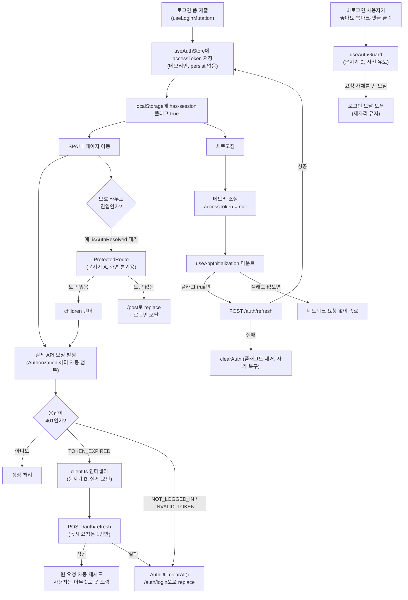

# 인증·세션·토큰 갱신

> 독립 기능 문서(서사형)입니다.
> 대상 독자: 이 레포의 인증 코드를 처음 보거나, 인증 관련 화면/코드에서 이상한 동작을 발견해 원인을 추적해야 하는 개발자(AI 에이전트 포함).
> 읽고 나면: 로그인부터 로그아웃까지 상태가 어디에 저장되고 언제 사라지는지, 만료된 토큰이 왜 서로 다른 두 곳에서 두 번 처리되는지, 그중 어느 쪽이 실제 보안 경계인지 설명할 수 있게 됩니다.
> **마지막 검토**: 2026-09-09

---

## 1. 쉬운 설명

이 앱의 인증에는 성격이 다른 **세 개의 독립된 문지기**가 있습니다.

- **문지기 A (`ProtectedRoute`)**: 건물 로비에서 "출입증 있어요?"만 확인하는 안내데스크입니다. 진짜 보안은 안 하고, 있으면 통과시키고 없으면 "1층 로비(공개 피드)로 가서 출입증부터 받으세요"라고 안내만 합니다. 안내데스크를 그냥 지나쳐도 각 사무실 문(BE API)은 따로 잠겨 있습니다.
- **문지기 B (`client.ts`의 401 인터셉터)**: 각 사무실 문에 달린 진짜 자물쇠입니다. 출입증(액세스 토큰)이 만료됐으면 그 자리에서 조용히 새 출입증을 재발급받아(refresh) 문을 열어줍니다. 사용자는 문이 잠깐 안 열렸다는 것조차 눈치채지 못합니다. 재발급도 실패하면 그제서야 "퇴실 처리"(로그아웃)를 합니다.
- **문지기 C (`useAuthGuard`/`useProtectedNavigate`)**: 출입증이 아예 없는 방문객이 사무실 문을 두드리기 **전에** "먼저 출입증부터 받고 오세요"라며 접수처(로그인 모달)로 안내하는 안내원입니다. 문을 두드려서 거절당하는 민망함(에러 토스트, 페이지 이탈) 자체를 막아줍니다.

세 문지기는 서로의 존재를 모릅니다. A가 통과시켰다고 B가 안 잠그는 게 아니고, B가 열어준다고 A가 필요 없어지는 것도 아닙니다. **문지기 A는 로비 안내판일 뿐 보안 장치가 아니고, 실제 보안은 전부 문지기 B가 각 문 앞에서 합니다.** 이 구분을 놓치면 "A가 만료된 출입증을 그냥 통과시킨다"를 보안 구멍으로 오진하게 됩니다 — §10에서 실제로 그런 일이 있었습니다.



---

## 2. 전제 지식

이 문서는 다음을 이미 안다고 가정합니다: zustand 기본 사용법, React Query의 `useQuery`/`useMutation`, JWT가 무엇인지(payload에 `exp`가 있다는 정도).

가정하지 않는 것 — 필요하면 먼저 읽으세요:

- 이 레포의 3-Layer API 패턴(`*.api.ts` → `*.keys.ts` → `*.queries.ts`), Feature Hook 패턴 → [`docs/FE-ARCHITECTURE.md`](FE-ARCHITECTURE.md) §5·§6
- 히스토리 엔트리 기반 오버레이 관리(로그인 모달이 왜 `location.state`로 열림 상태를 관리하는지) → [`docs/DECISIONS.md`](DECISIONS.md)의 2026-08-07 항목
- 첫 로딩 성능 최적화로 인증 게이팅이 지금 형태가 된 배경 → [`docs/DECISIONS.md`](DECISIONS.md)의 2026-07-25 항목

---

## 3. 사용한 도구·기술

- **기능 자체**: zustand(persist 미들웨어 **의도적으로 미사용** — §6), React Query(계정 정보 캐시), 커스텀 `fetch` 기반 `ApiClient`(axios 아님, 자체 인터셉터 로직 직접 구현), httpOnly 쿠키(리프레시 토큰, BE가 설정·JS 접근 불가)
- **구현·검증 과정에서 쓴 도구**: MSW(`client.test.ts`가 401 응답을 흉내내 인터셉터를 검증), Vitest `vi.waitFor`(비동기 side-effect 검증)

---

## 4. 왜 만들었나

이 문서 이전에는 인증 아키텍처를 한눈에 설명하는 글이 없었고, 관련 결정들이 [`docs/DECISIONS.md`](DECISIONS.md)에 날짜별로 흩어져 있었습니다. 그 결과 2026-09-09, 어떤 세션이 `ProtectedRoute.tsx`의 만료 토큰 처리 로직(§8-A)만 보고 "만료된 토큰을 그대로 통과시키는 버그"로 결론 내렸습니다. 실제로는 `client.ts`의 반응형 인터셉터(§8-B)가 완전히 별개로 이미 그 상황을 처리하고 있었습니다 — 코드 관찰 자체는 정확했지만, 다른 레이어에 이미 있는 방어를 확인하지 않아 결론이 틀렸습니다. 재검증 과정과 정확한 결론은 §10에 전문을 남겼습니다.

이 문서의 목적은 "인증에는 책임이 분리된 여러 레이어가 있고, 한 레이어만 보고 전체를 판단하면 안 된다"는 걸 코드를 다시 뒤지지 않아도 알 수 있게 하는 것입니다.

---

## 5. 구조 — 세 개의 게이트

|               | 게이트 A: `ProtectedRoute`                             | 게이트 B: `client.ts` 인터셉터                | 게이트 C: `useAuthGuard`/`useProtectedNavigate`                      |
| ------------- | ------------------------------------------------------ | --------------------------------------------- | -------------------------------------------------------------------- |
| 위치          | `src/app/routes/ProtectedRoute.tsx`                    | `src/shared/api/client.ts:162-211`            | `src/entities/auth/hooks/useAuthGuard.ts`, `useProtectedNavigate.ts` |
| 판단 근거     | 클라이언트 로컬 상태(`useAuthStore.isAuthenticated`)만 | BE의 실제 401 응답 코드                       | 클라이언트 로컬 상태만                                               |
| BE와 통신     | 안 함(§8-A가 실질적으로 no-op이므로)                   | 함(`POST /auth/refresh`, 원 요청 재시도)      | 안 함(애초에 요청을 안 보냄)                                         |
| 발동 시점     | 보호 라우트가 **렌더**될 때                            | 실제 API 요청이 **401을 받은 뒤**             | 사용자가 **클릭**했을 때, 요청 전                                    |
| 책임          | 화면을 보여줄지 말지 분기, 스피너, 로그인 모달 유도    | 요청을 인증시켜 성공시키거나 세션을 끊음      | 실패할 게 뻔한 요청을 사전에 막고 로그인 유도                        |
| 실패 시 결과  | `/post`로 replace 이동(+ 조건부 모달)                  | `AuthUtil.clearAll()` → `/auth/login` replace | 로그인 모달(제자리 유지, 페이지 이동 없음)                           |
| **보안 효과** | **없음.** 우회해도 API가 401을 낸다                    | **실질적 보안 경계**                          | 없음(UX 편의)                                                        |

**왜 나뉘어 있나**: 게이트 A는 성능 결정([`docs/DECISIONS.md`](DECISIONS.md) 2026-07-25 항목)의 짝입니다 — `AuthProvider`가 라우터 렌더를 막지 않도록 바꾼 대가로, 복원이 끝나기 전 첫 페인트에서 로그인 사용자가 보호 페이지 새로고침 시 피드로 튕기는 걸 막는 화면 분기 장치로 도입됐습니다. 게이트 B는 "리프레시 토큰은 httpOnly라 JS가 존재·유효성을 전혀 모른다"는 사실에서 나옵니다 — 실제로 요청을 보내 401을 받아봐야 압니다. 게이트 C는 A·B 둘 다 못 막는 상황(비로그인 사용자가 공개 피드에 머문 채 좋아요를 누르는 것)을 막습니다: A는 페이지 단위라 이 상황에 개입 못 하고, B는 요청을 실제로 보내야 발동하는데 그러면 401 → `clearAll()` → 페이지 이탈로 사용자 문맥이 깨집니다.

### 라우트 그룹 구성 (`src/app/routes/index.tsx:88-164`)

```
RootLayout
├─ AppShellLayout (Public Content Group, 게이트 없음)   — /, /post, /post/:id
├─ ProtectedLayout = ProtectedRoute(게이트 A) + AppShellLayout   — /post/submit, /post/edit/:id, /bookmark
└─ GuestGuard + PublicLayout (Guest Only)   — /auth/login, /auth/sign-up
```

`ProtectedLayout.tsx:4-9`가 `ProtectedRoute`로 `AppShellLayout`을 감쌉니다. **이건 React Router의 레이아웃 라우트라, 보호 그룹 안에서 페이지를 오갈 때(`/post/submit` ↔ `/bookmark`)는 언마운트되지 않습니다.** 게이트 A가 실제로 재평가되는 유일한 순간은 공개/게스트 그룹에서 보호 그룹으로 **처음 진입**할 때뿐입니다 — 이 사실이 §8-A의 발동 범위를 이해하는 데 중요합니다.

`GuestGuard`(`routes/index.tsx:61-74`)는 반대 방향 가드입니다 — 로그인 상태로 `/auth/login`에 오면 이전 경로(`location.state.from.pathname`) 또는 `HOME`으로 돌려보냅니다.

---

## 6. 상태 모델

| 저장소                            | 키/필드                       | 값                          | 수명                       | JS 접근  |
| --------------------------------- | ----------------------------- | --------------------------- | -------------------------- | -------- |
| zustand `useAuthStore` (메모리만) | `accessToken`                 | JWT 문자열 또는 `null`      | 탭 수명(새로고침 시 소멸)  | 가능     |
| 〃                                | `isAuthenticated`             | `!!accessToken`과 항상 동치 | 〃                         | 가능     |
| 〃                                | `isAuthResolved`              | 복원 시도가 끝났는지        | 〃                         | 가능     |
| localStorage                      | `linksphere:auth:has-session` | **boolean 하나뿐**          | 영구(자가 복구, 아래 참고) | 가능     |
| localStorage                      | `linksphere:auth:saved-email` | 로그인 폼 "이메일 저장" 값  | 영구                       | 가능     |
| localStorage                      | `linksphere:auth:last-avatar` | 아바타 URL(선반입용)        | 영구(로그아웃 시 제거)     | 가능     |
| httpOnly 쿠키(BE 설정)            | refreshToken                  | 리프레시 토큰               | BE 정책                    | **불가** |

**절대 저장하지 않는 것**: 액세스 토큰(어떤 스토리지에도 없음, 메모리 전용), 리프레시 토큰(JS가 못 만짐), 계정 정보(React Query 캐시에만, `accountKeys.root`).

`useAuthStore`(`src/shared/store/auth.store.ts:41-63`)는 `devtools` 미들웨어만 쓰고 **`persist`가 없습니다 — 의도적입니다.** `accessToken`은 항상 `isAuthenticated`와 함께 `setAuth`/`clearAuth` 한 곳에서만 갱신되므로(`auth.store.ts:47-50`, `:56-60`) 두 값은 절대 어긋나지 않습니다. **이 등가성이 §8-A의 동작을 결정짓는 핵심 사실입니다.**

`linksphere:auth:has-session` 플래그(`auth.store.ts:16-19`)는 "세션이 있을 가능성"에 대한 힌트일 뿐, 진짜 인증 상태가 아닙니다:

- 플래그만 남고 쿠키가 만료됐다면 → `POST /auth/refresh`가 401 → `clearAuth()`가 플래그를 제거 → **자가 복구**
- 플래그가 없는데 쿠키가 살아있다면 → 다음 로그인 시 복구. **이 비대칭은 의도된 설계**입니다(민감정보를 저장하지 않는 대가로 완벽한 동기화를 포기)

---

## 7. 운영 파라미터

| 파라미터                                  | 값                                                        | 위치                                             |
| ----------------------------------------- | --------------------------------------------------------- | ------------------------------------------------ |
| 액세스 토큰 만료 판정 여유 마진           | 30초(BE가 아직 유효하다고 볼 시각이어도 FE는 만료로 간주) | `src/shared/utils/auth.util.ts:20`               |
| 계정 정보(`accountKeys.root`) `staleTime` | 1일(`STALE_TIME_ONE_DAY`)                                 | `src/entities/account/api/account.queries.ts:30` |
| 동시 401 발생 시 실제 refresh 호출 횟수   | 항상 1회(리더-팔로워 큐잉, §9)                            | `src/shared/api/client.ts:160-188`               |
| refresh 재시도 상한                       | **없음** — §11 참고                                       | `src/shared/api/client.ts:85`                    |

---

## 8. 코드 지도와 자주 하는 수정

### 8-A. 게이트 A가 실제로 하는 일 (그리고 안 하는 일)

```ts
// ProtectedRoute.tsx:24-34
// 액세스 토큰이 있지만 만료됐으면 즉시 리프레시 시도 (콘텐츠 flash 방지)
const [isVerifying, setIsVerifying] = useState(
  () => !!accessToken && AuthUtil.isTokenExpired(accessToken)
);
useEffect(() => {
  if (!isVerifying) return;
  restoreAuth().finally(() => setIsVerifying(false));
}, [isVerifying, restoreAuth]);
```

`isVerifying`은 `useState`의 **lazy initializer**라 이 컴포넌트가 마운트되는 순간 딱 한 번만 평가됩니다(§5의 "레이아웃 라우트라 재마운트 안 됨"과 연결). 그리고 여기서 부르는 `restoreAuth`(`src/entities/auth/hooks/useAuth.ts:64-84`)의 첫 줄은:

```ts
// entities/auth/hooks/useAuth.ts:64-68
const restoreAuth = useCallback(async (): Promise<boolean> => {
  try {
    if (accessToken && isAuthenticated) {
      return true;
    }
    const authData = await authApi.refresh();
    ...
```

§6에서 확인했듯 `accessToken`이 있으면 `isAuthenticated`도 항상 `true`이므로, **게이트 A가 이 분기에 들어오는 조건(`!!accessToken`) 자체가 이미 이 early return을 100% 성립시킵니다.** 즉 `authApi.refresh()`는 절대 호출되지 않고, `isVerifying`은 스피너를 한 틱 켰다 끌 뿐입니다. `restoreAuth`의 유일한 정상 호출부인 `useAppInitialization.ts:50`은 애초에 `!accessToken` 가드를 두고 호출하므로(§8-C), 이 early return은 원래 그 호출부 기준으로는 도달 안 하는 방어 코드였습니다 — `ProtectedRoute`가 나중에 같은 함수를 다른 의도로 재사용하면서 이 가드에 걸린 것입니다.

**결론**: 이 앱에는 "만료 토큰의 사전(proactive) 재검증"이 사실상 없습니다. 만료 토큰 처리는 전부 게이트 B가 담당합니다. 코드 상단 주석(`ProtectedRoute.tsx:24`)은 이 사실과 다르므로 읽을 때 주의하세요.

### 8-B. 게이트 B — 반응형 401 인터셉터

```
client.ts:162   if (response.status === 401)
client.ts:164     if (code === TOKEN_EXPIRED)
client.ts:165       if (!this.isRefreshing)                    → 리더 경로
client.ts:168          POST /auth/refresh
client.ts:177          setAuth(accessToken)
client.ts:179          return this.request(endpoint, options, retryCount + 1)   // 원 요청 재시도
client.ts:180-184      catch → refreshSubscribers 비움, clearAll(), 영구 pending Promise 반환
client.ts:188       else                                        → 팔로워 경로
client.ts:190-194      new Promise(resolve => subscribeTokenRefresh(...))
client.ts:196     else if (code === NOT_LOGGED_IN || INVALID_TOKEN)
client.ts:205       if (!AuthUtil.isLoggingOut()) AuthUtil.clearAll()
```

`TOKEN_EXPIRED`는 "재시도하면 회복 가능"(리프레시), `NOT_LOGGED_IN`/`INVALID_TOKEN`은 "회복 불가능"(즉시 로그아웃)이라는 서로 다른 처방을 받습니다. 이 구분은 `error-code.ts:3-5`에서 코드 자체가 나뉘어 있는 것과 일치합니다.

`src/shared/lib/react-query/config/queryClient.ts`의 전역 에러 핸들러는 `NOT_LOGGED_IN`(`:54`, `:125`)·`INVALID_TOKEN`(같은 줄)·`ACCESS_DENIED`(`:66`, `:133`)·`EDGE_BLOCKED`(`:42`, `:115`)·404(`:140`, query만)는 다루지만 **`TOKEN_EXPIRED`는 다루지 않습니다.** 실수가 아니라 설계입니다 — `client.ts`가 그 코드를 절대 밖으로 흘리지 않기(재시도하거나 영구 pending) 때문에 다룰 필요가 없습니다.

### 8-C. 부트스트랩 (새로고침·최초 로드)

```ts
// useAppInitialization.ts:30-68 요지
if (hasInitialized.current) return; // :38 1회만 실행
prefetchLastAvatar(); // :44 아바타 선반입 (병렬)
if (!accessToken && hasStoredSession()) {
  // :50 플래그 있을 때만
  const restored = await restoreAuth(); // :51
  if (restored) handleAuthRestoreSuccess(); // :53
}
// ... finally
setAuthResolved(true); // :59 성공/실패/미시도 무관 항상
```

비로그인 방문자(플래그 없음)는 네트워크 요청 0회로 즉시 끝납니다. `setAuthResolved(true)`가 `finally`에 있는 게 핵심입니다 — 이게 없으면 게이트 A가 영원히 스피너에 머뭅니다.

### 8-D. 게이트 C — 로그인 유도

```ts
// useAuthGuard.ts:12-29 요지 (액션형: 좋아요·북마크·댓글)
if (isAuthenticated) {
  action();
  return;
}
setLoginOnSuccess(undefined); // 이전 콜백 잔재 제거
openLoginModal(); // 로그인만 유도, 액션은 로그인 후 자동 실행 안 함

// useProtectedNavigate.ts:18-30 요지 (이동형: 링크 클릭)
if (isAuthenticated) {
  navigate(to);
  return;
}
setLoginOnSuccess(() => navigate(to, { replace: true })); // replace — push하면 orphan 히스토리
openLoginModal();
```

`replace`를 쓰는 이유는 로그인 모달이 열려 있던 히스토리 엔트리 위에 새 엔트리를 push하면, 그 엔트리가 orphan으로 남아 뒤로가기 시 모달이 재등장하기 때문입니다([`docs/DECISIONS.md`](DECISIONS.md) 2026-08-07 항목).

**사용처**: `useAuthGuard`는 `LikePostButton.tsx`(좋아요), `BookmarkPostButton.tsx`(북마크), `useCreateComment.ts`(댓글 제출)에서 씁니다. `useProtectedNavigate`는 사이드바·하단 탭바의 "등록"·"북마크" 항목(`nav-items.ts:34`, `:41`의 `requiresAuth: true`)에서 씁니다.

### 자주 하는 수정

| 하고 싶은 것                     | 건드릴 파일                                                                                                                                               |
| -------------------------------- | --------------------------------------------------------------------------------------------------------------------------------------------------------- |
| 새 보호 페이지 추가              | `route-paths.ts`에 경로 추가 → `route-paths.ts:28-35` `isProtectedPath`에 prefix 추가 → `routes/index.tsx`의 Protected Content Group에 라우트 등록        |
| 로그인 필요한 새 액션(버튼) 추가 | `useAuthGuard()`로 액션을 감싸기(§8-D 패턴)                                                                                                               |
| 로그인 필요한 새 이동(링크) 추가 | `useProtectedNavigate()` 사용, 또는 `nav-items.ts`에 `requiresAuth: true` 항목 추가                                                                       |
| 새 401 에러 코드 처리 추가       | `error-code.ts`에 상수 추가 → `client.ts:189` 분기 또는 `queryClient.ts`의 전역 핸들러에 분기 추가(그 코드가 재시도 가능한지/즉시 로그아웃인지 먼저 결정) |

---

## 9. 검증 결과

`src/shared/api/client.test.ts`(226줄, `describe('ApiClient — 인증 오류 처리')` 하나)가 게이트 B를 케이스별로 검증합니다:

| Case           | 시나리오                                     | 확인하는 것                                                     |
| -------------- | -------------------------------------------- | --------------------------------------------------------------- |
| 1 (`:67-100`)  | 액세스 만료, 리프레시 유효                   | 재시도 1회 성공, 토스트·이동 없음(`:98` `navigate` 미호출 단언) |
| 2 (`:105-126`) | 액세스·리프레시 둘 다 만료                   | `clearAuth` + `/auth/login` replace 이동                        |
| 3 (`:131-147`) | 토큰 없이 요청(`NOT_LOGGED_IN`)              | 로그인 리다이렉트                                               |
| 4 (`:152-169`) | 토큰 형식 손상(`INVALID_TOKEN`)              | Case 3과 동일                                                   |
| 5 (`:174-224`) | 403 WAF 차단 vs 앱이 낸 정상 `ACCESS_DENIED` | `EDGE_BLOCKED`로 오분류 안 됨                                   |

**동시 401 요청이 refresh를 정확히 1번만 내는지**(리더-팔로워 큐잉, `client.ts:160-188`), **refresh 실패 시 대기 중인 팔로워 요청들의 운명**은 위 5개 Case에 없습니다 — §11의 "남은 것"과 연결됩니다.

게이트 A(`ProtectedRoute`)는 `src/app/routes/ProtectedRoute.test.tsx`가 화면 분기 자체(스피너/리다이렉트/모달 조건)를 검증합니다. §8-A의 사실("`restoreAuth`가 실제로 refresh를 호출하지 않는다")도 여기 고정돼 있습니다.

---

## 10. 시행착오 — "만료 토큰을 그대로 통과시킨다" 오진 (2026-09-09)

### 무엇을 관찰했나

§8-A의 코드를 읽고, "`ProtectedRoute`가 만료된 토큰을 갱신 없이 그대로 통과시킨다"고 정확히 관찰했습니다. 이 관찰 자체는 맞습니다.

### 무엇을 놓쳤나

관찰을 "버그"로 결론 내리기 전에 두 가지를 확인하지 않았습니다:

1. **다른 레이어에 이미 방어가 있는지.** `client.ts`의 반응형 인터셉터(§8-B)가 실제 API 요청 시점에 이미 완전히 처리하고 있었습니다. 만료 토큰으로 보호 페이지에 들어가도, 그 화면이 데이터를 그리려면 반드시 API를 호출하고, 그 요청이 401을 받으면 인터셉터가 조용히 refresh하고 재시도합니다. 사용자는 왕복 1회가 늘어나는 것 외에 아무것도 못 느낍니다.
2. **그 방어가 이미 테스트로 고정돼 있는지.** `client.test.ts` Case 1(`:67-100`, 오진 이전부터 있던 기존 테스트)이 정확히 이 시나리오("액세스 토큰 만료 + 보호된 요청" → 재시도 성공, 이동 없음)를 검증하고 있었습니다.

### 어떻게 정정했나

`docs/DECISIONS.md`의 2026-07-25 항목("`ProtectedRoute`의 대기는 필수다")을 다시 읽어, 게이트 A가 애초에 **성능 최적화(첫 페인트 차단 제거)의 짝으로 도입된 화면 분기 장치**이지 보안 장치가 아니라는 설계 의도를 확인했습니다. `client.ts`를 전문 정독해 게이트 B의 존재와 범위를 파악하고, `client.test.ts`로 그 동작이 이미 검증돼 있음을 확인한 뒤 결론을 뒤집었습니다.

### 일반화되는 교훈

> 한 레이어에서 "방어가 없어 보인다"를 발견하면, **그 방어가 다른 레이어에 있는지부터 확인한다.** 특히 (i) 클라이언트 로컬 상태만 읽는 게이트는 원래 보안 장치가 아닐 수 있고, (ii) 실제 인증은 보통 요청 경로(transport 레이어)에 있으며, (iii) 그 경로에 이미 테스트가 있다면 그것이 의도의 1차 증거다. 설계 결정 기록([`docs/DECISIONS.md`](DECISIONS.md))에 그 코드가 왜 그 모양인지 이미 적혀 있는 경우가 많다 — 코드를 더 파기 전에 문서를 먼저 확인하면 오진 한 라운드를 통째로 아낄 수 있다.

이 레포에는 같은 유형의 선례가 이미 두 건 있습니다 — [`docs/DECISIONS.md`](DECISIONS.md)의 "DevTools 에뮬레이션 아티팩트였다"(2026-08-07) 항목과 "근거 있는 결정인 것처럼 설명했다 — 잘못이었다" 항목. 오진 → 재검증 → 정정은 이 레포에서 반복돼 온 정상적인 워크플로우입니다.

---

## 11. 남은 것

아래는 "버그"라고 단정하지 않고 조사 중 확인한 **사실**만 적습니다. 전부 지금 당장 문제를 일으키는 정황은 없고, 확인하려면 BE 코드가 필요한 항목도 있습니다.

1. **`client.ts`의 `retryCount`가 선언·전달만 되고 상한 검사를 받지 않습니다** (`client.ts:85`, `:179`, `:192`). BE가 재시도 후에도 계속 `TOKEN_EXPIRED`를 준다면 이론상 반복 재시도가 가능합니다. 현재 이를 막는 건 "refresh가 언젠가 실패해서 catch로 빠진다"는 가정뿐입니다.
2. **`/auth/refresh` 요청 자체가 만료된 `Authorization` 헤더를 달고 나갑니다.** `isAuthEndpoint`(`client.ts:55-60`)가 `login`·`signup`만 포함하고 `/auth/refresh`는 빠져 있습니다. 주석(`:57`, "혹은 리프레시는 쿠키 사용")과 실제 헤더 제거 로직이 어긋나 있습니다. BE가 이 엔드포인트를 permitAll로 두고 헤더를 무시한다는 전제에 기대어 현재는 무해합니다(BE 소스가 이 레포에 없어 미검증).
3. **refresh 실패 시 대기 중이던 팔로워 요청들이 영구 pending으로 남습니다.** `client.ts:175`가 `refreshSubscribers`를 콜백 호출 없이 비웁니다. 리더 자신의 영구 pending(`:177`)은 "에러 토스트를 띄우지 않으려는" 의도가 `client.test.ts:114` 주석으로 남아있지만, 팔로워 쪽은 같은 의도가 명시돼 있지 않습니다.
4. **동시 401 큐잉(§9의 리더-팔로워 메커니즘)과 위 세 항목 모두 테스트 커버리지가 없습니다** — `client.test.ts`의 5개 Case는 전부 단일 요청 시나리오입니다.

---

## 12. 용어 사전

- **게이트 A/B/C**: 이 문서(§5)에서 붙인 이름. 코드베이스에 이 명칭 자체는 없습니다.
- **`TOKEN_EXPIRED`**: BE가 액세스 토큰의 유효기간이 지났을 때 주는 코드. "재시도하면 회복 가능"으로 취급됩니다.
- **`INVALID_TOKEN`/`NOT_LOGGED_IN`**: 토큰이 없거나 형식이 잘못됐을 때. "회복 불가능"으로 취급되어 즉시 로그아웃됩니다.
- **`isRefreshing`/`refreshSubscribers`**: `client.ts`의 동시 401 처리 상태. 첫 401(리더)만 실제로 refresh를 트리거하고, 그 사이 도착한 나머지(팔로워)는 큐에 쌓였다가 리더의 refresh 완료 후 함께 재시도됩니다.
- **`hasBeenAuthenticated`**: `ProtectedRoute`가 "이 마운트에서 한 번이라도 로그인 상태였는가"를 추적하는 ref. 로그아웃/세션만료(true였다가 false)와 애초에 비로그인(처음부터 false)을 구분해, 후자만 로그인 모달을 띄웁니다.
- **`has-session` 플래그**: 리프레시 토큰이 httpOnly라 존재 여부를 JS가 알 수 없으므로 대신 두는 "세션이 있을 가능성" 힌트. 진짜 인증 상태가 아닙니다.

---

## 13. 관련 문서

- [`docs/DECISIONS.md`](DECISIONS.md) 2026-07-25 "첫 로딩: 인증 게이팅 제거, 셸 우선 렌더" — 게이트 A가 지금 형태가 된 배경, `isAuthResolved`·`has-session` 플래그의 설계 근거
- [`docs/DECISIONS.md`](DECISIONS.md) 2026-08-07 "뒤로가기 정책: 오버레이는 히스토리로, 대화상자는 아니다" — 로그인 모달이 히스토리 엔트리로 관리되는 이유, `<Navigate state>` 원자화, `useProtectedNavigate`의 `replace` 이유
- [`docs/DECISIONS.md`](DECISIONS.md) 2026-08-06 "폼 이탈 시 저장하지 않은 내용 보호" — 인증 리다이렉트가 unsaved-changes guard보다 먼저 처리돼야 하는 이유
- [`docs/TESTING.md`](TESTING.md) — `client.test.ts`가 왜 존재하고 어떤 스타일로 401 시나리오를 검증하는지
