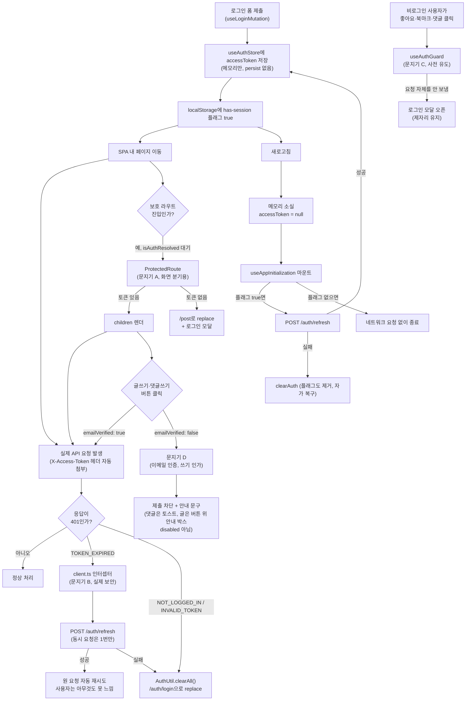
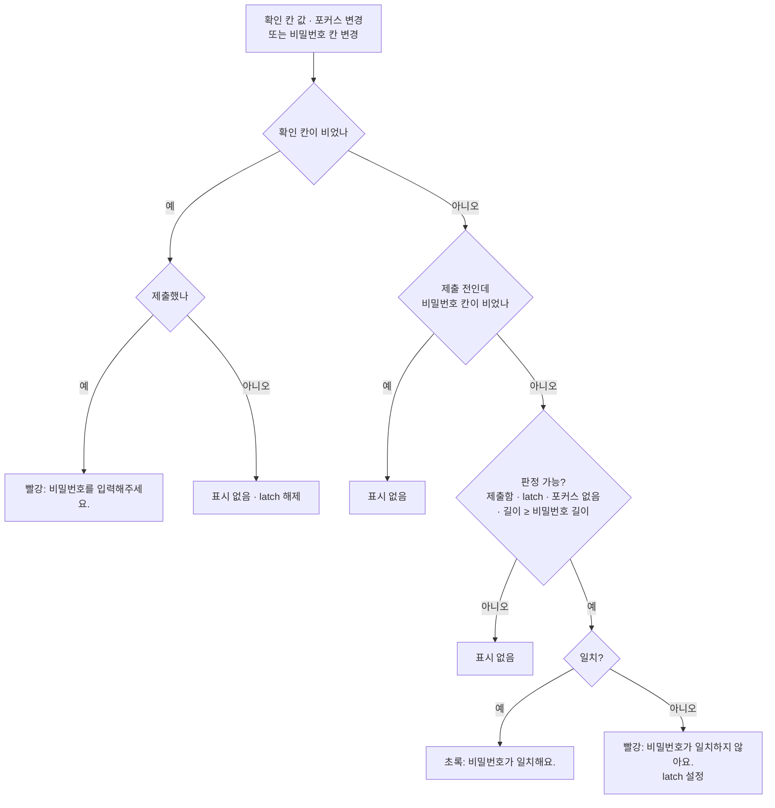

# 인증·인가·세션·토큰 갱신

> 독립 기능 문서(서사형)입니다.
> 대상 독자: 이 레포의 인증 코드를 처음 보거나, 인증 관련 화면/코드에서 이상한 동작을 발견해 원인을 추적해야 하는 개발자(AI 에이전트 포함).
> 읽고 나면: 로그인부터 로그아웃까지 상태가 어디에 저장되고 언제 사라지는지, 만료된 토큰이 왜 서로 다른 두 곳에서 두 번 처리되는지, 그중 어느 쪽이 실제 보안 경계인지, 그리고 로그인한 사람도 글을 못 쓸 때가 있는 이유를 설명할 수 있게 됩니다. 비밀번호를 새로 만드는 폼이 입력 중에 언제 무엇을 보여주는지(§8-G)도 여기서 다룹니다.
> **마지막 검토**: 2026-10-05

---

## 1. 쉬운 설명

이 앱의 인증·인가에는 성격이 다른 **네 개의 독립된 문지기**가 있습니다.

- **문지기 A (`ProtectedRoute`)**: 건물 로비에서 "출입증 있어요?"만 확인하는 안내데스크입니다. 진짜 보안은 안 하고, 있으면 통과시키고 없으면 "1층 로비(공개 피드)로 가서 출입증부터 받으세요"라고 안내만 합니다. 안내데스크를 그냥 지나쳐도 각 사무실 문(BE API)은 따로 잠겨 있습니다.
- **문지기 B (`client.ts`의 401 인터셉터)**: 각 사무실 문에 달린 진짜 자물쇠입니다. 출입증(액세스 토큰)이 만료됐으면 그 자리에서 조용히 새 출입증을 재발급받아(refresh) 문을 열어줍니다. 사용자는 문이 잠깐 안 열렸다는 것조차 눈치채지 못합니다. 재발급도 실패하면 그제서야 "퇴실 처리"(로그아웃)를 합니다.
- **문지기 C (`useAuthGuard`/`useProtectedNavigate`)**: 출입증이 아예 없는 방문객이 사무실 문을 두드리기 **전에** "먼저 출입증부터 받고 오세요"라며 접수처(로그인 모달)로 안내하는 안내원입니다. 문을 두드려서 거절당하는 민망함(에러 토스트, 페이지 이탈) 자체를 막아줍니다.
- **문지기 D (이메일 인증 게이트, `useCreatePost`/`useCreateComment`)**: 출입증은 있지만(로그인은 했지만) 특정 서류 접수창구(글쓰기·댓글쓰기, 글 작성·수정 화면의 링크 미리보기 포함)에는 신원이 한 번 더 확인된 사람만 받아주는 창구 직원입니다. 로비 출입(로그인)과 구경(읽기)은 막지 않고, 제출(쓰기)만 막습니다.

네 문지기는 서로의 존재를 모릅니다. A가 통과시켰다고 B가 안 잠그는 게 아니고, B가 열어준다고 A가 필요 없어지는 것도 아닙니다. **문지기 A는 로비 안내판일 뿐 보안 장치가 아니고, 실제 보안은 전부 문지기 B가 각 문 앞에서 합니다.** 이 구분을 놓치면 "A가 만료된 출입증을 그냥 통과시킨다"를 보안 구멍으로 오진하게 됩니다 — §10에서 실제로 그런 일이 있었습니다. 문지기 D는 A/B/C와 아예 다른 신분증(`useAuthStore`의 로그인 여부가 아니라 계정 캐시의 `emailVerified`)을 봅니다 — 로그인 여부와 이메일 인증 여부는 서로 독립된 두 개의 참/거짓 값입니다.


```mermaid
flowchart TD
    Login["로그인 폼 제출<br/>(useLoginMutation)"] --> Store["useAuthStore에 accessToken 저장<br/>(메모리만, persist 없음)"]
    Store --> Flag["localStorage에 has-session 플래그 true"]

    Flag --> Nav["SPA 내 페이지 이동"]
    Nav --> API1["실제 API 요청 발생<br/>(X-Access-Token 헤더 자동 첨부)"]

    Flag --> Reload["새로고침"]
    Reload --> MemGone["메모리 소실<br/>accessToken = null"]
    MemGone --> Init["useAppInitialization 마운트"]
    Init -->|"플래그 true면"| Refresh1["POST /auth/refresh"]
    Init -->|"플래그 없으면"| Skip["네트워크 요청 없이 종료"]
    Refresh1 -->|성공| Store
    Refresh1 -->|실패| ClearA["clearAuth (플래그도 제거, 자가 복구)"]

    Nav --> Protected{"보호 라우트<br/>진입인가?"}
    Protected -->|예, isAuthResolved 대기| Gate["ProtectedRoute<br/>(문지기 A, 화면 분기용)"]
    Gate -->|"토큰 있음"| Children["children 렌더"]
    Gate -->|"토큰 없음"| RedirectFeed["/post로 replace<br/>+ 로그인 모달"]

    Children --> API1
    API1 --> Check401{"응답이<br/>401인가?"}
    Check401 -->|"아니오"| Done["정상 처리"]
    Check401 -->|"TOKEN_EXPIRED"| Interceptor["client.ts 인터셉터<br/>(문지기 B, 실제 보안)"]
    Interceptor --> Refresh2["POST /auth/refresh<br/>(동시 요청은 1번만)"]
    Refresh2 -->|성공| Retry["원 요청 자동 재시도<br/>사용자는 아무것도 못 느낌"]
    Refresh2 -->|실패| ClearB["AuthUtil.clearAll()<br/>/auth/login으로 replace"]
    Check401 -->|"NOT_LOGGED_IN / INVALID_TOKEN"| ClearB

    Anon["비로그인 사용자가<br/>좋아요·북마크·댓글 클릭"] --> GuardC["useAuthGuard<br/>(문지기 C, 사전 유도)"]
    GuardC -->|"요청 자체를 안 보냄"| Modal["로그인 모달 오픈<br/>(제자리 유지)"]

    Children --> WriteClick{"글쓰기·댓글쓰기<br/>버튼 클릭"}
    WriteClick -->|"emailVerified: true"| API1
    WriteClick -->|"emailVerified: false"| GateD["문지기 D<br/>(이메일 인증, 쓰기 인가)"]
    GateD --> BlockWrite["제출 차단 + 안내 문구<br/>(댓글은 토스트, 글은 버튼 위 안내 박스<br/>disabled 아님)"]
```

---

## 2. 전제 지식

이 문서는 다음을 이미 안다고 가정합니다: zustand 기본 사용법, React Query의 `useQuery`/`useMutation`. **JWT 지식은 가정하지 않습니다** — 이 앱의 accessToken은 BE가 발급하는 불투명(opaque) 세션 토큰이라 payload가 없습니다(BE PR #42로 JWT를 폐지하고 서버 관리 세션으로 전환, §3·§6에서 자세히 설명합니다).

가정하지 않는 것 — 필요하면 먼저 읽으세요:

- 이 레포의 3-Layer API 패턴(`*.api.ts` → `*.keys.ts` → `*.queries.ts`), Feature Hook 패턴 → [`docs/FE-ARCHITECTURE.md`](FE-ARCHITECTURE.md) §5·§6
- 히스토리 엔트리 기반 오버레이 관리(로그인 모달이 왜 `location.state`로 열림 상태를 관리하는지) → [`docs/DECISIONS.md`](DECISIONS.md)의 2026-08-07 항목
- 첫 로딩 성능 최적화로 인증 게이팅이 지금 형태가 된 배경 → [`docs/DECISIONS.md`](DECISIONS.md)의 2026-07-25 항목

---

## 3. 사용한 도구·기술

- **기능 자체**: zustand(persist 미들웨어 **의도적으로 미사용** — §6), React Query(계정 정보 캐시), 커스텀 `fetch` 기반 `ApiClient`(axios 아님, 자체 인터셉터 로직 직접 구현), 불투명(opaque) 세션 토큰(accessToken은 BE가 `SecureToken.generate()`로 만드는 32바이트 base64url 무작위 문자열 — payload 없음, JWT 아님. BE PR #42로 JWT 폐지), httpOnly 쿠키(리프레시 토큰, 쿠키명 `__Host-refreshToken`, 최대 7일, BE가 설정·JS 접근 불가)
- **구현·검증 과정에서 쓴 도구**: MSW(`client.test.ts`가 401 응답을 흉내내 인터셉터를 검증), Vitest `vi.waitFor`(비동기 side-effect 검증)

---

## 4. 왜 만들었나

이 문서 이전에는 인증 아키텍처를 한눈에 설명하는 글이 없었고, 관련 결정들이 [`docs/DECISIONS.md`](DECISIONS.md)에 날짜별로 흩어져 있었습니다. 그 결과 2026-09-09, 어떤 세션이 `ProtectedRoute.tsx`의 만료 토큰 처리 로직(§8-A)만 보고 "만료된 토큰을 그대로 통과시키는 버그"로 결론 내렸습니다. 실제로는 `client.ts`의 반응형 인터셉터(§8-B)가 완전히 별개로 이미 그 상황을 처리하고 있었습니다 — 코드 관찰 자체는 정확했지만, 다른 레이어에 이미 있는 방어를 확인하지 않아 결론이 틀렸습니다. 재검증 과정과 정확한 결론은 §10에 전문을 남겼습니다.

이 문서의 목적은 "인증에는 책임이 분리된 여러 레이어가 있고, 한 레이어만 보고 전체를 판단하면 안 된다"는 걸 코드를 다시 뒤지지 않아도 알 수 있게 하는 것입니다.

---

## 5. 구조 — 네 개의 게이트

|               | 게이트 A: `ProtectedRoute`                             | 게이트 B: `client.ts` 인터셉터                                                                               | 게이트 C: `useAuthGuard`/`useProtectedNavigate`                      | 게이트 D: 이메일 인증(쓰기 인가)                                                                                         |
| ------------- | ------------------------------------------------------ | ------------------------------------------------------------------------------------------------------------ | -------------------------------------------------------------------- | ------------------------------------------------------------------------------------------------------------------------ |
| 위치          | `src/app/routes/ProtectedRoute.tsx`                    | `src/shared/api/client.ts`의 `handleTokenExpired` 메서드 + `request()`의 401 분기(`response.status === 401`) | `src/entities/auth/hooks/useAuthGuard.ts`, `useProtectedNavigate.ts` | `useCreatePost.ts`의 `onSubmit`, `useCreateComment.ts`의 `onSubmit`(`guard` 콜백 안) + BE `PostService`/`CommentService` |
| 판단 근거     | 클라이언트 로컬 상태(`useAuthStore.isAuthenticated`)만 | BE의 실제 401 응답 코드                                                                                      | 클라이언트 로컬 상태만                                               | `account.emailVerified`(React Query 계정 캐시, `useAuthStore`와 별개)                                                    |
| BE와 통신     | 안 함(사전 검증 로직 자체가 없음, §8-A)                | 함(`POST /auth/refresh`, 원 요청 재시도)                                                                     | 안 함(애초에 요청을 안 보냄)                                         | 제출 시 함(BE가 403 `EMAIL_NOT_VERIFIED`로 최종 판정, 방어 계층 중복)                                                    |
| 발동 시점     | 보호 라우트가 **렌더**될 때                            | 실제 API 요청이 **401을 받은 뒤**                                                                            | 사용자가 **클릭**했을 때, 요청 전                                    | 글쓰기·댓글쓰기 **제출** 시도 시                                                                                         |
| 책임          | 화면을 보여줄지 말지 분기, 스피너, 로그인 모달 유도    | 요청을 인증시켜 성공시키거나 세션을 끊음                                                                     | 실패할 게 뻔한 요청을 사전에 막고 로그인 유도                        | 미인증 사용자의 쓰기 제출을 막고 안내                                                                                    |
| 실패 시 결과  | `/post`로 replace 이동(+ 조건부 모달)                  | `AuthUtil.clearAll()` → `/auth/login` replace                                                                | 로그인 모달(제자리 유지, 페이지 이동 없음)                           | 안내(댓글은 토스트, 글은 버튼 위 `FormAlert` 박스), 제출 차단(버튼은 `disabled` 아님 — 아래 참고)                        |
| **보안 효과** | **없음.** 우회해도 API가 401을 낸다                    | **실질적 보안 경계**                                                                                         | 없음(UX 편의)                                                        | **부분적.** FE 체크는 UX용이고, 실제 방어는 BE의 403 판정                                                                |

**왜 나뉘어 있나**: 게이트 A는 성능 결정([`docs/DECISIONS.md`](DECISIONS.md) 2026-07-25 항목)의 짝입니다 — `AuthProvider`가 라우터 렌더를 막지 않도록 바꾼 대가로, 복원이 끝나기 전 첫 페인트에서 로그인 사용자가 보호 페이지 새로고침 시 피드로 튕기는 걸 막는 화면 분기 장치로 도입됐습니다. 게이트 B는 "리프레시 토큰은 httpOnly라 JS가 존재·유효성을 전혀 모른다"는 사실에서 나옵니다 — 실제로 요청을 보내 401을 받아봐야 압니다. 게이트 C는 A·B 둘 다 못 막는 상황(비로그인 사용자가 공개 피드에 머문 채 좋아요를 누르는 것)을 막습니다: A는 페이지 단위라 이 상황에 개입 못 하고, B는 요청을 실제로 보내야 발동하는데 그러면 401 → `clearAll()` → 페이지 이탈로 사용자 문맥이 깨집니다. 게이트 D의 1차안은 "이메일 미인증이면 로그인 자체를 막는다"였지만, [GitHub 사례 조사](https://github.com/kamp-us/phoenix/issues/7485)에서 _"쓰기 권한(게시글·댓글)은 인증된 이메일에 게이팅되고, 마찰은 도착이 아니라 첫 '쓰기' 시점에 발생한다"_(번역)는 걸 확인하고 뒤집혔습니다 — 로그인·읽기까지 막으면 가입 직후 이탈이 너무 커진다는 판단입니다. 확정 경위는 `docs/plans/2026-09-28-auth-hardening.md`의 "확정된 결정들" 표를 참고하세요.

### 라우트 그룹 구성 (`src/app/routes/index.tsx`의 `appRoutes`, `:113-217`)

```
RootLayout
├─ AppShellLayout (Public Content Group, 인증 게이트 없음 — has-session 플래그가 있으면 복원까지 스피너)   — /, /post, /post/:id
├─ ProtectedLayout = ProtectedRoute(게이트 A) + AppShellLayout   — /post/submit, /post/edit/:id, /bookmark, /my/comments, /my/account
├─ GuestGuard + PublicLayout (Guest Only)   — /auth/login, /auth/sign-up, /auth/forgot-password, /auth/reset-password
└─ AuthLayout(가드 없음, 로그인·비로그인 공용)   — /auth/verify-email
```

`ProtectedLayout.tsx:4-9`가 `ProtectedRoute`로 `AppShellLayout`을 감쌉니다. **이건 React Router의 레이아웃 라우트라, 보호 그룹 안에서 페이지를 오갈 때(`/post/submit` ↔ `/bookmark`)는 언마운트되지 않습니다.** 게이트 A가 실제로 재평가되는 유일한 순간은 공개/게스트 그룹에서 보호 그룹으로 **처음 진입**할 때뿐입니다.

`GuestGuard`(`routes/index.tsx`의 `GuestGuard` 함수, `:86-99`)는 반대 방향 가드입니다 — 로그인 상태로 `/auth/login`에 오면 이전 경로(`location.state.from.pathname`) 또는 `HOME`으로 돌려보냅니다.

`/auth/verify-email`은 어느 가드에도 속하지 않고 `routes/index.tsx:191-194`에서 `AuthLayout`만 직접 씌워 별도 라우트로 둡니다 — 로그인·비로그인 양쪽 모두 접근 가능해야 하기 때문입니다(로그인 상태면 인증 완료만 안내, 비로그인이면 로그인 유도).

---

## 6. 상태 모델

| 저장소                            | 키/필드                       | 값                                                             | 수명                                                       | JS 접근  |
| --------------------------------- | ----------------------------- | -------------------------------------------------------------- | ---------------------------------------------------------- | -------- |
| zustand `useAuthStore` (메모리만) | `accessToken`                 | 불투명 세션 토큰 또는 `null`(BE 발급, payload 없음 — JWT 아님) | 탭 수명(새로고침 시 소멸)                                  | 가능     |
| 〃                                | `isAuthenticated`             | `!!accessToken`과 항상 동치                                    | 〃                                                         | 가능     |
| 〃                                | `isAuthResolved`              | 복원 시도가 끝났는지                                           | 〃                                                         | 가능     |
| localStorage                      | `linksphere:auth:has-session` | **boolean 하나뿐**                                             | 영구(자가 복구, 아래 참고)                                 | 가능     |
| localStorage                      | `linksphere:auth:saved-email` | 로그인 폼 "이메일 저장" 값                                     | 영구                                                       | 가능     |
| localStorage                      | `linksphere:auth:last-avatar` | 아바타 URL(선반입용)                                           | 영구(로그아웃 시 제거)                                     | 가능     |
| httpOnly 쿠키(BE 설정)            | `__Host-refreshToken`         | 리프레시 토큰(불투명)                                          | 최대 7일(BE `MemberSessionService.REFRESH_TOKEN_VALIDITY`) | **불가** |

로그인 폼 이메일 입력의 초기값은 위 `saved-email`뿐 아니라 `location.state.email`의 영향도
받습니다 — 회원가입 화면에서 이메일이 이미 가입된 것으로 확인됐을 때(또는 가입 성공 직후)
"Sign In"/"로그인하러 가기" 링크가 그 이메일을 함께 실어 보내고, `useLogin.ts`의 `useForm` 초기값(`defaultValues.email`)이 이 값을
`saved-email`보다 우선 적용합니다(방금 직접 입력하고 서버가 확인해준 값이 지난 방문의 저장값보다
명확한 의도이기 때문). `saveEmail` 체크박스의 초기 체크 여부는 이 값과 무관하게 `saved-email`
존재 여부만 그대로 반영합니다.

**절대 저장하지 않는 것**: 액세스 토큰(어떤 스토리지에도 없음, 메모리 전용), 리프레시 토큰(JS가 못 만짐), 계정 정보(React Query 캐시에만, `accountKeys.root`) — 게이트 D가 보는 `account.emailVerified`도 이 캐시 안에 있고 `useAuthStore`에는 없습니다.

**비밀번호 변경 시 세션 회전**: `useChangePasswordMutation`(`auth.queries.ts:185-197`)의 `onSuccess`가 BE가 새로 발급한 세션으로 `setAuth(data.accessToken)`을 호출합니다 — BE가 비밀번호 변경 시 이 기기를 포함한 세션 회전 계열(familyId)을 새로 만들고 다른 기기의 세션은 전부 폐기하기 때문입니다. 로그인·refresh와 마찬가지로 `useAuthStore`의 `accessToken`을 갱신하는 세 번째 트리거입니다.

`useAuthStore`(`src/shared/store/auth.store.ts:41-63`)는 `devtools` 미들웨어만 쓰고 **`persist`가 없습니다 — 의도적입니다.** `accessToken`은 항상 `isAuthenticated`와 함께 `setAuth`/`clearAuth` 한 곳에서만 갱신되므로(`auth.store.ts:47-50`, `:56-60`) 두 값은 절대 어긋나지 않습니다. **이 등가성이 §8-A의 동작을 결정짓는 핵심 사실입니다.**

`linksphere:auth:has-session` 플래그(`auth.store.ts:16-19`)는 "세션이 있을 가능성"에 대한 힌트일 뿐, 진짜 인증 상태가 아닙니다:

- 플래그만 남고 쿠키가 만료됐다면 → `POST /auth/refresh`가 401 → `clearAuth()`가 플래그를 제거 → **자가 복구**
- 플래그가 없는데 쿠키가 살아있다면 → 다음 로그인 시 복구. **이 비대칭은 의도된 설계**입니다(민감정보를 저장하지 않는 대가로 완벽한 동기화를 포기)

---

## 7. 운영 파라미터

| 파라미터                                   | 값                                                                                                                             | 위치                                                                     |
| ------------------------------------------ | ------------------------------------------------------------------------------------------------------------------------------ | ------------------------------------------------------------------------ |
| 계정 정보(`accountKeys.root`) `staleTime`  | 1일(`STALE_TIME_ONE_DAY`)                                                                                                      | `src/entities/account/api/account.queries.ts:68`                         |
| 동시 401 발생 시 실제 refresh 호출 횟수    | 항상 1회(리더-팔로워 큐잉, §9)                                                                                                 | `src/shared/api/client.ts`의 `handleTokenExpired` 메서드                 |
| refresh 재시도 상한                        | **1회**(재시도한 요청이 다시 `TOKEN_EXPIRED`를 받으면 refresh를 또 호출하지 않고 실패 처리 — 2026-09-21 추가, §11 항목 1 참고) | `src/shared/api/client.ts`의 `handleTokenExpired`, `retryCount > 0` 가드 |
| 로그아웃 직후 유예 시간(`LOGOUT_GRACE_MS`) | 2초 — §8-E 참고                                                                                                                | `src/shared/utils/logout-grace.util.ts:25`                               |

> 이 표에는 더 이상 "액세스 토큰 만료 판정 여유 마진" 항목이 없습니다 — 그 값을 쓰던
> `isTokenExpired`가 2026-09-29에 삭제됐습니다. 경위는 §10 "후속 — 근본 원인 제거" 참고.

---

## 8. 코드 지도와 자주 하는 수정

### 8-A. 게이트 A가 실제로 하는 일 (그리고 안 하는 일)

게이트 A는 `isAuthResolved`(§6, 앱 부팅 시 1회 복원)를 기다리는 것 말고는 아무 사전
검증도 하지 않습니다:

```ts
// ProtectedRoute.tsx의 렌더 가드 전체
if (!isAuthResolved) {
  return <SpinnerOverlay className="h-screen" />;
}

if (!isAuthenticated) {
  return <Navigate to={ROUTES_PATHS.POST.ROOT} replace ... />;
}

return <>{children}</>;
```

**결론**: 이 앱에는 "만료 토큰의 사전(proactive) 재검증"이 없습니다. 만료 토큰 처리는
전부 게이트 B가 담당합니다. 2026-09-29 이전에는 accessToken이 존재할 때마다
`AuthUtil.isTokenExpired(accessToken)` + `restoreAuth()`를 추가로 거치는 `isVerifying`
게이트가 있었지만, 이 게이트는 `restoreAuth()`가 accessToken 존재만으로 즉시
early-return하는 구조상 애초에 아무 일도 하지 않았고(§10, 2026-09-09 사건에서 이미
확인됨), opaque 토큰으로 전환된 뒤로는 매번 스피너만 한 틱 깜빡이는 부작용까지
생겨 완전히 제거했습니다. 자세한 경위는 §10 "후속 — 근본 원인 제거" 참고.

### 8-B. 게이트 B — 반응형 401 인터셉터

```
client.ts의 request() 메서드 — 401 분기
  if (response.status === 401)
    if (code === TOKEN_EXPIRED)
      return this.handleTokenExpired(...)          → 아래 handleTokenExpired로 위임
    else if (isSessionInvalidCode(code))            → NOT_LOGGED_IN / INVALID_TOKEN
      if (endpoint === /auth/refresh) throw         → 앱 부팅 시 자동 refresh는 조용히 실패
      else if (!AuthUtil.isLoggingOut()) AuthUtil.clearAll()

client.ts의 handleTokenExpired() 메서드
  if (retryCount > 0)                              → 재시도한 요청도 다시 TOKEN_EXPIRED
    refreshSubscribers 비움, clearAll(), 영구 pending Promise 반환(더 재귀하지 않음)
  if (!this.isRefreshing)                          → 리더 경로
    POST /auth/refresh
    setAuth(accessToken)
    return this.request(endpoint, options, retryCount + 1)   // 원 요청 재시도
    catch → refreshSubscribers 비움, clearAll(), 영구 pending Promise 반환
  else                                             → 팔로워 경로
    new Promise(resolve => subscribeTokenRefresh(...))
```

`TOKEN_EXPIRED`는 "재시도하면 회복 가능"(리프레시), `NOT_LOGGED_IN`/`INVALID_TOKEN`은 "회복 불가능"(즉시 로그아웃)이라는 서로 다른 처방을 받습니다. 이 구분은 `error-code.ts:3-5`에서 코드 자체가 나뉘어 있는 것과 일치합니다.

`src/shared/lib/react-query/config/error-toast.ts`의 `resolveErrorToast()`(mutation·query 전역 에러 핸들러가 공유하는 판정 함수, `queryClient.ts`가 호출)는 `NOT_LOGGED_IN`·`INVALID_TOKEN`·`ACCESS_DENIED`·`EDGE_BLOCKED`·429(코드가 아니라 상태로 판별, `rateLimited` 안내)·404(query 정책만 — `ErrorToastPolicy.skipNotFound`)는 다루지만 **`TOKEN_EXPIRED`는 다루지 않습니다.** 실수가 아니라 설계입니다 — `client.ts`가 그 코드를 절대 밖으로 흘리지 않기(재시도하거나 영구 pending) 때문에 다룰 필요가 없습니다.

### 8-C. 부트스트랩 (새로고침·최초 로드)

```ts
// useAppInitialization.ts:30-68 요지
if (hasInitialized.current) return; // :38 1회만 실행
prefetchLastAvatar(); // :44 아바타 선반입 (병렬)
if (!accessToken && hasStoredSession()) {
  // :50 플래그 있을 때만
  const restored = await restoreAuth(); // :51
  if (restored) handleAuthRestoreSuccess(); // :53
}
// ... finally
setAuthResolved(true); // :59 성공/실패/미시도 무관 항상
```

비로그인 방문자(플래그 없음)는 네트워크 요청 0회로 즉시 끝납니다. `setAuthResolved(true)`가 `finally`에 있는 게 핵심입니다 — 이게 없으면 게이트 A가 영원히 스피너에 머뭅니다. 공개 그룹의 `AppShellLayout`도 has-session 플래그가 있으면 `isAuthResolved`가 될 때까지 스피너를 띄우므로(복원 전에 공개 목록 요청이 비로그인으로 먼저 나가 본인 비공개 글이 빠지는 레이스 방지) 같은 영향을 받습니다.

`restoreAuth`(`useAuth.ts:65-89`)는 refresh 성공 시 FCM 토큰도 함께 재등록합니다(`:82`
`void requestAndRegisterFcmToken();`) — 이 기기의 로그인 세션이 부팅 시점에 복원되면, 새
세션의 회전 계열(familyId)로 FCM 토큰을 다시 등록해야 다음 발송부터 끊기지 않기
때문입니다(`shared/lib/firebase/fcm.ts` 참고, 상세는 `docs/FCM-PUSH-NOTIFICATION.md`).

### 8-D. 게이트 C — 로그인 유도

`loginDialog.store`는 로그인 성공 시 실행할 콜백을 **두 채널로 나눠 갖습니다.** 계약이
서로 반대라 섞으면 안 됩니다.

| 채널            | 계약                                                              | 생산자                                          | `LoginDialog`의 처리                                                         |
| --------------- | ----------------------------------------------------------------- | ----------------------------------------------- | ---------------------------------------------------------------------------- |
| `onSuccess`     | 콜백이 **스스로 navigate**해 이 모달의 히스토리 엔트리를 벗어난다 | `ProtectedRoute.tsx`, `useProtectedNavigate.ts` | 실행 후 `close()`를 부르지 않는다 (navigate가 이미 엔트리를 벗어났다고 가정) |
| `pendingAction` | navigate하지 **않는** 재개 액션                                   | `useAuthGuard` (opt-in일 때만)                  | 먼저 `close()`로 직접 닫고, 그 닫힘이 반영된 뒤에 실행                       |

```ts
// useAuthGuard.ts:25-46 요지 (액션형: 좋아요·북마크·댓글)
if (isAuthenticated) {
  action();
  return;
}
setLoginOnSuccess(undefined); // navigate형 채널은 쓰지 않는다
setPendingAction(options?.resumeAfterLogin ? action : undefined); // opt-in한 액션만 재개
openLoginDialog();

// useProtectedNavigate.ts:18-30 요지 (이동형: 링크 클릭)
if (isAuthenticated) {
  navigate(to);
  return;
}
setLoginOnSuccess(() => navigate(to, { replace: true })); // replace — push하면 orphan 히스토리
openLoginDialog();
```

`replace`를 쓰는 이유는 로그인 모달이 열려 있던 히스토리 엔트리 위에 새 엔트리를 push하면, 그 엔트리가 orphan으로 남아 뒤로가기 시 모달이 재등장하기 때문입니다([`docs/DECISIONS.md`](DECISIONS.md) 2026-08-07 항목).

`pendingAction`을 실행 "직후"가 아니라 "닫힌 뒤"로 미루는 이유는
`src/widgets/layout/login-dialog/hooks/useLoginDialog.ts`의 `runPendingActionAfterDialogCloses`
effect(`:58-74`, #228로 `features/auth/login`에서 이 경로로 이동)가 담당합니다 —
`close()`(`navigate(-1)`)가 반영되기
전에 실행하면 로그인 모달이 아직 떠 있는 채로 다음 모달이 위에 겹칩니다. `resumeAfterLogin`은
서버에 쓰는 액션에는 켜지 않습니다 — 좋아요처럼 **토글**인 액션은 재개 시 로그인 후
갱신된 상태를 기준으로 다시 토글돼 의도와 반대로 취소될 수 있고, 댓글 작성은 클릭 시점
클로저의 `account`가 재개 시점엔 비어 있어 조용히 무반응이 됩니다. 자세한 근거는
[`docs/DECISIONS.md`](DECISIONS.md) 2026-09-11 항목 참고.

**사용처**: `useAuthGuard`는 `LikePostButton.tsx`(좋아요, 재개 안 함), `useBookmarkPostButton.ts`(북마크, `resumeAfterLogin: true`), `LikeCommentButton.tsx`(댓글 좋아요, 재개 안 함), `useCreateComment.ts`(댓글 제출, 재개 안 함)에서 씁니다. `useProtectedNavigate`는 사이드바·하단 탭바의 "등록"·"북마크" 항목(`nav-items.ts:34`, `:41`의 `requiresAuth: true`)과 피드 화면의 등록 버튼(`pages/post/index.tsx`)에서 씁니다.

**바깥 클릭 닫기**: 로그인 모달은 이메일·비밀번호를 **직접 입력했을 때만** 바깥(오버레이) 클릭으로 닫히지 않습니다 — 닫히면 입력이 사라지기 때문입니다. 저장된 이메일로 미리 채워진 값은 입력으로 보지 않습니다(react-hook-form `dirtyFields` 기준). `useLogin`의 `onInputDirtyChange` 옵션 → `LoginForm` → `useLoginDialog`의 `hasUserInput` → `DialogContent`의 `dismissOnOutsideClick` 순으로 전달됩니다. ESC·X·뒤로가기는 입력이 있어도 그대로 닫힙니다. 정책 전체와 근거는 [`docs/DECISIONS.md`](DECISIONS.md) 2026-09-30 "바깥 클릭 닫기 정책" 항목 참고.

### 8-E. 로그인·로그아웃 시 React Query 캐시 처리

**로그아웃은 화면이 곧 다른 곳으로 이동하는지에 따라 캐시 처리 방식이 갈립니다**
(`useLogoutMutation`의 `isProtectedPath` 분기, `auth.queries.ts:82-107`, 분기 자체는 `:91`):

| 경로                                      | 호출                             | 캐시 처리                                         | 배경 재요청 | 왜                                                                     |
| ----------------------------------------- | -------------------------------- | ------------------------------------------------- | ----------- | ---------------------------------------------------------------------- |
| 제자리 로그아웃(비보호 경로)              | `clearAuth()` + `clearQueries()` | `resetQueries()`                                  | 있음        | 화면이 남으므로 `isLiked`/`isBookmarked`를 비로그인 상태로 갱신해야 함 |
| 이동 수반(보호 경로 로그아웃 · 세션 만료) | `clearAll()`                     | `clearQueriesWithoutRefetch()`(`removeQueries()`) | 없음        | 화면이 곧 교체돼 재요청이 100% 낭비                                    |

**제자리 로그아웃**(`auth.util.ts`의 `clearQueries()`)은 `queryClient.clear()`가 아니라
`resetQueries()`를 씁니다 — `clear()`는 마운트된 옵저버에 아무것도 알리지 않아 이전
사용자 데이터가 화면에 남기 때문입니다(`clearQueries()` 위 주석). 그 대가로,
`resetQueries()`는 화면에 아직 남아있는 활성 쿼리를 **토큰이 지워진 직후 배경에서
재요청**합니다. 이 재요청은 당연히 401(`NOT_LOGGED_IN`)을 받고, 그 쿼리의 캐시는
`status: 'error'`로 확정됩니다.

이게 왜 문제가 되는가는 조회 훅의 종류에 달려 있습니다. 일반 `useQuery`는
`throwOnError: false`가 전역 기본값(`queryClient.ts`)이라 재마운트 시 캐시가
error여도 정상적으로 재요청됩니다. 반면 **Suspense 훅**(`useSuspenseQuery`/
`useSuspenseInfiniteQuery`)은 캐시가 이미 `error`면 TanStack Query 내부
(`queryObserver`의 `shouldLoadOnMount`)가 `retryOnMount`를 강제로 `false`로
만들어 **재마운트해도 네트워크 요청 자체를 내지 않고** 캐시된 옛 에러를 그대로
다시 throw합니다. `gcTime`(기본 5분)이 지나 캐시가 수거될 때까지 이 상태가
풀리지 않습니다. (이 함정은 제자리 로그아웃 경로에서만 생깁니다 — 이동 수반
로그아웃은 애초에 배경 재요청 자체가 없어 캐시가 error로 오염되지 않습니다.)

**이동 수반 로그아웃**(`clearAll()`)은 `clearQueriesWithoutRefetch()`를 씁니다 —
`resetQueries()`에는 `invalidateQueries`의 `refetchType: 'none'`에 해당하는
"재요청은 하지 말고 리셋만" 옵션이 없어서, 대신 `queryClient.removeQueries()`로
캐시를 통째로 파괴합니다. `removeQueries()`도 `clear()`와 마찬가지로 옵저버에
아무것도 알리지 않지만, 이 경로는 뒤따르는 `navigate()`가 그 화면을 통째로
언마운트시키므로 무해합니다.

`isLoggingOut()`은 두 경로 모두의 "로그아웃 직후 구간"을 하나로
묶어 판단합니다 — 제자리 로그아웃은 `resetQueries()` Promise가 도는 동안,
이동 수반 로그아웃은 `clearedAt` 이후 유예 시간(`LOGOUT_GRACE_MS`, 2초) 동안.
`AuthUtil.isLoggingOut()`(`auth.util.ts`)은 얇은 위임일 뿐, `loggingOut`/`clearedAt`
상태 자체와 `LOGOUT_GRACE_MS`는 의존성이 없는 `logout-grace.util.ts`에 있습니다 —
`error-toast.ts`의 `resolveErrorToast()`(§8-B, mutation·query 전역 에러 핸들러가 공유하는
판정 함수)가 `AuthUtil`을 거치지 않고 이 파일을 직접 참조해, `queryClient.ts` ↔
`auth.util.ts` 순환 참조를 만들지 않기 위해서입니다.
이동 수반 로그아웃은 배경 재요청 자체가 없는데도 유예 창이 필요한 이유는,
로그아웃 시점에 **이미 떠 있던 요청**(어떤 queryFn도 `AbortSignal`을 `apiClient`에
넘기지 않아 `cancelQueries()`로도 실제로 끊기지 않습니다)의 401이 뒤늦게 돌아올
수 있기 때문입니다 — 이 401을 `isLoggingOut()`이 놓치면 `client.ts`의 `request()`
401 분기의 `!AuthUtil.isLoggingOut()` 가드가 풀려 `clearAll()`이 기본값(`/auth/login`)으로 한 번 더
호출되고, 보호 경로 로그아웃이 `/post`에 도착한 직후 로그인 페이지로 튕깁니다. 두
경로 모두 `isLoggingOut()`이 true인 동안은 그 401의 토스트·강제 리다이렉트만 막을 뿐
(`client.ts`의 같은 가드), 제자리 로그아웃 경로의 **캐시가 error 상태로 오염되는
것 자체는 막지 못합니다.**

**로그인**(`auth.queries.ts`의 `useLoginMutation`(`:27-80`), `onSuccess`는 `:34-61`)이
제자리 로그아웃이 남긴 이 error 캐시를 정리합니다:

```ts
setAuth(data.accessToken); // 1. 새 토큰 저장
void queryClient.resetQueries({
  // 2. 로그아웃이 남긴 에러 캐시만 초기화
  predicate: (query) => query.state.status === 'error' && query.state.data === undefined,
});
void queryClient.invalidateQueries(); // 3. 전체 invalidate (활성 쿼리 재조회)
void requestAndRegisterFcmToken(); // 4. FCM 토큰 등록 (브라우저 알림 권한 요청 + 서버 등록)
```

`data === undefined` 조건이 핵심입니다 — 데이터를 들고 있으면서 배경 재요청만
실패한 쿼리(화면은 멀쩡하고 재마운트 시 정상적으로 재요청됨)까지 지우면, 모달을
통한 제자리 로그인에서 이미 떠 있던 화면(예: 게시글 목록)이 로그인 순간
스켈레톤으로 깜빡입니다. **순서도 중요합니다** — `resetQueries()`는 내부적으로
리셋 후 같은 predicate로 재조회를 시도하는데, 리셋 직후엔 상태가 바뀌어 그
predicate가 더 이상 매칭되지 않아 아무것도 다시 부르지 않습니다. 뒤따르는
`invalidateQueries()`(필터 없음, 활성 쿼리 전체 재조회)가 화면에 떠 있던 쿼리의
실제 재요청을 맡습니다.

**새 Suspense 조회를 추가할 때** 이 함정을 기억해야 합니다 — 로그인 시점의 이
리셋이 전제이므로, 새 Suspense 쿼리도 자동으로 이 보호를 받습니다. 별도 조치는
필요 없지만, "왜 로그인 직후에만 이 리셋이 필요한가"를 알아야 향후 유사한
캐시 오염 지점(예: 계정 전환)을 놓치지 않습니다.

**탈퇴 유예 중 복구 안내**(2026-09-29 추가): 회원탈퇴는 즉시 처리되지 않고 14일
유예를 거친다(link-sphere_BE_NEW `AccountDeletionService`). 유예 중인 계정이
로그인에 성공하면 BE가 탈퇴 신청을 자동 취소하고 응답에 `deletionCancelled: true`를
실어 보낸다 - `useLoginMutation.onSuccess`가 위 캐시 처리 뒤 이 값을 보고 복구
안내 토스트(`TEXTS.messages.success.accountDeletionCancelled`)를 띄운다. 캐시
리셋·invalidate와는 무관한 별개 동작이라 위 순서에 영향을 주지 않는다.

### 8-F. 게이트 D — 쓰기 인가(이메일 인증)

```ts
// useCreatePost.ts의 onSubmit 요지
const onSubmit = form.handleSubmit(async (formData: CreatePost) => {
  // BE도 같은 검사를 403 EMAIL_NOT_VERIFIED로 거절하지만(방어 계층 중복), 클릭 가능한
  // 채로 두고 안내만 보여준다(disabled 대신). 다른 실패 안내와 같은 자리(버튼 위 FormAlert)에 남긴다.
  if (account?.emailVerified === false) {
    setSubmitError({ kind: 'form', message: TEXTS.messages.error.emailVerificationRequired });
    return;
  }

  setSubmitError(null);

  try {
    await createPost({ ...formData, url: UrlUtil.normalizeUrl(formData.url) });
  } catch (error) {
    ... // 원인별로 입력칸 아래 또는 버튼 위 안내
    return;
  }
  ...
});
```

`useCreateComment.ts`의 `onSubmit`도 같은 패턴(안내는 `toast.error`)이지만, 이 체크가 `useAuthGuard`의 `guard(() =>
{...})` 콜백 **안쪽**에 있습니다 — 즉 댓글 작성은 게이트 C(비로그인이면 로그인 모달)를
먼저 통과해야 게이트 D(로그인은 했지만 미인증이면 안내)에 도달합니다. 게시글 작성은
`/post/submit` 자체가 게이트 A로 보호되는 라우트라 게이트 C 래핑이 따로 없습니다.

두 훅 모두 버튼을 `disabled`로 막지 않고 **클릭 가능한 채로 두고 안내만 보여줍니다**(댓글은
토스트, 게시글은 버튼 위 `FormAlert` 박스 — 다른 등록 실패 안내와 같은 자리, #309)
— 이 레포의 "폼 검증 실패를 `disabled`만으로 처리하지 않는다" 규칙(`.claude/CLAUDE.md`)과
같은 이유입니다. BE도 동일 판정을 `PostService`/`CommentService`에서 403
`EMAIL_NOT_VERIFIED`(`error-code.ts:16-18`)로 다시 하므로, FE 체크를 우회해도(예: 계정
페이지를 열어둔 채 다른 탭에서 이메일 인증 전 상태로 남은 경우) BE가 최종적으로 막습니다.
BE는 글 작성·수정 폼의 링크 미리보기(`PostService.previewLink`)에도 같은 403을 내므로,
`useCreatePost`·`useUpdatePost`는 미인증이면 미리보기를 아예 요청하지 않습니다
(`useLinkPreview`의 `enabled` 인자에 `account?.emailVerified === true`를 넘김).

미인증 사용자에게는 배너(`EmailVerificationBanner.tsx`, 계정 페이지)와 네비바 배지
(`Navbar.tsx`의 계정 메뉴 버튼 — `aria-label` 분기와 빨간 점, 둘 다 `account?.emailVerified === false` 조건)로 상시 안내가 뜹니다. 재발송은
`useResendEmailVerification.ts`(`useRequestEmailVerificationMutation` 호출)가 처리합니다.

### 8-G. 비밀번호 입력 피드백 (가입·재설정·변경)

게이트와는 별개로, 비밀번호를 **새로 만드는** 세 폼 — 회원가입(`SignUpForm.tsx`), 비밀번호
재설정(`ConfirmPasswordResetForm.tsx`), 비밀번호 변경(`ChangePasswordForm.tsx`) — 은 입력하는
동안 두 가지를 보여줍니다(2026-09-30 도입, 계획
[`docs/plans/2026-09-30-password-live-feedback.md`](plans/2026-09-30-password-live-feedback.md)).

- 비밀번호 칸 아래 **조건 체크리스트** 4항목(8자 이상·영문·숫자·특수문자). 입력 중엔 충족된
  항목만 회색 ○ → 초록 ✓로 바뀌고, 칸을 한 번 벗어났거나 제출한 뒤에야 못 채운 항목이
  빨강 ✗가 됩니다. 한글·이모지(비ASCII)와 65자 이상은 "미완성"이 아니라 "위반"이라 입력
  즉시 문구로 알립니다.
- 확인 칸 아래 **한 줄**. 일치하면 즉시 초록 "비밀번호가 일치해요."(닉네임·이메일 "사용
  가능"과 같은 톤), 불일치는 늦게 — 확인 칸 글자 수가 비밀번호만큼 되거나 칸을 벗어나야
  빨강이 됩니다.

비밀번호 정책 자체(조합 규칙·8~64자·출력 가능 ASCII만)는 바뀌지 않았습니다 —
`auth.schema.ts:8-12`와 BE `AuthDTO.kt` 그대로입니다.

**구조**: 폼은 그대로 `mode: 'onSubmit'` + zodResolver입니다. RHF 에러는 제출 차단·첫 에러
포커스·빨간 테두리만 맡고, 화면 문구는 `usePasswordFieldsFeedback`이 입력값에서 직접 계산해
그립니다. 같은 에러가 두 번 뜨지 않도록 `FormInputPassword`의 `hideErrorMessage`로 FormField의
에러 문구는 숨깁니다.

| 역할            | 위치                                                                                                                                                                           |
| --------------- | ------------------------------------------------------------------------------------------------------------------------------------------------------------------------------ |
| 판정(순수 함수) | `src/entities/auth/utils/auth.util.ts`의 `PasswordUtil` — `checkRequirements`(`:29`), `findViolation`(`:39`), `resolveRequirementStates`(`:64`), `resolveConfirmStatus`(`:91`) |
| 상태·연결(훅)   | `src/entities/auth/hooks/usePasswordFieldsFeedback.ts` — 확인 칸 포커스·latch(`:62`), 비밀번호 칸의 `deps`(`:81`)                                                              |
| 표시            | `src/entities/auth/ui/PasswordRequirementList.tsx`, `src/entities/auth/ui/PasswordConfirmMessage.tsx`                                                                          |
| shared 확장     | `src/shared/ui/elements/form/FormInputPassword.tsx`의 `useController`(`rules.deps`), `src/shared/ui/elements/form/_base/FormField.tsx:42`(`hideErrorMessage`)                  |
| 길이 상수       | `src/entities/auth/config/auth.const.ts`                                                                                                                                       |

**확인 칸 판정**(`PasswordUtil.resolveConfirmStatus`, `auth.util.test.ts`의 표와 1:1):


```mermaid
flowchart TD
  S["확인 칸 값 · 포커스 변경<br/>또는 비밀번호 칸 변경"] --> E{"확인 칸이 비었나"}
  E -->|예| R{"제출했나"}
  R -->|예| REQ["빨강: 비밀번호를 입력해주세요."]
  R -->|아니오| N1["표시 없음 · latch 해제"]
  E -->|아니오| P{"제출 전인데<br/>비밀번호 칸이 비었나"}
  P -->|예| N0["표시 없음"]
  P -->|아니오| J{"판정 가능?<br/>제출함 · latch · 포커스 없음<br/>· 길이 ≥ 비밀번호 길이"}
  J -->|아니오| N2["표시 없음"]
  J -->|예| M{"일치?"}
  M -->|예| OK["초록: 비밀번호가 일치해요."]
  M -->|아니오| NG["빨강: 비밀번호가 일치하지 않아요.<br/>latch 설정"]
```

판정을 RHF `touched`가 아니라 **지금 포커스가 있는가**로 하는 이유: touched는 한 번 켜지면
계속 켜져 있어, 빈 확인 칸을 Tab으로 지나간 뒤 첫 글자를 치자마자 불일치가 떠 버립니다.

**제출 후 위 칸만 고쳤을 때**: RHF는 제출 후 재검증 결과를 **바뀐 필드 이름에만** 반영합니다
(react-hook-form 7.71 `dist/index.esm.mjs`의 onChange → `_runSchema([name])` 경로, 소스 확인).
그래서 도입 전엔 비밀번호만 고쳐 두 값이 같아져도 확인 칸의 "일치하지 않아요"가 그 칸을 다시
건드릴 때까지 남았습니다 — Baymard가 L.L. Bean 실패 사례로 든 모양과 같습니다(아래 근거).
비밀번호 칸에 `deps: [확인 칸]`을 걸어 확인 칸도 함께 재검증합니다. 도입 전 동작 재현과 수정
확인은 `FormInputPassword.test.tsx`의 deps 유무 두 케이스입니다.

**규칙 단일 출처**: 체크리스트 판정(`PasswordUtil`)과 zod 스키마는 따로 쓰였습니다. 스키마는
확정된 정책 코드라 그대로 두고, `auth.util.test.ts`가 `PasswordUtil.isValid(v)`와
`passwordValidationSchema.safeParse(v).success`를 441개 입력(길이 9종 × 문자 조합 7종 × 끼워 넣는
문자 7종)으로 전수 비교합니다. 체크리스트의 "특수문자"는 스키마의 `[^a-zA-Z0-9]`와 달리 한글·
이모지를 치지 않습니다 — 치면 한글을 칠 때 ✓와 ASCII 위반 문구가 동시에 뜹니다. ASCII만
허용하는 조건 아래서는 두 판정이 같은 집합이라 전체 통과 여부는 같습니다. 변이 확인(직접 측정,
2026-09-30 — 판정 코드를 한 군데씩 바꿔 `auth.util.test.ts`를 실행): 특수문자에서 공백 제외 →
5건 실패, 최대 길이를 63으로 → 6건 실패, 한글을 특수문자로 인정 → 2건 실패(전체 통과 여부가 같아
차등 비교는 통과하고 조건별 표가 잡음).

**왜 이렇게 보여주나(UX 근거)**: 일반 입력칸은 "칸을 벗어난 뒤 검증"이 정석이지만, 새 비밀번호는
예외로 보는 쪽이 다수입니다. 아래 인용은 2026-09-30 조사 때 원문을 열어 확인한 것입니다
(Konjević 글만 Wayback 사본).

- Luke Wroblewski의 회원가입 폼 실험([A List Apart, 2009](https://alistapart.com/article/inline-validation-in-web-forms/))은
  비밀번호에 입력 중 검증(짧은 지연)을 썼고, 이 방식이 _"안전한 비밀번호의 형식처럼 경계가
  엄격한 질문에 가장 잘 맞았다"_ (번역, 생략)고 적습니다.
- NN/g의 Rachel Krause는 [폼 에러 가이드라인](https://www.nngroup.com/articles/errors-forms-design-guidelines/)에서
  _"새 비밀번호처럼 복잡한 입력에서는 입력하는 동안 나타나는 즉시 인라인 검증이 사용자가
  추측하거나 여러 번 확인하는 일을 막아준다"_ (번역, 생략)고 씁니다.
- 다만 틀리기 전에 빨강을 띄우지 않습니다. NN/g의 Kate Kaplan은
  _"입력 중에 에러 메시지를 보여주면 부당한 꾸지람처럼 느껴진다"_ (번역)고 씁니다
  ([Hostile Patterns in Error Messages](https://www.nngroup.com/articles/hostile-error-messages/)).
  그래서 Mihael Konjević의 "reward early, punish late"
  ([Medium, 2016](https://medium.com/wdstack/inline-validation-in-forms-designing-the-experience-123fb34088ce))를
  따릅니다 — 맞는 쪽으로 가는 건 즉시 칭찬하고, 틀린 건 입력이 끝난 뒤 알리고, 이미 틀린 상태를
  고치는 중이면 입력하는 대로 해제합니다.
- 체크리스트: NN/g의 Katie Sherwin은 [비밀번호 생성 가이드](https://www.nngroup.com/articles/password-creation/)에서
  요구사항을 _"필드가 선택된 동안 내내 볼 수 있게"_ (번역) 하라고 하고, 통과 개수를 보여주는
  방식은 _"강도 미터와 같은 게 아니다"_ (번역)라고 구분합니다.
- 확인 칸: Baymard의 [인라인 검증 사용성 테스트](https://baymard.com/blog/inline-form-validation)(2024)는
  첫 칸을 고쳐도 불일치 에러가 남은 L.L. Bean을 실패 사례로, 두 번째 칸을 떠나기 전에 일치
  여부를 알려준 Best Buy를 긍정 사례로 듭니다.
- 유보 의견: GOV.UK [Passwords 패턴](https://design-system.service.gov.uk/patterns/passwords/)은
  _"인라인 검증이 안전한 비밀번호 만들기에 좋은 방법인지는 더 연구가 필요하다"_ (번역)며 판단을
  미룹니다.

실서비스 관찰(2026-09-30, 가입 페이지에 입력만 하고 제출하지 않음): Apple(체크리스트, 빨강은
칸을 벗어날 때), Dropbox(체크리스트, 첫 글자부터 빨강), Stripe(강도 라벨), Google(제출 시 한 줄).
확인 칸 일치 **성공 문구를 띄우는 곳은 관찰한 6곳 중 0곳**이었습니다 — 초록 "일치해요"는 업계
선례가 아니라 이 앱의 닉네임·이메일 톤과 맞춘 선택입니다(사용자 결정).

| 항목           | 채택                               | 채택하지 않은 대안과 이유                                                                                                                                                   |
| -------------- | ---------------------------------- | --------------------------------------------------------------------------------------------------------------------------------------------------------------------------- |
| 요구사항 표시  | 항상 보이는 체크리스트, 가로 한 줄 | 포커스 시 펼침(Apple·Dropbox): 아래 칸이 밀리고 blur 순간 클릭 대상이 움직임. 한 줄 안내+에러: 어떤 조건이 빠졌는지 안 보임. 2열·세로: 폼이 1~3줄 길어짐(기존 안내도 한 줄) |
| 확인 칸        | 일치는 즉시 초록, 불일치는 늦게    | 불일치만(Apple·Google): 닉네임·이메일과 톤이 다름. 매 키 즉시: 첫 글자부터 빨강                                                                                             |
| 표시 상태 출처 | 입력값에서 계산                    | `useSignUp.ts`의 setError 선례: 비동기 서버 결과용 — 동기 판정에 쓰면 effect와 `isSubmitted` 가드가 늘어남                                                                  |
| 규칙 동기화    | 스키마 유지 + 차등 테스트          | 스키마를 규칙 목록에서 조립: 에러 문구 순서와 기존 스키마 테스트가 바뀜                                                                                                     |

배치 시안(A 2열 · B 세로 · C 가로 한 줄)은 Artifact 미리보기
(https://claude.ai/artifact/7msbwHbj9WtYc5ni5jycLq)로 나란히 보고 C를 골랐습니다.

### 자주 하는 수정

| 하고 싶은 것                     | 건드릴 파일                                                                                                                                                                                                                                       |
| -------------------------------- | ------------------------------------------------------------------------------------------------------------------------------------------------------------------------------------------------------------------------------------------------- |
| 새 보호 페이지 추가              | `route-paths.ts`에 경로 추가 → `route-paths.ts:39-48` `isProtectedPath`에 prefix 추가 → `routes/index.tsx`의 Protected Content Group에 라우트 등록                                                                                                |
| 로그인 필요한 새 액션(버튼) 추가 | `useAuthGuard()`로 액션을 감싸기(§8-D 패턴)                                                                                                                                                                                                       |
| 로그인 필요한 새 이동(링크) 추가 | `useProtectedNavigate()` 사용, 또는 `nav-items.ts`에 `requiresAuth: true` 항목 추가                                                                                                                                                               |
| 새 401 에러 코드 처리 추가       | `error-code.ts`에 상수 추가 → `client.ts`의 `request()` 401 분기(`response.status === 401`) 또는 `error-toast.ts`의 `resolveErrorToast()`에 분기 추가(그 코드가 재시도 가능한지/즉시 로그아웃인지 먼저 결정)                                      |
| 새 Suspense 조회 화면 추가       | `useSuspenseQuery`/`useSuspenseInfiniteQuery`는 캐시가 error면 재마운트해도 재요청하지 않는다 — §8-E의 로그인 리셋이 전제다                                                                                                                       |
| 비밀번호 조건 추가·변경          | 정책(`auth.schema.ts`, BE `AuthDTO.kt`)과 체크리스트(`auth.util.ts`의 `REQUIREMENT_TESTS`, `auth.const.ts`의 `PASSWORD_REQUIREMENTS`, `TEXTS.auth.password.requirements`)를 함께 — 한쪽만 바꾸면 `auth.util.test.ts`의 차등 비교가 실패한다(§8-G) |
| 비밀번호를 새로 만드는 폼 추가   | `usePasswordFieldsFeedback(form, { password, confirm })`의 반환값을 `FormInputPassword` 두 개와 `PasswordRequirementList`·`PasswordConfirmMessage`에 펼친다(`SignUpForm.tsx:110` 참고, §8-G)                                                      |

---

## 9. 검증 결과

`src/shared/api/client.test.ts`(446줄, 최상위 `describe` 2개)가 게이트 B와 OAC 대응 헤더
로직을 검증합니다.

**`describe('ApiClient — 인증 오류 처리')`**(`:60-319`, 7 Case)가 게이트 B를 케이스별로
검증합니다:

| Case             | 시나리오                                             | 확인하는 것                                                                                            |
| ---------------- | ---------------------------------------------------- | ------------------------------------------------------------------------------------------------------ |
| 1 (`:74-107`)    | 액세스 만료, 리프레시 유효                           | 재시도 1회 성공, 토스트·이동 없음(`:105` `navigate` 미호출 단언)                                       |
| 1-1 (`:112-151`) | 동시에 두 요청이 401 `TOKEN_EXPIRED`                 | refresh는 1번만 호출(리더-팔로워 큐잉), 두 요청 모두 재시도 성공                                       |
| 1-2 (`:157-194`) | refresh 성공 후 재시도한 요청도 다시 `TOKEN_EXPIRED` | refresh를 다시 호출하지 않고 `clearAll()` + 로그인 이동(§11 항목 1의 2026-09-21 재시도 상한 가드 검증) |
| 2 (`:199-220`)   | 액세스·리프레시 둘 다 만료                           | `clearAuth` + `/auth/login` replace 이동                                                               |
| 3 (`:225-241`)   | 토큰 없이 요청(`NOT_LOGGED_IN`)                      | 로그인 리다이렉트                                                                                      |
| 4 (`:246-263`)   | 토큰 형식 손상(`INVALID_TOKEN`)                      | Case 3과 동일                                                                                          |
| 5 (`:268-318`)   | 403 WAF 차단 vs 앱이 낸 정상 `ACCESS_DENIED`         | `EDGE_BLOCKED`로 오분류 안 됨(it 2개)                                                                  |

**`describe('ApiClient — 요청 헤더 (CloudFront OAC 대응)')`**(`:327-446`, 5 Case) —
2026-09-29 OAC 전환(FE Phase 6, `docs/plans/2026-09-29-oac-lockdown.md`)으로 추가됨,
401 처리와는 무관한 별개 관심사라 최상위 `describe`를 분리했습니다:

| 시나리오                                | 확인하는 것                                                           |
| --------------------------------------- | --------------------------------------------------------------------- |
| 토큰 있을 때(`:336-351`)                | `Authorization` 대신 `X-Access-Token` 헤더, `Authorization` 헤더 없음 |
| JSON 바디(`:353-374`)                   | `x-amz-content-sha256`에 바디의 SHA256 해시                           |
| FormData 바디(`:376-392`)               | `x-amz-content-sha256` 헤더 자체를 생략                               |
| 바디 없는 POST, 예: refresh(`:394-419`) | 빈 문자열의 고정 해시값(`e3b0c442...`)을 그대로 실음                  |
| 로그인 엔드포인트(`:421-445`)           | `isAuthEndpoint` 목록은 `X-Access-Token` 헤더를 붙이지 않음           |

**동시 401 요청이 refresh를 정확히 1번만 내는지**는 이제 Case 1-1이 검증합니다. **refresh
실패 시 대기 중인 팔로워 요청들의 운명**은 여전히 어떤 Case에도 없습니다 — §11 항목 3·4와
연결됩니다.

게이트 A(`ProtectedRoute`)는 `src/app/routes/ProtectedRoute.test.tsx`가 화면 분기 자체(스피너/리다이렉트/모달 조건)를 검증합니다. §8-A의 사실("`restoreAuth`가 실제로 refresh를 호출하지 않는다")도 여기 고정돼 있습니다.

게이트 D는 두 호출부의 테스트 커버리지가 다릅니다. `useCreateComment.test.tsx:189,212`가
`emailVerified: false` 케이스(안내 토스트, `createComment` 미호출)를 검증하지만,
`useCreatePost.test.tsx`(#308부터 존재)에는 이 케이스가 없어 같은 게이팅 로직(`useCreatePost.ts`의 `onSubmit`)은
테스트되지 않습니다 — §11 항목 5 참고.

---

## 10. 시행착오 — "만료 토큰을 그대로 통과시킨다" 오진 (2026-09-09)

### 무엇을 관찰했나

§8-A의 코드를 읽고, "`ProtectedRoute`가 만료된 토큰을 갱신 없이 그대로 통과시킨다"고 정확히 관찰했습니다. 이 관찰 자체는 맞습니다.

### 무엇을 놓쳤나

관찰을 "버그"로 결론 내리기 전에 두 가지를 확인하지 않았습니다:

1. **다른 레이어에 이미 방어가 있는지.** `client.ts`의 반응형 인터셉터(§8-B)가 실제 API 요청 시점에 이미 완전히 처리하고 있었습니다. 만료 토큰으로 보호 페이지에 들어가도, 그 화면이 데이터를 그리려면 반드시 API를 호출하고, 그 요청이 401을 받으면 인터셉터가 조용히 refresh하고 재시도합니다. 사용자는 왕복 1회가 늘어나는 것 외에 아무것도 못 느낍니다.
2. **그 방어가 이미 테스트로 고정돼 있는지.** `client.test.ts` Case 1(`:74-107`, 오진 이전부터 있던 기존 테스트)이 정확히 이 시나리오("액세스 토큰 만료 + 보호된 요청" → 재시도 성공, 이동 없음)를 검증하고 있었습니다.

### 어떻게 정정했나

`docs/DECISIONS.md`의 2026-07-25 항목("`ProtectedRoute`의 대기는 필수다")을 다시 읽어, 게이트 A가 애초에 **성능 최적화(첫 페인트 차단 제거)의 짝으로 도입된 화면 분기 장치**이지 보안 장치가 아니라는 설계 의도를 확인했습니다. `client.ts`를 전문 정독해 게이트 B의 존재와 범위를 파악하고, `client.test.ts`로 그 동작이 이미 검증돼 있음을 확인한 뒤 결론을 뒤집었습니다.

### 일반화되는 교훈

> 한 레이어에서 "방어가 없어 보인다"를 발견하면, **그 방어가 다른 레이어에 있는지부터 확인한다.** 특히 (i) 클라이언트 로컬 상태만 읽는 게이트는 원래 보안 장치가 아닐 수 있고, (ii) 실제 인증은 보통 요청 경로(transport 레이어)에 있으며, (iii) 그 경로에 이미 테스트가 있다면 그것이 의도의 1차 증거다. 설계 결정 기록([`docs/DECISIONS.md`](DECISIONS.md))에 그 코드가 왜 그 모양인지 이미 적혀 있는 경우가 많다 — 코드를 더 파기 전에 문서를 먼저 확인하면 오진 한 라운드를 통째로 아낄 수 있다.

이 레포에는 같은 유형의 선례가 이미 두 건 있습니다 — [`docs/DECISIONS.md`](DECISIONS.md)의 "DevTools 에뮬레이션 아티팩트였다"(2026-08-07) 항목과 "근거 있는 결정인 것처럼 설명했다 — 잘못이었다" 항목. 오진 → 재검증 → 정정은 이 레포에서 반복돼 온 정상적인 워크플로우입니다.

### 후속 — 근본 원인 제거 (2026-09-29)

2026-09-09의 결론("게이트 A의 사전 검증은 아무 일도 하지 않는다, Gate B가 실질적
방어선이다")은 맞았지만, 그 "아무 일도 안 하는" 코드(`isVerifying` 상태 +
`AuthUtil.isTokenExpired` + `restoreAuth()`-on-mount)를 실제로 지우지는 않았습니다.
문서-코드 동기화 감사 중 이 지점을 다시 짚어보니, 이후 BE #42(JWT 폐지 → 불투명
세션 토큰)로 상황이 더 나빠져 있었습니다:

- `isTokenExpired`는 `token.split('.')`로 점 구분자를 세는 JWT 파싱 로직이었는데,
  불투명 토큰(`SecureToken.generate()`, 43자, 점 없음)에 대해 `parts.length < 2`에
  걸려 **항상 `true`를 반환**했습니다.
- 그 결과 `isVerifying`의 lazy initializer(`!!accessToken && isTokenExpired(accessToken)`)는
  §5에서 설명한 "이미 로그인한 상태로 보호 그룹에 처음 진입"할 때마다 **항상**
  `true`로 초기화됐습니다 — 2026-09-09 조사 당시 가정했던 "가끔 만료에 가까울
  때만" 발동하는 게 아니라, 진입할 때마다 매번이었습니다.
- `restoreAuth()`의 early return(`accessToken && isAuthenticated`) 덕분에 실제
  네트워크 요청은 여전히 0회였지만, `isVerifying → setIsVerifying(false)` 한 사이클이
  React 렌더를 최소 한 틱 지연시켜 `SpinnerOverlay`가 매번 짧게 깜빡였습니다 — 순수
  UX 리그레션이고 보안·기능 영향은 없었습니다.

2026-09-09의 결론을 뒤집는 게 아니라 그대로 밀어붙인 조치입니다: "이 게이트가
아무 일도 하지 않는다"가 사실이라면, 아무 일도 하지 않는 코드를 유지할 이유가
없습니다. `ProtectedRoute.tsx`에서 `isVerifying` 상태·effect를 통째로 제거해
`isAuthResolved` 대기만 남겼고, 그 결과 프로덕션 코드에서 유일한 호출부를 잃은
`AuthUtil.isTokenExpired`와 그 전용 테스트(`auth.util.test.ts`의
`describe('AuthUtil.isTokenExpired', ...)`)도 함께 삭제했습니다. §5·§7·§8-A를
이 상태에 맞춰 갱신했습니다. `ProtectedRoute.test.tsx`의 "[설계]" 테스트는
남겨뒀습니다 — 이제는 "early return이 있어서 refresh를 안 부른다"가 아니라
"애초에 그런 시도 자체를 안 한다"는, 더 강한 형태로 같은 결론을 지키는
회귀 가드입니다.

---

## 11. 남은 것

아래는 "버그"라고 단정하지 않고 조사 중 확인한 **사실**만 적습니다.

1. ~~`client.ts`의 `retryCount`가 선언·전달만 되고 상한 검사를 받지 않습니다~~ →
   2026-09-21 수정. `client.ts`의 `handleTokenExpired`에서 `retryCount > 0`이면(이미 한 번 재시도한
   요청이 또 `TOKEN_EXPIRED`를 받으면) refresh를 다시 호출하지 않고 §2의 실패
   경로(`clearAll()` + 영구 pending)로 합류하도록 가드를 추가했다. 재현 테스트:
   `client.test.ts`의 "Case 1-2: refresh 성공 후 재시도한 요청도 다시
   TOKEN_EXPIRED".
2. ~~`/auth/refresh` 요청 자체가 만료된 `Authorization` 헤더를 달고 나갑니다~~ →
   2026-09-21 BE 소스 확인 결과 **무해함이 확정됨**. BE
   `domain/auth/jwt/JwtAuthenticationFilter.kt`는 permitAll 여부와 무관하게 모든
   요청에 걸리지만, 만료된 토큰을 만나면 `request.setAttribute("exception", ...)`만
   하고 예외를 삼킨 뒤 필터체인을 그대로 통과시킨다. 게다가
   `domain/auth/AuthController.kt`의 `refresh` 핸들러는 `@CookieValue("refreshToken")`만
   받고 `Authentication` 파라미터 자체가 없어 그 헤더를 아예 읽지 않는다. 이
   항목이 원래 갖고 있던 "BE 소스가 이 레포에 없어 미검증"이라는 전제가
   해소됐다 — `client.ts`의 `isAuthEndpoint`에 `/auth/refresh`를 추가할
   필요는 없다.

   **2026-09-29 갱신**: FE Phase 6(CloudFront OAC 대응)에서 FE가 보내는 헤더가
   `Authorization` 대신 `X-Access-Token`으로 바뀌었다 - 위 문단의 "만료된
   Authorization 헤더" 서술은 "만료된 X-Access-Token 헤더"로 읽으면 된다. BE
   필터도 `SessionAuthenticationFilter.kt`로 교체됐음을 이번에 직접 읽어
   확인했다(구 `JwtAuthenticationFilter.kt`는 더 이상 없음) - `request.setAttribute("exception",
...)`로 예외를 삼키고 체인을 그대로 통과시키는 동작은 동일하게 유지되고
   있어 위 결론은 그대로 성립한다. `AuthController.kt`의 `refresh` 핸들러
   부분은 이번에 다시 확인하지 않았다 - 2026-09-21 시점 확인 내용을 그대로
   신뢰한다.

   **2026-10-05 재확인**: BE `AuthController.kt`의 `refresh` 핸들러는 지금
   `@CookieValue(REFRESH_COOKIE_NAME)`(쿠키명 `__Host-refreshToken`)만 받고 여전히
   `Authentication` 파라미터가 없다 - 위 결론은 그대로 성립한다.

3. **refresh 실패 시 대기 중이던 팔로워 요청들이 영구 pending으로 남습니다.** `client.ts`의
   `handleTokenExpired` catch 블록(`this.refreshSubscribers = []`)이 `refreshSubscribers`를 콜백 호출 없이 비웁니다.
   리더 자신도 같은 catch에서 영구 pending Promise를 반환합니다(`return new Promise(() => {})`) — 에러를 throw하지
   않고 Promise를 영원히 pending 상태로 두면 호출부의 catch가 실행되지 않아 결과적으로
   에러 토스트도 뜨지 않는다는 뜻으로 보이지만, 이 의도를 명시한 주석은 현재 코드에
   없습니다(추론). 팔로워 쪽도 같은 결과(영구 pending)지만 의도가 명시돼 있지 않은 건
   동일합니다.
4. **동시 401 큐잉(리더-팔로워 메커니즘) 자체는 Case 1-1(`client.test.ts:112-151`)이
   검증합니다.** 여전히 테스트가 없는 것은 위 항목 3(팔로워가 refresh 실패 시 영구
   pending으로 남는 경로)입니다 — `client.test.ts`의 `describe('ApiClient — 인증 오류 처리')`
   7개 Case 중 동시 요청 시나리오는 Case 1-1 하나뿐이고, 그마저 refresh가 **성공**하는
   경로만 다룹니다.
5. **게이트 D(§8-F)의 클라이언트 사전 체크는 `useCreateComment`에만 테스트가 있고
   `useCreatePost`엔 없습니다.** `useCreateComment.test.tsx:182-226`이 `emailVerified:
false` 케이스(요청 미전송, 안내 토스트)를 검증하지만, `useCreatePost.test.tsx`(#308부터
   존재, 등록 성공·실패·URL 칸 에러 3케이스)에는 `emailVerified: false` 케이스가 없어 동일한 게이팅 로직
   (`useCreatePost.ts`의 `onSubmit`)은 어느 쪽으로도 고정돼 있지 않습니다.
6. **비밀번호 입력 피드백(§8-G)의 스크린리더 낭독은 실제 스크린리더로 확인하지 않았습니다.**
   jsdom 테스트는 `aria-describedby`·`aria-live`·항목별 "충족/미충족" 문구가 붙는지까지만 봅니다.
   체크리스트 상태가 바뀔 때 낭독이 과한지(Chromium은 `aria-describedby` 대상을 live
   region처럼 읽는다는 보고가 있음 — 2026-09-30 조사의 Adrian Roselli 글, 재인용), 비어 있을 때
   `sr-only`인 live 문구 줄이 제대로 읽히는지는 VoiceOver 등으로 실측이 필요합니다. 과하면 항목
   문구를 입력이 멈춘 뒤에만 바꾸는 디바운스를 검토합니다.
7. **비밀번호 정책은 NIST SP 800-63B-4와 다릅니다.** 최신판([링크](https://pages.nist.gov/800-63-4/sp800-63b.html), 2025)은 조합 규칙을 금지하고 비밀번호 단일 인증 시 최소 15자를 요구하지만, 이 앱은
   2026-09-28에 조합 규칙 유지·8~64자로 확정했습니다([계획](plans/2026-09-28-auth-hardening.md)).
   §8-G는 표시 방식만 바꿨고 정책은 건드리지 않았습니다 — 재검토는 별도 결정입니다.

---

## 12. 용어 사전

- **게이트 A/B/C/D**: 이 문서(§5)에서 붙인 이름. 코드베이스에 이 명칭 자체는 없습니다.
- **`TOKEN_EXPIRED`**: BE가 액세스 토큰의 유효기간이 지났을 때 주는 코드. "재시도하면 회복 가능"으로 취급됩니다.
- **`INVALID_TOKEN`/`NOT_LOGGED_IN`**: 토큰이 없거나 형식이 잘못됐을 때. "회복 불가능"으로 취급되어 즉시 로그아웃됩니다.
- **`EMAIL_NOT_VERIFIED`**: 이메일 미인증 계정이 글쓰기·댓글쓰기(그리고 글 작성·수정 폼의 링크 미리보기)를 시도했을 때 BE가 주는 403 코드(게이트 D, §8-F). `TOKEN_EXPIRED`/`INVALID_TOKEN`/`NOT_LOGGED_IN`과 달리 401이 아니라 403입니다 — 인증 자체는 됐고 권한(인가)만 없는 상태이기 때문입니다.
- **`isRefreshing`/`refreshSubscribers`**: `client.ts`의 동시 401 처리 상태. 첫 401(리더)만 실제로 refresh를 트리거하고, 그 사이 도착한 나머지(팔로워)는 큐에 쌓였다가 리더의 refresh 완료 후 함께 재시도됩니다.
- **`hasBeenAuthenticated`**: `ProtectedRoute`가 "이 마운트에서 한 번이라도 로그인 상태였는가"를 추적하는 state(`useState`, 렌더 중에 맞춤 — 렌더 중에 읽으므로 ref가 아님). 로그아웃/세션만료(true였다가 false)와 애초에 비로그인(처음부터 false)을 구분해, 후자만 로그인 모달을 띄웁니다.
- **`has-session` 플래그**: 리프레시 토큰이 httpOnly라 존재 여부를 JS가 알 수 없으므로 대신 두는 "세션이 있을 가능성" 힌트. 진짜 인증 상태가 아닙니다.
- **reward early, punish late**: 입력 검증 시점 원칙(§8-G). 맞는 쪽으로 가는 변화는 즉시 알리고, 틀린 것은 입력이 끝난 뒤(칸을 벗어나거나 제출한 뒤) 알린다. 이미 틀렸다고 알린 상태를 고치는 중이면 입력하는 대로 다시 판정한다.
- **latch(확인 칸)**: `usePasswordFieldsFeedback`의 `isConfirmLatched`. 확인 칸에 불일치를 한 번 보여줬다는 표시로, 켜져 있으면 글자 수가 모자라도 매 글자 판정을 이어간다. 일치하거나 확인 칸을 비우면 꺼진다.
- **불투명(opaque) 세션 토큰**: payload에 아무 정보도 담지 않는 무작위 문자열 토큰. BE가
  `SecureToken.generate()`(32바이트 base64url, 43자)로 발급하고 자신의 DB(`member_sessions`
  테이블)로 매 요청마다 진위를 판정합니다. BE PR #42로 JWT(자체 서명 토큰, payload에 `exp`
  등을 담음)를 폐지하고 이 방식으로 전환했습니다 — accessToken·refreshToken 둘 다 이
  방식입니다.

---

## 13. 관련 문서

- [`docs/DECISIONS.md`](DECISIONS.md) 2026-07-25 "첫 로딩: 인증 게이팅 제거, 셸 우선 렌더" — 게이트 A가 지금 형태가 된 배경, `isAuthResolved`·`has-session` 플래그의 설계 근거
- [`docs/DECISIONS.md`](DECISIONS.md) 2026-08-07 "뒤로가기 정책: 오버레이는 히스토리로, 대화상자는 아니다" — 로그인 모달이 히스토리 엔트리로 관리되는 이유, `<Navigate state>` 원자화, `useProtectedNavigate`의 `replace` 이유
- [`docs/DECISIONS.md`](DECISIONS.md) 2026-08-06 "폼 이탈 시 저장하지 않은 내용 보호" — 인증 리다이렉트가 unsaved-changes guard보다 먼저 처리돼야 하는 이유
- [`docs/plans/2026-09-28-auth-hardening.md`](plans/2026-09-28-auth-hardening.md) — JWT 폐지·이메일 인증 게이팅 범위(로그인/읽기 제외, 쓰기만) 등 "확정된 결정들"의 조사 근거 전문
- [`docs/TESTING.md`](TESTING.md) — `client.test.ts`가 왜 존재하고 어떤 스타일로 401 시나리오를 검증하는지
- [`docs/plans/2026-09-30-password-live-feedback.md`](plans/2026-09-30-password-live-feedback.md) — 비밀번호 입력 피드백(§8-G)의 계획 스냅샷: 판단 표, 확인 칸 판정 흐름, 영향 범위
