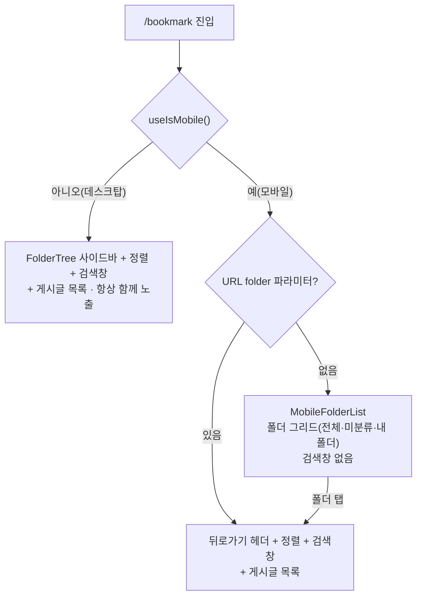

# 북마크 (폴더 관리 + 폴더 내 검색) 기능

> **문서 성격**: 독립 기능 문서(서사형)
>
> **대상 독자**: 이 레포 FE를 처음 보거나 오랜만에 돌아온 개발자.
>
> **읽고 나면**: 북마크 페이지의 반응형 분기·다중 폴더 소속 모델·"최근 저장한 폴더"
> 캐시 구조를 이해하고, 노출 개수나 정렬 옵션 같은 값을 어디서 바꾸는지 안다.
>
> **마지막 검토**: 2026-09-08

## 1. 쉬운 설명

북마크 폴더는 이메일의 **라벨**과 비슷하다. 메일 한 통에 라벨을 여러 개 붙일 수 있고
라벨이 하나도 없으면 "받은편지함"에만 있는 것처럼 보이듯, 북마크 하나도 **폴더 여러
개에 동시에** 속할 수 있고 어느 폴더에도 없으면 **미분류**로 취급된다(§5 "다중 폴더
소속 모델").

화면은 **화면 폭에 따라 완전히 다르게 그려진다** — 데스크탑은 폴더 사이드바와 게시글
목록이 항상 함께 보이지만, 모바일은 "폴더 목록 화면"과 "그 폴더 안 화면"이 분리된
drill-down 구조다. "웹에는 있는데 모바일엔 없다"처럼 보이는 요소는 대부분 이 분기
차이다.



| 조건                                                | 화면                                                    | 검색창(`BookmarkSearch`) |
| --------------------------------------------------- | ------------------------------------------------------- | ------------------------ |
| 모바일 + `folder` 파라미터 없음(`isMobileListMode`) | `MobileFolderList` — 폴더 그리드(전체·미분류·내 폴더)   | ❌ 없음                  |
| 모바일 + `folder` 선택됨                            | 뒤로가기 헤더 + 정렬 + **검색창** + 게시글 목록         | ✅ 있음                  |
| 데스크탑                                            | `FolderTree` 사이드바 + 정렬 + **검색창** + 게시글 목록 | ✅ 있음                  |

**핵심**: 모바일은 drill-down 구조라 **폴더(전체 폴더 포함)에 진입해야 검색창이
보인다.** 데스크탑은 사이드바+게시글이 항상 함께 보이므로 검색창이 처음부터
노출된다. 즉 두 플랫폼 모두 검색을 지원하며, 노출 시점만 다르다(현재 UX 의도).

## 2. 전제 지식

React Router의 URL 검색 파라미터(`useSearchParams`)와 TanStack Query의 쿼리 키·캐시
무효화 기본 개념은 안다고 가정한다.

가정하지 않는 것:

- React Query 캐시 무효화 전반의 팀 컨벤션(`*.keys.ts`의 `handle*Success` 패턴) →
  [`FE-ARCHITECTURE.md`](./FE-ARCHITECTURE.md)의 "3-Layer API 패턴"
- 이 문서에서 처음 보는 용어(`sessionKey`, `activeFolderKey` 등) → §12 용어 사전
- 코드부터 보고 싶다면 → §8 코드 지도

## 3. 사용한 도구·기술

**기능 자체를 이루는 것**

- **React Router `useSearchParams`** — 검색어(`q`)·선택 폴더(`folder`)·정렬(`sort`)을
  URL에 저장해 새로고침·뒤로가기에도 상태가 유지되게 한다
- **TanStack Query** — 폴더 목록·폴더별 게시글 무한 스크롤·낙관적 업데이트
- **Zod** — `bookmark-folder.schema.ts`의 폴더·요청/응답 스키마
- **Radix Dialog 기반 `BookmarkFolderSelectModal`** — 데스크탑 중앙 모달 / 모바일 Bottom Sheet
  (`SheetDialogContent`) 공용 프레젠테이션. (2026-09-08 정정: 이전엔 "Popover 기반"으로
  적혀 있었으나 실제 코드는 Popover를 쓴 적이 없다 — `Dialog` + `SheetDialogContent`뿐)

**구현·검증 과정에서 쓴 도구**

- **MSW** — `src/mocks/fixtures/bookmark-folder.fixtures.ts` + `bookmark-folder.handlers.ts`(폴더
  목록 + 소속 3개 엔드포인트 기본 핸들러)
- **Vitest** — §9 검증 결과 참고

## 4. 왜 만들었나

`v0.1.0`(2026-06-28) 이전에는 북마크가 단순 on/off 토글이었다. 저장한 링크가 늘어나면
분류할 방법이 없어 다시 찾기 어려웠다. YouTube Music의 "보관함에 저장" UX(탭 = 즉시
저장, 별도 확인 단계 없음)를 참고해 **폴더 분류 + 즉시 저장** 모델로 바꿨고, 이후
폴더가 많아지면서 폴더 안에서 다시 찾는 문제가 생겨 **폴더 내 검색**(2026-07-11)을
추가했다.

## 5. 구조

### API 엔드포인트

`src/entities/bookmark/folder/api/bookmark-folder.api.ts` 기준(`API_ENDPOINTS.bookmark`,
`shared/config/api.ts`).

| 메서드   | 경로                                                  | 설명                                                                          |
| -------- | ----------------------------------------------------- | ----------------------------------------------------------------------------- |
| `GET`    | `/bookmark/folders`                                   | 내 폴더 목록(`bookmarkCount`·`lastUsedAt` 포함, `sortOrder` ASC)              |
| `POST`   | `/bookmark/folders`                                   | 폴더 생성(`sort_order = max+1`)                                               |
| `PATCH`  | `/bookmark/folders/{id}`                              | 폴더 이름 수정                                                                |
| `DELETE` | `/bookmark/folders/{id}`                              | 폴더 삭제(**이 폴더에만 있던** 북마크만 미분류로 — 다른 폴더에도 있으면 유지) |
| `PATCH`  | `/bookmark/folders/reorder`                           | 폴더 순서 재정렬(`folderIds` 전체)                                            |
| `GET`    | `/bookmark/folders/{key}/posts?page&size&sort&search` | 폴더별 게시글 조회(검색 포함)                                                 |
| `POST`   | `/bookmark/{postId}/folders/{folderId}`               | 폴더에 추가(북마크 없으면 자동 생성)                                          |
| `DELETE` | `/bookmark/{postId}/folders/{folderId}`               | 그 폴더에서만 제거(북마크 자체는 유지)                                        |
| `DELETE` | `/bookmark/{postId}/folders`                          | 폴더 소속 전부 해제 → 미분류                                                  |

- `folderKey`(경로의 `{key}`): `'all' | 'uncategorized' | UUID`
- `sort`: `'latest' | 'oldest' | 'title' | 'views' | 'viewed'` — `viewed`(최근 열람순)는
  개인별 열람 기록(BE `post_views` 테이블) 기준. 한 번도 안 연 글은 항상 맨 뒤
- `search`: 값이 있을 때만 쿼리에 붙는다(`bookmark-folder.api.ts`의
  `if (search) searchParams.search = search`)
- 폴더 소속 관련 3개 엔드포인트(추가/제거/전체해제)는 모두 **멱등** — 이미 그 상태여도
  200을 반환하고 404를 던지지 않는다. 응답은 세 엔드포인트 공통으로
  `{ postId, isBookmarked, folderIds }`(`BookmarkFoldersResponse`)

### 다중 폴더 소속 모델

북마크 하나가 **여러 폴더에 동시에 소속**될 수 있다(N:M). 핵심 개념 3가지:

- **미분류 = 소속 폴더가 0개인 상태.** "폴더가 없는 상태"가 아니라 "폴더 중 어디에도
  속하지 않은 상태"다. `post.userInteractions.bookmarkFolderIds: string[]`가 빈
  배열이면 미분류다.
- **`전체` 행에는 숫자를 표시하지 않는다.** 폴더별 개수 합산은 다중 소속에서 중복
  집계되어 부정확하고, 정확한 값을 내려주려면 서버 필드가 필요한데 숫자 자체를 안
  보여주는 쪽으로 결정했다. 다만 **목록 자체는 중복 없이** 한 북마크가 여러 폴더에
  있어도 `전체`에는 한 번만 나온다(BE가 EXISTS 세미조인으로 보장).
- **폴더에서 제거 ≠ 북마크 제거.** 소속된 폴더 중 하나에서 빼도 다른 폴더 소속이나
  북마크 자체는 그대로다. 마지막 폴더에서 빠지면 미분류로 남을 뿐, 북마크가 사라지지
  않는다. 완전히 삭제하려면 `북마크 제거` 행을 따로 눌러야 한다.

### `PostCardBookmarkFolderModal` 행 동작

`BookmarkPostButton`을 누르면 열리는 모달(`features/bookmark/toggle/ui/PostCardBookmarkFolderModal.tsx`,
실제 마크업은 `features/bookmark/select/ui/BookmarkFolderSelectModal`)의 전체 동작이다. 탭 = 즉시
저장/제거 + 모달 닫힘(확인 단계 없음).

| 행          | 상태                      | 탭하면                           | 토스트                                                                                         |
| ----------- | ------------------------- | -------------------------------- | ---------------------------------------------------------------------------------------------- |
| 미분류      | 북마크 아님               | 북마크 켜기(미분류로 생성)       | `{folderName}에 저장되었습니다.`(미분류)                                                       |
| 미분류      | 북마크 O, 소속 0개(✓)     | **아무 것도 안 함**(no-op)       | 없음                                                                                           |
| 미분류      | 북마크 O, 소속 1개 이상   | 소속 전부 해제                   | `모든 폴더에서 제거되었습니다.`                                                                |
| 폴더 X      | 비소속                    | 그 폴더에 추가(자동 북마크)      | `{folderName}에 저장되었습니다.`                                                               |
| 폴더 X      | 소속(✓), 다른 폴더도 있음 | 그 폴더에서만 제거               | `{folderName} 폴더에서 제거되었습니다.`                                                        |
| 폴더 X      | 소속(✓), **마지막 폴더**  | 그 폴더에서만 제거 → 미분류가 됨 | `{folderName}에 저장되었습니다.`(미분류) + "마지막 폴더에서 제거되어 미분류로 이동되었습니다." |
| 북마크 제거 | —                         | 북마크 완전 삭제(소속도 전부)    | `북마크가 제거되었습니다.`                                                                     |

체크된 미분류가 no-op인 이유: "미분류에서 제거"는 곧 북마크 해제인데 그건
`북마크 제거` 행과 중복되고, 오탭 한 번으로 북마크가 조용히 사라지면 안 되기
때문이다. 소속된 모든 폴더에 **동일한 ✓ 아이콘**이 표시된다(다중 선택 UI가 아니라,
탭할 때마다 즉시 반영되는 토글 방식).

### "최근 저장한 폴더" 상단 구획(split menu)

폴더 목록 순서를 고정할지 최근 사용순으로 올릴지에 대한 결론이다. [Sears &
Shneiderman(1994)](https://dl.acm.org/doi/10.1145/174630.174632)의 split menu
연구를 따라 **상단에 최근 저장한 폴더 최대 3개를 별도
구획으로 보여주되, 아래 본 목록 순서는 절대 바꾸지 않는다.** 상단 구획의 폴더도 아래
본 목록에서 빼지 않고 그대로 중복 표시한다 — 빼면 본 목록의 나머지 위치가 흔들려
공간기억이 깨지기 때문이다.

`entities/bookmark/folder/hooks/useRecentBookmarkFolders.ts`가 스냅샷 로직을,
`entities/bookmark/folder/utils/bookmark-folder.util.ts`의 `pickRecentFolders`가 선정 로직을
담당한다(노출 조건·개수는 운영 파라미터라 §7로 뺐다). 스냅샷 동작은 §10 시행착오에서
실제로 버그가 났던 부분이라 함께 읽으면 이해가 빠르다.

### 링크 등록 폼의 폴더 선택(`PostCreateBookmarkFolderField`) — 이 페이지가 아닌 다른 화면

`src/features/post/create/ui/PostCreateBookmarkFolderField.tsx`는 `/bookmark` 페이지가
아니라 **링크 등록 폼**(`CreatePostForm`)에 있는 필드다. `PostCardBookmarkFolderModal`과
같은 `features/bookmark/select/ui/BookmarkFolderSelectModal`을 쓰고 주입하는 콜백만 다르다 —
저장 동작을 콜백으로 넘기는 쪽이 즉시 저장인지 지연 선택인지에 따라 핵심 동작이 갈린다.

|                       | `PostCardBookmarkFolderModal`(북마크 페이지) | `PostCreateBookmarkFolderField`(등록 폼)                      |
| --------------------- | -------------------------------------------- | ------------------------------------------------------------- |
| 대상                  | 이미 존재하는 북마크                         | 아직 만들어지지 않은 게시글                                   |
| 행 탭                 | 즉시 API 호출로 저장/제거 + 모달 닫힘        | 폼의 `bookmark`/`folderIds` 값만 변경, 모달 안 닫힘           |
| 확정 시점             | 탭하는 순간                                  | 등록 제출(`POST /post`) 시 BE가 한 번에 처리                  |
| 확인 버튼             | 없음                                         | 있음(하단 고정, 지연 선택을 닫아 확정)                        |
| 하단 destructive 행   | `북마크 제거`(열 때 북마크였을 때만)         | `북마크 안 함`(항상 노출) — 탭하면 확인 없이 바로 모달을 닫음 |
| 미분류 재탭           | no-op                                        | no-op(동일)                                                   |
| 최근 저장한 폴더 구획 | 있음                                         | 있음                                                          |
| 행별 pending 스피너   | 있음                                         | 없음(핸들러가 동기라 표시될 틈이 없음)                        |

폼 스키마(`entities/post/model/post.schema.ts`의 `createPostSchema`)에
`bookmark: boolean`, `folderIds: string[]` 두 필드가 있고, 등록 성공 시
`useCreatePostMutation`이 이 값을 보고 폴더 캐시를 조건부로 무효화한다(§6 상태
모델의 `handleBookmarkFolderChangeSuccess`와 같은 종류의 후속 처리).

## 6. 상태 모델

### `bookmarkFolderKeys` 쿼리 키 계층 (`entities/bookmark/folder/api/bookmark-folder.keys.ts`)

```typescript
const rootKey = ['folder'] as const;

bookmarkFolderKeys.root; // ['folder']
bookmarkFolderKeys.list; // ['folder', 'list']              — 폴더 목록(사이드바·그리드·선택기)
bookmarkFolderKeys.postsRoot; // ['folder', 'posts']              — 모든 폴더별 게시글 쿼리의 공통 조상
bookmarkFolderKeys.posts(folderKey, sort, search);
// ['folder', 'posts', folderKey, sort ?? 'latest', search ?? '']
```

무효화는 `bookmarkFolderInvalidateQueries`(`all`/`list`/`postsRoot`/`posts`)를 통해서만
하고, 실제로 "이런 변경 후엔 뭘 무효화하는지"는 같은 파일의 `handle*Success` 함수
8개가 결정한다 — 예를 들어 `handleBookmarkFolderChangeSuccess`(폴더 소속 변경 후)는
`bookmarkFolderKeys.list` + `bookmarkFolderKeys.postsRoot` + `post.detail`/`post.list`까지
무효화한다. 원본은 옮겨적지 않는다 — 정확한 최신 목록은 `bookmark-folder.keys.ts`를 직접
확인한다.

### `BookmarkFolder` 스키마 (`entities/bookmark/folder/model/bookmark-folder.schema.ts`)

| 필드                      | 타입                        | 비고                                                            |
| ------------------------- | --------------------------- | --------------------------------------------------------------- |
| `id`                      | `string`                    |                                                                 |
| `name`                    | `string`                    |                                                                 |
| `sortOrder`               | `number`                    |                                                                 |
| `bookmarkCount`           | `number`                    |                                                                 |
| `createdAt` / `updatedAt` | `Date`(`z.coerce.date()`)   |                                                                 |
| `lastUsedAt`              | `Date \| null \| undefined` | 이 폴더에 마지막으로 저장한 시각. 한 번도 저장 안 됐으면 `null` |

**주의**: `bookmarkFolderApi.fetchBookmarkFolderList`는 `apiClient.get<BookmarkFolderListResponse>()`로
제네릭 캐스팅만 할 뿐 이 스키마로 실제 파싱(`.parse()`)하지 않는다. 그래서
`lastUsedAt`은 타입상 `Date`지만 **런타임엔 BE가 보낸 원시 ISO 문자열 그대로**
들어온다(`createdAt`/`updatedAt`도 동일). `Date` 메서드를 직접 호출하지 말고
`dayjs(value)`로 감싸야 문자열·`Date` 어느 쪽이 와도 안전하다(2026-09-08:
CLAUDE.md의 `new Date()`/`.getTime()` 금지 규칙에 맞춰 `new Date(value)` 방어
코드를 `dayjs(value)`로 치환 — `entities/bookmark/folder/utils/bookmark-folder.util.ts`의
`pickRecentFolders` 참고).

## 7. 운영 파라미터

"최근 저장한 폴더" 상단 구획 노출 기준.

| 파라미터                                     | 값  | 실제 위치                                                                                               |
| -------------------------------------------- | --- | ------------------------------------------------------------------------------------------------------- |
| 상단 구획 노출 최소 전체 폴더 수             | 6   | `entities/bookmark/folder/config/bookmark-folder.const.ts`의 `MIN_BOOKMARK_FOLDER_COUNT_TO_SHOW_RECENT` |
| 상단 구획 노출 최소 "저장 이력 있는" 폴더 수 | 3   | `pickRecentFolders`(`entities/bookmark/folder/utils/bookmark-folder.util.ts`)가 두 조건을 함께 검사     |
| 상단 구획 고정 노출 개수                     | 3   | `entities/bookmark/folder/config/bookmark-folder.const.ts`의 `RECENT_BOOKMARK_FOLDER_COUNT`             |

둘 중 하나라도 못 채우면 상단 구획 자체가 안 뜬다(0개 아니면 3개, 1~2개인 중간
상태는 없음) — 개수가 흔들리면 아래 본 목록의 시작 위치도 흔들리기 때문이다.

## 8. 코드 지도와 자주 하는 수정

```
src/
├── pages/
│   └── bookmark/
│       └── BookmarkPage.tsx              # 3분기 렌더링 + folder/sort/q URL 파라미터 wiring
├── widgets/
│   └── bookmark/
│       ├── bookmark-search/ui/
│       │   └── BookmarkSearch.tsx        # 검색 위젯 (q URL 파라미터 자체 관리)
│       ├── bookmark-post-list/ui/
│       │   └── BookmarkPostList.tsx      # search prop 소비 + 무한스크롤 + 빈 상태 분기
│       └── folder-tree/ui/
│           ├── FolderTree.tsx            # 데스크탑 사이드바 (폴더 트리, 전체 행은 숫자 없음)
│           └── MobileFolderList.tsx      # 모바일 폴더 그리드 (drill-down)
│                                          # 위 둘 + BookmarkFolderSelectModal(아래) 모두 "최근 저장한
│                                          # 폴더" + "내 폴더" 두 구획 포함(§5)
├── features/
│   ├── bookmark/                     # 2026-09-08 post/bookmark에서 승격 — entities/widgets/
│   │   │                             # pages와 bookmark 도메인 그룹을 통일
│   │   ├── select/
│   │   │   ├── hooks/
│   │   │   │   └── useBookmarkFolderSelect.ts # BookmarkFolderSelectModal의 로직 전부(조회·생성·
│   │   │   │                                 # 행별 pending·미분류 재탭 no-op)
│   │   │   └── ui/
│   │   │       └── BookmarkFolderSelectModal.tsx # JSX만 — 폴더 선택 모달/바텀시트 공용
│   │   │                                         # 프레젠테이션. PostCardBookmarkFolderModal·
│   │   │                                         # PostCreateBookmarkFolderField가 공유하고 저장
│   │   │                                         # 동작만 콜백으로 주입받는다
│   │   └── toggle/
│   │       ├── hooks/
│   │       │   ├── useBookmarkFolders.ts             # add/remove/clear/toggle 라우팅
│   │       │   └── usePostCardBookmarkFolderModal.ts # 즉시 저장 동작 + 토스트 분기 + 닫힘
│   │       │                                         # 애니메이션 중 버튼 깜빡임 방지 스냅샷
│   │       │                                         # (PostCardBookmarkFolderModal 전용)
│   │       └── ui/
│   │           ├── BookmarkPostButton.tsx            # 카드의 북마크 버튼 — 클릭 시
│   │           │                                     # PostCardBookmarkFolderModal 오픈
│   │           └── PostCardBookmarkFolderModal.tsx   # JSX만(2026-09-08, BookmarkFolderModal에서
│   │                                                 # 개명 — 아래 BookmarkFolderSelectModal과
│   │                                                 # 이름이 겹쳐 호출 맥락(PostCard) 접두사를
│   │                                                 # 붙임) — 로직은 usePostCardBookmarkFolderModal,
│   │                                                 # 모달 마크업은 BookmarkFolderSelectModal(아래)에 위임
│   └── post/
│       └── create/
│           ├── hooks/
│           │   └── usePostCreateBookmarkFolderField.ts # 등록 폼 bookmark/folderIds 필드 제어 +
│           │                                           # 지연 선택 핸들러
│           │                                           # (PostCreateBookmarkFolderField 전용)
│           └── ui/
│               └── PostCreateBookmarkFolderField.tsx   # JSX만(2026-09-08, BookmarkFolderField에서
│                                                       # 개명 — 위와 같은 이유) — 로직은
│                                                       # usePostCreateBookmarkFolderField
├── entities/
│   └── bookmark/
│       └── folder/
│           ├── api/
│           │   ├── bookmark-folder.api.ts     # 폴더 CRUD + 소속 추가/제거/전체해제 + 폴더별 게시글 API
│           │   ├── bookmark-folder.queries.ts # useBookmarkFolderListQuery, mutations (낙관적
│           │   │                             # 갱신 공용 헬퍼 포함)
│           │   └── bookmark-folder.keys.ts    # §6 쿼리 키 + cross-invalidation
│           ├── model/
│           │   └── bookmark-folder.schema.ts  # §6 BookmarkFolder 스키마
│           ├── config/
│           │   └── bookmark-folder.const.ts   # RECENT_BOOKMARK_FOLDER_COUNT,
│           │                                 # MIN_BOOKMARK_FOLDER_COUNT_TO_SHOW_RECENT
│           ├── utils/
│           │   └── bookmark-folder.util.ts    # pickRecentFolders — "최근 저장한 폴더" 선정 로직(§7)
│           └── hooks/
│               └── useRecentBookmarkFolders.ts # 스냅샷 로직 (§5, §10)
└── shared/
    ├── api/client.ts                     # apiClient — 공통 HTTP 클라이언트
    ├── ui/elements/
    │   └── SearchInput.tsx               # 공통 검색 입력 (아이콘 + 단축키 Kbd)
    └── config/
        ├── api.ts                        # bookmark 엔드포인트
        └── texts.ts                      # TEXTS — placeholders.bookmarkSearch 등 문구 상수
```

테스트: `src/mocks/fixtures/bookmark-folder.fixtures.ts`,
`src/mocks/handlers/bookmark-folder.handlers.ts`(폴더 목록 + 소속 3개 엔드포인트 기본
핸들러), §9의 5개 테스트 파일.

이 문서에서 파일명만으로 등장하는 식별자의 위치: `activeFolderKey`는
`BookmarkPage.tsx:68`의 로컬 변수(`folderKey ?? 'all'`), `sessionKey`는
`useRecentBookmarkFolders`의 세 번째 매개변수
(`entities/bookmark/folder/hooks/useRecentBookmarkFolders.ts:25`)다.

### 자주 하는 수정

| 하고 싶은 것                             | 방법                                                                                                                                          |
| ---------------------------------------- | --------------------------------------------------------------------------------------------------------------------------------------------- |
| "최근 저장한 폴더" 노출 개수·임계값 조정 | `entities/bookmark/folder/config/bookmark-folder.const.ts`의 두 상수                                                                          |
| 정렬 옵션 추가                           | `bookmark-folder.schema.ts`의 `bookmarkFolderSortEnum`에 값 추가 + BE 대응 필요                                                               |
| 폴더 내 검색 빈 상태 문구 변경           | `TEXTS.bookmark.empty.searchNoResult`(`shared/config/texts.ts`)                                                                               |
| 모바일 감지 기준 변경                    | `src/shared/hooks/useIsMobile.ts`의 `matchMedia` 브레이크포인트                                                                               |
| 테스트 실행                              | `npx vitest run src/entities/bookmark/folder src/features/bookmark/toggle src/features/post/create/ui/PostCreateBookmarkFolderField.test.tsx` |

## 9. 검증 결과

관련 테스트 5개 파일, 50개 테스트 모두 통과(2026-09-08 재확인, 3형제 로직 분리·개명 후):
`useRecentBookmarkFolders.test.ts`(7) · `bookmark-folder.schema.test.ts`(16) ·
`bookmark-folder.queries.test.ts`(8) · `PostCardBookmarkFolderModal.test.tsx`(8) ·
`PostCreateBookmarkFolderField.test.tsx`(11) — 로직을 훅으로 옮기고 컴포넌트를
개명(`FolderSelector`→`BookmarkFolderModal`, `BookmarkFolderPicker`→`BookmarkFolderField`)했지만
각 테스트의 단언은 한 줄도 바뀌지 않았다. 같은 날 두 번째 개명(`BookmarkFolderModal`→
`PostCardBookmarkFolderModal`, `BookmarkFolderField`→`PostCreateBookmarkFolderField` —
`entities/bookmark/folder/ui/FolderPickerModal`(현재 `BookmarkFolderSelectModal`)과
이름·JSDoc이 겹쳐 구분이 안 된다는 지적에 따라 호출 맥락 접두사를 붙임)에서도, 세 번째
개명(2026-09-09, entities/bookmark/folder/ 전체 export에 BookmarkFolder 접두사를
통일하면서 `FolderSelectModal`→`BookmarkFolderSelectModal`, `useFolderSelect`→
`useBookmarkFolderSelect`로 재개명)에서도, 그리고 네 번째 개명(2026-09-09, 파일명
`folder.api.ts` 등 6개 역할 파일 + mocks 2개 + `useRecentFolders.ts`를 `bookmark-folder.*`/
`useRecentBookmarkFolders.ts`로 통일 — export명은 이미 세 번째 개명에서 BookmarkFolder로
바뀌었는데 파일명만 뒤처져 있던 것을 바로잡음)에서도 동일하게 5개 파일·50개 테스트
그대로 재확인됐다.

## 10. 시행착오 — "최근 저장한 폴더"가 삭제 후 옛 값으로 굳어 있던 문제

게시글을 삭제하고 북마크 페이지로 돌아오면, 새로고침 전까지 폴더의 게시글 개수와
"최근 저장한 폴더" 구획이 삭제 전 값 그대로 보이는 문제가 있었다.

원인은 BE·React Query 무효화가 아니라 `useRecentBookmarkFolders`의 스냅샷 방식이었다 —
세션 중 순서를 고정하려던 의도(split menu 공간기억, §5)가 `BookmarkFolder` **객체 전체**
(카운트 포함)를 얼렸고, 스냅샷 시점도 `isLoading`(캐시가 없을 때만 `true`) 기준이라
재방문 시엔 stale 캐시로 곧장 확정돼버려 뒤이은 refetch 결과가 반영되지 않았다.

수정: 스냅샷 대상을 **폴더 id 목록만**으로 좁히고(순서는 고정, `bookmarkCount` 등
값은 매 렌더 최신 `folderList`에서 재조회 — §6 상태 모델의 "id 목록만 스냅샷" 서술이
이 결과다), 스냅샷 시점을 `isFetching`이 꺼지는 순간(재검증 완료 후)으로 옮겼다.
더불어 `useDeletePostMutation`에만 없던 낙관적 폴더 카운트 감소를 다른 북마크 변경
mutation과 동일한 패턴으로 추가해, invalidate 응답을 기다리는 동안의 순간적인 stale
노출도 없앴다.

영향 파일(당시 경로): `entities/folder/model/`의 `useRecentFolders.ts`(현재
`entities/bookmark/folder/hooks/useRecentBookmarkFolders.ts`),
`widgets/bookmark/folder-tree/ui/FolderTree.tsx`,
`widgets/bookmark/folder-tree/ui/MobileFolderList.tsx`,
`features/post/bookmark/ui/`의 `FolderSelector.tsx`(현재
`features/bookmark/toggle/ui/PostCardBookmarkFolderModal.tsx`), `entities/post/api/post.queries.ts`.

## 11. 남은 것

현재 알려진 미해결 이슈 없음.

## 12. 용어 사전

- **`activeFolderKey`** — `BookmarkPage.tsx:68`의 로컬 변수. URL의 `folder` 파라미터를
  `BookmarkFolderKey`(`'all' | 'uncategorized' | UUID`)로 정규화한 값(`folderKey ?? 'all'`)
- **`sessionKey`** — `useRecentBookmarkFolders`의 세 번째 매개변수(`unknown` 타입). 값이
  바뀔 때마다 "최근 저장한 폴더" 스냅샷을 새로 찍는다. 모달(`BookmarkFolderSelectModal`)은
  열림 상태를 넘겨 열 때마다 새 세션으로 취급하고, 상시 마운트 화면(`FolderTree`
  등)은 넘기지 않아 마운트 수명 전체가 한 세션이 된다
- **`apiClient`** — `src/shared/api/client.ts`의 공통 HTTP 클라이언트
- **`TEXTS`** — `src/shared/config/texts.ts`의 문구 상수 객체
- **`BookmarkFolderSelectModal`** — `features/bookmark/select/` 소유의 공용 폴더 선택 프레젠테이션(§8 코드 지도).
  2026-09-08 이전 이름은 `FolderPickerModal`("Picker") — Radix 드롭다운 원자
  (`shared/ui/atoms/select.tsx`)와 무관하게, 내부 props(`onSelectFolder` 등)가 이미
  "select" 어휘를 쓰고 있어 접미사를 "Select"로 통일해 `FolderSelectModal`이 됐다.
  2026-09-09에 entities/bookmark/folder/ 전체 export를 `BookmarkFolder` 접두사로
  통일하면서 다시 `BookmarkFolderSelectModal`로 개명했다(features 레이어가 이미
  전부 이 접두사를 쓰는데 entities만 안 쓰던 불일치를 해소).
- **`PostCreateBookmarkFolderField`** — §5 "링크 등록 폼의 폴더 선택" 참고. 등록 폼
  전용이고, 북마크 페이지의 `PostCardBookmarkFolderModal`과는 별개 컴포넌트다
  (2026-09-08 이전에는 각각 `BookmarkFolderPicker`·`FolderSelector`로, 그 뒤
  `BookmarkFolderField`·`BookmarkFolderModal`로 불렸으나 `entities/bookmark/folder/ui/FolderPickerModal`
  (현재 `BookmarkFolderSelectModal`)과 이름·설명이 겹쳐 구분이 안 돼 호출 맥락 접두사
  `PostCreate`·`PostCard`를 붙여 다시 개명했다)

## 13. 관련 문서

- 날짜별 변경 로그: [HISTORY.md](./HISTORY.md) — 2026-06-28 "북마크 폴더 관리 기능 도입",
  2026-07-11 "북마크 페이지 내 검색 기능 추가"
- 모바일 내비게이션(하단 탭바) 결정 배경: [DECISIONS.md](./DECISIONS.md)
- 캐시 무효화 전반의 팀 컨벤션: [FE-ARCHITECTURE.md](./FE-ARCHITECTURE.md)
