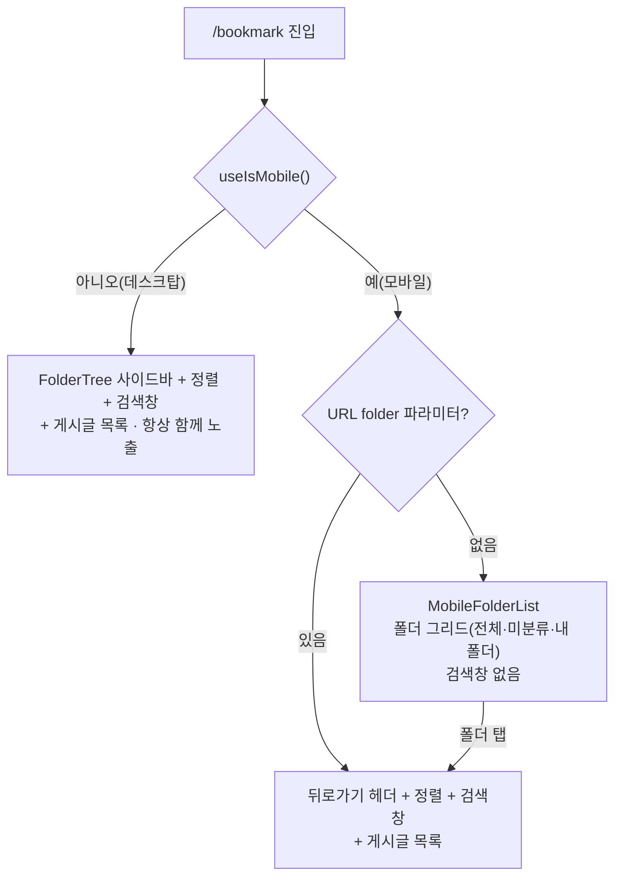

# 북마크 (폴더 관리 + 폴더 내 검색) 기능

> **문서 성격**: 독립 기능 문서(서사형)
>
> **대상 독자**: 이 레포 FE를 처음 보거나 오랜만에 돌아온 개발자.
>
> **읽고 나면**: 북마크 페이지의 반응형 분기·다중 폴더 소속 모델·"최근 저장한 폴더"
> 캐시 구조를 이해하고, 노출 개수나 정렬 옵션 같은 값을 어디서 바꾸는지 안다.
>
> **마지막 검토**: 2026-09-21

## 1. 쉬운 설명

북마크 폴더는 이메일의 **라벨**과 비슷하다. 메일 한 통에 라벨을 여러 개 붙일 수 있고
라벨이 하나도 없으면 "받은편지함"에만 있는 것처럼 보이듯, 북마크 하나도 **폴더 여러
개에 동시에** 속할 수 있고 어느 폴더에도 없으면 **미분류**로 취급된다(§5 "다중 폴더
소속 모델"). 단, 이 비유는 **마지막 라벨을 뗄 때는 어긋난다** — Gmail은 라벨을 다
떼도 메일이 "전체 편지함"에 남지만, 이 앱은 마지막 폴더에서 빠지면 미분류로 남기지
않고 북마크 자체를 완전히 지운다(§5, §10). 이미 미분류(폴더가 하나도 안 붙은
상태)인 북마크를 다시 "제거"해도 마찬가지다 — 미분류는 "마지막 라벨을 뗀 상태"와
같은 상태이므로 같은 규칙을 그대로 적용한다(2026-09-11 재결정, §10).

화면은 **화면 폭에 따라 완전히 다르게 그려진다** — 데스크탑은 폴더 사이드바와 게시글
목록이 항상 함께 보이지만, 모바일은 "폴더 목록 화면"과 "그 폴더 안 화면"이 분리된
drill-down 구조다. "웹에는 있는데 모바일엔 없다"처럼 보이는 요소는 대부분 이 분기
차이다.



| 조건                                                | 화면                                                    | 검색창(`BookmarkSearch`) |
| --------------------------------------------------- | ------------------------------------------------------- | ------------------------ |
| 모바일 + `folder` 파라미터 없음(`isMobileListMode`) | `MobileFolderList` — 폴더 그리드(전체·미분류·내 폴더)   | ❌ 없음                  |
| 모바일 + `folder` 선택됨                            | 뒤로가기 헤더 + 정렬 + **검색창** + 게시글 목록         | ✅ 있음                  |
| 데스크탑                                            | `FolderTree` 사이드바 + 정렬 + **검색창** + 게시글 목록 | ✅ 있음                  |

**핵심**: 모바일은 drill-down 구조라 **폴더(전체 폴더 포함)에 진입해야 검색창이
보인다.** 데스크탑은 사이드바+게시글이 항상 함께 보이므로 검색창이 처음부터
노출된다. 즉 두 플랫폼 모두 검색을 지원하며, 노출 시점만 다르다(현재 UX 의도).

## 2. 전제 지식

React Router의 URL 검색 파라미터(`useSearchParams`)와 TanStack Query의 쿼리 키·캐시
무효화 기본 개념은 안다고 가정한다.

가정하지 않는 것:

- React Query 캐시 무효화 전반의 팀 컨벤션(`*.keys.ts`의 `handle*Success` 패턴) →
  [`FE-ARCHITECTURE.md`](./FE-ARCHITECTURE.md)의 "3-Layer API 패턴"
- 이 문서에서 처음 보는 용어(`sessionKey`, `activeFolderKey` 등) → §12 용어 사전
- 코드부터 보고 싶다면 → §8 코드 지도

## 3. 사용한 도구·기술

**기능 자체를 이루는 것**

- **React Router `useSearchParams`**(경유지: [`useSearchParamsDraft`](../src/shared/hooks/useSearchParamsDraft.ts)) —
  검색어(`q`)·선택 폴더(`folder`)·정렬(`sort`)을 URL에 저장해 새로고침·뒤로가기에도 상태가
  유지되게 한다. `BookmarkPage.tsx`(folder/sort)와 `useBookmarkSearch.ts`(q)는 서로 다른
  컴포넌트라 각자 훅을 호출하지만, `useSearchParamsDraft`가 URL 쓰기 전 pending 의도를
  모듈 스코프로 공유해 한쪽이 다른 쪽의 아직 반영 안 된 변경을 덮어쓰지 않는다(§10).
- **TanStack Query** — 폴더 목록·폴더별 게시글 무한 스크롤·낙관적 업데이트
- **Zod** — `bookmark-folder.schema.ts`의 폴더·요청/응답 스키마
- **Radix Dialog 기반 `BookmarkFolderSelectModal`** — 데스크탑 중앙 모달 / 모바일 Bottom Sheet
  (`SheetDialogContent`) 공용 프레젠테이션. (2026-09-08 정정: 이전엔 "Popover 기반"으로
  적혀 있었으나 실제 코드는 Popover를 쓴 적이 없다 — `Dialog` + `SheetDialogContent`뿐)

**구현·검증 과정에서 쓴 도구**

- **MSW** — `src/mocks/fixtures/bookmark-folder.fixtures.ts` + `bookmark-folder.handlers.ts`(폴더
  목록 + 소속 3개 엔드포인트 기본 핸들러)
- **Vitest** — §9 검증 결과 참고

## 4. 왜 만들었나

`v0.1.0`(2026-06-28) 이전에는 북마크가 단순 on/off 토글이었다. 저장한 링크가 늘어나면
분류할 방법이 없어 다시 찾기 어려웠다. YouTube Music의 "보관함에 저장" UX(탭 = 즉시
저장, 별도 확인 단계 없음)를 참고해 **폴더 분류 + 즉시 저장** 모델로 바꿨고, 이후
폴더가 많아지면서 폴더 안에서 다시 찾는 문제가 생겨 **폴더 내 검색**(2026-07-11)을
추가했다.

## 5. 구조

### API 엔드포인트

`src/entities/bookmark/folder/api/bookmark-folder.api.ts` 기준(`API_ENDPOINTS.bookmark`,
`shared/config/api.ts`).

| 메서드   | 경로                                                  | 설명                                                                          |
| -------- | ----------------------------------------------------- | ----------------------------------------------------------------------------- |
| `GET`    | `/bookmark/folders`                                   | 내 폴더 목록(`bookmarkCount`·`lastUsedAt` 포함, `sortOrder` ASC)              |
| `POST`   | `/bookmark/folders`                                   | 폴더 생성(`sort_order = max+1`)                                               |
| `PATCH`  | `/bookmark/folders/{id}`                              | 폴더 이름 수정                                                                |
| `DELETE` | `/bookmark/folders/{id}`                              | 폴더 삭제(**이 폴더에만 있던** 북마크만 미분류로 — 다른 폴더에도 있으면 유지) |
| `PATCH`  | `/bookmark/folders/reorder`                           | 폴더 순서 재정렬(`folderIds` 전체)                                            |
| `GET`    | `/bookmark/folders/{key}/posts?page&size&sort&search` | 폴더별 게시글 조회(검색 포함)                                                 |
| `POST`   | `/bookmark/{postId}/folders/{folderId}`               | 폴더에 추가(북마크 없으면 자동 생성)                                          |
| `DELETE` | `/bookmark/{postId}/folders/{folderId}`               | 그 폴더에서만 제거(북마크 자체는 유지)                                        |
| `DELETE` | `/bookmark/{postId}/folders`                          | 폴더 소속 전부 해제 → 미분류                                                  |

- `folderKey`(경로의 `{key}`): `'all' | 'uncategorized' | UUID`
- `sort`: `'latest' | 'oldest' | 'title' | 'views' | 'viewed'` — `viewed`(최근 열람순)는
  개인별 열람 기록(BE `post_views` 테이블) 기준. 한 번도 안 연 글은 항상 맨 뒤
- `search`: 값이 있을 때만 쿼리에 붙는다(`bookmark-folder.api.ts`의
  `if (search) searchParams.search = search`)
- 폴더 소속 관련 3개 엔드포인트(추가/제거/전체해제)는 모두 **멱등** — 이미 그 상태여도
  200을 반환하고 404를 던지지 않는다. 응답은 세 엔드포인트 공통으로
  `{ postId, isBookmarked, folderIds }`(`BookmarkFoldersResponse`)

### 다중 폴더 소속 모델

북마크 하나가 **여러 폴더에 동시에 소속**될 수 있다(N:M). 핵심 개념 3가지:

- **미분류 = 소속 폴더가 0개인 상태.** "폴더가 없는 상태"가 아니라 "폴더 중 어디에도
  속하지 않은 상태"다. `post.userInteractions.bookmarkFolderIds: string[]`가 빈
  배열이면 미분류다.
- **`전체` 행에는 숫자를 표시하지 않는다.** 폴더별 개수 합산은 다중 소속에서 중복
  집계되어 부정확하고, 정확한 값을 내려주려면 서버 필드가 필요한데 숫자 자체를 안
  보여주는 쪽으로 결정했다. 다만 **목록 자체는 중복 없이** 한 북마크가 여러 폴더에
  있어도 `전체`에는 한 번만 나온다(BE가 EXISTS 세미조인으로 보장).
- **폴더에서 제거 ≠ 북마크 제거 — 단, 마지막 폴더는 예외.** 소속된 폴더가 2개 이상일
  때 그중 하나에서 빼면 다른 폴더 소속이나 북마크 자체는 그대로다. 하지만 그 폴더가
  유일한 소속(마지막 폴더)이었다면 미분류로 남기지 않고 북마크 자체를 완전 삭제한다
  (2026-09-11 변경, §10 참고) — 되돌리기 토스트로 8초 안에 원복할 수 있다. 여러
  폴더에서 한꺼번에 빠지는 미분류 행("소속 전부 해제")은 이 규칙과 무관하게 여전히
  북마크를 미분류로 남긴다 — 사용자가 명시적으로 "전체 해제"를 고른 것이지 마지막
  하나를 무심코 뺀 게 아니기 때문이다. 반대로 **이미 미분류인 상태에서** 미분류
  행을 다시 탭하면(소속이 이미 0개) 이건 더 뺄 폴더가 없으므로 "마지막 폴더 탭"과
  동일하게 완전 삭제로 처리한다(2026-09-11 재결정, §10) — "전체 해제로 방금 도착한
  상태"와 "그 상태를 다시 탭한 것"은 다른 사용자 의도로 본다.

### `PostCardBookmarkFolderModal` 행 동작

`BookmarkPostButton`을 누르면 열리는 모달(`features/bookmark/toggle/ui/PostCardBookmarkFolderModal.tsx`,
실제 마크업은 `features/bookmark/select/ui/BookmarkFolderSelectModal`)의 전체 동작이다. 탭 = 즉시
저장/제거 + 모달 닫힘(확인 단계 없음). 폴더 목록만 스크롤되고, 새 폴더 만들기(헤더
바로 아래)·북마크 제거(하단)는 폴더가 몇 개든 항상 화면에 보인다(2026-09-11 —
전에는 셋 다 같은 스크롤 영역에 있어 폴더가 많으면 두 행이 스크롤 밖으로
밀렸다).

| 행          | 상태                      | 탭하면                                            | 토스트                                                                                                 |
| ----------- | ------------------------- | ------------------------------------------------- | ------------------------------------------------------------------------------------------------------ |
| 미분류      | 북마크 아님               | 북마크 켜기(미분류로 생성)                        | `{folderName}에 저장했어요.`(미분류)                                                                   |
| 미분류      | 북마크 O, 소속 0개(✓)     | **북마크 자체를 완전 삭제**(2026-09-11 변경)      | `북마크를 제거했어요.` + 되돌리기 액션(8초)                                                            |
| 미분류      | 북마크 O, 소속 1개 이상   | 소속 전부 해제                                    | `모든 폴더에서 제거했어요.`                                                                            |
| 폴더 X      | 비소속                    | 그 폴더에 추가(자동 북마크)                       | `{folderName}에 저장했어요.`                                                                           |
| 폴더 X      | 소속(✓), 다른 폴더도 있음 | 그 폴더에서만 제거                                | `{folderName} 폴더에서 제거했어요.`                                                                    |
| 폴더 X      | 소속(✓), **마지막 폴더**  | **북마크 자체를 완전 삭제**(미분류로 남기지 않음) | `{folderName} 폴더에서 제거했어요.` + "마지막 폴더라서 북마크도 함께 제거했어요." + 되돌리기 액션(8초) |
| 북마크 제거 | 소속 0~1개                | 북마크 완전 삭제(소속도 전부)                     | `북마크를 제거했어요.` + 되돌리기 액션(8초)                                                            |
| 북마크 제거 | 소속 2개 이상             | 북마크 완전 삭제(소속도 전부)                     | `북마크를 제거했어요.`(되돌리기 없음 — 일괄 복원 범위 밖)                                              |

체크된 미분류를 다시 탭하면 폴더 행의 "마지막 폴더 탭"과 똑같이 파괴적 조작이 된다
(2026-09-11 재결정, §10) — 처음엔 "미분류는 되돌릴 폴더가 없어 Undo가 불가능하다"는
이유로 no-op으로 막아뒀지만, 이는 틀린 전제였다: 하단 `북마크 제거` 행이 이미
같은 상태(소속 0개)에서 되돌리기를 제공하고 있었다(`restoreBookmark([])` →
`toggleBookmark()`로 재생성). 새 메커니즘을 만들지 않고 그 경로를 그대로 위임했다
(`handleSelectUncategorized`가 이미 미분류면 `handleRemove()`를 호출).
`docs/DECISIONS.md`의 같은 날짜 항목("미분류 재탭 no-op 결정 번복") 참고. 소속된
모든 폴더에 **동일한 ✓ 아이콘**이 표시된다(다중 선택 UI가 아니라, 탭할 때마다 즉시
반영되는 토글 방식).

### 새 폴더 만들기 인라인 폼의 취소(2026-09-21)

"새 폴더 만들기"를 탭한 뒤 이름을 입력하면 폼에서 빠져나갈 방법이 없었다(Escape로도
`handleBlur`(입력이 있으면 no-op)로도 안 닫혔다). 세 곳(저장 모달·데스크톱 사이드바·
모바일 카드) 모두에 취소 버튼을 추가했다 — `variant="ghost"`, 생성 버튼 왼쪽,
확인창 없이 즉시 입력을 버리고 폼을 접는다. 근거는
[NN/g "Cancel vs Close"](https://www.nngroup.com/articles/cancel-vs-close/)(취소
버튼이 필요한 이유)와 [NN/g "Reset and Cancel Buttons"](https://www.nngroup.com/articles/reset-and-cancel-buttons/)
(버튼을 늘릴 때의 위계 비용) — 상세 비교는 `docs/DECISIONS.md` 2026-09-21 항목 참고.

- **데스크톱 사이드바(`FolderTree.tsx`)만 2줄로 바뀐다** — 사이드바 폭(`w-60`=240px)에서
  `[입력][취소][생성]` 한 줄이면 입력 텍스트 영역이 66px만 남아 placeholder(`새 폴더
이름`, ~77px)가 잘린다. 입력을 위, `[취소][생성]` 행을 아래로 나눴다.
- **모바일 카드(`MobileFolderList.tsx`)의 버튼은 세로가 아니라 가로로 나열한다** —
  세로로 쌓으면 카드 높이가 늘어 `grid` row 전체가 커지고 옆 카드까지 함께 늘어난다.
- **취소 버튼에 `onMouseDown={(e) => e.preventDefault()}`가 있다** — 입력이 빈
  상태로 취소를 누르면 `mousedown`이 blur를 먼저 발생시켜(`handleBlur`가
  `!name`일 때 폼을 닫음) 뒤따르는 `click`이 유실된다. 결과는 같아 보이지만(둘 다
  폼을 접음) 핸들러가 실제로 실행되지 않아 나중에 취소에 로직이 붙으면 조용히
  안 돈다.
- **저장 모달(`BookmarkFolderSelectModal.tsx`)의 Escape는 `SheetDialogContent`의
  `onEscapeKeyDown`이 소유한다** — Radix `Dialog`는 document capture 단계에서
  ESC를 가로채므로(`react-use-escape-keydown`), Input의 `onKeyDown`에서
  `stopPropagation()`을 해도 이미 늦어 모달 전체가 닫혔다. 생성 폼이 열려 있을
  때만 `preventDefault()`로 dismiss를 막고 폼을 접는다 — 폼이 닫혀 있을 때의
  기존 "ESC로 모달 닫기"는 그대로 유지된다.

### "최근 저장한 폴더" 상단 구획(split menu)

폴더 목록 순서를 고정할지 최근 사용순으로 올릴지에 대한 결론이다. [Sears &
Shneiderman(1994)](https://dl.acm.org/doi/10.1145/174630.174632)의 split menu
연구를 따라 **상단에 최근 저장한 폴더 최대 3개를 별도
구획으로 보여주되, 아래 본 목록 순서는 절대 바꾸지 않는다.** 상단 구획의 폴더도 아래
본 목록에서 빼지 않고 그대로 중복 표시한다 — 빼면 본 목록의 나머지 위치가 흔들려
공간기억이 깨지기 때문이다.

**순서 고정은 모달에만 적용한다.** `BookmarkFolderSelectModal`(열고 닫을 때마다 새
세션)은 열려 있는 동안 순서를 고정해 공간기억을 지키지만, 상시 마운트 화면
(`FolderTree`·`MobileFolderList`)은 페이지 방문 내내 떠 있어 "다시 열기" 같은 세션
경계가 아예 없다 — 그 화면에서까지 순서를 얼리면 폴더에 저장해도 새로고침 전까지
반영되지 않는 버그가 된다(2026-09-21, §10). 그래서 이 두 화면은 스냅샷 없이 매 렌더
최신 `folderList`로 다시 계산한다. 모달의 스냅샷 로직은
`entities/bookmark/folder/hooks/useRecentBookmarkFolders.ts`가, 선정 로직(노출 조건
포함)은 `entities/bookmark/folder/utils/bookmark-folder.util.ts`의 `pickRecentFolders`가
공통으로 담당한다 — 상시 화면은 이 `pickRecentFolders`를 직접 호출해 스냅샷 단계를
건너뛴다. 노출 조건 자체(전체 폴더 수와 무관하게 "최근 구획과 본 목록이 완전히
같아지는 경우"만 배제)는 §7로 뺐다.

### 사이드바 "새 폴더 만들기" 위치 — 상단 고정

`FolderTree`(데스크톱 사이드바)에서 "새 폴더 만들기"는 상단 고정 블록의 마지막
줄(전체·미분류·[최근 저장한 폴더]·**새 폴더 만들기**·"내 폴더" 라벨 순)에 있다 —
폴더 개수와 무관하게 항상 한 번에 보이고, 스크롤해도 움직이지 않는다. 폴더 선택
모달(`BookmarkFolderSelectModal`)도 같은 이유로 헤더 바로 아래(상단)에 둔다 —
2026-09-11에 먼저 정한 위치를 2026-09-22에 사이드바에도 뒤늦게 맞췄다(경위는 §10
"'내 폴더' 라벨이 스크롤에 같이 밀리고..." 참고). "내 폴더" 라벨도 같은 상단
블록에 고정돼 있어 스크롤은 그 아래 폴더 행에만 적용된다.

### 링크 등록 폼의 폴더 선택(`PostCreateBookmarkFolderField`) — 이 페이지가 아닌 다른 화면

`src/features/post/create/ui/PostCreateBookmarkFolderField.tsx`는 `/bookmark` 페이지가
아니라 **링크 등록 폼**(`CreatePostForm`)에 있는 필드다. `PostCardBookmarkFolderModal`과
같은 `features/bookmark/select/ui/BookmarkFolderSelectModal`을 쓰고 주입하는 콜백만 다르다 —
저장 동작을 콜백으로 넘기는 쪽이 즉시 저장인지 지연 선택인지에 따라 핵심 동작이 갈린다.

|                       | `PostCardBookmarkFolderModal`(북마크 페이지) | `PostCreateBookmarkFolderField`(등록 폼)                      |
| --------------------- | -------------------------------------------- | ------------------------------------------------------------- |
| 대상                  | 이미 존재하는 북마크                         | 아직 만들어지지 않은 게시글                                   |
| 행 탭                 | 즉시 API 호출로 저장/제거 + 모달 닫힘        | 폼의 `bookmark`/`folderIds` 값만 변경, 모달 안 닫힘           |
| 확정 시점             | 탭하는 순간                                  | 등록 제출(`POST /post`) 시 BE가 한 번에 처리                  |
| 확인 버튼             | 없음                                         | 있음(하단 고정, 지연 선택을 닫아 확정)                        |
| 하단 destructive 행   | `북마크 제거`(열 때 북마크였을 때만)         | `북마크 안 함`(항상 노출) — 탭하면 확인 없이 바로 모달을 닫음 |
| 미분류 재탭           | 북마크 완전 삭제 + 되돌리기(2026-09-11)      | "북마크 안 함"으로 되돌림 — API 호출이 없어 되돌리기 불필요   |
| 최근 저장한 폴더 구획 | 있음                                         | 있음                                                          |
| 행별 pending 스피너   | 있음                                         | 없음(핸들러가 동기라 표시될 틈이 없음)                        |

폼 스키마(`entities/post/model/post.schema.ts`의 `createPostSchema`)에
`bookmark: boolean`, `folderIds: string[]` 두 필드가 있고, 등록 성공 시
`useCreatePostMutation`이 이 값을 보고 폴더 캐시를 조건부로 무효화한다(§6 상태
모델의 `handleBookmarkFolderChangeSuccess`와 같은 종류의 후속 처리).

## 6. 상태 모델

### `bookmarkFolderKeys` 쿼리 키 계층 (`entities/bookmark/folder/api/bookmark-folder.keys.ts`)

```typescript
const rootKey = ['folder'] as const;

bookmarkFolderKeys.root; // ['folder']
bookmarkFolderKeys.list; // ['folder', 'list']              — 폴더 목록(사이드바·그리드·선택기)
bookmarkFolderKeys.postsRoot; // ['folder', 'posts']              — 모든 폴더별 게시글 쿼리의 공통 조상
bookmarkFolderKeys.posts(folderKey, sort, search);
// ['folder', 'posts', folderKey, sort ?? 'latest', search ?? '']
```

무효화는 `bookmarkFolderInvalidateQueries`(`all`/`list`/`postsRoot`/`posts`)를 통해서만
하고, 실제로 "이런 변경 후엔 뭘 무효화하는지"는 같은 파일의 `handle*Success` 함수
8개가 결정한다 — 예를 들어 `handleBookmarkFolderChangeSuccess`(폴더 소속 변경 후)는
`bookmarkFolderKeys.list` + `bookmarkFolderKeys.postsRoot` + `post.detail`/`post.list`까지
무효화한다. 원본은 옮겨적지 않는다 — 정확한 최신 목록은 `bookmark-folder.keys.ts`를 직접
확인한다.

### `BookmarkFolder` 스키마 (`entities/bookmark/folder/model/bookmark-folder.schema.ts`)

| 필드                      | 타입                        | 비고                                                            |
| ------------------------- | --------------------------- | --------------------------------------------------------------- |
| `id`                      | `string`                    |                                                                 |
| `name`                    | `string`                    |                                                                 |
| `sortOrder`               | `number`                    |                                                                 |
| `bookmarkCount`           | `number`                    |                                                                 |
| `createdAt` / `updatedAt` | `Date`(`z.coerce.date()`)   |                                                                 |
| `lastUsedAt`              | `Date \| null \| undefined` | 이 폴더에 마지막으로 저장한 시각. 한 번도 저장 안 됐으면 `null` |

**주의**: `bookmarkFolderApi.fetchBookmarkFolderList`는 `apiClient.get<BookmarkFolderListResponse>()`로
제네릭 캐스팅만 할 뿐 이 스키마로 실제 파싱(`.parse()`)하지 않는다. 그래서
`lastUsedAt`은 타입상 `Date`지만 **런타임엔 BE가 보낸 원시 ISO 문자열 그대로**
들어온다(`createdAt`/`updatedAt`도 동일). `Date` 메서드를 직접 호출하지 말고
`dayjs(value)`로 감싸야 문자열·`Date` 어느 쪽이 와도 안전하다(2026-09-08:
CLAUDE.md의 `new Date()`/`.getTime()` 금지 규칙에 맞춰 `new Date(value)` 방어
코드를 `dayjs(value)`로 치환 — `entities/bookmark/folder/utils/bookmark-folder.util.ts`의
`pickRecentFolders` 참고).

## 7. 운영 파라미터

"최근 저장한 폴더" 상단 구획 노출 기준.

| 파라미터                                     | 값  | 실제 위치                                                                                   |
| -------------------------------------------- | --- | ------------------------------------------------------------------------------------------- |
| 상단 구획 노출 최소 "저장 이력 있는" 폴더 수 | 3   | `pickRecentFolders`(`entities/bookmark/folder/utils/bookmark-folder.util.ts`)               |
| 상단 구획 노출 제외 조건(완전 일치)          | —   | 전체 폴더 수가 `RECENT_BOOKMARK_FOLDER_COUNT`(3)와 같을 때만 예외로 숨김(아래 설명)         |
| 상단 구획 고정 노출 개수                     | 3   | `entities/bookmark/folder/config/bookmark-folder.const.ts`의 `RECENT_BOOKMARK_FOLDER_COUNT` |

둘 다 만족해야 상단 구획이 뜬다(0개 아니면 3개, 1~2개인 중간 상태는 없음) — 개수가
흔들리면 아래 본 목록의 시작 위치도 흔들리기 때문이다.

**"완전 일치" 제외 조건(2026-09-21)**: 최근 구획은 최대 3개까지만 보여주므로, 전체
폴더 수가 정확히 3개(=저장 이력 있는 폴더 전부)면 최근 구획과 "내 폴더" 본 목록이
정렬 기준(최근=`lastUsedAt`, 본 목록=`sortOrder`)만 다른 채 완전히 같은 3개를 두 번
보여주게 된다. 이전엔 별도 상수(`MIN_BOOKMARK_FOLDER_COUNT_TO_SHOW_RECENT = 6`)로 이
경우를 가렸는데, 그 "6"이라는 값 자체가 코드 주석 한 줄이 유일한 근거였고
`docs/DECISIONS.md`에도 비교·확정한 항목이 없어 **출처 미상**이었다. 지금은 그 상수를
없애고 `folderList.length === RECENT_BOOKMARK_FOLDER_COUNT`일 때만 예외로 숨긴다 —
NN/g [The Same Link Twice on the Same Page](https://www.nngroup.com/articles/duplicate-links/)의
_"사용자는 두 항목이 중복이라는 걸 모르기 때문에 결국 둘 다 훑어보게 되고, 분석량이
사실상 두 배가 된다"_(번역)는 근거를 따른다. 폴더가 4개 이상이면 본 목록이 최근
구획(3개 고정 상한)보다 항상 많아 완전 일치가 구조적으로 불가능하므로, 이 조건은
정확히 폴더 3개인 경우에만 작동한다. 대안 비교는 `docs/DECISIONS.md`의 "2026-09-21"
항목 참고.

## 8. 코드 지도와 자주 하는 수정

```
src/
├── pages/
│   └── bookmark/
│       └── BookmarkPage.tsx              # 3분기 렌더링 + folder/sort/q URL 파라미터 wiring
├── widgets/
│   └── bookmark/
│       ├── bookmark-search/ui/
│       │   └── BookmarkSearch.tsx        # 검색 위젯 (q URL 파라미터 자체 관리)
│       ├── bookmark-post-list/ui/
│       │   └── BookmarkPostList.tsx      # search prop 소비 + 무한스크롤 + 빈 상태 분기
│       └── folder-tree/
│           ├── hooks/
│           │   └── useFolderSections.ts  # 폴더 목록 조회 + "최근 저장한 폴더" 계산(§5) —
│           │                             # useFolderTree(데스크탑)·useMobileFolderList가 위임.
│           │                             # 스냅샷 없이 매 렌더 최신으로 계산한다(2026-09-21)
│           └── ui/
│               ├── FolderTree.tsx            # 데스크탑 사이드바 (폴더 트리, 전체 행은 숫자 없음).
│               │                             # "내 폴더" 목록만 자체 스크롤(§10). 생성 폼은
│               │                             # 2줄 + 취소 버튼(§5, 2026-09-21)
│               └── MobileFolderList.tsx      # 모바일 폴더 그리드 (drill-down). 생성 카드는
│                                              # 버튼 가로 행 + 취소(§5, 2026-09-21)
│                                              # 위 둘 + BookmarkFolderSelectModal(아래) 모두 "최근 저장한
│                                              # 폴더" + "내 폴더" 두 구획 포함(§5)
├── features/
│   ├── bookmark/                     # 2026-09-08 post/bookmark에서 승격 — entities/widgets/
│   │   │                             # pages와 bookmark 도메인 그룹을 통일
│   │   ├── select/
│   │   │   ├── hooks/
│   │   │   │   └── useBookmarkFolderSelect.ts # BookmarkFolderSelectModal의 로직 전부(조회·생성·
│   │   │   │                                 # 행별 pending 상태 + handleCancelCreate로 취소, 2026-09-21)
│   │   │   └── ui/
│   │   │       └── BookmarkFolderSelectModal.tsx # JSX만 — 폴더 선택 모달/바텀시트 공용
│   │   │                                         # 프레젠테이션. PostCardBookmarkFolderModal·
│   │   │                                         # PostCreateBookmarkFolderField가 공유하고 저장
│   │   │                                         # 동작만 콜백으로 주입받는다. Escape 소유권은
│   │   │                                         # SheetDialogContent의 onEscapeKeyDown(§5, 2026-09-21)
│   │   └── toggle/
│   │       ├── hooks/
│   │       │   ├── useBookmarkFolders.ts             # add/remove/clear/toggle 라우팅
│   │       │   │                                     # (마지막 폴더 제거·미분류 재탭 모두
│   │       │   │                                     # toggle로 완전 삭제, §5)
│   │       │   └── usePostCardBookmarkFolderModal.ts # 즉시 저장 동작 + 토스트 분기 + 닫힘
│   │       │                                         # 애니메이션 중 버튼 깜빡임 방지 스냅샷
│   │       │                                         # (PostCardBookmarkFolderModal 전용)
│   │       └── ui/
│   │           ├── BookmarkPostButton.tsx            # 카드의 북마크 버튼 — 클릭 시
│   │           │                                     # PostCardBookmarkFolderModal 오픈
│   │           └── PostCardBookmarkFolderModal.tsx   # JSX만(2026-09-08, BookmarkFolderModal에서
│   │                                                 # 개명 — 아래 BookmarkFolderSelectModal과
│   │                                                 # 이름이 겹쳐 호출 맥락(PostCard) 접두사를
│   │                                                 # 붙임) — 로직은 usePostCardBookmarkFolderModal,
│   │                                                 # 모달 마크업은 BookmarkFolderSelectModal(아래)에 위임
│   └── post/
│       └── create/
│           ├── hooks/
│           │   └── usePostCreateBookmarkFolderField.ts # 등록 폼 bookmark/folderIds 필드 제어 +
│           │                                           # 지연 선택 핸들러
│           │                                           # (PostCreateBookmarkFolderField 전용)
│           └── ui/
│               └── PostCreateBookmarkFolderField.tsx   # JSX만(2026-09-08, BookmarkFolderField에서
│                                                       # 개명 — 위와 같은 이유) — 로직은
│                                                       # usePostCreateBookmarkFolderField
├── entities/
│   └── bookmark/
│       └── folder/
│           ├── api/
│           │   ├── bookmark-folder.api.ts     # 폴더 CRUD + 소속 추가/제거/전체해제 + 폴더별 게시글 API
│           │   ├── bookmark-folder.queries.ts # useBookmarkFolderListQuery, mutations (낙관적
│           │   │                             # 갱신 공용 헬퍼 포함)
│           │   └── bookmark-folder.keys.ts    # §6 쿼리 키 + cross-invalidation
│           ├── model/
│           │   └── bookmark-folder.schema.ts  # §6 BookmarkFolder 스키마
│           ├── config/
│           │   └── bookmark-folder.const.ts   # RECENT_BOOKMARK_FOLDER_COUNT
│           ├── utils/
│           │   ├── bookmark-folder.util.ts      # pickRecentFolders — "최근 저장한 폴더" 선정 로직(§7)
│           │   └── bookmark-folder.util.test.ts # 임계값·완전 일치 배제·정렬 순수 로직 테스트
│           └── hooks/
│               └── useRecentBookmarkFolders.ts # 모달(BookmarkFolderSelectModal) 전용 스냅샷 로직
│                                               # (§5, §10) — 상시 화면은 위 folder-tree/hooks/
│                                               # useFolderSections.ts가 대신 pickRecentFolders를 직접 호출
└── shared/
    ├── api/client.ts                     # apiClient — 공통 HTTP 클라이언트
    ├── ui/elements/
    │   └── SearchInput.tsx               # 공통 검색 입력 (아이콘 + 단축키 Kbd)
    └── config/
        ├── api.ts                        # bookmark 엔드포인트
        └── texts.ts                      # TEXTS — placeholders.bookmarkSearch 등 문구 상수
```

테스트: `src/mocks/fixtures/bookmark-folder.fixtures.ts`,
`src/mocks/handlers/bookmark-folder.handlers.ts`(폴더 목록 + 소속 3개 엔드포인트 기본
핸들러), §9의 5개 테스트 파일.

이 문서에서 파일명만으로 등장하는 식별자의 위치: `activeFolderKey`는
`BookmarkPage.tsx:68`의 로컬 변수(`folderKey ?? 'all'`), `sessionKey`는
`useRecentBookmarkFolders`의 세 번째 매개변수
(`entities/bookmark/folder/hooks/useRecentBookmarkFolders.ts:30`)다.

### 자주 하는 수정

| 하고 싶은 것                      | 방법                                                                                                                                                                               |
| --------------------------------- | ---------------------------------------------------------------------------------------------------------------------------------------------------------------------------------- |
| "최근 저장한 폴더" 노출 개수 조정 | `entities/bookmark/folder/config/bookmark-folder.const.ts`의 `RECENT_BOOKMARK_FOLDER_COUNT`(§7 완전 일치 배제 조건도 이 값을 그대로 참조하므로 함께 검토)                          |
| 정렬 옵션 추가                    | `bookmark-folder.schema.ts`의 `bookmarkFolderSortEnum`에 값 추가 + BE 대응 필요                                                                                                    |
| 폴더 내 검색 빈 상태 문구 변경    | `TEXTS.bookmark.empty.searchNoResult`(`shared/config/texts.ts`)                                                                                                                    |
| 모바일 감지 기준 변경             | `src/shared/hooks/useIsMobile.ts`의 `matchMedia` 브레이크포인트                                                                                                                    |
| 새 폴더 만들기 취소 동작 변경     | 세 곳 각각의 `handleCancel`/`handleCancelCreate` — `useBookmarkFolderSelect.ts`, `useFolderTree.ts`(`useInlineCreateFolderInput`), `useMobileFolderList.ts`(`useCreateFolderCard`) |
| 테스트 실행                       | `npx vitest run src/entities/bookmark/folder src/widgets/bookmark/folder-tree src/features/bookmark/toggle src/features/post/create/ui/PostCreateBookmarkFolderField.test.tsx`     |

## 9. 검증 결과

관련 테스트 5개 파일, 50개 테스트 모두 통과(2026-09-08 재확인, 3형제 로직 분리·개명 후):
`useRecentBookmarkFolders.test.ts`(7) · `bookmark-folder.schema.test.ts`(16) ·
`bookmark-folder.queries.test.ts`(8) · `PostCardBookmarkFolderModal.test.tsx`(8) ·
`PostCreateBookmarkFolderField.test.tsx`(11) — 로직을 훅으로 옮기고 컴포넌트를
개명(`FolderSelector`→`BookmarkFolderModal`, `BookmarkFolderPicker`→`BookmarkFolderField`)했지만
각 테스트의 단언은 한 줄도 바뀌지 않았다. 같은 날 두 번째 개명(`BookmarkFolderModal`→
`PostCardBookmarkFolderModal`, `BookmarkFolderField`→`PostCreateBookmarkFolderField` —
`entities/bookmark/folder/ui/FolderPickerModal`(현재 `BookmarkFolderSelectModal`)과
이름·JSDoc이 겹쳐 구분이 안 된다는 지적에 따라 호출 맥락 접두사를 붙임)에서도, 세 번째
개명(2026-09-09, entities/bookmark/folder/ 전체 export에 BookmarkFolder 접두사를
통일하면서 `FolderSelectModal`→`BookmarkFolderSelectModal`, `useFolderSelect`→
`useBookmarkFolderSelect`로 재개명)에서도, 그리고 네 번째 개명(2026-09-09, 파일명
`folder.api.ts` 등 6개 역할 파일 + mocks 2개 + `useRecentFolders.ts`를 `bookmark-folder.*`/
`useRecentBookmarkFolders.ts`로 통일 — export명은 이미 세 번째 개명에서 BookmarkFolder로
바뀌었는데 파일명만 뒤처져 있던 것을 바로잡음)에서도 동일하게 5개 파일·50개 테스트
그대로 재확인됐다.

**2026-09-11 갱신** — 마지막 폴더 완전 삭제 변경(§5, §10) 이후 관련 테스트 7개 파일,
58개 테스트 통과: 위 5개 파일 중 `PostCardBookmarkFolderModal.test.tsx`(8→9, 마지막
폴더 케이스를 분리하고 되돌리기 검증 추가) · `PostCreateBookmarkFolderField.test.tsx`(11,
마지막 폴더 케이스 기대값만 변경) 외 나머지 3개는 그대로, 그리고 이번에 추가된
`entities/interaction/api/interaction.queries.test.ts`(6, §10의 방향 계산 버그
회귀 테스트 2건 포함)와 `entities/bookmark/folder/api/bookmark-folder.queries.test.ts`(8,
`resolveCurrentBookmarkState` 변경에도 회귀 없음 확인). 전체 스위트(`pnpm test`)
54개 파일 349개 테스트, `pnpm type-check`·`pnpm lint` 모두 통과.

**2026-09-11 갱신(2)** — 미분류 재탭 no-op 결정 번복(§5, §10, `docs/DECISIONS.md`)
이후 관련 테스트 6개 파일, 61개 테스트 통과: `PostCardBookmarkFolderModal.test.tsx`(9→12,
no-op 테스트를 완전 삭제+되돌리기 검증으로 교체하고 미북마크·소속 있음·삭제 실패
케이스 3건 추가) · `PostCreateBookmarkFolderField.test.tsx`(11, no-op 테스트 기대값만
변경) · `interaction.queries.test.ts`(6→7, 미분류 해제 시 `/bookmark?folder=uncategorized`
목록 캐시에서 카드가 제거되는지 검증하는 테스트 추가) 외 나머지 3개는 변경 없음.
전체 스위트 55개 파일 358개 테스트, `pnpm type-check`·`pnpm lint` 모두 통과. 같은
작업에서 `BookmarkFolderSelectModal.tsx`의 레이아웃(새 폴더 만들기·북마크 제거
고정, §5)도 함께 바꿨지만 이쪽은 로직 변경이 없어 기존 테스트가 그대로 통과했다.

**2026-09-21 갱신** — 상시 화면(사이드바·모바일 그리드)의 "최근 저장한 폴더" 갱신
누락 수정(§5, §10) + 노출 임계값을 "완전 일치 배제"로 재정의(§7) + 사이드바 자체
스크롤(§10) 이후 신규 `bookmark-folder.util.test.ts`(4) ·
`useFolderSections.test.ts`(3) 추가, `useRecentBookmarkFolders.test.ts`는 새 임계값과
맞지 않게 된 기존 케이스 1건을 제거하고 나머지 6건은 무수정 통과. 그 외
`PostCardBookmarkFolderModal.test.tsx`·`PostCreateBookmarkFolderField.test.tsx`·
`useFolderTree.test.ts`·`useMobileFolderList.test.ts`도 무수정 통과. `pnpm type-check`·
`pnpm lint` 모두 통과. 실제 브라우저(Playwright, `tester_new_999` 계정에 폴더 10개
생성)로 새로고침 없는 즉시 갱신과 사이드바 자체 스크롤을 모두 실측 확인했다 —
이 과정에서 Navbar와 사이드바가 44px 겹치던 기존 버그(이번 변경으로 만든 게 아님)도
함께 발견해 `top` 오프셋을 조정해 고쳤다.

**2026-09-21 갱신(2)** — 새 폴더 만들기 취소 버튼 추가 + Escape가 모달째 닫히던 버그
수정(위 §5 신설 절) 이후 `useFolderTree.test.ts`(5→6, 취소 시 입력 버리고 `onClose`
호출 검증 추가) · `useMobileFolderList.test.ts`(6→7, 취소 시 `creating`/`name` 리셋
검증 추가) · `PostCreateBookmarkFolderField.test.tsx`(11→14, 취소 클릭 1건 + Escape
회귀 2건 — 생성 폼이 열려 있을 때/닫혀 있을 때 각각) 통과. `PostCardBookmarkFolderModal.test.tsx`·
`useCreateFolderForm.test.ts`는 무수정 통과. 전체 스위트 73개 파일 427개 테스트,
`pnpm type-check`·`pnpm lint` 모두 통과. 실제 브라우저(Playwright, `tester_new_999`
계정)로 세 곳(저장 모달·데스크톱 사이드바·모바일 375px 카드) 모두 실측 —
데스크톱 사이드바는 **입력이 빈 상태**에서도 취소가 정상 동작함을 확인했다
(blur가 click보다 먼저 발생해 유실될 수 있는 경합, 위 §5 참고).

**2026-09-22 갱신** — "내 폴더" 라벨을 상단 고정 블록으로 이동, "새 폴더 만들기"를
하단에서 상단으로 재배치(§10). 순수 JSX 재배치라 `FolderTree.tsx`엔 단위 테스트가
없어(스토리도 없음) 자동 테스트 영향 없음, 전체 스위트 73개 파일 422개 테스트
무수정 통과. `pnpm type-check`·`pnpm lint`도 통과. 실제 브라우저(Playwright, 같은
`tester_new_999` 계정)로 스크롤 중 상단 블록(최근 저장한 폴더·새 폴더 만들기·
"내 폴더" 라벨)이 완전히 고정된 상태를 유지하고 내부 스크롤이 페이지 스크롤로 새지
않는 것을 확인했다.

**2026-09-21 갱신(2)** — ⋮ 메뉴 트리거를 click 오픈으로 바꾼 뒤(§10) 전체 스위트
73개 파일 426개 테스트 무수정 통과, `pnpm type-check`·`pnpm lint` 모두 통과. 새로
추가한 `e2e/bookmark-folder-menu-press-drag.spec.ts`가 수정 전 코드에서는 실패하고
수정 후에는 통과함을 실측 확인했고, 데스크톱 43개 + 모바일 7개(§10에서 밝힌 임시
config 기준) e2e 전체가 무회귀로 통과했다 — `bookmark.mobile.spec.ts`(MobileFolderList
포함)·`post-update.spec.ts`·`post-visibility.spec.ts`(PostCard 제어형 메뉴)·
`account-update.spec.ts`(Navbar 계정 메뉴)까지 이 컴포넌트를 쓰는 4곳을 모두 덮는다.

## 10. 시행착오

### "최근 저장한 폴더"가 삭제 후 옛 값으로 굳어 있던 문제

게시글을 삭제하고 북마크 페이지로 돌아오면, 새로고침 전까지 폴더의 게시글 개수와
"최근 저장한 폴더" 구획이 삭제 전 값 그대로 보이는 문제가 있었다.

원인은 BE·React Query 무효화가 아니라 `useRecentBookmarkFolders`의 스냅샷 방식이었다 —
세션 중 순서를 고정하려던 의도(split menu 공간기억, §5)가 `BookmarkFolder` **객체 전체**
(카운트 포함)를 얼렸고, 스냅샷 시점도 `isLoading`(캐시가 없을 때만 `true`) 기준이라
재방문 시엔 stale 캐시로 곧장 확정돼버려 뒤이은 refetch 결과가 반영되지 않았다.

수정: 스냅샷 대상을 **폴더 id 목록만**으로 좁히고(순서는 고정, `bookmarkCount` 등
값은 매 렌더 최신 `folderList`에서 재조회 — §6 상태 모델의 "id 목록만 스냅샷" 서술이
이 결과다), 스냅샷 시점을 `isFetching`이 꺼지는 순간(재검증 완료 후)으로 옮겼다.
더불어 `useDeletePostMutation`에만 없던 낙관적 폴더 카운트 감소를 다른 북마크 변경
mutation과 동일한 패턴으로 추가해, invalidate 응답을 기다리는 동안의 순간적인 stale
노출도 없앴다.

영향 파일(당시 경로): `entities/folder/model/`의 `useRecentFolders.ts`(현재
`entities/bookmark/folder/hooks/useRecentBookmarkFolders.ts`),
`widgets/bookmark/folder-tree/ui/FolderTree.tsx`,
`widgets/bookmark/folder-tree/ui/MobileFolderList.tsx`,
`features/post/bookmark/ui/`의 `FolderSelector.tsx`(현재
`features/bookmark/toggle/ui/PostCardBookmarkFolderModal.tsx`), `entities/post/api/post.queries.ts`.

### 마지막 폴더에서 뺐는데 "북마크 제거"를 눌러도 반응이 없어 보이던 문제

사용자가 폴더 1곳에만 있던 북마크를 그 폴더에서 뺀 뒤(미분류가 됨), 완전히
지우려고 `북마크 제거` 행을 눌렀는데 **아무 반응이 없는 것처럼** 보였다. 폴더
소속이 남은 상태에서 같은 행을 눌러도 완전 삭제가 아니라 **미분류로 옮겨간 것처럼**
보였다.

원인은 `useBookmarkPostMutation`(`entities/interaction/api/interaction.queries.ts`)의
낙관적 갱신이 현재 북마크 상태(`wasBookmarked`)를 계산할 때 `postKeys.detail`과
`bookmarkFolderKeys.postsRoot`만 확인하고, 정작 메인 피드 목록 캐시(`postKeys.listRoot`)는
**조회는 해놓고 방향 계산에는 쓰지 않았다.** 상세 페이지나 `/bookmark` 페이지를 거치지
않고 메인 피드에서만 조작하면 두 캐시 모두 비어 있어 `wasBookmarked`가 항상 `false`로
잘못 계산됐다 — "제거" 클릭인데 코드는 "추가" 방향으로 패치했다. 서버(토글 API)는
정상적으로 완전 삭제를 처리했지만, 잘못된 낙관적 패치가 원래 상태와 우연히 같거나
(미분류였던 경우 — 변화 없어 보임) 폴더 소속만 비우고 `isBookmarked`는 그대로 둬서
(폴더 소속이 있던 경우 — 미분류로 옮겨간 것처럼 보임) 화면에 잘못 반영됐다.

수정: `bookmark-folder.queries.ts`의 `resolveCurrentBookmarkState`(원래
`useAddBookmarkFolderMutation` 등 폴더 소속 뮤테이션 3종의 헬퍼)에 `postKeys.listRoot`
폴백을 추가하고 `export`해, `interaction.queries.ts`가 자체 계산 대신 이 함수를 쓰도록
통합했다. 두 곳에 흩어져 있던 같은 종류의 방향 계산 로직을 하나로 합쳐 재발을 막는다.

이 조사 과정에서 "마지막 폴더에서 빠지면 미분류로 남는다"는 기존 설계 자체도 다시
검토해, 미분류로 남기지 않고 완전 삭제 + 되돌리기로 바꿨다(§5, 2026-09-11).

영향 파일: `entities/interaction/api/interaction.queries.ts`,
`entities/bookmark/folder/api/bookmark-folder.queries.ts`,
`features/bookmark/toggle/hooks/useBookmarkFolders.ts`,
`features/bookmark/toggle/hooks/usePostCardBookmarkFolderModal.ts`,
`features/bookmark/select/hooks/useBookmarkFolderSelect.ts`,
`features/post/create/hooks/usePostCreateBookmarkFolderField.ts`.

### 미분류 재탭 no-op 근거가 실제로는 틀렸던 문제

바로 위 시행착오("마지막 폴더에서 뺐는데...")를 고치면서 "미분류 재탭은 no-op으로
막되 근거만 갱신한다"고 결정했었다(당시 근거: "미분류는 되돌릴 대상이 없어 Undo가
불가능한 파괴적 조작이 되므로 막는다"). 그런데 **같은 커밋에서 이미** 그 되돌리기를
구현해두고 있었다 — 하단 `북마크 제거` 행이 소속 0~1개일 때 제공하는 되돌리기
(`restoreBookmark([])` → `toggleBookmark()`로 재생성)가 정확히 "미분류 상태의
Undo"였다. no-op 근거를 다시 쓰는 과정에서 몇 줄 위/아래에 이미 짜둔 구현을
놓친 것이다.

사용자가 "미분류를 다시 누르면 반응이 없다"고 다시 문제 제기하면서 이 모순이
드러났다. 수정: no-op 가드를 제거하고, 이미 미분류일 때는 폴더 행의 "마지막 폴더
탭"과 동일하게 하단 `북마크 제거` 행(`handleRemove`)에 위임했다 — 새 코드를 만들지
않고 이미 있던 경로를 재사용했다. 등록 폼도 대칭으로 맞췄다(§5). 자세한 대안 비교와
결정 근거는 `docs/DECISIONS.md`의 같은 날짜 "미분류 재탭 no-op 결정 번복" 항목 참고.

영향 파일: `features/bookmark/select/hooks/useBookmarkFolderSelect.ts`,
`features/bookmark/toggle/hooks/useBookmarkFolders.ts`,
`features/bookmark/toggle/hooks/usePostCardBookmarkFolderModal.ts`,
`features/post/create/hooks/usePostCreateBookmarkFolderField.ts`.

같은 작업에서 `BookmarkFolderSelectModal.tsx`의 새 폴더 만들기·북마크 제거 행이
폴더 목록과 같은 스크롤 영역에 있어 폴더가 많으면 화면 밖으로 밀리는 문제도 함께
발견해 고쳤다(§5) — 로직 변경이 아니라 레이아웃 변경이라 별도 시행착오로 두지
않는다.

### `setFolderKey`/`setSort`/`applySearch`의 mutation 제거

`BookmarkPage.tsx`(`setFolderKey`/`setSort`/`goToFolderList`/`redirectWhenFolderMissing`)와
`useBookmarkSearch.ts`(`applySearch`)는 원래 `useSearchParams()`가 돌려주는 공유
URLSearchParams 인스턴스를 `.set()`/`.delete()`로 직접 고쳐 썼다. 게시글 목록
(`docs/SEARCH.md` §10)에서 같은 패턴이 필터 칩 URL을 간헐적으로 되돌리는 버그의 원인임을
확인하면서, 북마크도 같은 구조적 결함을 안고 있는지 코드로 추적했다.

북마크는 게시글 목록과 달리 `BookmarkPostList`가 `useInfiniteQuery`(suspense 아님)를 써서
"필터 변경 → 커밋 지연" 구간 자체가 거의 없다 — 그래서 이 mutation이 실사용에서 URL을
유실시키는 사례는 드물다. 그런데도 고친 이유는 `BookmarkPage`(folder/sort)와
`useBookmarkSearch`(q)가 **서로 다른 `useSearchParams()` 인스턴스**를 각자 mutate하는
구조 자체가 잘못됐기 때문이다 — 같은 URL이라는 공유 자원을 두 컴포넌트가 사본처럼
다루면, 정지 구간이 조금이라도 겹치는 순간(느린 네트워크, React 18 concurrent 렌더의
한 틱) 한쪽이 다른 쪽의 아직 반영 안 된 변경을 인지하지 못하고 덮어쓸 수 있다.

`usePostList.ts`와 함께 [`useSearchParamsDraft`](../src/shared/hooks/useSearchParamsDraft.ts)로
옮겨 mutation을 제거했다. pending 의도를 훅 인스턴스별 `useRef`가 아니라 모듈 스코프에 둔
것도 이 이유 때문이다 — `useRef`로는 서로 다른 컴포넌트가 pending을 공유할 수 없다.
`history` 정책(`setFolderKey`/`goToFolderList`는 push, `setSort`/`applySearch`/
`redirectWhenFolderMissing`은 replace)은 그대로 유지했다. 대안 비교와 근거는
`docs/DECISIONS.md`의 "2026-09-14" 항목 참고.

### 상시 화면에서는 스냅샷이 영영 안 풀리던 문제

폴더를 새로 만들고 미분류 글을 그 폴더로 옮겨도, 데스크톱 사이드바(`FolderTree`)와
모바일 폴더 그리드(`MobileFolderList`)의 "최근 저장한 폴더" 구획이 새로고침 전까지
갱신되지 않았다. React Query 무효화는 정상이었다 —
`handleBookmarkFolderChangeSuccess`(`bookmark-folder.keys.ts`)가 `['folder','list']`를
무효화하고 서버가 갱신한 `lastUsedAt`이 실제로 들어왔다.

원인은 이번에도 `useRecentBookmarkFolders`의 세션 스냅샷이었지만, §10 첫 번째
시행착오("삭제 후 옛 값으로 굳어 있던 문제")와는 다른 지점이었다 — 그때는 **스냅샷
대상이 과했던** 게 원인(객체 전체를 얼려 카운트까지 고정)이었고, 이번엔 **세션
경계가 아예 없는 화면에 세션 개념을 적용한 것**이 원인이었다. `sessionKey`가 바뀔
때만 순서를 재계산하는데, 사이드바·모바일 그리드를 담당하는 `useFolderSections`
(`widgets/bookmark/folder-tree/hooks/useFolderSections.ts`)가 `sessionKey`를 넘기지
않아 `undefined`로 고정되고, `snapshottedForSessionRef.current === undefined`가
영원히 참이 됐다. 모달(`useBookmarkFolderSelect.ts`)은 `open`을 넘겨 열 때마다 새
세션이 되므로 정상이었다.

수정: 상시 마운트 화면만 스냅샷 없이 `BookmarkFolderUtil.pickRecentFolders`를 매
렌더 직접 호출하도록 바꿨다(§5). "세 화면 전부 스냅샷 해제"도 검토했으나, 등록 폼
모달(`PostCreateBookmarkFolderField`)은 열린 채로 새 폴더를 만들 수 있어 6번째
폴더 생성 시 열려 있는 모달 안에서 상단 구획이 끼어들며 행이 밀리는 오탭 위험이
새로 생겨 채택하지 않았다. "저장 직후에만 재배열"(TanStack Query mutation cache
기반)도 검토했으나, mutation cache 기본 gcTime 5분(`@tanstack/query-core`의
`removable.ts`, node_modules 소스로 직접 확인) 때문에 아무 조작 없이 5분 뒤
트리거가 흔들려 막으려던 문제를 다른 형태로 재생산할
뿐이었다. 대안 비교는 `docs/DECISIONS.md`의 "2026-09-21" 항목 참고.

영향 파일: `widgets/bookmark/folder-tree/hooks/useFolderSections.ts`,
`entities/bookmark/folder/hooks/useRecentBookmarkFolders.ts`(JSDoc만).

### 노출 임계값 "6"이 출처 미상이었고 완전 일치 배제로 재정의한 경위

위 스냅샷 문제를 고치는 과정에서, 상단 구획 노출 조건 중 하나였던
`MIN_BOOKMARK_FOLDER_COUNT_TO_SHOW_RECENT = 6`의 근거를 다시 확인했다. 이 "6"은
`bookmark-folder.const.ts`의 코드 주석 한 줄(_"이보다 적으면 전체가 한 화면에 보여
상단 구획이 이득 없이 중복만 늘린다"_)이 유일한 설명이었고, `docs/DECISIONS.md`에도
이 숫자를 비교·확정한 항목이 없었다 — 출처 미상이었다.

전체 폴더 수 조건을 없애면 어떻게 되는지 실제로 따져보니, 최근 구획은 최대
`RECENT_BOOKMARK_FOLDER_COUNT`(3)개까지만 보여주므로 "본 목록 = 최근 구획"이 되는
지점은 **전체 폴더가 정확히 3개**일 때뿐이었다(4개부터는 본 목록이 항상 더 많아
완전 일치가 구조적으로 불가능). 이 완전 일치 케이스는 NN/g의 중복 콘텐츠 연구로
직접 뒷받침된다(§7 인용 참고) — 그래서 별도 "최소 전체 폴더 수" 상수를 두는 대신,
`pickRecentFolders`에 `folderList.length === RECENT_BOOKMARK_FOLDER_COUNT`일 때만
숨기는 조건 하나로 대체했다. 이제 "저장 이력 3개 이상"이면서 "폴더 총수가 3이
아닌" 경우 상단 구획이 뜬다 — 이전보다 훨씬 이른 폴더 개수(4개)에서부터 노출된다.

수정: `entities/bookmark/folder/config/bookmark-folder.const.ts`에서
`MIN_BOOKMARK_FOLDER_COUNT_TO_SHOW_RECENT`를 제거하고, `bookmark-folder.util.ts`의
`pickRecentFolders`에 완전 일치 배제 조건을 인라인으로 추가했다(§7). 대안("그대로
0으로 바꿔 예외 없이 노출")과의 비교는 `docs/DECISIONS.md`의 "2026-09-21" 항목 참고.

영향 파일: `entities/bookmark/folder/config/bookmark-folder.const.ts`,
`entities/bookmark/folder/utils/bookmark-folder.util.ts`.

### 폴더가 많을 때 사이드바 아랫부분에 도달할 수 없던 문제

데스크톱 사이드바에서 폴더가 많으면 "내 폴더" 아랫부분을 보려면 **페이지 전체**
스크롤을 끝까지 내려야 했다. 원인은 `BookmarkPage.tsx`가 `FolderTree`에 넘기는
`sticky top-4 self-start` 클래스에 높이 상한과 자체 스크롤이 없었던 것이다 —
`sticky`는 위치를 고정할 뿐 내부 스크롤을 만들지 않으므로, 폴더 목록이 뷰포트보다
길면 아랫부분이 화면 밖에 남고 페이지 전체를 스크롤해야만 닿을 수 있었다.

`BookmarkFolderSelectModal`이 같은 문제를 이미 겪고 해결한 선례가 있었다
(2026-09-11, 위 "같은 작업에서 새 폴더 만들기·북마크 제거 행이..." 문단, `docs/DECISIONS.md`
"2026-09-11" 항목) — 목록만 스크롤시키고 상시 노출돼야 할 행은 스크롤 밖에 고정하는
방식이다. 사이드바에도 같은 판단을 적용했다: 전체·미분류·최근 저장한 폴더는 상단
고정, "내 폴더" 목록만 자체 스크롤, "새 폴더 만들기"는 하단 고정(**2026-09-22
재배치됨 — 아래 "'내 폴더' 라벨이 스크롤에 같이 밀리고..." 항목 참고**). 실제
Tailwind 클래스를 그대로 쓴 정적 목업을 만들어 "패널 전체 스크롤" 안과 나란히
비교한 뒤 이 안으로 확정했다(§9 원칙, `docs/DECISIONS.md` "2026-09-21" 항목).

구현 중 `FolderTree`의 `sticky top-4`가 `Navbar`(`sticky top-0 h-16`)와 44px 겹치는
기존 버그(이번 변경으로 만든 게 아니다)를 Playwright 실측으로 발견했다 — 스크롤
중 패널이 고정될 때 상단 44px이 Navbar 뒤로 가려졌다. 목록 자체 스크롤을 구현하며
`top`도 `top-[calc(var(--navbar-height)+1rem)]`로 함께 조정해 해소했다.

수정(당시): `FolderTree.tsx`를 상단 고정 블록(`shrink-0`) + 내부 스크롤 블록
(`min-h-0 flex-1 overflow-y-auto`) + 하단 고정 블록(`shrink-0`) 3단 구조로 바꾸고,
`BookmarkPage.tsx`의 `className`에 `h-[calc(100vh-var(--navbar-height)-2rem)]`와
새 `top` 값을 추가했다. **하단 고정 블록은 2026-09-22에 없어졌다** — 아래 항목 참고.

영향 파일: `widgets/bookmark/folder-tree/ui/FolderTree.tsx`, `pages/bookmark/BookmarkPage.tsx`.

### "내 폴더" 라벨이 스크롤에 같이 밀리고 "새 폴더 만들기"가 하단이었던 문제

위 항목(2026-09-21)에서 사이드바 스크롤을 처음 구현할 때 "내 폴더" 라벨을 스크롤
영역 **안쪽**(폴더 행들과 같은 컨테이너)에 두고, "새 폴더 만들기"는 하단 고정
블록에 뒀다. 실사용 화면(스크린샷)으로 확인해보니 두 가지 문제가 있었다 — ① 라벨이
섹션 헤더처럼 보이는데 스크롤하면 폴더 행과 함께 밀려 올라가 버렸다. ② "새 폴더
만들기"를 누르려면 폴더가 많을 때 끝까지 스크롤해야 했다.

②를 조사하며 이미 이 레포 안에 반대 사례가 있다는 걸 발견했다 — 폴더 선택 모달
(`BookmarkFolderSelectModal.tsx`)은 2026-09-11에 정확히 같은 고민(스크롤 중 상시
노출 행을 어디 둘지)을 하고 "새 폴더 만들기"를 **헤더 바로 아래(상단)**에 두기로
했다(`docs/DECISIONS.md` 2026-09-11 항목, "생성 발견성 최상" 근거로 채택 — 하단
안은 "모바일에서 파괴 액션(북마크 제거)이 엄지 위치에 노출됨" 때문에 기각). 그런데
사이드바를 만들 때는 모달에서 "목록만 스크롤 + 상시 노출 행은 스크롤 밖 고정"이라는
**구조**만 가져오고, "생성 버튼을 정확히 어디 둘지"는 따로 비교하지 않은 채 하단으로
뒀다 — 모달의 하단 기각 사유(파괴 액션 엄지 노출)는 사이드바엔 애초에 해당하지
않는데도.

외부 근거도 상단을 가리킨다 — Shopify Polaris 디자인 시스템(GitHub 소스로 직접
확인: https://github.com/Shopify/polaris-react/pull/11796/files):

> _"Place add actions at the bottom of a list unless the list will likely be long"_
> (목록이 짧으면 하단) / _"Place add actions in the header in long lists of resources"_
> (길거나 스크롤되는 목록이면 헤더=상단)

우리 사이드바는 방금 스크롤을 도입한 대상이라 정확히 후자 조건에 해당한다.

수정: `FolderTree.tsx`의 상단 고정 블록 끝에 `<CreateFolderInput />`과 divider,
"내 폴더" 라벨을 추가하고, 스크롤 영역 안쪽에서는 라벨을 제거해 폴더 행만 남겼다.
기존 하단 고정 블록(`<div className="shrink-0"><CreateFolderInput /></div>`)은
통째로 제거해 `<aside>`의 직속 자식이 [상단 고정 블록, 스크롤 영역] 2개로
줄었다 — 별도 하단 블록은 더 이상 없다.

영향 파일: `widgets/bookmark/folder-tree/ui/FolderTree.tsx`.

### ⋮ 메뉴를 누른 채 손이 밀리면 "이름 수정"이 오발동해 그냥 사라진 것처럼 보이던 문제

폴더 ⋮ 메뉴를 누르면 메뉴가 떴다가 아무 일도 없이 즉시 사라진다는 제보를 받았다.
드래그로 착각하기 쉬운 증상이었지만, 이 레포에는 드래그 앤 드롭 기능이 아예 없다 —
`draggable` 속성·DnD 라이브러리 모두 0건. 실제로는 사람이 클릭할 때 손이 몇 px
움직이는 것(불가피한 동작)이 방아쇠였다.

Radix `DropdownMenu` 2.1.16 소스를 직접 읽어 원인을 추적했다:
`DropdownMenuTrigger`가 `onPointerDown`(누르는 순간, 떼기 전)에서 즉시 메뉴를 열고
(`@radix-ui/react-dropdown-menu/dist/index.mjs:74`), `MenuItem`은 `onPointerUp`에서
`if (!isPointerDownRef.current) event.currentTarget?.click()` —
그 항목에서 직접 누르지 않았어도 거기서 손을 떼면 클릭을 강제 발동한다
(`@radix-ui/react-menu/dist/index.mjs:398`). 손이 몇 px만 밀려 "이름 수정" 항목
위에서 손을 떼면 `startRename()`이 실행돼 행이 `<Input>`으로 바뀌지만, 이름이
그대로라 `submitRename`이 API 호출 없이 조용히 원복한다(`useFolderActions.ts:39-43`)
— 그래서 사용자에겐 "메뉴가 떴다 그냥 사라진" 것으로만 보였다.

이 패턴은 WCAG 2.2 SC 2.5.2(Pointer Cancellation, Level A)가 명시적으로 막는
동작이고, Radix 저장소에도 같은 지적([#3124](https://github.com/radix-ui/primitives/issues/3124)
등)이 open 상태로 쌓여 있다. 대안 비교와 반대 근거(Radix·MUI가 pointerdown을 쓰는
이유)는 `docs/DECISIONS.md` 2026-09-21 "⋮ 메뉴 트리거" 항목에 남겼다.

수정: `shared/ui/atoms/dropdown-menu.tsx`의 `DropdownMenu`/`DropdownMenuTrigger`를
감싸 open 상태를 직접 들고 Radix Root에 controlled로 넘겼다. 트리거는 `onPointerDown`
에서 항상 `preventDefault()`로 Radix의 내부 열기 핸들러를 막고, `onClick`(=pointerup
후)에서만 연다. 컴포넌트 하나를 고쳐 이걸 쓰는 4곳(폴더 메뉴 데스크톱·모바일, 게시글
카드 메뉴, 계정 메뉴)이 함께 낫는다.

이 원인 체인 중 "손이 밀렸을 때 실제로 항목이 강제 클릭되는지"는 실제 Playwright로
먼저 재현해 확정했다(수정 전 실패, `e2e/bookmark-folder-menu-press-drag.spec.ts`) —
트리거를 누른 채 실제 렌더된 "이름 수정" 항목 좌표까지 마우스를 이동시켰다 뗀 뒤
`document`의 `click` 이벤트를 직접 관찰하는 방식이다. 이 세션 환경에는 실제 백엔드가
없어(포트 8080 미가용) 로그인 계정으로 하는 수동 브라우저 녹화 검증(`browser-
verification` skill)은 수행하지 못했다 — 대신 mock 네트워크 기반 e2e로 데스크톱·
모바일 50개 스펙 전체가 무회귀로 통과함을 확인했다.

영향 파일: `shared/ui/atoms/dropdown-menu.tsx`, `shared/ui/atoms/dropdown-menu.stories.tsx`,
`e2e/bookmark-folder-menu-press-drag.spec.ts`(신규).

### 스크롤바가 먹은 폭 때문에 "내 폴더" 숫자가 한쪽만 밀리던 문제

위 두 항목(2026-09-21, 2026-09-22)에서 사이드바를 상단 고정 블록 + "내 폴더" 자체
스크롤 영역으로 나눈 뒤, classic 스크롤바(마우스를 연결한 macOS·Windows) 환경에서
새 증상이 나왔다 — 스크롤바는 아래 목록 블록에만 붙는데, 그 컨테이너의 콘텐츠 폭만
스크롤바 폭(≈15px)만큼 좁아져 폴더 개수 숫자의 오른쪽 끝이 위쪽 "최근 저장한 폴더"
숫자보다 왼쪽으로 밀렸다. 트랙패드만 쓰는 macOS는 오버레이 스크롤바라 폭을 안 먹어
증상이 없었다 — 실사용 스크린샷(마우스 연결 환경)으로 처음 발견됐다.

세 가지 안을 실제 Tailwind 클래스·`globals.css` 토큰을 그대로 쓴 정적 목업으로 나란히
비교했다(§9 원칙, https://claude.ai/artifact/WPhA6X2W2UbLQDC5MTtpzb):

1. **단일 스크롤 컨테이너 + sticky 헤더** — `aside` 전체를 하나의 스크롤 컨테이너로
   합치고 상단 블록을 `sticky top-0`으로 붙인다. 정렬이 구조적으로 보장되지만
   2026-09-21/09-22에 확정한 "상단 고정 블록 + 별도 스크롤 영역" 구조 자체를 다시
   바꾸는 안이라 기각했다.
2. **양쪽에 `scrollbar-gutter: stable`** (채택) — 구조는 그대로 두고 두 블록 모두
   스크롤바 자리를 미리 예약한다.
3. **스크롤 영역의 스크롤바를 숨김** — 아래 숫자가 위 라인으로 올라가 요청받은 방향과
   일치하지만, 폴더가 더 있다는 시각적 신호가 사라져 기각했다.

채택한 2번의 근거는 MDN이다:

> _"When using classic scrollbars, the gutter will be present if `overflow` is `auto`,
> `scroll`, or `hidden` even if the box is not overflowing. When using overlay
> scrollbars, the gutter will not be present."_
>
> — MDN, [scrollbar-gutter](https://developer.mozilla.org/en-US/docs/Web/CSS/scrollbar-gutter)

즉 스크롤바가 없는 상단 블록도 `overflow-hidden` + `scrollbar-gutter: stable`만
있으면 거터가 잡혀 아래 블록과 폭이 같아지고, 오버레이 스크롤바 환경에서는 애초에
양쪽 다 거터가 안 생겨 지금처럼 문제가 없다. Baseline 2024(2024-12)라 Safari 18.1
이하에서는 속성이 무시돼 지금과 동일한 상태로 남는다(새 퇴행이 아니다).

이 안은 스크롤이 없을 때도 사이드바 오른쪽에 ~15px 여백이 상시 생기는 대가가
있다 — 미리보기로 확인한 뒤 감수하기로 했다.

수정: `FolderTree.tsx`의 상단 고정 블록과 "내 폴더" 스크롤 영역 두 곳에
`[scrollbar-gutter:stable]`을 추가했다. 상단 블록에는 `overflow-hidden`도 함께
추가했다 — 원래도 `aside` 자체가 `overflow-hidden`이라 시각적 변화는 없다.

기존 보관함 e2e 5개(`e2e/bookmark-folder-delete.spec.ts`,
`e2e/bookmark-folder-menu-press-drag.spec.ts`, `e2e/bookmark.spec.ts`,
`e2e/bookmark.mobile.spec.ts`)로 무회귀를 확인했다. 이 정렬 자체를 재현하는 신규
e2e는 추가하지 않았다 — 재현하려면 스크롤을 유발할 폴더 30개 이상의 새 픽스처·새
mock 라우트에 더해, Playwright 기본 headless Chromium이 켜는 `--hide-scrollbars`
(스크롤바 폭을 0으로 만들어 이 버그 자체가 안 나타난다)를 이 스펙 파일에서만 해제
하는 비표준 launchOptions까지 새로 들여야 한다 — 크래시·데이터 손실이 아닌 순수
CSS 정렬 버그 하나에 들이기엔 과한 인프라라고 판단했다.

이 조사 중 스크롤바와는 무관한 별개 정렬 차이를 하나 더 발견했다 — `미분류`
(`FixedItem`)의 카운트는 폴더 행(`FolderItem`)의 카운트보다 이미 36px 오른쪽에
있다. `FolderItem`의 카운트 오른쪽에 ⋮ 메뉴 버튼(`size-9`=36px)이 항상 자리를
차지하기 때문이다 — 2026-09-11에 "⋮ 메뉴는 카운트와 자리를 공유하지 않는다"고
의도적으로 정한 것(위 "⋮ 메뉴를 누른 채…" 항목 이전, `FolderTree.tsx`의 `FolderItem`
주석 참고)이라 이번 수정 범위에 넣지 않았다.

영향 파일: `widgets/bookmark/folder-tree/ui/FolderTree.tsx`.

## 11. 남은 것

- `북마크 제거` 행의 되돌리기는 삭제 전 소속이 0~1개일 때만 제공된다(§5). 소속이
  2개 이상이었으면 되돌리기 없이 완전 삭제만 된다 — 일괄 복원은 순서·부분 실패 처리가
  필요해 범위 밖으로 미뤘다.

## 12. 용어 사전

- **`activeFolderKey`** — `BookmarkPage.tsx:68`의 로컬 변수. URL의 `folder` 파라미터를
  `BookmarkFolderKey`(`'all' | 'uncategorized' | UUID`)로 정규화한 값(`folderKey ?? 'all'`)
- **`sessionKey`** — `useRecentBookmarkFolders`의 세 번째 매개변수(`unknown` 타입). 값이
  바뀔 때마다 "최근 저장한 폴더" 스냅샷을 새로 찍는다. 지금은 모달
  (`BookmarkFolderSelectModal`)이 유일한 호출부고 열림 상태를 넘겨 열 때마다 새
  세션으로 취급한다. 상시 마운트 화면(`FolderTree`·`MobileFolderList`)은 애초에 세션
  경계가 없어 이 훅을 쓰지 않고, `useFolderSections`가 `BookmarkFolderUtil.pickRecentFolders`를
  직접 호출해 매 렌더 최신으로 계산한다(2026-09-21, §10)
- **`apiClient`** — `src/shared/api/client.ts`의 공통 HTTP 클라이언트
- **`TEXTS`** — `src/shared/config/texts.ts`의 문구 상수 객체
- **`BookmarkFolderSelectModal`** — `features/bookmark/select/` 소유의 공용 폴더 선택 프레젠테이션(§8 코드 지도).
  2026-09-08 이전 이름은 `FolderPickerModal`("Picker") — Radix 드롭다운 원자
  (`shared/ui/atoms/select.tsx`)와 무관하게, 내부 props(`onSelectFolder` 등)가 이미
  "select" 어휘를 쓰고 있어 접미사를 "Select"로 통일해 `FolderSelectModal`이 됐다.
  2026-09-09에 entities/bookmark/folder/ 전체 export를 `BookmarkFolder` 접두사로
  통일하면서 다시 `BookmarkFolderSelectModal`로 개명했다(features 레이어가 이미
  전부 이 접두사를 쓰는데 entities만 안 쓰던 불일치를 해소).
- **`PostCreateBookmarkFolderField`** — §5 "링크 등록 폼의 폴더 선택" 참고. 등록 폼
  전용이고, 북마크 페이지의 `PostCardBookmarkFolderModal`과는 별개 컴포넌트다
  (2026-09-08 이전에는 각각 `BookmarkFolderPicker`·`FolderSelector`로, 그 뒤
  `BookmarkFolderField`·`BookmarkFolderModal`로 불렸으나 `entities/bookmark/folder/ui/FolderPickerModal`
  (현재 `BookmarkFolderSelectModal`)과 이름·설명이 겹쳐 구분이 안 돼 호출 맥락 접두사
  `PostCreate`·`PostCard`를 붙여 다시 개명했다)

## 13. 관련 문서

- 날짜별 변경 로그: [HISTORY.md](./HISTORY.md) — 2026-06-28 "북마크 폴더 관리 기능 도입",
  2026-07-11 "북마크 페이지 내 검색 기능 추가"
- 모바일 내비게이션(하단 탭바) 결정 배경: [DECISIONS.md](./DECISIONS.md)
- 캐시 무효화 전반의 팀 컨벤션: [FE-ARCHITECTURE.md](./FE-ARCHITECTURE.md)
