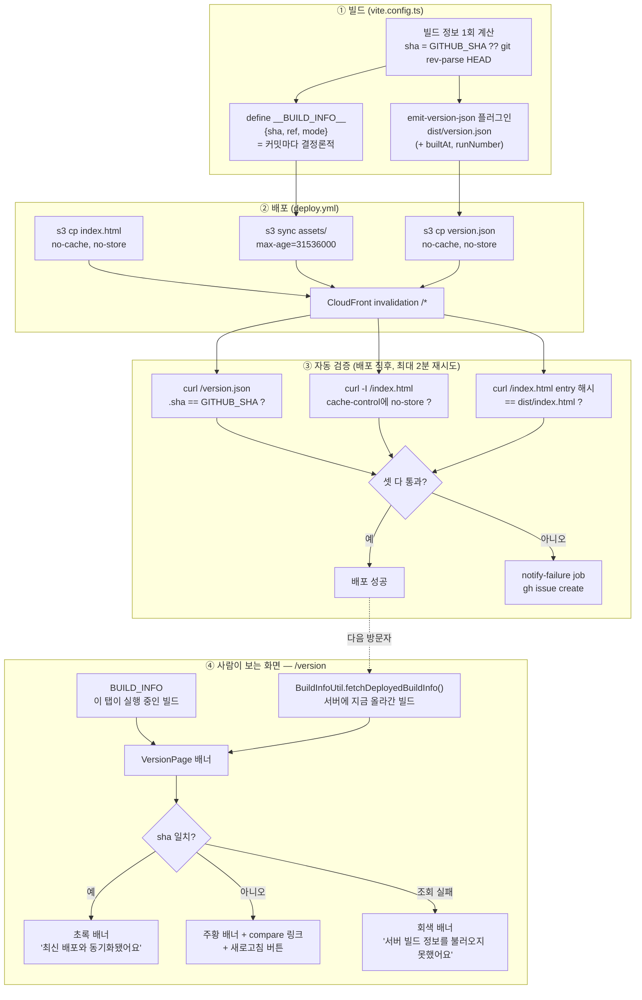

# 배포 반영 확인 (Build Version)

> **문서 성격**: 독립 기능 문서(서사형)
>
> **대상 독자**: 이 레포 FE를 처음 보거나 오랜만에 돌아온 개발자.
>
> **읽고 나면**: `/version` 화면과 배포 파이프라인의 자동 검증이 "지금 이 탭이 보는
> 코드"와 "서버에 실제로 올라간 코드"를 어떻게 비교하는지, 배지 색이 왜 그 색인지,
> 검증이 실패하면 어떻게 알림이 오는지 알고 판정 조건을 바꿀 수 있다.
>
> **마지막 검토**: 2026-09-20

배포 워크플로우가 success로 끝났다는 것과, 실제로 그 코드가 사용자 화면에 반영된
것은 다른 사건이다. 이 기능은 그 둘 사이를 사람이 눈으로(`/version` 화면), 그리고
파이프라인이 스스로(배포 직후 자동 검증) 확인하게 한다.

## 1. 쉬운 설명

가게에 비유하면 이렇다 — "새 상품이 입고됐다"는 알림(배포 워크플로우 success)을
받았다고 해서, 그 상품이 실제로 진열대(사용자 브라우저)에 올라와 있다는 보장은
없다. 알림과 진열대 사이에 트럭이 늦거나(전파 지연), 엉뚱한 상자가 실렸거나(부분
배포), 애초에 하역이 빠졌을(캐시 헤더 회귀) 가능성이 늘 있다.

이 기능은 그 간극을 두 가지 방식으로 메운다.

- **사람이 직접 진열대를 보는 법(`/version` 화면)**: "지금 내가 보는 진열대"(이
  탭이 실행 중인 빌드)와 "지금 창고 장부"(서버에 배포된 빌드)를 나란히 대조해
  보여준다. 둘의 운송장 번호(커밋 sha)가 같으면 초록, 다르면 주황, 아예 장부를
  못 읽으면 회색 — 스크롤 없이 페이지 맨 위에서 바로 판정된다.
- **매장이 스스로 확인하는 법(배포 파이프라인 검증)**: 트럭이 도착한 직후(S3
  업로드·CloudFront 무효화 직후) 매장 스스로 진열대를 다시 확인해서, 상품이 안
  올라와 있으면 그 자리에서 담당자에게 알린다(GitHub 이슈 자동 생성).



## 2. 전제 지식

이 기능은 [NEW-VERSION-RELOAD.md](./NEW-VERSION-RELOAD.md)의 `VersionUtil`(entry
script 해시 비교)을 그대로 재사용한다 — 그 문서를 먼저 읽으면 `VersionPage`가
`readEntryScriptSrc`를 직접, `fetchDeployedEntryScriptSrc`를 `useDeployedBuildInfo`
안에서 왜 수정 없이 그대로 호출하는지 바로 이해된다. 다만 목적은 다르다:
NEW-VERSION-RELOAD는 **자동으로** 리로드시키는 기능이고, 이 문서는 **사람이 수동으로
확인**하는 화면 + **CI가 스스로 검증**하는 파이프라인을 다룬다.

가정하지 않는 것: Vite `define`의 문자열 치환 메커니즘 자체 — §5에서 "빌드마다
같은 값이어야 한다"는 결론만 이용하고 내부 구현은 다루지 않는다.

## 3. 사용한 도구·기술

**기능 자체를 이루는 것**

- **Vite `define` + 커스텀 플러그인(`generateBundle`)** — 커밋 sha를 번들 상수와
  `dist/version.json` 두 곳에 동시에 심는다(§5)
- **`fetch(..., { cache: 'no-store' })`** — `BuildInfoUtil`이 서버의 최신
  `version.json`을 강제로 재요청한다(§5). `VersionUtil.fetchDeployedEntryScriptSrc`와
  같은 패턴
- **GitHub Actions `concurrency`** — 연속 배포가 검증 스텝을 서로 밟지 않게 한다(§5)
- **`aws s3 cp --cache-control`** — `index.html`과 같은 이유로 `version.json`도
  무캐시로 올린다(§5)
- **GitHub `compare`/`commit`/`blob` URL** — "이 빌드에 뭐가 들어있나"를 앱이 직접
  구현하지 않고 GitHub에 위임한다(§5)

**구현·검증 과정에서 쓴 도구**

- **MSW(`src/mocks/server.ts`)** — `GET /version.json` 응답을 픽스처로 가로채
  세 가지 배너 상태(일치·불일치·조회 실패)를 테스트
- **Playwright MCP(`browser-verification` skill)** — 실제 브라우저에서 세 배너
  상태를 녹화해 사용자 승인을 받음(§9)
- **`actionlint`, `shellcheck`(actionlint 내장)** — `deploy.yml`의 새 검증
  스텝·`notify-failure` job 문법을 정적 검증
- **`curl`(운영 CloudFront 직접 호출)** — 캐시 정책 실측(§9)

## 4. 왜 만들었나

배포가 실제로 반영됐는지 확인할 방법이 파이프라인 success 여부밖에 없었다.
"워크플로우는 success인데 화면은 옛날 것"인 상황에서 원인이 **배포 자체가 안 된
것**인지 **탭이 캐시를 잡은 것**인지 구분할 수단이 앱에도 CI에도 없었다. 판정
재료(entry script 해시 비교)는 [NEW-VERSION-RELOAD.md](./NEW-VERSION-RELOAD.md)에
이미 있었지만, `useAppVersionCheck.ts`가 명시하듯 **"화면에는 아무것도 띄우지
않는다"** — 사람이 눈으로 볼 방법이 없었다.

## 5. 구조

### 왜 두 값(번들 상수 + `version.json`)이 모두 필요한가

`define`으로 번들에 박히는 값은 "지금 이 탭이 실행 중인 코드"를 답하고,
`dist/version.json`으로 서버에 올라가는 값은 "지금 S3/CloudFront에 있는 코드"를
답한다. 이 둘을 나란히 놓아야만 "배포는 됐는데 내 탭이 캐시를 잡은 상태"와 "애초에
배포가 안 된 상태"가 구분된다 — 값 하나만으로는 이 둘을 가를 수 없다.

### ⚠️ builtAt·runNumber를 번들 상수에 넣지 않는 이유

지금은 같은 커밋을 다시 빌드해도 entry 청크 해시가 동일하다 — 그래서
`workflow_dispatch`로 무변경 재배포를 해도 열린 탭이 리로드되지 않는다. 빌드마다
달라지는 값(`builtAt`, `runNumber`)을 번들에 박으면 그 문자열이 청크 내용의 일부가
되어 해시가 매번 바뀌고, `useAppVersionCheck`가 이를 새 배포로 오판해 **무변경
재배포에도 열려 있던 모든 탭이 강제 새로고침**된다. 그래서 `define`은 `{sha, ref,
mode}`(커밋 단위로 결정론적인 값)만 담고, `builtAt`·`runNumber`는
`dist/version.json`에만 싣는다
([vite.config.ts:33-46](../vite.config.ts#L33-L46)).

### dev 모드에서 entry script가 `/@vite/client`로 잘못 읽히는 문제

`VersionUtil.readEntryScriptSrc`는 `document`의 첫 `script[type="module"][src]`를
읽는데, dev 서버에서는 그게 실제 엔트리(`/src/main.tsx`)가 아니라 Vite HMR
클라이언트(`/@vite/client`)다. `useAppVersionCheck`는 애초에 DEV 모드에서 이 함수
자체를 호출하지 않아(`useAppVersionCheck.ts:26-28`) 이 문제가 드러난 적이 없었다.
`VersionPage`는 이 함수를 새로 노출하는 자리라 이 문제가 처음 드러났고, `VersionUtil`
쪽을 고치는 대신 `VersionPage`가 DEV 모드에서 그 줄 자체를 숨긴다
([VersionPage.tsx:105-111](../src/pages/version/VersionPage.tsx#L105-L111)) —
`VersionUtil`의 계약은 그대로 유지된다.

### 배너 색과 세 가지 상태

| 상태          | 배경 색      | 의미                                | 근거                                                                                                      |
| ------------- | ------------ | ----------------------------------- | --------------------------------------------------------------------------------------------------------- |
| `match`       | `bg-success` | 로드된 sha == 배포된 sha            | Vercel의 초록=성공 배포 규칙                                                                              |
| `mismatch`    | `bg-warning` | 두 sha가 다름 — 새로고침하면 해소됨 | 배포 문제가 아니라 "내 탭이 오래됨"이라 destructive(빨강)가 아니라 경고색                                 |
| `checkFailed` | `bg-muted`   | `/version.json` 조회 자체가 실패    | mismatch와 다른 muted 색 — 배포 실패가 아니라 내 네트워크 문제일 수도 있어 경고색을 쓰면 오인 소지가 있음 |

배너는 **카드보다 먼저, 페이지 최상단**에 둔다 — 이 화면의 존재 이유가 바로 그
판정이라 스크롤 없이 가장 먼저 보여야 한다. 최초 구현은 배지를 제목 옆(Vercel
대시보드의 점+라벨 패턴)에 작게 뒀지만, "이 페이지의 주 컨텐츠가 동기화 확인
자체인데 배지가 부수적으로 보인다"는 피드백(2026-09-20)을 받아 지금 형태로
바꿨다. 두 형태 모두 Artifact 미리보기로 나란히 비교한 뒤 결정했다
([`docs/plans/2026-09-20-build-version.md`](./plans/2026-09-20-build-version.md) 참고).

### "이 빌드에 뭐가 들어있나"는 GitHub에 위임한다

불일치 시 `compare/<로드된sha>...<배포된sha>` 링크를 보여준다 — 커밋 목록을 앱
안에 직접 구현하지 않는다. `git log`를 빌드타임에 뽑아 번들에 넣는 방식도
검토했지만, `actions/checkout@v4`의 기본 얕은 클론(depth 1)에선 로그 자체가 없고
번들 크기만 늘어 기각했다. GitHub compare 페이지가 이미 "N commits ahead/behind"를
정확히 렌더해준다.

**검토했으나 하지 않은 것**: GitHub API(`compare` 엔드포인트)로 "몇 커밋
뒤처졌는지" 숫자를 앱 화면에 직접 표시하는 안. 비인증 요청 시간당 60회 rate
limit(GitHub 공식 문서 기준)이 걸려 있어 이 레포에 없던 "서드파티 API 직접 호출"
패턴을 새로 들이는 것 대비 이득이 적어 보류했다(2026-09-20 사용자 논의).

### 접근 범위 — 공개+비연결

`/version`은 403/404/500과 같은 성격의 **비연결(unlinked) 공개 라우트**다 —
`NAV_ITEMS`에 링크가 없어 URL을 직접 입력해야만 접근된다. 로그인이나 ADMIN 권한으로
막지 않는다 — 이유는 두 가지다. ① 이 레포(`BAECHAN/link-sphere_FE_NEW`)는 이미
Public 레포라(`gh repo view` 확인, 2026-09-20) `/version`이 링크하는 커밋·CHANGELOG는
어차피 GitHub에서 누구나 볼 수 있는 정보다. ② 이 화면은 "배포 자체가 고장났을 때"
진단하는 용도인데, 로그인에 묶으면 정작 인증 흐름이 깨진 순간 못 쓰게 될 수 있다
— 403/500 에러 페이지가 인증 게이트 밖에 있는 것과 같은 이유다.

## 6. 상태 모델

### `SyncStatus`(`src/pages/version/VersionPage.tsx`)

컴포넌트 로컬 타입이라 별도 스토어·스키마는 없다.

| 값              | 계산 조건                                            |
| --------------- | ---------------------------------------------------- |
| `null`          | `useDeployedBuildInfo`의 `isLoading`이 `true`인 동안 |
| `'match'`       | `deployedBuildInfo.sha === BUILD_INFO.sha`           |
| `'mismatch'`    | `deployedBuildInfo`는 있지만 sha가 다름              |
| `'checkFailed'` | `deployedBuildInfo`가 `null`(조회 실패)              |

### `DeployedBuildInfo`(`src/shared/utils/build-info.util.ts`)

`dist/version.json`의 런타임 형태를 그대로 반영한 인터페이스.

| 필드        | 타입             | 비고                                        |
| ----------- | ---------------- | ------------------------------------------- |
| `sha`       | `string`         | 커밋 전체 해시                              |
| `ref`       | `string`         | 브랜치명, 로컬 빌드는 `'local'`             |
| `mode`      | `string`         | Vite 빌드 모드                              |
| `runNumber` | `string \| null` | GitHub Actions run 번호, 로컬 빌드는 `null` |
| `runId`     | `string \| null` | GitHub Actions run ID                       |
| `builtAt`   | `string`         | ISO 8601, dayjs로 포맷해 표시               |

## 7. 운영 파라미터

| 값                                        | 위치                                                            | 의미                                                      |
| ----------------------------------------- | --------------------------------------------------------------- | --------------------------------------------------------- |
| 검증 재시도 횟수·간격(12회·10초=최대 2분) | [deploy.yml:124-131](../.github/workflows/deploy.yml#L124-L131) | `version.json` 전파 지연을 감안한 재시도 한도             |
| `SITE_URL` 폴백                           | [deploy.yml:115](../.github/workflows/deploy.yml#L115)          | 레포 Variable 미설정 시 하드코딩된 CloudFront 도메인 사용 |
| `concurrency.group`(`deploy-main`)        | [deploy.yml:25-27](../.github/workflows/deploy.yml#L25-L27)     | 연속 push 시 배포가 대기열로 처리(취소 아님)              |

## 8. 코드 지도와 자주 하는 수정

```
src/
├── shared/
│   ├── config/
│   │   └── build-info.ts              # §5 — __BUILD_INFO__ define을 읽는 진입점(typeof 가드)
│   ├── utils/
│   │   └── build-info.util.ts         # §6 — /version.json fetch + 런타임 형태 검증
│   └── hooks/
│       └── useDeployedBuildInfo.ts    # version.json + entry script 병렬 조회, DEV 모드 스킵
├── pages/version/
│   ├── VersionPage.tsx                # §5 — 배너 3상태 + 두 빌드 카드
│   └── VersionPage.test.tsx
└── main.tsx                           # 콘솔 배너([BUILD] <sha7> (<ref>) — /version)

vite.config.ts                          # §5 — bundledBuildInfo/deployedBuildInfo 계산 + emit-version-json 플러그인
src/vite-env.d.ts                       # __BUILD_INFO__ global declare
.github/workflows/deploy.yml            # §5 — version.json 업로드 + 배포 반영 검증 + notify-failure job
```

### 자주 하는 수정

| 하고 싶은 것               | 방법                                                                                                               |
| -------------------------- | ------------------------------------------------------------------------------------------------------------------ |
| 배너 문구·색 변경          | `VersionPage.tsx`의 `STATUS_BANNER_CLASSNAME`/`STATUS_BANNER_TEXT`, 문구는 `texts.ts`의 `TEXTS.version.*`          |
| 검증 재시도 횟수·간격 변경 | `deploy.yml`의 "배포 반영 검증" 스텝, `seq 1 12`·`sleep 10`                                                        |
| 검증 대상 URL 변경         | GitHub 레포 Settings → Variables에 `SITE_URL` 추가(Secret 아님 — 이미 `README.md`에 공개된 값)                     |
| 실패 알림 문구·수신처 변경 | `deploy.yml`의 `notify-failure` job                                                                                |
| 서버 빌드 정보에 필드 추가 | `vite.config.ts`의 `deployedBuildInfo` 객체 + `build-info.util.ts`의 `DeployedBuildInfo` 인터페이스 양쪽 동시 수정 |

## 9. 검증 결과

`build-info.util.test.ts`(6개)·`useDeployedBuildInfo.test.ts`(4개)·
`VersionPage.test.tsx`(4개) 전체 통과. 저장소 전체 테스트(`pnpm test`, 69개 파일·
425개 테스트)·`pnpm type-check`·`pnpm lint`·`pnpm format:check` 모두 통과.
`deploy.yml` 변경분은 `actionlint`(내장 shellcheck 포함)로 정적 검증 — 에러 0건.

**빌드 재현성 실측**: 같은 소스를 두 번 연속 빌드해 entry 청크 파일명이 동일함을
직접 확인했다(`index-DddFKL5A.js` == `index-DddFKL5A.js`) — §5의 "builtAt·runNumber를
번들에 넣지 않는다"는 설계가 실제로 지켜지는지에 대한 회귀 게이트.

**운영 CloudFront 캐시 정책 실측**(2026-09-20, 사용자 질문에 답하며 직접 확인):

```
$ curl -sI https://dbw3brui6htwk.cloudfront.net/index.html
cache-control: no-cache, no-store, must-revalidate
x-cache: RefreshHit from cloudfront   # 3회 연속 요청 모두 동일
```

`RefreshHit`는 CloudFront가 매 요청마다 오리진에 재검증하러 간다는 뜻이다(`Hit`처럼
순수 캐시 응답이 아니다) — 배포 직후 오리진이 바뀌면 다음 요청부터 바로 반영된다.
이 실측 덕에 "새로고침" 버튼(평범한 `window.location.reload()`)이 강력 새로고침과
실질적으로 동일하게 동작한다는 것도 함께 확인됐다 — 로컬 브라우저 캐시는
`no-store`라 애초에 저장되지 않고, CDN 엣지도 캐시 없이 매번 재검증하므로 "소프트
새로고침으로는 CDN 캐시를 못 뚫는다"는 우려가 이 파이프라인에는 해당하지 않는다.

로컬 `vite preview`로 배포 반영 검증 스크립트를 드라이런한 결과, ①sha 일치·③entry
해시 일치는 통과했고 ②cache-control 체크는 "실패"로 나왔다 — 이건 스크립트 버그가
아니라 `vite preview`가 S3와 다른 기본 헤더(`no-store` 없음)를 내려주는 로컬 환경
차이였다. 오히려 이 체크가 실제로 차이를 잡아낸다는 것을 증명했다.

**미실측**: 실제 GitHub Actions 러너에서 검증 스텝·`notify-failure` job이 도는
것은 머지 후 실제 배포에서 확인해야 한다(로컬에서 완전 재현 불가 — §11).

## 10. 시행착오

- **dev 모드 entry script 오탐**: §5에 기록. `VersionPage`가 `VersionUtil`을
  DEV 가드 없이 호출하려다 브라우저 검증(Playwright) 중 `/@vite/client`가 그대로
  노출되는 걸 발견해 그 자리에서 고쳤다.
- **배너 위치 재설계**: 처음엔 제목 옆 작은 배지(Vercel 대시보드 패턴)로
  구현·브라우저 검증까지 마쳤으나, "이 페이지의 주 컨텐츠는 동기화 확인 자체"라는
  피드백을 받아 페이지 최상단 배너로 재구성했다. 두 안 모두 Artifact로 나란히
  미리보기를 만들어 비교한 뒤 결정했다(CLAUDE.md §9 절차).
- **CDN 캐시 우회 우려에 대한 실측 검증**: "소프트 새로고침이 강력 새로고침과
  다르지 않냐"는 질문에 추측으로 답하지 않고 운영 CloudFront에 직접 curl을 쏴서
  확인했다(§9). 결과가 예상과 달랐다면(예: `Hit from cloudfront`가 나왔다면)
  `notify-failure`의 알림 신뢰도 자체를 재검토해야 했을 것이다.

## 11. 남은 것

- 실제 GitHub Actions 환경에서 배포 반영 검증 스텝·`notify-failure` job이 의도대로
  동작하는지는 머지 후 확인이 필요하다. 특히 알림 경로는 한 번쯤 의도적으로
  실패시켜(잘못된 기대값으로 `workflow_dispatch`) 이슈가 실제로 생성되는지
  실측해야 한다 — 안 하면 "알림이 있다고 믿는데 실은 안 온다" 상태가 될 수 있다.
- `docs/DEPLOY.md`·`docs/CI-CHECK-GATE.md`·`docs/SYSTEM-ARCHITECTURE.md`의 배포
  파이프라인 서술을 이번 변경(version.json 업로드, 검증 스텝, notify-failure)에
  맞춰 갱신하는 작업이 이 문서와 별도 커밋으로 남아 있다.
- 마이페이지 모달에 발견성을 높이는 링크를 추가할지는 보류됐다 — 사용자가
  `/version` + 콘솔 배너만으로 충분하다고 판단(2026-09-20).

## 12. 용어 사전

- **빌드 식별자(build info)** — 이 문서에서 "번들에 박히는 값"(`BUILD_INFO`, §5)과
  "서버에 올라가는 값"(`DeployedBuildInfo`, §6)을 함께 가리키는 말. 둘은 값이
  겹치지만(§5의 `bundledBuildInfo`가 `deployedBuildInfo`의 부분집합) 저장 위치와
  갱신 시점이 다르다
- **entry script** — [NEW-VERSION-RELOAD.md](./NEW-VERSION-RELOAD.md#12-용어-사전)
  참고. 이 문서에서도 §5의 dev 모드 오탐 논의에 그대로 쓰인다
- **동기화(sync) 상태** — 이 문서에서 "로드된 빌드 sha == 배포된 빌드 sha" 여부를
  가리키는 말(§6의 `SyncStatus`). NEW-VERSION-RELOAD의 "감지/적용"과는 다른
  개념이다 — 그쪽은 자동 리로드 판정, 이쪽은 화면 표시용 판정이다

## 13. 관련 문서

- [NEW-VERSION-RELOAD.md](./NEW-VERSION-RELOAD.md) — 이 기능이 재사용하는
  `VersionUtil`의 원출처, entry script 판정 로직
- [DEPLOY.md](./DEPLOY.md) — 이 기능이 검증하는 S3+CloudFront 배포 파이프라인 자체
- [CI-CHECK-GATE.md](./CI-CHECK-GATE.md) — 배포 실패 알림 부재를 "남은 것"으로
  남겼던 지점을 이 기능이 채운다
