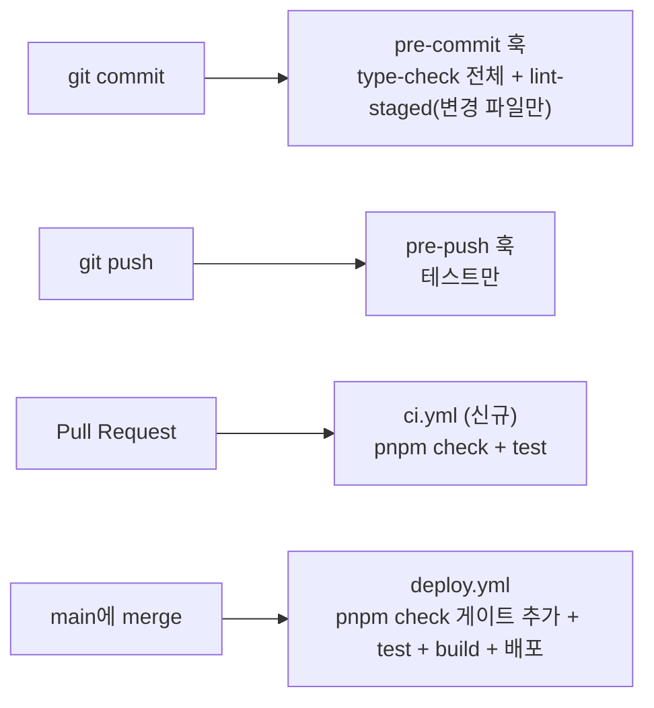

# Link-Sphere FE — CI 검사 게이트 정비 (2026-09-03)

> **문서 성격**: 독립 기능 문서(서사형)
>
> **대상 독자**: 이 레포 FE를 처음 보거나 오랜만에 돌아온 개발자.
>
> **읽고 나면**: `pnpm check`가 실제로 어느 시점에 도는지, ignore 패턴을 추가하거나
> PR 게이트에 스텝을 더할 때 어디를 고치면 되는지 안다.
>
> **마지막 검토**: 2026-09-06

## 1. 쉬운 설명

맞춤법 검사기를 생각해보자. 폴더 전체를 검사하는 "전체 검사" 버튼이 있는데,
그 버튼을 **사람이 생각날 때 수동으로 눌러야만** 동작하고, 저장할 때 자동으로
도는 검사는 "지금 편집 중인 문서 한 장"만 본다. 그런데 그 폴더 안에 몇 달 전
치워야 했는데 안 치운 "임시 초안 백업" 하위 폴더가 통째로 남아 있었다면?
누군가 오랜만에 "전체 검사" 버튼을 눌렀을 때, 진짜 문서의 오타 몇 개가 아니라
그 임시 폴더 안 낙서까지 전부 오타로 잡혀서 결과가 수천 건으로 뻥튀기된다.

이번에 정확히 그 상황이었다. `pnpm check`(타입 체크+lint+포맷 검사)를 돌렸더니
**2,370건**이 나왔는데, 실제 소스 코드 문제는 **4건**뿐이었고 나머지 2,366건은
전부 `.claude/worktrees/`(Claude Code가 동시 세션 격리를 위해 만들었다가
방치된 작업 폴더) 안에 남아 있던 빌드 산출물(번들된 JS 파일) 하나에서 나온
가짜 오류였다.

검사가 실제로 도는 지점은 4곳이다 — 이번에 고친 건 뒤 두 곳이다.



`pre-commit`·`pre-push`는 이미 있었지만 각각 "변경 파일만" 또는 "테스트만" 봐서
`pnpm check` 전체를 훑는 지점이 아니었다. PR과 배포 단계에도 `pnpm check`가 걸려
있지 않아서, `.claude/worktrees/` 안에 방치된 빌드 산출물이 몇 달째 아무 검사에도
안 걸리고 쌓여 있었다.

## 2. 전제 지식

ESLint·Prettier·pre-commit 훅(`lint-staged`)의 기본 동작(무엇을 검사하고 무엇을
자동 수정하는지)은 안다고 가정한다.

가정하지 않는 것:

- ESLint 9의 flat config(`eslint.config.js`)가 legacy `.eslintrc`와 ignore 패턴을
  다루는 방식이 다르다는 점 → §12 용어 사전
- `EnterWorktree`(Claude Code 워크트리 도구) 자체 → §12 용어 사전
- 배포 파이프라인 전체 구조 → [`DEPLOY.md`](./DEPLOY.md), [`SYSTEM-ARCHITECTURE.md`](./SYSTEM-ARCHITECTURE.md)

## 3. 사용한 도구·기술

**기능 자체를 이루는 것**

- **ESLint**(flat config) + **typescript-eslint** — 기존에 이미 쓰던 검사기,
  새 규칙 추가는 없고 ignore 패턴만 수정
- **Prettier** — 포맷 검사, 기존 그대로
- **Vitest** — 기존 테스트 201개, 새로 작성한 테스트 없음
- **GitHub Actions** — PR 시점 검사(`ci.yml`, 신규)와 배포 시점 검사
  (`deploy.yml` 수정)
- **husky + lint-staged** — 기존 pre-commit/pre-push 훅, `--max-warnings 0`만
  추가

**만들고 검증하는 과정에서 쓴 도구**

- **Node 일회성 스크립트** — `eslint . -f json`으로 뽑은 결과를 파일 경로별·
  규칙별로 집계해, 2,370건 중 몇 건이 워크트리 안 파일이고 몇 건이 진짜
  소스인지 정량적으로 분리(§8)
- **`gh` CLI**(`gh run list`, `gh run watch`) — 새 워크플로우가 실제 배포에서
  게이트로 작동하는지 확인
- **웹 검색** — ESLint flat config의 ignore 패턴 동작 방식, 업계의 pre-commit
  vs CI 게이트 관행을 사전 확인 후 설계에 반영(결론만 이 문서에 남기고, 상세
  근거는 작업 당시 대화에만 남음)

## 4. 왜 만들었나

사용자가 `pnpm check`를 실행했다가 "문제가 엄청 많은데 왜 지금까지 체크 못했는지
확인하고 이런 일 없도록 하라"고 요청한 게 시작이었다. 조사해보니 `pnpm check`가
**사람이 수동으로 칠 때만** 도는 상태였다:

| 검사 지점                    | 실행 대상                                        | `dist/` 산출물이 걸리나?             |
| ---------------------------- | ------------------------------------------------ | ------------------------------------ |
| `.husky/pre-commit`          | type-check 전체 + lint-staged(**staged 파일만**) | ❌ gitignore돼서 영원히 staged 안 됨 |
| `.husky/pre-push`            | 테스트만                                         | ❌                                   |
| 기존 `deploy.yml`(push:main) | 테스트 + 빌드만                                  | ❌ lint/format 미실행                |
| PR                           | **워크플로우 없음**                              | ❌                                   |

`.claude/worktrees/`는 `.gitignore`에 있지만, **ESLint/Prettier는 `.gitignore`를
자동으로 읽지 않는다**(flat config 기준 — ESLint 공식 문서로 확인). 그 안의
워크트리(`node-lts-update`, 8월 31일 마지막 커밋 이후 방치)에 남아있던
`dist/assets/js/vendor-*.js`(react-vendor 등 minified 번들)가 `eslint.config.js`의
ignore 패턴(`'dist/**/*'`, 루트 상대 경로)에 안 걸려서 그대로 린트 대상이
됐다.

## 5. 구조 — 두 가지 원인, 두 가지 수정

```
[원인 1] ignore 패턴이 중첩 경로를 못 잡음
  eslint.config.js: ignores: ['dist/**/*', ...]
    → 'dist/**/*'는 루트의 dist/만 매칭, .claude/worktrees/*/dist/는 그대로 노출
  수정: '**/dist/**' 형태로 전부 '**/' prefix 사용 + '.claude/worktrees/**' 명시 추가

[원인 2] pnpm check를 자동으로 도는 곳이 없음
  PR              →  (검사 없음)                     →  ci.yml 신설(pnpm check + test)
  push to main     →  test → build (lint/format 없음)  →  pnpm check 게이트 추가
```

두 수정은 독립적이지만 순서가 있다 — 원인 2(CI 게이트)를 원인 1(ignore 버그)
없이 먼저 걸면, 새 PR CI가 걸릴 때마다 워크트리 유령 오류로 즉시 빨간불이 나서
게이트 자체가 무의미해진다. 그래서 ignore 패턴을 먼저 고치고 나서 게이트를
얹었다.

새 `ci.yml`은 기존 `deploy.yml`의 pnpm/Node 셋업 스텝을 그대로 재사용했다
(Node 20 — 이후 Node 24 업그레이드 병합 시 `.nvmrc` 기준(`node-version-file`)으로
함께 맞춰졌다, §10).

## 6. 운영 파라미터

| 파라미터                | 값                                                                                              | 실제 위치                                                                  |
| ----------------------- | ----------------------------------------------------------------------------------------------- | -------------------------------------------------------------------------- |
| `--max-warnings` 임계값 | 0                                                                                               | `package.json:18-19`(`lint`/`lint:fix`), `package.json:123`(`lint-staged`) |
| ESLint 글로벌 ignore    | `**/dist/**`, `**/node_modules/**`, `.claude/worktrees/**`, `**/*.md`, `**/*.svg`, `infra/**/*` | `eslint.config.js:19-24`                                                   |
| Prettier ignore 추가분  | `.claude/worktrees`, `docs/HISTORY.md`(봇 생성 파일)                                            | `.prettierignore:6-7`                                                      |
| PR CI 트리거            | `pull_request` → `main`                                                                         | `.github/workflows/ci.yml:7`                                               |
| 동시 실행 제어          | 같은 브랜치 새 커밋 push 시 이전 실행 자동 취소                                                 | `.github/workflows/ci.yml:11` `concurrency` 블록                           |
| Node 버전               | 24(`.nvmrc` 기준, `node-version-file`로 참조)                                                   | `.nvmrc`, `ci.yml:28`·`deploy.yml` 공통                                    |
| 배포 게이트 위치        | `pnpm install` 직후, `pnpm test` 이전                                                           | `deploy.yml` "Type check, lint & format check" 스텝                        |

## 7. 코드 지도와 자주 하는 수정

| 무엇을 바꾸려면              | 파일                                                                                                |
| ---------------------------- | --------------------------------------------------------------------------------------------------- |
| ignore 패턴 추가·수정        | `eslint.config.js:19-24`(ESLint), `.prettierignore`(Prettier — 별도 파일, ESLint와 문법 공유 안 함) |
| PR 게이트에 검사 스텝 추가   | `.github/workflows/ci.yml`                                                                          |
| 배포 게이트에 검사 스텝 추가 | `.github/workflows/deploy.yml`의 "Type check, lint & format check" 스텝                             |
| Node 버전 변경               | `.nvmrc` 한 곳만 — `ci.yml`·`deploy.yml` 둘 다 `node-version-file`로 그 값을 읽는다                 |
| `--max-warnings` 임계값 변경 | `package.json:18-19,123`                                                                            |

### 자주 하는 수정

| 하고 싶은 것                              | 방법                                                                                                      |
| ----------------------------------------- | --------------------------------------------------------------------------------------------------------- |
| 새 중첩 경로가 또 lint에 걸린다           | `eslint.config.js`의 ignore 패턴에 `**/` prefix가 빠졌는지 먼저 의심(§4의 원인 1과 같은 패턴)             |
| PR 게이트를 일시적으로 우회해야 한다      | 게이트 자체를 끄지 말고, 무엇이 실패했는지 원인을 먼저 본다 — 우회가 필요한 상황이면 사용자에게 먼저 확인 |
| 로컬에서 전체 검사를 미리 돌려보고 싶다   | `pnpm check`                                                                                              |
| 검사 스크립트가 정확히 뭘 실행하는지 확인 | `package.json`의 `check` 스크립트 조합을 직접 확인(이 문서는 "타입체크+lint+포맷"이라고만 요약함)         |

## 8. 검증 결과

`eslint . -f json` 결과를 노드 스크립트로 집계한 최초 breakdown:

| 구분                           | 건수                           |
| ------------------------------ | ------------------------------ |
| 전체 문제                      | 2,370(2,366 error + 4 warning) |
| `.claude/worktrees/**` 안 문제 | 2,366(전체의 99.8%)            |
| 실제 `src/` 소스 문제          | 0 error, **4 warning**         |

워크트리 안 상위 규칙(`no-unused-expressions` 2,106건이 minified 번들 파일
하나에서 나옴):

```
no-unused-expressions   2106
no-unused-vars           126
import/no-default-export 93
no-explicit-any           30
exhaustive-deps            6
no-this-alias              4
no-require-imports         1
```

실제 소스 warning 4건(모두 수정 완료):

```
src/shared/config/api.ts:4            no-unsafe-assignment
src/entities/user/api/AuthQueries.test.tsx:28,37   no-unsafe-return ×2
src/features/post/bookmark/ui/FolderSelector.tsx:47  exhaustive-deps
```

ignore 패턴만 고친 시점의 중간 검증: `pnpm exec eslint .` → **0 problems**
(2,370 → 0, 워크트리 배제 확인). 이어서 `package.json`에 `--max-warnings 0`을
걸어도 그대로 0 problems 유지되는 것까지 확인 후 커밋했다.

`pnpm test` — 29개 파일, **201개 테스트 전부 통과**.

실제 `main` push 후 `deploy.yml`이 새 "Type check, lint & format check"
스텝을 포함해 끝까지 성공하는 것도 확인(`gh run watch 33766503151`):

```
✓ deploy in 1m48s
  ✓ Install dependencies
  ✓ Type check, lint & format check   ← 신규
  ✓ Run tests
  ✓ Build
  ✓ Upload to S3
  ✓ CloudFront Invalidation
```

## 9. 시행착오

### 9.1 `react-hooks/exhaustive-deps` disable 주석 위치 실수

`FolderSelector.tsx`의 의도적 dep 누락에 `eslint-disable-next-line` 주석을
처음에는 `useEffect` 콜백 **본문 안쪽**(닫는 `}` 바로 위)에 넣었다가 lint가
그대로 잡아냈다. 이 규칙은 콜백 본문이 아니라 **의존성 배열 줄**(`[open]`)에
경고를 앵커링하기 때문에, `eslint-disable-next-line`도 그 배열 줄 바로 위로
옮겨야 했다.

### 9.2 문서를 고치다가 그 문서가 검사에 걸림

`docs/SYSTEM-ARCHITECTURE.md`의 배포 단계 표를 수정한 뒤 `pnpm check`를
돌렸더니 그 파일 자체가 `format:check`(Prettier)에 걸렸다 — 표 안 셀 너비가
안 맞아 재정렬이 필요했다. `prettier --write`로 한 번에 해결됐지만, 지금 막
만들고 있는 바로 그 검사 게이트가 작업 중 실수를 그 자리에서 잡아낸
사례라 기록해둔다.

### 9.3 문단 줄바꿈 들여쓰기 누락 + 경로 필터로 인해 조용히 미배포된 사고 (2026-09-06)

`CHANGELOG.md`에 긴 문단을 추가하면서 한 줄을 수동으로 줄바꿈했는데, 계속줄에
마크다운 리스트 항목이 요구하는 2칸 들여쓰기(이 항목의 `<details>` 블록 전체가
`- ` 리스트 안에 있어, 계속되는 모든 줄이 그 리스트 항목의 들여쓰기를 따라야
한다)를 빠뜨렸다. `git commit` 시 `lint-staged`의 `prettier --write`가 이걸
잡아 고쳐줄 거라 가정했는데(9.2와 같은 기대), 실제로는 그대로 커밋됐다 —
`deploy.yml`의 `pnpm check`(`format:check`)에서야 처음 걸렸다.

여기서 그치지 않고 두 번째 문제가 이어졌다. 수정 커밋(`CHANGELOG.md`만 변경)을
다시 push했는데 **`Frontend Deploy` 워크플로우 자체가 실행되지 않았다.**
`deploy.yml`의 트리거가

```yaml
on:
  push:
    branches: ['main']
    paths:
      - 'src/**'
      - 'public/**'
      - 'package.json'
      - 'pnpm-lock.yaml'
      - 'vite.config.ts'
      - 'tailwind.config.ts'
      - 'postcss.config.js'
      - 'index.html'
      - 'tsconfig*.json'
```

로 경로 제한이 걸려 있어서다(`docs/**`·`CHANGELOG.md`는 이 목록에 없음). 즉
**직전 push(`src/` 변경 포함)의 배포가 이미 실패한 채로 남아있는데, 그걸 고친
커밋이 docs만 건드리면 재배포가 조용히 안 걸린다** — 실패 알림도 없고 성공
알림도 없으니, `gh run list`로 직접 들여다보지 않으면 "고쳤으니 배포됐겠지"라고
착각하기 쉽다. `workflow_dispatch`로 수동 트리거해서 해결했다(§7의 "GitHub
Actions 수동 재실행"과 같은 도구, 다른 상황).

**교훈**: `main`에 push한 뒤에는 `gh run list --branch main --workflow
"Frontend Deploy (S3 + CloudFront)"`로 **그 커밋의 SHA가 실제로 성공했는지**
직접 확인하기 전까지 배포됐다고 보고하지 않는다 — push 명령이 성공한 것과
그 push가 실제로 배포를 완료한 것은 다른 사건이다(`.claude/CLAUDE.md` Critical
Rules에 규칙으로 명문화).

### 9.4 (참고) 같은 세션에서 BE 쪽에 있었던 실수

같은 작업 세션에서 BE 레포 작업 중 (1) `git commit` 인자 순서 실수, (2)
`EnterWorktree`가 셸의 잔여 `cd` 상태 때문에 의도한 레포가 아닌 곳에
워크트리를 만든 사례, (3) 확인 없이 `main`에 직접 push한 프로세스 위반이
있었다. FE 작업에서는 이 경험을 반영해 (3)은 매번 push 전 사용자 확인을
거쳤다. 상세는 BE 레포(`link-sphere_BE_NEW`) `docs/CI-CHECK-GATE.md` 참고.

## 10. 남은 것

- Node 20→24 업그레이드가 병합됐다. `ci.yml`·`deploy.yml` 모두
  `node-version-file: '.nvmrc'`로 바뀌어 이번처럼 한쪽만 버전이 뒤처지는
  드리프트가 재발하지 않는다
- 이번 검증은 직접 `push`로 `deploy.yml` 경로만 확인됐다 — `ci.yml`이 실제
  **PR 이벤트**로 트리거되는 것은 다음 PR에서 처음 확인하게 된다
- `docs/SYSTEM-ARCHITECTURE.md`의 FE 배포 단계 표에 있던 기존 오기(`npm
install`/`npm run build`로 표기돼 있지만 실제는 pnpm, `package-lock.json`
  언급, Firebase 관련 시크릿 누락)는 이번 변경과 무관한 기존 문제라 손대지
  않았다 — 별도로 정리 필요
- `deploy.yml`의 경로 필터(§9.3)는 의도된 최적화(문서만 바뀐 push에 매번
  빌드·배포하지 않기 위함)라 없애는 게 답은 아니다. 다만 "직전 배포가 실패한
  채 방치된 상태에서 후속 커밋이 그 경로 필터에 안 걸리는" 조합은 여전히
  재발 가능 — 근본 해법(예: 배포 실패를 Slack/이슈로 알림)은 아직 없음

## 11. 용어 사전

- **flat config** — ESLint 9의 설정 형식(`eslint.config.js`). legacy
  `.eslintrc`와 달리 `.gitignore`를 자동으로 읽지 않고, ignore 패턴을 설정
  파일 안에 직접 배열로 적는다 — 이번 사고의 근본 원인이 이 차이다
- **`lint-staged`** — pre-commit 훅에서 **staged된 파일만** 검사·자동수정하는
  도구. 워크트리 산출물은 애초에 git add되지 않으니 이 경로로는 절대 안 잡힌다
- **`node-version-file`** — GitHub Actions `actions/setup-node`의 입력값.
  Node 버전을 워크플로 YAML에 하드코딩하지 않고 `.nvmrc` 파일을 읽게 한다
- **`EnterWorktree`** — Claude Code가 동시 세션을 격리하려고 별도 git
  워크트리를 만드는 도구. 이번 사고의 발단이 된 방치 워크트리도 이걸로
  만들어졌다

## 12. 관련 문서

- [`CHANGELOG.md`](../CHANGELOG.md) — `[Unreleased]`/`Changed`의 `infra` 항목
- [`.claude/CLAUDE.md`](../.claude/CLAUDE.md) — ignore 패턴 `**/` prefix 규칙
- [`docs/SYSTEM-ARCHITECTURE.md`](./SYSTEM-ARCHITECTURE.md) — 배포 단계 표
  (이번에 새 검사 스텝 반영)
- BE 레포(`link-sphere_BE_NEW`) `docs/CI-CHECK-GATE.md` — 같은 작업의 BE
  관점(별도 git 저장소라 링크 대신 경로만 표기)
