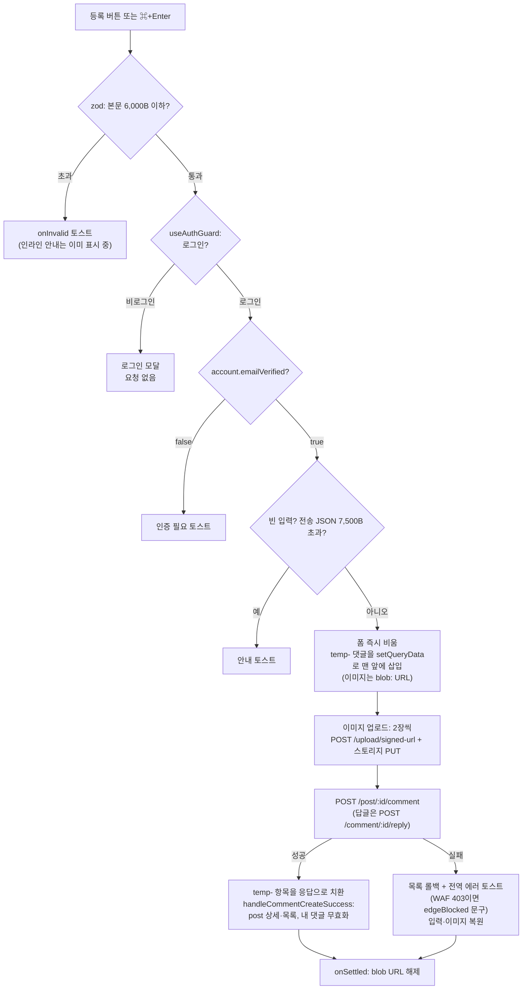

# 댓글 (작성·답글·수정·삭제·좋아요·내 댓글) 기능

> **문서 성격**: 독립 기능 문서(서사형)
>
> **대상 독자**: 이 레포 FE를 처음 보거나 오랜만에 돌아온 개발자.
>
> **읽고 나면**: 댓글이 등록되기 전 화면에 먼저 뜨는 이유(낙관적 업데이트), 길이 상한이
> 두 겹(6,000B·7,500B)인 이유, 이미지가 본문 끝에 URL로 붙는 저장 방식, "내 댓글"에서
> 원글의 그 댓글로 이동하는 방식을 이해하고, 상한·장수·캐시 무효화 범위를 어디서 바꾸는지
> 안다.
>
> **마지막 검토**: 2026-10-02

게시글 상세(`/post/:id`) 하단의 댓글 섹션과, 내가 쓴 댓글을 모아보는 "내 댓글"
화면(`/my/comments`)을 다룬다. 게시글 자체(목록·상세·작성)는
[`POST.md`](./POST.md)가 다룬다.

## 1. 쉬운 설명

댓글 작성은 **메신저에서 메시지를 보내는 것**과 비슷하다. 전송 버튼을 누르면 서버
답을 기다리지 않고 내 메시지가 대화창에 반투명하게 먼저 뜨고, 서버가 받았다고 답하면
진짜 메시지로 조용히 바뀐다. 전송이 실패하면 반투명 메시지가 사라지고 입력창에 쓰던
글이 되돌아온다.

다른 점이 둘 있다.

- **보내기 전에 크기를 잰다** — CloudFront 앞단의 WAF(웹 방화벽)가 8,192바이트를 넘는
  요청을 앱에 닿기도 전에 막는다. 그래서 FE가 미리 본문 바이트(6,000B)와 실제 전송
  바이트(7,500B)를 두 번 잰다(§5 "길이 상한").
- **이미지는 본문의 일부다** — 첨부 이미지는 스토리지에 먼저 올리고, BE가 그 공개
  URL을 본문 끝에 한 줄씩 이어붙여 저장한다. 별도 이미지 테이블이 없다(§5 "이미지").



## 2. 전제 지식

TanStack Query의 `setQueryData`·`invalidateQueries`와 낙관적 업데이트(`onMutate`→롤백),
React Hook Form + zod resolver의 기본 동작은 안다고 가정한다.

가정하지 않는 것:

- 이 레포의 3-Layer API(`*.api.ts`→`*.keys.ts`→`*.queries.ts`)와 크로스 엔티티 무효화 →
  [`FE-ARCHITECTURE.md`](./FE-ARCHITECTURE.md) §5, 낙관적 업데이트 규약은 같은 문서 §11
- 비로그인 유도(`useAuthGuard`)와 이메일 인증 게이트 → [`AUTH.md`](./AUTH.md) §5
  "네 개의 게이트"(게이트 C·D)
- 작성 중 이탈 경고 → [`UNSAVED-CHANGES-GUARD.md`](./UNSAVED-CHANGES-GUARD.md)
- 처음 보는 용어(`temp-` id, 톰스톤, `EDGE_BLOCKED` 등) → §12 용어 사전
- 서비스 전체 지도 → [`ONBOARDING.md`](./ONBOARDING.md)

## 3. 사용한 도구·기술

**기능 자체를 이루는 것**

- **TanStack Query** — 댓글 트리 조회(`useSuspenseQuery`), 내 댓글 무한 스크롤
  (`useSuspenseInfiniteQuery`), 작성·답글·좋아요 낙관적 업데이트
- **React Hook Form + Zod** — 작성·수정 폼이 공유하는 바이트 상한 스키마
  (`commentContentFormSchema`)
- **`useImageAttachments`**(`src/shared/hooks/useImageAttachments.ts`) — 붙여넣기·파일
  선택·드래그앤드롭 첨부, 장수·용량 검증
- **스토리지 직접 업로드** — `uploadImageAndGetUrl`(리사이즈 → 서명 URL 발급 → PUT)
- **`IntersectionObserver`** — 내 댓글 다음 페이지 선반입, 데스크톱 플로팅 버튼 노출 판정
- **`ResizeObserver`** — 모바일 댓글 바 높이만큼 토스트 위치를 올림

**구현·검증 과정에서 쓴 도구**: Vitest + MSW(`src/mocks/handlers/comment.handlers.ts`),
Playwright e2e(`page.route()` 모킹), Storybook 인터랙션 테스트 — §9 참고.

## 4. 왜 만들었나

링크를 공유하는 서비스에서 댓글은 "이 글 왜 좋은지/어디가 틀렸는지"를 남기는 유일한
대화 수단이다. 처음엔 단순 텍스트 CRUD였고, 쓰면서 부딪힌 문제를 하나씩 풀며 지금
모양이 됐다.

- **느림** — 등록 후 서버 응답(당시엔 링크 프리뷰 크롤링 포함)과 목록 재조회를 기다려야
  댓글이 보였다 → 2026-08-03 낙관적 업데이트로 전환(`595b678`). 지금 BE는 링크 프리뷰를
  커밋 후 별도 Lambda에서 크롤링한다(BE `CommentService.kt` 434-435줄 주석).
- **이미지 첨부 발견성** — 붙여넣기로만 첨부할 수 있어 모바일에선 사실상 불가능했다 →
  2026-08-10 버튼·드래그앤드롭, 최대 5장(`docs/DECISIONS.md` 2026-08-10)
- **원인 불명의 403** — 긴 댓글·태그가 섞인 댓글이 CloudFront WAF에 막혔다 →
  2026-09-06 앱 상한 + `EDGE_BLOCKED` 안내(§10)
- **"내가 어디 달았지"** — 내가 쓴 댓글을 다시 찾을 방법이 없었다 → 2026-09-14
  "내 댓글" 화면(`63b6881`, PR #90)

## 5. 구조

### API 엔드포인트

경로 정의는 `src/shared/config/api.ts:49-56`, 호출은 `src/entities/comment/api/comment.api.ts`.

| 메서드   | 경로                         | 용도                                                         |
| -------- | ---------------------------- | ------------------------------------------------------------ |
| `GET`    | `/post/{postId}/comment`     | 게시글의 댓글 트리(루트 + `replies`) 전체, 페이지네이션 없음 |
| `POST`   | `/post/{postId}/comment`     | 루트 댓글 등록 `{ content, images: string[] }`               |
| `POST`   | `/comment/{commentId}/reply` | 답글 등록(바디 동일)                                         |
| `PATCH`  | `/comment/{commentId}`       | 수정 `{ content, images: [...기존 URL, ...새 업로드 URL] }`  |
| `DELETE` | `/comment/{commentId}`       | 삭제                                                         |
| `POST`   | `/comment/{commentId}/like`  | 좋아요 토글(`entities/interaction`이 소유)                   |
| `GET`    | `/comment/my?page&size`      | 내 댓글 페이지(`postId`·`postTitle` 포함, 0부터 시작)        |

응답 타입은 BE OpenAPI 생성 타입의 alias다(`src/entities/comment/model/comment.dto.ts`).
`Comment`는 `linkMetadata`의 nullable과 `replies` 재귀를 직접 override한다 — 이유는 그
파일 주석(9-17줄)에 있다.

### 목록 — 트리 2단, 루트만 최신순

- `useCommentList`(`src/widgets/comment/comment-list/hooks/useCommentList.ts:14-23`)가
  루트 댓글만 `createdAt` 내림차순으로 다시 정렬한다. 답글은 서버가 준 순서 그대로다.
- 헤딩 옆 개수(`countComments`, 같은 파일 6-8줄)는 답글과 **삭제된 톰스톤까지** 센다 —
  `PostCard`의 `commentCount`와 맞추기 위해서다.
- 답글은 한 단계만 허용한다. 답글 버튼 조건은
  `depth < 1 && !isDeleted && !isOptimistic`
  (`src/widgets/comment/comment-list/ui/CommentItem.tsx:40`, `canReply`) — 답글에는
  답글 버튼이 없다.
- 삭제된 댓글(`isDeleted`)은 원래 본문이 아니라 BE가 바꿔 넣은 "삭제된 댓글입니다."가
  흐린 이탤릭으로 보이고, 액션 줄은 사라진다(같은 파일 41줄·88줄, BE 치환은 §5 "삭제").
  게시글 작성자가 쓴 댓글엔 "작성자" 배지가 붙는다(66-70줄).
- `temp-`로 시작하는 낙관적 항목은 `opacity-60`이고 좋아요·답글·수정·삭제를 숨긴다 —
  아직 실제 id가 없어 서버 액션을 걸면 404가 나기 때문이다(37-39줄 주석과 코드).

### 작성 — 즉시 반영, 실패 시 복원

`useCreateComment`(`src/features/comment/create/hooks/useCreateComment.ts`)의 제출 순서는
§1 순서도와 같다. 구현상 짚을 점:

1. **검증은 세 군데로 나뉜다** — zod(본문 6,000B, 실패 시 `onInvalid` 토스트 160-163줄),
   `account.emailVerified === false` 토스트(114-117줄), `getCommentSubmitError`(빈 입력·
   전송 7,500B, 32-51줄). 빈 입력 판정은 이미지만 있어도 통과다.
2. **줄바꿈 정규화** — CRLF·CR을 LF로 바꾼 뒤 잰다(119줄). 붙여넣은 Windows 텍스트가
   바이트를 부풀리지 않게 한다.
3. **폼은 즉시 비우고, 닫기는 미룬다** — `reset()`·`clearAllImages()`를 먼저 하고(136-137줄)
   폼을 닫는 `onSuccess`는 `mutate` 콜백으로 넘긴다. 답글 폼·모바일 바는 성공 시
   언마운트되는데, 지금 닫으면 React Query가 언마운트된 컴포넌트의 `mutate` 스코프
   `onError`를 부르지 않아 복원 수단이 사라진다.
4. **실패 복원은 덮어쓰지 않는다** — 요청이 도는 사이 사용자가 새 글을 쓰기 시작했으면
   본문을 되돌리지 않고, 이미지도 비어 있을 때만 되돌린다(139-146줄). 토스트는 전역
   핸들러가 소유하므로 여기서 띄우지 않는다.
5. **낙관적 삽입** — `useCreateCommentMutation`(`src/entities/comment/api/comment.queries.ts:104-143`)이
   `temp-<uuid>` 댓글을 목록 맨 앞에, `useCreateReplyMutation`(145-207줄)이 부모의
   `replies` 끝에 넣는다. 성공하면 id로 응답과 치환하고 목록은 재조회하지 않는다.

버튼 비활성화는 **빈 입력일 때만**이다(`src/features/comment/create/ui/CommentForm.tsx:59`).
길이 초과는 버튼을 막지 않고 인라인 안내 문구 + `aria-invalid`로 보여준 뒤, 눌렀을 때
zod가 막는다 — 이유는 `.claude/CLAUDE.md` Critical Rules의 "폼 검증 실패를 버튼
`disabled`만으로 처리하지 않는다" 항목과 §10. 빈 상태에서 ⌘+Enter를 누르면 답글 폼이
여러 개 열려 있을 수 있어 그 폼 자체를 화면 중앙으로 스크롤하고 1.3초 강조한다
(76-80줄).

이탈 가드 키는 `comment-create:${postId}:${parentId ?? 'root'}`(useCreateComment.ts
93-96줄)이다. 동작은 [`UNSAVED-CHANGES-GUARD.md`](./UNSAVED-CHANGES-GUARD.md) 참고.

### 길이 상한 — 두 겹인 이유

| 검사                        | 무엇을 재나                                    | 언제                   | 위치                                                    |
| --------------------------- | ---------------------------------------------- | ---------------------- | ------------------------------------------------------- |
| 본문 상한 6,000B            | `content` 원본의 UTF-8 바이트(한글 약 2,000자) | 타이핑 중 + 제출 시    | `commentContentFormSchema`, `MAX_COMMENT_CONTENT_BYTES` |
| 전송 상한 7,500B            | `JSON.stringify({ content, images })`의 바이트 | 제출 직전              | `CommentUtil.estimateCommentPayloadBytes`               |
| WAF `SizeRestrictions_BODY` | 요청 바디 전체 8,192B                          | CloudFront(앱 도달 전) | AWS 관리형 룰, 손대지 않음                              |

본문 바이트만 재면 줄바꿈이 JSON에서 `\n`(2바이트)로 늘어나는 것과 이미지 URL 몫을
놓친다. 그래서 실제 전송될 JSON과 같은 모양을 만들어 다시 잰다. 아직 업로드 전인
이미지는 URL을 모르므로 200바이트 자리표시자로 채운다(`src/entities/comment/utils/comment.util.ts:14-24`).

**왜 6,000B인가** — 이미지 URL 5개(약 650B)와 JSON 봉투를 더해도 8,192B 벽 안에 여유 있게 들어가도록
잡은 값이다(`src/entities/comment/config/comment.const.ts:5-15` 주석). 7,500B는 그 벽 대비 약 700B 여유를 둔
전송 상한이다. 값이 지금으로 정해진 경위는 §10을 본다.

그래도 WAF에 막히면 403이 HTML로 온다. `client.ts`는 JSON 파싱에 실패한 403을
`EDGE_BLOCKED`로 분류하고(`src/shared/api/client.ts:82-91`), 전역 토스트 판정이 이 코드를
`meta.errorMessage`보다 먼저 처리해 "보안 정책에 막혔다"는 문구를 띄운다
(`src/shared/lib/react-query/config/error-toast.ts:80-82`). WAF 룰을 완화하면 안 되는
이유는 `.claude/CLAUDE.md` Critical Rules의 WAF 항목에 있다.

### 이미지 — 본문 끝에 URL을 붙이는 저장 방식

- 첨부는 `useImageAttachments({ maxCount: 5 })`가 받는다. 이미지가 아닌 파일, 30MB 초과
  (리사이즈하지 않는 SVG·GIF는 15MB 초과), 5장 초과는 토스트로 거른다.
- 업로드는 요청 직전 `uploadCommentImages`(`src/entities/comment/api/comment.api.ts:10-22`)가
  **2장씩** 처리한다. `createImageBitmap`이 디코드된 픽셀 수만큼 메모리를 쓰기 때문에
  동시 디코드를 줄이려는 것이고, 결과 배열은 입력 순서를 유지한다.
- 장마다 `uploadImageAndGetUrl`(`src/shared/lib/upload/uploadImageAndGetUrl.ts:11-21`)이
  1600px WebP로 리사이즈 → `POST /upload/signed-url` → 스토리지 `PUT` → `publicUrl`을
  돌려준다. 원본은 저장하지 않는다. 예외로 SVG는 항상, GIF는 댓글 업로드 기본값
  (`skipGifResize = true`)에서 리사이즈 없이 원본을 올린다
  (`src/shared/lib/image/resizeImage.ts:16-22`, 48-49줄) — 그래서 상한이 15MB로 따로 있다.
- BE가 `content` 끝에 URL을 이어붙여 저장한다 — 본문이 있으면 빈 줄 하나 뒤에, 이미지
  URL은 한 줄에 하나씩(BE [`CommentService.kt`](https://github.com/BAECHAN/link-sphere_BE_NEW/blob/main/src/main/kotlin/com/example/linksphere/domain/comment/CommentService.kt)
  `buildFinalContent`, 421-429줄). FE는 낙관적 항목을 같은 규칙으로
  조립하고(`buildOptimisticComment`, comment.queries.ts 22-50줄), 수정 폼은 역함수
  `splitContentImages`(`src/shared/lib/content/imageContent.ts:13-27`)로 텍스트와 이미지
  줄을 다시 나눈다. 테이블을 분리하지 않은 이유는 `docs/DECISIONS.md` 2026-08-10 항목.
- 렌더링은 `MarkdownContent`가 이미지 확장자 URL과 `blob:` URL을 이미지로 그린다.

### 수정 — 기존 이미지는 URL로, 새 이미지는 파일로

`useUpdateComment`(`src/features/comment/update/hooks/useUpdateComment.ts`):

- 편집 시작 시점에 `splitContentImages`로 한 번만 스냅샷을 뜬다(53-54줄). 기존 이미지는
  URL 썸네일로, 새로 붙인 것은 `File`로 따로 관리한다.
- 기존 이미지 장수를 `reservedCount`로 넘겨 합계 5장을 지킨다(77줄).
- 전송 상한 계산에 기존 URL을 실제 길이로 포함한다(39-41줄).
- PATCH 바디의 `images`는 `[...남은 기존 URL, ...새 업로드 URL]`이다(comment.api.ts 60-61줄).
- 성공 시 응답을 통째로 넣지 않고 `content`·`linkMetadata`만 병합한다
  (`patchCommentRecursively`, comment.queries.ts 55-69줄·238-243줄). PATCH 응답은
  `replies`·`likeCount`·`isLiked`를 항상 기본값으로 주기 때문에 통째로 넣으면 답글이
  사라지고 좋아요가 리셋된다. 병합 뒤 `handleCommentUpdateSuccess`가 목록을 한 번 더
  무효화한다(정합성 백스톱).
- 작성과 달리 **낙관적이지 않다** — 응답이 와야 폼이 닫힌다.

### 삭제 — 확인 후 서버 판단을 기다린다

`useDeleteComment`(`src/features/comment/delete/hooks/useDeleteComment.ts:13-25`)가
`openConfirm`(확정 강조 `emphasis: 'confirm'`)을 띄우고 확인 시 `mutateAsync`로 지운다.
낙관적 반영은 없고, 성공하면 `handleCommentDeleteSuccess`가 댓글 목록·내 댓글·게시글
상세·게시글 목록을 무효화한다.

답글이 없는 댓글은 행 자체가 지워져 목록에서 사라지고, 답글이 있는 댓글은 본문을
"삭제된 댓글입니다."로 바꾼 `isDeleted: true` 톰스톤으로 남는다. 이 분기는 BE
`deleteComment`가 `existsByParentId`로 정한다(BE
[`CommentService.kt`](https://github.com/BAECHAN/link-sphere_BE_NEW/blob/main/src/main/kotlin/com/example/linksphere/domain/comment/CommentService.kt)
290-325줄, 문구 상수는 21줄, 조회 응답에서도 99줄에서 같은 문구로 내려준다). FE는 그
결과를 재조회로 받기만 한다. `e2e/comment-delete.spec.ts`가 두 경우를 모킹으로 재현해
검증한다.

### 좋아요 — 낙관적 토글, 실패는 조용히 롤백

`LikeCommentButton`이 `useAuthGuard`로 감싸 feature 훅 `useLikeComment`
(`src/features/comment/like/hooks/useLikeComment.ts:5-7`)를 부르고, 이 훅이
`useLikeCommentMutation`(`src/entities/interaction/api/interaction.queries.ts:226-271`)을
그대로 돌려준다. 버튼은 `ToggleButton`이라 400ms 안의 재클릭을 무시하고, 요청 중 `disabled`는 두지
않는다(낙관적 반영 중 흐려지는 깜빡임을 피하려고 — [`POST.md`](./POST.md) §5 "좋아요"와 같은 결정, 2026-10-02).

- `onMutate`에서 트리를 재귀로 돌며 `isLiked`·`likeCount`를 뒤집는다.
- `meta: { manualErrorHandling: true }`인데 자체 토스트도 없다 — 실패하면 화면만 원래대로
  돌아가고 아무 안내가 없다.
- 성공 후 무효화·응답 반영이 없다. 낙관적 값이 그대로 정답으로 남는다.

### 내 댓글(`/my/comments`)

- `MyCommentPage`(`src/pages/mycomment/MyCommentPage.tsx`) → `MyCommentList` →
  `useMyCommentList`. 보호 경로다(`src/shared/config/route-paths.ts:45`).
- `useSuspenseMyCommentsInfiniteQuery`(comment.queries.ts 82-102줄)가 0페이지부터 10개씩
  가져오고, `select`에서 페이지 경계 중복 id를 걸러 낸다.
- 다음 페이지는 목록 끝 감시 요소가 화면 아래 1200px 안에 들어오면 미리 부른다
  (`src/widgets/comment/my-comment-list/hooks/useMyCommentList.ts:19`).
- 가상화하지 않는다 — 카드가 가볍고 Ctrl+F를 살리려는 판단(`docs/DECISIONS.md` 2026-09-19
  가상화 항목의 "범위 밖").
- 카드(`src/widgets/comment/my-comment-list/ui/MyCommentCard.tsx`)는 본문을 `splitContentImages`로
  나눠 텍스트만 3줄까지 보여주고, 첨부 이미지는 원글 배지 옆에 개수(🖼 N)로만 알린다. 이미지만
  있는 댓글은 본문 자리에 "사진 N장"을 흐리게 띄운다. 2026-10-02 전까지는 본문을 그대로 그려
  스토리지 URL이 글자로 보였다 — 개수 표시·작은 썸네일·텍스트만 세 안을 실제 카드 스타일로
  나란히 비교해 카드 높이가 지금과 같은 개수 표시안을 골랐다(`e2e/my-comments.spec.ts`).
- 카드는 `/post/${postId}#comment-${id}`로 링크한다
  (`src/widgets/comment/my-comment-list/ui/MyCommentCard.tsx:18`).

**해시 이동**: 상세의 `CommentList`가 `location.hash`로 대상을 찾아
`scrollIntoView({ behavior: 'smooth', block: 'start' })`하고 1.6초 동안 링으로 강조한다
(`src/widgets/comment/comment-list/ui/CommentList.tsx:37-66`). 대상 요소는
`CommentItem` 루트의 `id="comment-<id>"`이고, sticky navbar에 가리지 않도록
`scroll-mt-[calc(var(--navbar-height)_+_24px)]`를 둔다(CommentItem.tsx 45·51줄). 상세의
돌아가기 버튼 라벨은 [`POST-DETAIL-BACK-NAVIGATION.md`](./POST-DETAIL-BACK-NAVIGATION.md)가
다룬다.

### 모바일 댓글 바 · 데스크톱 플로팅 버튼

`CommentList`는 화면 폭에 따라 작성 진입점을 다르게 둔다.

| 폭       | 진입점                                                        | 핵심 동작                                                                                                |
| -------- | ------------------------------------------------------------- | -------------------------------------------------------------------------------------------------------- |
| 모바일   | `MobileCommentBar` — 탭바 위 고정 바, 탭하면 하단 시트로 펼침 | 접힘 `z-panel`, 펼침 `z-scrim`. 바 높이만큼 `--toast-offset-bottom`을 올려 토스트가 바 위에 뜨게 함      |
| 데스크톱 | 목록 위 인라인 `CommentForm` + `ScrollToCommentFormButton`    | 폼이 navbar 아래로 사라지면 우하단에 버튼 노출, 누르면 폼으로 스크롤 후 `focus({ preventScroll: true })` |

- 모바일 헤더 검색이 열리면 바를 **언마운트하지 않고** `hidden`으로만 숨긴다
  (`src/features/comment/create/ui/MobileCommentBar.tsx:24`, 71·89줄). 이탈 가드는 같은
  pathname 이동을 통과시키므로, 언마운트하면 쓰던 글이 경고 없이 사라진다.
- 펼친 시트의 `z-scrim`은 사이드바 백드롭과 같은 층이다 — 미해결 충돌(§11), 근거는
  [`DESIGN-SYSTEM.md`](./DESIGN-SYSTEM.md) §4.
- 두 컴포넌트는 `space-y-6` 형제 목록 **밖**에 둔다(CommentList.tsx 105-120줄). 안에 두면
  마운트·언마운트 때마다 24px 레이아웃이 흔들린다(§10).

### 캐시 무효화 범위

`src/entities/comment/api/comment.keys.ts`가 정본이다.

| 이벤트      | 댓글 목록(`list`)         | 내 댓글(`myRoot`) | 게시글 상세·목록    |
| ----------- | ------------------------- | ----------------- | ------------------- |
| 작성·답글   | ❌ (낙관적으로 직접 갱신) | ✅                | ✅ (`commentCount`) |
| 수정        | ✅ (병합 뒤 백스톱)       | ✅                | ❌                  |
| 삭제        | ✅                        | ✅                | ✅                  |
| 좋아요      | ❌ (낙관적 값 유지)       | ❌                | ❌                  |
| 프로필 변경 | ✅ (`root` 전체)          | ✅                | —                   |

게시글 쪽은 `entities/post/@x/comment.ts`가 공개한 `postInvalidateQueries`로만 건드린다.
프로필 변경 시 무효화는 `entities/account`가 `src/entities/comment/@x/account.ts`를 거쳐
부른다([`MYPAGE.md`](./MYPAGE.md) §6).

## 6. 상태 모델

### `commentKeys` 계층(`src/entities/comment/api/comment.keys.ts:4-12`)

| 키                         | 값                     | 데이터                                       |
| -------------------------- | ---------------------- | -------------------------------------------- |
| `commentKeys.root`         | `['comments']`         | (무효화 기준점)                              |
| `commentKeys.list(postId)` | `['comments', postId]` | `Comment[]` — 루트 배열, 각자 `replies` 보유 |
| `commentKeys.myRoot`       | `['comments', 'my']`   | 무한 쿼리 페이지(`MyCommentListResponse[]`)  |

`myRoot`는 `list`와 같은 `['comments', …]` 아래라, `root` 무효화 한 번에 둘 다 걸린다.

### 낙관적 항목의 수명

| 단계        | 캐시 상태                                     | 화면                        |
| ----------- | --------------------------------------------- | --------------------------- |
| `onMutate`  | `temp-<uuid>` 항목 삽입, 이미지는 `blob:` URL | 반투명, 액션 줄 없음        |
| `onSuccess` | 같은 자리를 서버 응답으로 치환                | 불투명, 액션 줄 표시        |
| `onError`   | 삽입 전 스냅샷으로 통째로 복원                | 항목 사라짐, 폼에 입력 복원 |
| `onSettled` | `URL.revokeObjectURL`로 blob 해제             | —                           |

### 폼 훅 반환값

`useCreateComment`·`useUpdateComment`는 `form`·`onSubmit`·`contentValue`·`isOverLimit`와
첨부 핸들러 묶음을 돌려준다. `useUpdateComment`만 `canSubmit`(빈 입력·요청 중이면
`false`)을 직접 계산해 준다. 원본 시그니처는 각 파일을 본다.

## 7. 운영 파라미터

| 파라미터                     | 값                      | 실제 위치                                                                                                    |
| ---------------------------- | ----------------------- | ------------------------------------------------------------------------------------------------------------ |
| 댓글당 최대 이미지           | 5장                     | `src/entities/comment/config/comment.const.ts:1`                                                             |
| 내 댓글 페이지 크기          | 10                      | `src/entities/comment/config/comment.const.ts:4`                                                             |
| 본문 상한                    | 6,000B(한글 약 2,000자) | `src/entities/comment/config/comment.const.ts:15`                                                            |
| 전송 상한                    | 7,500B                  | `src/entities/comment/config/comment.const.ts:26`                                                            |
| 업로드 전 이미지 URL 추정치  | 200B                    | `src/entities/comment/config/comment.const.ts:33`                                                            |
| 이미지 동시 업로드 수        | 2                       | `src/entities/comment/api/comment.api.ts:14`                                                                 |
| 리사이즈 최대 변 길이        | 1600px                  | `src/shared/lib/upload/uploadImageAndGetUrl.ts:13`                                                           |
| 원본 파일 상한               | 30MB                    | `src/shared/lib/image/resizeImage.ts:13`                                                                     |
| SVG·GIF(리사이즈 안 함) 상한 | 15MB                    | `src/shared/lib/image/resizeImage.ts:22`                                                                     |
| 해시 이동 강조 시간          | 1600ms                  | `src/widgets/comment/comment-list/ui/CommentList.tsx:62`                                                     |
| 빈 제출 강조 시간            | 1300ms                  | `src/features/comment/create/ui/CommentForm.tsx:79`, `src/features/comment/update/ui/CommentEditForm.tsx:56` |
| 내 댓글 선반입 거리          | 아래 1200px             | `src/widgets/comment/my-comment-list/hooks/useMyCommentList.ts:19`                                           |
| 해시 도착 여백               | navbar + 24px           | `src/widgets/comment/comment-list/ui/CommentItem.tsx:51`                                                     |
| 플로팅 버튼 전환 시간        | 200ms                   | `src/widgets/comment/comment-list/ui/ScrollToCommentFormButton.tsx:9`                                        |
| 모바일 바 ↔ 토스트 간격      | 8px                     | `src/features/comment/create/ui/MobileCommentBar.tsx:14`                                                     |

**함께 바꿔야 하는 값**:

- 본문 상한을 바꾸면 BE `MAX_COMMENT_CONTENT_BYTES = 6_000`(BE
  [`CommentService.kt`](https://github.com/BAECHAN/link-sphere_BE_NEW/blob/main/src/main/kotlin/com/example/linksphere/domain/comment/CommentService.kt)
  51줄, 등록·답글·수정에서 각각 검사)과 안내 문구
  `TEXTS.validation.commentContentTooLong`("한글 2,000자", `src/shared/config/texts.ts:416`)도
  함께 고친다 — 자동 동기화 장치는 없다.
- 장수 상한은 BE `MAX_COMMENT_IMAGES = 5`(같은 파일 43줄, 등록·답글·수정에서 검사)와
  같아야 한다.
- 7,500B는 WAF 8,192B 벽에서 약 700B 여유를 둔 값이다. 올리면 그 여유가 준다.

## 8. 코드 지도와 자주 하는 수정

| 단계                            | 파일:줄                                                                                                                            |
| ------------------------------- | ---------------------------------------------------------------------------------------------------------------------------------- |
| 목록 정렬·개수                  | `src/widgets/comment/comment-list/hooks/useCommentList.ts:6-23`                                                                    |
| 목록 렌더·해시 이동·진입점 배치 | `src/widgets/comment/comment-list/ui/CommentList.tsx:20-123`                                                                       |
| 댓글 한 개(액션·답글 폼·재귀)   | `src/widgets/comment/comment-list/ui/CommentItem.tsx:26-183`                                                                       |
| 작성 검증·제출·복원             | `src/features/comment/create/hooks/useCreateComment.ts:32-164`                                                                     |
| 작성 폼 UI                      | `src/features/comment/create/ui/CommentForm.tsx:30-198`                                                                            |
| 모바일 바                       | `src/features/comment/create/ui/MobileCommentBar.tsx:16-104`                                                                       |
| 데스크톱 플로팅 버튼            | `src/widgets/comment/comment-list/ui/ScrollToCommentFormButton.tsx:23-103`                                                         |
| 수정 검증·제출                  | `src/features/comment/update/hooks/useUpdateComment.ts:27-143`                                                                     |
| 삭제 확인                       | `src/features/comment/delete/hooks/useDeleteComment.ts:9-31`                                                                       |
| 좋아요 버튼·feature 훅          | `src/features/comment/like/ui/LikeCommentButton.tsx:17-41`, `src/features/comment/like/hooks/useLikeComment.ts:5-7`                |
| 좋아요 낙관적 토글              | `src/entities/interaction/api/interaction.queries.ts:226-271`                                                                      |
| API·이미지 업로드               | `src/entities/comment/api/comment.api.ts:10-67`                                                                                    |
| 쿼리·낙관적 업데이트            | `src/entities/comment/api/comment.queries.ts:22-247`                                                                               |
| 키·무효화 핸들러                | `src/entities/comment/api/comment.keys.ts:4-47`                                                                                    |
| 바이트 스키마·전송량 추정       | `src/entities/comment/model/comment.schema.ts:8-15`, `src/entities/comment/utils/comment.util.ts:14-24`                            |
| WAF 403 분류·문구               | `src/shared/api/client.ts:82-91`, `src/shared/lib/react-query/config/error-toast.ts:80-82`                                         |
| 내 댓글 목록·카드               | `src/widgets/comment/my-comment-list/ui/MyCommentList.tsx:11-50`, `src/widgets/comment/my-comment-list/ui/MyCommentCard.tsx:23-57` |
| UI 문구                         | `src/shared/config/texts.ts:299` (`TEXTS.comment`)                                                                                 |

### 자주 하는 수정

| 하고 싶은 것             | 방법                                                                                                                                                                                                                                                          |
| ------------------------ | ------------------------------------------------------------------------------------------------------------------------------------------------------------------------------------------------------------------------------------------------------------- |
| 이미지 장수 변경         | `MAX_COMMENT_IMAGES` + BE 검증 동시 변경. 늘리면 7,500B 전송 상한 안에 들어가는지 다시 계산                                                                                                                                                                   |
| 본문 길이 상한 변경      | §7 "함께 바꿔야 하는 값" 세 곳을 한 커밋에서. WAF 8,192B를 넘기는 값은 불가(`.claude/CLAUDE.md` WAF 항목)                                                                                                                                                     |
| 답글 깊이 늘리기         | BE 변경이 먼저다 — BE `CommentService.kt`가 답글에 대한 답글을 "Max Depth 1"로 거절한다(248-253줄). FE도 `CommentItem.tsx:40`의 `depth < 1`만으로는 안 되고, `useCreateReplyMutation`이 루트의 `replies`만 찾으므로(comment.queries.ts 170-179줄) 함께 고친다 |
| 루트 정렬을 오래된순으로 | `useCommentList.ts:16-18`의 비교 순서를 뒤집는다. 낙관적 삽입 위치(맨 앞)도 함께 맞춘다                                                                                                                                                                       |
| 무효화 범위 조정         | `comment.keys.ts`의 `handleComment*Success`만 고친다(feature 훅에서 직접 무효화 금지)                                                                                                                                                                         |
| 해시 이동 정렬·강조 시간 | `CommentList.tsx:46`(`block`), `:62`(시간), 도착 여백은 `CommentItem.tsx:51`                                                                                                                                                                                  |
| 좋아요 실패 시 안내 추가 | `useLikeCommentMutation`의 `meta.manualErrorHandling`을 빼면 전역 토스트가 뜬다                                                                                                                                                                               |
| 테스트 실행              | `npx vitest run src/entities/comment src/features/comment`, e2e는 `pnpm test:e2e e2e/comment.spec.ts`                                                                                                                                                         |

## 9. 검증 결과

2026-10-02 이 문서를 쓰며 아래 명령을 다시 돌려 8개 파일 52개가 모두 통과했다(댓글
파일 + `client.test.ts` + `useImageAttachments.test.ts`).

```bash
npx vitest run src/entities/comment src/features/comment \
  src/shared/api/client.test.ts src/shared/hooks/useImageAttachments.test.ts
```

댓글 전용분은 다음과 같다.

| 파일                                                                        | 개수 | 확인하는 것                                                                |
| --------------------------------------------------------------------------- | ---- | -------------------------------------------------------------------------- |
| `src/entities/comment/api/comment.queries.test.ts`                          | 8    | 낙관적 삽입·치환·롤백(루트·답글), 수정 시 좋아요·답글 보존, 수정 후 무효화 |
| `src/entities/comment/api/comment.api.test.ts`                              | 2    | 5장 업로드 시 동시 2개 제한, 순서 유지                                     |
| `src/features/comment/create/hooks/useCreateComment.test.tsx`               | 6    | 즉시 비움, 실패 복원, 새 입력 보호, 6,000B·7,500B 차단, 이메일 미인증 차단 |
| `src/features/comment/update/hooks/useUpdateComment.test.tsx`               | 6    | 원본 초기화, `canSubmit`, 초과 시 버튼 미차단·제출 차단, 전송량 차단, 성공 |
| `src/features/comment/create/ui/MobileCommentBar.test.tsx`                  | 4    | 검색 오버레이 중 숨김·상태 보존, 토스트 오프셋                             |
| `src/widgets/comment/comment-list/ui/ScrollToCommentFormButton.stories.tsx` | 1    | Storybook 인터랙션                                                         |

`EDGE_BLOCKED` 분류는 `src/shared/api/client.test.ts`와
`src/shared/lib/react-query/config/error-toast.test.ts`가 다룬다.

e2e(이번에 다시 돌리지 않았다, 파일 기준):

- `e2e/comment.spec.ts` — 작성 후 상세는 즉시, 목록은 재방문 시 댓글 수 반영
- `e2e/comment-delete.spec.ts` — 답글 없는 댓글 삭제 시 3개 캐시 감소, 답글 있는 댓글은
  톰스톤으로 남고 카운트 유지
- `e2e/guest-guard.spec.ts` — 비로그인 작성 시도 → 로그인 모달, `POST` 요청 없음
- `e2e/post-detail-search-overlay.mobile.spec.ts` — 검색을 열면 댓글 바가 사라지고, 닫으면
  쓰던 내용이 남음

**테스트 공백**: `useLikeCommentMutation`과 해시 이동(`scrollToHashedComment`)은
단위·e2e 어디에도 전용 테스트가 없다. `useDeleteComment`는 단위 테스트만 없다 —
`e2e/comment-delete.spec.ts`가 확인 다이얼로그(확정 버튼 포커스 포함)부터 하드 삭제·
톰스톤까지 이 훅을 거쳐 검증한다.

## 10. 시행착오

### 댓글 403 추적 — 크기 문제인 줄 알았는데 XSS 룰 오탐이었다(2026-09-06)

상세는 `docs/DECISIONS.md` 2026-09-06 "댓글 등록 403" 항목이 정본이다. 흐름만 요약한다.

1. 긴 댓글이 CloudFront 403 HTML로 막혔다. 범인은 WAF `SizeRestrictions_BODY`(8,192B).
   처음 계획은 이 룰을 Count로 내리고 16KB 커스텀 룰을 둔 뒤, 그 안쪽에 앱 상한을 두는
   것이었다.
2. 앱 상한을 처음엔 15,000B(한글 5,000자)로 잡았다가 12,000B로 낮췄다. WAF가 재는 건
   `content`가 아니라 JSON 직렬화한 전체 바디인데, 개행 이스케이프·이미지 URL·JSON 봉투를
   빼고 계산해 16KB 방어선까지 여유가 490B뿐이었기 때문이다.
3. 실제 적용에서 16KB 커스텀 크기 룰이 CloudFront Pro 플랜 전용이라 거부됐다. Count만
   두면 바디 크기 방어가 아예 사라져 WAF를 **원복**했다. 8KB 벽이 그대로 남으므로 앱
   상한을 12,000B에서 최종 6,000B로 다시 낮췄다.
4. 처음엔 초과 시 버튼을 `disabled`로 막았는데, 그러면 클릭 자체가 안 먹어 초과 안내
   토스트가 뜰 기회가 없었다. 버튼을 열어 두고 인라인 안내 + zod 차단으로 바꿨다.
5. 배포 직후 "짧은 줄이 아주 많은 글"이 6,000B 밑인데도 다시 403이 났다. 줄바꿈이
   JSON에서 2바이트가 되기 때문이다 → 7,500B 전송 안전망 추가.
6. 그 뒤에도 짧은 콘솔 로그 댓글이 막혔다. 진짜 원인은 `CrossSiteScripting_BODY` 룰의
   오탐이었다(`<Button onClick={x}>` 같은 정상 개발 댓글도 차단). 이 룰만 Count로 내리고,
   어떤 WAF 차단이든 이유를 알 수 있게 `EDGE_BLOCKED` 안내를 만들었다.

교훈: 클라이언트 검증이 서버(여기선 WAF)와 **다른 값**을 재면, 그 차이가 나는 입력이
흔한지부터 따져야 한다.

### 플로팅 요소를 `space-y` 안에 두면 페이지가 24px씩 흔들린다(2026-09-06)

상세 화면 하단에서 스크롤할 때 본문이 "툭" 밀렸다. 댓글 이미지·웹폰트 가설을 차례로
기각한 뒤, `MobileCommentBar`·`ScrollToCommentFormButton`이 `space-y-6`의 형제로
마운트·언마운트되며 `:not(:last-child)` 마진이 앞 요소에 붙었다 떨어지는 게 원인임을
찾았다. 두 컴포넌트를 형제 목록 밖으로 뺐다(`docs/DECISIONS.md` 2026-09-06 "상세 화면
스크롤 시 본문이 밀리던 문제").

### 낙관적 작성·수정의 깜빡임(2026-08-03)

- 작성: 등록 → 응답 → 목록 재조회 후에야 보이던 것을 낙관적 삽입 + id 치환으로 바꿨다
  (`595b678`).
- 수정: 폼은 PATCH 응답 시점에 닫히는데 목록은 별도 재조회가 끝나야 바뀌어, 옛 내용이
  한 프레임 스쳤다. 응답을 캐시에 먼저 병합한 뒤 폼을 닫도록 순서를 맞췄다(`278dabf`).
  이때 PATCH 응답을 통째로 넣으면 답글·좋아요가 날아간다는 것도 발견해 필드 병합으로
  바꿨다.

### 해시 이동 정렬: `center` → `start`, 그리고 기록 불일치(2026-09-14)

"내 댓글" 출시(PR #90) 때는 `block: 'center'`였다. 긴 댓글은 시작부가 뷰포트 위로 잘려
`'start'`로 바꿨고, 대신 navbar에 가리지 않게 `scroll-mt`를 더했다. 처음엔 navbar 높이만
예약했다가 "딱 붙어 답답하다"는 피드백에 0/12/16/24px 목업을 나란히 비교해 24px로
정했다(CHANGELOG 0.14.0, PR #95).

**정정**: `docs/DECISIONS.md` 2026-09-14 "포스트 상세 돌아가기 버튼" 항목의 배경은 아직
`scrollIntoView({ block: 'center' })`라고 적혀 있다. 그 항목이 쓰인 시점의 사실이고,
현재 코드는 `'start'`다(`CommentList.tsx:46`). DECISIONS.md는 append-only라 그대로 둔다.

### 로그아웃 후 "내 댓글"이 계속 에러로 남던 문제(2026-09-14)

"내 댓글" 화면을 연 채 로그아웃하면 배경 재요청이 401을 받아 캐시가 error로 굳었고,
다시 로그인해도 Suspense 훅이 옛 에러를 그대로 다시 던졌다. 로그인 성공 시 "에러이면서
데이터 없는" 쿼리만 리셋하도록 고쳤다(PR #94, CHANGELOG 0.14.0). 로그아웃 시 재요청
자체를 줄인 후속 결정은 `docs/DECISIONS.md` 2026-09-14 "로그아웃 배경 재요청" 항목과
[`AUTH.md`](./AUTH.md)에 있다.

## 11. 남은 것

기록만 하고 고치지 않은 것들이다.

- **받는 사람이 이미 그 게시글을 보고 있으면 알림의 댓글로 스크롤되지 않을 수 있다** — 푸시 알림은
  2026-10-02부터 `#comment-<id>`를 붙여 이동해 "내 댓글"과 같은 해시 스크롤을 탄다. 다만 같은
  게시글 화면에 있던 중이면 댓글 목록 캐시에 새 댓글이 아직 없어 대상 요소를 못 찾고 조용히
  넘어간다(아래 "해시 대상이 없으면" 항목과 같은 원인). 푸시 자체는
  [`FCM-PUSH-NOTIFICATION.md`](./FCM-PUSH-NOTIFICATION.md).
- **좋아요 실패가 조용하다** — 롤백만 하고 안내가 없으며, 성공 후에도 서버 값으로 다시
  맞추지 않는다. 다른 탭·기기에서 누른 좋아요는 목록이 재조회될 때까지 반영되지 않는다.
- **삭제가 낙관적이지 않다** — 하드 삭제인지 톰스톤인지 BE가 정하므로 응답과 재조회를
  기다린다. 그 사이 반응이 느려 보일 수 있다.
- **이미지 저장이 본문 이어붙이기다** — `comment_images` 테이블 분리는 2026-08-10에
  보류했다. 문장 중간의 이미지 링크와 첨부 이미지를 줄 단위 규칙으로만 구분한다.
- **`z-scrim` 공유 충돌 미해결** — 펼친 모바일 댓글 시트와 사이드바 백드롭이 같은 층이다
  (`docs/DECISIONS.md` 2026-09-13, [`DESIGN-SYSTEM.md`](./DESIGN-SYSTEM.md) §4).
- **해시 대상이 없으면 조용히 무시한다** — 삭제됐거나 목록에 없는 댓글로 들어오면
  `scrollToHashedComment`가 아무 안내 없이 끝난다(CommentList.tsx 42-45줄).

## 12. 용어 사전

- **낙관적 항목(`temp-` 댓글)** — 서버 응답 전 목록에 먼저 넣는 임시 댓글. id가
  `temp-<uuid>`라 `CommentItem`이 이 접두사로 서버 액션을 숨긴다.
- **톰스톤(tombstone)** — 답글이 달린 댓글을 지웠을 때 트리 구조를 지키려고
  `isDeleted: true`로 남겨 두는 자리. 원래 본문은 BE가 "삭제된 댓글입니다."로 바꾸고,
  화면엔 그 문구가 흐린 이탤릭으로 액션 줄 없이 보인다. 개수에는 포함된다.
- **백스톱(backstop)** — 1차 처리가 놓쳤을 때를 대비한 2차 안전장치. 예: 수정 성공 시
  캐시를 직접 병합한 뒤에도 목록을 한 번 더 무효화하는 것.
- **`@x`** — 다른 엔티티에 공개하는 표면만 모아 둔 FSD 교차 참조 폴더(예:
  `src/entities/post/@x/comment.ts`는 post가 comment에 공개하는 것만 export한다).
  [`FE-ARCHITECTURE.md`](./FE-ARCHITECTURE.md) §5 참고.
- **WAF Count 모드** — 규칙에 걸린 요청을 막지 않고 집계만 하는 동작(차단하는 것은
  Block 모드).
- **`SizeRestrictions_BODY`** — AWS 관리형 룰셋의 규칙. 요청 바디가 8,192B를 넘으면
  막는다. 이 레포에선 Block 그대로 둔다.
- **`CrossSiteScripting_BODY`** — 같은 룰셋에서 바디의 XSS 패턴을 막는 규칙. 정상 개발
  댓글을 오탐해 2026-09-06에 Count로 내렸다(§10).
- **본문 상한 / 전송 상한** — `MAX_COMMENT_CONTENT_BYTES`(6,000B, `content` 원본) /
  `MAX_COMMENT_PAYLOAD_BYTES`(7,500B, 실제 전송 JSON).
- **`estimateCommentPayloadBytes`** — 전송될 `{ content, images }` JSON을 실제로 만들어
  그 UTF-8 바이트를 재는 `CommentUtil`의 정적 메서드.
- **`EDGE_BLOCKED`** — 앱이 아니라 CloudFront/WAF가 막은 403을 FE가 구분하려고 만든 에러
  코드. JSON이 아닌 403 응답이 그 신호다.
- **`splitContentImages`** — 댓글 `content`를 텍스트와 "URL 하나만 있는 이미지 줄"로 나누는
  함수. BE `buildFinalContent`의 역함수.
- **`reservedCount`** — 수정 폼에서 이미 붙어 있는 이미지 장수. `useImageAttachments`가
  새 첨부 가능 장수를 계산할 때 뺀다.
- **`patchCommentRecursively`** — 트리에서 id가 같은 댓글을 찾아 일부 필드만 병합하는
  수정 성공 처리 함수.
- **해시 이동** — `/post/:id#comment-:id`로 들어왔을 때 그 댓글로 스크롤하고 링으로
  강조하는 동작(`scrollToHashedComment`).
- **`z-panel` / `z-scrim`** — `src/app/globals.css:103-105`의 z-index 토큰(40 / 55).

## 13. 관련 문서

- [`POST.md`](./POST.md) — 게시글 목록·상세·작성
- [`AUTH.md`](./AUTH.md) — `useAuthGuard`(게이트 C), 이메일 인증 게이트(게이트 D)
- [`FCM-PUSH-NOTIFICATION.md`](./FCM-PUSH-NOTIFICATION.md) — 댓글이 달리면 오는 푸시 알림
- [`UNSAVED-CHANGES-GUARD.md`](./UNSAVED-CHANGES-GUARD.md) — 댓글 작성·수정 중 이탈 경고
- [`POST-DETAIL-BACK-NAVIGATION.md`](./POST-DETAIL-BACK-NAVIGATION.md) — "내 댓글"에서
  들어온 상세의 돌아가기 버튼
- [`DESIGN-SYSTEM.md`](./DESIGN-SYSTEM.md) — z-index 토큰과 `z-scrim` 충돌
- [`MYPAGE.md`](./MYPAGE.md) — 프로필 변경 시 댓글 작성자 정보 무효화
- [`FE-ARCHITECTURE.md`](./FE-ARCHITECTURE.md) — §5 3-Layer API·크로스 엔티티 무효화,
  §11 낙관적 업데이트
- [`DECISIONS.md`](./DECISIONS.md) — 2026-08-10(이미지 다중 첨부), 2026-09-06(403·WAF,
  `space-y` 흔들림), 2026-09-13(`z-scrim`), 2026-09-14(돌아가기 라벨·로그아웃 캐시),
  2026-09-19(가상화 범위 밖)
- [`ONBOARDING.md`](./ONBOARDING.md) — FE·BE 전체 길잡이
- `.claude/CLAUDE.md` Critical Rules — WAF 바디 크기 룰, `disabled` 버튼 검증 규칙
