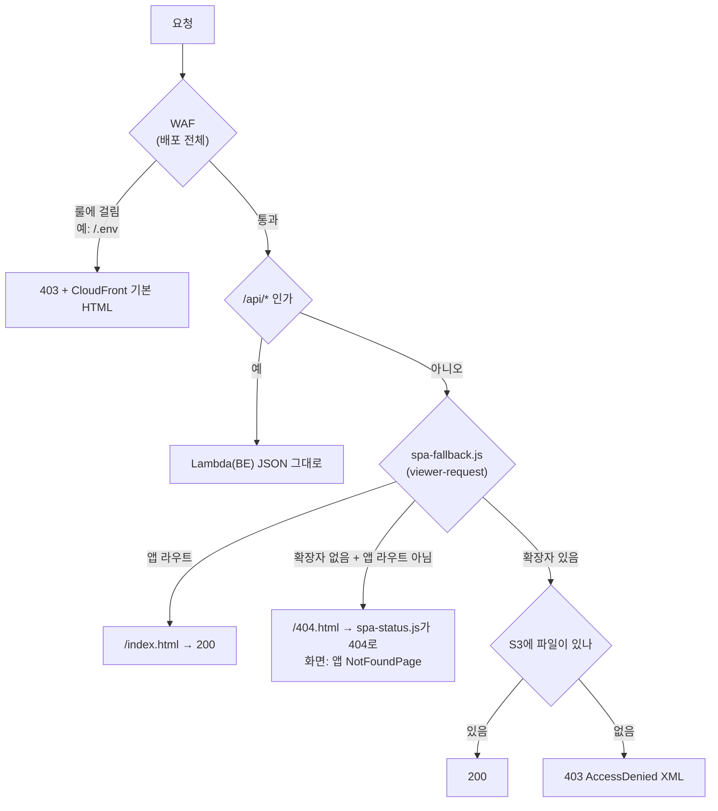

# 배포 가이드 (Deployment Guide)

이 문서는 Link Sphere Frontend 애플리케이션의 배포 아키텍처와 GitHub Actions를 이용한 자동화 절차에 대해 설명합니다.
이 파이프라인 위에 걸려 있는 PR·배포 검사 게이트(타입체크·린트·테스트)는 [CI-CHECK-GATE.md](./CI-CHECK-GATE.md)를 참고하세요.

## 아키텍처 (Architecture)

본 프로젝트는 AWS S3와 CloudFront를 사용하여 정적 웹 호스팅을 구현하고 있습니다.

- **AWS S3 (Simple Storage Service)**: 빌드된 정적 파일(HTML, CSS, JS, Assets)을 저장하는 원본(Origin) 저장소입니다.
- **AWS CloudFront**: S3에 저장된 정적 파일을 전 세계 엣지 로케이션에서 캐싱하여 빠르게 제공하는 CDN(Content Delivery Network)입니다.

## CI/CD 파이프라인 (GitHub Actions)

이 프로젝트는 `.github/workflows/deploy.yml`에 정의된 워크플로우를 통해 **Main 브랜치에 Push** 될 때 자동으로 배포됩니다.

### 워크플로우 상세 단계

1.  **Trigger**: `main` 브랜치에 푸시되면 워크플로우가 시작됩니다 — 단, 경로 필터가
    걸려 있어 `src/**`·`public/**`·`package.json`·`pnpm-lock.yaml`·`vite.config.ts`·
    `postcss.config.js`·`index.html`·`tsconfig*.json`·`scripts/inject-csp.js` 중
    하나라도 바뀐 push에만 실행됩니다(`.github/workflows/deploy.yml`의 `on.push.paths`).
    즉 `CHANGELOG.md`나 `docs/` 아래 파일만 바뀐 push는 이 워크플로우를 **트리거하지
    않습니다** — 직전 배포가 실패해 있던 상태를 문서 수정 커밋으로 고쳤다고 착각하기
    쉬운 지점(사고 사례: [CI-CHECK-GATE.md §9.3](./CI-CHECK-GATE.md)). 이럴 때는 아래
    "GitHub Actions 수동 재실행"으로 직접 트리거해야 합니다.
2.  **Environment Setup**:
    - Ubuntu Latest 환경에서 실행됩니다.
    - Node.js 24 버전을 사용합니다 (`.nvmrc` 기준).
3.  **Install Dependencies**:
    - `pnpm install --frozen-lockfile`로 의존성을 설치합니다.
4.  **Build**:
    - `pnpm build`(`package.json`: `tsc -b && vite build && node scripts/inject-csp.js`)로
      프로젝트를 빌드합니다 — 타입 체크 → Vite 빌드 → 마지막으로 `dist/index.html`에
      CSP를 `<meta>` 태그로 주입하는 스크립트(`scripts/inject-csp.js`)가 이어서 실행됩니다
      (아래 "CloudFront 응답 헤더 정책" 절 참고).
    - 빌드 시 Firebase(FCM 푸시 알림) 관련 Secrets 6종(`VITE_FIREBASE_*`)이 주입됩니다.
      `VITE_API_BASE_URL`은 주입하지 않습니다 — 값이 없으면 `src/shared/config/api.ts`가
      `/api` 상대 경로로 폴백하고, 운영에서는 FE·BE가 같은 CloudFront 오리진을 쓰므로
      이걸로 충분합니다.
5.  **AWS Authentication**:
    - AWS Access Key와 Secret Key를 사용하여 인증합니다.
    - 리전: `ap-northeast-1` (Tokyo)
6.  **Deploy to S3**:
    - 빌드된 `dist/` 디렉토리의 내용을 S3 버킷과 동기화합니다.
    - `--delete` 옵션을 사용하여 로컬 빌드 결과물에 없는 파일은 S3에서도 삭제합니다.
    - `index.html`과 함께 `dist/version.json`(커밋 sha·배포 시각 등 빌드 식별자,
      [`docs/BUILD-VERSION.md`](./BUILD-VERSION.md) 참고)도 같은 이유로 무캐시 업로드됩니다.
    - 이 `--delete`는 같은 버킷의 `storybook/` 접두사를 `--exclude`로 제외한다 —
      아래 "Storybook 공개 배포"가 그 접두사에 별도로 올리는 파일이라, 제외하지
      않으면 이 워크플로우가 돌 때마다 방금 배포한 Storybook이 통째로 삭제된다.
7.  **CloudFront Invalidation**:
    - 배포 후 즉시 변경 사항이 반영되도록 CloudFront 캐시를 무효화합니다.
    - 대상 경로: `/*`
8.  **배포 반영 검증**:
    - invalidation 직후 실제 CloudFront URL(`vars.SITE_URL`, 미설정 시 하드코딩된
      도메인)을 직접 호출해 ①`/version.json`의 sha가 이번 커밋과 같은지(최대 2분
      재시도) ②`index.html`의 `cache-control`에 `no-store`가 여전히 있는지
      ③라이브 entry 청크 해시가 방금 빌드한 것과 같은지 확인합니다. 자세한 근거는
      [`docs/BUILD-VERSION.md`](./BUILD-VERSION.md) 참고.
9.  **실패 시 알림** (`notify-failure` job):
    - 위 어느 스텝이든 실패하면 별도 job이 커밋 sha·run 링크를 담은 GitHub 이슈를
      자동 생성합니다. `deploy` job과 권한을 분리해뒀습니다(AWS 자격증명을 다루는
      job에 `issues: write`를 더하지 않기 위함).

### GitHub Actions 수동 재실행

`main` push 시 자동 트리거 외에, `workflow_dispatch`도 열어뒀다 — 아래 "수동
배포"의 로컬 AWS CLI 방식과 달리 AWS 자격증명 없이, Actions 탭이나 `gh
workflow run deploy.yml`만으로 CI 파이프라인을 그대로 재실행할 수 있다. 두
가지 실제 상황에서 이걸로 해결했다:

- **GitHub Actions 자체 장애로 push 이벤트가 워크플로우를 못 띄운 경우**
  (2026-08-06)
- **위 경로 필터 때문에 배포가 필요한데 최근 push가 그 필터에 안 걸린 경우**
  (2026-09-06, [CI-CHECK-GATE.md §9.3](./CI-CHECK-GATE.md) — 직전 push의 배포가
  실패해 있었는데, 그걸 고친 커밋이 `CHANGELOG.md`만 건드려 재배포가 안 걸림)

```bash
gh workflow run deploy.yml --repo BAECHAN/link-sphere_FE_NEW --ref main
```

또는 GitHub 저장소 → Actions → "Frontend Deploy (S3 + CloudFront)" → Run workflow.

## Storybook 공개 배포

컴포넌트 스토리(54개 파일, 188개 케이스 — `shared/ui` 51개 + Provider 없이 렌더되는 entities·widgets
컴포넌트, 범위 기준은 [`FE-ARCHITECTURE.md`](FE-ARCHITECTURE.md) §18)를 같은 S3 버킷·CloudFront
배포를 재사용해 `/storybook/` 경로에 공개 호스팅한다. 워크플로:
[`.github/workflows/deploy-storybook.yml`](../.github/workflows/deploy-storybook.yml).

- **왜 별도 워크플로우인가**: `paths` 필터는 워크플로우 단위로만 걸 수 있다.
  `deploy.yml`에 job으로 얹으면 `.storybook/**` 변경만으로도 앱 프로덕션 배포와
  `/*` 전역 캐시 무효화가 함께 돌게 된다. 별도 파일로 분리해 두 배포가 서로 다른
  경로 필터·무효화 범위를 갖게 했다.
- **왜 별도 버킷·배포가 아닌가**: 이 프로젝트는 1인 개발이고 Storybook에 앱과 다른
  접근 권한이 필요하지 않다. 전용 인프라를 만들면 시크릿 2세트·도메인 2개·배포
  절차 이원화 비용만 생긴다. 격리가 필요해지면(예: 접근 제한) 그때 재검토한다.
- **인증**: `deploy.yml`과 동일한 `AWS_ACCESS_KEY_ID`/`AWS_SECRET_ACCESS_KEY`를
  재사용한다 — 새 Secret이나 IAM 권한 추가가 필요 없다(기존 `s3:PutObject`/
  `DeleteObject`/`ListBucket`, `cloudfront:CreateInvalidation` 범위 안).
- **캐시 정책**: 앱 배포와 같은 철학이다 — 해시 없는 `index.html`/`iframe.html`은
  `no-cache`, 콘텐츠 해시가 붙은 `assets/`·`fonts/`는 1년 immutable, 그 외
  (`sb-manager/`, `sb-addons/` 등 해시 없는 런타임 파일)는 `max-age=300`.
- **무효화 범위**: `/storybook/*`로 한정한다. `/*`를 쓰면 앱의 엣지 캐시까지
  비워 실사용자 지연과 오리진 요청 급증을 유발한다 — 스토리 수정 때문에 앱
  성능을 깎을 이유가 없다.
- **자산 경로**: `vite.config.ts`의 `base: '/'`는 `.storybook/main.ts`가 그
  설정 파일을 import하지 않아 Storybook 빌드에 상속되지 않는다. Storybook
  10.1의 정적 빌드는 기본적으로 상대경로(`./assets/...`)를 생성하므로,
  `/storybook/` 서브패스에서 그대로 정상 동작한다(직접 로컬 정적 서버로
  `/storybook/` 하위 서빙을 재현해 확인함) — 별도 `base` 설정이 필요 없다.
- **롤백**: 워크플로우는 PR revert로 되돌리되, S3 객체는 자동으로 지워지지
  않으므로 함께 실행한다:
  ```bash
  aws s3 rm s3://<BUCKET>/storybook --recursive
  aws cloudfront create-invalidation --distribution-id <DIST_ID> --paths "/storybook/*"
  ```
  CloudFront Function의 `/storybook` 분기만 되돌릴 때는 아래 "CloudFront
  Function" 절의 백업본을 재적용한다(앱 라우팅에는 영향 없음).

## 환경 변수 및 Secrets 설정

GitHub Repository의 **Settings > Secrets and variables > Actions** 메뉴에서 다음 Secrets를 설정해야 합니다.

| Secret 이름                         | 설명                     | 비고                       |
| :---------------------------------- | :----------------------- | :------------------------- |
| `AWS_ACCESS_KEY_ID`                 | AWS IAM 사용자 액세스 키 | S3 및 CloudFront 권한 필요 |
| `AWS_SECRET_ACCESS_KEY`             | AWS IAM 사용자 시크릿 키 |                            |
| `S3_BUCKET_NAME`                    | 배포할 S3 버킷 이름      | 예: `link-sphere-frontend` |
| `CLOUDFRONT_DISTRIBUTION_ID`        | CloudFront 배포 ID       | 예: `E1234567890ABC`       |
| `VITE_FIREBASE_API_KEY`             | Firebase(FCM) 설정값     | 빌드 시점에 주입됨         |
| `VITE_FIREBASE_AUTH_DOMAIN`         | Firebase(FCM) 설정값     | 빌드 시점에 주입됨         |
| `VITE_FIREBASE_PROJECT_ID`          | Firebase(FCM) 설정값     | 빌드 시점에 주입됨         |
| `VITE_FIREBASE_MESSAGING_SENDER_ID` | Firebase(FCM) 설정값     | 빌드 시점에 주입됨         |
| `VITE_FIREBASE_APP_ID`              | Firebase(FCM) 설정값     | 빌드 시점에 주입됨         |
| `VITE_FIREBASE_VAPID_KEY`           | Firebase(FCM) 설정값     | 빌드 시점에 주입됨         |

**Variables**(Secret이 아닌 레포 Variable — Settings > Secrets and variables > Actions > Variables 탭):

| Variable 이름 | 설명                        | 비고                                                                                                                                                                        |
| :------------ | :-------------------------- | :-------------------------------------------------------------------------------------------------------------------------------------------------------------------------- |
| `SITE_URL`    | 배포 반영 검증이 호출할 URL | 미설정 시 커스텀 도메인(`linksphere.click`)으로 하드코딩된 폴백 사용. Secret으로 두면 로그가 `***`로 마스킹돼 디버깅이 어려워 Variable로 둔다(이미 `README.md`에 공개된 값) |

## AWS IAM 권한 요구사항

배포에 사용되는 IAM 사용자는 최소한 다음 권한이 필요합니다.

- **S3**: `s3:PutObject`, `s3:ListBucket`, `s3:DeleteObject` (버킷 동기화용)
- **CloudFront**: `cloudfront:CreateInvalidation` (캐시 무효화용)

## CloudFront Origin Access Control (OAC)

S3 오리진과 `/api/*` Lambda 오리진 둘 다 CloudFront Origin Access Control(OAC,
`SigningBehavior: Always`)이 연결돼 있다 — 오리진에 CloudFront를 거치지 않고 직접
요청해도 거부된다. Lambda Function URL(alias `prod`)의 `AuthType`도 `AWS_IAM`이다.
전환 배경·절차는 [`docs/plans/2026-09-29-oac-lockdown.md`](./plans/2026-09-29-oac-lockdown.md)
참고. 이 인프라 전환(OAC 생성·연결, Function URL `AuthType` 변경) 자체는 이 레포
코드로 존재하지 않는다 — 아래 "커스텀 도메인"·"CloudFront Function"·"CloudFront WAF"
절과 같은 성격.

OAC가 오리진 요청의 `Authorization` 헤더를 CloudFront 자신의 SigV4 서명으로 덮어쓰므로,
FE는 실제 로그인 토큰을 `Authorization` 대신 `X-Access-Token`이라는 커스텀 헤더로
따로 보낸다(`src/shared/api/client.ts`의 `getAuthHeaders()` 주석 인용):

> "CloudFront OAC(SigningBehavior: Always)가 오리진 요청의 Authorization 헤더를
> 자신의 SigV4 서명으로 덮어쓰므로, 실제 토큰은 별도 헤더로 보낸다... Bearer 접두어는
> 붙이지 않는다 - 커스텀 헤더라 HTTP Authorization 스킴을 흉내 낼 이유가 없다."

GET이 아닌 문자열 바디가 있는 요청에는 `x-amz-content-sha256` 헤더도 함께 실어
보낸다 — CloudFront가 바디를 오리진으로 스트리밍만 하고 해시는 대신 계산해주지
않아, Lambda가 unsigned payload를 거절하기 때문이다(`hashRequestBody()` 주석 인용):

> "CloudFront OAC가 오리진(Lambda Function URL)으로 바디를 스트리밍만 하고 해시를
> 대신 계산해주지 않으므로, 문자열 바디가 있는 요청은 클라이언트가 SHA256을 직접
> 계산해 x-amz-content-sha256 헤더로 실어 보내야 한다(Lambda는 unsigned payload를
> 지원하지 않음 - AWS 공식 문서)."

`FormData`(멀티파트) 요청은 이 해시 계산에서 제외된다 — 지금은 `apiClient`로
FormData를 보내는 프로덕션 경로가 없다(이미지 업로드는 Supabase 서명 URL로 직접
감, `upload.api.ts` 참고). 전환 직후 한동안은 하위 호환이었다 — BE가
`X-Access-Token`과 기존 `Authorization: Bearer` 둘 다 읽는다(`CHANGELOG.md`
`[Unreleased]` "CloudFront Origin Access Control(OAC) 전환" 항목 참고).

## 커스텀 도메인 (수동 관리) — 적용 완료 (2026-09-29)

`linksphere.click`(등록기관: AWS Route 53, 연 $3)을 프로덕션 도메인으로 연결했다.
아래 리소스 전부 콘솔 또는 CLI로만 관리되고 이 레포 코드로는 존재하지 않는다 —
아래 "CloudFront Function"·"CloudFront WAF" 절과 같은 성격.

값: 도메인 `linksphere.click`(+ `www.linksphere.click`) · Route 53 호스팅 존
`Z07390133JHYYE0U2LMYS` · ACM 인증서(us-east-1) `arn:aws:acm:us-east-1:185353921021:certificate/4004174d-e6b9-48c9-bb4b-36def4c80269` ·
CloudFront distribution `E1ZZPXFS3GSVZ6`.

- **ACM 인증서는 반드시 `us-east-1`에서 발급한다** — CloudFront에 붙이는 인증서는
  리전이 이거 하나로 고정돼 있다(배포 자체는 `ap-northeast-2`의 S3를 오리진으로
  쓰지만 무관). DNS 검증 방식으로 발급하고, 검증용 CNAME 2개(도메인 본체 +
  `www`)를 호스팅 존에 추가한 뒤 발급 완료까지 기다린다(보통 1분 내).
- **CloudFront 배포 설정의 `Aliases`에 두 도메인을 추가하고 `ViewerCertificate`를
  이 ACM 인증서로 교체한다**(`CertificateSource: acm`, `SSLSupportMethod:
sni-only`, `MinimumProtocolVersion: TLSv1.2_2021`) — `update-distribution`은
  기존 CloudFront 기본 인증서(`*.cloudfront.net`)를 대체하는 것이라 원래
  CloudFront 도메인(`dbw3brui6htwk.cloudfront.net`)도 계속 살아있다(둘 다 같은
  배포를 가리키므로 갑자기 끊기지 않는다).
- **Route 53 호스팅 존에 A(ALIAS) 레코드를 추가해 실제로 도메인이 CloudFront를
  가리키게 한다.** ALIAS 타겟의 `HostedZoneId`는 CloudFront 전용 고정값
  `Z2FDTNDATAQYW2`(계정과 무관하게 항상 이 값)를 쓴다.
- **CloudWatch RUM(App Monitor `link-sphere-post`)의 허용 도메인 목록도 같이
  갱신해야 한다** — 등록 안 된 도메인에서는 RUM이 조용히 데이터를 안 보낸다
  (도메인 불일치, `docs/RUM.md` 참고). `Domain`(단일) 대신 `DomainList`(복수)로
  바꿔서 옛 CloudFront 도메인과 새 커스텀 도메인을 모두 등록해뒀다 — 둘 다 계속
  쓰일 수 있어서다.
- **새 도메인을 CORS 허용 목록에 추가하는 걸 빠뜨리면 로그인이 막힌다.** 실제로
  이 도메인 연결 직후 겪은 장애다 - BE `docs/DEPLOY.md`의 `APP_CORS_ALLOWED_ORIGINS`
  절 참고. 앞으로 도메인을 또 추가할 때 반드시 같이 갱신한다.

```bash
# 1. ACM 인증서 발급 (us-east-1 고정)
aws acm request-certificate --domain-name linksphere.click \
  --subject-alternative-names www.linksphere.click \
  --validation-method DNS --region us-east-1

# 2. 검증용 CNAME을 describe-certificate 결과에서 뽑아 호스팅 존에 추가
#    (change-resource-record-sets, Action: UPSERT) → 발급 완료까지 대기
#    (describe-certificate --query 'Certificate.Status' 가 ISSUED 될 때까지)

# 3. 배포 설정에 Aliases + ViewerCertificate(ACM) 반영
#    (get-distribution-config → Aliases·ViewerCertificate 수정 → update-distribution,
#    ETag → IfMatch로 옮기는 절차는 아래 "CloudFront Function" 절과 동일한 패턴)

# 4. Route 53에 도메인 → CloudFront ALIAS 레코드 추가
aws route53 change-resource-record-sets --hosted-zone-id Z07390133JHYYE0U2LMYS \
  --change-batch '{"Changes":[{"Action":"UPSERT","ResourceRecordSet":{
    "Name":"linksphere.click","Type":"A",
    "AliasTarget":{"HostedZoneId":"Z2FDTNDATAQYW2","DNSName":"dbw3brui6htwk.cloudfront.net","EvaluateTargetHealth":false}
  }}]}'
# www.linksphere.click도 동일하게 추가

# 5. RUM 도메인 목록 갱신
aws rum update-app-monitor --name link-sphere-post \
  --domain-list dbw3brui6htwk.cloudfront.net linksphere.click www.linksphere.click
```

**되돌리려면**: 배포 설정의 `Aliases`를 빈 배열로, `ViewerCertificate`를
`{"CloudFrontDefaultCertificate": true}`로 되돌리고 `update-distribution` —
Route 53 레코드나 ACM 인증서는 그대로 둬도 무해하다(그냥 안 쓰일 뿐).

## CloudFront Function (수동 관리)

기본(S3) 비헤이비어에 CloudFront Function 두 개가 붙는다. 소스는 이 저장소의
[`infra/cloudfront-functions/`](../infra/cloudfront-functions/)에 있다.

| Function                   | 이벤트          | 하는 일                                                                                                   | 소스                                                               |
| -------------------------- | --------------- | --------------------------------------------------------------------------------------------------------- | ------------------------------------------------------------------ |
| `link-sphere-spa-fallback` | viewer-request  | 앱 라우트 → `/index.html`, 앱 라우트가 아닌 확장자 없는 경로 → `/404.html`, 정적 파일·`/storybook`은 통과 | [`spa-fallback.js`](../infra/cloudfront-functions/spa-fallback.js) |
| `link-sphere-spa-status`   | viewer-response | `/404.html` 응답의 상태만 404로 바꿈(본문은 그대로라 화면은 앱의 404 페이지)                              | [`spa-status.js`](../infra/cloudfront-functions/spa-status.js)     |

`/404.html`은 `deploy.yml`이 매 배포마다 `dist/index.html`을 복사해 올리는 사본이다. `index.html`과 같은
`no-store` 캐시 정책을 쓰고, 배포 검증 단계 4번이 entry 청크가 같은지 확인한다. 경로별 최종 응답은 아래
"URL별 에러 응답" 절 참고.

- **이 Function들은 위 `deploy.yml` 파이프라인이 배포하지 않는다** — 변경이 필요하면 아래 절차를 수동으로 실행한다.
- **라우트를 추가하면 `spa-fallback.js`의 `APP_ROUTES`도 고치고 재배포한다.** Function은 앱 코드를 import할 수
  없어 `src/app/routes/index.tsx`의 경로를 손으로 옮겨 뒀다. 빠뜨리면
  [`src/app/routes/cloudfront-functions.test.ts`](../src/app/routes/cloudfront-functions.test.ts)가 실패한다. 재배포를
  잊으면 새 라우트에 직접 접속했을 때 화면은 정상이지만 HTTP 상태가 404가 된다(사용자는 모르고 검색엔진·링크
  미리보기만 영향을 받는다).
- **반드시 기본(S3) 비헤이비어에만 연결한다.** `/api/*` 비헤이비어에 연결하면 BE(Lambda)의 정상 403/404 응답까지
  가려버린다 — 실제로 2026-07-28에 이 문제(구 방식인 배포 레벨 `CustomErrorResponses`가 원인)를 발견하고 이
  Function으로 교체했다. `infra/` 디렉토리 자체의 역할과 자세한 배경은
  [`docs/SYSTEM-ARCHITECTURE.md`](./SYSTEM-ARCHITECTURE.md)의 "infra/ — AWS 인프라 직접 배포 코드" 절 참고.
- **`/storybook` 하위 요청은 SPA 폴백보다 먼저 분기해 그대로 통과시킨다.** 위 "Storybook 공개 배포"가 올리는
  정적 사이트라 `/index.html`로 리라이트하면 안 된다. S3 REST 오리진은 인덱스 문서를 자동 해석하지 않으므로
  `/storybook`·`/storybook/`만 `/storybook/index.html`로 명시적으로 리라이트하고, 그 외 `/storybook` 하위 경로는
  손대지 않는다.
- **`spa-fallback.js`를 바꿀 때는 아래 케이스로 `test-function`을 검증한다.** 같은 케이스를
  `cloudfront-functions.test.ts`가 레포에서도 돌린다.

  | 입력 URI                        | 기대 결과               |
  | ------------------------------- | ----------------------- |
  | `/post/abc123`                  | `/index.html`           |
  | `/auth/login`                   | `/index.html`           |
  | `/post/`                        | `/index.html`           |
  | `/oops`                         | `/404.html`             |
  | `/.git/config`                  | `/404.html`             |
  | `/favicon.ico`                  | 그대로                  |
  | `/storybook/`                   | `/storybook/index.html` |
  | `/storybook`                    | `/storybook/index.html` |
  | `/storybook/assets/iframe-*.js` | 그대로                  |

```bash
# 1. 함수 코드 수정 후 업데이트 (ETag 필요). spa-status는 이름·파일만 바꿔 같은 절차
aws cloudfront describe-function --name link-sphere-spa-fallback --stage DEVELOPMENT
aws cloudfront update-function --name link-sphere-spa-fallback \
  --if-match <위 ETag> \
  --function-config '{"Comment":"SPA 클라이언트 라우팅 폴백 (기본 비헤이비어 전용; api 비헤이비어 미연결)","Runtime":"cloudfront-js-1.0"}' \
  --function-code fileb://infra/cloudfront-functions/spa-fallback.js

# 2. 테스트 (실배포 전 검증)
aws cloudfront test-function --name link-sphere-spa-fallback \
  --if-match <update 응답의 ETag> --stage DEVELOPMENT \
  --event-object fileb://<테스트 이벤트 JSON>

# 3. LIVE로 배포 (이미 비헤이비어에 연결돼 있다면 이걸로 자동 반영됨 — 배포 설정 재변경 불필요)
aws cloudfront publish-function --name link-sphere-spa-fallback --if-match <최신 ETag>
```

`link-sphere-spa-status`를 처음 만들 때(2026-10-05)는 `create-function` → `publish-function` 뒤, 배포 설정의
`DefaultCacheBehavior.FunctionAssociations`에 `{"EventType":"viewer-response","FunctionARN":<LIVE ARN>}`을 추가해
`update-distribution`했다(ETag → IfMatch 절차는 위 "커스텀 도메인" 절과 같다). **`spa-fallback`이 `/404.html`로
보내기 시작하기 전에 S3에 `/404.html`이 있어야 한다** — 없으면 없는 경로가 S3 403 XML이 된다. 그래서 `deploy.yml`의
`404.html` 업로드가 먼저 배포된 뒤에 Function을 바꾼다.

**되돌리려면**: `spa-fallback.js`를 이전 커밋 버전으로 `update-function` → `publish-function`하면 확장자 없는
경로가 전부 다시 `/index.html`(200)로 간다. `spa-status`는 연결을 빼지 않아도 무해하다(`/404.html` 요청이 없어진다).

## URL별 에러 응답

어떤 경로가 어떤 상태·화면을 받는지의 정본이다(2026-10-05 정리, 계획:
[`docs/plans/2026-10-05-url-error-responses.md`](./plans/2026-10-05-url-error-responses.md)).



| 경로 종류               | 예                                   | 화면                              | 상태                  |
| ----------------------- | ------------------------------------ | --------------------------------- | --------------------- |
| WAF 탐지 경로           | `/.env`                              | CloudFront 기본 차단 HTML         | 403                   |
| 앱 라우트               | `/`, `/post/abc`, `/auth/login`      | 정상 페이지                       | 200                   |
| 앱 라우트가 아닌 경로   | `/oops`, `/.git/config`, `/wp-admin` | 앱 404 페이지(`noindex` 포함)     | 404                   |
| 앱 라우트 + 데이터 없음 | `/post/<삭제된 id>`                  | 그 자리 안내 화면(`noindex` 포함) | 200(엣지는 DB를 모름) |
| 확장자 있는 없는 파일   | `/robots.txt`, `/.env.local`         | S3 XML                            | 403                   |
| API                     | `/api/...`                           | BE JSON                           | BE가 정함             |

**진단 요령**: 403인데 본문이 `Request blocked.` HTML이면 WAF, `AccessDenied` XML이면 S3(파일 없음 — 버킷 정책이
`s3:GetObject`만 허용해 404 대신 403이 나온다,
[S3 GetObject 문서](https://docs.aws.amazon.com/AmazonS3/latest/API/API_GetObject.html)), 404인데 앱 화면이면
`APP_ROUTES`에 없는 경로다. 없는 정적 파일을 404로 바꾸려면 버킷 정책에 `s3:ListBucket`이 필요한데, 그러면
Function이 빠졌을 때 버킷 루트에서 객체 목록이 노출될 수 있어 하지 않았다(계획의 B안).

## CloudFront WAF (수동 관리)

CloudFront 배포에 `CreatedByCloudFront-bcd729fb`라는 WAF Web ACL(CLOUDFRONT 스코프,
us-east-1)이 붙어 있다. 이름에서 보이듯 CloudFront 콘솔에서 보안 보호를 켤 때 자동
생성된 것이고, 레포 어디에도 이 설정이 코드로 없다.

- **이 Web ACL은 어떤 파이프라인도 배포하지 않는다** — 콘솔 또는 AWS CLI로만 바꿀 수 있고,
  바뀐 사실이 git 이력에 전혀 남지 않는다. 바꿀 때마다 이 절을 갱신한다.
- **AWS 관리형 룰 `AWSManagedRulesCommonRuleSet`의 `SizeRestrictions_BODY`가 기본값
  그대로면 요청 바디 8,192바이트 초과를 무조건 차단한다.** 이 값은 ALB/AppSync
  기준이고, CloudFront는 원래 16KB(16,384바이트)까지 검사할 수 있는데도 8KB에서
  잘렸다 — 2026-09-06 발견 당시 실측으로 8,189바이트는 Lambda까지 도달(401),
  8,219바이트는 이 룰에 차단(403)됐다. 응답은 BE가 만든 JSON이 아니라 CloudFront가
  직접 반환하는 HTML(`403 ERROR` / `Request blocked.`)이라 BE `GlobalExceptionHandler`를
  전혀 타지 않는다 — 403 응답 body가 JSON이 아니라 HTML이면 이 문서를 먼저 볼 것.
  실제 영향은 댓글 등록·수정처럼 긴 텍스트를 보내는 API였다(BE `CHANGELOG.md` 참고).
- **이 8KB 차단은 그대로 뒀다(2026-09-06, 완화를 시도했다가 원복).** 처음엔
  `SizeRestrictions_BODY`를 Count로 오버라이드해 8KB 벽을 없애려 했는데, 대체 크기
  제한 룰(`SizeConstraintStatement`)이 CloudFront **Pro 플랜($15/월 정액제) 이상에서만
  지원**돼(`WAFFeatureNotIncludedInPricingPlanException`, 이 계정은 Free 플랜) 실패했다.
  Count 오버라이드만 적용한 채로 두면 **WAF 레이어의 바디 크기 방어가 완전히 사라져**
  Lambda Function URL 자체 페이로드 한도(6MB)까지 뭐든 통과하는 걸 실측(300KB 페이로드)으로
  확인했고, 이건 비용·보안(다른 WAF 룰의 검사 한도 16KB를 넘겨 시그니처를 우회할 수 있음)
  양쪽에 새 노출이라 되돌렸다. 대신 앱(BE `CommentService.MAX_COMMENT_CONTENT_BYTES`,
  FE `entities/comment/config/comment.const.ts`)이 이 8KB 벽 안쪽에서 여유 있게 동작하도록
  6,000바이트 상한을 뒀다 — 판단 근거는 `docs/DECISIONS.md` 참고.
- **Pro 플랜으로 업그레이드할 계획이 생기면** `SizeRestrictions_BODY`를 Count로 오버라이드하고
  inspection limit(기본 16KB)과 같은 크기로 `SizeConstraintStatement` 커스텀 룰(바디
  16,384바이트 초과 시 Block, `OversizeHandling: MATCH`)을 그 앞 우선순위에 추가하면
  8KB보다 넉넉한 한도로 다시 열 수 있다. `update-web-acl`은 Web ACL 리소스 자체 권한 외에
  관리형 룰 오버라이드용 리소스(`arn:...:global/managedruleset/*/*`)에 대한
  `wafv2:UpdateWebACL` 권한도 별도로 필요하다.
- **`CrossSiteScripting_BODY`는 2026-09-06부터 Block이 아니라 Count다(오탐 완화, 아래
  참고).** `SizeRestrictions_BODY`는 여전히 Block — 위 8KB 차단은 그대로 유효하다.

### `CrossSiteScripting_BODY` 오탐 완화 (2026-09-06)

`AWSManagedRulesCommonRuleSet`의 `CrossSiteScripting_BODY` 룰이 XSS와 무관한 정상
요청까지 광범위하게 오탐 차단하고 있었다. 실측(curl로 프로덕션에 직접 검증):

| 요청 본문                                                            | 결과      |
| -------------------------------------------------------------------- | --------- |
| `<META>` 태그 하나만                                                 | 403       |
| `<script>`, `<style>`, `<iframe>`, `onerror=`, `javascript:` 포함    | 403       |
| `React에서 <Button onClick={handleClick}>를 쓰면 됩니다` (정상 댓글) | 403       |
| `<a href="...">`, ``, `<div>안녕하세요</div>`         | 통과(401) |

`POST /post`(게시글 등록)·`PATCH /comment/{id}`(댓글 수정)도 동일 조건에서 403이 나
전역 문제였다. CloudWatch `AWS/WAFV2` `BlockedRequests`(`ManagedRuleGroupRule=
CrossSiteScripting_BODY`) 지표로 실제 이 룰의 차단임을 확정했다.

FE에 `dangerouslySetInnerHTML`·마크다운 라이브러리·HTML sanitizer가 전혀 없어(댓글은
`shared/ui/elements/MarkdownContent.tsx`가 HTML 문자열을 만들지 않는 자체 파서로
React 엘리먼트를 직접 조립) 이 룰이 막아주던 실질 위험이 거의 없다고 판단해
**Count로 완화**했다. 판단 근거·포기한 것(방어가 "FE가 React라서"에만 의존하게 됨)은
`docs/DECISIONS.md`의 2026-09-06 항목("크기가 아니라 WAF의 XSS 탐지 룰이 근본
원인이었다")에 상세 기록.

현재 룰 구성(우선순위순): `AWS-AWSManagedRulesAmazonIpReputationList` (오버라이드 없음) →
`AWS-AWSManagedRulesCommonRuleSet`(`CrossSiteScripting_BODY`만 Count, 나머지는 Block —
`SizeRestrictions_BODY` 포함) → `AWS-AWSManagedRulesKnownBadInputsRuleSet`(오버라이드 없음) →
`RateLimit-PerIP`(IP당 5분 1000회, **Count** — 2026-10-03 추가).

`RateLimit-PerIP`는 IP별 요청 수 제한(rate-based rule)이다. 처음 1주는 Count로 세기만 하고,
정상 사용자가 걸린 흔적이 없으면 2026-10-10 무렵 Block으로 바꾼다. 적용·전환·되돌리기 절차와
임계값 근거는 BE 레포 `docs/TRAFFIC-MANAGEMENT.md` §8-1 런북이 정본이다 — Free 플랜이라 WAF
콘솔·CloudFront Security 탭 어디서도 규칙 추가 버튼이 없어 `update-web-acl` CLI로 넣었다.
Block으로 바꾸면 이 문단을 고친다. CloudFront Free 플랜은 WAF 룰을 5개까지만 허용하고(지금 4개)
차단 응답 코드를 바꿀 수 없어, 이 룰에 걸린 요청도 429가 아니라 403(비-JSON)으로 와 FE에서
`EDGE_BLOCKED`로 분류된다.

```bash
# 조회 (수정 전 반드시 백업 - update-web-acl은 전체 Rules 배열을 다시 보내야 함)
aws wafv2 get-web-acl --scope CLOUDFRONT --region us-east-1 \
  --name CreatedByCloudFront-bcd729fb --id 16fc99ed-1f67-4dec-9951-04806ce95699

# 검증 1: 8KB 이내는 통과(401 = 인증만 실패, Lambda 도달), 초과는 403(WAF 차단)
URL="https://linksphere.click/api/post/00000000-0000-0000-0000-000000000000/comment"
BODY=$(python3 -c "import json;print(json.dumps({'content':'가'*2000,'images':[]},ensure_ascii=False))")
curl -sS -o /dev/null -w '%{http_code}\n' -X POST "$URL" -H 'Content-Type: application/json' --data-binary "$BODY"
# 기대: 401

# 검증 2: XSS 오탐 완화 확인 - 아래는 이제 401(통과)이어야 한다
BODY2=$(python3 -c "import json;print(json.dumps({'content':'React에서 <Button onClick={x}>를 씁니다','images':[]},ensure_ascii=False))")
curl -sS -o /dev/null -w '%{http_code}\n' -X POST "$URL" -H 'Content-Type: application/json' --data-binary "$BODY2"
# 기대: 401 (Count로 내리기 전에는 403이었다)
```

**되돌리려면**(재발 시): `AWS-AWSManagedRulesCommonRuleSet`의
`RuleActionOverrides`에서 `CrossSiteScripting_BODY` 항목을 제거하고
`update-web-acl`로 재적용.

## CloudFront 응답 헤더 정책 (적용 시도함 — Free 요금제 제약으로 미적용, 2026-09-29)

인증 시스템 전면 강화 계획(`docs/plans/2026-09-29-oac-lockdown.md` FE Phase 6)에서
`index.html`에 CSP를 `<meta http-equiv="Content-Security-Policy">` 태그로
주입하는 빌드 스크립트(`scripts/inject-csp.js`)를 추가했다. 이 meta 태그는 즉시
검증 가능한 1차 방어이지만 한계가 있다 — HTML 문서에만 적용되고(JS/CSS/이미지
등 다른 리소스 요청에는 안 붙는다), HSTS·`X-Content-Type-Options` 같은 진짜
HTTP 응답 헤더는 애초에 meta 태그로 낼 수 없으며, `frame-ancestors` 지시어는
[CSP 스펙이 meta 태그에서 명시적으로 금지](https://www.w3.org/TR/CSP3/#meta-element)한다.
이런 한계를 넘어서려면 CloudFront **Response Headers Policy**를 만들어 배포의
기본(S3) 비헤이비어에 연결해야 한다.

**실제로 만들어서 연결을 시도했다(아래 절차 그대로 실행) — 정책 생성은 됐지만
배포에 연결하는 단계에서 막혔다:**

```
An error occurred (InvalidArgument) when calling the UpdateDistribution operation:
Distributions with the Free pricing plan can't have the following features:
Custom response headers policy
```

이 CloudFront 배포가 **Free 요금제**라 Response Headers Policy 자체를 못 쓴다 —
위 "CloudFront WAF" 절의 `SizeConstraintStatement`가 **Pro 플랜(월 $15)** 전용이라
막혔던 것과 같은 종류의 벽이다. 만들었던 정책은 어차피 못 붙여서 그 자리에서
삭제했다(`delete-response-headers-policy`) — 아무 데도 연결되지 않은 리소스를
남겨두면 나중에 "이게 왜 있지" 혼란만 생긴다.

- **이 정책도 어떤 파이프라인도 배포하지 않는다** — 위 WAF Web ACL과 같은 성격.
  콘솔 또는 AWS CLI로만 바꿀 수 있고, git 이력에 남지 않는다. 요금제를 올려서 실제로
  적용하면 이 절을 갱신한다.
- **meta 태그의 CSP와 중복·충돌 주의**: 브라우저는 meta 태그 CSP와 HTTP 헤더 CSP가
  둘 다 있으면 **더 엄격한 쪽으로 합집합이 아니라 각각 독립적으로 적용**한다(정책이
  여러 개면 전부 통과해야 함) — 그래서 나중에 요금제를 올려 이 절차를 실행할 때도
  아래처럼 CSP는 `frame-ancestors`만 헤더 정책에 넣고, `script-src` 등 나머지는
  `scripts/inject-csp.js`의 meta 태그 쪽에만 둔다(값을 두 곳에 중복해서 관리하지
  않도록).

### 적용 절차 (Pro 플랜 이상으로 올리면 이대로 실행)

```bash
# 1. Response Headers Policy 생성 — HSTS·X-Content-Type-Options·Referrer-Policy는
#    SecurityHeadersConfig의 이름 있는 필드로, Content-Security-Policy도 (커스텀
#    헤더가 아니라) SecurityHeadersConfig 안의 전용 ContentSecurityPolicy 필드로
#    넣어야 한다 - CustomHeadersConfig에 넣으면 "that is a security header and
#    cannot be set as custom header" 에러가 난다(2026-09-29 실제로 겪음, 이 문서의
#    예전 버전이 잘못 안내하고 있었다).
aws cloudfront create-response-headers-policy --response-headers-policy-config '{
  "Name": "link-sphere-fe-security-headers",
  "SecurityHeadersConfig": {
    "StrictTransportSecurity": {
      "Override": true, "IncludeSubdomains": true, "Preload": false,
      "AccessControlMaxAgeSec": 63072000
    },
    "ContentTypeOptions": { "Override": true },
    "ReferrerPolicy": { "Override": true, "ReferrerPolicy": "strict-origin-when-cross-origin" },
    "ContentSecurityPolicy": { "Override": true, "ContentSecurityPolicy": "frame-ancestors '\''none'\''" }
  }
}'

# 2. 배포 설정에서 기본(S3) 비헤이비어의 ResponseHeadersPolicyId를 위 결과의 Id로 채운 뒤
#    update-distribution (ETag → IfMatch로 옮기는 절차는 위 CloudFront Function 절과 동일한
#    get-distribution-config → 수정 → update-distribution 패턴을 따른다). Free 요금제에서
#    이 단계가 바로 위 에러로 막힌다 - 요금제를 올린 뒤에만 진행된다.
```

**주의**: `/api/*` 비헤이비어에는 연결하지 않는다 — BE 응답에 보안 헤더를 씌우고
싶다면 이건 별도 판단(BE `SecurityConfig.kt` 쪽에서 헤더를 직접 내리는 게 더
일반적)이고, 이 정책은 FE 정적 파일(S3 오리진) 응답 전용으로 범위를 좁힌다.

**되돌리려면**: 기본 비헤이비어의 `ResponseHeadersPolicyId`를 빈 문자열로 되돌리고
`update-distribution`.

## 배포 반영 검증하는 법

`gh run list`가 success를 보여줘도 그건 워크플로우가 끝났다는 뜻이지 배포가 실제로
반영됐다는 증거가 아니다(`.claude/CLAUDE.md` Critical Rule). 자동 검증(위 8번
스텝)이 이미 매 배포마다 이걸 확인하지만, 수동으로 직접 확인하고 싶을 때는:

```bash
# 1. 지금 서버에 올라간 커밋 확인
curl -s https://linksphere.click/version.json | jq

# 2. index.html 캐시 헤더 확인 - no-store가 있어야 정상
curl -sI https://linksphere.click/index.html | grep -i cache-control

# 3. 브라우저로 직접 확인
open https://linksphere.click/version
```

세 값이 서로 다른 걸 가리키는 흔한 원인과 대응은 [`docs/BUILD-VERSION.md`](./BUILD-VERSION.md)
§5·§9 참고 — 특히 `no-store` 헤더가 빠지면 [NEW-VERSION-RELOAD.md](./NEW-VERSION-RELOAD.md)의
자동 리로드 기능 전체가 조용히 죽는다.

## 수동 배포 (참고)

로컬 환경에서 수동으로 배포해야 할 경우 다음 명령어를 사용할 수 있습니다 (AWS CLI 설정 필요).
CI 파이프라인 자체를 재실행하려면(AWS 자격증명 불필요) 위 "GitHub Actions 수동 재실행"을 대신 쓴다.

**주의**: `aws s3 sync dist/ ... --delete`를 `--exclude` 없이 그대로 쓰면 같은
버킷의 `storybook/` 접두사(별도 워크플로 `deploy-storybook.yml`이 올리는 공개
Storybook — 위 "Storybook 공개 배포" 절 참고)를 통째로 지운다. 이 sync는 또한
`index.html`·`version.json`·`assets/`·`fonts/`가 각각 받는 무캐시/장기 캐시 구분
없이 전부 기본 헤더로 올려 캐시 정책도 깨진다. 가능하면 로컬 수동 배포 대신 위
"GitHub Actions 수동 재실행"으로 정식 파이프라인(`deploy.yml`)을 재실행하는 쪽을
권장한다. 그래도 로컬에서 직접 해야 한다면:

```bash
# 1. 빌드
pnpm build

# 2. S3 업로드 (버킷명 변경 필요, storybook/ 접두사는 보존)
aws s3 sync dist/ s3://<YOUR_BUCKET_NAME> --delete --exclude "storybook/*"

# 3. CloudFront 무효화 (Distribution ID 변경 필요)
aws cloudfront create-invalidation --distribution-id <YOUR_DISTRIBUTION_ID> --paths "/*"
```
