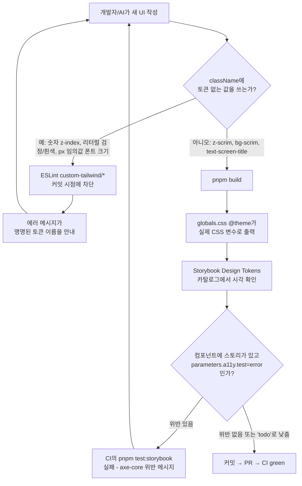
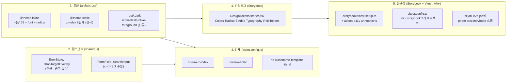

# 디자인 시스템 (토큰 · 컴포넌트 · 강제 규칙)

> **문서 성격**: 독립 기능 문서(서사형)
>
> **대상 독자**: 이 레포 FE의 스타일링 작업을 하는 개발자, 새 컴포넌트를 스타일링할 때
> 참고할 AI 세션.
>
> **읽고 나면**: 색상·반경·z-index·타이포그래피(스케일+역할) 토큰이 어디 정의돼 있고
> 어떻게 확장하는지, ESLint가 어떤 Tailwind className 규칙을 강제하는지, Storybook
> 토큰 카탈로그를 어떻게 보는지, Storybook a11y 게이트가 CI에서 어떻게 도는지 안다.
> spacing 토큰은 왜 없는지, 지금 아는 a11y 위반이 뭐고 왜 아직 안 고쳤는지도 안다.
>
> **마지막 검토**: 2026-09-16

## 1. 쉬운 설명

이 레포는 한글 UI 문자열에 이미 완성된 시스템이 있다 — 모든 문구는
`src/shared/config/texts.ts`의 `TEXTS.*`에 모여 있고, ESLint
`custom-i18n/no-hardcoded-hangul`이 한글을 직접 쓰면 빌드를 막는다. 그래서 문구가
일관된다. 스타일에는 색상 축(`globals.css`)에만 이런 사전이 있었고, 그 외(spacing·
타이포·z-index)에는 없었다 — 그래서 같은 파일 안에서도 페이지 제목이 세 가지 크기로
갈리고, 아이콘 크기 지정이 조용히 무시되는 일이 생겼다.

이 문서가 다루는 것은 그 사전(토큰)을 만들고, 반복되는 UI를 컴포넌트로 묶고,
ESLint로 "고를 수 없게" 강제하고, Storybook에 견본책을 두고, 접근성을 CI로
지키는 다섯 겹의 장치다. 색상은 이미 첫 겹이 있었고(2026-09-13), z-index와 색상
결손(딤 오버레이, destructive 글자색)을 채웠다(같은 날). 타이포그래피는 스케일 층
(t1~t14)과 역할 층(페이지 제목 등 12곳)을 화면 미리보기 승인을 거쳐 뒤이어
채웠다(2026-09-16, §4·§11 참고). 같은 날 Storybook의 a11y addon을 CI에 실제로
배선해 axe-core 검사를 자동화했고, 그 과정에서 2026-09-13부터 있던 진짜 버그
(색상 카탈로그의 잘못된 CSS 변수 참조, §10 참고)도 찾아냈다. spacing만 Tailwind
v4의 구조적 제약 때문에 아직 비어 있다 — 이유는 §11 참고.

## 2. 전제 지식

이 문서는 Tailwind v4의 CSS-first 설정(`@theme` 지시자)과 이 레포의 `cn()`/`cva`
패턴을 이미 안다고 가정한다. 색상·반경 토큰의 전체 표와 다크모드·커서 규칙은 이 문서가
아니라 [`design-tokens` skill](../.claude/skills/design-tokens/SKILL.md)이 정본이다
— 여기서 복제하지 않는다. `tailwind.config.ts`가 왜 사라졌는지의 배경은
[`docs/DECISIONS.md`](DECISIONS.md) 2026-09-13 항목 참고.

## 3. 사용한 도구·기술

- **기능 자체**: Tailwind v4 `@theme inline`/`@theme static` 지시자, CSS 커스텀
  프로퍼티, `class-variance-authority`(cva), `tailwind-merge`(`cn()`)
- **강제**: ESLint 커스텀 룰(외부 플러그인 없이 `eslint.config.js`에 직접 정의 —
  기존 `custom-i18n`/`custom-a11y`/`custom-query-rules`와 같은 이 레포의 관례)
- **검증 도구**: `rg`(ripgrep)로 실측 감사, Storybook decorator, `pnpm build` 산출물
  CSS를 직접 grep해 토큰 반영 여부 확인

## 4. 왜 만들었나

2026-09-13 `rg` 실측 감사 결과:

- z-index가 8단계(10/20/40/50/55/60/70/80)로 21곳에 흩어져 있었고, `Sidebar.tsx`
  드로어 백드롭과 `MobileCommentBar.tsx` 확장 댓글 시트가 값(55)을 공유하는 잠재
  충돌이 있었다.
- `button.tsx`·`badge.tsx`가 `--destructive-foreground` 토큰 없이 흰색 글자를
  하드코딩하고 있었다 — 원인은 죽은 `tailwind.config.ts`가 이 토큰을 참조했지만
  `globals.css`엔 끝내 추가되지 않았기 때문(`docs/DECISIONS.md` 2026-09-13 참고).
- 딤(스크림) 오버레이 12곳이 검정·흰색 리터럴을 직접 썼다 — 팔레트 색(`gray-500` 등)은
  이미 프로덕션 0건이었지만, 이 두 색은 grep 규칙에 안 걸려 지나쳤다.
- `_base/FormField.tsx`가 `cn()` 대신 템플릿 리터럴로 클래스를 조합하는 유일한
  `shared/ui` 컴포넌트였고, 스토리도 유일하게 없었다. `PostCard.tsx`는 보간 없는
  템플릿 리터럴을 14곳에서 습관적으로 쓰고 있었다.
- `SearchInput.tsx`의 `inputVariant` 상수가 `cn()`을 거치지 않아, 호출부가
  `className`을 넘기면 기본 스타일을 통째로 덮어써 버리는 확장성 버그가 있었다.

## 5. 구조

**재사용성(이식 친화적 구조)**: `shared/ui/`는 FSD 레이어 규칙(ESLint
`no-restricted-imports`)이 이미 `entities`/`features`/`widgets`/`pages`/`app`을
import하지 못하게 막아, 구조적으로 도메인 로직과 분리돼 있다. `globals.css`의 토큰 중
`--category`(카테고리 배지)는 link-sphere 도메인 고유값이고, 나머지(z-index 스케일,
반경, 딤 오버레이 등)는 범용이다 — 이번 라운드는 실제 레지스트리 인프라를 만들지
않고, 이 구분만 §4의 표로 남겨 다음 프로젝트를 시작할 때 그대로 추출할 수 있게 했다
(2026-09-13 대화에서 확정, 레지스트리 자체 구축은 범위 밖으로 결정).

## 6. 상태 모델

이 기능은 Zustand 스토어나 React Query 키를 도입하지 않는다 — 상태는 CSS 커스텀
프로퍼티뿐이다. 새로 추가된 네임스페이스:

| 네임스페이스                                                                                | 정의 위치                                                          | 정본                                                                                  |
| ------------------------------------------------------------------------------------------- | ------------------------------------------------------------------ | ------------------------------------------------------------------------------------- |
| `--z-index-*` (8개)                                                                         | `src/app/globals.css`의 `@theme static` 블록                       | [`design-tokens` skill](../.claude/skills/design-tokens/SKILL.md) "z-index 토큰"      |
| `--destructive-foreground`, `--scrim`, `--scrim-foreground`                                 | `src/app/globals.css`의 `:root` (테마 무관, `.dark`에 재정의 없음) | 위와 동일 문서 "주요 색상 토큰" 표                                                    |
| `--text-t1`~`--text-t14` (스케일 층, 2026-09-16 추가)                                       | `src/app/globals.css`의 `@theme static` 블록                       | [`design-tokens` skill](../.claude/skills/design-tokens/SKILL.md) "타이포그래피 토큰" |
| `--text-screen-title`/`section-title`/`subsection-title`/`micro` (역할 층, 2026-09-16 추가) | `src/app/globals.css`의 (static 아닌) `@theme` 블록                | 위와 동일 문서 "타이포그래피 토큰" 표                                                 |

전체 39개 색상 값 자체는 옮겨적지 않는다 — `globals.css`가 SSOT다.

## 7. 운영 파라미터

없음 — 이 기능에 주기·건수·타임아웃 같은 운영 파라미터는 없다.

## 8. 코드 지도와 자주 하는 수정

| 하려는 것                         | 위치                                                                                                           | 방법                                                                                                                                            |
| --------------------------------- | -------------------------------------------------------------------------------------------------------------- | ----------------------------------------------------------------------------------------------------------------------------------------------- |
| 새 z-index 층 추가                | `src/app/globals.css`의 `@theme static` 블록 (§ z-index 주석)                                                  | `--z-index-<name>: <값>` 추가 → `design-tokens` skill 표 갱신 → `DesignTokens.stories.tsx`의 `Z_INDEX_LAYERS` 배열에 항목 추가                  |
| 새 색 토큰 추가                   | `globals.css`의 `:root`/`.dark` + `@theme inline` 매핑                                                         | 값 정의 → `--color-<name>: var(--<name>)` 매핑 추가 → skill 문서 표 갱신                                                                        |
| 새 Tailwind 커스텀 ESLint 룰 추가 | `eslint.config.js`의 `customTailwindRulesPlugin.rules`(정의) + 파일 하단 `custom-tailwind/*` 등록 블록(활성화) | 기존 4개 룰과 같은 패턴(허용목록 없이 `Literal`/`TemplateLiteral` 방문, 정규식 매칭) 따르기                                                     |
| 새 타이포 역할 토큰 추가          | `globals.css`의 (static 아닌) `@theme` 블록                                                                    | `--text-<role>`/`--text-<role>--line-height`(필요시 `--font-weight`) 추가 → 실제 사용처에 클래스 적용 → `design-tokens` skill 역할 토큰 표 갱신 |
| 토큰 카탈로그에 새 섹션 추가      | `src/shared/ui/tokens/DesignTokens.stories.tsx`                                                                | 새 `export const <Name>: Story` 추가(기존 `Colors`/`Radius`/`ZIndex` 참고)                                                                      |
| Storybook에서 다크모드 확인       | `.storybook/preview.tsx`의 툴바 테마 토글                                                                      | 별도 설정 불필요 — 이미 `.dark` 클래스를 토글하도록 연결됨                                                                                      |
| a11y 위반을 로컬에서 확인         | `pnpm test:storybook` (전체) 또는 `pnpm exec vitest run --project=storybook <파일>` (단일 파일)                | 실패 메시지의 axe 규칙 링크(dequeuniversity.com)로 원인 확인 → 고치거나 `parameters.a11y.test: 'todo'` + 사유 주석으로 낮추고 §11 목록에 추가   |
| 새 스토리를 a11y 예외로 낮추기    | 해당 `*.stories.tsx`의 story 객체(또는 파일 전체가 해당하면 `meta`)                                            | `parameters: { a11y: { test: 'todo' } }` 추가 + 이유 주석 + `docs/DESIGN-SYSTEM.md` §11 "a11y 잔여 목록" 표에 행 추가                           |

## 9. 검증 결과

2026-09-13 실측(이 브랜치, 워크트리 `design-system-foundation`):

- `pnpm type-check` — 통과 (0 에러)
- `pnpm lint` — 통과 (0 위반, 신설 룰 3개 포함)
- `pnpm test` — 55개 파일 358개 테스트 전부 통과
- `pnpm format:check` — 통과
- `pnpm build` — 성공. 빌드된 CSS(`dist/assets/index-*.css`)를 직접 grep해 확인:
  - `--z-index-raised:10` ~ `--z-index-popover:80` 8개 모두 정의됨
  - `.z-raised{z-index:var(--z-index-raised)}` 등 8개 유틸리티 클래스 정상 생성
  - `--destructive-foreground:oklch(100% 0 0)`, `--scrim:oklch(0% 0 0)`,
    `--scrim-foreground:oklch(100% 0 0)` 정의됨
  - 기존 숫자 그대로의 raw z-index 리터럴 클래스는 0건(내가 새로 추가한 파일·주석
    기준 — §10 참고)

2026-09-16 실측 (타이포그래피 역할 층 + 12곳 치환, 워크트리
`typography-role-tokens`, PR-1(#108) 위에 스택):

- `pnpm type-check` — 통과 (0 에러)
- `pnpm lint` — 통과 (0 위반, 신설 `no-raw-text-size` 룰 포함). 룰이 실제로 위반을
  잡는지 별도 확인: `text-[13px]`를 임시로 넣어 에러 발생을 확인한 뒤 되돌렸다.
- `pnpm test` — 58개 파일 380개 테스트 전부 통과
- `pnpm build` — 성공. `dist/assets/index-*.css` grep 확인:
  - `--text-screen-title`/`section-title`/`subsection-title`/`micro` 4개 모두
    size·line-height(·`micro` 제외 font-weight)까지 정의됨
  - `.text-screen-title{...}`/`.text-section-title{...}`/`.text-subsection-title{...}`/
    `.text-micro{...}` 유틸리티 4개 모두 정상 생성 — `text-micro`만 font-weight 선언이
    없음(의도대로)
  - 10px 임의값 유틸리티가 여전히 1건 생성됨 — 원인은 §10의 append-only 계획 파일,
    실제 JSX 참조는 0건(화면 영향 없음)

2026-09-16 실측 (CI/skill/Storybook 개선, 워크트리 `typography-scale-tokens`
안 브랜치 `worktree-design-system-ci-fixes`, PR #108·#110 머지 후 신선한 `main`
기준):

- `pnpm type-check`/`pnpm lint`/`pnpm test`/`pnpm format:check`/`pnpm check:docs`
  전부 통과
- `pnpm build` 로컬 실행 — `ci.yml`에 추가한 것과 동일 커맨드가 성공하는지 먼저
  확인
- `pnpm build-storybook` — 신설 `RoleTokens` 스토리 포함 정상 컴파일 확인

2026-09-16 실측 (a11y CI 게이트, 같은 워크트리 안 브랜치 `worktree-a11y-ci-gate`,
PR #108·#110·#111 머지 후 신선한 `main` 기준):

- `pnpm test` — 58개 파일 380개 테스트 전부 통과(unit 프로젝트, 기존과 동일 —
  `vitest.config.ts`를 `projects`로 분리해도 회귀 없음을 확인)
- `pnpm test:storybook` — 스토리 파일 43개, story export 151개(계획이 추정한
  "42개"는 파일 수 기준 오집계, 실제 판정 단위는 export 개수) 전부 통과(exit 0).
  `parameters.a11y.test: 'error'`를 켠 직후 1차 실행에서 14개 실패 확인 → 1건
  수정(아이콘 버튼 `aria-label` 누락), 1건 원인 수정(`AsyncBoundary` 데모의
  raw `red-*` 팔레트를 `--destructive` 토큰으로 교체, 여전히 대비 부족이라 결국
  `'todo'`) → 나머지 12건 `'todo'`로 낮춤(§11 "a11y 잔여 목록" 참고)
- 게이트 실효성 별도 확인: `Icon` 스토리의 `aria-label`을 임시로 제거해
  `pnpm exec vitest run --project=storybook src/shared/ui/atoms/button.stories.tsx`
  실행 → 실패 확인(`button-name` 위반) → 원복 후 재확인(통과) — "걸려 있기만 하고
  안 잡는" 상태가 아님을 실증
- PR을 열어 `pull_request` 트리거(필터 제거 후)가 자동으로 도는지 실측 확인 —
  이전엔 `workflow_dispatch`로만 수동 확인해야 했던 것이 정상 경로로 동작

## 10. 시행착오

**Tailwind 스캐너가 CSS/JS 주석·마크다운 문서도 전부 텍스트로 훑는다.** `globals.css`에
z-index 마이그레이션 배경을 설명하며, 옛 값을 나타내려고 "z" 뒤에 숫자를 붙인 실제
클래스 형태 그대로(예: z 뒤에 10을 붙인 문자열) 주석에 적었더니, `pnpm build` 후 dist
CSS에 그 클래스가 다시 나타났다. Tailwind v4는 JIT 스캐너가 프로젝트 전체 파일을
"코드인지 주석인지" 구분하지 않고 문자열 패턴만 찾기 때문에, 주석 안의 문자열도 유효한
클래스 후보로 인식해 미사용 유틸리티를 생성한 것이다. `eslint.config.js`의 새 룰 설명
주석, `docs/DECISIONS.md`의 배경 설명, 그리고 이 문서 초안 자체에서도 같은 방식으로
같은 문제가 재발했다 — 발견할 때마다 클래스 형태를 그대로 쓰지 않고 풀어서 서술하는
방식으로 고쳤다. 반대로 `CHANGELOG.md`와 `.claude/skills/responsive-ux/SKILL.md`에
이미 있던 과거 서술(옛 z-index 값을 그대로 적은 문장)은 같은 현상을 이미 일으키고
있었지만, 이번 작업 범위 밖의 파일이라 손대지 않았다.

**같은 문제가 이번엔 고칠 수 없는 자리에서 재발했다.** 타이포그래피 역할 토큰 작업
(2026-09-16) 계획 초안에 10px 임의값 클래스를 대상 목록으로 설명하며 그 형태 그대로
적었는데, 그 초안이 `docs/plans/2026-09-16-typography-tokens-a11y-gate.md`로 커밋된
뒤에야 발견했다. 이 파일은 `.claude/CLAUDE.md` §11 규칙상 커밋 후 수정하지 않는
append-only 파일이라(CI가 수정 자체를 막는다) 고칠 수 없다 — `pnpm build` 산출물에
그 유령 유틸리티 클래스가 실제로 생성됨을 확인했다(어떤 컴포넌트도 참조하지 않아
화면 영향은 없음). 같은 문서 초안에서 발견한 `docs/DESIGN-SYSTEM.md`(이 문서, 아직
커밋 전)의 같은 서술은 이번에 고쳤다. 교훈: 계획 초안 단계에서부터 클래스 형태를
풀어 쓰는 습관이 필요하다 — 커밋된 뒤엔 늦다.

**a11y 게이트가 켜지자마자 2026-09-13부터 있던 진짜 버그를 잡았다.** `ColorsCatalog`
(`ColorSwatch`)가 `var(--color-<name>)`(Tailwind가 `@theme inline`용으로 붙이는
접두사 이름)를 인라인 style로 직접 읽었는데, 실측 결과 Tailwind v4의 `@theme inline`은
유틸리티 클래스 생성 시 참조값을 직접 인라인하고, `--color-<name>` 간접 변수 자체는
그 이름이 다른 곳에서 리터럴로 더 쓰이는 극소수(예: `destructive-foreground`/`scrim`/
`scrim-foreground`)만 실제로 `:root`에 남긴다 — `primary-foreground`처럼 대부분의
`-foreground` 변수는 `:root`에 존재하지 않는다. `color`는 상속 속성이라 `var()`가
무효가 되면 조용히 `body`의 `text-foreground`로 폴백돼, 스와치마다 다른 배경 위에
전부 같은 어두운 글자색이 깔리고 있었다(`getComputedStyle`로 실측: 모든 `-foreground`
스팬의 실제 `color`가 하나같이 `--foreground`와 동일했다). 시각적으로는 우연히 크게
어색하지 않아 아무도 눈치채지 못했지만, "primary" 스와치는 대비 1.1:1까지 떨어져
a11y 게이트가 첫 실행에서 바로 잡아냈다. 고침: `--color-<name>` 대신 `:root`/`.dark`에
항상 실존하는 원본 이름(`--<name>`)을 직접 읽도록 `ColorSwatch`를 수정했다(화면상
"primary" 등 일부 스와치의 글자색만 올바르게 바뀌고, 이미 우연히 맞았던 나머지는
그대로다 — 순수 버그 수정이라 별도 승인 없이 반영). `ZIndexCatalog`/`RadiusCatalog`는
`@theme static`/`@theme inline`이라도 실제 사용처가 많아 이 문제가 없음을 확인했다.

## 11. 남은 것

- **타이포그래피 역할 층·화면 치환·a11y CI 게이트 전부 완료**: 2026-09-16
  `docs/plans/2026-09-16-typography-tokens-a11y-gate.md`에서 스케일 층(`--text-t1`~
  `--text-t14`)을 화면 무변경으로 먼저 추가한 뒤, Artifact 미리보기로 사용자 승인을
  받아 역할 토큰(`--text-screen-title`/`section-title`/`subsection-title`/`micro`)과
  h1 5곳·h2 3곳·10px 임의값 4곳 = 12곳 치환을 마쳤다 — line-height가 Tailwind
  기본값과 달랐던 만큼 일부 텍스트의 실제 렌더링이 바뀌었다(`--text-section-title`이
  가장 큰 -4px, 페이지 제목 두께는 semibold로 통일). 머지 직후 감사에서 인프라
  갭 4가지를 추가로 발견해 같은 날 고쳤다 — 역할 토큰이 Storybook 카탈로그에 없던
  것(`RoleTokens` 스토리 신설), `design-tokens` skill의 트리거 메타데이터가
  타이포그래피를 안 다루던 것, `ci.yml`의 `pull_request` 트리거가 base를 `main`으로
  제한해 스택 PR(다른 PR 브랜치를 base로 하는 PR)에서 CI가 자동으로 안 돌던 것
  (실제로 이 라운드의 PR #109가 그 사각지대에 걸려 자동 CI 0건이었다), `pnpm build`가
  CI에 없어 토큰의 CSS 생성 실패를 머지 전에 못 잡던 것. 이어서 계획의 PR-4(a11y
  CI 게이트)도 같은 날 완료했다 — `.storybook/vitest.setup.ts` 신설, `vitest.config.ts`를
  `unit`/`storybook` 2개 프로젝트로 분리, `.storybook/preview.tsx`에
  `parameters.a11y.test: 'error'` 전역 설정, `ci.yml`의 `e2e` job에
  `pnpm test:storybook` 스텝 추가(기존 Playwright 브라우저 설치 재사용, 별도
  job 안 만듦). 계획이 "42개 스토리"라고 추정했던 것은 실측 결과 파일 43개·
  story export 151개였다 — 실제로 `test:'error'`를 켜자 14개 테스트가 실패했고
  (예상보다 관리 가능한 규모), 그중 1건(아이콘 버튼 `aria-label` 누락)만 고치고
  나머지 12건은 색상 토큰 대비 부족(`--muted-foreground`/`--info`/`--category`/
  `--success` 등, 앱 전역에 쓰이는 토큰이라 값 조정은 시각 변경 승인 필요)과
  Radix Select 트리거의 접근 가능한 이름 부재(원인 미상, 추가 조사 필요)로
  `parameters.a11y.test: 'todo'` + 사유 주석으로 낮췄다 — 전체 목록은 아래
  "a11y 잔여 목록" 참고. 이 과정에서 `DesignTokens.stories.tsx`의 `ColorSwatch`가
  2026-09-13부터 갖고 있던 실제 버그(§10 참고)도 우연히 발견해 고쳤다.

### a11y 잔여 목록 (`parameters.a11y.test: 'todo'`)

| 스토리                                              | 원인                                                    | 근본 원인                  |
| --------------------------------------------------- | ------------------------------------------------------- | -------------------------- |
| `DesignTokens.stories.tsx` › Colors                 | `--muted-foreground` 4.34:1                             | 토큰 대비 부족             |
| `kbd.stories.tsx` › Command, Complex Combination    | 〃                                                      | 〃                         |
| `FilterChip.stories.tsx` › Default, Interactive     | 〃                                                      | 〃                         |
| `ScrollToTop.stories.tsx` › Default                 | 〃 (데코레이터 안내문)                                  | 〃                         |
| `FilterChip.stories.tsx` › Active Variants          | `--info` 4.42:1, `--category` 4.47:1                    | 토큰 대비 부족             |
| `MarkdownContent.stories.tsx` › Default             | `--info` 4.42:1 (링크)                                  | 토큰 대비 부족             |
| `FormField.stories.tsx` › With Success Description  | `--success` 3.3:1 (가장 큼)                             | 토큰 대비 부족             |
| `AsyncBoundary.stories.tsx` › Custom Error Fallback | `--destructive` on `/10` 틴트 4:1                       | 토큰 조합 대비 부족        |
| `select.stories.tsx` (메타 전체)                    | `button-name` — combobox 트리거에 접근 가능한 이름 없음 | Radix 내부 구조, 원인 미상 |

색상 토큰 4종(`--muted-foreground`/`--info`/`--category`/`--success`)의 대비를
WCAG AA(4.5:1)까지 올리는 건 앱 전역 시각 변경이라 별도 라운드에서 Artifact
미리보기로 승인받아야 한다(`.claude/CLAUDE.md` §9). Select 이슈는 Radix
`SelectTrigger`가 `SelectValue`의 placeholder를 왜 접근성 트리에서 이름으로
못 잡는지부터 조사해야 한다.

- **spacing 토큰 미도입**: Tailwind v4의 `--spacing`은 `gap-2`·`p-4`·`h-9`·
  `size-4`가 전부 파생되는 단일 배수 변수다. 이 축에 진짜 "허용값만 남기는" 잠금을
  걸려면 `--spacing: initial`이 필요한데, 그러면 591개 className 대부분이 무너진다.
  이번 라운드는 이 레버를 당기지 않았다 — spacing 일관성은 컴포넌트 소유권(예:
  `EmptyState`)과 후속 ESLint 허용목록 룰로 풀 계획이다.
- **화면이 바뀌는 항목들**: 아이콘 9곳의 14px 의도 vs 16px 실제 렌더링 버그
  (`button.tsx`의 CSS 명시도 문제), 페이지 제목·빈 상태 여백 통일, `FilterChip`의
  호버 불일치 버그. 전부 발견됐지만 이번 배치(화면 무변경)에서 의도적으로 제외했다.
- **shadcn 커스텀 레지스트리**: 다른 프로젝트로 토큰·컴포넌트를 이식하는 실제
  인프라는 이번에 만들지 않았다 — §5의 "재사용성" 구분만 남겨뒀다.

## 12. 용어 사전

- **스크림(scrim)**: 모달·드로어·이미지 뷰어 등에서 배경을 어둡게 덮는 오버레이.
  이 레포에서는 `--scrim`/`--scrim-foreground` 토큰으로 표현하며, 실제 딤 정도(투명도)는
  호출부가 `bg-scrim/50` 같은 Tailwind 투명도 수식자로 정한다 — 토큰 자체는 항상
  완전 불투명한 검정/흰색이다.
- **`@theme static`**: Tailwind v4의 `@theme` 옵션 중 하나. 기본(`inline`이 아닌)
  `@theme`는 실제 사용되지 않는 토큰을 빌드 출력에서 제거하는데, `static`을 붙이면
  사용 여부와 무관하게 항상 CSS 변수로 출력된다. Storybook 카탈로그가
  `getComputedStyle`로 항상 읽을 수 있어야 하는 z-index 토큰에 이 옵션을 썼다.

## 13. 관련 문서

- [`design-tokens` skill](../.claude/skills/design-tokens/SKILL.md) — 색상·반경·
  z-index·타이포그래피·커서·다크모드·폰트 토큰의 정본 표
- [`docs/DECISIONS.md`](DECISIONS.md) 2026-09-13 항목 — 죽은 `tailwind.config.ts`
  삭제 배경
- [`docs/plans/2026-09-16-typography-tokens-a11y-gate.md`](plans/2026-09-16-typography-tokens-a11y-gate.md)
  — 타이포그래피 역할 층·화면 치환·a11y CI 게이트 전체 계획
- [`docs/FE-ARCHITECTURE.md`](FE-ARCHITECTURE.md) — FSD 레이어 규칙, `cn()`/cva 패턴
