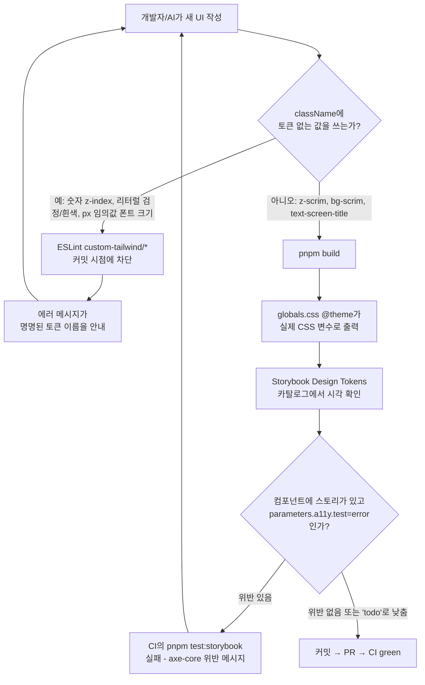
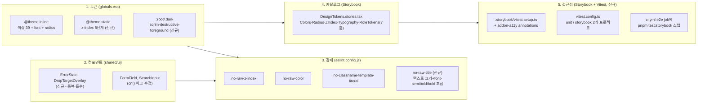

# 디자인 시스템 (토큰 · 컴포넌트 · 강제 규칙)

> **문서 성격**: 독립 기능 문서(서사형)
>
> **대상 독자**: 이 레포 FE의 스타일링 작업을 하는 개발자, 새 컴포넌트를 스타일링할 때
> 참고할 AI 세션.
>
> **읽고 나면**: 색상·반경·z-index·타이포그래피(스케일+역할) 토큰이 어디 정의돼 있고
> 어떻게 확장하는지, ESLint가 어떤 Tailwind className 규칙을 강제하는지, Storybook
> 토큰 카탈로그를 어떻게 보는지, Storybook a11y 게이트가 CI에서 어떻게 도는지 안다.
> spacing 토큰은 왜 없는지, 지금 아는 a11y 위반이 뭐고 왜 아직 안 고쳤는지도 안다.
>
> **마지막 검토**: 2026-09-21

## 1. 쉬운 설명

이 레포는 한글 UI 문자열에 이미 완성된 시스템이 있다 — 모든 문구는
`src/shared/config/texts.ts`의 `TEXTS.*`에 모여 있고, ESLint
`custom-i18n/no-hardcoded-hangul`이 한글을 직접 쓰면 빌드를 막는다. 그래서 문구가
일관된다. 스타일에는 색상 축(`globals.css`)에만 이런 사전이 있었고, 그 외(spacing·
타이포·z-index)에는 없었다 — 그래서 같은 파일 안에서도 페이지 제목이 세 가지 크기로
갈리고, 아이콘 크기 지정이 조용히 무시되는 일이 생겼다.

이 문서가 다루는 것은 그 사전(토큰)을 만들고, 반복되는 UI를 컴포넌트로 묶고,
ESLint로 "고를 수 없게" 강제하고, Storybook에 견본책을 두고, 접근성을 CI로
지키는 다섯 겹의 장치다. 색상은 이미 첫 겹이 있었고(2026-09-13), z-index와 색상
결손(딤 오버레이, destructive 글자색)을 채웠다(같은 날). 타이포그래피는 스케일 층
(t1~t14)과 역할 층(페이지 제목 등 12곳)을 화면 미리보기 승인을 거쳐 뒤이어
채웠다(2026-09-16, §4·§11 참고). 같은 날 Storybook의 a11y addon을 CI에 실제로
배선해 axe-core 검사를 자동화했고, 그 과정에서 2026-09-13부터 있던 진짜 버그
(색상 카탈로그의 잘못된 CSS 변수 참조, §10 참고)도 찾아냈다. spacing만 Tailwind
v4의 구조적 제약 때문에 아직 비어 있다 — 이유는 §11 참고.

## 2. 전제 지식

이 문서는 Tailwind v4의 CSS-first 설정(`@theme` 지시자)과 이 레포의 `cn()`/`cva`
패턴을 이미 안다고 가정한다. 색상·반경 토큰의 전체 표와 다크모드·커서 규칙은 이 문서가
아니라 [`design-tokens` skill](../.claude/skills/design-tokens/SKILL.md)이 정본이다
— 여기서 복제하지 않는다. `tailwind.config.ts`가 왜 사라졌는지의 배경은
[`docs/DECISIONS.md`](DECISIONS.md) 2026-09-13 항목 참고.

## 3. 사용한 도구·기술

- **기능 자체**: Tailwind v4 `@theme inline`/`@theme static` 지시자, CSS 커스텀
  프로퍼티, `class-variance-authority`(cva), `tailwind-merge`(`cn()`)
- **강제**: ESLint 커스텀 룰(외부 플러그인 없이 `eslint.config.js`에 직접 정의 —
  기존 `custom-i18n`/`custom-a11y`/`custom-query-rules`와 같은 이 레포의 관례)
- **검증 도구**: `rg`(ripgrep)로 실측 감사, Storybook decorator, `pnpm build` 산출물
  CSS를 직접 grep해 토큰 반영 여부 확인

## 4. 왜 만들었나

2026-09-13 `rg` 실측 감사 결과:

- z-index가 8단계(10/20/40/50/55/60/70/80)로 21곳에 흩어져 있었고, `Sidebar.tsx`
  드로어 백드롭과 `MobileCommentBar.tsx` 확장 댓글 시트가 값(55)을 공유하는 잠재
  충돌이 있었다.
- `button.tsx`·`badge.tsx`가 `--destructive-foreground` 토큰 없이 흰색 글자를
  하드코딩하고 있었다 — 원인은 죽은 `tailwind.config.ts`가 이 토큰을 참조했지만
  `globals.css`엔 끝내 추가되지 않았기 때문(`docs/DECISIONS.md` 2026-09-13 참고).
- 딤(스크림) 오버레이 12곳이 검정·흰색 리터럴을 직접 썼다 — 팔레트 색(`gray-500` 등)은
  이미 프로덕션 0건이었지만, 이 두 색은 grep 규칙에 안 걸려 지나쳤다.
- `_base/FormField.tsx`가 `cn()` 대신 템플릿 리터럴로 클래스를 조합하는 유일한
  `shared/ui` 컴포넌트였고, 스토리도 유일하게 없었다. `PostCard.tsx`는 보간 없는
  템플릿 리터럴을 14곳에서 습관적으로 쓰고 있었다.
- `SearchInput.tsx`의 `inputVariant` 상수가 `cn()`을 거치지 않아, 호출부가
  `className`을 넘기면 기본 스타일을 통째로 덮어써 버리는 확장성 버그가 있었다.

## 5. 구조

**재사용성(이식 친화적 구조)**: `shared/ui/`는 FSD 레이어 규칙(ESLint
`no-restricted-imports`)이 이미 `entities`/`features`/`widgets`/`pages`/`app`을
import하지 못하게 막아, 구조적으로 도메인 로직과 분리돼 있다. `globals.css`의 토큰 중
`--category`(카테고리 배지)는 link-sphere 도메인 고유값이고, 나머지(z-index 스케일,
반경, 딤 오버레이 등)는 범용이다 — 이번 라운드는 실제 레지스트리 인프라를 만들지
않고, 이 구분만 §4의 표로 남겨 다음 프로젝트를 시작할 때 그대로 추출할 수 있게 했다
(2026-09-13 대화에서 확정, 레지스트리 자체 구축은 범위 밖으로 결정). `--category-1`~`8`
(2026-09-21 추가)도 같은 분류 - 카테고리 개수·id 기반 배정이 link-sphere 고유
비즈니스 규칙이다. `--brand`/`--brand-2`는 반대로 범용에 가깝다 - 다음 프로젝트가
이식할 때는 hue 값만 바꾸면 된다.

## 6. 상태 모델

이 기능은 Zustand 스토어나 React Query 키를 도입하지 않는다 — 상태는 CSS 커스텀
프로퍼티뿐이다. 새로 추가된 네임스페이스:

| 네임스페이스                                                                                | 정의 위치                                                                | 정본                                                                                  |
| ------------------------------------------------------------------------------------------- | ------------------------------------------------------------------------ | ------------------------------------------------------------------------------------- |
| `--z-index-*` (8개)                                                                         | `src/app/globals.css`의 `@theme static` 블록                             | [`design-tokens` skill](../.claude/skills/design-tokens/SKILL.md) "z-index 토큰"      |
| `--destructive-foreground`, `--scrim`, `--scrim-foreground`                                 | `src/app/globals.css`의 `:root` (테마 무관, `.dark`에 재정의 없음)       | 위와 동일 문서 "주요 색상 토큰" 표                                                    |
| `--text-t1`~`--text-t14` (스케일 층, 2026-09-16 추가)                                       | `src/app/globals.css`의 `@theme static` 블록                             | [`design-tokens` skill](../.claude/skills/design-tokens/SKILL.md) "타이포그래피 토큰" |
| `--text-screen-title`/`section-title`/`subsection-title`/`micro` (역할 층, 2026-09-16 추가) | `src/app/globals.css`의 (static 아닌) `@theme` 블록                      | 위와 동일 문서 "타이포그래피 토큰" 표                                                 |
| `--brand`, `--brand-2`, `--brand-foreground` (2026-09-21 추가)                              | `src/app/globals.css`의 `:root`/`.dark`. `--primary`가 이 값을 직접 참조 | [`design-tokens` skill](../.claude/skills/design-tokens/SKILL.md) "주요 색상 토큰" 표 |
| `--category-1`~`--category-8` (+`-foreground`, 2026-09-21 추가)                             | `src/app/globals.css`의 `:root`/`.dark`. `category.id % 8`로 배정        | 위와 동일 문서, `entities/category/config/category.const.ts`                          |
| `--text-detail-title` (역할 층, 2026-09-21 추가)                                            | `src/app/globals.css`의 (static 아닌) `@theme` 블록                      | 위와 동일 문서 "타이포그래피 토큰" 표                                                 |

전체 39개 색상 값 자체는 옮겨적지 않는다 — `globals.css`가 SSOT다.

## 7. 운영 파라미터

없음 — 이 기능에 주기·건수·타임아웃 같은 운영 파라미터는 없다.

## 8. 코드 지도와 자주 하는 수정

| 하려는 것                         | 위치                                                                                                           | 방법                                                                                                                                            |
| --------------------------------- | -------------------------------------------------------------------------------------------------------------- | ----------------------------------------------------------------------------------------------------------------------------------------------- |
| 새 z-index 층 추가                | `src/app/globals.css`의 `@theme static` 블록 (§ z-index 주석)                                                  | `--z-index-<name>: <값>` 추가 → `design-tokens` skill 표 갱신 → `DesignTokens.stories.tsx`의 `Z_INDEX_LAYERS` 배열에 항목 추가                  |
| 새 색 토큰 추가                   | `globals.css`의 `:root`/`.dark` + `@theme inline` 매핑                                                         | 값 정의 → `--color-<name>: var(--<name>)` 매핑 추가 → skill 문서 표 갱신                                                                        |
| 새 Tailwind 커스텀 ESLint 룰 추가 | `eslint.config.js`의 `customTailwindRulesPlugin.rules`(정의) + 파일 하단 `custom-tailwind/*` 등록 블록(활성화) | 기존 4개 룰과 같은 패턴(허용목록 없이 `Literal`/`TemplateLiteral` 방문, 정규식 매칭) 따르기                                                     |
| 새 타이포 역할 토큰 추가          | `globals.css`의 (static 아닌) `@theme` 블록                                                                    | `--text-<role>`/`--text-<role>--line-height`(필요시 `--font-weight`) 추가 → 실제 사용처에 클래스 적용 → `design-tokens` skill 역할 토큰 표 갱신 |
| 토큰 카탈로그에 새 섹션 추가      | `src/shared/ui/tokens/DesignTokens.stories.tsx`                                                                | 새 `export const <Name>: Story` 추가(기존 `Colors`/`Radius`/`ZIndex` 참고)                                                                      |
| Storybook에서 다크모드 확인       | `.storybook/preview.tsx`의 툴바 테마 토글                                                                      | 별도 설정 불필요 — 이미 `.dark` 클래스를 토글하도록 연결됨                                                                                      |
| a11y 위반을 로컬에서 확인         | `pnpm test:storybook` (전체) 또는 `pnpm exec vitest run --project=storybook <파일>` (단일 파일)                | 실패 메시지의 axe 규칙 링크(dequeuniversity.com)로 원인 확인 → 고치거나 `parameters.a11y.test: 'todo'` + 사유 주석으로 낮추고 §11 목록에 추가   |
| 새 스토리를 a11y 예외로 낮추기    | 해당 `*.stories.tsx`의 story 객체(또는 파일 전체가 해당하면 `meta`)                                            | `parameters: { a11y: { test: 'todo' } }` 추가 + 이유 주석 + `docs/DESIGN-SYSTEM.md` §11 "a11y 잔여 목록" 표에 행 추가                           |

## 9. 검증 결과

2026-09-13 실측(이 브랜치, 워크트리 `design-system-foundation`):

- `pnpm type-check` — 통과 (0 에러)
- `pnpm lint` — 통과 (0 위반, 신설 룰 3개 포함)
- `pnpm test` — 55개 파일 358개 테스트 전부 통과
- `pnpm format:check` — 통과
- `pnpm build` — 성공. 빌드된 CSS(`dist/assets/index-*.css`)를 직접 grep해 확인:
  - `--z-index-raised:10` ~ `--z-index-popover:80` 8개 모두 정의됨
  - `.z-raised{z-index:var(--z-index-raised)}` 등 8개 유틸리티 클래스 정상 생성
  - `--destructive-foreground:oklch(100% 0 0)`, `--scrim:oklch(0% 0 0)`,
    `--scrim-foreground:oklch(100% 0 0)` 정의됨
  - 기존 숫자 그대로의 raw z-index 리터럴 클래스는 0건(내가 새로 추가한 파일·주석
    기준 — §10 참고)

2026-09-16 실측 (타이포그래피 역할 층 + 12곳 치환, 워크트리
`typography-role-tokens`, PR-1(#108) 위에 스택):

- `pnpm type-check` — 통과 (0 에러)
- `pnpm lint` — 통과 (0 위반, 신설 `no-raw-text-size` 룰 포함). 룰이 실제로 위반을
  잡는지 별도 확인: `text-[13px]`를 임시로 넣어 에러 발생을 확인한 뒤 되돌렸다.
- `pnpm test` — 58개 파일 380개 테스트 전부 통과
- `pnpm build` — 성공. `dist/assets/index-*.css` grep 확인:
  - `--text-screen-title`/`section-title`/`subsection-title`/`micro` 4개 모두
    size·line-height(·`micro` 제외 font-weight)까지 정의됨
  - `.text-screen-title{...}`/`.text-section-title{...}`/`.text-subsection-title{...}`/
    `.text-micro{...}` 유틸리티 4개 모두 정상 생성 — `text-micro`만 font-weight 선언이
    없음(의도대로)
  - 10px 임의값 유틸리티가 여전히 1건 생성됨 — 원인은 §10의 append-only 계획 파일,
    실제 JSX 참조는 0건(화면 영향 없음)

2026-09-16 실측 (CI/skill/Storybook 개선, 워크트리 `typography-scale-tokens`
안 브랜치 `worktree-design-system-ci-fixes`, PR #108·#110 머지 후 신선한 `main`
기준):

- `pnpm type-check`/`pnpm lint`/`pnpm test`/`pnpm format:check`/`pnpm check:docs`
  전부 통과
- `pnpm build` 로컬 실행 — `ci.yml`에 추가한 것과 동일 커맨드가 성공하는지 먼저
  확인
- `pnpm build-storybook` — 신설 `RoleTokens` 스토리 포함 정상 컴파일 확인

2026-09-16 실측 (a11y CI 게이트, 같은 워크트리 안 브랜치 `worktree-a11y-ci-gate`,
PR #108·#110·#111 머지 후 신선한 `main` 기준):

- `pnpm test` — 58개 파일 380개 테스트 전부 통과(unit 프로젝트, 기존과 동일 —
  `vitest.config.ts`를 `projects`로 분리해도 회귀 없음을 확인)
- `pnpm test:storybook` — 스토리 파일 43개, story export 151개(계획이 추정한
  "42개"는 파일 수 기준 오집계, 실제 판정 단위는 export 개수) 전부 통과(exit 0).
  `parameters.a11y.test: 'error'`를 켠 직후 1차 실행에서 14개 실패 확인 → 1건
  수정(아이콘 버튼 `aria-label` 누락), 1건 원인 수정(`AsyncBoundary` 데모의
  raw `red-*` 팔레트를 `--destructive` 토큰으로 교체, 여전히 대비 부족이라 결국
  `'todo'`) → 나머지 12건 `'todo'`로 낮춤(§11 "a11y 잔여 목록" 참고)
- 게이트 실효성 별도 확인: `Icon` 스토리의 `aria-label`을 임시로 제거해
  `pnpm exec vitest run --project=storybook src/shared/ui/atoms/button.stories.tsx`
  실행 → 실패 확인(`button-name` 위반) → 원복 후 재확인(통과) — "걸려 있기만 하고
  안 잡는" 상태가 아님을 실증
- PR을 열어 `pull_request` 트리거(필터 제거 후)가 자동으로 도는지 실측 확인 —
  이전엔 `workflow_dispatch`로만 수동 확인해야 했던 것이 정상 경로로 동작

2026-09-16 실측 (색상 토큰 대비 개선, 같은 워크트리 안 브랜치
`worktree-color-contrast-fix`, PR #108·#110·#111·#112 머지 후 신선한 `main` 기준):

- `pnpm type-check`/`pnpm lint`/`pnpm test`(unit, 380개) 전부 통과
- `pnpm test:storybook` — 151개 전부 통과, `'todo'`였던 7건이 실제로 통과해서
  통과한 것인지 확인하려고 각 파일에서 `parameters.a11y.test: 'todo'`를 지운 뒤
  재실행 → 그대로 151/151 통과(기존엔 `'todo'`라 검사 자체가 스킵됐던 것과 달리
  이번엔 실제 axe 검사를 통과)
- `AsyncBoundary.stories.tsx`·`select.stories.tsx`의 `'todo'`는 이 4개 토큰과
  무관해 그대로 유지, 실제로 손대지 않았음을 diff로 확인

2026-09-16 실측 (남은 a11y `'todo'` 2건 해소, 같은 워크트리 안 브랜치
`worktree-select-a11y-fix`, PR #108·#110·#111·#112·#113 머지 후 신선한 `main`
기준):

- `pnpm exec vitest run --project=storybook src/shared/ui/atoms/select.stories.tsx`
  단독 실행으로 `aria-label` 추가 직후 3/3 통과 확인
- `pnpm test:storybook` 전체 재실행 — 151개 전부 통과
- `rg "a11y.*test.*todo" src/shared/ui/` — 0건, `parameters.a11y.test: 'todo'`가
  코드베이스에서 완전히 사라짐을 확인
- `pnpm type-check`/`pnpm lint`/`pnpm test`(unit, 380개, `texts.test.ts` 톤 검사
  포함) 전부 통과

2026-09-16 실측 (제목+두께 조합 ESLint 룰 도입 + 역할 토큰 2종 추가, 같은
워크트리 안 브랜치 `worktree-title-weight-tokens`, PR #108·#110·#111·#112·
#113·#114·#115 머지 후 신선한 `main` 기준):

- `git grep`으로 `origin/main` 기준 "text-{크기} font-{semibold|bold}" 조합
  22곳 전수 조사(당초 계획의 "26곳"은 이미 정리된 12곳을 포함한 이전 실측치 —
  재조사 결과 22곳으로 확인) — 브랜드 워드마크 4·공용 UI 프리미티브 1·포스트
  제목 1·그룹 라벨 5·콘텐츠 메타데이터 2·배지 2·마크다운 헤딩 4·Storybook 3
  로 분류
- Artifact 미리보기(https://claude.ai/artifact/HFhnbYBfxXTYL2HmbQQY12)로 시각
  변경이 있는 4개 그룹(Dialog 제목·포스트 카드 제목·폴더 그룹 라벨 4곳·최근
  검색 라벨)을 사용자에게 보여주고 전체 반영 승인받음
- `custom-tailwind/no-raw-title` 룰 추가 직후 `pnpm lint` 1차 실행에서 계획에
  없던 `ErrorLayout.tsx:20`(에러 페이지 60px 타이틀)이 추가로 걸림 — 기존
  역할 토큰 어느 것과도 안 맞고 Artifact 승인 범위 밖이라 이번엔 예외 주석만
  달고 별도 라운드로 미룸(§11 참고)
- `pnpm type-check`/`pnpm lint`(신설 `no-raw-title` 포함 0위반)/`pnpm test`
  (380개)/`pnpm test:storybook`(151개)/`pnpm format:check`/`pnpm check:docs`/
  `pnpm build` 전부 통과
- 브라우저 검증(테스트 계정 `tester_new_999`, 실제 화면):
  - Dialog: 폴더 삭제 확인창에서 `.text-section-title` 요소를 직접 조회해
    18px/24px/600 확인(이전 leading-none 18px/18px에서 줄간격만 넓어짐)
  - 포스트 카드 제목: `/post` 데스크톱(1280px)에서 18px/24px/700, 모바일(390px)
    에서 14px/19px/700 확인 — `md:text-t6` 반응형 전환이 실제로 동작함
  - 폴더 그룹 라벨: `/bookmark` 사이드바(FolderTree)의 "내 폴더" 라벨에서
    12px/16px/600 확인. `BookmarkFolderSelectModal.tsx`는 같은
    `text-group-label` 토큰을 쓰므로 별도 실측 없이 동일 계산값으로 간주 —
    실제로 열어 확인하지는 않았다
  - 최근 검색 라벨: `/post`에서 검색 토글 → "최근 검색" 라벨에서 12px/16px/600
    확인(원래 14px에서 실제로 줄어듦)
  - 녹화: `.claude/browser-artifacts/verify-2026-09-16-title-weight-tokens.webm`

2026-09-16 실측 (`ErrorLayout.tsx`의 남은 예외 주석을 `text-display-title`
역할 토큰으로 교체, 같은 워크트리 안 브랜치 `worktree-error-layout-title-token`,
PR #108·#110·#111·#112·#113·#114·#115·#116 머지 후 신선한 `main` 기준):

- `/this-route-does-not-exist`(404 페이지) 실측 — 교체 전 `getComputedStyle`로
  `text-6xl font-bold`가 60px/60px(line-height 1)/700임을 먼저 확인한 뒤,
  `text-display-title`도 동일하게 60px/60px/700로 렌더됨을 재확인 — 계산값
  완전 동일
- 실제 타이틀 콘텐츠도 함께 확인: `pages/404`·`pages/403`·`AppErrorFallback`·
  `AsyncBoundary`의 `DefaultErrorFallback`은 전부 문장형 메시지("페이지를
  찾을 수 없어요" 등)를 넘기고, `pages/500`만 리터럴 `"500"`을 쓴다 —
  스토리 데모("404"/"403" 같은 짧은 코드)와는 다른데도 60px에서 줄바꿈 없이
  깔끔하게 렌더됨을 화면으로 확인, 값을 바꿀 이유가 없다고 판단
- `pnpm type-check`/`pnpm lint`/`pnpm test`(380개)/`pnpm test:storybook`
  (151개)/`pnpm format:check`/`pnpm check:docs`/`pnpm build` 전부 통과

2026-09-16 실측 (`EmptyState` 컴포넌트 신설, 같은 워크트리 안 브랜치
`worktree-empty-state-spacing`, PR #108·#110·#111·#112·#113·#114·#115·#116·
#117·#118 머지 후 신선한 `main` 기준):

- 스크린샷 전/후 비교(`RecentSearchPanel.tsx`의 빈 검색 화면, py-8→py-12
  1차 시도)를 사용자에게 보여준 결과 "이전(32px)이 더 낫다, 대신 통일은
  하자"는 피드백을 받아 방향을 바꿨다 — 다수(4곳)가 쓰던 `py-12`가 아니라
  소수(1곳)가 쓰던 `py-8`을 표준으로 채택
- `EmptyState`를 `py-8`로 변경한 뒤 `/post?q=<존재하지 않는 검색어>`(빈 검색
  결과, 실제 화면)를 스크린샷으로 재확인 — 테두리·배경 있는 변형도 32px에서
  문제없이 렌더됨을 확인
- `pnpm exec vitest run --project=storybook EmptyState.stories.tsx` 2/2 통과 →
  `pnpm test:storybook` 전체 재실행 44개 파일·153개 테스트(신규 스토리 2개
  포함) 전부 통과
- `pnpm type-check`/`pnpm lint`/`pnpm test`(380개)/`pnpm format:check`/
  `pnpm check:docs`/`pnpm build` 전부 통과

2026-09-17 실측 (`PostCard.tsx` 조회수 gap·`PostListSearch.tsx` 필터 카드
정리, 같은 워크트리 안 브랜치 `worktree-postcard-spacing-fixes`, PR #108~
#119 머지 후 신선한 `main` 기준):

- 처음 제시했던 "PostCard 안 gap 4종 불일치"는 재검토 결과 과장이었다 —
  헤더 메타 텍스트 줄(86번째 줄)·헤더 아이콘 버튼 묶음(111번째 줄)은 조회수
  행과 아예 다른 UI 영역이라 비교 대상이 아니었고, 실제로 같은 역할(아이콘+
  숫자 액션)인데 다른 건 조회수 행(`gap-1`) 하나뿐이었다 — 범위를 4곳에서
  1곳으로 좁혔다
- 로딩 스피너 래퍼 패딩도 재검토 결과 제외 — 실측해보니 다른 값을 쓰는
  2곳(모달·사이드바)이 좁은 임베드 공간이라 밀도 차이가 의도에 가까웠다
- 브라우저 실측(`/post`, 데스크톱 1280px): 조회수 행 gap이 4px→6px로
  커져 댓글 수 버튼과 동일해짐을 확인. 필터 카드는 `Card` 컴포넌트 전환 후
  padding 16px·radius 16px·border 1px·box-shadow·배경색 전부 이전과 동일한
  계산값으로 렌더됨을 확인(순수 컴포넌트 재사용 전환)
- `pnpm type-check`/`pnpm lint`/`pnpm test`(380개)/`pnpm format:check`/
  `pnpm check:docs`/`pnpm build` 전부 통과

2026-09-17 실측 (`MyCommentCard.tsx` 패딩을 `p-3`으로 통일, 같은 워크트리 안
브랜치 `worktree-mycommentcard-padding`, PR #108~#120 머지 후 신선한 `main`
기준):

- Artifact 미리보기(`p-4` vs `p-3` before/after)를 사용자에게 보여주고
  승인받은 뒤 반영
- `/my/comments`(실제 화면, 로그인 필요) 실측: `getComputedStyle`로 카드
  padding이 12px(`p-3`)로 렌더됨을 확인, 스크린샷 기록
  (`.claude/browser-artifacts/verify-2026-09-17-mycommentcard-padding.webm`)
- `MyCommentCardSkeleton.tsx`도 같은 값으로 맞춤 — 그 파일 자체 주석이 이미
  "MyCommentCard와 동일해야 레이아웃이 안 튄다"고 명시하고 있어, 실제 카드만
  바꾸면 로딩→렌더 전환에서 시프트가 생기는 걸 미리 막았다
- `pnpm type-check`/`pnpm lint`/`pnpm test`(380개)/`pnpm format:check`/
  `pnpm check:docs`/`pnpm build` 전부 통과

## 10. 시행착오

**Tailwind 스캐너가 CSS/JS 주석·마크다운 문서도 전부 텍스트로 훑는다.** `globals.css`에
z-index 마이그레이션 배경을 설명하며, 옛 값을 나타내려고 "z" 뒤에 숫자를 붙인 실제
클래스 형태 그대로(예: z 뒤에 10을 붙인 문자열) 주석에 적었더니, `pnpm build` 후 dist
CSS에 그 클래스가 다시 나타났다. Tailwind v4는 JIT 스캐너가 프로젝트 전체 파일을
"코드인지 주석인지" 구분하지 않고 문자열 패턴만 찾기 때문에, 주석 안의 문자열도 유효한
클래스 후보로 인식해 미사용 유틸리티를 생성한 것이다. `eslint.config.js`의 새 룰 설명
주석, `docs/DECISIONS.md`의 배경 설명, 그리고 이 문서 초안 자체에서도 같은 방식으로
같은 문제가 재발했다 — 발견할 때마다 클래스 형태를 그대로 쓰지 않고 풀어서 서술하는
방식으로 고쳤다. 반대로 `CHANGELOG.md`와 `.claude/skills/responsive-ux/SKILL.md`에
이미 있던 과거 서술(옛 z-index 값을 그대로 적은 문장)은 같은 현상을 이미 일으키고
있었지만, 이번 작업 범위 밖의 파일이라 손대지 않았다.

**같은 문제가 이번엔 고칠 수 없는 자리에서 재발했다.** 타이포그래피 역할 토큰 작업
(2026-09-16) 계획 초안에 10px 임의값 클래스를 대상 목록으로 설명하며 그 형태 그대로
적었는데, 그 초안이 `docs/plans/2026-09-16-typography-tokens-a11y-gate.md`로 커밋된
뒤에야 발견했다. 이 파일은 `.claude/CLAUDE.md` §11 규칙상 커밋 후 수정하지 않는
append-only 파일이라(CI가 수정 자체를 막는다) 고칠 수 없다 — `pnpm build` 산출물에
그 유령 유틸리티 클래스가 실제로 생성됨을 확인했다(어떤 컴포넌트도 참조하지 않아
화면 영향은 없음). 같은 문서 초안에서 발견한 `docs/DESIGN-SYSTEM.md`(이 문서, 아직
커밋 전)의 같은 서술은 이번에 고쳤다. 교훈: 계획 초안 단계에서부터 클래스 형태를
풀어 쓰는 습관이 필요하다 — 커밋된 뒤엔 늦다.

**a11y 게이트가 켜지자마자 2026-09-13부터 있던 진짜 버그를 잡았다.** `ColorsCatalog`
(`ColorSwatch`)가 `var(--color-<name>)`(Tailwind가 `@theme inline`용으로 붙이는
접두사 이름)를 인라인 style로 직접 읽었는데, 실측 결과 Tailwind v4의 `@theme inline`은
유틸리티 클래스 생성 시 참조값을 직접 인라인하고, `--color-<name>` 간접 변수 자체는
그 이름이 다른 곳에서 리터럴로 더 쓰이는 극소수(예: `destructive-foreground`/`scrim`/
`scrim-foreground`)만 실제로 `:root`에 남긴다 — `primary-foreground`처럼 대부분의
`-foreground` 변수는 `:root`에 존재하지 않는다. `color`는 상속 속성이라 `var()`가
무효가 되면 조용히 `body`의 `text-foreground`로 폴백돼, 스와치마다 다른 배경 위에
전부 같은 어두운 글자색이 깔리고 있었다(`getComputedStyle`로 실측: 모든 `-foreground`
스팬의 실제 `color`가 하나같이 `--foreground`와 동일했다). 시각적으로는 우연히 크게
어색하지 않아 아무도 눈치채지 못했지만, "primary" 스와치는 대비 1.1:1까지 떨어져
a11y 게이트가 첫 실행에서 바로 잡아냈다. 고침: `--color-<name>` 대신 `:root`/`.dark`에
항상 실존하는 원본 이름(`--<name>`)을 직접 읽도록 `ColorSwatch`를 수정했다(화면상
"primary" 등 일부 스와치의 글자색만 올바르게 바뀌고, 이미 우연히 맞았던 나머지는
그대로다 — 순수 버그 수정이라 별도 승인 없이 반영). `ZIndexCatalog`/`RadiusCatalog`는
`@theme static`/`@theme inline`이라도 실제 사용처가 많아 이 문제가 없음을 확인했다.

**"남은 것" 목록이 갱신되지 않아 이미 고친 버그를 "남았다"고 이틀 넘게 잘못 적어뒀다.**
2026-09-13 라운드가 §11에 "화면이 바뀌는 항목들(아이콘 14px→16px 버그·제목/빈상태
여백·`FilterChip` 호버)은 발견만 하고 이번엔 제외한다"고 적었는데, 실제로는 바로
다음 날(2026-09-14) PR #85에서 전부 고쳐졌다. 그런데 이 절이 갱신되지 않아, 이번
세션(2026-09-16)이 타이포 작업 계획을 쓰면서 그 문구를 그대로 `docs/plans/
2026-09-16-typography-tokens-a11y-gate.md`(append-only, 이미 커밋됨)에도 옮겨 적어
오류를 한 번 더 반복했다. 사용자가 "제외된 버그부터 고치자"고 요청한 뒤 `git log
--all -S "activeClassName"`/`-S "h-3.5"`로 실제 히스토리를 대조하고서야 발견했다 —
PR을 닫을 때 그 PR이 해소한 문제를 언급하는 다른 문서(§11 같은)를 갱신하는 절차가
없었던 게 근본 원인이다.

**"전부 해소됨"이라고 적은 PR #85의 `FilterChip` 호버 수정이 실은 라이트 모드
한정이었다.** 당시 방식은 `Button`의 ghost variant가 주는 호버 클래스를 호출부
`activeClassName`의 `hover:bg-X hover:text-X-foreground`로 twMerge를 이용해
덮어쓰는 것이었다. `hover:bg-*`는 같은 modifier 그룹이라 지워지지만, ghost가
함께 주는 `dark:hover:bg-accent/50`은 modifier 그룹이 달라(`dark:hover:` vs
`hover:`) twMerge가 못 지우고 그대로 남았다 — CSS 특이성도 `@custom-variant dark
(&:is(.dark *))`가 얹는 `:is(.dark *)` 한 단계 때문에 다크 쪽이 이겨서, 다크모드
활성 칩이 호버 시 흰 배경(`--primary`)에서 회색(`accent/50`)으로 덮이고 글자
(`--primary-foreground`, 검정)와 거의 구분이 안 됐다. 같은 구조의 버그가
`variant="ghost"` + `className`으로 `hover:bg-*`를 덮는 다른 8곳(`FolderTree`
칩, `PostCard` AI 요약 토글·댓글 수 버튼, `BookmarkFolderSelectModal` 삭제 행,
`LikePostButton`, `CommentForm` 프리뷰 토글, `RecentSearchPanel`, `UserAvatar`)
에도 있었다. 2026-09-21, 덮어쓰기로 지우는 대신 호버 스타일이 애초에 없는
`none` variant를 `button.tsx`에 추가해 9곳 전부 해소했다 — `FilterChip`과
`FolderTree`의 비활성/비선택 분기처럼 호버 배경의 출처가 ghost뿐이던 곳은
같은 커밋에 `hover:bg-accent`/`hover:text-foreground`를 명시로 보완했다.

## 11. 남은 것

- **타이포그래피 역할 층·화면 치환·a11y CI 게이트 전부 완료**: 2026-09-16
  `docs/plans/2026-09-16-typography-tokens-a11y-gate.md`에서 스케일 층(`--text-t1`~
  `--text-t14`)을 화면 무변경으로 먼저 추가한 뒤, Artifact 미리보기로 사용자 승인을
  받아 역할 토큰(`--text-screen-title`/`section-title`/`subsection-title`/`micro`)과
  h1 5곳·h2 3곳·10px 임의값 4곳 = 12곳 치환을 마쳤다 — line-height가 Tailwind
  기본값과 달랐던 만큼 일부 텍스트의 실제 렌더링이 바뀌었다(`--text-section-title`이
  가장 큰 -4px, 페이지 제목 두께는 semibold로 통일). 머지 직후 감사에서 인프라
  갭 4가지를 추가로 발견해 같은 날 고쳤다 — 역할 토큰이 Storybook 카탈로그에 없던
  것(`RoleTokens` 스토리 신설), `design-tokens` skill의 트리거 메타데이터가
  타이포그래피를 안 다루던 것, `ci.yml`의 `pull_request` 트리거가 base를 `main`으로
  제한해 스택 PR(다른 PR 브랜치를 base로 하는 PR)에서 CI가 자동으로 안 돌던 것
  (실제로 이 라운드의 PR #109가 그 사각지대에 걸려 자동 CI 0건이었다), `pnpm build`가
  CI에 없어 토큰의 CSS 생성 실패를 머지 전에 못 잡던 것. 이어서 계획의 PR-4(a11y
  CI 게이트)도 같은 날 완료했다 — `.storybook/vitest.setup.ts` 신설, `vitest.config.ts`를
  `unit`/`storybook` 2개 프로젝트로 분리, `.storybook/preview.tsx`에
  `parameters.a11y.test: 'error'` 전역 설정, `ci.yml`의 `e2e` job에
  `pnpm test:storybook` 스텝 추가(기존 Playwright 브라우저 설치 재사용, 별도
  job 안 만듦). 계획이 "42개 스토리"라고 추정했던 것은 실측 결과 파일 43개·
  story export 151개였다 — 실제로 `test:'error'`를 켜자 14개 테스트가 실패했고
  (예상보다 관리 가능한 규모), 그중 1건(아이콘 버튼 `aria-label` 누락)만 고치고
  나머지 12건은 색상 토큰 대비 부족(`--muted-foreground`/`--info`/`--category`/
  `--success` 등, 앱 전역에 쓰이는 토큰이라 값 조정은 시각 변경 승인 필요)과
  Radix Select 트리거의 접근 가능한 이름 부재(원인 미상, 추가 조사 필요)로
  `parameters.a11y.test: 'todo'` + 사유 주석으로 낮췄다 — 전체 목록은 아래
  "a11y 잔여 목록" 참고. 이 과정에서 `DesignTokens.stories.tsx`의 `ColorSwatch`가
  2026-09-13부터 갖고 있던 실제 버그(§10 참고)도 우연히 발견해 고쳤다.

### a11y 잔여 목록 (`parameters.a11y.test: 'todo'`) — 전부 해소됨

2026-09-16 같은 날 세 라운드에 걸쳐 14건 전부 해소했다. `parameters.a11y.test:
'todo'`는 이제 코드베이스에 0건이다(`rg "a11y.*test.*todo" src/shared/ui/`로
확인).

- **색상 토큰 4종 대비 부족 (7건)**: `--muted-foreground`/`--info`/`--category`/
  `--success`가 원인이던 `DesignTokens`(Colors)·`kbd`(Command, Complex
  Combination)·`FilterChip`(Default, Interactive, Active Variants)·
  `ScrollToTop`·`MarkdownContent`·`FormField`(With Success Description) —
  Artifact 미리보기로 사용자 승인을 받아 `globals.css` 라이트 모드 값(명도만
  조정, 색상·채도 유지)을 전부 4.60:1 이상으로 올렸다(아래 §"색상 토큰 대비
  개선" 참고).
- **`select.stories.tsx`의 `button-name` (3건)**: 원인을 실제로 조사한 결과 —
  `role="combobox"`는 ARIA 스펙상 "name from content"를 지원하지 않는 역할이라
  (버튼과 달리) 화면에 보이는 placeholder/값 텍스트를 접근성 이름으로 자동
  인식하지 않는다. `SelectTrigger`에 `aria-label`이 필요했다. 스토리 3개
  전부와 **실제 앱의 유일한 실사용처**(`BookmarkPage.tsx`의 정렬 Select
  2곳)에도 같은 수정을 적용했다 — 조사해보니 스토리에만 있던 문제가 아니라
  실제 화면에도 있던 진짜 접근성 버그였다.
- **`AsyncBoundary.stories.tsx`의 `/10` 틴트 조합 (1건)**: `--destructive`
  자체는 흰 배경 위에서 4.76:1로 충분하지만, `/10` 틴트 배경 위에서는 4:1로
  떨어졌다 — 틴트를 걷어내고 일반 배경 위 테두리로 바꿔 해결(데모 전용이라
  화면 영향 없음).

### 색상 토큰 대비 개선 (2026-09-16, 위 목록의 후속 라운드)

Storybook a11y 게이트가 실측한 4개 토큰의 라이트 모드 대비 미달을
[Artifact 미리보기](https://claude.ai/artifact/UfsZXFcvR1CXPQY5o5sjiB)로
사용자에게 보여주고 승인받아 고쳤다. OKLCH→sRGB 변환 후 WCAG 상대 휘도 공식으로
직접 계산해, 색상(H)·채도(C)는 그대로 두고 명도(L)만 낮춰 4.60:1(반올림 오차
여유 포함)을 넘기는 최소값을 찾았다. 다크 모드 값은 전부 7:1~9.4:1로 이미
통과라 손대지 않았다(직접 계산 확인).

| 토큰                 | 라이트 L      | 비고                                                                                                        |
| -------------------- | ------------- | ----------------------------------------------------------------------------------------------------------- |
| `--muted-foreground` | 0.556 → 0.542 | `#737373`→`#6f6f6f`, 육안 구분 거의 안 됨                                                                   |
| `--info`             | 0.585 → 0.575 | `#226eff`→`#1e6aff`, 육안 구분 거의 안 됨                                                                   |
| `--category`         | 0.606 → 0.597 | `#8d4fff`→`#8a4cff`, 육안 구분 거의 안 됨                                                                   |
| `--success`          | 0.627 → 0.543 | `#2ba321`→`#008900`, **유일하게 눈에 띄게 진해짐**(원래 3.29:1로 가장 크게 미달했던 만큼 조정 폭도 가장 큼) |

- **spacing 토큰 — 축 자체는 여전히 미도입, 반복 패턴은 컴포넌트로 하나씩
  해소 중(2026-09-16~17)**: Tailwind v4의 `--spacing`은 `gap-2`·`p-4`·`h-9`·
  `size-4`가 전부 파생되는 단일 배수 변수라, 색상/z-index와 같은 "CSS 커스텀
  프로퍼티 + `no-raw-*` 룰" 해법이 안 맞는다 — `--spacing: initial`로 잠그면
  591개 className이 무너진다. 게다가 raw 이스케이프(`p-[…]`류) 자체가 이미
  0건이라 "하드코딩 색상"에 해당하는 문제도 없다. 실제 문제는 같은 의미의
  UI를 여러 곳이 각자 구현하며 서로 다른 숫자를 고른 것 — `EmptyState`(신규,
  `ErrorState`와 대칭 구조)로 빈 상태 문구 패턴 5곳을, 이어서 `PostCard.tsx`
  안 조회수 gap(`gap-1` → `gap-1 md:gap-1.5`, 같은 파일 안 다른 액션 버튼과
  통일)과 `PostListSearch.tsx`의 필터 카드(공용 `Card` 재사용, raw div
  재구현 정리)를 고쳤다.
  - **로딩 스피너 래퍼 패딩(재검토 결과 버그 아님으로 판단)**: `py-10`
    (`BookmarkFolderSelectModal.tsx`, 모달 내부)·`py-4`(`FolderTree.tsx`,
    좁은 사이드바)는 `py-12`(`BookmarkPostList.tsx`/`MobileFolderList.tsx`,
    전체 화면 본문 영역)와 다르지만, 다시 읽어보니 **맥락(좁은 임베드 공간 vs
    본문 영역)이 실제로 달라 의도된 밀도 차이일 가능성이 높다** — 처음엔
    "2곳 불일치"라고 단정했다가 재조사 후 "버그로 확신할 수 없다"로 정정,
    손대지 않기로 했다.
  - **카드 패딩 — `p-3`으로 통일(2026-09-17)**: `PostCard`·
    `MobileFolderList` 폴더 카드는 이미 `p-3`였고, `MyCommentCard`만
    `p-4`였다. [Artifact 미리보기](https://claude.ai/artifact/B2V5ovgE93iggx8WqEYRoe)로
    실제 댓글 카드가 `p-3`에서 어떻게 보이는지 확인받은 뒤 반영했다 —
    레이아웃 시프트 방지를 위해 `MyCommentCardSkeleton.tsx`의 패딩도
    함께 맞췄다(그 파일 자체의 주석이 "MyCommentCard와 동일하게 맞춰야
    한다"고 이미 명시하고 있었다).
  - **리스트 행 패딩(4종)**: 사용자 요청으로 이번엔 그대로 둔다 — 모달
    (`px-4 py-2.5`)·모바일 검색(`px-4 py-3`)·모바일 폴더 고정 행
    (`px-4 py-3.5`)·데스크톱 사이드바(`px-3 py-2`) 4가지 맥락이 각자
    다르다고 판단, 미착수 상태 유지.
- **화면이 바뀌는 항목들 — 전부 해소됨(2026-09-14, PR #85)**: 아이콘 9곳의 14px
  의도 vs 16px 실제 렌더링 버그(`button.tsx`의 CSS 명시도 문제), 페이지 제목·빈
  상태 여백 통일, `FilterChip`의 호버 불일치 버그 — 이 절이 2026-09-13에 "발견만
  하고 제외"로 적어둔 뒤 갱신되지 않았는데, 실제로는 하루 뒤 PR #85에서 전부
  고쳐졌다(브라우저 검증 포함, 변경 내용은 그 PR의 커밋 메시지 참고). **단,
  `FilterChip` 호버 수정은 라이트 모드 한정이었다** — 다크모드는 2026-09-21에
  별도로 해소됐다(§10의 "전부 해소됨이라고 적은 PR #85의 `FilterChip` 호버 수정이
  실은 라이트 모드 한정이었다" 문단 참고). 같은 구조의 버그를 가진 ghost 버튼
  8곳도 이때 함께 고쳤다.
- **shadcn 커스텀 레지스트리**: 다른 프로젝트로 토큰·컴포넌트를 이식하는 실제
  인프라는 이번에 만들지 않았다 — §5의 "재사용성" 구분만 남겨뒀다.

### 제목+두께 조합 ESLint 룰 (2026-09-16)

`text-{크기} font-{semibold|bold}` 조합을 잡는 `custom-tailwind/no-raw-title`
룰을 도입하고, 실측된 22곳 중 시각 변경이 필요한 4개 그룹(Dialog 제목·포스트
카드 제목·폴더 그룹 라벨 4곳·최근 검색 라벨)을 새 역할 토큰(`text-card-title`/
`text-group-label`)으로 전환했다(Artifact 승인,
https://claude.ai/artifact/HFhnbYBfxXTYL2HmbQQY12). 나머지 15곳(브랜드
워드마크·배지·마크다운 헤딩·외부 링크 메타데이터)은 제목이 아니라는 이유를
남긴 `eslint-disable-next-line` 예외 주석으로 처리했다.

- **`ErrorLayout.tsx:20`의 60px 에러 페이지 타이틀 — 해소됨(2026-09-16 후속
  라운드)**: 룰 도입 직후 처음 걸린 곳인데, 계획했던 22곳 조사(당시
  `text-4xl`까지만 스캔)에 없던 사각지대였다 — 기존 6개 역할 토큰 어디에도
  안 맞고(가장 큰 screen-title도 20px), SEED 스케일의 t13/t14(40px/48px,
  "sm 이상 권장" 대형 제목용)와도 정확히 안 맞았다. 실제 렌더링(404 페이지,
  브라우저 실측)을 확인한 결과 60px 자체는 시각적으로 문제없는 의도된
  스타일이었다 — `pages/*`가 넘기는 실제 타이틀이 스토리 데모("404" 같은
  짧은 코드)와 달리 전부 문장형 메시지("페이지를 찾을 수 없어요" 등)라는
  점도 함께 확인했지만, 60px에서 줄바꿈 없이 깔끔하게 렌더됐다. 값을 바꿀
  이유가 없어 새 역할 토큰 `text-display-title`(60px/60px/bold)을
  `text-6xl font-bold`의 기존 계산값 그대로 신설했다 — group-label과 같은
  "이름만 붙이는 순수 정리"라 별도 Artifact 승인 없이 반영했다.

## 12. 용어 사전

- **스크림(scrim)**: 모달·드로어·이미지 뷰어 등에서 배경을 어둡게 덮는 오버레이.
  이 레포에서는 `--scrim`/`--scrim-foreground` 토큰으로 표현하며, 실제 딤 정도(투명도)는
  호출부가 `bg-scrim/50` 같은 Tailwind 투명도 수식자로 정한다 — 토큰 자체는 항상
  완전 불투명한 검정/흰색이다.
- **`@theme static`**: Tailwind v4의 `@theme` 옵션 중 하나. 기본(`inline`이 아닌)
  `@theme`는 실제 사용되지 않는 토큰을 빌드 출력에서 제거하는데, `static`을 붙이면
  사용 여부와 무관하게 항상 CSS 변수로 출력된다. Storybook 카탈로그가
  `getComputedStyle`로 항상 읽을 수 있어야 하는 z-index 토큰에 이 옵션을 썼다.

## 13. 관련 문서

- [`design-tokens` skill](../.claude/skills/design-tokens/SKILL.md) — 색상·반경·
  z-index·타이포그래피·커서·다크모드·폰트 토큰의 정본 표
- [`docs/DECISIONS.md`](DECISIONS.md) 2026-09-13 항목 — 죽은 `tailwind.config.ts`
  삭제 배경
- [`docs/plans/2026-09-16-typography-tokens-a11y-gate.md`](plans/2026-09-16-typography-tokens-a11y-gate.md)
  — 타이포그래피 역할 층·화면 치환·a11y CI 게이트 전체 계획
- [`docs/FE-ARCHITECTURE.md`](FE-ARCHITECTURE.md) — FSD 레이어 규칙, `cn()`/cva 패턴
