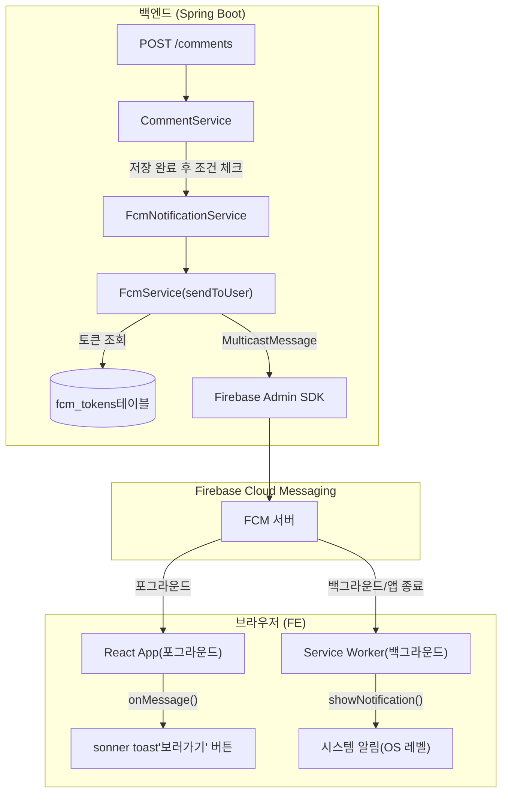
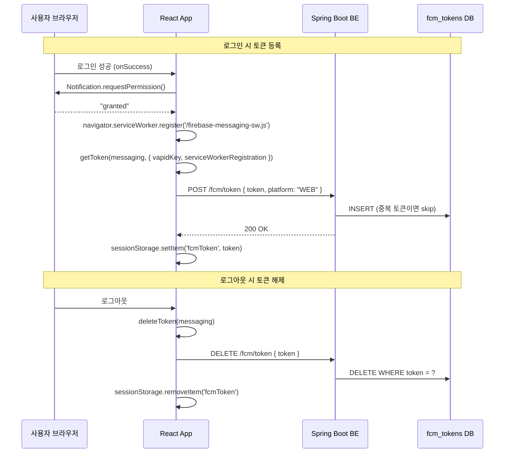
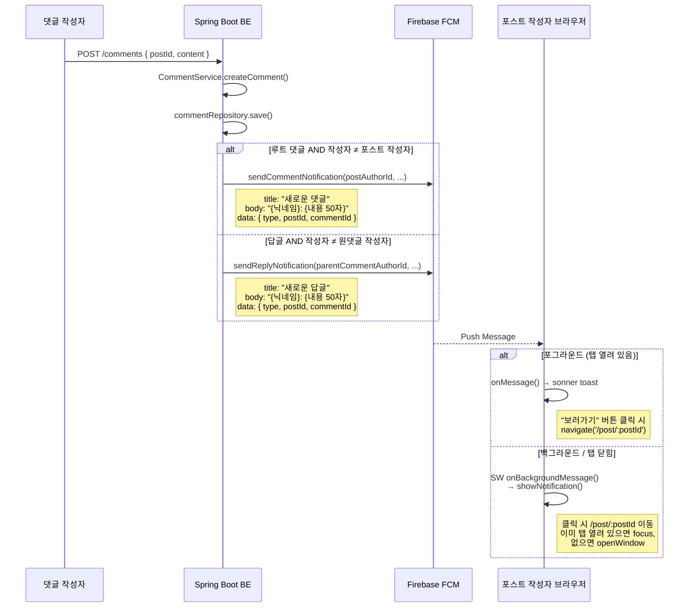

# FCM 푸시 알림 구현 가이드

댓글·답글 작성 시 포스트 작성자 또는 원댓글 작성자에게 FCM(Firebase Cloud Messaging) 푸시 알림을 전송하는 기능의 전체 구현 내역과 운영 중 마주친 삽질 기록을 담은 문서입니다.

> **관련 커밋**
>
> - FE: `eddc49b feat: 댓글, 답글 FCM 푸시 알림 기능 추가`
> - FE: `d476605 fix: SW 파일 압축 제외 / no-cache 배포 / mkcert CI 조건부 실행`
> - BE: `a746636 feat: 댓글, 답글 FCM 푸시 알림 기능 추가`

---

## 목차

1. [전체 아키텍처](#1-전체-아키텍처)
2. [FCM 토큰 라이프사이클](#2-fcm-토큰-라이프사이클)
3. [알림 발송 흐름 (댓글 → 수신)](#3-알림-발송-흐름-댓글--수신)
4. [FE 구현 상세](#4-fe-구현-상세)
5. [BE 구현 상세](#5-be-구현-상세)
6. [배포 설정](#6-배포-설정)
7. [삽질 기록 (Lessons Learned)](#7-삽질-기록-lessons-learned)
8. [알려진 한계 및 개선 포인트](#8-알려진-한계-및-개선-포인트)

---

## 1. 전체 아키텍처



---

## 2. FCM 토큰 라이프사이클



---

## 3. 알림 발송 흐름 (댓글 → 수신)



---

## 4. FE 구현 상세

### 4-1. 파일 구조

```
src/shared/lib/firebase/
├── firebase.ts                  # Firebase 앱 초기화 + messaging 인스턴스
├── fcm.ts                       # 토큰 등록·해제 함수
└── useFcmForegroundMessage.ts   # 포그라운드 메시지 수신 훅

public/
└── firebase-messaging-sw.js     # Service Worker (백그라운드 수신)
```

### 4-2. Firebase 앱 초기화 (`firebase.ts`)

```typescript
// 중복 초기화 방지 패턴
const app = getApps().length === 0 ? initializeApp(firebaseConfig) : getApp();

// Service Worker를 지원하지 않는 환경(SSR, 구형 브라우저)에서 안전하게 null 처리
let messaging: Messaging | null = null;
if (typeof window !== 'undefined' && 'serviceWorker' in navigator) {
  messaging = getMessaging(app);
}
```

> **왜 `null` 체크를 하나?**
> `getMessaging()`은 브라우저 전용 API입니다. SSR 환경이나 Service Worker를 미지원하는 브라우저에서 호출하면 런타임 에러가 발생합니다. `messaging`이 `null`인 경우 이후 모든 FCM 함수가 early return하여 조용히 skip합니다.

### 4-3. FCM 토큰 등록·해제 (`fcm.ts`)

**토큰 등록 (`requestAndRegisterFcmToken`)**

로그인 성공 직후 `auth.queries.ts`의 `onSuccess`에서 호출됩니다.

```typescript
export async function requestAndRegisterFcmToken(): Promise<void> {
  if (!messaging) return;

  const permission = await Notification.requestPermission();
  if (permission !== 'granted') return;

  const token = await getToken(messaging, {
    vapidKey: VAPID_KEY,
    serviceWorkerRegistration: await navigator.serviceWorker.register('/firebase-messaging-sw.js'),
  });

  if (!token) return;
  await registerTokenToServer(token);
}
```

`registerTokenToServer` 내부에서는 `sessionStorage`에 토큰을 캐싱해 **동일 세션에서 중복 서버 요청을 방지**합니다.

```typescript
async function registerTokenToServer(token: string): Promise<void> {
  if (sessionStorage.getItem('fcmToken') === token) return; // 중복 방지
  // ...POST /fcm/token...
  sessionStorage.setItem('fcmToken', token);
}
```

**토큰 해제 (`unregisterFcmToken`)**

로그아웃 직전에 호출됩니다. Firebase SDK의 `deleteToken()` + 서버 `DELETE /fcm/token`을 순서대로 호출합니다.

```typescript
export async function unregisterFcmToken(): Promise<void> {
  const { deleteToken } = await import('firebase/messaging'); // 지연 임포트
  const deleted = await deleteToken(messaging);
  if (deleted) {
    const storedToken = sessionStorage.getItem('fcmToken');
    if (storedToken) {
      await deleteTokenFromServer(storedToken);
      sessionStorage.removeItem('fcmToken');
    }
  }
}
```

### 4-4. 포그라운드 메시지 수신 (`useFcmForegroundMessage.ts`)

앱이 포그라운드(탭 활성화)일 때 FCM 메시지를 받으면 Service Worker 대신 앱 레벨 `onMessage()`가 처리합니다.

```typescript
export function useFcmForegroundMessage() {
  const navigate = useNavigate();

  useEffect(() => {
    if (!messaging) return;

    const unsubscribe = onMessage(messaging, (payload) => {
      const title = payload.notification?.title ?? '새로운 알림';
      const body = payload.notification?.body ?? '';
      const postId = payload.data?.postId;

      toast(title, {
        description: body,
        ...(postId && {
          action: { label: '보러가기', onClick: () => navigate(`/post/${postId}`) },
          closeButton: false,
        }),
      });
    });

    return unsubscribe; // cleanup
  }, [navigate]);
}
```

이 훅은 `RootLayout`에서 최상단에 마운트하여 앱 전체에서 단 한 번만 구독합니다.

```typescript
// src/app/routes/layouts/RootLayout.tsx
export function RootLayout() {
  useFcmForegroundMessage();
  return ( <><ScrollRestoration /><Outlet /></> );
}
```

### 4-5. 백그라운드 메시지 수신 (`public/firebase-messaging-sw.js`)

Service Worker는 Vite의 빌드 파이프라인 바깥에 있는 `public/` 폴더에 위치합니다. `import.meta.env`를 사용할 수 없으므로 Firebase config 값을 직접 하드코딩합니다.

> **Firebase 프론트엔드 Config는 공개해도 안전합니다.**
> `apiKey`, `projectId` 등 프론트엔드용 Firebase 설정값은 클라이언트가 Firebase 서비스에 접근할 수 있도록 Firebase가 공개적으로 발급하는 식별자입니다. 실제 보안은 Firebase Security Rules와 서버의 Admin SDK 서비스 계정 키로 관리합니다.

```javascript
// compat 버전을 importScripts로 로드 (ES Module 불가)
importScripts('https://www.gstatic.com/firebasejs/11.0.0/firebase-app-compat.js');
importScripts('https://www.gstatic.com/firebasejs/11.0.0/firebase-messaging-compat.js');

firebase.initializeApp({
  /* config 하드코딩 */
});
const messaging = firebase.messaging();

messaging.onBackgroundMessage((payload) => {
  const { title, body } = payload.notification ?? {};
  self.registration.showNotification(title ?? '새로운 알림', {
    body,
    icon: '/favicons/android-chrome-192x192.png',
    data: payload.data,
    tag: payload.data?.type ?? 'notification',
  });
});

// 알림 클릭 → 해당 포스트 페이지로 이동
self.addEventListener('notificationclick', (event) => {
  event.notification.close();
  const postId = event.notification.data?.postId;
  const targetUrl = postId ? `${self.location.origin}/post/${postId}` : self.location.origin;

  event.waitUntil(
    clients.matchAll({ type: 'window', includeUncontrolled: true }).then((clientList) => {
      for (const client of clientList) {
        if (client.url.startsWith(self.location.origin) && 'focus' in client) {
          client.navigate(targetUrl);
          return client.focus(); // 이미 탭이 열려 있으면 포커스
        }
      }
      return clients.openWindow(targetUrl); // 탭이 없으면 새 탭
    })
  );
});
```

---

## 5. BE 구현 상세

### 5-1. 파일 구조

```
src/main/kotlin/com/example/linksphere/
├── infra/fcm/
│   ├── FcmConfig.kt              # Firebase Admin SDK 초기화
│   ├── FcmService.kt             # sendToUser() - 실제 FCM 발송
│   ├── FcmNotificationService.kt # 알림 타입별 메시지 조립
│   ├── FcmTokenController.kt     # POST/DELETE /fcm/token
│   ├── FcmTokenService.kt        # 토큰 CRUD 비즈니스 로직
│   ├── FcmTokenRepository.kt     # JPA Repository
│   ├── FcmTokenDTO.kt            # Request DTO
│   └── TableFcmToken.kt          # fcm_tokens 엔티티
└── domain/comment/
    └── CommentService.kt         # 댓글/답글 저장 후 알림 트리거
```

### 5-2. Firebase Admin SDK 초기화 (`FcmConfig.kt`)

```kotlin
@Configuration
class FcmConfig(
    private val resourceLoader: ResourceLoader,
    @Value("\${firebase.service-account-key-path}") private val keyPath: String
) {
    @PostConstruct
    fun initialize() {
        if (FirebaseApp.getApps().isNotEmpty()) return // 중복 초기화 방지

        val resource = resourceLoader.getResource(keyPath)
        if (!resource.exists()) {
            logger.warn("[FCM] firebase-service-account.json not found — FCM disabled")
            return // 파일 없으면 조용히 skip (로컬 개발 편의)
        }

        FirebaseApp.initializeApp(
            FirebaseOptions.builder()
                .setCredentials(GoogleCredentials.fromStream(resource.inputStream))
                .build()
        )
    }
}
```

`application.yml`에서 경로를 설정합니다:

```yaml
firebase:
  service-account-key-path: classpath:firebase-service-account.json
```

> **서비스 계정 키 파일 관리**: `firebase-service-account.json`은 `.gitignore`에 추가하고 환경별로 별도 관리해야 합니다. CI/CD에서는 GitHub Secrets 또는 AWS Secrets Manager를 통해 런타임에 주입합니다.

### 5-3. DB 스키마 (`TableFcmToken.kt`)

```kotlin
@Entity
@Table(name = "fcm_tokens")
class TableFcmToken(
    @Id val id: UUID = UUID.randomUUID(),
    @Column(name = "user_id", nullable = false) val userId: UUID,
    @Column(name = "token", nullable = false, unique = true, columnDefinition = "text") val token: String,
    @Column(name = "platform", nullable = false, length = 10) val platform: String = "WEB",
    val createdAt: LocalDateTime = LocalDateTime.now(),
    val updatedAt: LocalDateTime = LocalDateTime.now()
)
```

- `token`에 `UNIQUE` 제약을 걸어 동일 토큰의 중복 저장을 DB 레벨에서 방지합니다.
- `platform`은 `WEB` / `ANDROID` / `IOS`를 고려한 확장 가능 설계입니다. 현재는 WEB만 사용합니다.

### 5-4. FCM 발송 (`FcmService.kt`)

```kotlin
@Transactional
fun sendToUser(userId: UUID, title: String, body: String, data: Map<String, String> = emptyMap()) {
    if (FirebaseApp.getApps().isEmpty()) {
        logger.warn("[FCM] Firebase not initialized — skipping")
        return
    }

    val tokens = fcmTokenService.getTokensByUserId(userId)
    if (tokens.isEmpty()) return

    val message = MulticastMessage.builder()
        .setNotification(Notification.builder().setTitle(title).setBody(body).build())
        .putAllData(data)
        .addAllTokens(tokens)
        .build()

    val response = FirebaseMessaging.getInstance().sendEachForMulticast(message)

    // 만료/무효 토큰 자동 정리
    if (response.failureCount > 0) {
        response.responses.zip(tokens)
            .filter { (resp, _) -> !resp.isSuccessful && isInvalidTokenError(resp.exception) }
            .map { (_, token) -> token }
            .forEach { fcmTokenRepository.deleteByToken(it) }
    }
}
```

`sendEachForMulticast`는 최대 500개 토큰(한 유저의 멀티 디바이스)에 동시 발송합니다. 응답의 실패 항목 중 `UNREGISTERED` / `INVALID_ARGUMENT` 에러 코드는 만료된 토큰이므로 자동으로 삭제합니다.

### 5-5. 알림 타입별 메시지 조립 (`FcmNotificationService.kt`)

```kotlin
@Service
class FcmNotificationService(private val fcmService: FcmService) {

    fun sendCommentNotification(postAuthorId: UUID, commenterNickname: String,
                                 commentContent: String, postId: UUID, commentId: UUID) {
        fcmService.sendToUser(
            userId = postAuthorId,
            title = "새로운 댓글",
            body = "$commenterNickname: $commentContent",
            data = mapOf("type" to "COMMENT", "postId" to postId.toString(), "commentId" to commentId.toString())
        )
    }

    fun sendReplyNotification(parentCommentAuthorId: UUID, replierNickname: String,
                               replyContent: String, postId: UUID, commentId: UUID) {
        fcmService.sendToUser(
            userId = parentCommentAuthorId,
            title = "새로운 답글",
            body = "$replierNickname: $replyContent",
            data = mapOf("type" to "REPLY", "postId" to postId.toString(), "commentId" to commentId.toString())
        )
    }
}
```

`data` 맵에 `postId`를 담아 FE에서 클릭 시 해당 포스트로 딥링크할 수 있게 합니다.

### 5-6. 댓글 저장 후 알림 트리거 (`CommentService.kt`)

```kotlin
val saved = commentRepository.save(comment)

// 루트 댓글이고, 포스트 작성자 ≠ 댓글 작성자인 경우에만 알림
if (parentId == null && post.userId != userId) {
    fcmNotificationService.sendCommentNotification(
        postAuthorId = post.userId,
        commenterNickname = member.nickname ?: "누군가",
        commentContent = finalContent.take(50),
        postId = postId,
        commentId = saved.id
    )
}
```

```kotlin
val saved = commentRepository.save(comment)

// 답글이고, 원댓글 작성자 ≠ 답글 작성자인 경우에만 알림
if (parent.userId != userId) {
    fcmNotificationService.sendReplyNotification(
        parentCommentAuthorId = parent.userId,
        replierNickname = member.nickname ?: "누군가",
        replyContent = finalContent.take(50),
        postId = saved.postId,
        commentId = saved.id
    )
}
```

**알림을 보내지 않는 경우:**

- 자기 포스트에 자기가 댓글 → 자기 자신에게 알림 없음 (`post.userId != userId`)
- 자기 댓글에 자기가 답글 → 자기 자신에게 알림 없음 (`parent.userId != userId`)
- 답글(대댓글)에 달리는 대대댓글 → 최대 depth 1 제한으로 원천 차단

---

## 6. 배포 설정

### 6-1. FE 환경변수

| 변수                                | 설명                                                                     |
| ----------------------------------- | ------------------------------------------------------------------------ |
| `VITE_FIREBASE_API_KEY`             | Firebase 프로젝트 API 키                                                 |
| `VITE_FIREBASE_AUTH_DOMAIN`         | Firebase Auth 도메인                                                     |
| `VITE_FIREBASE_PROJECT_ID`          | Firebase 프로젝트 ID                                                     |
| `VITE_FIREBASE_MESSAGING_SENDER_ID` | FCM Sender ID                                                            |
| `VITE_FIREBASE_APP_ID`              | Firebase App ID                                                          |
| `VITE_FIREBASE_VAPID_KEY`           | Web Push VAPID 키 (Firebase Console > Cloud Messaging > Web Push 인증서) |

GitHub Actions에서는 `secrets.*`로 주입합니다 (`.github/workflows/deploy.yml` 참고).

### 6-2. BE 환경변수 / 설정

```yaml
# application.yml
firebase:
  service-account-key-path: classpath:firebase-service-account.json
```

`firebase-service-account.json`은 Firebase Console > 프로젝트 설정 > 서비스 계정 > 새 비공개 키 생성에서 발급받습니다.

### 6-3. Service Worker S3 배포 설정

Service Worker 파일은 반드시 아래 조건을 지켜야 합니다:

```yaml
# .github/workflows/deploy.yml

# SW 파일은 no-cache + text/javascript 로 개별 업로드
- name: Upload to S3
  run: |
    aws s3 cp dist/firebase-messaging-sw.js s3://${{ secrets.S3_BUCKET_NAME }}/firebase-messaging-sw.js \
      --cache-control "no-cache, no-store, must-revalidate" \
      --content-type "text/javascript"

    aws s3 sync dist/ s3://${{ secrets.S3_BUCKET_NAME }} --delete \
      --exclude "firebase-messaging-sw.js"
```

**왜 이렇게 하나?** → [7-1 삽질 기록](#7-1-sw-파일-gz-압축으로-mime-타입-불일치) 참고

---

## 7. 삽질 기록 (Lessons Learned)

### 7-1. SW 파일 `.gz` 압축으로 MIME 타입 불일치

**증상:** 로컬에서는 정상 동작하지만 배포 환경에서 Service Worker 등록이 차단됨.

```
Failed to register a ServiceWorker for scope ... with script ...
The script has an unsupported MIME type ('application/gzip').
```

**원인:** `vite-plugin-compression`이 `public/` 폴더에서 복사된 `firebase-messaging-sw.js`까지 압축해서 `dist/firebase-messaging-sw.js.gz`를 생성했습니다. S3/CloudFront 설정에 따라 브라우저가 `.gz` 버전을 응답받으면 `Content-Type: application/gzip`이 되어 Service Worker 등록이 차단됩니다.

**해결:** `vite.config.ts`에서 해당 파일을 압축 필터에서 제외합니다.

```typescript
compression({
  algorithm: 'gzip',
  ext: '.gz',
  // firebase-messaging-sw.js는 SW 특성상 압축 제외
  filter: /^(?!.*firebase-messaging-sw).*\.(js|css|html|json|svg)$/,
}),
```

---

### 7-2. CloudFront 캐싱으로 SW 갱신 안 됨

**증상:** SW 파일을 수정해서 배포했는데 브라우저가 계속 이전 버전의 SW를 사용함.

**원인:** CloudFront가 `firebase-messaging-sw.js`를 기본 캐싱 정책으로 캐싱하고 있었습니다. Service Worker는 브라우저가 주기적으로 서버와 파일을 비교해 갱신 여부를 판단하는데, `Cache-Control: max-age` 가 설정되어 있으면 서버 요청 자체를 생략합니다.

**해결:** `deploy.yml`에서 SW 파일을 `--cache-control "no-cache, no-store, must-revalidate"` 옵션으로 개별 업로드하고, 나머지 파일 `sync`에서는 해당 파일을 `--exclude`로 제외합니다. ([6-3 배포 설정](#6-3-service-worker-s3-배포-설정) 참고)

---

### 7-3. CI 환경에서 `mkcert()` 빌드 실패

**증상:** GitHub Actions 빌드가 느려지거나 간헐적으로 실패함.

**원인:** `vite.config.ts`에서 `mkcert()` 플러그인이 `mode` 조건 없이 항상 실행되었습니다. `ubuntu-latest` CI 환경에는 `mkcert` 바이너리가 없어서 플러그인이 자동 설치를 시도하면서 빌드가 지연 또는 실패했습니다.

**해결:** `mode === 'localhost'`일 때만 활성화합니다.

```typescript
mode === 'localhost' && mkcert(),
```

---

### 7-4. Service Worker에서 `import.meta.env` 사용 불가

**증상:** `public/firebase-messaging-sw.js`에서 환경변수를 읽으려 했더니 `undefined` 반환.

**원인:** Service Worker 파일은 Vite의 빌드 파이프라인 외부(`public/` 폴더)에 있기 때문에 `import.meta.env`가 동작하지 않습니다. Vite는 `public/` 폴더의 파일을 변환 없이 그대로 복사합니다.

**해결 방법 (현재 채택):** Firebase 프론트엔드 Config 값은 원래 공개되어도 안전한 값이므로 SW 파일에 직접 하드코딩합니다. (파일 상단 주석에 이 사실을 명시)

**대안 (미채택):** Vite 플러그인을 사용해 빌드 타임에 환경변수를 SW 파일에 주입하는 방법이 있지만 설정이 복잡해서 채택하지 않았습니다.

---

### 7-5. 포그라운드 메시지가 자동으로 시스템 알림을 띄우지 않음

**증상:** 앱이 포그라운드(탭 활성화)일 때 FCM 메시지를 받았는데 아무것도 표시되지 않음.

**원인:** FCM은 앱이 포그라운드일 때 자동으로 시스템 알림을 띄우지 않습니다. 포그라운드 메시지는 Service Worker가 아닌 앱 레벨의 `onMessage()` 핸들러로만 전달됩니다. 핸들러를 등록하지 않으면 메시지가 그냥 소실됩니다.

**해결:** `useFcmForegroundMessage` 훅에서 `onMessage()`로 구독하고 sonner `toast()`로 직접 표시합니다. RootLayout에서 최상단에 마운트하여 앱 전체에서 항상 구독 상태를 유지합니다.

---

### 7-6. 로그인 직후 토큰 등록 시 `accessToken`이 없는 경우

**증상:** 로그인 후 FCM 토큰 서버 등록이 가끔 401로 실패.

**원인:** `requestAndRegisterFcmToken()`은 `onSuccess` 콜백에서 호출되는데, 이 시점에 Zustand `auth.store`의 `accessToken`이 아직 세팅되기 전인 경우가 있었습니다.

**해결:** `onSuccess` 콜백에서 `setAuth(data.accessToken)` 를 먼저 호출한 후 `requestAndRegisterFcmToken()`을 호출하도록 순서를 보장합니다. `fcm.ts` 내부의 `getAccessTokenFromStore()`는 React 컴포넌트 외부에서 Zustand `getState()`를 직접 호출하므로 React 렌더링 사이클과 무관하게 최신 상태를 읽습니다.

```typescript
// auth.queries.ts onSuccess 순서가 중요
onSuccess: (data) => {
  setAuth(data.accessToken);           // 1. 먼저 스토어에 세팅
  void requestAndRegisterFcmToken();   // 2. 그다음 토큰 등록
},
```

---

## 8. 알려진 한계 및 개선 포인트

### 8-1. FCM 발송이 댓글 저장 트랜잭션 내에서 동기 실행

현재 `CommentService.createComment()`의 `@Transactional` 범위 안에서 FCM 발송이 동기적으로 실행됩니다.

```
[트랜잭션 시작]
  → DB 저장
  → FCM 네트워크 요청 (동기 블로킹)
[트랜잭션 종료]
→ HTTP 응답 반환
```

Firebase 서버가 느리거나 일시 장애가 발생하면 댓글 저장 응답 자체가 지연됩니다.

**개선안:** Spring `@Async` 또는 `ApplicationEventPublisher`를 사용해 알림 발송을 비동기로 분리합니다.

```kotlin
// 개선 예시
@TransactionalEventListener(phase = TransactionPhase.AFTER_COMMIT)
fun onCommentCreated(event: CommentCreatedEvent) {
    fcmNotificationService.sendCommentNotification(...)
}
```

### 8-2. `DELETE /fcm/token` 인증 미적용

현재 토큰 삭제 엔드포인트는 인증 없이 토큰 값만 알면 누구든 삭제할 수 있습니다.

```kotlin
@DeleteMapping("/token")
fun deleteToken(@Valid @RequestBody request: DeleteFcmTokenRequest): ResponseEntity<Void> {
    fcmTokenService.deleteToken(request.token)  // ⚠️ Authentication 파라미터 없음
    return ResponseEntity.ok().build()
}
```

FCM 토큰은 추측하기 어려운 긴 문자열이므로 실질적인 위험은 낮지만, 원칙적으로는 `Authentication` 파라미터를 추가해 본인 토큰만 삭제 가능하도록 보완하는 것이 바람직합니다.

### 8-3. 알림 본문 50자 truncation에 `...` 없음

```kotlin
commentContent = finalContent.take(50)
```

내용이 정확히 50자에서 잘리면 문장이 어색하게 끊깁니다.

**개선안:**

```kotlin
commentContent = finalContent.take(50).let { if (it.length == 50) "$it…" else it }
```

### 8-4. `TableFcmToken.updatedAt` 자동 갱신 없음

현재 `updatedAt`은 엔티티 생성 시점에만 설정되고 `@PreUpdate`가 없어 갱신되지 않습니다. 현재 구현은 토큰 만료 시 삭제 후 재등록하는 방식이라 큰 문제는 아니지만, 이후 토큰 갱신 로직 추가 시 주의가 필요합니다.
