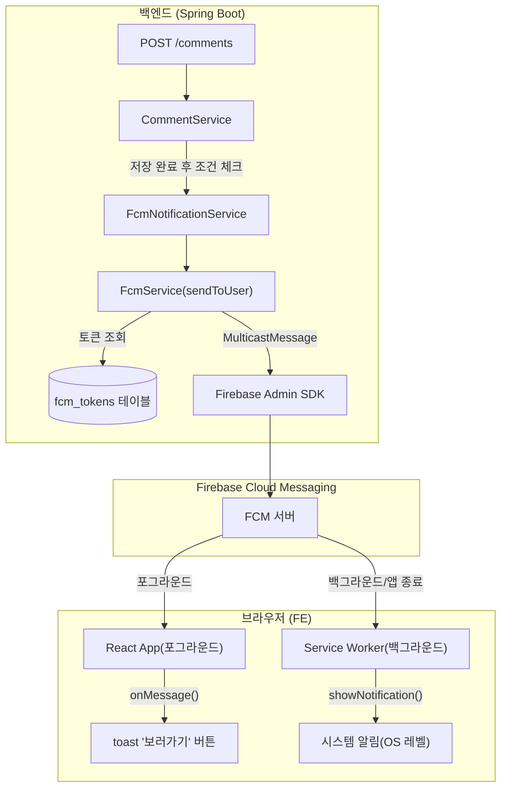
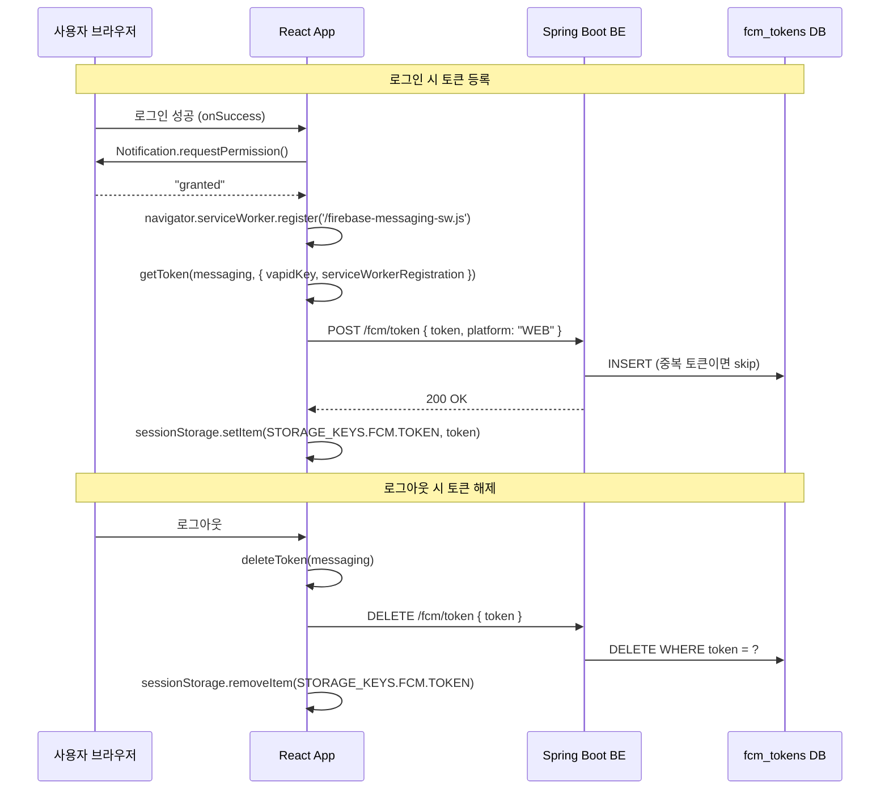
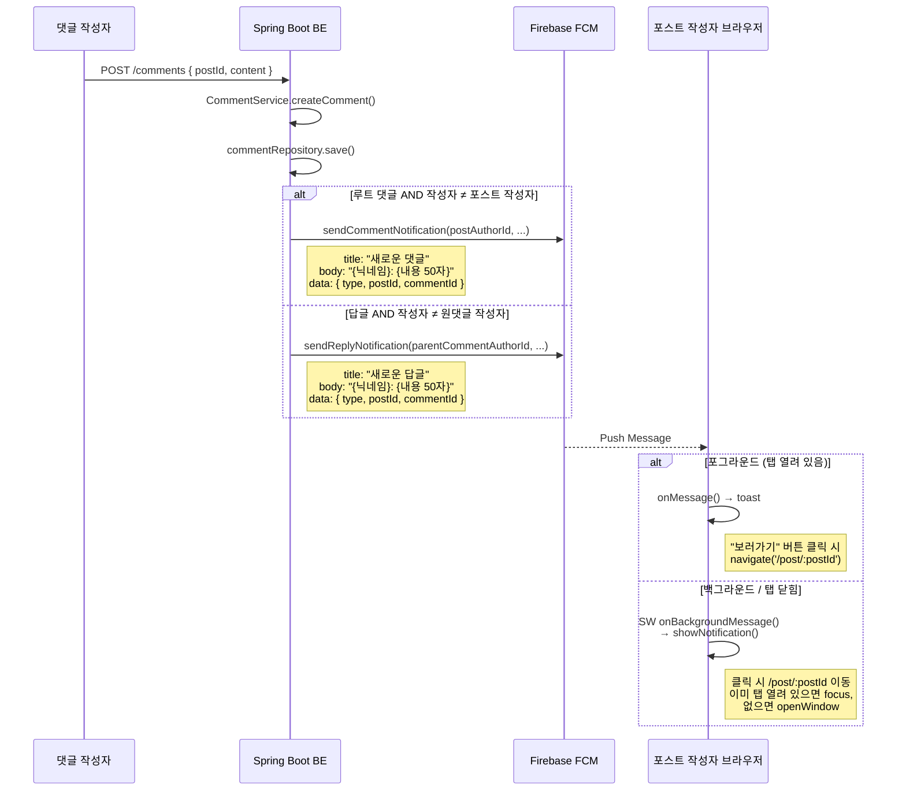

# FCM 푸시 알림 구현 가이드

> **문서 성격**: 독립 기능 문서(서사형)
>
> **대상 독자**: 이 레포 FE·BE를 처음 보거나 오랜만에 돌아온 개발자.
>
> **읽고 나면**: 토큰 등록/해제부터 알림 클릭 시 딥링크까지 전체 경로를 이해하고,
> 새 알림 타입을 추가하거나 배포 관련 문제를 진단할 수 있다.
>
> **마지막 검토**: 2026-09-04

댓글·답글 작성 시 포스트 작성자 또는 원댓글 작성자에게 FCM(Firebase Cloud
Messaging) 푸시 알림을 전송하는 기능의 전체 구현 내역과 운영 중 마주친 삽질
기록을 담은 문서입니다.

> **관련 커밋**
>
> - FE: `eddc49b feat: 댓글, 답글 FCM 푸시 알림 기능 추가`
> - FE: `d476605 fix: SW 파일 압축 제외 / no-cache 배포 / mkcert CI 조건부 실행`
> - BE: `a746636 feat: 댓글, 답글 FCM 푸시 알림 기능 추가`

## 1. 쉬운 설명

카카오톡으로 치면, 상대가 앱을 꺼둔 상태에서도 메시지가 오면 휴대폰 알림창에
뜨는 것과 같은 원리다. **앱을 안 보고 있어도**(백그라운드) 브라우저가 대신
알림을 띄워주는 역할을 **서비스워커**(Service Worker — 탭이 닫혀 있어도 백그라운드에서
실행되는 스크립트)가 맡고, **앱을 보고 있을 때는**(포그라운드) 앱이 직접 토스트로
보여준다. 어느 쪽이든 클릭하면 해당 게시글로 이동한다.

전체 그림:


```mermaid
flowchart TD
  subgraph Browser["브라우저 (FE)"]
    App["React App(포그라운드)"]
    SW["Service Worker(백그라운드)"]
    App -- "onMessage()" --> Toast["toast '보러가기' 버튼"]
    SW -- "showNotification()" --> SysNotif["시스템 알림(OS 레벨)"]
  end

  subgraph FCM["Firebase Cloud Messaging"]
    FCMServer["FCM 서버"]
  end

  subgraph BE["백엔드 (Spring Boot)"]
    CommentAPI["POST /comments"]
    CommentSvc["CommentService"]
    FcmNotiSvc["FcmNotificationService"]
    FcmSvc["FcmService(sendToUser)"]
    FcmTokenDB[("fcm_tokens 테이블")]
    AdminSDK["Firebase Admin SDK"]
    CommentAPI --> CommentSvc
    CommentSvc -- "저장 완료 후 조건 체크" --> FcmNotiSvc
    FcmNotiSvc --> FcmSvc
    FcmSvc -- "토큰 조회" --> FcmTokenDB
    FcmSvc -- "MulticastMessage" --> AdminSDK
  end

  AdminSDK --> FCMServer
  FCMServer -- "포그라운드" --> App
  FCMServer -- "백그라운드/앱 종료" --> SW
```

토큰 등록·발송 흐름의 시퀀스 다이어그램은 §5 구조에 있다.

## 2. 전제 지식

React 훅·Service Worker의 기본 개념(탭이 닫혀도 백그라운드에서 도는 별도
스크립트라는 정도)은 안다고 가정한다. Firebase Cloud Messaging 자체를 몰라도
읽을 수 있게 썼다.

가정하지 않는 것:

- 처음 나오는 용어(`vapidKey`, compat 버전, `auth.store` 등) → §12 용어 사전
- FE 인증 상태 관리 전반 → `entities/user`, `shared/store/auth.store.ts`
- 이 레포의 자동 배포 파이프라인 자체 → [`DEPLOY.md`](./DEPLOY.md)

## 3. 사용한 도구·기술

**기능 자체를 이루는 것**

- **Firebase Cloud Messaging(Web SDK)** — 토큰 발급·포그라운드 메시지 수신
- **Service Worker**(`public/firebase-messaging-sw.js`) — 백그라운드/탭 종료
  상태에서 시스템 알림 표시
- **Firebase Admin SDK**(BE) — 서버에서 특정 사용자에게 푸시 발송
- **Zustand**(`auth.store`) — 토큰 등록 시점에 필요한 `accessToken` 조회
- **`vite-plugin-compression` / `vite-plugin-mkcert`** — 배포·로컬 환경별 빌드
  설정(§10 시행착오에서 둘 다 문제를 일으킨 적 있다)

**구현·검증 과정에서 쓴 도구**: 별도 자동화 테스트 도구는 쓰지 않았다 — §9 참고.

## 4. 왜 만들었나

댓글·답글이 달려도 포스트 작성자나 원댓글 작성자가 앱을 다시 열어보기 전까지는
알 방법이 없었다. 브라우저 푸시로 실시간에 가깝게 알려주기 위해 도입했다.

## 5. 구조

### 토큰 라이프사이클


```mermaid
sequenceDiagram
  participant User as 사용자 브라우저
  participant FE as React App
  participant BE as Spring Boot BE
  participant DB as fcm_tokens DB

  Note over User,DB: 로그인 시 토큰 등록
  User->>FE: 로그인 성공 (onSuccess)
  FE->>User: Notification.requestPermission()
  User-->>FE: "granted"
  FE->>FE: navigator.serviceWorker.register('/firebase-messaging-sw.js')
  FE->>FE: getToken(messaging, { vapidKey, serviceWorkerRegistration })
  FE->>BE: POST /fcm/token { token, platform: "WEB" }
  BE->>DB: INSERT (중복 토큰이면 skip)
  BE-->>FE: 200 OK
  FE->>FE: sessionStorage.setItem(STORAGE_KEYS.FCM.TOKEN, token)

  Note over User,DB: 로그아웃 시 토큰 해제
  User->>FE: 로그아웃
  FE->>FE: deleteToken(messaging)
  FE->>BE: DELETE /fcm/token { token }
  BE->>DB: DELETE WHERE token = ?
  FE->>FE: sessionStorage.removeItem(STORAGE_KEYS.FCM.TOKEN)
```

### 알림 발송 흐름(댓글 → 수신)


```mermaid
sequenceDiagram
  participant Commenter as 댓글 작성자
  participant BE as Spring Boot BE
  participant FCM as Firebase FCM
  participant PostOwner as 포스트 작성자 브라우저

  Commenter->>BE: POST /comments { postId, content }
  BE->>BE: CommentService.createComment()
  BE->>BE: commentRepository.save()

  alt 루트 댓글 AND 작성자 ≠ 포스트 작성자
    BE->>FCM: sendCommentNotification(postAuthorId, ...)
    Note right of BE: title: "새로운 댓글"<br/>body: "{닉네임}: {내용 50자}"<br/>data: { type, postId, commentId }
  else 답글 AND 작성자 ≠ 원댓글 작성자
    BE->>FCM: sendReplyNotification(parentCommentAuthorId, ...)
    Note right of BE: title: "새로운 답글"<br/>body: "{닉네임}: {내용 50자}"<br/>data: { type, postId, commentId }
  end

  FCM-->>PostOwner: Push Message

  alt 포그라운드 (탭 열려 있음)
    PostOwner->>PostOwner: onMessage() → toast
    Note right of PostOwner: "보러가기" 버튼 클릭 시<br/>navigate('/post/:postId')
  else 백그라운드 / 탭 닫힘
    PostOwner->>PostOwner: SW onBackgroundMessage()<br/>→ showNotification()
    Note right of PostOwner: 클릭 시 /post/:postId 이동<br/>이미 탭 열려 있으면 focus,<br/>없으면 openWindow
  end
```

§6 상태 모델에 `data` 페이로드(`{type, postId, commentId}`)의 전체 계약을
정리했다 — 이 다이어그램의 Note에 흩어져 있는 필드들이 그 표의 근거다.

### FE 구현

```
src/shared/lib/firebase/
├── firebase.ts                  # Firebase 앱 초기화 + messaging 인스턴스
├── fcm.ts                       # 토큰 등록·해제 함수
└── useFcmForegroundMessage.ts   # 포그라운드 메시지 수신 훅

public/
└── firebase-messaging-sw.js     # Service Worker (백그라운드 수신)
```

**Firebase 앱 초기화**(`firebase.ts`)

```typescript
// 중복 초기화 방지 패턴
const app = getApps().length === 0 ? initializeApp(firebaseConfig) : getApp();

// Service Worker를 지원하지 않는 환경(SSR, 구형 브라우저)에서 안전하게 null 처리
let messaging: Messaging | null = null;
if (typeof window !== 'undefined' && 'serviceWorker' in navigator) {
  messaging = getMessaging(app);
}
```

> **왜 `null` 체크를 하나?** `getMessaging()`은 브라우저 전용 API다. SSR 환경이나
> Service Worker를 미지원하는 브라우저에서 호출하면 런타임 에러가 발생한다.
> `messaging`이 `null`인 경우 이후 모든 FCM 함수가 early return하여 조용히 skip한다.

**FCM 토큰 등록·해제**(`fcm.ts`)

로그인 성공 직후 `auth.queries.ts`의 `onSuccess`에서 `requestAndRegisterFcmToken`을
호출한다. 서버 등록은 별도 함수(`registerTokenToServer`)로 분리돼 있고,
`sessionStorage`(키는 `STORAGE_KEYS.FCM.TOKEN`, §12)에 토큰을 캐싱해 **동일
세션에서 중복 서버 요청을 방지**한다. 등록에는 로그인 직후의 `accessToken`이
필요한데 이 시점 타이밍 문제가 §10.6 시행착오의 원인이었다.

```typescript
// src/shared/lib/firebase/fcm.ts (요지만 발췌 — 전체는 파일 직접 확인)
async function registerTokenToServer(token: string): Promise<void> {
  if (sessionStorage.getItem(STORAGE_KEYS.FCM.TOKEN) === token) return; // 중복 방지

  const accessToken = getAccessTokenFromStore(); // useAuthStore.getState().accessToken
  if (!accessToken) return; // 아직 로그인 상태가 스토어에 반영 안 됐으면 조용히 skip

  await fetch(`${baseUrl}/fcm/token`, {
    method: 'POST',
    headers: { 'Content-Type': 'application/json', Authorization: `Bearer ${accessToken}` },
    body: JSON.stringify({ token, platform: 'WEB' }),
  });
  sessionStorage.setItem(STORAGE_KEYS.FCM.TOKEN, token);
}
```

토큰 해제(`unregisterFcmToken`)는 로그아웃 직전에 호출된다. Firebase SDK의
`deleteToken()` + 서버 `DELETE /fcm/token`을 순서대로 호출한다.

**포그라운드 메시지 수신**(`useFcmForegroundMessage.ts`)

앱이 포그라운드(탭 활성화)일 때 FCM 메시지를 받으면 Service Worker 대신 앱 레벨
`onMessage()`가 처리한다. 토스트는 sonner가 아니라 이 레포 공통 래퍼
`@/shared/lib/toast/toast`를 쓴다(§12), 문구는 `TEXTS.notification.*`(하드코딩
아님)이다.

```typescript
export function useFcmForegroundMessage() {
  const navigate = useNavigate();

  useEffect(() => {
    if (!messaging) return;

    const unsubscribe = onMessage(messaging, (payload) => {
      const title = payload.notification?.title ?? TEXTS.notification.defaultTitle;
      const body = payload.notification?.body ?? '';
      const postId = payload.data?.postId;

      toast(title, {
        description: body,
        ...(postId && {
          action: {
            label: TEXTS.notification.viewAction,
            onClick: () => navigate(`/post/${postId}`),
          },
          closeButton: false,
        }),
      });
    });

    return unsubscribe; // cleanup
  }, [navigate]);
}
```

이 훅은 `RootLayout`에서 최상단에 마운트하여 앱 전체에서 단 한 번만 구독한다.
`RootLayout`은 이 훅 하나만 쓰는 게 아니라 여러 전역 관심사(저장하지 않은 입력
가드, 로그인 모달, 이미지 뷰어, 알림창)를 함께 마운트하는 자리다.

```typescript
// src/app/routes/layouts/RootLayout.tsx
export function RootLayout() {
  useFcmForegroundMessage();
  useUnsavedChangesGuard();

  return (
    <>
      <ScrollRestoration />
      <Outlet />
      <LoginModal />
      <GlobalImageViewer />
      <GlobalAlerts />
    </>
  );
}
```

**백그라운드 메시지 수신**(`public/firebase-messaging-sw.js`)

Service Worker는 Vite의 빌드 파이프라인 바깥에 있는 `public/` 폴더에 위치한다.
`import.meta.env`를 사용할 수 없으므로(§10.4) Firebase config 값을 직접
하드코딩한다.

> **Firebase 프론트엔드 Config는 공개해도 안전하다.** `apiKey`, `projectId` 등
> 프론트엔드용 Firebase 설정값은 클라이언트가 Firebase 서비스에 접근할 수 있도록
> Firebase가 공개적으로 발급하는 식별자다. 실제 보안은 Firebase Security Rules와
> 서버의 Admin SDK 서비스 계정 키로 관리한다.

```javascript
// compat 버전을 importScripts로 로드(ES Module 불가 — §12 용어 사전)
importScripts('https://www.gstatic.com/firebasejs/11.0.0/firebase-app-compat.js');
importScripts('https://www.gstatic.com/firebasejs/11.0.0/firebase-messaging-compat.js');

firebase.initializeApp({
  /* config 하드코딩 */
});
const messaging = firebase.messaging();

messaging.onBackgroundMessage((payload) => {
  const { title, body } = payload.notification ?? {};
  self.registration.showNotification(title ?? '새로운 알림', {
    body,
    icon: '/favicons/android-chrome-192x192.png',
    data: payload.data,
    tag: payload.data?.type ?? 'notification',
  });
});

// 알림 클릭 → 해당 포스트 페이지로 이동
self.addEventListener('notificationclick', (event) => {
  event.notification.close();
  const postId = event.notification.data?.postId;
  const targetUrl = postId ? `${self.location.origin}/post/${postId}` : self.location.origin;

  event.waitUntil(
    clients.matchAll({ type: 'window', includeUncontrolled: true }).then((clientList) => {
      for (const client of clientList) {
        if (client.url.startsWith(self.location.origin) && 'focus' in client) {
          client.navigate(targetUrl);
          return client.focus(); // 이미 탭이 열려 있으면 포커스
        }
      }
      return clients.openWindow(targetUrl); // 탭이 없으면 새 탭
    })
  );
});
```

### BE 구현

BE는 별도 git 저장소(`link-sphere_BE_NEW`)라 아래 스니펫은 **작성 당시 기준
기록**이고, 이 문서를 고치는 시점에 재검증하지 않는다 — 최신 상태는 BE 레포를
직접 확인한다.

```
src/main/kotlin/com/example/linksphere/
├── infra/fcm/
│   ├── FcmConfig.kt              # Firebase Admin SDK 초기화
│   ├── FcmService.kt             # sendToUser() - 실제 FCM 발송
│   ├── FcmNotificationService.kt # 알림 타입별 메시지 조립
│   ├── FcmTokenController.kt     # POST/DELETE /fcm/token
│   ├── FcmTokenService.kt        # 토큰 CRUD 비즈니스 로직
│   ├── FcmTokenRepository.kt     # JPA Repository
│   ├── FcmTokenDTO.kt            # Request DTO
│   └── TableFcmToken.kt          # fcm_tokens 엔티티
└── domain/comment/
    └── CommentService.kt         # 댓글/답글 저장 후 알림 트리거
```

Firebase Admin SDK 초기화(`FcmConfig.kt`)는 서비스 계정 키 파일이 없으면(로컬
개발 등) 경고만 남기고 조용히 skip한다. `fcm_tokens` 테이블은 `token`에 `UNIQUE`
제약을 걸어 중복 저장을 DB 레벨에서 막고, `platform`(`WEB`/`ANDROID`/`IOS`
고려 설계, 현재는 `WEB`만 사용)을 갖는다(§6 상태 모델).

발송(`FcmService.sendToUser`)은 `MulticastMessage`로 한 유저의 모든 토큰(최대
500개, 멀티 디바이스)에 동시 발송하고, 응답 중 `UNREGISTERED`/`INVALID_ARGUMENT`
에러(만료된 토큰)는 자동으로 DB에서 삭제한다.

알림을 보내지 않는 경우:

- 자기 포스트에 자기가 댓글 → 자기 자신에게 알림 없음(`post.userId != userId`)
- 자기 댓글에 자기가 답글 → 자기 자신에게 알림 없음(`parent.userId != userId`)
- 답글(대댓글)에 달리는 대대댓글 → 최대 depth 1 제한으로 원천 차단

### 배포 설정

**FE 환경변수**

| 변수                                | 설명                                                                                    |
| ----------------------------------- | --------------------------------------------------------------------------------------- |
| `VITE_FIREBASE_API_KEY`             | Firebase 프로젝트 API 키                                                                |
| `VITE_FIREBASE_AUTH_DOMAIN`         | Firebase Auth 도메인                                                                    |
| `VITE_FIREBASE_PROJECT_ID`          | Firebase 프로젝트 ID                                                                    |
| `VITE_FIREBASE_MESSAGING_SENDER_ID` | FCM Sender ID                                                                           |
| `VITE_FIREBASE_APP_ID`              | Firebase App ID                                                                         |
| `VITE_FIREBASE_VAPID_KEY`           | Web Push VAPID 키(§12 용어 사전) — Firebase Console > Cloud Messaging > Web Push 인증서 |

GitHub Actions에서는 `secrets.*`로 주입한다(`.github/workflows/deploy.yml` 참고).

**BE 환경변수/설정** — `application.yml`의 `firebase.service-account-key-path:
classpath:firebase-service-account.json`. 키 파일은 Firebase Console > 프로젝트
설정 > 서비스 계정 > 새 비공개 키 생성에서 발급받고 `.gitignore`에 추가한다.

**Service Worker S3 배포 설정** — 반드시 지켜야 하는 조건이 있다(왜 필요한지는
§10.1·§10.2 시행착오 참고):

```yaml
# .github/workflows/deploy.yml

# SW 파일은 no-cache + text/javascript 로 개별 업로드
- name: Upload to S3
  run: |
    aws s3 cp dist/firebase-messaging-sw.js s3://${{ secrets.S3_BUCKET_NAME }}/firebase-messaging-sw.js \
      --cache-control "no-cache, no-store, must-revalidate" \
      --content-type "text/javascript"

    aws s3 sync dist/ s3://${{ secrets.S3_BUCKET_NAME }} --delete \
      --exclude "firebase-messaging-sw.js"
```

## 6. 상태 모델

FCM 메시지의 `data` 페이로드는 이 기능 전체를 관통하는 계약이다 — 시퀀스
다이어그램의 Note(§5), FE `onMessage`/SW `notificationclick` 핸들러, BE
`FcmNotificationService`의 `mapOf(...)`에 흩어져 등장하지만 한 곳에 정리된 적이
없었다.

| 필드        | 값                     | 만드는 곳                    | 쓰는 곳                                                         |
| ----------- | ---------------------- | ---------------------------- | --------------------------------------------------------------- |
| `type`      | `'COMMENT' \| 'REPLY'` | `FcmNotificationService`(BE) | FE는 현재 안 씀(향후 알림 타입별 분기에 쓸 수 있음)             |
| `postId`    | 게시글 UUID 문자열     | 〃                           | FE `onMessage`/SW `notificationclick` — `/post/{postId}` 딥링크 |
| `commentId` | 댓글 UUID 문자열       | 〃                           | FE는 현재 안 씀                                                 |

FE 쪽에서 토큰 등록에 필요한 상태는 `useAuthStore`(Zustand)의 `accessToken`
필드 하나뿐이다 — `getAccessTokenFromStore()`(`fcm.ts`)가 React 렌더 사이클과
무관하게 `useAuthStore.getState()`로 직접 읽는다(§10.6).

`fcm_tokens` 테이블(BE, `TableFcmToken.kt`)은 `id`/`userId`/`token`(UNIQUE)/
`platform`(`WEB` 고정 사용 중)/`createdAt`/`updatedAt`.

## 7. 운영 파라미터

| 파라미터                  | 값                                               | 실제 위치                                           |
| ------------------------- | ------------------------------------------------ | --------------------------------------------------- |
| 알림 본문 길이 제한       | 50자(초과 시 `...` 없이 자름 — §11 개선 대상)    | BE `CommentService.kt`의 `finalContent.take(50)`    |
| 한 유저 동시 발송 토큰 수 | 최대 500(멀티 디바이스)                          | BE `FcmService.sendToUser`의 `sendEachForMulticast` |
| 자동 삭제 대상 에러       | `UNREGISTERED`, `INVALID_ARGUMENT`               | BE `FcmService.sendToUser`의 실패 응답 필터         |
| 토큰 세션 캐시 키         | `STORAGE_KEYS.FCM.TOKEN`(`linksphere:fcm:token`) | `src/shared/config/storage-keys.ts:21-23`           |

## 8. 코드 지도와 자주 하는 수정

파일 구조는 §5 "FE 구현"·"BE 구현"의 트리를 참고한다(중복하지 않는다).

### 자주 하는 수정

| 하고 싶은 것                       | 방법                                                                                                                                                                                        |
| ---------------------------------- | ------------------------------------------------------------------------------------------------------------------------------------------------------------------------------------------- |
| 새 알림 타입 추가(예: 좋아요 알림) | BE `FcmNotificationService`에 `send*Notification` 함수 추가 + `data.type` 값 추가, FE는 `type`을 안 쓰므로 기본적으로 손댈 곳 없음(딥링크만 되면 됨)                                        |
| 50자 절단 기준 변경                | BE `CommentService.kt`의 `.take(50)` 두 곳(§7)                                                                                                                                              |
| 알림 클릭 시 이동 경로 변경        | FE `useFcmForegroundMessage.ts`(포그라운드)와 `public/firebase-messaging-sw.js`의 `notificationclick`(백그라운드) **둘 다** 고쳐야 한다 — 한쪽만 고치면 포그라운드/백그라운드 동작이 갈린다 |
| 알림 문구 변경                     | `TEXTS.notification.*`(`shared/config/texts.ts`), BE의 `title`/`body` 리터럴(`FcmNotificationService.kt`)                                                                                   |
| VAPID 키 로테이션                  | Firebase Console에서 재발급 후 `VITE_FIREBASE_VAPID_KEY` GitHub Secret 갱신                                                                                                                 |

## 9. 검증 결과

이 기능은 자동화 테스트가 없다 — 브라우저 `Notification` 권한, 실제 Service
Worker 등록, 실제 FCM 인프라가 필요해 단위 테스트로 재현하기 어렵다. 대신 배포
환경에서 수동으로 검증하며 실제로 발견한 문제 6건이 §10 시행착오에 원인·해결과
함께 기록돼 있다 — 이 기능의 실질적인 검증 기록은 그 절이다.

## 10. 시행착오

### 10.1. SW 파일 `.gz` 압축으로 MIME 타입 불일치

**증상**: 로컬에서는 정상 동작하지만 배포 환경에서 Service Worker 등록이 차단됨.

```
Failed to register a ServiceWorker for scope ... with script ...
The script has an unsupported MIME type ('application/gzip').
```

**원인**: `vite-plugin-compression`이 `public/` 폴더에서 복사된
`firebase-messaging-sw.js`까지 압축해서 `dist/firebase-messaging-sw.js.gz`를
생성했다. S3/CloudFront 설정에 따라 브라우저가 `.gz` 버전을 응답받으면
`Content-Type: application/gzip`이 되어 Service Worker 등록이 차단된다.

**해결**: `vite.config.ts`에서 해당 파일을 압축 필터에서 제외한다.

```typescript
compression({
  algorithm: 'gzip',
  ext: '.gz',
  // firebase-messaging-sw.js는 SW 특성상 압축 제외
  filter: /^(?!.*firebase-messaging-sw).*\.(js|css|html|json|svg)$/,
}),
```

### 10.2. CloudFront 캐싱으로 SW 갱신 안 됨

**증상**: SW 파일을 수정해서 배포했는데 브라우저가 계속 이전 버전의 SW를 사용함.

**원인**: CloudFront가 `firebase-messaging-sw.js`를 기본 캐싱 정책으로 캐싱하고
있었다. Service Worker는 브라우저가 주기적으로 서버와 파일을 비교해 갱신 여부를
판단하는데, `Cache-Control: max-age`가 설정되어 있으면 서버 요청 자체를 생략한다.

**해결**: `deploy.yml`에서 SW 파일을 `--cache-control "no-cache, no-store,
must-revalidate"` 옵션으로 개별 업로드하고, 나머지 파일 `sync`에서는 해당
파일을 `--exclude`로 제외한다(§5 "배포 설정" 참고).

### 10.3. CI 환경에서 `mkcert()` 빌드 실패

**증상**: GitHub Actions 빌드가 느려지거나 간헐적으로 실패함.

**원인**: `vite.config.ts`에서 `mkcert()` 플러그인이 `mode` 조건 없이 항상
실행되었다. `ubuntu-latest` CI 환경에는 `mkcert` 바이너리가 없어서 플러그인이
자동 설치를 시도하면서 빌드가 지연 또는 실패했다.

**해결**: `mode === 'localhost'`일 때만 활성화한다.

```typescript
mode === 'localhost' && mkcert(),
```

### 10.4. Service Worker에서 `import.meta.env` 사용 불가

**증상**: `public/firebase-messaging-sw.js`에서 환경변수를 읽으려 했더니
`undefined` 반환.

**원인**: Service Worker 파일은 Vite의 빌드 파이프라인 외부(`public/` 폴더)에
있기 때문에 `import.meta.env`가 동작하지 않는다. Vite는 `public/` 폴더의 파일을
변환 없이 그대로 복사한다.

**해결(현재 채택)**: Firebase 프론트엔드 Config 값은 원래 공개되어도 안전한
값이므로 SW 파일에 직접 하드코딩한다(파일 상단 주석에 이 사실을 명시).

**대안(미채택)**: Vite 플러그인을 사용해 빌드 타임에 환경변수를 SW 파일에
주입하는 방법이 있지만 설정이 복잡해서 채택하지 않았다.

### 10.5. 포그라운드 메시지가 자동으로 시스템 알림을 띄우지 않음

**증상**: 앱이 포그라운드(탭 활성화)일 때 FCM 메시지를 받았는데 아무것도
표시되지 않음.

**원인**: FCM은 앱이 포그라운드일 때 자동으로 시스템 알림을 띄우지 않는다.
포그라운드 메시지는 Service Worker가 아닌 앱 레벨의 `onMessage()` 핸들러로만
전달된다. 핸들러를 등록하지 않으면 메시지가 그냥 소실된다.

**해결**: `useFcmForegroundMessage` 훅에서 `onMessage()`로 구독하고 토스트로
직접 표시한다. `RootLayout`에서 최상단에 마운트하여 앱 전체에서 항상 구독
상태를 유지한다.

### 10.6. 로그인 직후 토큰 등록 시 `accessToken`이 없는 경우

**증상**: 로그인 후 FCM 토큰 서버 등록이 가끔 401로 실패.

**원인**: `requestAndRegisterFcmToken()`은 `onSuccess` 콜백에서 호출되는데, 이
시점에 Zustand `auth.store`의 `accessToken`이 아직 세팅되기 전인 경우가 있었다.

**해결**: `onSuccess` 콜백에서 `setAuth(data.accessToken)`을 먼저 호출한 후
`requestAndRegisterFcmToken()`을 호출하도록 순서를 보장한다. `fcm.ts` 내부의
`getAccessTokenFromStore()`는 React 컴포넌트 외부에서 Zustand `getState()`를
직접 호출하므로 React 렌더링 사이클과 무관하게 최신 상태를 읽는다.

```typescript
// auth.queries.ts onSuccess 순서가 중요
onSuccess: (data) => {
  setAuth(data.accessToken); // 1. 먼저 스토어에 세팅
  void requestAndRegisterFcmToken(); // 2. 그다음 토큰 등록
},
```

## 11. 남은 것

### 11.1. FCM 발송이 댓글 저장 트랜잭션 내에서 동기 실행

현재 `CommentService.createComment()`의 `@Transactional` 범위 안에서 FCM 발송이
동기적으로 실행된다.

```
[트랜잭션 시작]
  → DB 저장
  → FCM 네트워크 요청 (동기 블로킹)
[트랜잭션 종료]
→ HTTP 응답 반환
```

Firebase 서버가 느리거나 일시 장애가 발생하면 댓글 저장 응답 자체가 지연된다.

**개선안**: Spring `@Async` 또는 `ApplicationEventPublisher`를 사용해 알림
발송을 비동기로 분리한다.

```kotlin
// 개선 예시
@TransactionalEventListener(phase = TransactionPhase.AFTER_COMMIT)
fun onCommentCreated(event: CommentCreatedEvent) {
    fcmNotificationService.sendCommentNotification(...)
}
```

### 11.2. `DELETE /fcm/token` 인증 미적용

현재 토큰 삭제 엔드포인트는 인증 없이 토큰 값만 알면 누구든 삭제할 수 있다.
FCM 토큰은 추측하기 어려운 긴 문자열이므로 실질적인 위험은 낮지만, 원칙적으로는
`Authentication` 파라미터를 추가해 본인 토큰만 삭제 가능하도록 보완하는 것이
바람직하다.

### 11.3. 알림 본문 50자 truncation에 `...` 없음

내용이 정확히 50자에서 잘리면 문장이 어색하게 끊긴다.

**개선안**: `finalContent.take(50).let { if (it.length == 50) "$it…" else it }`

### 11.4. `TableFcmToken.updatedAt` 자동 갱신 없음

현재 `updatedAt`은 엔티티 생성 시점에만 설정되고 `@PreUpdate`가 없어 갱신되지
않는다. 현재 구현은 토큰 만료 시 삭제 후 재등록하는 방식이라 큰 문제는 아니지만,
이후 토큰 갱신 로직 추가 시 주의가 필요하다.

## 12. 용어 사전

- **`vapidKey`** — Web Push의 VAPID(Voluntary Application Server Identification)
  공개 키. FCM이 이 서버가 발송을 요청할 자격이 있는지 확인하는 데 쓴다.
  `VITE_FIREBASE_VAPID_KEY` 환경변수(§5 "배포 설정")
- **compat 버전** — Firebase SDK의 비-모듈(non-ES-Module) 빌드. Service
  Worker의 고전적인 `importScripts()` 방식으로만 로드할 수 있어, 일반 앱
  코드가 쓰는 모듈형 SDK와는 별도로 SW 전용으로 불러온다
- **`auth.store`** — `src/shared/store/auth.store.ts`의 Zustand 스토어.
  `accessToken` 필드를 FCM 토큰 등록/해제 시 직접 읽는다(§6)
- **토스트 래퍼** — 이 문서의 다이어그램·코드에서 "toast"라고만 쓴 것은 sonner
  라이브러리를 직접 부르는 게 아니라 이 레포 공통 래퍼
  `@/shared/lib/toast/toast`를 가리킨다

## 13. 관련 문서

- [`DEPLOY.md`](./DEPLOY.md) — S3/CloudFront 배포 파이프라인 전반
- [`UNSAVED-CHANGES-GUARD.md`](./UNSAVED-CHANGES-GUARD.md) — `RootLayout`에
  함께 마운트되는 다른 전역 훅
