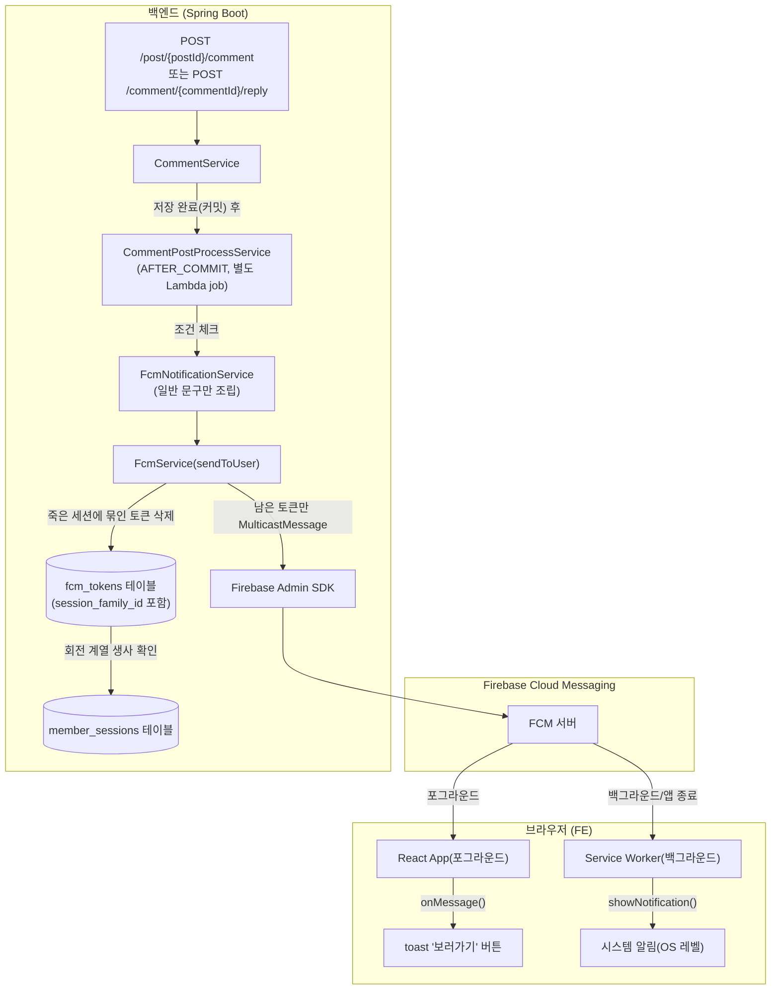
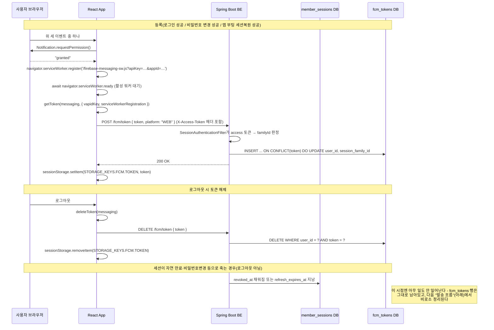
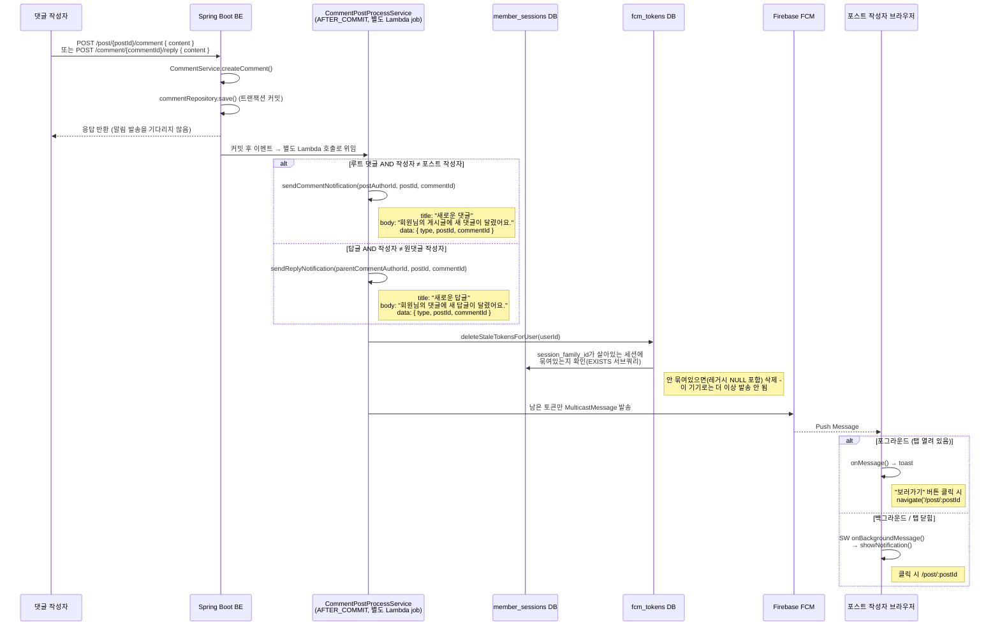

# FCM 푸시 알림 구현 가이드

> **문서 성격**: 독립 기능 문서(서사형)
>
> **대상 독자**: 이 레포 FE·BE를 처음 보거나 오랜만에 돌아온 개발자.
>
> **읽고 나면**: 토큰 등록/해제부터 알림 클릭 시 딥링크까지 전체 경로를 이해하고,
> 새 알림 타입을 추가하거나 배포 관련 문제를 진단할 수 있다.
>
> **마지막 검토**: 2026-10-05

댓글·답글 작성 시 포스트 작성자 또는 원댓글 작성자에게 FCM(Firebase Cloud
Messaging) 푸시 알림을 전송하는 기능의 전체 구현 내역과 운영 중 마주친 삽질
기록을 담은 문서입니다.

> **관련 커밋**
>
> - FE: `eddc49b feat: 댓글, 답글 FCM 푸시 알림 기능 추가`
> - FE: `d476605 fix: SW 파일 압축 제외 / no-cache 배포 / mkcert CI 조건부 실행`
> - BE: `a746636 feat: 댓글, 답글 FCM 푸시 알림 기능 추가`

## 1. 쉬운 설명

카카오톡으로 치면, 상대가 앱을 꺼둔 상태에서도 메시지가 오면 휴대폰 알림창에
뜨는 것과 같은 원리다. **앱을 안 보고 있어도**(백그라운드) 브라우저가 대신
알림을 띄워주는 역할을 **서비스워커**(Service Worker — 탭이 닫혀 있어도 백그라운드에서
실행되는 스크립트)가 맡고, **앱을 보고 있을 때는**(포그라운드) 앱이 직접 토스트로
보여준다. 어느 쪽이든 클릭하면 해당 게시글의 그 댓글 위치로 이동한다.

2026-09-29부터는 여기에 "이 기기의 로그인 세션이 살아있는 동안에만 온다"는 조건이
하나 더 붙었다 — 세션이 죽으면(로그아웃·비밀번호변경·자연만료 등) 그 기기의 등록은
다음 발송 시도 때 자동으로 정리되고, 알림 자체도 닉네임·댓글 내용 없이 "새 댓글이
달렸어요" 같은 일반 문구만 담는다(§5 "왜 이렇게 바뀌었나" 참고).

전체 그림:


```mermaid
flowchart TD
  subgraph Browser["브라우저 (FE)"]
    App["React App(포그라운드)"]
    SW["Service Worker(백그라운드)"]
    App -- "onMessage()" --> Toast["toast '보러가기' 버튼"]
    SW -- "showNotification()" --> SysNotif["시스템 알림(OS 레벨)"]
  end

  subgraph FCM["Firebase Cloud Messaging"]
    FCMServer["FCM 서버"]
  end

  subgraph BE["백엔드 (Spring Boot)"]
    CommentAPI["POST /post/{postId}/comment<br/>또는 POST /comment/{commentId}/reply"]
    CommentSvc["CommentService"]
    Job["CommentPostProcessService<br/>(AFTER_COMMIT, 별도 Lambda job)"]
    FcmNotiSvc["FcmNotificationService<br/>(일반 문구만 조립)"]
    FcmSvc["FcmService(sendToUser)"]
    FcmTokenDB[("fcm_tokens 테이블<br/>(session_family_id 포함)")]
    SessionDB[("member_sessions 테이블")]
    AdminSDK["Firebase Admin SDK"]
    CommentAPI --> CommentSvc
    CommentSvc -- "저장 완료(커밋) 후" --> Job
    Job -- "조건 체크" --> FcmNotiSvc
    FcmNotiSvc --> FcmSvc
    FcmSvc -- "죽은 세션에 묶인 토큰 삭제" --> FcmTokenDB
    FcmTokenDB -- "회전 계열 생사 확인" --> SessionDB
    FcmSvc -- "남은 토큰만 MulticastMessage" --> AdminSDK
  end

  AdminSDK --> FCMServer
  FCMServer -- "포그라운드" --> App
  FCMServer -- "백그라운드/앱 종료" --> SW
```

토큰 등록·발송 흐름의 시퀀스 다이어그램은 §5 구조에 있다.

## 2. 전제 지식

React 훅·Service Worker의 기본 개념(탭이 닫혀도 백그라운드에서 도는 별도
스크립트라는 정도)은 안다고 가정한다. Firebase Cloud Messaging 자체를 몰라도
읽을 수 있게 썼다.

가정하지 않는 것:

- 처음 나오는 용어(`vapidKey`, compat 버전, `auth.store` 등) → §12 용어 사전
- FE 인증 상태 관리 전반 → `entities/auth`, `shared/store/auth.store.ts`
- 이 레포의 자동 배포 파이프라인 자체 → [`DEPLOY.md`](./DEPLOY.md)

## 3. 사용한 도구·기술

**기능 자체를 이루는 것**

- **Firebase Cloud Messaging(Web SDK)** — 토큰 발급·포그라운드 메시지 수신
- **Service Worker**(`public/firebase-messaging-sw.js`) — 백그라운드/탭 종료
  상태에서 시스템 알림 표시
- **Firebase Admin SDK**(BE) — 서버에서 특정 사용자에게 푸시 발송
- **Zustand**(`auth.store`) — 토큰 등록 시점에 필요한 `accessToken` 조회
- **`vite-plugin-compression` / `vite-plugin-mkcert`** — 배포·로컬 환경별 빌드
  설정(§10 시행착오에서 둘 다 문제를 일으킨 적 있다)

**구현·검증 과정에서 쓴 도구**: Vitest — 포그라운드 "보러가기" 클릭 이동 경로만
(`useFcmForegroundMessage.test.tsx`). 발송 경로 자체는 자동화 테스트가 없다 — §9 참고.

## 4. 왜 만들었나

댓글·답글이 달려도 포스트 작성자나 원댓글 작성자가 앱을 다시 열어보기 전까지는
알 방법이 없었다. 브라우저 푸시로 실시간에 가깝게 알려주기 위해 도입했다.

## 5. 구조

### 왜 이렇게 바뀌었나 — 세션 바인딩·알림 내용 최소화 (2026-09-29)

FCM 토큰은 원래 로그인 세션과 완전히 분리된 수명주기를 가졌다 - 로그아웃해야만
서버에서 지워지고, 세션이 자연 만료돼도 그대로 남아 계속 푸시를 받았다. 실제로
오래전 로그인한 계정에서 "알림 클릭 → 이미 로그아웃 상태"를 겪은 사례가 있었다.
별개로 알림 본문(`"{닉네임}: {댓글 내용}"`)은 세션이 **살아있는** 동안에도 잠금화면
등에 댓글 내용을 그대로 노출했다.

- **세션 바인딩**: `fcm_tokens.session_family_id`에 그 토큰을 등록한 세션의 회전
  계열(`member_sessions.family_id`)을 기록해두고, 댓글 발송 시점마다 그 계열이
  아직 살아있는지 확인해 죽은 계열에 묶인 토큰은 지우고 발송 대상에서 제외한다.
  다만 이건 업계 표준(로그아웃/전송실패를 트리거로 삼는 것)을 넘어서는 이 레포
  맞춤 보강이다.
- **알림 내용 최소화**: 알림 본문에서 닉네임·댓글 내용을 완전히 제거하고 일반
  문구로 바꿨다 - OWASP MASTG·[EFF](https://www.eff.org/deeplinks/2026/04/how-push-notifications-can-betray-your-privacy-and-what-do-about-it)가
  공통으로 권고하는 "세부 내용은 앱을 열어야만" 패턴.

근거·대안 비교의 전체 기록은 [`docs/plans/2026-09-29-fcm-session-binding.md`](./plans/2026-09-29-fcm-session-binding.md)에 있다.

### 토큰 라이프사이클


```mermaid
sequenceDiagram
  participant User as 사용자 브라우저
  participant FE as React App
  participant BE as Spring Boot BE
  participant SessDB as member_sessions DB
  participant DB as fcm_tokens DB

  Note over User,DB: 등록(로그인 성공 / 비밀번호 변경 성공 / 앱 부팅 세션복원 성공)
  User->>FE: 위 세 이벤트 중 하나
  FE->>User: Notification.requestPermission()
  User-->>FE: "granted"
  FE->>FE: navigator.serviceWorker.register('/firebase-messaging-sw.js?apiKey=…&appId=…')
  FE->>FE: await navigator.serviceWorker.ready (활성 워커 대기)
  FE->>FE: getToken(messaging, { vapidKey, serviceWorkerRegistration })
  FE->>BE: POST /fcm/token { token, platform: "WEB" } (X-Access-Token 헤더 포함)
  BE->>BE: SessionAuthenticationFilter가 access 토큰 → familyId 판정
  BE->>DB: INSERT ... ON CONFLICT(token) DO UPDATE user_id, session_family_id
  BE-->>FE: 200 OK
  FE->>FE: sessionStorage.setItem(STORAGE_KEYS.FCM.TOKEN, token)

  Note over User,DB: 로그아웃 시 토큰 해제
  User->>FE: 로그아웃
  FE->>FE: deleteToken(messaging)
  FE->>BE: DELETE /fcm/token { token }
  BE->>DB: DELETE WHERE user_id = ? AND token = ?
  FE->>FE: sessionStorage.removeItem(STORAGE_KEYS.FCM.TOKEN)

  Note over User,DB: 세션이 자연 만료·비밀번호변경 등으로 죽는 경우(로그아웃 아님)
  BE->>SessDB: revoked_at 채워짐 또는 refresh_expires_at 지남
  Note right of DB: 이 시점엔 아무 일도 안 일어난다 - fcm_tokens 행은<br/>그대로 남아있고, 다음 "발송 흐름"(아래)에서<br/>비로소 정리된다
```

### 알림 발송 흐름(댓글 → 수신)


```mermaid
sequenceDiagram
  participant Commenter as 댓글 작성자
  participant BE as Spring Boot BE
  participant Job as CommentPostProcessService<br/>(AFTER_COMMIT, 별도 Lambda job)
  participant SessDB as member_sessions DB
  participant TokenDB as fcm_tokens DB
  participant FCM as Firebase FCM
  participant PostOwner as 포스트 작성자 브라우저

  Commenter->>BE: POST /post/{postId}/comment { content }<br/>또는 POST /comment/{commentId}/reply { content }
  BE->>BE: CommentService.createComment()
  BE->>BE: commentRepository.save() (트랜잭션 커밋)
  BE-->>Commenter: 응답 반환 (알림 발송을 기다리지 않음)
  BE->>Job: 커밋 후 이벤트 → 별도 Lambda 호출로 위임

  alt 루트 댓글 AND 작성자 ≠ 포스트 작성자
    Job->>Job: sendCommentNotification(postAuthorId, postId, commentId)
    Note right of Job: title: "새로운 댓글"<br/>body: "회원님의 게시글에 새 댓글이 달렸어요."<br/>data: { type, postId, commentId }
  else 답글 AND 작성자 ≠ 원댓글 작성자
    Job->>Job: sendReplyNotification(parentCommentAuthorId, postId, commentId)
    Note right of Job: title: "새로운 답글"<br/>body: "회원님의 댓글에 새 답글이 달렸어요."<br/>data: { type, postId, commentId }
  end

  Job->>TokenDB: deleteStaleTokensForUser(userId)
  TokenDB->>SessDB: session_family_id가 살아있는 세션에<br/>묶여있는지 확인(EXISTS 서브쿼리)
  Note right of TokenDB: 안 묶여있으면(레거시 NULL 포함) 삭제 -<br/>이 기기로는 더 이상 발송 안 됨
  Job->>FCM: 남은 토큰만 MulticastMessage 발송

  FCM-->>PostOwner: Push Message

  alt 포그라운드 (탭 열려 있음)
    PostOwner->>PostOwner: onMessage() → toast
    Note right of PostOwner: "보러가기" 버튼 클릭 시<br/>navigate('/post/:postId#comment-:commentId')
  else 백그라운드 / 탭 닫힘
    PostOwner->>PostOwner: SW onBackgroundMessage()<br/>→ showNotification()
    Note right of PostOwner: 클릭 시 /post/:postId#comment-:commentId 이동<br/>이미 탭 열려 있으면 focus,<br/>없으면 openWindow
  end
```

§6 상태 모델에 `data` 페이로드(`{type, postId, commentId}`)의 전체 계약을
정리했다 — 이 다이어그램의 Note에 흩어져 있는 필드들이 그 표의 근거다.

### FE 구현

```
src/shared/lib/firebase/
├── firebase.ts                  # Firebase 앱 초기화 + messaging 인스턴스
├── fcm.ts                       # 토큰 등록·해제 함수 (fcm.api.ts 호출)
└── useFcmForegroundMessage.ts   # 포그라운드 메시지 수신 훅

src/shared/api/
└── fcm.api.ts                   # /fcm/token API 호출 (apiClient 경유)

public/
└── firebase-messaging-sw.js     # Service Worker (백그라운드 수신)
```

**Firebase 앱 초기화**(`firebase.ts`)

```typescript
// 중복 초기화 방지 패턴
const app = getApps().length === 0 ? initializeApp(firebaseConfig) : getApp();

// Service Worker를 지원하지 않는 환경(SSR, 구형 브라우저)에서 안전하게 null 처리
let messaging: Messaging | null = null;
if (typeof window !== 'undefined' && 'serviceWorker' in navigator) {
  // Firebase 설정값이 비었거나 잘못되면 동기적으로 throw해 앱 전체 렌더가 죽으므로
  // FCM 기능만 비활성화되도록 감싼다
  try {
    messaging = getMessaging(app);
  } catch (error) {
    console.error('[Firebase] getMessaging init failed — FCM disabled:', error);
  }
}
```

> **왜 `null` 체크를 하나?** `getMessaging()`은 브라우저 전용 API다. SSR 환경이나
> Service Worker를 미지원하는 브라우저에서 호출하면 런타임 에러가 발생한다.
> `messaging`이 `null`인 경우 이후 모든 FCM 함수가 early return하여 조용히 skip한다.

**FCM 토큰 등록·해제**(`fcm.ts` + `shared/api/fcm.api.ts`)

`requestAndRegisterFcmToken`은 세 곳에서 호출된다 — ① 로그인 성공
(`auth.queries.ts`의 `useLoginMutation.onSuccess`), ② 비밀번호 변경 성공
(`useChangePasswordMutation.onSuccess`), ③ 앱 부팅 시 세션 복원 성공
(`useAuth.ts`의 `restoreAuth`). ②·③은 2026-09-29에 추가됐다 - BE가 그 시점마다
이 기기의 세션 회전 계열(familyId)을 새로 발급하는데, FCM 토큰을 재등록하지
않으면 옛 계열에 묶인 채로 다음 알림부터 끊겨버리기 때문이다(계정 정보가
확실히 없는 ①만 있던 예전에는 이 문제가 없었다).

서버 등록은 별도 함수(`registerTokenToServer`)로 분리돼 있다. 예전에는
`sessionStorage`(키는 `STORAGE_KEYS.FCM.TOKEN`, §12)에 같은 토큰 문자열이 있으면
서버 재등록 자체를 건너뛰었지만, 이 캐시는 제거했다 - 세션이 바뀌어도(비밀번호
변경 등) 토큰 문자열 자체는 그대로인 경우가 많아, 캐시가 있으면 새 familyId로
재등록해야 할 때 조용히 스킵돼버린다(정확히 사용자가 "세션 만료 후 같은 탭에서
재로그인해도 알림이 안 온다"로 겪었던 재현 경로다). `sessionStorage`에 토큰을
써두는 것 자체는 유지한다 - `unregisterFcmToken`이 로그아웃 시 어떤 토큰을
지울지 알아야 하기 때문이다. 등록에는 그 시점의 `accessToken`이 필요한데 로그인
직후 타이밍 문제가 §10.6 시행착오의 원인이었다. 실제 `/fcm/token` 호출은
`shared/api/fcm.api.ts`의 `fcmApi`(다른 엔티티와 같은 3-layer API 규약대로
`apiClient` 경유)가 맡는다 — 인증 헤더·baseURL·401 갱신은 `apiClient`가 이미
처리하므로 `fcm.ts`는 accessToken 존재 여부만 확인한다. familyId는 FE가 보내는
게 아니라 BE가 그 요청의 access 토큰에서 직접 판정한다(§5 참고) - 요청 바디는
전과 동일하다.

```typescript
// src/shared/lib/firebase/fcm.ts (요지만 발췌 — 전체는 파일 직접 확인)
async function registerTokenToServer(token: string): Promise<void> {
  const accessToken = getAccessTokenFromStore(); // useAuthStore.getState().accessToken
  if (!accessToken) return; // 아직 로그인 상태가 스토어에 반영 안 됐으면 조용히 skip

  await fcmApi.registerToken(token); // shared/api/fcm.api.ts → apiClient.post(API_ENDPOINTS.fcm.token)
  sessionStorage.setItem(STORAGE_KEYS.FCM.TOKEN, token);
}
```

토큰 해제(`unregisterFcmToken`)는 로그아웃 직전에 호출된다. Firebase SDK의
`deleteToken()` + 서버 `DELETE /fcm/token`을 순서대로 호출한다.

**포그라운드 메시지 수신**(`useFcmForegroundMessage.ts`)

앱이 포그라운드(탭 활성화)일 때 FCM 메시지를 받으면 Service Worker 대신 앱 레벨
`onMessage()`가 처리한다. 토스트는 sonner가 아니라 이 레포 공통 래퍼
`@/shared/lib/toast/toast`를 쓴다(§12), 문구는 `TEXTS.notification.*`(하드코딩
아님)이다.

**정정(2026-09-29)**: 이전 버전은 이 훅이 "앱 전체에서 단 한 번만 구독"하고 "항상
구독 상태를 유지한다"고 서술했으나, 실제로는 **로그인 상태(`isAuthenticated`)일
때만** 구독한다 — 비로그인 방문자는 FCM 토큰을 등록할 일이 없어 foreground
리스너 자체가 필요 없는데, 예전에는 방문자 전원이 초기 번들에서 Firebase 전체를
받고 있었다(실측: 2026-09-26 빌드에서 `vendor` 청크에 포함,
`docs/plans/2026-09-25-lighthouse-perf.md` 참고). 그래서 `firebase/messaging`과
`@/shared/lib/firebase/firebase`를 정적 import하지 않고, `isAuthenticated`가
`true`가 되는 시점에만 동적 import한다 — `isAuthenticated`가 바뀔 때마다(로그인·
로그아웃) effect가 재실행돼 구독/해제를 반복한다.

```typescript
export function useFcmForegroundMessage() {
  const navigate = useNavigate();
  const isAuthenticated = useAuthStore((state) => state.isAuthenticated);

  useEffect(() => {
    if (!isAuthenticated) return;

    let unsubscribe: (() => void) | undefined;
    let cancelled = false;

    async function subscribe() {
      const [{ onMessage }, { messaging }] = await Promise.all([
        import('firebase/messaging'),
        import('@/shared/lib/firebase/firebase'),
      ]);

      if (!messaging || cancelled) return;

      unsubscribe = onMessage(messaging, (payload) => {
        const title = payload.notification?.title ?? TEXTS.notification.defaultTitle;
        const body = payload.notification?.body ?? '';
        const postId = payload.data?.postId;
        const commentId = payload.data?.commentId;
        // "내 댓글"에서 들어올 때와 같은 해시(CommentList의 해시 스크롤·강조)를 붙여 그 댓글로 보낸다
        const commentHash = commentId ? `#comment-${commentId}` : '';

        toast(title, {
          description: body,
          ...(postId && {
            action: {
              label: TEXTS.notification.viewAction,
              onClick: () => navigate(`/post/${postId}${commentHash}`),
            },
            closeButton: false,
          }),
        });
      });
    }

    subscribe();

    return () => {
      cancelled = true;
      unsubscribe?.();
    };
  }, [navigate, isAuthenticated]);
}
```

이 훅은 `RootLayout`에서 최상단에 마운트한다 — 호출은 앱 전체에서 한 번뿐이지만,
실제 FCM 구독은 위 설명대로 로그인 상태에서만 활성화된다. `RootLayout`은 이 훅
하나만 쓰는 게 아니라 여러 전역 관심사(저장하지 않은 입력 가드, 앱 버전 체크·새
버전 리로드, 로그인 모달, 이미지 뷰어, 알림창)를 함께 마운트하는 자리다.

**정정(2026-09-29)**: `LoginDialog`는 직접 렌더링되지 않는다 — 비로그인 방문자
대다수는 한 번도 열지 않는 모달이라 `lazy()` + 자체 `<Suspense fallback={null}>`로
감싸 초기 번들에서 뺐다(실측: 2026-09-26 빌드에서 진입 청크에 정적으로 포함돼
있었음, `docs/plans/2026-09-25-lighthouse-perf.md` 참고). `Outlet`과 같은 Suspense
경계를 타지 않도록 별도 경계를 둔 이유는, 같은 경계였다면 이 청크가 늦게 도착할 때
페이지 본문까지 함께 멈추기 때문이다.

```typescript
// src/app/routes/layouts/RootLayout.tsx
const LoginDialog = lazy(() =>
  import('@/widgets/layout/login-dialog/ui/LoginDialog').then((module) => ({
    default: module.LoginDialog,
  }))
);

export function RootLayout() {
  useFcmForegroundMessage();
  useUnsavedChangesGuard();
  useAppVersionCheck();

  const isReloadingForNewVersion = useNewVersionReload();

  if (isReloadingForNewVersion) {
    return <SpinnerOverlay className="h-screen" />;
  }

  return (
    <>
      <ScrollRestoration />
      <Outlet />
      <Suspense fallback={null}>
        <LoginDialog />
      </Suspense>
      <GlobalImageViewer />
      <GlobalAlerts />
    </>
  );
}
```

**백그라운드 메시지 수신**(`public/firebase-messaging-sw.js`)

Service Worker는 Vite의 빌드 파이프라인 바깥에 있는 `public/` 폴더에 위치해
`import.meta.env`를 사용할 수 없다(§10.4). 그래서 앱이 빌드 때 주입된 값(`VITE_FIREBASE_*`)을
**등록 URL의 쿼리로 넘기고**(`src/shared/lib/firebase/fcm.ts`의 `buildServiceWorkerUrl`),
Service Worker가 `self.location`에서 읽어 초기화한다. 값이 하나라도 없으면 초기화하지 않는다.

2026-10-03 전까지는 config를 이 파일에 평문으로 하드코딩해 공개 레포에 커밋했다
(2026-03-02부터). 브라우저에 내려가는 값이라도 레포에 대놓고 올리는 것과는 다르다는 판단으로
쿼리 주입으로 바꾸고, 교체 가능한 값은 새로 발급한다 — VAPID 키는 2026-10-02에 교체했고, apiKey·appId(웹 앱)도 교체를 마쳤다(#301 노출 수습, 교체 완료 근거는 [`.claude/CLAUDE.md`](../.claude/CLAUDE.md) Critical Rules의 키 교체 사고 서술).
등록 URL이 바뀌면 브라우저가 Service Worker를 새로 설치하는데, 설치 직후엔 활성 워커가 없어
구독이 실패하므로 `navigator.serviceWorker.ready`를 기다린 등록으로 `getToken`을 부른다.

```javascript
// compat 버전을 importScripts로 로드(ES Module 불가 — §12 용어 사전)
importScripts('https://www.gstatic.com/firebasejs/11.0.0/firebase-app-compat.js');
importScripts('https://www.gstatic.com/firebasejs/11.0.0/firebase-messaging-compat.js');

const params = new URL(self.location.href).searchParams;
// apiKey·authDomain·projectId·messagingSenderId·appId를 쿼리에서 읽어 initializeApp
const messaging = hasConfig ? firebase.messaging() : null;

// 설정이 없으면 messaging이 null - 옵셔널 체이닝이 없으면 SW 스크립트가 여기서 죽어
// 아래 notificationclick 리스너도 등록되지 않는다
messaging?.onBackgroundMessage((payload) => {
  const { title, body } = payload.notification ?? {};
  self.registration.showNotification(title ?? '새로운 알림', {
    body,
    icon: '/favicons/android-chrome-192x192.png',
    data: payload.data,
    tag: payload.data?.type ?? 'notification',
  });
});

// 알림 클릭 → 해당 포스트 페이지의 그 댓글 위치로 이동
self.addEventListener('notificationclick', (event) => {
  event.notification.close();
  const data = event.notification.data ?? {};
  const postId = data.postId;
  const commentHash = data.commentId ? `#comment-${data.commentId}` : '';
  const targetUrl = postId
    ? `${self.location.origin}/post/${postId}${commentHash}`
    : self.location.origin;

  event.waitUntil(
    clients.matchAll({ type: 'window', includeUncontrolled: true }).then((clientList) => {
      for (const client of clientList) {
        if (client.url.startsWith(self.location.origin) && 'focus' in client) {
          client.navigate(targetUrl);
          return client.focus(); // 이미 탭이 열려 있으면 포커스
        }
      }
      return clients.openWindow(targetUrl); // 탭이 없으면 새 탭
    })
  );
});
```

### BE 구현

BE는 별도 git 저장소(`link-sphere_BE_NEW`)라 아래 스니펫은 **작성 당시 기준
기록**이고, 이 문서를 고치는 시점에 재검증하지 않는다 — 최신 상태는 BE 레포를
직접 확인한다.

```
src/main/kotlin/com/example/linksphere/
├── infra/fcm/
│   ├── FcmConfig.kt              # Firebase Admin SDK 초기화
│   ├── FcmService.kt             # sendToUser() - stale 토큰 정리 + 실제 FCM 발송
│   ├── FcmNotificationService.kt # 알림 타입별 메시지 조립(닉네임·본문 없는 일반 문구)
│   ├── FcmTokenController.kt     # POST/DELETE /fcm/token
│   ├── FcmTokenService.kt        # 토큰 CRUD 비즈니스 로직
│   ├── FcmTokenRepository.kt     # upsertToken·deleteStaleTokensForUser 등
│   ├── FcmTokenDTO.kt            # Request DTO
│   └── TableFcmToken.kt          # fcm_tokens 엔티티(session_family_id 포함)
└── domain/comment/
    └── CommentPostProcessService.kt  # 댓글/답글 저장 후(AFTER_COMMIT) 알림 트리거
```

> 이 문서의 §5 "왜 이렇게 바뀌었나"에서 언급한 세션 바인딩은
> `domain/auth/MemberSessionService.kt`·`SessionAuthenticationFilter.kt`·
> `global/common/SecurityUtils.kt`(BE 인증 개편의 일부)와도 맞물려 있다 - FCM
> 전용 코드는 아니지만 `getSessionFamilyId()`를 통해 이 기능이 의존한다.

Firebase Admin SDK 초기화(`FcmConfig.kt`)는 서비스 계정 키 파일이 없으면(로컬
개발 등) 경고만 남기고 조용히 skip한다. `fcm_tokens` 테이블은 `token`에 `UNIQUE`
제약을 걸어 중복 저장을 DB 레벨에서 막고, `platform`(`WEB`/`ANDROID`/`IOS`
고려 설계, 현재는 `WEB`만 사용)과 `session_family_id`(nullable, §6 상태 모델)를
갖는다.

등록(`FcmTokenService.registerToken`)은 네이티브 `INSERT ... ON CONFLICT(token)
DO UPDATE`로 upsert한다 - 같은 토큰이 이미 있으면(기기 재사용·계정 전환 포함)
소유자·`session_family_id`를 덮어쓴다. 발송(`FcmService.sendToUser`)은 먼저
`deleteStaleTokensForUser`로 그 유저의 죽은 회전 계열에 묶인 토큰(레거시 NULL
포함)을 지우고, 남은 토큰만 `MulticastMessage`로 동시 발송한다(최대 500개,
멀티 디바이스). 응답 중 `UNREGISTERED`/`INVALID_ARGUMENT` 에러(만료된 토큰)는
그 후에도 자동으로 DB에서 삭제한다.

알림을 보내지 않는 경우:

- 자기 포스트에 자기가 댓글 → 자기 자신에게 알림 없음(`post.userId != userId`)
- 자기 댓글에 자기가 답글 → 자기 자신에게 알림 없음(`parent.userId != userId`)
- 답글(대댓글)에 달리는 대대댓글 → 최대 depth 1 제한으로 원천 차단
- 그 기기의 로그인 세션이 죽어있음(로그아웃·비밀번호변경·자연만료·재사용탐지) →
  `deleteStaleTokensForUser`가 발송 직전에 걸러냄(§5 "왜 이렇게 바뀌었나")
- 회원탈퇴를 신청함(14일 유예 진입) → 신청 즉시(퍼지 대기까지 기다리지 않고)
  `AccountDeletionService.requestDeletion`이 그 회원의 모든 세션을 폐기하면서
  FCM 토큰도 전부 삭제한다(BE `AccountDeletionService.kt:71-72`,
  `fcmTokenRepository.deleteByUserId(id)`)

### 배포 설정

**FE 환경변수**

| 변수                                | 설명                                                                                    |
| ----------------------------------- | --------------------------------------------------------------------------------------- |
| `VITE_FIREBASE_API_KEY`             | Firebase 프로젝트 API 키                                                                |
| `VITE_FIREBASE_AUTH_DOMAIN`         | Firebase Auth 도메인                                                                    |
| `VITE_FIREBASE_PROJECT_ID`          | Firebase 프로젝트 ID                                                                    |
| `VITE_FIREBASE_MESSAGING_SENDER_ID` | FCM Sender ID                                                                           |
| `VITE_FIREBASE_APP_ID`              | Firebase App ID                                                                         |
| `VITE_FIREBASE_VAPID_KEY`           | Web Push VAPID 키(§12 용어 사전) — Firebase Console > Cloud Messaging > Web Push 인증서 |

GitHub Actions에서는 `secrets.*`로 주입한다(`.github/workflows/deploy.yml` 참고).

**BE 환경변수/설정** — `application.yml`의 `firebase.service-account-key-path:
classpath:firebase-service-account.json`. 키 파일은 Firebase Console > 프로젝트
설정 > 서비스 계정 > 새 비공개 키 생성에서 발급받고 `.gitignore`에 추가한다.

**Service Worker S3 배포 설정** — 반드시 지켜야 하는 조건이 있다(왜 필요한지는
§10.1·§10.2 시행착오 참고):

```yaml
# .github/workflows/deploy.yml

# SW 파일은 no-cache + text/javascript 로 개별 업로드
- name: Upload to S3
  run: |
    aws s3 cp dist/firebase-messaging-sw.js s3://${{ secrets.S3_BUCKET_NAME }}/firebase-messaging-sw.js \
      --cache-control "no-cache, no-store, must-revalidate" \
      --content-type "text/javascript"

    aws s3 sync dist/ s3://${{ secrets.S3_BUCKET_NAME }} --delete \
      --exclude "firebase-messaging-sw.js"
```

## 6. 상태 모델

FCM 메시지의 `data` 페이로드는 이 기능 전체를 관통하는 계약이다 — 시퀀스
다이어그램의 Note(§5), FE `onMessage`/SW `notificationclick` 핸들러, BE
`FcmNotificationService`의 `mapOf(...)`에 흩어져 등장하지만 한 곳에 정리된 적이
없었다.

| 필드        | 값                     | 만드는 곳                    | 쓰는 곳                                                              |
| ----------- | ---------------------- | ---------------------------- | -------------------------------------------------------------------- |
| `type`      | `'COMMENT' \| 'REPLY'` | `FcmNotificationService`(BE) | FE 앱은 안 씀. SW가 알림 `tag`로 써서 같은 타입 알림은 서로 대체된다 |
| `postId`    | 게시글 UUID 문자열     | 〃                           | FE `onMessage`/SW `notificationclick` — `/post/{postId}` 딥링크      |
| `commentId` | 댓글 UUID 문자열       | 〃                           | 딥링크 해시 `#comment-{commentId}`(2026-10-02~)                      |

FE 쪽에서 토큰 등록에 필요한 상태는 `useAuthStore`(Zustand)의 `accessToken`
필드 하나뿐이다 — `getAccessTokenFromStore()`(`fcm.ts`)가 React 렌더 사이클과
무관하게 `useAuthStore.getState()`로 직접 읽는다(§10.6).

`fcm_tokens` 테이블(BE, `TableFcmToken.kt`)은 `id`/`userId`/`token`(UNIQUE)/
`platform`(`WEB` 고정 사용 중)/`sessionFamilyId`(nullable — 이 컬럼 도입 이전
레거시 행이거나 세션 정보를 못 읽은 경우 `null`, 즉시 비활성 취급됨)/
`createdAt`/`updatedAt`. `sessionFamilyId`는 BE `member_sessions.family_id`를
가리키지만 JPA 연관관계로 묶여있지 않다(리포지토리 레벨 서브쿼리로만 참조 -
`fcm_tokens.user_id`도 원래 FK가 아닌 이 레포의 기존 관례를 따른 것).

## 7. 운영 파라미터

| 파라미터                                    | 값                                               | 실제 위치                                           |
| ------------------------------------------- | ------------------------------------------------ | --------------------------------------------------- |
| 한 유저 동시 발송 토큰 수                   | 최대 500(멀티 디바이스)                          | BE `FcmService.sendToUser`의 `sendEachForMulticast` |
| 자동 삭제 대상 에러                         | `UNREGISTERED`, `INVALID_ARGUMENT`               | BE `FcmService.sendToUser`의 실패 응답 필터         |
| 토큰 세션 캐시 키                           | `STORAGE_KEYS.FCM.TOKEN`(`linksphere:fcm:token`) | `src/shared/config/storage-keys.ts:21-23`           |
| 세션 절대 수명(=알림 수신 가능 기간의 상한) | 7일(재로그인 없이는 이 기간 지나면 알림도 끊김)  | BE `MemberSessionService.REFRESH_TOKEN_VALIDITY`    |

## 8. 코드 지도와 자주 하는 수정

파일 구조는 §5 "FE 구현"·"BE 구현"의 트리를 참고한다(중복하지 않는다).

### 자주 하는 수정

| 하고 싶은 것                         | 방법                                                                                                                                                                                                                                                                                                                     |
| ------------------------------------ | ------------------------------------------------------------------------------------------------------------------------------------------------------------------------------------------------------------------------------------------------------------------------------------------------------------------------ |
| 새 알림 타입 추가(예: 좋아요 알림)   | BE `FcmNotificationService`에 `send*Notification` 함수 추가 + `data.type` 값 추가, FE 앱은 `type`을 안 쓰므로 기본적으로 손댈 곳 없음(딥링크만 되면 됨, SW는 `type`을 알림 `tag`로만 씀 — 새 타입은 기존 타입 알림을 대체하지 않는다). 새 본문에도 닉네임·컨텐츠 내용을 넣지 않는다(§5 "왜 이렇게 바뀌었나")             |
| 알림 클릭 시 이동 경로 변경          | FE `useFcmForegroundMessage.ts`(포그라운드)와 `public/firebase-messaging-sw.js`의 `notificationclick`(백그라운드) **둘 다** 고쳐야 한다 — 한쪽만 고치면 포그라운드/백그라운드 동작이 갈린다                                                                                                                              |
| 알림 문구 변경                       | `TEXTS.notification.*`(`shared/config/texts.ts`), BE의 `title`/`body` 리터럴(`FcmNotificationService.kt`)                                                                                                                                                                                                                |
| 세션 바인딩 기준(family_id) 조정     | BE `FcmTokenRepository.deleteStaleTokensForUser`의 EXISTS 서브쿼리 조건                                                                                                                                                                                                                                                  |
| 새 로그인 이벤트에도 FCM 재등록 추가 | FE에서 `void requestAndRegisterFcmToken()`을 그 이벤트의 성공 콜백에 추가(로그인·비밀번호변경·세션복원이 기존 선례)                                                                                                                                                                                                      |
| VAPID 키 로테이션                    | Firebase Console에서 재발급 → `VITE_FIREBASE_VAPID_KEY` GitHub Secret·로컬 `.env` 갱신 → 재배포(Secret만 바꾸면 `deploy.yml`이 돌지 않으므로 `gh workflow run "Frontend Deploy (S3 + CloudFront)" --ref main`) → 운영에서 알림 등록 확인. 키 교체 순서 전반은 `.claude/CLAUDE.md` Critical Rules의 키 교체 규칙을 따른다 |

## 9. 검증 결과

브라우저 `Notification` 권한, 실제 Service Worker 등록, 실제 FCM 인프라가
필요한 발송 경로 자체는 자동화 테스트가 없다 — 배포 환경에서 수동으로 검증하며
실제로 발견한 문제 6건이 §10 시행착오에 원인·해결과 함께 기록돼 있다. 2026-09-29
세션 바인딩 도입으로 BE `FcmTokenServiceTest`(신규)가 토큰 등록(upsert)·
`FcmTokenService`의 유닛 테스트를 커버하기 시작했지만, `sendToUser`의 stale
토큰 삭제·실제 발송 자체는 여전히 수동 검증 대상이다. FE에서는 포그라운드 "보러가기"
클릭 이동 경로만 `useFcmForegroundMessage.test.tsx`(#297)가 `commentId` 유무 두 케이스로
검증한다.

## 10. 시행착오

### 10.1. SW 파일 `.gz` 압축으로 MIME 타입 불일치

**증상**: 로컬에서는 정상 동작하지만 배포 환경에서 Service Worker 등록이 차단됨.

```
Failed to register a ServiceWorker for scope ... with script ...
The script has an unsupported MIME type ('application/gzip').
```

**원인**: `vite-plugin-compression`이 `public/` 폴더에서 복사된
`firebase-messaging-sw.js`까지 압축해서 `dist/firebase-messaging-sw.js.gz`를
생성했다. S3/CloudFront 설정에 따라 브라우저가 `.gz` 버전을 응답받으면
`Content-Type: application/gzip`이 되어 Service Worker 등록이 차단된다.

**해결**: `vite.config.ts`에서 해당 파일을 압축 필터에서 제외한다.

```typescript
compression({
  algorithm: 'gzip',
  ext: '.gz',
  // firebase-messaging-sw.js는 SW 특성상 압축 제외
  filter: /^(?!.*firebase-messaging-sw).*\.(js|css|html|json|svg)$/,
}),
```

### 10.2. CloudFront 캐싱으로 SW 갱신 안 됨

**증상**: SW 파일을 수정해서 배포했는데 브라우저가 계속 이전 버전의 SW를 사용함.

**원인**: CloudFront가 `firebase-messaging-sw.js`를 기본 캐싱 정책으로 캐싱하고
있었다. Service Worker는 브라우저가 주기적으로 서버와 파일을 비교해 갱신 여부를
판단하는데, `Cache-Control: max-age`가 설정되어 있으면 서버 요청 자체를 생략한다.

**해결**: `deploy.yml`에서 SW 파일을 `--cache-control "no-cache, no-store,
must-revalidate"` 옵션으로 개별 업로드하고, 나머지 파일 `sync`에서는 해당
파일을 `--exclude`로 제외한다(§5 "배포 설정" 참고).

### 10.3. CI 환경에서 `mkcert()` 빌드 실패

**증상**: GitHub Actions 빌드가 느려지거나 간헐적으로 실패함.

**원인**: `vite.config.ts`에서 `mkcert()` 플러그인이 `mode` 조건 없이 항상
실행되었다. `ubuntu-latest` CI 환경에는 `mkcert` 바이너리가 없어서 플러그인이
자동 설치를 시도하면서 빌드가 지연 또는 실패했다.

**해결**: `mode === 'localhost'`일 때만 활성화한다.

```typescript
mode === 'localhost' && mkcert(),
```

### 10.4. Service Worker에서 `import.meta.env` 사용 불가

**증상**: `public/firebase-messaging-sw.js`에서 환경변수를 읽으려 했더니
`undefined` 반환.

**원인**: Service Worker 파일은 Vite의 빌드 파이프라인 외부(`public/` 폴더)에
있기 때문에 `import.meta.env`가 동작하지 않는다. Vite는 `public/` 폴더의 파일을
변환 없이 그대로 복사한다.

**해결(2026-10-03 #302 이전 방식)**: Firebase 프론트엔드 Config 값은 원래 공개되어도 안전한
값이므로 SW 파일에 직접 하드코딩했다(파일 상단 주석에 이 사실을 명시).

**대안(당시 미채택)**: Vite 플러그인을 사용해 빌드 타임에 환경변수를 SW 파일에
주입하는 방법이 있었지만 설정이 복잡해서 채택하지 않았다.

**현재 방식(2026-10-03 #302~)**: SW 파일에는 설정을 적지 않는다. 앱이 빌드 때 주입된
`VITE_FIREBASE_*` 값을 SW 등록 URL의 쿼리로 넘기고(`src/shared/lib/firebase/fcm.ts`의
`buildServiceWorkerUrl`), SW가 `self.location`에서 읽어 초기화한다(§5 "백그라운드 메시지 수신").
레포에 설정값이 남지 않으므로 SW 파일에 값을 다시 하드코딩하지 않는다.

### 10.5. 포그라운드 메시지가 자동으로 시스템 알림을 띄우지 않음

**증상**: 앱이 포그라운드(탭 활성화)일 때 FCM 메시지를 받았는데 아무것도
표시되지 않음.

**원인**: FCM은 앱이 포그라운드일 때 자동으로 시스템 알림을 띄우지 않는다.
포그라운드 메시지는 Service Worker가 아닌 앱 레벨의 `onMessage()` 핸들러로만
전달된다. 핸들러를 등록하지 않으면 메시지가 그냥 소실된다.

**해결**: `useFcmForegroundMessage` 훅에서 `onMessage()`로 구독하고 토스트로
직접 표시한다. `RootLayout`에서 최상단에 마운트하지만, 실제 구독은 로그인
상태일 때만 활성화된다(§5 "포그라운드 메시지 수신" 참고, 2026-09-29 정정).

### 10.6. 로그인 직후 토큰 등록 시 `accessToken`이 없는 경우

**증상**: 로그인 후 FCM 토큰 서버 등록이 가끔 401로 실패.

**원인**: `requestAndRegisterFcmToken()`은 `onSuccess` 콜백에서 호출되는데, 이
시점에 Zustand `auth.store`의 `accessToken`이 아직 세팅되기 전인 경우가 있었다.

**해결**: `onSuccess` 콜백에서 `setAuth(data.accessToken)`을 먼저 호출한 후
`requestAndRegisterFcmToken()`을 호출하도록 순서를 보장한다. `fcm.ts` 내부의
`getAccessTokenFromStore()`는 React 컴포넌트 외부에서 Zustand `getState()`를
직접 호출하므로 React 렌더링 사이클과 무관하게 최신 상태를 읽는다.

```typescript
// auth.queries.ts onSuccess 순서가 중요
onSuccess: (data) => {
  setAuth(data.accessToken); // 1. 먼저 스토어에 세팅
  void requestAndRegisterFcmToken(); // 2. 그다음 토큰 등록
},
```

## 11. 남은 것

> 2026-09-29 기준 이미 해결된 과거 항목(FCM 발송 동기 실행·`DELETE /fcm/token`
> 인증 미적용·알림 본문 50자 truncation)은 이 절에서 제거했다 — 발송은 이제
> `CommentPostProcessService`의 AFTER_COMMIT 이벤트로 요청 경로 밖에서
> 비동기 처리되고(§5), `DELETE /fcm/token`도 다른 엔드포인트와 동일하게
> `Authentication`을 요구하며, 알림 본문 자체가 닉네임·댓글 내용을 안 실어
> truncation 문제가 성립하지 않는다.

### 11.1. `TableFcmToken.updatedAt` 자동 갱신 없음

`updatedAt`은 엔티티 생성 시점에만 설정되고 `@PreUpdate`가 없다. 다만
2026-09-29 도입한 `upsertToken`(네이티브 `INSERT ... ON CONFLICT DO UPDATE`)이
매 등록 시도마다 `updated_at = now()`를 명시적으로 SET하므로, 실질적으로는
이 문제가 등록 경로에서는 해소됐다 - 다른 경로(예: 발송 성공만으로 갱신)가
추가되면 그때 다시 확인이 필요하다.

### 11.2. 세션 만료로 알림이 끊겨도 사용자에게 안내하지 않음

세션이 자연 만료되면 그 기기로의 알림도 조용히 끊긴다(§5). 재로그인하면
정상 복구되지만, 그 사이 "왜 알림이 안 오지?"를 알 방법은 없다 - 세션이
죽으면 로그인 화면으로 수렴하므로 별도 안내 없이도 재로그인 시 자연스럽게
복구된다는 판단으로 범위 밖에 뒀다(`docs/plans/2026-09-29-fcm-session-binding.md`
"판단이 필요했던 항목" 참고). 필요해지면 배너 등으로 안내를 추가할 수 있다.

## 12. 용어 사전

- **`vapidKey`** — Web Push의 VAPID(Voluntary Application Server Identification)
  공개 키. FCM이 이 서버가 발송을 요청할 자격이 있는지 확인하는 데 쓴다.
  `VITE_FIREBASE_VAPID_KEY` 환경변수(§5 "배포 설정")
- **compat 버전** — Firebase SDK의 비-모듈(non-ES-Module) 빌드. Service
  Worker의 고전적인 `importScripts()` 방식으로만 로드할 수 있어, 일반 앱
  코드가 쓰는 모듈형 SDK와는 별도로 SW 전용으로 불러온다
- **`auth.store`** — `src/shared/store/auth.store.ts`의 Zustand 스토어.
  `accessToken` 필드를 FCM 토큰 등록/해제 시 직접 읽는다(§6)
- **토스트 래퍼** — 이 문서의 다이어그램·코드에서 "toast"라고만 쓴 것은 sonner
  라이브러리를 직접 부르는 게 아니라 이 레포 공통 래퍼
  `@/shared/lib/toast/toast`를 가리킨다
- **`family_id`/`session_family_id`** — BE `member_sessions.family_id`는 한
  로그인의 refresh 회전 계열을 식별하는 UUID(로그인=새 계열, `/auth/refresh`
  회전=계열 유지, 로그아웃·재사용탐지=계열 전체 폐기). `fcm_tokens.session_family_id`는
  그 값을 그대로 복사해 저장해, 세션이 죽었는지를 FCM 토큰 쪽에서도 판정할 수
  있게 한다(§5 "왜 이렇게 바뀌었나")

## 13. 관련 문서

- [`DEPLOY.md`](./DEPLOY.md) — S3/CloudFront 배포 파이프라인 전반
- [`UNSAVED-CHANGES-GUARD.md`](./UNSAVED-CHANGES-GUARD.md) — `RootLayout`에
  함께 마운트되는 다른 전역 훅
- [`plans/2026-09-29-fcm-session-binding.md`](./plans/2026-09-29-fcm-session-binding.md) —
  세션 바인딩·알림 내용 최소화 도입 계획(업계 관례 조사, 판단 근거 전체 기록)
- [`plans/2026-09-28-auth-hardening.md`](./plans/2026-09-28-auth-hardening.md) —
  이 기능이 의존하는 `member_sessions`·`family_id` 세션 관리 체계 자체의 설계
