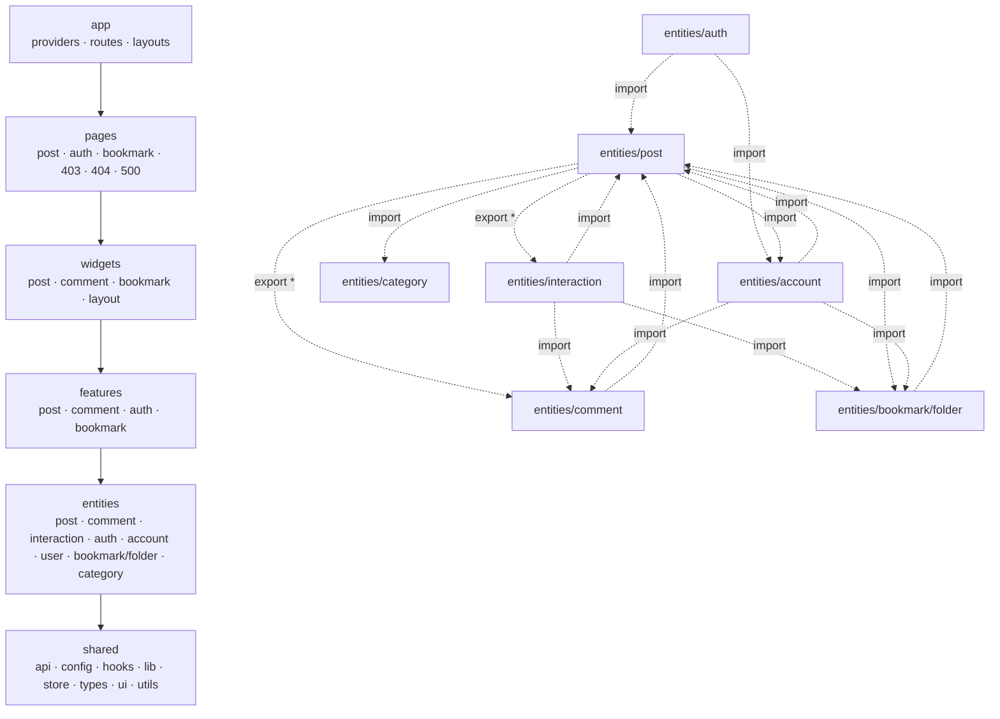

# Link-Sphere FE — Architecture & Pattern Guide

> **문서 성격**: 레퍼런스 — "지금 무엇으로, 왜 이렇게 구성되어 있는가"
>
> **대상 독자**: 이 레포 FE 코드를 처음 보거나, 새 도메인·기능을 추가하기 전에 구조를 확인하려는 개발자
>
> **읽고 나면**: 이 아키텍처가 정식 FSD와 어디가 같고 다른지 알고, 실제 디렉터리 구조·API 3계층
> 패턴·네이밍 컨벤션에 맞춰 코드를 작성할 수 있다.
>
> **마지막 검토**: 2026-09-09

시스템 전체 아키텍처(C4, 배포 파이프라인, FE/BE 구조)는 [SYSTEM-ARCHITECTURE.md](./SYSTEM-ARCHITECTURE.md)를
참고하세요. 기술 스택 목록은 루트 [`README.md`](../README.md#기술-스택)를 참고하세요.

---

## 1. 이 프로젝트의 아키텍처 — FSD 변형

이 프로젝트는 **Feature-Sliced Design(FSD)을 뼈대로 쓰되, FSD의 핵심 규칙 중 하나(Public
API)를 성능을 이유로 정반대로 채택**하고, 그 위에 도메인 그룹핑·3-Layer API 등 여러 패턴을
얹은 변형이다. "FSD를 그대로 쓴다"고 기대하면 두 가지에서 어긋난다 — 슬라이스는 `index.ts`
배럴로 캡슐화되지 않고(import 문자열이 `/index`로 끝나는 배럴 import만 금지 — 디렉터리
암묵 해석으로 진입점을 노출하는 배럴 파일 자체는 존재한다, 예: `src/mocks/handlers/index.ts`),
같은 레이어 안 슬라이스끼리도 자유롭게 서로를 참조한다.

### 조합된 개념

| 개념                                  | 출처                              | 이 레포에서 담당하는 것                                                                         | 대표 위치                                                     |
| ------------------------------------- | --------------------------------- | ----------------------------------------------------------------------------------------------- | ------------------------------------------------------------- |
| FSD (Feature-Sliced Design)           | feature-sliced.design             | 레이어 6종(`app→pages→widgets→features→entities→shared`) + 하향 의존만 허용                     | `eslint.config.js`의 `no-restricted-imports` 5블록(레이어별)  |
| 도메인 우선 슬라이스 그룹핑           | FSD의 "slice group"을 필수 규칙화 | `features/<도메인>/<액션>/`, `widgets/<도메인>/<슬라이스>/` 처럼 한 단계 더 묶음                | `features/post/create/`, `widgets/post/post-card/`            |
| 3-Layer API 분리                      | 이 레포 자체 규약                 | `*.api.ts`(순수 fetch) → `*.keys.ts`(쿼리 키+무효화) → `*.queries.ts`(React Query 훅) 3단 분리  | `entities/post/api/{post.api,post.keys,post.queries}.ts`      |
| Query Key Factory + 중앙 invalidation | TanStack Query 커뮤니티 패턴      | `<entity>Keys`·`<entity>InvalidateQueries`·`handle<Entity><Action>Success`로 캐시 무효화 캡슐화 | §5 참고                                                       |
| Container/Presentational (headless)   | 고전 React 패턴                   | `hooks/`에 폼·mutation·상태 전부, `ui/`는 JSX만                                                 | §6·§7, ESLint `custom-query-rules/no-direct-query-import`     |
| Schema-first (Zod as SSOT)            | schema-first 설계                 | `z.infer`로 타입을 스키마에서 파생 — 런타임 검증과 타입을 한 소스로 유지                        | `entities/*/model/*.schema.ts`                                |
| Atomic Design 변형                    | atoms/molecules 개념              | `shared/ui/atoms`(shadcn 원자) / `elements`(조합) / `layouts` 3단 분류                          | `src/shared/ui/{atoms,elements,layouts}`                      |
| 횡단 관심사 중앙화                    | React Query `meta` 옵션 활용      | 토스트·401 리다이렉트·403 처리를 `mutationCache`/`queryCache` 한 곳에서 처리                    | `src/shared/lib/react-query/config/queryClient.ts`            |
| 상수 단일화                           | —                                 | 문자열·엔드포인트·라우트·에러코드를 각각 하나의 상수 객체로 관리                                | `TEXTS`, `API_ENDPOINTS`, `ROUTES_PATHS`, `SERVER_ERROR_CODE` |

### 정식 FSD와 다른 점

| FSD 규칙                                                          | 채택 여부                               | 이유 / 실태                                                                                                                                                                                                                                                                                                                                       | 강제 수단                                                                                                                                                                                                |
| ----------------------------------------------------------------- | --------------------------------------- | ------------------------------------------------------------------------------------------------------------------------------------------------------------------------------------------------------------------------------------------------------------------------------------------------------------------------------------------------- | -------------------------------------------------------------------------------------------------------------------------------------------------------------------------------------------------------- |
| 레이어 6종 + 하향 의존만 허용                                     | ✅ 채택                                 | FSD 원칙 그대로                                                                                                                                                                                                                                                                                                                                   | ESLint `no-restricted-imports` 5블록 (`eslint.config.js`)                                                                                                                                                |
| Public API — 슬라이스는 `index.ts` 배럴로만 외부에 노출           | ❌ **정반대로 채택** (배럴 자체를 금지) | dev 서버 부팅 15-70%·빌드 28%·콜드스타트 40% 지연이라는 성능 트레이드오프 때문에 의도적으로 뒤집음(수치 출처 미상 — 2026-09-08 확인, 이 레포에서 직접 측정하거나 외부 출처를 링크한 기록 없음. 재검증 전까지 참고용으로만 취급할 것)                                                                                                              | ESLint `custom-barrel-rules/no-barrel-import` (`eslint.config.js`) — import 문자열이 `/index`로 끝날 때 에러(디렉터리 암묵 해석은 예외 — `@/mocks/handlers`처럼 실제로 쓰인다)                           |
| 동일 레이어 슬라이스 격리 (entities는 `@x` 표기로 교차 참조 허용) | ❌ 미채택, 미강제                       | 별도 표기 없이 상시 교차 참조 발생. entities뿐 아니라 features에도 있다 — `features/post/create`가 `features/bookmark/select`를 참조한다(2026-09-09, `BookmarkFolderSelectModal`을 entities에서 이동하며 감수한 트레이드오프, `docs/DECISIONS.md` 참고)                                                                                           | 없음 — `entities/post/model/post.schema.ts:102-103`이 comment·interaction 스키마를 `export *`로 재수출, `entities/interaction/api/interaction.queries.ts:3-8`이 post·comment·folder의 keys를 직접 import |
| 세그먼트는 목적 기준 명명 (`ui`/`api`/`model`/`lib`/`config`)     | ⚠️ 부분 채택                            | `hooks/`·`utils/`를 세그먼트로도 쓴다(`features/*/hooks/`, `widgets/post/post-list/utils/`, 2026-09-08부터 `entities/*/hooks/`·`entities/*/utils/`도) — 정식 FSD 세그먼트명은 아니지만 레이어 전체에서 일관되게 쓰인다. `entities`의 `model/`은 스키마·타입 전용으로 좁혔다(2026-09-08, 근거는 `.claude/CLAUDE.md` "레이어별 허용 세그먼트" 참고) | `.claude/CLAUDE.md`의 "레이어별 허용 세그먼트" 표 (문서 규칙, ESLint 미강제)                                                                                                                             |
| 슬라이스 그룹 폴더 허용 (그룹 폴더 자체엔 공유 코드 금지)         | ✅ 채택                                 | 그룹 폴더(`features/post/`, `widgets/layout/` 등)에는 파일이 없고 슬라이스만 있음                                                                                                                                                                                                                                                                 | —                                                                                                                                                                                                        |

**즉 이 레포에서 실질적으로 강제되는 FSD 규칙은 "레이어 하향 의존" 하나뿐이다.** 나머지는
미채택이거나 성능상의 이유로 정반대로 뒤집혀 있다. 아래 §2가 그 강제 규칙 전체 목록이다.

### 레이어 구조

레이어 간 화살표(실선)는 ESLint로 강제된다. `entities` 슬라이스 간 화살표(점선)는 정식 FSD라면
`@x` 표기 없이는 금지되지만, 이 레포에는 격리 규칙 자체가 없어 실제로 발생한다.



### 정식 FSD로 맞추려면

지금은 아래가 **미채택 상태**다. 채택 여부는 향후 판단할 문제이고, 이 문서는 무엇이 필요한지만
남긴다.

- **Public API 도입**: 각 슬라이스에 `index.ts`를 두고 외부에는 그것만 노출 — 단, 지금
  배럴을 금지한 성능 근거(dev 부팅 지연 등)가 먼저 해소돼야 한다.
- **entities 교차 참조에 `@x` 표기 도입**: `entities/post/@x/comment.ts` 같은 전용 공개 API를
  만들고, 지금처럼 서로의 `model`/`api`를 직접 import하지 않도록 한다.

---

## 2. ESLint가 강제하는 아키텍처 규칙

레이어 하향 의존 외에, 문서 어디에도 안 적혀 있지만 실제로 커밋을 막는 규칙들이다. 아래를
모르고 코드를 쓰면 린트에서 막힌다.

줄 번호는 리팩터링 때마다 바뀌므로 규칙명으로만 가리킨다 — 정확한 위치는
`grep -n "<규칙명>" eslint.config.js`로 직접 찾는다.

| 규칙                                                      | 무엇을 막나                                                                                                                |
| --------------------------------------------------------- | -------------------------------------------------------------------------------------------------------------------------- |
| `custom-barrel-rules/no-barrel-import`                    | `/index`로 끝나는 import (배럴 금지)                                                                                       |
| `custom-query-rules/no-direct-query-import`               | `@tanstack/react-query` 직접 import — 허용목록(`app/**`·`**/api/*.queries.ts`·`**/hooks/**` 등) 밖에서는 금지              |
| `custom-query-rules/no-entity-query-import-outside-hooks` | `features/**`에서 entity 쿼리 훅(`*.queries`) import — `features/**/hooks/**` 밖에서는 금지 (widgets는 대상 아님, §8 참고) |
| `custom-query-rules/no-query-client-singleton-import`     | `queryClient` 싱글턴 직접 import — `QueryProvider.tsx`·`auth.util.ts` 두 곳만 예외                                         |
| `custom-i18n/no-hardcoded-hangul`                         | 한글 UI 문자열 하드코딩 — `TEXTS`만 허용                                                                                   |
| `custom-import/no-sonner-toast-direct-import`             | `sonner` 직접 import — `@/shared/lib/toast/toast` 경유 강제                                                                |
| `custom-import/no-relative-import-except-styles`          | 상대 경로 import(`../`) 금지, `.styles.ts` 파일만 예외                                                                     |
| `no-restricted-syntax` (Zustand)                          | 컴포넌트/훅 내부에서 스토어 `getState()` 직접 호출 금지 — 셀렉터 훅 사용 강제                                              |
| 파일명 규칙                                               | `*.api.ts`·`*.queries.ts`·`*.schema.ts`·`config/`·`utils/` 등 세그먼트별 파일명 패턴                                       |
| `custom-a11y/clickable-needs-interactive-element`         | `div`/`span`에 `onClick`만 달기 — `role="button"` 없이는 금지                                                              |
| `curly` (`['error', 'all']`)                              | 인라인 `if`문 (`if (x) return;`) — 항상 중괄호 블록 강제                                                                   |

---

## 3. Directory Structure

```
src/
├── main.tsx                     # 앱 진입점
├── styled.d.ts, vite-env.d.ts   # 전역 타입 선언
│
├── app/                          # 앱 초기화, providers, routing
│   ├── App.tsx                   # 최상위 App 컴포넌트
│   ├── globals.css               # 디자인 토큰(CSS 변수) + Tailwind 레이어
│   ├── providers/                # AuthProvider, QueryProvider, RouterProvider, ThemeProvider
│   ├── routes/                   # 라우트 설정, ProtectedRoute, RouteErrorBoundary
│   │   └── layouts/              # AppShellLayout, ProtectedLayout, PublicLayout, RootLayout
│   ├── layouts/
│   │   └── app-layout/           # AppLayout — 현재 어디서도 import되지 않는 미사용 컴포넌트
│   └── ui/                       # PostMutationLoadingToast — post/account 뮤테이션 진행 상태
│                                 # 헤드리스 옵저버(여러 entities를 알아야 해서 app에 위치)
│
├── pages/                        # 라우팅 진입점 — widgets/features 조합. 세그먼트 없음
│   ├── post/                     # index(Post), PostDetailPage, PostEditPage, PostSubmitPage
│   ├── auth/                     # LoginPage, SignUpPage
│   ├── bookmark/                 # BookmarkPage
│   ├── 403/                      # ForbiddenPage
│   ├── 404/                      # NotFoundPage
│   └── 500/                      # ServerErrorPage
│
├── widgets/                      # 복합 UI 블록 — 도메인 그룹 → 슬라이스
│   ├── post/
│   │   ├── post-list/
│   │   │   ├── hooks/            # usePostList
│   │   │   ├── ui/               # PostList, PostListSearch, PostCardSkeleton
│   │   │   └── utils/            # search-parser
│   │   └── post-card/
│   │       ├── hooks/            # usePostCard
│   │       └── ui/               # PostCard
│   ├── comment/
│   │   └── comment-list/
│   │       └── ui/               # CommentList, CommentItem
│   ├── bookmark/
│   │   ├── bookmark-post-list/{hooks,ui}  # useBookmarkPostList, BookmarkPostList
│   │   ├── bookmark-search/{hooks,ui}     # useBookmarkSearch, BookmarkSearch
│   │   └── folder-tree/{hooks,ui}         # useFolderTree 외 4개, FolderTree, MobileFolderList
│   └── layout/
│       ├── navbar/
│       │   ├── hooks/            # useRecentSearches, useNavbarSearch
│       │   └── ui/               # Navbar, NavbarSearch, MobileNavbarSearch, RecentSearchPanel
│       ├── bottom-tab-bar/ui/
│       ├── sidebar/ui/
│       └── mypage/ui/            # MyPageModal
│
├── features/                     # 사용자 상호작용 — 도메인 그룹 → 액션 슬라이스
│   ├── post/
│   │   ├── create/{hooks,ui}     # useCreatePost, usePostCreateBookmarkFolderField, CreatePostForm, PostCreateBookmarkFolderField
│   │   ├── update/{hooks,ui}     # useUpdatePost, UpdatePostForm
│   │   ├── delete/hooks          # usePostDelete
│   │   └── like/{hooks,ui}       # useLikePost, LikePostButton
│   ├── comment/
│   │   ├── create/{hooks,ui}     # useCreateComment, CommentForm, MobileCommentBar, ScrollToCommentFormButton
│   │   ├── update/{hooks,ui}     # useUpdateComment, CommentEditForm
│   │   ├── delete/hooks          # useDeleteComment
│   │   └── like/{hooks,ui}       # useLikeComment, LikeCommentButton
│   ├── auth/
│   │   ├── login/{hooks,ui}      # useLogin, LoginForm, LoginModal
│   │   └── signup/{hooks,ui}     # useSignUp, useAvailabilityCheck, SignUpForm
│   ├── account/
│   │   └── update/{hooks,ui}     # useUpdateAccount, UpdateAccountForm
│   └── bookmark/                 # 2026-09-08 post/bookmark에서 승격 — entities/widgets/pages와
│       │                         # bookmark 도메인 그룹을 통일(FSD nukeapp 사례 참고)
│       ├── toggle/{hooks,ui}     # useBookmarkFolders, usePostCardBookmarkFolderModal, BookmarkPostButton,
│       │                         # PostCardBookmarkFolderModal(2026-09-08, entities의
│       │                         # BookmarkFolderSelectModal과 이름이 겹쳐 호출 맥락(PostCard)
│       │                         # 접두사를 붙여 개명)
│       └── select/{hooks,ui}     # useBookmarkFolderSelect, BookmarkFolderSelectModal — toggle·
│                                 # post/create 두 feature가 공유하는 폴더 선택 UI. entities/ui는
│                                 # 시각적 표현만 담아야 하는데 CRUD 인터랙션이라 여기로 이동
│                                 # (features↔features cross-import는 감수, 상세 근거는 DECISIONS.md)
│
├── entities/                     # 비즈니스 엔티티 — data layer + basic display
│   ├── post/
│   │   ├── api/                  # post.api.ts, post.keys.ts, post.queries.ts
│   │   ├── model/                # post.schema.ts (comment·interaction 스키마 re-export 포함)
│   │   └── config/                # post.const.ts (POST_PAGE_SIZE)
│   ├── comment/
│   │   ├── api/                  # comment.api.ts, comment.keys.ts, comment.queries.ts
│   │   ├── model/                # comment.schema.ts
│   │   ├── utils/                # comment.util.ts (estimateCommentPayloadBytes)
│   │   └── config/                # comment.const.ts (MAX_COMMENT_CONTENT_BYTES 외)
│   ├── interaction/
│   │   ├── api/                  # interaction.api.ts, interaction.queries.ts (keys.ts 없음 — post/comment/folder keys 직접 사용)
│   │   └── model/                # interaction.schema.ts
│   ├── bookmark/                 # entities 최초의 그룹 폴더 — folder라는 이름만으로 북마크
│   │   │                         # 폴더인지 불분명했던 문제를 features/widgets와 같은 방식으로 해소
│   │   └── folder/
│   │       ├── api/              # bookmark-folder.api.ts, bookmark-folder.keys.ts, bookmark-folder.queries.ts
│   │       ├── model/            # bookmark-folder.schema.ts
│   │       ├── config/           # bookmark-folder.const.ts (RECENT_BOOKMARK_FOLDER_COUNT 외)
│   │       ├── utils/            # bookmark-folder.util.ts (pickRecentFolders)
│   │       └── hooks/            # useRecentBookmarkFolders.ts (다른 소비처가 있는 순수 데이터 파생 훅만
│   │                             # entities에 남는다 — 인터랙션 UI는 features/bookmark/select/로 이동)
│   ├── category/
│   │   ├── api/                  # category.api.ts, category.keys.ts, category.queries.ts
│   │   ├── model/                # category.schema.ts
│   │   └── hooks/                 # useCategoryOptions — 등록·수정 폼 + 목록 검색 카드가 공유
│   ├── auth/                     # 인증(로그인·로그아웃·회원가입·세션) 전용
│   │   ├── api/                  # auth.api.ts, auth.keys.ts, auth.queries.ts
│   │   ├── model/                # auth.schema.ts (loginSchema, createAccountSchema 등)
│   │   └── hooks/                 # useAuth, useAppInitialization, useAuthGuard, useProtectedNavigate
│   ├── account/                  # 내 계정 프로필(닉네임·이미지·이메일) 조회·수정 전용
│   │   ├── api/                  # account.api.ts, account.keys.ts, account.queries.ts
│   │   ├── model/                # account.schema.ts (accountSchema, updateAccountSchema 등)
│   │   └── hooks/                 # useAccount
│   └── user/                     # 공개 사용자 표현 전용(게시글·댓글 작성자 등, 데이터 조회 없음)
│       └── ui/                   # UserAvatar
│
└── shared/                       # 순수 유틸, UI 원자, API client, config
    ├── api/
    │   ├── client.ts             # HTTP 클라이언트 (apiClient) — fetch 기반, axios 아님
    │   └── upload.api.ts         # uploadApi — 서명 URL 발급 + PUT 요청 함수
    ├── config/
    │   ├── texts.ts               # 모든 UI 문자열 (TEXTS)
    │   ├── api.ts                 # 모든 API 엔드포인트 (API_ENDPOINTS)
    │   ├── route-paths.ts         # 라우트 경로 상수 (ROUTES_PATHS)
    │   ├── nav-items.ts
    │   ├── storage-keys.ts
    │   ├── const.ts
    │   └── error-code.ts          # SERVER_ERROR_CODE
    ├── hooks/                     # 재사용 훅 (useToggle, useDebounce, useIntersectionObserver, usePullToRefresh 등)
    ├── lib/
    │   ├── react-query/
    │   │   ├── config/queryClient.ts   # 중앙 QueryClient 인스턴스
    │   │   └── utils/hooks.ts          # React Query 관련 재사용 훅
    │   ├── toast/toast.ts         # sonner 래퍼 (직접 import 금지, 이걸 통해서만 사용)
    │   ├── upload/uploadImageAndGetUrl.ts  # 리사이즈 + uploadApi 조합 편의 함수
    │   ├── firebase/, image/, content/, react-table/, router/
    │   └── tailwind/utils.ts      # cn() helper
    ├── store/                     # appVersion, auth, hideBots, loginModal, mypage, sidebar, unsavedChanges (.store.ts)
    ├── types/
    │   └── common.type.ts
    ├── ui/
    │   ├── atoms/                 # CVA 기반 Shadcn 기본 컴포넌트
    │   ├── elements/              # 조합 컴포넌트 (MarkdownContent 포함)
    │   │   ├── form/
    │   │   ├── modal/{alert,image-viewer}/
    │   │   └── modal/SheetDialogContent.tsx
    │   └── layouts/                # AuthLayout, ErrorLayout
    └── utils/                     # auth, common, date, error, file, form, storage, url, version (.util.ts)
```

레이어에 속하지 않는 최상위 디렉터리도 있다 — `src/mocks/`(MSW `handlers/`·`fixtures/`),
`src/test/`(Vitest `setup.ts`·`utils.tsx`), `src/types/`(전역 타입 선언), `src/main.tsx`(앱
진입점). ESLint `no-restricted-imports` 5블록(`eslint.config.js:1000-1122`)은
`shared`/`entities`/`features`/`widgets`/`pages` 5개 레이어 디렉터리만 `files`로 잡아 이
넷은 대상 밖이다(2026-09-09 문서-코드 정합성 감사 중 재확인) — `mocks`·`types`는 실제로
상위 레이어를 import하는 코드가 없고, `main.tsx`가 `@/app/*`를 import하는 건 진입점이
최상위 레이어(app)를 부트스트랩하는 정상 패턴이라 애초에 레이어 규칙 대상이면 안 된다.

---

## 4. 현재 Entities & Widgets

| Entity        | 위치                        | 설명                               |
| ------------- | --------------------------- | ---------------------------------- |
| `post`        | `entities/post/`            | 포스트 CRUD + 쿼리                 |
| `comment`     | `entities/comment/`         | 댓글 CRUD + 쿼리                   |
| `interaction` | `entities/interaction/`     | like/bookmark optimistic update    |
| `folder`      | `entities/bookmark/folder/` | 북마크 폴더 CRUD + 쿼리            |
| `category`    | `entities/category/`        | 카테고리 옵션 조회                 |
| `auth`        | `entities/auth/`            | 로그인·로그아웃·회원가입·세션 복원 |
| `account`     | `entities/account/`         | 내 계정 프로필 조회·수정           |
| `user`        | `entities/user/`            | 공개 사용자 표현(UserAvatar)       |

| Widget               | 위치                                   | 설명                                          |
| -------------------- | -------------------------------------- | --------------------------------------------- |
| `post-list`          | `widgets/post/post-list/`              | 포스트 목록 (무한스크롤 + 검색)               |
| `post-card`          | `widgets/post/post-card/`              | 포스트 카드 (모든 액션: like, bookmark, 관리) |
| `comment-list`       | `widgets/comment/comment-list/`        | 댓글 목록 (댓글 아이템 + 생성 폼)             |
| `navbar`             | `widgets/layout/navbar/`               | 네비게이션 바                                 |
| `bottom-tab-bar`     | `widgets/layout/bottom-tab-bar/`       | 모바일 하단 탭바                              |
| `sidebar`            | `widgets/layout/sidebar/`              | 사이드바                                      |
| `mypage`             | `widgets/layout/mypage/`               | 마이페이지 모달                               |
| `bookmark-post-list` | `widgets/bookmark/bookmark-post-list/` | 북마크 포스트 목록                            |
| `bookmark-search`    | `widgets/bookmark/bookmark-search/`    | 북마크 내 검색                                |
| `folder-tree`        | `widgets/bookmark/folder-tree/`        | 폴더 트리 / 모바일 폴더 목록                  |

---

## 5. 3-Layer API 패턴

**절대로 레이어를 건너뛰거나 합치지 않는다.**

**예외 — 실시간 중복확인(디바운스형 유효성 검사)**: `features/auth/signup/hooks/useAvailabilityCheck.ts`,
`features/account/update/hooks/useUpdateAccount.ts`의 닉네임·이메일 중복확인은 Layer 1
(`accountApi.checkNicknameAvailability`, `authApi.checkEmailAvailability`)을 Layer 3 없이
직접 호출한다(2026-09-09 문서-코드 정합성 감사 중 확인). React Query의 `useQuery`가 캐싱을
전제하는데, 이 검증은 매 입력마다 새로 확인해야 하고 결과를 캐시하면 안 되며 디바운스·
요청 취소(`cancelled` flag)·자체 상태머신(`idle/checking/available/duplicate`)이 핵심이라
캐싱 모델과 안 맞는다 — Layer 3로 억지로 감싸는 것보다 Layer 1 직접 호출이 더 단순하다.
뮤테이션(계정 생성·수정)은 두 파일 모두 정상적으로 Layer 3(`useCreateAccountMutation`,
`useUpdateAccountMutation`)를 거친다 — 이 예외는 "실시간 검증"에만 한정된다.

### Layer 1 — `<entity>.api.ts` (순수 async, React 없음)

```typescript
import { apiClient } from '@/shared/api/client';
import { API_ENDPOINTS } from '@/shared/config/api';

export const entityApi = {
  createEntity: async (payload: CreateEntity): Promise<Entity> =>
    apiClient.post<Entity>(API_ENDPOINTS.domain.base, payload),

  fetchEntity: async (id: string): Promise<Entity> =>
    apiClient.get<Entity>(`${API_ENDPOINTS.domain.base}/${id}`),

  updateEntity: async (id: string, payload: UpdateEntity): Promise<Entity> =>
    apiClient.patch<Entity>(`${API_ENDPOINTS.domain.base}/${id}`, payload),

  deleteEntity: async (id: string): Promise<void> =>
    apiClient.delete<void>(`${API_ENDPOINTS.domain.base}/${id}`),
};
```

### Layer 2 — `<entity>.keys.ts` (쿼리 키 + success handlers)

`.keys.ts`는 React를 모르는 순수 모듈이다 — `QueryClient` 인스턴스를 자기가 들고 있지 않고
**호출자(Layer 3의 훅)가 넘긴 것을 쓴다**. 그래야 provider가 주입한 클라이언트와 항상 같은
인스턴스를 만지고(테스트가 격리된 `createTestQueryClient()`를 써도 캐시 갱신이 싱글턴으로
새지 않는다), `.keys.ts`가 `@/shared/lib/react-query/config/queryClient` 싱글턴에 의존하지
않는다.

```typescript
import type { QueryClient } from '@tanstack/react-query';

const rootKey = ['entity'] as const;

export const entityKeys = {
  root: rootKey,
  listRoot: [...rootKey, 'list'] as const,
  list: (filters?: Record<string, unknown>) => [...rootKey, 'list', filters] as const,
  detail: (id: Entity['id']) => [...rootKey, 'detail', id] as const,
};

export const entityInvalidateQueries = {
  all: (queryClient: QueryClient) => queryClient.invalidateQueries({ queryKey: rootKey }),
  list: (queryClient: QueryClient) =>
    queryClient.invalidateQueries({ queryKey: entityKeys.listRoot }),
  detail: (queryClient: QueryClient, id: Entity['id']) =>
    queryClient.invalidateQueries({ queryKey: entityKeys.detail(id) }),
};

export const handleEntityCreateSuccess = (queryClient: QueryClient) => {
  entityInvalidateQueries.list(queryClient);
};
export const handleEntityUpdateSuccess = (queryClient: QueryClient, id: Entity['id']) => {
  entityInvalidateQueries.detail(queryClient, id);
  entityInvalidateQueries.list(queryClient);
};
```

#### 크로스 엔티티 무효화 (다른 엔티티 캐시까지 갱신해야 할 때)

다른 엔티티의 캐시도 함께 갱신해야 하면, 그 엔티티가 공개한 `<entity>InvalidateQueries.xxx()`
래퍼만 import해서 부른다. 그 엔티티의 raw 쿼리 키를 재구성해서 `queryClient.invalidateQueries`를
직접 호출하지 않는다(캡슐화가 깨지고, 그 엔티티의 키 구조가 바뀌면 여기도 같이 고쳐야 한다).
같은 `queryClient` 인스턴스를 그대로 다음 호출에 넘긴다.

```typescript
// entities/comment/api/comment.keys.ts
import type { QueryClient } from '@tanstack/react-query';
import { postInvalidateQueries } from '@/entities/post/api/post.keys';

export const handleCommentCreateSuccess = (queryClient: QueryClient, postId: Post['id']) => {
  // 댓글 목록은 mutation의 onMutate/onSuccess가 낙관적으로 직접 갱신하므로 여기서 다시
  // invalidate하지 않는다 - 그러면 방금 그려진 결과를 지우고 GET을 한 번 더 태우게 된다.
  // commentCount가 걸린 게시글 상세/목록만 갱신한다.
  postInvalidateQueries.detail(queryClient, postId); // 댓글 수가 반영되는 포스트 상세
  postInvalidateQueries.list(queryClient); // 목록의 댓글 수 배지
};
```

`handle<Event>Success`가 어느 엔티티의 `.keys.ts`에 사는지는 "어떤 이벤트가 트리거인가"가
아니라 "어떤 캐시가 영향받는가"로 정한다 — 트리거가 다른 엔티티(post 삭제, 좋아요/북마크
토글)여도 영향받는 캐시를 소유한 엔티티(folder)가 핸들러를 호스팅할 수 있다
(`bookmark-folder.keys.ts`의 `handlePostDeleteSuccess`, `handleBookmarkToggleSuccess`). 참고
파일: `comment.keys.ts`, `bookmark-folder.keys.ts`, `account.keys.ts`(`handleAccountUpdateSuccess`),
`auth.keys.ts`(`handleAuthRestoreSuccess`).

### Layer 3 — `<entity>.queries.ts` (얇은 React Query 래퍼)

```typescript
import { useMutation, useQuery, useQueryClient } from '@tanstack/react-query';
import { entityApi } from '@/entities/<entity>/api/entity.api';
import { entityKeys, handleEntityCreateSuccess } from '@/entities/<entity>/api/entity.keys';
import { TEXTS } from '@/shared/config/texts';

export const useCreateEntityMutation = () => {
  const queryClient = useQueryClient();

  return useMutation({
    mutationFn: (payload: CreateEntity) => entityApi.createEntity(payload),
    meta: {
      successMessage: TEXTS.messages.success.entityCreated,
      errorMessage: TEXTS.messages.error.entityCreateFailed,
    },
    onSuccess: () => handleEntityCreateSuccess(queryClient),
  });
};

export const useFetchEntityQuery = (id: string) =>
  useQuery({
    queryKey: entityKeys.detail(id),
    queryFn: () => entityApi.fetchEntity(id),
    enabled: !!id,
  });
```

> 예외: `entities/interaction/`은 `keys.ts`가 없다 — 자체 캐시 키를 갖지 않고
> `entities/{post,comment,folder}/api/*.keys.ts`의 키·invalidation을 직접 가져다 쓴다
> (`interaction.queries.ts:3-8`). §1 "정식 FSD와 다른 점"의 entities 교차 참조 사례이기도 하다.

---

## 6. Feature Hook 패턴

feature hook = 모든 비즈니스 로직. UI 파일은 훅을 호출하고 JSX만 렌더링.

```typescript
// features/<도메인>/<액션>/hooks/use<FeatureName>.ts
export function useCreateEntity() {
  const navigate = useNavigate();
  const { mutateAsync: createEntity, isPending: isCreating } = useCreateEntityMutation();

  const form = useForm<CreateEntity>({
    resolver: zodResolver(createEntitySchema),
    defaultValues: { name: '' },
    mode: 'onChange',
  });

  const onSubmit = form.handleSubmit(async (data) => {
    try {
      await createEntity(data, {
        onSuccess: () => {
          form.reset();
          navigate(ROUTES_PATHS.ENTITY.ROOT);
        },
      });
    } catch (error) {
      console.error(error);
    }
  });

  return { form, onSubmit, isCreating };
}
```

조회가 필요하면 슬라이스 자신의 `hooks/` 커스텀 훅이나 `entities/<entity>/hooks/`의 공용 훅(여러
슬라이스가 같은 조회를 공유할 때, 예: `useCategoryOptions`)에서 한다 — features에는 예외를 두지
않는다(§8의 "query 1개 + trivial 파생" 예외는 widgets 한정). `custom-query-rules/no-entity-query-import-outside-hooks`가
`features/**/hooks/**` 밖에서 entity `*.queries` 모듈 import를 막아 강제한다.

---

## 7. UI Component 패턴 (얇은 레이어)

UI가 직접 호출해도 되는 훅은 세 종류다: 자기 feature의 `hooks/` 커스텀 훅, `entities/<entity>/hooks/`의
공용 훅(예: `useCategoryOptions`, `useAccount`), `shared/hooks/`의 범용 훅. entity의 `*.queries.ts`가
내보내는 React Query 훅을 UI가 직접 부르는 것은 §6의 규칙 위반이다(ESLint로 강제).

```typescript
// features/<도메인>/<액션>/ui/<FeatureName>Form.tsx
export function CreateEntityForm() {
  const { form, onSubmit, isCreating } = useCreateEntity();
  const { isDirty, isValid } = form.formState;
  const canSubmit = isDirty && isValid && !isCreating;

  return (
    <FormProvider {...form}>
      <form onSubmit={onSubmit} noValidate>
        <FormInput name="name" label={TEXTS.entity.form.create.nameLabel} required disabled={isCreating} />
        <Button type="submit" disabled={!canSubmit}>
          {isCreating ? TEXTS.common.submitting : TEXTS.entity.form.create.submit}
        </Button>
      </form>
    </FormProvider>
  );
}
```

---

## 8. Widget Hook 패턴

widget hook = 여러 entity query 조합 + UI 블록 특화 파생 상태. 뮤테이션 로직은 포함하지 않는다.

```typescript
// widgets/<domain>/<widget>/hooks/use<Widget>.ts — 패턴을 보여주는 간소화 예시(실제 이름
// 아님). 실제 참조 구현은 src/widgets/post/post-list/hooks/usePostList.ts — URL 파라미터
// 관리·로컬 필터 병합·IntersectionObserver까지 포함해 이 예시보다 훨씬 복잡하다.
export function useExampleWidget(filter: EntityFilter) {
  const { data, isFetchingNextPage, hasNextPage, fetchNextPage } =
    useSuspenseFetchEntityListQuery(filter);

  const items = data?.pages.flatMap((page) => page.content) ?? [];

  return { items, isFetchingNextPage, hasNextPage, fetchNextPage };
}
```

widget hook이 **불필요한 경우**: entity query 1개 + trivial 파생만이면 컴포넌트에서 직접 사용한다.
**widgets 한정** — features는 §6에 예외가 없다. 이 판단은 "파생이 trivial한가"라는 사람 판단이라
ESLint로 강제하지 않는다(파일 단위로 강제하면 그 파일에 앞으로 들어올 모든 쿼리가 영구 면제된다) —
`/code-review`와 PR 리뷰로 지킨다.

- 예외 해당 (그대로 둔 예): `widgets/comment/comment-list/ui/CommentItem.tsx`가
  `useFetchAccountQuery()`를 직접 호출한다 — 이 쿼리에서 나오는 파생은 `isOwner` 불리언
  하나뿐이고, 파일의 나머지 파생(`isPostAuthor`·`isDeleted` 등)은 props 파생이라 이 쿼리와
  무관하다. 참고로 여기를 이미 entity 훅이 있는 `useAccount()`로 바꾸는 건 안 된다 —
  `persistLastAvatar` localStorage 부수효과가 댓글 개수만큼 실행된다.
- 예외 해당 안 됨: 같은 위젯의 `CommentList.tsx`는 정렬·재귀 집계(톰스톤 포함 댓글 수)·파생
  2개가 있어 widget hook으로 빼야 한다(`usePostList`의 `flatMap` 파생이 같은 이유의 선례).
  2026-09-09 기준 아직 안 뺀 상태로 남아 있다 — 별건 리팩터링으로 취급해 범위 밖에 뒀다.

---

## 9. Zod Schema 패턴

```typescript
// entities/<entity>/model/<entity>.schema.ts
export const entitySchema = z.object({
  id: z.string(),
  name: z.string().min(1, TEXTS.validation.nameRequired),
  content: z.string().nullable(), // nullable: null 허용, undefined 불가
  image: z.string().optional(), // optional: undefined 허용, null 불가
  createdAt: z.coerce.date(), // 날짜 필드는 z.coerce.date() 사용
});

export const createEntitySchema = z.object({ name: z.string().min(1) });
export const updateEntitySchema = z.object({ name: z.string().min(1) });

export type Entity = z.infer<typeof entitySchema>;
export type CreateEntity = z.infer<typeof createEntitySchema>;
export type UpdateEntity = z.infer<typeof updateEntitySchema>;
```

---

## 10. Delete with Confirm 패턴

**절대로** native `confirm()` 사용 금지. 항상 `useAlert` + `openConfirm` 사용.

```typescript
import { useAlert } from '@/shared/ui/elements/modal/alert/alert.store';

const { openConfirm } = useAlert();
const onDelete = (id: string) => {
  openConfirm({
    message: TEXTS.messages.warning.entityDeleteConfirm,
    confirmText: TEXTS.buttons.delete,
    onConfirm: async () => {
      await deleteEntity(id);
    },
  });
};
```

---

## 11. Optimistic Update 패턴

참조: `src/entities/interaction/api/interaction.queries.ts` (`useLikePostMutation`)

```typescript
const queryClient = useQueryClient(); // 훅 최상단 — mutation 콜백들이 이 클로저를 공유한다

// ...
onMutate: async () => {
  await queryClient.cancelQueries({ queryKey: entityKeys.detail(id) });
  const previous = queryClient.getQueryData<Entity>(entityKeys.detail(id));
  queryClient.setQueryData<Entity>(entityKeys.detail(id), (old) =>
    old ? { ...old, isLiked: !old.isLiked } : old
  );
  return { previous };
},
onSuccess: () => {},
onError: (_err, _vars, context) => {
  queryClient.setQueryData(entityKeys.detail(id), context?.previous);
},
```

목록(InfiniteData)까지 함께 업데이트:

```typescript
queryClient.setQueriesData<InfiniteData<EntityListResponse>>(
  { queryKey: entityKeys.listRoot },
  (oldData) => {
    if (!oldData) return oldData;
    return {
      ...oldData,
      pages: oldData.pages.map((page) => ({
        ...page,
        content: page.content.map((item) =>
          item.id === id ? { ...item, isLiked: !item.isLiked } : item
        ),
      })),
    };
  }
);
```

---

## 12. React Query 설정

`src/shared/lib/react-query/config/queryClient.ts`

| 설정       | 값                         |
| ---------- | -------------------------- |
| Stale Time | 3분 (`3 * 60 * 1000`)      |
| GC Time    | 5분 (`5 * 60 * 1000`)      |
| Retry      | 실패 시 1회 재시도         |
| Refetch    | 윈도우 포커스 및 마운트 시 |

싱글턴 `queryClient`는 `QueryProvider`가 마운트 시 한 번 `QueryClientProvider`에 주입하고,
그 아래 앱 코드는 전부 `useQueryClient()`로 그 인스턴스를 Context에서 꺼내 쓴다(같은
인스턴스이므로 프로덕션 동작은 동일 — 테스트에서 격리된 클라이언트를 주입할 수 있게 하려는
목적이다). 싱글턴을 직접 import하는 예외는 두 곳뿐이다:

| 파일                                  | 왜 예외인가                                                                                                                      |
| ------------------------------------- | -------------------------------------------------------------------------------------------------------------------------------- |
| `src/app/providers/QueryProvider.tsx` | 싱글턴을 provider에 주입하는 유일한 지점                                                                                         |
| `src/shared/utils/auth.util.ts`       | `clearAll()`/`clearQueries()`가 fetch 인터셉터·전역 캐시 에러 핸들러(React 트리 밖)에서 호출되어 `useQueryClient()`를 쓸 수 없다 |

`.keys.ts`처럼 React 훅을 쓸 수 없는 순수 모듈은 `useQueryClient()`로 얻은 인스턴스를 호출자가
인자로 넘긴다(§5 Layer 2 참고).

---

## 13. 에러 핸들링 전략

### 전역 에러 핸들링

전역 에러 핸들러는 `queryClient.ts` 내의 `mutationCache`와 `queryCache`에 정의:

- **401 (`NOT_LOGGED_IN` / `INVALID_TOKEN`)**: `AuthUtil.clearAll()` 후 `/auth/login`으로
  리다이렉트 + 로그인 필요 토스트. 단, 로그아웃 처리 중(`AuthUtil.isLoggingOut()`)의 401은
  세션 만료가 아니라 `clearQueries`로 인한 배경 재요청 레이스이므로 무시한다
- **403 (`ACCESS_DENIED`)**: 접근 거부 토스트만 표시
- **그 외 `ApiError`**: 콘솔에 상세 로깅 + 사용자에게는 일반적인 "서버 에러" 토스트
- **알 수 없는 에러**: 콘솔에 로깅 + 일반적인 에러 토스트

### 수동 에러 핸들링 (`manualErrorHandling`)

```typescript
const { mutate } = useMutation({
  mutationFn: someApiFunction,
  meta: { manualErrorHandling: true },
  onError: (error) => {
    if (error instanceof ApiError && error.status === 409) {
      form.setError('email', { message: '이미 존재하는 이메일입니다' });
    }
  },
});
```

---

## 14. Toast 알림 (Sonner)

Sonner를 직접 import하지 않는다 — ESLint `custom-import/no-sonner-toast-direct-import`가
막는다. 항상 래퍼 `@/shared/lib/toast/toast`의 `toast`를 사용한다 (성공/액션 확인은
하단, 오류/경고는 상단으로 위치를 분리해서 정책을 캡슐화하고 있다).

- **에러**: 전역 에러 핸들러가 자동으로 트리거
- **성공**: `meta.successMessage` 추가 시 자동 트리거

---

## 15. Mutation/Query Meta 옵션

| 키                    | 타입      | 효과                                                    |
| --------------------- | --------- | ------------------------------------------------------- |
| `successMessage`      | `string`  | 자동으로 성공 토스트 표시                               |
| `errorMessage`        | `string`  | 기본 대신 커스텀 에러 토스트 표시                       |
| `manualErrorHandling` | `boolean` | 전역 에러 토스트 억제 (form 필드에 에러 매핑할 때 사용) |

---

## 16. Form 컴포넌트 구조

`src/shared/ui/elements/form/`

| 컴포넌트               | 용도                                                       |
| ---------------------- | ---------------------------------------------------------- |
| `FormField` (`_base/`) | 레이블, 설명, 에러 메시지 관리 (모든 form 컴포넌트의 기반) |
| `FormInput`            | 일반 텍스트 입력 필드                                      |
| `FormInputPassword`    | 비밀번호 입력 필드 (토글 표시)                             |
| `FormCheckbox`         | 단일 체크박스                                              |
| `FormCheckboxGroup`    | 체크박스 그룹                                              |

---

## 17. 핵심 설정 파일 위치

| 목적                 | 파일                                                | export                 |
| -------------------- | --------------------------------------------------- | ---------------------- |
| 모든 UI 문자열       | `src/shared/config/texts.ts`                        | `TEXTS`                |
| API 엔드포인트       | `src/shared/config/api.ts`                          | `API_ENDPOINTS`        |
| 라우트 경로          | `src/shared/config/route-paths.ts`                  | `ROUTES_PATHS`         |
| HTTP 클라이언트      | `src/shared/api/client.ts`                          | `apiClient`            |
| QueryClient          | `src/shared/lib/react-query/config/queryClient.ts`  | `queryClient`          |
| Toast 래퍼           | `src/shared/lib/toast/toast.ts`                     | `toast`                |
| Alert/Confirm 모달   | `src/shared/ui/elements/modal/alert/alert.store.ts` | `useAlert`             |
| Auth 스토어          | `src/shared/store/auth.store.ts`                    | `useAuthStore`         |
| 이미지 업로드 요청   | `src/shared/api/upload.api.ts`                      | `uploadApi`            |
| 리사이즈+업로드 조합 | `src/shared/lib/upload/uploadImageAndGetUrl.ts`     | `uploadImageAndGetUrl` |

---

## 18. 네이밍 컨벤션

| 항목                          | 규칙                                                                                                                                                                                                                                                                                                                                  | 예시                                        |
| ----------------------------- | ------------------------------------------------------------------------------------------------------------------------------------------------------------------------------------------------------------------------------------------------------------------------------------------------------------------------------------- | ------------------------------------------- |
| Feature 디렉토리              | `<도메인>/<액션>` kebab-case                                                                                                                                                                                                                                                                                                          | `post/create/`                              |
| Widget 디렉토리               | `<도메인>/<슬라이스>` kebab-case                                                                                                                                                                                                                                                                                                      | `post/post-card/`                           |
| Shared 디렉토리               | camelCase                                                                                                                                                                                                                                                                                                                             | `hooks/`, `utils/`                          |
| 컴포넌트 파일                 | PascalCase.tsx                                                                                                                                                                                                                                                                                                                        | `CreatePostForm.tsx`                        |
| Feature 훅                    | `use<FeatureName>.ts`                                                                                                                                                                                                                                                                                                                 | `useCreatePost.ts`                          |
| Mutation 훅                   | `use<Action><Entity>Mutation`                                                                                                                                                                                                                                                                                                         | `useCreatePostMutation`                     |
| Query 훅                      | `useFetch<Entity>Query` (표준). 기존 코드엔 `use<Entity>s`(`useComments`), `use<Entity>ListQuery`(`useBookmarkFolderListQuery`), `use<Entity>InfiniteQuery`(`useBookmarkFolderPostsInfiniteQuery`)도 있다 — 새로 만들 땐 표준형을 쓴다                                                                                                | `useFetchPostDetailQuery`                   |
| 쿼리 키 객체                  | `<entity>Keys`                                                                                                                                                                                                                                                                                                                        | `postKeys`                                  |
| Invalidate 헬퍼               | `<entity>InvalidateQueries`                                                                                                                                                                                                                                                                                                           | `postInvalidateQueries`                     |
| Success 핸들러                | `handle<Entity><Action>Success`                                                                                                                                                                                                                                                                                                       | `handlePostCreateSuccess`                   |
| API 객체                      | `<entity>Api`                                                                                                                                                                                                                                                                                                                         | `postApi`                                   |
| Zod 스키마                    | `<entity>Schema`, `create<Entity>Schema`                                                                                                                                                                                                                                                                                              | `postSchema`, `createPostSchema`            |
| TS 타입                       | 스키마와 동일 (PascalCase)                                                                                                                                                                                                                                                                                                            | `Post`, `CreatePost`                        |
| `config/` 파일                | `<entity>.const.ts` — `api/`·`model/`·`utils/`와 같은 `<entity>.<역할>.ts` 규칙(`const.ts` 단독 금지, `shared/config/const.ts`처럼 도메인이 없는 전역 설정은 예외). `<entity>`는 **엔티티명**이지 디렉터리 세그먼트명이 아니다 — 그룹 폴더(`entities/bookmark/folder/`) 아래에서도 파일 접두사는 엔티티명(`bookmark-folder`)을 따른다 | `bookmark-folder.const.ts`, `post.const.ts` |
| `<Entity>[]` 배열 변수/반환값 | `<entity>List` — 지역변수·훅 반환 필드·구조분해값이 실제로 배열일 때. 아래 각주의 예외 2가지는 대상 아님                                                                                                                                                                                                                              | `folderList`                                |

**`<entity>List` 각주** (2026-09-08) — "단수/복수"가 아니라 "배열인가 아닌가"로
가른다. BE 응답 계약과 매핑된 이름(`BookmarkFolderListResponse`, `useBookmarkFolderListQuery`,
`fetchBookmarkFolderList`, `<entity>Keys.list` 등 — `bookmark-folder.schema.ts`의 "BE
FolderListResponse 와 매핑" 주석 참고)과, 배열이 아니라 동작·응답 객체·불리언이라
복수형이 그 자체로 맞는 이름(`BookmarkFoldersResponse`, `ReorderBookmarkFoldersRequest`,
`useBookmarkFolders`, `wasInFolders`, `clearBookmarkFolders`, `postFolders`
엔드포인트 등)은 이 규칙 대상이 아니다 — 그대로 복수형을 쓴다.

---

## 19. 개발 커맨드

```bash
pnpm dev            # 개발 서버 (port 31119, localhost 모드)
pnpm build          # TypeScript 컴파일 + Vite 빌드
pnpm type-check     # TypeScript 타입 검사 (tsc -b --noEmit)
pnpm lint           # ESLint 검사 (--max-warnings 0)
pnpm lint:fix       # ESLint 자동 수정
pnpm format         # Prettier 포맷
pnpm format:check   # Prettier 검사만
pnpm check          # type-check + lint + format:check 일괄
pnpm check:fix      # lint:fix + format + type-check
pnpm test           # Vitest 테스트 실행 (CI)
pnpm test:watch     # Vitest 테스트 감시 모드
pnpm test:coverage  # 커버리지 리포트
pnpm storybook      # Storybook (port 6006)
```

---

## 20. 클릭 가능한 요소와 커서 규칙

`src/app/globals.css`의 `@layer base`에서 전역으로 처리한다 — 개별 컴포넌트에
`cursor-pointer`를 직접 붙이지 않는다. 배경은 `docs/DECISIONS.md`의 2026-09-03
항목 참고.

### 자동으로 pointer가 붙는 대상

| 분류       | 대상                                                                                                              |
| ---------- | ----------------------------------------------------------------------------------------------------------------- |
| 태그       | `button`, `summary`, `select`, `input[type=checkbox\|radio\|file]`                                                |
| ARIA role  | `button`, `link`, `menuitem`, `menuitemcheckbox`, `menuitemradio`, `option`, `tab`, `switch`, `checkbox`, `radio` |
| 형제 label | `[role=checkbox]`/`[role=radio]` 바로 뒤의 `label` (예: `FormCheckbox`, `FormCheckboxGroup`)                      |

`:disabled` / `aria-disabled="true"` / `[data-disabled]`는 제외된다 — 비활성 버튼·메뉴
항목은 그대로 `default` 커서를 유지한다.

### 새 컴포넌트를 만들 때

1. `Button`(`shared/ui/atoms/button.tsx`) 또는 raw `<button>`을 쓴다 → 아무것도 안 해도 pointer가 붙는다.
2. Radix 프리미티브를 새로 감쌀 때는 그 프리미티브가 `button`이나 위 role을 렌더링하는지
   확인한다(Radix 소스에서 확인 가능) → 대부분 자동으로 커버된다.
3. 불가피하게 `div`/`span`에 `onClick`을 달아야 하면 `role="button"`을 반드시 함께
   지정한다. ESLint `custom-a11y/clickable-needs-interactive-element`(`eslint.config.js`)가
   이를 강제한다 — `role`도 `aria-hidden="true"`도 없이 `onClick`만 달면 린트가 막는다.
4. 클릭이 아니라 포인터 오버로 발생하는 어포던스(예: `SelectScrollUpButton`/
   `SelectScrollDownButton`의 자동 스크롤)는 대상이 아니다 — `cursor-default`를 유지한다.

### shadcn 컴포넌트 재생성 시 주의

`dropdown-menu.tsx`(`SubTrigger`/`Item`/`CheckboxItem`/`RadioItem`)와 `select.tsx`
(`SelectItem`)는 shadcn 기본값(`cursor-default`)을 의도적으로 제거해뒀다. shadcn
CLI로 이 컴포넌트를 다시 생성하면 `cursor-default`가 되돌아오므로, 재생성 후 해당
클래스를 다시 지워야 한다.

---

## 21. 체크리스트: 기존 엔티티에 새 기능 추가

- [ ] `entities/<entity>/model/<entity>.schema.ts` — Zod 스키마 + 타입 추가/확인
- [ ] `entities/<entity>/api/<entity>.api.ts` — API 함수 추가
- [ ] `entities/<entity>/api/<entity>.keys.ts` — 쿼리 키, invalidation, success handler 추가
- [ ] `entities/<entity>/api/<entity>.queries.ts` — React Query 훅 추가
- [ ] `src/shared/config/texts.ts` — 새 TEXTS 키 추가 (success/error/warning 메시지)
- [ ] `src/shared/config/api.ts` — 새 API_ENDPOINTS 추가
- [ ] `features/<도메인>/<액션>/hooks/use<FeatureName>.ts` — 비즈니스 로직
- [ ] `features/<도메인>/<액션>/ui/<FeatureName>.tsx` — 얇은 UI
- [ ] `src/pages/<page>/` 페이지에 연결

## 22. 체크리스트: 새 Entity/Widget 추가

- [ ] 위 "새 기능 추가" 체크리스트 전부
- [ ] `src/entities/<entity>/` 디렉토리 구조 생성 (api/, model/)
- [ ] 복합 UI가 필요하면 `src/widgets/<도메인>/<슬라이스>/` 생성 (hooks/, ui/)
- [ ] `src/shared/config/route-paths.ts` — 라우트 상수 추가
- [ ] `src/app/routes/index.tsx` — 라우트 등록
- [ ] `src/pages/<page>/` — 페이지 파일 생성
- [ ] ESLint 레이어 경계 확인 (상위 레이어 import 없는지)

---

## 23. Util Class 패턴

`*.util.ts`(디렉터리는 복수 `utils/`, 파일 접미사는 단수 `.util.ts`)는 바레 함수를
export하지 않고 `export class <Name>Util { static ... }` 형태로 정적 메서드를 묶는다 —
`shared/utils/`의 9개 파일 중 8개(`AuthUtil`·`CommonUtil`·`DateUtil`·`ErrorUtil`·
`FormUtil`·`LocalStorageUtil`/`SessionStorageUtil`·`UrlUtil`·`VersionUtil`)가 이 형태이고,
`file.util.ts`(객체 리터럴)만 예외다. `entities/*/utils/`도 같은 형태를 따른다.

참조: `src/shared/utils/common.util.ts`

```typescript
export class CommentUtil {
  /**
   * 댓글 등록/수정 요청이 실제로 전송할 JSON 바디와 같은 모양을 만들어 그 UTF-8 바이트를 잰다.
   */
  static estimateCommentPayloadBytes(
    content: string,
    existingImageUrls: string[],
    pendingImageCount: number
  ): number {
    // ...
  }
}

// 호출부
CommentUtil.estimateCommentPayloadBytes(content, existingImageUrls, pendingImageCount);
```

파일에 함수가 하나뿐이어도 클래스로 감싼다 — 나중에 관련 함수가 늘어날 때 같은
`<Name>Util` 네임스페이스에 자연스럽게 모이고, 다른 `*.util.ts`와 import 시
구조분해 없이 `<Name>Util.method()` 형태로 일관되게 호출할 수 있다.
