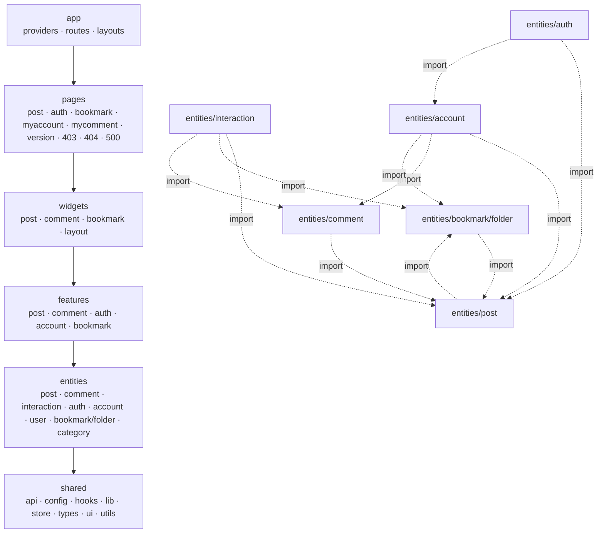
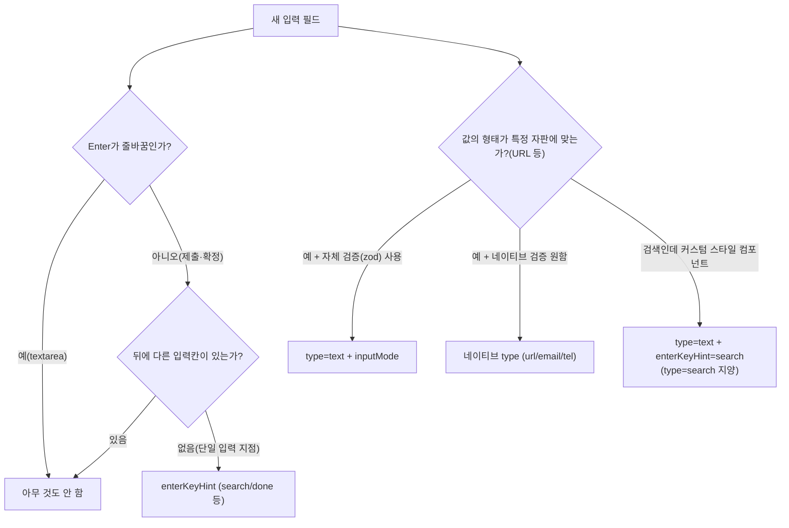

# Link-Sphere FE — Architecture & Pattern Guide

> **문서 성격**: 레퍼런스 — "지금 무엇으로, 왜 이렇게 구성되어 있는가"
>
> **대상 독자**: 이 레포 FE 코드를 처음 보거나, 새 도메인·기능을 추가하기 전에 구조를 확인하려는 개발자
>
> **읽고 나면**: 이 아키텍처가 정식 FSD와 어디가 같고 다른지 알고, 실제 디렉터리 구조·API 3계층
> 패턴·네이밍 컨벤션에 맞춰 코드를 작성할 수 있다.
>
> **마지막 검토**: 2026-10-06

시스템 전체 아키텍처(C4, 배포 파이프라인, FE/BE 구조)는 [SYSTEM-ARCHITECTURE.md](./SYSTEM-ARCHITECTURE.md)를
참고하세요. 기술 스택 목록은 루트 [`README.md`](../README.md#기술-스택)를 참고하세요.

---

## 1. 이 프로젝트의 아키텍처 — FSD 변형

이 프로젝트는 **Feature-Sliced Design(FSD)을 뼈대로 쓰되, FSD의 핵심 규칙 중 하나(Public
API)를 성능을 이유로 정반대로 채택**하고, 그 위에 도메인 그룹핑·3-Layer API 등 여러 패턴을
얹은 변형이다. "FSD를 그대로 쓴다"고 기대하면 한 가지에서 어긋난다 — 슬라이스는 `index.ts`
배럴로 캡슐화되지 않는다(import 문자열이 `/index`로 끝나는 배럴 import만 금지 — 디렉터리
암묵 해석으로 진입점을 노출하는 배럴 파일 자체는 존재한다, 예: `src/mocks/handlers/index.ts`).
같은 레이어 슬라이스 격리는 FSD대로 지킨다 — entities는 `@x` 표기로만 서로를 참조하고,
features·widgets는 같은 레이어의 다른 슬라이스를 import하지 않는다(§2·§26).

### 조합된 개념

| 개념                                  | 출처                              | 이 레포에서 담당하는 것                                                                                                              | 대표 위치                                                     |
| ------------------------------------- | --------------------------------- | ------------------------------------------------------------------------------------------------------------------------------------ | ------------------------------------------------------------- |
| FSD (Feature-Sliced Design)           | feature-sliced.design             | 레이어 6종(`app→pages→widgets→features→entities→shared`) + 하향 의존만 허용                                                          | `eslint.config.js`의 `no-restricted-imports` 5블록(레이어별)  |
| 도메인 우선 슬라이스 그룹핑           | FSD의 "slice group"을 필수 규칙화 | `features/<도메인>/<액션>/`, `widgets/<도메인>/<슬라이스>/` 처럼 한 단계 더 묶음                                                     | `features/post/create/`, `widgets/post/post-card/`            |
| 3-Layer API 분리                      | 이 레포 자체 규약                 | `*.api.ts`(순수 fetch) → `*.keys.ts`(쿼리 키+무효화) → `*.queries.ts`(React Query 훅) 3단 분리                                       | `entities/post/api/{post.api,post.keys,post.queries}.ts`      |
| Query Key Factory + 중앙 invalidation | TanStack Query 커뮤니티 패턴      | `<entity>Keys`·`<entity>InvalidateQueries`·`handle<Entity><Action>Success`로 캐시 무효화 캡슐화                                      | §5 참고                                                       |
| Container/Presentational (headless)   | 고전 React 패턴                   | `hooks/`에 폼·mutation·상태 전부, `ui/`는 JSX만                                                                                      | §6·§7, ESLint `custom-query-rules/no-direct-query-import`     |
| Schema-first (Zod as SSOT)            | schema-first 설계                 | `z.infer`로 타입을 스키마에서 파생 — 런타임 검증과 타입을 한 소스로 유지                                                             | `entities/*/model/*.schema.ts`                                |
| Atomic Design 변형                    | atoms/molecules 개념              | `shared/ui/atoms`(shadcn 원자) / `elements`(조합) / `layouts` 3단 분류                                                               | `src/shared/ui/{atoms,elements,layouts}`                      |
| 횡단 관심사 중앙화                    | React Query `meta` 옵션 활용      | 토스트·401·403 처리를 `mutationCache`/`queryCache` 한 곳에서 처리(401 리다이렉트 자체는 `client.ts`의 fetch 인터셉터 담당, §13 참고) | `src/shared/lib/react-query/config/queryClient.ts`            |
| 상수 단일화                           | —                                 | 문자열·엔드포인트·라우트·에러코드를 각각 하나의 상수 객체로 관리                                                                     | `TEXTS`, `API_ENDPOINTS`, `ROUTES_PATHS`, `SERVER_ERROR_CODE` |

### 정식 FSD와 다른 점

| FSD 규칙                                                          | 채택 여부                               | 이유 / 실태                                                                                                                                                                                                                                                                                                                                                                                                                                                                                                                                                                                                                                                                                                                                                                                                                     | 강제 수단                                                                                                                                                                               |
| ----------------------------------------------------------------- | --------------------------------------- | ------------------------------------------------------------------------------------------------------------------------------------------------------------------------------------------------------------------------------------------------------------------------------------------------------------------------------------------------------------------------------------------------------------------------------------------------------------------------------------------------------------------------------------------------------------------------------------------------------------------------------------------------------------------------------------------------------------------------------------------------------------------------------------------------------------------------------- | --------------------------------------------------------------------------------------------------------------------------------------------------------------------------------------- |
| 레이어 6종 + 하향 의존만 허용                                     | ✅ 채택                                 | FSD 원칙 그대로                                                                                                                                                                                                                                                                                                                                                                                                                                                                                                                                                                                                                                                                                                                                                                                                                 | ESLint `no-restricted-imports` 5블록 (`eslint.config.js`)                                                                                                                               |
| Public API — 슬라이스는 `index.ts` 배럴로만 외부에 노출           | ❌ **정반대로 채택** (배럴 자체를 금지) | dev 서버 부팅 15-70%·빌드 28%·콜드스타트 40% 지연이라는 성능 트레이드오프 때문에 의도적으로 뒤집음(수치 출처 미상 — 2026-09-08 확인, 이 레포에서 직접 측정하거나 외부 출처를 링크한 기록 없음. 재검증 전까지 참고용으로만 취급할 것)                                                                                                                                                                                                                                                                                                                                                                                                                                                                                                                                                                                            | ESLint `custom-barrel-rules/no-barrel-import` (`eslint.config.js`) — import 문자열이 `/index`로 끝날 때 에러(디렉터리 암묵 해석은 예외 — `@/mocks/handlers`처럼 실제로 쓰인다)          |
| 동일 레이어 슬라이스 격리 (entities는 `@x` 표기로 교차 참조 허용) | ✅ 채택                                 | 2026-09-21부터 `@x` 폴더 표기가 관례다(§5 참고) — `entities/{post,comment,account,bookmark/folder}/@x/`에 11개 파일이 있고, production 코드의 엔티티 간 참조는 전부 이 표기를 거친다(`entities/interaction/api/interaction.queries.ts`도 post·comment·folder의 keys를 전부 `@x`를 통해 가져온다. 테스트 파일이 다른 엔티티의 raw `.keys.ts`를 직접 import하는 건 허용). 마지막 예외였던 `entities/post/model/post.schema.ts`의 comment 스키마 재수출(`export *`)은 쓰는 곳이 없어 2026-10-01에 지웠다. features·widgets에 남아 있던 같은 레이어 교차 참조 5건(목록 위젯 두 개 → `post-card`, 북마크 그리드 상수 → `post-list` 상수, 두 feature → `features/bookmark/select`의 폴더 선택 창)은 2026-10-03 위층이 넘기는 조립(§26)으로 모두 없앴다(`docs/DECISIONS.md` 2026-10-03 "같은 레이어 교차 import를 위층 조립으로 제거") | entities: dependency-cruiser `entities-cross-import-only-via-x`(`pnpm check:deps`, §2). features·widgets: dependency-cruiser `features-widgets-no-cross-slice-import`(테스트 파일 제외) |
| 세그먼트는 목적 기준 명명 (`ui`/`api`/`model`/`lib`/`config`)     | ⚠️ 부분 채택                            | `hooks/`·`utils/`를 세그먼트로도 쓴다(`features/*/hooks/`, `widgets/post/post-list/utils/`, 2026-09-08부터 `entities/*/hooks/`·`entities/*/utils/`도) — 정식 FSD 세그먼트명은 아니지만 레이어 전체에서 일관되게 쓰인다. `entities`의 `model/`은 스키마·타입 전용으로 좁혔다(2026-09-08, 근거는 `.claude/CLAUDE.md` "레이어별 허용 세그먼트" 참고)                                                                                                                                                                                                                                                                                                                                                                                                                                                                               | `.claude/CLAUDE.md`의 "레이어별 허용 세그먼트" 표 (문서 규칙, ESLint 미강제)                                                                                                            |
| 슬라이스 그룹 폴더 허용 (그룹 폴더 자체엔 공유 코드 금지)         | ✅ 채택                                 | 그룹 폴더(`features/post/`, `widgets/layout/` 등)에는 파일이 없고 슬라이스만 있음                                                                                                                                                                                                                                                                                                                                                                                                                                                                                                                                                                                                                                                                                                                                               | —                                                                                                                                                                                       |

**즉 이 레포에서 실질적으로 강제되는 FSD 규칙은 "레이어 하향 의존", "entities는 `@x`로만
교차 참조", "features·widgets는 같은 레이어 다른 슬라이스 import 금지" 세 가지다.** 나머지는 부분 채택·미채택이거나 성능상의 이유로 정반대로 뒤집혀 있다.
아래 §2가 그 강제 규칙 전체 목록이다.

### 레이어 구조

레이어 간 화살표(실선)는 ESLint로 강제된다. `entities` 슬라이스 간 화살표(점선)는 전부 참조받는
쪽의 `@x` 파일을 거치는 교차 참조다 — `@x`를 거치지 않는 참조는 dependency-cruiser가 막는다(§2).


```mermaid
flowchart TD
  App["app<br/>providers · routes · layouts"] --> Pages["pages<br/>post · auth · bookmark · myaccount · mycomment · version · 403 · 404 · 500"]
  Pages --> Widgets["widgets<br/>post · comment · bookmark · layout"]
  Widgets --> Features["features<br/>post · comment · auth · account · bookmark"]
  Features --> Entities["entities<br/>post · comment · interaction · auth · account · user · bookmark/folder · category"]
  Entities --> Shared["shared<br/>api · config · hooks · lib · store · types · ui · utils"]

  EFolder["entities/bookmark/folder"] -.import.-> EPost["entities/post"]
  EComment["entities/comment"] -.import.-> EPost
  EInteraction["entities/interaction"] -.import.-> EPost
  EInteraction -.import.-> EFolder
  EInteraction -.import.-> EComment
  EPost -.import.-> EFolder
  EAuth["entities/auth"] -.import.-> EPost
  EAuth -.import.-> EAccount["entities/account"]
  EAccount -.import.-> EPost
  EAccount -.import.-> EComment
  EAccount -.import.-> EFolder
```

### 정식 FSD로 맞추려면

- **Public API 도입**: 각 슬라이스에 `index.ts`를 두고 외부에는 그것만 노출 — 단, 지금
  배럴을 금지한 성능 근거(dev 부팅 지연 등)가 먼저 해소돼야 한다. 지금은 **미채택 상태**다.

---

## 2. ESLint·dependency-cruiser가 강제하는 아키텍처 규칙

레이어 하향 의존 외에, 문서 어디에도 안 적혀 있지만 실제로 커밋을 막는 규칙들이다. 아래를
모르고 코드를 쓰면 린트에서 막힌다.

줄 번호는 리팩터링 때마다 바뀌므로 규칙명으로만 가리킨다 — 정확한 위치는
`grep -n "<규칙명>" eslint.config.js`로 직접 찾는다. 표 끝의 dependency-cruiser 규칙 5개는
`.dependency-cruiser.cjs`에 있고, `pnpm check:deps`(`pnpm check`에 포함 — 로컬·`ci.yml`·
`deploy.yml` 공통)가 검사한다.

| 규칙                                                          | 무엇을 막나                                                                                                                                                                                  |
| ------------------------------------------------------------- | -------------------------------------------------------------------------------------------------------------------------------------------------------------------------------------------- |
| `custom-barrel-rules/no-barrel-import`                        | `/index`로 끝나는 import (배럴 금지)                                                                                                                                                         |
| `custom-query-rules/no-direct-query-import`                   | `@tanstack/react-query` 직접 import — 허용목록(`app/**`·`**/api/*.queries.ts`·`**/hooks/**` 등) 밖에서는 금지                                                                                |
| `custom-query-rules/no-entity-query-import-outside-hooks`     | `features/**`·`pages/**`에서 entity 쿼리 훅(`*.queries`) import — 각 레이어의 `hooks/**` 밖에서는 금지 (2026-09-29 pages도 대상에 추가, widgets는 대상 아님, §8 참고)                        |
| `custom-query-rules/no-query-client-singleton-import`         | `queryClient` 싱글턴 직접 import — `QueryProvider.tsx`·`auth.util.ts` 두 곳만 예외                                                                                                           |
| `custom-i18n/no-hardcoded-hangul`                             | 한글 UI 문자열 하드코딩 — `TEXTS`만 허용                                                                                                                                                     |
| `custom-tailwind/no-raw-color`                                | black/white/명명 팔레트(gray-500 등) 리터럴 색상 클래스 금지 — `globals.css` 디자인 토큰 클래스만 허용                                                                                       |
| `custom-tailwind/no-raw-z-index`                              | 숫자 그대로 쓰는 raw `z-*` 유틸리티 금지 — `globals.css`의 명명된 z-index 토큰만 허용                                                                                                        |
| `custom-tailwind/no-raw-text-size`                            | px 단위 임의값(bracket) 폰트 크기 유틸리티(`text-[16px]` 등) 금지 — 타이포그래피 역할·스케일 토큰만 허용                                                                                     |
| `custom-tailwind/no-raw-title`                                | 텍스트 크기+`font-semibold`/`font-bold` 조합(제목처럼 보이는 raw 클래스) 금지 — 제목 역할 토큰이나 예외 주석 필요                                                                            |
| `custom-tailwind/no-classname-template-literal`               | `className`에 템플릿 리터럴(백틱) 사용 금지 — `cn()` 경유 강제                                                                                                                               |
| `import/no-default-export`                                    | default export 금지                                                                                                                                                                          |
| `custom-filename/no-non-ascii-filename`                       | 파일명에 비-ASCII 문자(한글 등) 사용 금지                                                                                                                                                    |
| `custom-import/no-sonner-toast-direct-import`                 | `sonner` 직접 import — `@/shared/lib/toast/toast` 경유 강제                                                                                                                                  |
| `custom-import/no-relative-import-except-styles`              | 상대 경로 import(`../`) 금지, `.styles.ts` 파일만 예외                                                                                                                                       |
| `no-restricted-syntax` (Zustand·날짜·클래스 컴포넌트)         | 스토어 `getState()` 직접 호출 금지(셀렉터 훅 강제), `new Date()`/`.getTime()` 직접 사용 금지(`dayjs` 강제), 클래스 컴포넌트 금지                                                             |
| 파일명 규칙                                                   | `*.api.ts`·`*.queries.ts`·`*.schema.ts`·`config/`·`utils/` 등 세그먼트별 파일명 패턴                                                                                                         |
| `custom-a11y/clickable-needs-interactive-element`             | `div`/`span`에 `onClick`만 달기 — `role="button"` 없이는 금지                                                                                                                                |
| `curly` (`['error', 'all']`)                                  | 인라인 `if`문 (`if (x) return;`) — 항상 중괄호 블록 강제                                                                                                                                     |
| `import/no-cycle`                                             | 순환 참조(A→B→A) 금지 — 동작하려면 `eslint.config.js`의 리졸버 설정 3개가 함께 필요, 그 주석 참고                                                                                            |
| `custom-route/no-hardcoded-route-path`                        | `navigate()`·`window.location.href`·JSX `to=`에 경로 문자열 직접 쓰기 금지 — `ROUTES_PATHS.*`만 허용                                                                                         |
| `custom-storybook/title-matches-path`                         | 스토리 `title`이 파일 경로에서 계산한 값과 다르거나 없음 — 형식은 §18 "Storybook 스토리"                                                                                                     |
| `react-hooks/*` (v7 recommended)                              | React 공식 hooks 규칙 위반(`rules-of-hooks`·`refs`·`set-state-in-effect`·`purity` 등) — 기존 위반은 `eslint-suppressions.json`에 기록돼 새 코드만 막는다                                     |
| `entities-cross-import-only-via-x` (dependency-cruiser)       | entity가 다른 entity를 `@x/` 공개 표면 없이 직접 import — 테스트 파일은 예외(§5의 `@x` 표기 참고)                                                                                            |
| `features-widgets-no-cross-slice-import` (dependency-cruiser) | features·widgets 슬라이스가 같은 레이어의 다른 슬라이스를 import — 위층이 `render<대상>` 함수로 넘긴다(§26). 테스트 파일은 예외(실제 앱의 위층 역할을 대신해 다른 슬라이스 UI를 직접 넘긴다) |
| `no-non-package-json` (dependency-cruiser)                    | `package.json`에 없는 패키지 import — `.npmrc`가 `shamefully-hoist=true`라 pnpm이 못 막는다                                                                                                  |
| `not-to-dev-dep` (dependency-cruiser)                         | production 코드에서 devDependency import — 테스트·스토리·`src/test`·`src/mocks`·`.d.ts`와 `QueryProvider.tsx`(devtools)는 예외                                                               |
| `not-to-unresolvable` (dependency-cruiser)                    | 디스크에서 찾을 수 없는 모듈 import — 해석에 실패한 import는 `no-non-package-json` 판정을 조용히 건너뛰기 때문에 함께 막는다                                                                 |

---

## 3. Directory Structure

```
src/
├── main.tsx                     # 앱 진입점
├── vite-env.d.ts                # 전역 타입 선언
│
├── app/                          # 앱 초기화, providers, routing
│   ├── App.tsx                   # 최상위 App 컴포넌트
│   ├── globals.css               # 디자인 토큰(CSS 변수) + Tailwind 레이어
│   ├── providers/                # AuthProvider, QueryProvider, RouterProvider, ThemeProvider
│   ├── routes/                   # 라우트 설정, ProtectedRoute, RouteErrorBoundary
│   │   └── layouts/              # AppShellLayout, ProtectedLayout, PublicLayout, RootLayout
│   ├── layouts/
│   │   └── app-layout/           # AppLayout — nav shell. app/routes/layouts/AppShellLayout.tsx가 감싸 렌더
│   └── ui/                       # PostMutationLoadingToast — 계정 수정 뮤테이션 진행 상태
│                                 # 헤드리스 옵저버(App.tsx 최상단에 마운트. 2026-10-03부터 게시글
│                                 # 등록·수정은 관찰하지 않아 이름과 달리 계정 수정만 본다)
│
├── pages/                        # 라우팅 진입점 — widgets/features 조합. hooks/ 세그먼트만 허용
│   ├── post/                     # index(Post), PostDetailPage, PostEditPage, PostSubmitPage
│   │   └── hooks/                # usePostDetail
│   ├── auth/                     # LoginPage, SignUpPage, ForgotPasswordPage, ResetPasswordPage, VerifyEmailPage
│   ├── bookmark/                 # BookmarkPage
│   │   └── hooks/                # useBookmarkPage
│   ├── myaccount/                # MyAccountPage
│   ├── mycomment/                # MyCommentPage
│   ├── version/                  # VersionPage
│   ├── 403/                      # ForbiddenPage
│   ├── 404/                      # NotFoundPage
│   └── 500/                      # ServerErrorPage
│
├── widgets/                      # 복합 UI 블록 — 도메인 그룹 → 슬라이스
│   ├── post/
│   │   ├── post-list/
│   │   │   ├── hooks/            # usePostList, usePostListSearch
│   │   │   ├── ui/               # PostList, PostListSearch, PostCardSkeleton
│   │   │   └── utils/            # search-parser
│   │   └── post-card/
│   │       ├── config/           # post-card-grid.const.ts (POST_CARD_GRID — 목록에는 페이지가 넘김)
│   │       ├── hooks/            # usePostCard
│   │       └── ui/               # PostCard
│   ├── comment/
│   │   ├── comment-list/
│   │   │   ├── hooks/            # useCommentList
│   │   │   └── ui/               # CommentList, CommentItem, ScrollToCommentFormButton
│   │   └── my-comment-list/
│   │       ├── hooks/            # useMyCommentList
│   │       └── ui/               # MyCommentList, MyCommentCard, MyCommentCardSkeleton
│   ├── bookmark/
│   │   ├── bookmark-post-list/{hooks,ui}  # useBookmarkPostList, BookmarkPostList
│   │   ├── bookmark-search/{hooks,ui}     # useBookmarkSearch, BookmarkSearch
│   │   └── folder-tree/{hooks,ui}         # useFolderTree 외 4개, FolderTree, MobileFolderList
│   └── layout/
│       ├── navbar/
│       │   ├── hooks/            # useRecentSearches, useNavbarSearch, useDelayedLogout, useMobileSearchPanel
│       │   └── ui/               # Navbar, NavbarSearch, MobileNavbarSearch, RecentSearchPanel, RecentSearchDropdown
│       ├── bottom-tab-bar/ui/
│       ├── sidebar/ui/
│       └── login-dialog/         # LoginDialog(2026-09-29 features/auth/login에서 이동 —
│           │                     # RootLayout이 마운트하는 전역 모달, Navbar·Sidebar·
│           │                     # BottomTabBar와 같은 자리. 2026-09-30 LoginModal에서 개명)
│           ├── hooks/            # useLoginDialog
│           └── ui/               # LoginDialog
│
├── features/                     # 사용자 상호작용 — 도메인 그룹 → 액션 슬라이스
│   ├── post/
│   │   ├── create/{hooks,ui}     # useCreatePost, usePostCreateBookmarkFolderField, CreatePostForm, PostCreateBookmarkFolderField
│   │   ├── update/{hooks,ui}     # useUpdatePost, UpdatePostForm
│   │   ├── delete/hooks          # usePostDelete
│   │   └── like/{hooks,ui}       # useLikePost, LikePostButton
│   ├── comment/
│   │   ├── create/{hooks,ui}     # useCreateComment, CommentForm, MobileCommentBar
│   │   ├── update/{hooks,ui}     # useUpdateComment, CommentEditForm
│   │   ├── delete/hooks          # useDeleteComment
│   │   └── like/{hooks,ui}       # useLikeComment, LikeCommentButton
│   ├── auth/
│   │   ├── login/{hooks,ui}      # useLogin, LoginForm
│   │   ├── signup/{hooks,ui}     # useSignUp, useAvailabilityCheck, SignUpForm
│   │   ├── email-verification/{hooks,ui}  # 이메일 인증 확인
│   │   ├── password-change/{hooks,ui}     # 로그인 상태에서 비밀번호 변경
│   │   └── password-reset/{hooks,ui}      # 비밀번호 찾기(재설정)
│   ├── account/
│   │   ├── update/{hooks,ui}     # useUpdateAccount, UpdateAccountForm
│   │   └── delete/{hooks,ui}     # 계정 삭제
│   └── bookmark/                 # 2026-09-08 post/bookmark에서 승격 — entities/widgets/pages와
│       │                         # bookmark 도메인 그룹을 통일(FSD nukeapp 사례 참고)
│       ├── toggle/{hooks,ui}     # useBookmarkFolders, useBookmarkPostButton, usePostCardBookmarkFolderDialog, BookmarkPostButton,
│       │                         # PostCardBookmarkFolderDialog(2026-09-08, entities의
│       │                         # BookmarkFolderSelectDialog와 이름이 겹쳐 호출 맥락(PostCard)
│       │                         # 접두사를 붙여 개명. 2026-09-30 …Modal→…Dialog 재개명)
│       └── select/{hooks,ui}     # useBookmarkFolderSelect, BookmarkFolderSelectDialog — toggle·
│                                 # post/create 두 feature가 공유하는 폴더 선택 UI. entities/ui는
│                                 # 시각적 표현만 담아야 하는데 CRUD 인터랙션이라 여기로 이동.
│                                 # 두 feature는 이 창을 import하지 않고 위층(PostCard·PostSubmitPage)이
│                                 # renderFolderSelect로 넘긴다(§26, 2026-10-03)
│
├── entities/                     # 비즈니스 엔티티 — data layer + basic display
│   ├── post/
│   │   ├── @x/                   # comment·account·auth·bookmark·interaction 각각에 공개하는 표면
│   │   ├── api/                  # post.api.ts, post.keys.ts, post.queries.ts
│   │   ├── model/                # post.dto.ts(응답 타입) + post.schema.ts(폼 검증)
│   │   ├── config/                # post.const.ts (POST_PAGE_SIZE)
│   │   ├── hooks/                # useLinkPreview (등록·수정 폼의 작성 중 링크 미리보기 조회)
│   │   ├── ui/                   # LinkPreviewCard (링크 미리보기 카드)
│   │   └── utils/                # post.util.ts (PostUtil.resolveSubmitError — 등록·수정 실패 분류)
│   ├── comment/
│   │   ├── @x/                   # account·interaction에 공개하는 표면
│   │   ├── api/                  # comment.api.ts, comment.keys.ts, comment.queries.ts
│   │   ├── model/                # comment.dto.ts(응답 타입) + comment.schema.ts(폼 검증)
│   │   ├── utils/                # comment.util.ts (estimateCommentPayloadBytes)
│   │   └── config/                # comment.const.ts (MAX_COMMENT_CONTENT_BYTES 외)
│   ├── interaction/
│   │   └── api/                  # interaction.api.ts, interaction.queries.ts (keys.ts 없음 — post/comment/folder의 @x를 통해 keys를 가져다 씀)
│   ├── bookmark/                 # entities 최초의 그룹 폴더 — folder라는 이름만으로 북마크
│   │   │                         # 폴더인지 불분명했던 문제를 features/widgets와 같은 방식으로 해소
│   │   └── folder/
│   │       ├── @x/               # account·interaction·post에 공개하는 표면
│   │       ├── api/              # bookmark-folder.api.ts, bookmark-folder.keys.ts, bookmark-folder.queries.ts
│   │       ├── model/            # bookmark-folder.dto.ts(응답 타입) + bookmark-folder.schema.ts(폼 검증)
│   │       ├── config/           # bookmark-folder.const.ts (RECENT_BOOKMARK_FOLDER_COUNT 외)
│   │       ├── utils/            # bookmark-folder.util.ts (pickRecentFolders)
│   │       └── hooks/            # useRecentBookmarkFolders.ts (순수 데이터 파생 훅이라 entities에 남는다 —
│   │                             # 인터랙션 UI는 features/bookmark/select/로 이동. 2026-09-21 기준
│   │                             # 소비처는 모달(BookmarkFolderSelectDialog) 1곳 — 상시 마운트 화면은
│   │                             # 세션 경계가 없어 이 훅 대신
│   │                             # widgets/bookmark/folder-tree/hooks/useFolderSections.ts가
│   │                             # bookmark-folder.util.ts를 직접 호출)
│   ├── category/
│   │   ├── api/                  # category.api.ts, category.keys.ts, category.queries.ts
│   │   ├── model/                # category.dto.ts(응답 타입). category.schema.ts는 기존 import 경로 호환용 re-export만
│   │   ├── config/               # category.const.ts (CATEGORY_COLOR_CLASSNAME 외)
│   │   └── hooks/                 # useCategoryOptions — 등록·수정 폼 + 목록 검색 카드가 공유
│   ├── auth/                     # 인증(로그인·로그아웃·회원가입·세션) 전용
│   │   ├── api/                  # auth.api.ts, auth.keys.ts, auth.queries.ts
│   │   ├── model/                # auth.dto.ts(응답 타입) + auth.schema.ts (loginSchema, createAccountSchema 등)
│   │   ├── config/               # auth.const.ts (PASSWORD_MIN_LENGTH·PASSWORD_REQUIREMENTS 외)
│   │   ├── utils/                # auth.util.ts (PasswordUtil — 비밀번호 조건 판정)
│   │   ├── ui/                   # PasswordRequirementList, PasswordConfirmMessage
│   │   └── hooks/                 # useAuth, useAppInitialization, useAuthGuard, useProtectedNavigate, usePasswordFieldsFeedback
│   ├── account/                  # 내 계정 프로필(닉네임·이미지·이메일) 조회·수정 전용
│   │   ├── @x/                   # auth에 공개하는 표면
│   │   ├── api/                  # account.api.ts, account.keys.ts, account.queries.ts
│   │   ├── model/                # account.dto.ts(응답 타입) + account.schema.ts (updateAccountSchema 등)
│   │   └── hooks/                 # useAccount
│   └── user/                     # 공개 사용자 표현 전용(게시글·댓글 작성자 등, 데이터 조회 없음)
│       └── ui/                   # UserAvatar
│
└── shared/                       # 순수 유틸, UI 원자, API client, config
    ├── api/
    │   ├── client.ts             # HTTP 클라이언트 (apiClient) — fetch 기반, axios 아님
    │   ├── upload.api.ts         # uploadApi — 서명 URL 발급 + PUT 요청 함수
    │   ├── fcm.api.ts             # fcmApi — FCM 토큰 등록/해제
    │   ├── api.type.ts           # Unwrap 헬퍼 — ApiResponse<T> 래퍼가 익명 타입일 때만 사용
    │   └── generated/            # openapi.json(스펙 스냅샷) + openapi.gen.ts(생성 타입) — 커밋됨, 직접 편집 금지
    ├── config/
    │   ├── texts.ts               # 모든 UI 문자열 (TEXTS)
    │   ├── api.ts                 # 모든 API 엔드포인트 (API_ENDPOINTS)
    │   ├── route-paths.ts         # 라우트 경로 상수 (ROUTES_PATHS)
    │   ├── build-info.ts          # BUILD_INFO — 이 번들이 빌드된 커밋(빌드타임 주입)
    │   ├── nav-items.ts
    │   ├── storage-keys.ts
    │   ├── const.ts
    │   └── error-code.ts          # SERVER_ERROR_CODE
    ├── hooks/                     # 재사용 훅 (useDebounce, useIntersectionObserver, usePullToRefresh 등)
    ├── lib/
    │   ├── react-query/
    │   │   └── config/                 # queryClient.ts(중앙 QueryClient 인스턴스), error-toast.ts(resolveErrorToast), retry-policy.ts(shouldRetryQuery)
    │   ├── toast/toast.ts         # sonner 래퍼 (직접 import 금지, 이걸 통해서만 사용)
    │   ├── upload/uploadImageAndGetUrl.ts  # 리사이즈 + uploadApi 조합 편의 함수
    │   ├── firebase/, image/, content/, virtual/, router/
    │   └── tailwind/utils.ts      # cn() helper
    ├── store/                     # appVersion, auth, hideBots, loginDialog, sidebar, unsavedChanges (.store.ts)
    ├── types/
    │   └── common.type.ts
    ├── ui/
    │   ├── atoms/                 # CVA 기반 Shadcn 기본 컴포넌트
    │   ├── elements/              # 조합 컴포넌트 (MarkdownContent 포함)
    │   │   ├── form/
    │   │   ├── dialog/{alert,image-viewer}/
    │   │   └── dialog/SheetDialogContent.tsx
    │   └── layouts/                # AuthLayout, ErrorLayout
    └── utils/                     # auth, build-info, common, date, error, form, logout-grace, storage, url, version (.util.ts)
```

레이어에 속하지 않는 최상위 디렉터리도 있다 — `src/mocks/`(MSW `handlers/`·`fixtures/`),
`src/test/`(Vitest `setup.ts`·`utils.tsx`), `src/types/`(전역 타입 선언), `src/main.tsx`(앱
진입점). ESLint `no-restricted-imports` 5블록(줄 번호는 §2 관례대로 생략 — `grep -n
"no-restricted-imports" eslint.config.js`로 찾는다)은
`shared`/`entities`/`features`/`widgets`/`pages` 5개 레이어 디렉터리만 `files`로 잡아 이
넷은 대상 밖이다(2026-09-09 문서-코드 정합성 감사 중 재확인) — `mocks`·`types`는 실제로
상위 레이어를 import하는 코드가 없고, `main.tsx`가 `@/app/*`를 import하는 건 진입점이
최상위 레이어(app)를 부트스트랩하는 정상 패턴이라 애초에 레이어 규칙 대상이면 안 된다.

---

## 4. 현재 Entities & Widgets

| Entity        | 위치                        | 설명                               |
| ------------- | --------------------------- | ---------------------------------- |
| `post`        | `entities/post/`            | 포스트 CRUD + 쿼리                 |
| `comment`     | `entities/comment/`         | 댓글 CRUD + 쿼리                   |
| `interaction` | `entities/interaction/`     | like/bookmark optimistic update    |
| `folder`      | `entities/bookmark/folder/` | 북마크 폴더 CRUD + 쿼리            |
| `category`    | `entities/category/`        | 카테고리 옵션 조회                 |
| `auth`        | `entities/auth/`            | 로그인·로그아웃·회원가입·세션 복원 |
| `account`     | `entities/account/`         | 내 계정 프로필 조회·수정           |
| `user`        | `entities/user/`            | 공개 사용자 표현(UserAvatar)       |

| Widget               | 위치                                   | 설명                                            |
| -------------------- | -------------------------------------- | ----------------------------------------------- |
| `post-list`          | `widgets/post/post-list/`              | 포스트 목록 (무한스크롤 + 검색)                 |
| `post-card`          | `widgets/post/post-card/`              | 포스트 카드 (모든 액션: like, bookmark, 관리)   |
| `comment-list`       | `widgets/comment/comment-list/`        | 댓글 목록 (댓글 아이템 + 생성 폼)               |
| `my-comment-list`    | `widgets/comment/my-comment-list/`     | 내가 쓴 댓글 목록                               |
| `navbar`             | `widgets/layout/navbar/`               | 네비게이션 바                                   |
| `bottom-tab-bar`     | `widgets/layout/bottom-tab-bar/`       | 모바일 하단 탭바                                |
| `sidebar`            | `widgets/layout/sidebar/`              | 사이드바                                        |
| `login-dialog`       | `widgets/layout/login-dialog/`         | 로그인 모달 (RootLayout이 마운트하는 전역 모달) |
| `bookmark-post-list` | `widgets/bookmark/bookmark-post-list/` | 북마크 포스트 목록                              |
| `bookmark-search`    | `widgets/bookmark/bookmark-search/`    | 북마크 내 검색                                  |
| `folder-tree`        | `widgets/bookmark/folder-tree/`        | 폴더 트리 / 모바일 폴더 목록                    |

---

## 5. 3-Layer API 패턴

**절대로 레이어를 건너뛰거나 합치지 않는다.**

**예외 — 실시간 중복확인(디바운스형 유효성 검사)**: `features/auth/signup/hooks/useSignUp.ts`(Layer 1
함수를 `useAvailabilityCheck.ts`에 `checkFn`으로 넘긴다),
`features/account/update/hooks/useUpdateAccount.ts`의 닉네임·이메일 중복확인은 Layer 1
(`accountApi.checkNicknameAvailability`, `authApi.checkEmailAvailability`)을 Layer 3 없이
직접 호출한다(2026-09-09 문서-코드 정합성 감사 중 확인). React Query의 `useQuery`가 캐싱을
전제하는데, 이 검증은 매 입력마다 새로 확인해야 하고 결과를 캐시하면 안 되며 디바운스·
요청 취소(`cancelled` flag)·자체 상태머신(`idle/checking/available/duplicate`)이 핵심이라
캐싱 모델과 안 맞는다 — Layer 3로 억지로 감싸는 것보다 Layer 1 직접 호출이 더 단순하다.
뮤테이션(계정 생성·수정)은 두 파일 모두 정상적으로 Layer 3(`useCreateAccountMutation`,
`useUpdateAccountMutation`)를 거친다 — 이 예외는 "실시간 검증"에만 한정된다.

### Layer 0 — `<entity>.dto.ts` (BE 스펙 생성 타입 alias)

응답 타입의 정본은 Zod가 아니라 BE OpenAPI 스펙에서 생성된 타입이다. 배경·마이그레이션
과정은 `docs/OPENAPI-CODEGEN.md` 참고, 새 엔티티 만들 때 절차는 `/add-schema` 슬래시 커맨드
참고.

```typescript
// entities/<entity>/model/<entity>.dto.ts
import type { components } from '@/shared/api/generated/openapi.gen';

export type Entity = components['schemas']['EntityResponse'];
```

BE의 nullable/enum이 스펙에 정확히 안 실리는 경우만 `Omit` + intersection으로 override하고,
반드시 BE 소스 파일:줄을 근거 주석으로 남긴다(`src/entities/account/model/account.dto.ts`의
`role`/`nickname` override 참고). Layer 1이 쓰는 `Entity`/`CreateEntity`/`UpdateEntity` 같은
타입 이름은 이 파일(응답) 또는 아래 Zod 스키마(요청)에서 온다 — Layer 1~3 코드 자체는 바뀌지
않는다.

### Layer 1 — `<entity>.api.ts` (순수 async, React 없음)

```typescript
import { apiClient } from '@/shared/api/client';
import { API_ENDPOINTS } from '@/shared/config/api';

export const entityApi = {
  createEntity: async (payload: CreateEntity): Promise<Entity> =>
    apiClient.post<Entity>(API_ENDPOINTS.domain.base, payload),

  fetchEntity: async (id: string): Promise<Entity> =>
    apiClient.get<Entity>(`${API_ENDPOINTS.domain.base}/${id}`),

  updateEntity: async (id: string, payload: UpdateEntity): Promise<Entity> =>
    apiClient.patch<Entity>(`${API_ENDPOINTS.domain.base}/${id}`, payload),

  deleteEntity: async (id: string): Promise<void> =>
    apiClient.delete<void>(`${API_ENDPOINTS.domain.base}/${id}`),
};
```

### Layer 2 — `<entity>.keys.ts` (쿼리 키 + success handlers)

`.keys.ts`는 React를 모르는 순수 모듈이다 — `QueryClient` 인스턴스를 자기가 들고 있지 않고
**호출자(Layer 3의 훅)가 넘긴 것을 쓴다**. 그래야 provider가 주입한 클라이언트와 항상 같은
인스턴스를 만지고(테스트가 격리된 `createTestQueryClient()`를 써도 캐시 갱신이 싱글턴으로
새지 않는다), `.keys.ts`가 `@/shared/lib/react-query/config/queryClient` 싱글턴에 의존하지
않는다.

```typescript
import type { QueryClient } from '@tanstack/react-query';

const rootKey = ['entity'] as const;

export const entityKeys = {
  root: rootKey,
  listRoot: [...rootKey, 'list'] as const,
  list: (filters?: Record<string, unknown>) => [...rootKey, 'list', filters] as const,
  detail: (id: Entity['id']) => [...rootKey, 'detail', id] as const,
};

export const entityInvalidateQueries = {
  all: (queryClient: QueryClient) => queryClient.invalidateQueries({ queryKey: rootKey }),
  list: (queryClient: QueryClient) =>
    queryClient.invalidateQueries({ queryKey: entityKeys.listRoot }),
  detail: (queryClient: QueryClient, id: Entity['id']) =>
    queryClient.invalidateQueries({ queryKey: entityKeys.detail(id) }),
};

export const handleEntityCreateSuccess = (queryClient: QueryClient) => {
  entityInvalidateQueries.list(queryClient);
};
export const handleEntityUpdateSuccess = (queryClient: QueryClient, id: Entity['id']) => {
  entityInvalidateQueries.detail(queryClient, id);
  entityInvalidateQueries.list(queryClient);
};
```

#### 크로스 엔티티 무효화 (다른 엔티티 캐시까지 갱신해야 할 때)

다른 엔티티의 캐시도 함께 갱신해야 하면, 그 엔티티가 공개한 `<entity>InvalidateQueries.xxx()`
래퍼만 import해서 부른다. 그 엔티티의 raw 쿼리 키를 재구성해서 `queryClient.invalidateQueries`를
직접 호출하지 않는다(캡슐화가 깨지고, 그 엔티티의 키 구조가 바뀌면 여기도 같이 고쳐야 한다).
같은 `queryClient` 인스턴스를 그대로 다음 호출에 넘긴다.

```typescript
// entities/comment/api/comment.keys.ts
import type { QueryClient } from '@tanstack/react-query';
import { Post, postInvalidateQueries } from '@/entities/post/@x/comment';

export const handleCommentCreateSuccess = (queryClient: QueryClient, postId: Post['id']) => {
  // 댓글 목록은 mutation의 onMutate/onSuccess가 낙관적으로 직접 갱신하므로 여기서 다시
  // invalidate하지 않는다 - 그러면 방금 그려진 결과를 지우고 GET을 한 번 더 태우게 된다.
  // commentCount가 걸린 게시글 상세/목록만 갱신한다.
  postInvalidateQueries.detail(queryClient, postId); // 댓글 수가 반영되는 포스트 상세
  postInvalidateQueries.list(queryClient); // 목록의 댓글 수 배지
  // "내 댓글" 목록은 위와 달리 낙관적으로 patch하지 않는다(원글 제목까지 새로 조립해야
  // 해서 비용 대비 이득이 낮음) - 무효화로 다음 진입 시 새로고침되게 한다.
  commentInvalidateQueries.my(queryClient);
};
```

`handle<Event>Success`가 어느 엔티티의 `.keys.ts`에 사는지는 "어떤 이벤트가 트리거인가"가
아니라 "어떤 캐시가 영향받는가"로 정한다 — 트리거가 다른 엔티티(post 삭제, 좋아요/북마크
토글)여도 영향받는 캐시를 소유한 엔티티(folder)가 핸들러를 호스팅할 수 있다
(`bookmark-folder.keys.ts`의 `handlePostDeleteSuccess`, `handleBookmarkToggleSuccess`). 참고
파일: `comment.keys.ts`, `bookmark-folder.keys.ts`, `account.keys.ts`(`handleAccountUpdateSuccess`),
`auth.keys.ts`(`handleAuthRestoreSuccess`).

#### `@x` 표기 (엔티티 간 교차 참조, 2026-09-21 도입)

위처럼 한 엔티티가 다른 엔티티의 값을 참조하는 건 이 레포에서 이미 흔한 패턴이다(`auth`가
`account`를, `bookmark/folder`·`comment`·`interaction`이 `post`를 참조하는 식). [FSD 공식
문서](https://feature-sliced.design/docs/reference/public-api#the-x-notation)는 같은 레이어
안에서 이런 교차 참조가 생기면 `@x` 폴더로 명시하라고 권장한다 — 참조하는 대상 엔티티 아래
`@x/<참조하는-엔티티>.ts` 파일을 두고, 그 엔티티가 남에게 공개할 것만 거기 모아 재export한다.

```typescript
// entities/post/@x/comment.ts — entities/comment 가 참조하는 post 의 공개 표면
export { postInvalidateQueries } from '@/entities/post/api/post.keys';
export type { Post } from '@/entities/post/model/post.schema';
```

```typescript
// entities/comment/api/comment.keys.ts — @x 를 통해서만 참조한다
import { postInvalidateQueries } from '@/entities/post/@x/comment';
```

**왜 `.api.ts`/`.keys.ts`를 직접 참조하지 않고 한 단계 더 두는가** — 직접 참조하면 그
엔티티의 전체 공개 표면(`api/`·`keys/`·`queries/`의 모든 export)에 접근할 수 있어, 실제로
쓰는 게 뭔지 파일을 열어보기 전엔 알 수 없다. `@x/<참조하는-엔티티>.ts` 하나에 실제로
쓰는 것만 모아두면 `grep -r "@x" src/entities`만으로 엔티티 간 결합 지점 전체가 한눈에
보이고, 그 파일 하나만 보고도 "이 엔티티가 어디에 얼마나 노출돼 있는지"를 알 수 있다.
반대로 참조하는 쪽(`entities/comment`)이 아니라 참조받는 쪽(`entities/post`)에 `@x` 폴더가
있다는 점에 주의 — "누가 나를 참조하는가"를 참조받는 엔티티가 직접 통제하는 구조다.

2026-10-01부터 dependency-cruiser가 이 표기를 강제한다(`entities-cross-import-only-via-x`, §2) —
다른 엔티티를 `@x` 없이 직접 import하면 `pnpm check`가 실패한다(테스트 파일은 예외). 새로 엔티티
간 참조가 생기면 참조받는 엔티티에 `@x/<참조하는-엔티티>.ts`를 추가하고 그 파일을 거쳐
import한다. 규칙은 `@x` 경유 여부만 보고, `@x` 파일 이름이 참조하는 엔티티와 맞는지는 보지
않는다(이름은 컨벤션으로 맞춘다).

### Layer 3 — `<entity>.queries.ts` (얇은 React Query 래퍼)

```typescript
import { useMutation, useQuery, useQueryClient } from '@tanstack/react-query';
import { entityApi } from '@/entities/<entity>/api/entity.api';
import { entityKeys, handleEntityCreateSuccess } from '@/entities/<entity>/api/entity.keys';
import { TEXTS } from '@/shared/config/texts';

export const useCreateEntityMutation = () => {
  const queryClient = useQueryClient();

  return useMutation({
    mutationFn: (payload: CreateEntity) => entityApi.createEntity(payload),
    meta: {
      successMessage: TEXTS.messages.success.entityCreated,
      errorMessage: TEXTS.messages.error.entityCreateFailed,
    },
    onSuccess: () => handleEntityCreateSuccess(queryClient),
  });
};

export const useFetchEntityQuery = (id: string) =>
  useQuery({
    queryKey: entityKeys.detail(id),
    queryFn: () => entityApi.fetchEntity(id),
    enabled: !!id,
  });
```

> 예외: `entities/interaction/`은 `keys.ts`가 없다 — 자체 캐시 키를 갖지 않고
> `entities/{post,comment,bookmark/folder}/@x/interaction.ts`를 거쳐 그 엔티티들의 키·무효화 핸들러를
> 가져다 쓴다(`interaction.queries.ts` 상단 import). §1 "정식 FSD와 다른 점"의 entities 교차 참조 사례이기도 하다.

---

## 6. Feature Hook 패턴

feature hook = 모든 비즈니스 로직. UI 파일은 훅을 호출하고 JSX만 렌더링.

```typescript
// features/<도메인>/<액션>/hooks/use<FeatureName>.ts
export function useCreateEntity() {
  const navigate = useNavigate();
  const { mutateAsync: createEntity, isPending: isCreating } = useCreateEntityMutation();

  const form = useForm<CreateEntity>({
    resolver: zodResolver(createEntitySchema),
    defaultValues: { name: '' },
    mode: 'onChange',
  });

  const onSubmit = form.handleSubmit(async (data) => {
    try {
      await createEntity(data, {
        onSuccess: () => {
          form.reset();
          navigate(ROUTES_PATHS.ENTITY.ROOT);
        },
      });
    } catch (error) {
      console.error(error);
    }
  });

  return { form, onSubmit, isCreating };
}
```

조회가 필요하면 슬라이스 자신의 `hooks/` 커스텀 훅이나 `entities/<entity>/hooks/`의 공용 훅(여러
슬라이스가 같은 조회를 공유할 때, 예: `useCategoryOptions`)에서 한다 — features에는 예외를 두지
않는다(§8의 "query 1개 + trivial 파생" 예외는 widgets 한정). `custom-query-rules/no-entity-query-import-outside-hooks`가
`features/**/hooks/**` 밖에서 entity `*.queries` 모듈 import를 막아 강제한다.

---

## 7. UI Component 패턴 (얇은 레이어)

UI가 직접 호출해도 되는 훅은 세 종류다: 자기 feature의 `hooks/` 커스텀 훅, `entities/<entity>/hooks/`의
공용 훅(예: `useCategoryOptions`, `useAccount`), `shared/hooks/`의 범용 훅. entity의 `*.queries.ts`가
내보내는 React Query 훅을 UI가 직접 부르는 것은 §6의 규칙 위반이다(ESLint로 강제).

```typescript
// features/<도메인>/<액션>/ui/<FeatureName>Form.tsx
export function CreateEntityForm() {
  const { form, onSubmit, isCreating } = useCreateEntity();
  const { isDirty, isValid } = form.formState;
  const canSubmit = isDirty && isValid && !isCreating;

  return (
    <FormProvider {...form}>
      <form onSubmit={onSubmit} noValidate>
        <FormInput name="name" label={TEXTS.entity.form.create.nameLabel} required disabled={isCreating} />
        <Button type="submit" disabled={!canSubmit}>
          {isCreating ? TEXTS.common.submitting : TEXTS.entity.form.create.submit}
        </Button>
      </form>
    </FormProvider>
  );
}
```

---

## 8. Widget Hook 패턴

widget hook = 여러 entity query 조합 + UI 블록 특화 파생 상태. 원칙적으로 뮤테이션 로직은
포함하지 않는다 — 단, **그 widget에서만 쓰이고 다른 곳에서 재사용되지 않는 CRUD**는 widget
hook에서 직접 mutation을 써도 된다(아래 "뮤테이션 예외" 참고).

```typescript
// widgets/<domain>/<widget>/hooks/use<Widget>.ts — 패턴을 보여주는 간소화 예시(실제 이름
// 아님). 실제 참조 구현은 src/widgets/post/post-list/hooks/usePostList.ts — URL 파라미터
// 관리·로컬 필터 병합·가상 스크롤 기반 다음 페이지 prefetch까지 포함해 이 예시보다 훨씬 복잡하다.
export function useExampleWidget(filter: EntityFilter) {
  const { data, isFetchingNextPage, hasNextPage, fetchNextPage } =
    useSuspenseFetchEntityListQuery(filter);

  const items = data?.pages.flatMap((page) => page.content) ?? [];

  return { items, isFetchingNextPage, hasNextPage, fetchNextPage };
}
```

widget hook이 **불필요한 경우**: entity query 1개 + trivial 파생만이면 컴포넌트에서 직접 사용한다.
**widgets 한정** — features는 §6에 예외가 없다. 이 판단은 "파생이 trivial한가"라는 사람 판단이라
ESLint로 강제하지 않는다(파일 단위로 강제하면 그 파일에 앞으로 들어올 모든 쿼리가 영구 면제된다) —
`/code-review`와 PR 리뷰로 지킨다.

- 예외 해당 (그대로 둔 예): `widgets/comment/comment-list/ui/CommentItem.tsx`가
  `useFetchAccountQuery()`를 직접 호출한다 — 이 쿼리에서 나오는 파생은 `isOwner` 불리언
  하나뿐이고, 파일의 나머지 파생(`isPostAuthor`·`isDeleted` 등)은 props 파생이라 이 쿼리와
  무관하다. 참고로 여기를 이미 entity 훅이 있는 `useAccount()`로 바꾸는 건 안 된다 —
  `persistLastAvatar` localStorage 부수효과가 댓글 개수만큼 실행된다.

### 뮤테이션 예외 — 단일 widget 전용 CRUD

`widgets/post/post-card/hooks/usePostCard.ts`(코드 스타일 레퍼런스의 Widget Hook 예시,
`.claude/CLAUDE.md` 참고)가 실제로 `useUpdatePostVisibilityMutation`을 직접 호출한다 —
포스트 공개/비공개 토글은 `PostCard` 전용 액션이고 다른 위젯이 재사용하지 않아서,
별도 feature로 쪼개는 것보다 widget hook에 두는 쪽이 더 단순하다. 이 예외는 "그 widget
바깥에서 재사용되지 않는가"로 판단한다 — 여러 곳에서 쓰이는 CRUD는 여전히 `features/`로
뺀다.

---

## 9. Zod Schema 패턴

**Zod는 사용자 입력(생성/수정 폼, 검색 필터) 검증에만 쓴다 — 응답 타입은 Layer 0
(`.dto.ts`)이 정본이다.** 과거엔 응답 형태도 Zod로 손으로 옮겨적었지만(`postSchema` 등),
BE와 어긋나는 사고를 구조적으로 막기 위해 응답 쪽은 생성 타입으로 옮겼다(`docs/OPENAPI-CODEGEN.md`
참고). `apiClient`가 응답에 `.parse()`/`safeParse()`를 걸지 않으므로 Zod는 응답 경로에서
실질적인 런타임 검증을 한 적이 없었다.

```typescript
// entities/<entity>/model/<entity>.schema.ts — 요청/폼 검증만
import { z } from 'zod';
import { TEXTS } from '@/shared/config/texts';

export const createEntitySchema = z.object({
  name: z.string().min(1, TEXTS.validation.nameRequired),
});
export const updateEntitySchema = z.object({ name: z.string().min(1) });

export type CreateEntity = z.infer<typeof createEntitySchema>;
export type UpdateEntity = z.infer<typeof updateEntitySchema>;

// 기존 import 경로 호환 — 응답 타입은 dto.ts(BE 스펙 생성)에서 가져간다.
export type { Entity } from '@/entities/<entity>/model/<entity>.dto';
```

`.nullable()`은 폼 필드가 null을 명시적으로 보낼 수 있을 때(예: 이미지 제거), `.optional()`은
필드 자체를 생략할 수 있을 때 쓴다 — 응답 필드의 null/undefined 여부에는 적용되지 않는다
(그건 Layer 0의 생성 타입이 스펙대로 표현한다). 날짜를 다루는 폼 필드가 있다면(드묾)
`z.coerce.date()`를 쓸 수 있지만, 응답의 날짜 필드(`createdAt` 등)는 항상 ISO 문자열이고
`z.coerce.date()` 대상이 아니다 — 표시는 `dayjs`/`DateUtil`로 한다.

---

## 10. Delete with Confirm 패턴

**절대로** native `confirm()` 사용 금지. 항상 `useAlert` + `openConfirm` 사용.

```typescript
import { useAlert } from '@/shared/ui/elements/dialog/alert/alert.store';

const { openConfirm } = useAlert();
const onDelete = (id: string) => {
  openConfirm({
    message: TEXTS.messages.warning.entityDeleteConfirm,
    confirmText: TEXTS.buttons.delete,
    // 메뉴에서 "삭제"를 직접 눌러야만 뜨는 다이얼로그라 이미 삭제를 결심한 상태다 —
    // 확인이 채움·오른쪽·초기 포커스를 받는다(§ 아래 emphasis 설명)
    emphasis: 'confirm',
    onConfirm: async () => {
      await deleteEntity(id);
    },
  });
};
```

**버튼 강조는 `Alert.tsx`의 `emphasis` 옵션(기본값 `'cancel'`)으로 정한다.** 채움(primary)·
오른쪽·초기 포커스를 어느 쪽에 줄지 고르는 기준은 "이 확인창에 도달한 것 자체가 이미
그 행동을 결심했다는 뜻인가"다:

| 상황                                                                         | `emphasis`               | 이유                                                                                                                                                                                                                      |
| ---------------------------------------------------------------------------- | ------------------------ | ------------------------------------------------------------------------------------------------------------------------------------------------------------------------------------------------------------------------- |
| 삭제·탈퇴 등, 메뉴에서 그 동작을 **직접 선택해야만** 뜨는 확인창             | `'confirm'`              | 이미 결심하고 여러 단계를 거쳐 도달했다 — [Apple HIG](https://developer.apple.com/design/human-interface-guidelines/alerts)의 "스스로 고른 위험한 동작에는 destructive 스타일을 주지 않는다"는 원칙을 포커스에도 적용한다 |
| 언제든 되돌릴 수 있는 토글(공개 설정 등)                                     | `'confirm'`              | 어느 방향도 위험하지 않다 — "원하는 쪽" 강조                                                                                                                                                                              |
| 뒤로가기·다른 메뉴 클릭 등 **의도치 않은** 동작에 끼어드는 확인창(이탈 가드) | 기본값(`'cancel'`, 생략) | 사용자가 원래 하려던 건 이 확인창을 띄우는 게 아니었다 — 안전한 쪽(머무르기)을 반사적으로도 누르기 쉽게 둔다                                                                                                              |

토글 예시(공개 설정):

```typescript
openConfirm({
  title: TEXTS.post.card.visibilityConfirmTitle,
  // 버튼 문구는 방향에 따라 결과를 그대로 말한다("확인"은 버튼만 보고는 무슨 일이
  // 일어나는지 알 수 없다 — §10-A 참고)
  confirmText: post.isPrivate
    ? TEXTS.post.card.visibilityConfirmButtonToPublic
    : TEXTS.post.card.visibilityConfirmButtonToPrivate,
  cancelText: TEXTS.buttons.cancel,
  emphasis: 'confirm', // 어느 방향으로 토글해도 위험하지 않다 — "원하는 쪽" 강조
  onConfirm: () => updateVisibility(...),
});
```

근거는 `docs/DECISIONS.md` 2026-09-29 항목(팔로업 포함) 참고.

---

## 10-A. 버튼 배치·정렬 컨벤션

§10이 확인창(Alert/Confirm) **내부** 버튼의 강조(색·위치·포커스) 규칙이라면, 이 절은 **일반
폼·페이지**의 제출 버튼 배치·크기·문구 규칙이다 — 다루는 범위가 다르다. 2026-09-29 사이트
전체 버튼 사용 현황을 전수조사(로그인·회원가입·비밀번호 찾기/재설정·게시글 작성/수정·계정
설정 3폼·댓글 작성/수정·새 폴더 만들기)한 뒤 확정했다.

**단일 제출 버튼(취소가 없는 폼)** — 전체폭 채움, `h-11`:

```typescript
<Button type="submit" className="w-full h-11" disabled={isPending}>
  {isPending ? TEXTS.common.submitting : TEXTS.someForm.submit}
</Button>
```

실측 당시 로그인·회원가입·비밀번호 찾기/재설정·게시글 작성/수정 6곳이 이미 이 형태였다.
`ChangePasswordForm`·`DeleteAccountSection`이 왼쪽 정렬·기본 높이(`h-9`)였던 건 감싸는
`<div>`가 없어서 생긴 사고였지 선례가 아니었다 — 2026-09-29에 이 형태로 맞췄다
(`docs/DECISIONS.md` 참고).

**버튼 2개(취소+확정)짜리 인라인 폼** — ghost 취소를 왼쪽에, 채움 확정을 오른쪽에,
`justify-end`로 정렬:

```typescript
<div className="flex justify-end gap-2">
  <Button type="button" variant="ghost" size="sm" onClick={onCancel}>
    {TEXTS.common.cancel}
  </Button>
  <Button type="submit" size="sm" disabled={isPending}>
    {TEXTS.someForm.confirmLabel}
  </Button>
</div>
```

댓글 작성/수정 폼, 새 폴더 만들기(데스크톱·모바일) 4곳이 이미 이 순서(ghost 취소 왼쪽, 채움 확정
오른쪽)를 예외 없이 쓴다. 단 모바일 새 폴더(`MobileFolderList.tsx`)는 `justify-end` 대신 두 버튼을
`flex-1`로 나눠 폭을 채운다.

**데스크톱·모바일을 다르게 두지 않는 이유**: 확인/생성처럼 사람들이 가장 많이 고를
버튼을 오른쪽에 두는 건 macOS·iOS([Apple HIG](https://developer.apple.com/design/human-interface-guidelines/alerts) —
_"사람들이 가장 많이 누를 버튼은 오른쪽에, 취소 버튼은 항상 왼쪽에 둔다"_(번역))와
Android([Material Design 3](https://m3.material.io/components/dialogs/guidelines) —
가로 배치에서 confirming 액션이 trailing/오른쪽) 양쪽 모두의 공식 가이드다. 이
프로젝트가 쓰는 [shadcn/ui `AlertDialog`](https://ui.shadcn.com/docs/components/base/alert-dialog)
기본값도 `AlertDialogCancel`(왼쪽) 다음에 `AlertDialogAction`(오른쪽)이다. 유일하게
반대인 건 Windows 네이티브 대화상자(확인이 왼쪽) — 웹앱은 특정 OS 크롬을 흉내 내지
않으므로 이 예외를 따를 이유가 약하다고 판단했다. (2026-09-29, 사용자가 "폴더 만들기는
왼쪽이어야 한다"고 제기해 검증한 결과. 이전에 Adam Silver 블로그를 "전체 페이지 폼은
왼쪽" 근거로 인용했었는데, 검색 스니펫만 보고 원문을 직접 확인하지 않은 오독이었다 —
정정: 그 글은 왼쪽/오른쪽이 아니라 "취소 버튼을 확인 버튼 **아래**에 둔다"는 세로 배치
얘기였다. 이 정정과 재검증 경위는 `docs/DECISIONS.md` 참고.)

**저장 중 라벨**: 응답을 기다렸다가 반영하는 폼은 비활성화만 하지 않고 라벨도 "OO 중..."으로
바꾼다(`TEXTS.common.saving`/`submitting`/`updating` 재사용, 없으면 해당 도메인에 새로
추가). 사용자가 클릭이 실제로 접수됐는지 알 수 있어야 한다.

게시글 작성/수정(`CreatePostForm`·`UpdatePostForm`)도 2026-10-03부터 이 규칙을 따른다 — 그전엔
응답을 기다리지 않고 바로 목록으로 이동해 라벨을 바꿔도 보일 일이 없어 예외였지만, 실패 시
입력이 사라지는 문제와 실측 응답 시간(중앙값 2.7초)을 근거로 응답 대기로 바꿨다
(`docs/DECISIONS.md` 2026-10-03 항목).

**토글 버튼** — 누를 때마다 상태를 뒤집는 버튼(펼침/접힘, 표시/숨김, 테마 전환, 필터 켜기/끄기)은
`Button` 대신 `ToggleButton`(`src/shared/ui/elements/ToggleButton.tsx`)을 쓴다. 더블클릭하면
원래 상태로 돌아가 "눌렀는데 반영 안 됨"처럼 보이는 문제를 막으려고 `useClickGuard`
(`DOUBLE_CLICK_GUARD_MS`=400ms 이내 재클릭 무시)를 내장했다. props·스타일은 `Button`과 같다.

```typescript
<ToggleButton variant="ghost" size="icon" onClick={() => setOpen((prev) => !prev)}>
  ...
</ToggleButton>
```

호출부마다 가드를 직접 넣던 것을 2026-10-01에 이 컴포넌트로 모았다. 지금 쓰는 곳은 사이드바
햄버거(데스크톱), Navbar 테마 토글, `FilterChip`, `PasswordInput` 눈 버튼, 댓글 미리보기
펼침, 게시글·댓글 좋아요(2026-10-02 추가)다. 좋아요처럼 서버를 부르고 낙관적 업데이트로 화면을
먼저 바꾸는 토글에는 요청 중 `disabled`를 같이 두지 않는다 — 아이콘은 이미 바뀌어 있는데
`disabled:opacity-50`으로 버튼만 흐려졌다 돌아오는 깜빡임이 생긴다. "닫기"·"지우기"처럼 항상 같은 상태로 만드는 버튼은 토글이 아니므로 대상이 아니다
(예: 모바일 드로어의 X는 일반 `Button`). 열린 직후 다른 요소에 떨어지는 두 번째 클릭은
버튼 하나의 가드로 못 막는다 — 그건 `useOpenClickGuard`(Dialog·AlertDialog에 내장)의 몫이다.

---

## 11. Optimistic Update 패턴

참조: `src/entities/interaction/api/interaction.queries.ts` (`useLikePostMutation`)

```typescript
const queryClient = useQueryClient(); // 훅 최상단 — mutation 콜백들이 이 클로저를 공유한다

// ...
onMutate: async () => {
  await queryClient.cancelQueries({ queryKey: entityKeys.detail(id) });
  const previous = queryClient.getQueryData<Entity>(entityKeys.detail(id));
  queryClient.setQueryData<Entity>(entityKeys.detail(id), (old) =>
    old ? { ...old, isLiked: !old.isLiked } : old
  );
  return { previous };
},
onSuccess: () => {},
onError: (_err, _vars, context) => {
  queryClient.setQueryData(entityKeys.detail(id), context?.previous);
},
```

목록(InfiniteData)까지 함께 업데이트할 땐 **패치 전 스냅샷도 같이 떠서 onError에서
되돌려야 한다** — 패치만 하고 롤백을 안 남기면 detail은 원복되는데 목록은 낙관적으로
뒤집힌 채 남는다(2026-09-10, `useLikePostMutation`이 실제로 이 상태였다가 e2e 도중
발견돼 고쳐졌다 — 아래가 고친 뒤의 형태):

```typescript
onMutate: async () => {
  // ...위 detail 스냅샷과 함께
  const previousLists = queryClient.getQueriesData<InfiniteData<EntityListResponse>>({
    queryKey: entityKeys.listRoot,
  });

  queryClient.setQueriesData<InfiniteData<EntityListResponse>>(
    { queryKey: entityKeys.listRoot },
    (oldData) => {
      if (!oldData) return oldData;
      return {
        ...oldData,
        pages: oldData.pages.map((page) => ({
          ...page,
          content: page.content.map((item) =>
            item.id === id ? { ...item, isLiked: !item.isLiked } : item
          ),
        })),
      };
    }
  );

  return { previous, previousLists };
},
onError: (_err, _vars, context) => {
  queryClient.setQueryData(entityKeys.detail(id), context?.previous);
  context?.previousLists?.forEach(([key, data]) => {
    queryClient.setQueryData(key, data);
  });
},
```

---

## 12. React Query 설정

`src/shared/lib/react-query/config/queryClient.ts`

| 설정       | 값                                                                                              |
| ---------- | ----------------------------------------------------------------------------------------------- |
| Stale Time | 3분 (`3 * 60 * 1000`)                                                                           |
| GC Time    | 5분 (`5 * 60 * 1000`)                                                                           |
| Retry      | 실패 시 1회 재시도 — 429·`EDGE_BLOCKED`는 재시도 안 함 (`retry-policy.ts`의 `shouldRetryQuery`) |
| Refetch    | 윈도우 포커스 및 마운트 시                                                                      |

싱글턴 `queryClient`는 `QueryProvider`가 마운트 시 한 번 `QueryClientProvider`에 주입하고,
그 아래 앱 코드는 전부 `useQueryClient()`로 그 인스턴스를 Context에서 꺼내 쓴다(같은
인스턴스이므로 프로덕션 동작은 동일 — 테스트에서 격리된 클라이언트를 주입할 수 있게 하려는
목적이다). 싱글턴을 직접 import하는 예외는 두 곳뿐이다:

| 파일                                  | 왜 예외인가                                                                                                |
| ------------------------------------- | ---------------------------------------------------------------------------------------------------------- |
| `src/app/providers/QueryProvider.tsx` | 싱글턴을 provider에 주입하는 유일한 지점                                                                   |
| `src/shared/utils/auth.util.ts`       | `clearAll()`/`clearQueries()`가 fetch 인터셉터(React 트리 밖)에서 호출되어 `useQueryClient()`를 쓸 수 없다 |

`.keys.ts`처럼 React 훅을 쓸 수 없는 순수 모듈은 `useQueryClient()`로 얻은 인스턴스를 호출자가
인자로 넘긴다(§5 Layer 2 참고).

---

## 12-A. 로딩 UX 규약 — 지연 게이트

**원칙**: 빨리 끝나는 대기에는 인디케이터를 띄우지 않는다. [NN/g 응답시간
3한계](https://www.nngroup.com/articles/response-times-3-important-limits/)의
"0.1초 초과 1.0초 미만의 지연에는 보통 특별한 피드백이 필요 없다"는 구간 안쪽에서만
로딩 표시가 나타나야 깜빡임이 안 생긴다.

### 상수 (`src/shared/config/const.ts`)

값을 통일하지 않고 성격별로 이름을 나눈다. 값이 같아도 서로 다른 정책이라 한쪽만
조정할 수 있어야 한다.

| 상수                                | 값    | 대상                                                     |
| ----------------------------------- | ----- | -------------------------------------------------------- |
| `LOADING_INDICATOR_DELAY_MS`        | 500ms | 조회 로딩 — `SpinnerOverlay`·`DelayedFallback` 기본값    |
| `MUTATION_PROGRESS_DELAY_MS`        | 500ms | mutation 진행 표시 — 진행 토스트, 카드 오버레이 등       |
| `LOADING_INDICATOR_MIN_DURATION_MS` | 400ms | mutation 진행 표시의 최소 노출 시간 (조회 로딩엔 미적용) |

### 조회 로딩 vs mutation 진행 표시 — 비대칭 규약

| 구분                                                               | 지연 게이트 | 최소 노출      | 하드 엣지 처리                                  |
| ------------------------------------------------------------------ | ----------- | -------------- | ----------------------------------------------- |
| **조회 로딩** (Suspense fallback, `isLoading` 분기)                | ✅          | ❌ 불가·불필요 | CSS 페이드인(`animate-in fade-in duration-200`) |
| **mutation 진행 표시** (`usePostCard`, `PostMutationLoadingToast`) | ✅          | ✅             | — (표시 주체가 계속 마운트돼 있어 불필요)       |

**"Suspense fallback은 자기 노출을 연장할 수 없다"는 기술적 사실**: fallback의 수명은
Suspense 경계가 소유하고, React에는 exit lifecycle이 없어 fallback이 스스로 노출을
연장할 방법이 없다. 경계 바깥에서도 suspend 여부를 관측할 수 없다. 그래서 "지연 500ms

- 응답 501ms = 1ms만 노출"이라는 새 깜빡임이 원리적으로 남는데, 이건 최소 노출이 아니라
  **CSS 페이드인**으로 무해화한다 — opacity가 거의 0인 채로 사라져 눈에 안 띄고, 최소
  노출과 달리 총 대기 시간을 늘리지 않는다. 이 비대칭은 취향이 아니라 표시 주체의
  소유권 차이에서 나온다(자세한 경위는 `docs/DECISIONS.md` 2026-09-10 항목 참고).

### 적용 방법

- **Suspense fallback**: `<AsyncBoundary loadingFallback={<DelayedFallback><PostListSkeleton /></DelayedFallback>}>`
- **`isLoading` 분기**: `if (isLoading) { return <DelayedFallback className="…">…</DelayedFallback>; }`
  — **조기 반환 가드를 그대로 유지한다.** 가드를 지연된 값으로 바꾸면 지연 구간(0~500ms)에
  가드를 통과해 바로 다음 줄의 빈 상태 분기("저장한 게 없어요" 등)에 걸린다 — 스피너
  깜빡임보다 나쁜 회귀다.
- **스피너 하나만 필요하면**: `<SpinnerOverlay />`. `SpinnerOverlay`는 이미 자체 게이트를
  갖고 있으므로 `DelayedFallback`으로 다시 감싸지 않는다(이중 게이트 금지).

### 이 규약을 적용하지 않는 것 (논외)

사용자가 방금 조작한 직후의 즉시 피드백은 지연을 넣지 않는다 — NN/g의 0.1초 직접
조작 원칙과 반대 방향이다.

- 버튼 내 mutation `isPending` 라벨/아이콘 스왑
- 무한스크롤 다음 페이지 `isFetchingNextPage`
- pull-to-refresh `isRefetching`

### 후속 후보 (이번 범위 밖)

- 북마크 폴더/정렬 전환 시 `placeholderData: keepPreviousData` — `isLoading`의 의미가
  바뀌므로 별도 UX 설계가 필요하다.

---

## 13. 에러 핸들링 전략

### 전역 에러 핸들링

전역 에러 핸들러는 `queryClient.ts`의 `mutationCache.onError`와 `queryCache.onError`에
정의하되, 판정 자체는 두 쪽이 공유하는 순수 함수 `resolveErrorToast()`
(`shared/lib/react-query/config/error-toast.ts`)에 있다. mutation과 query는 각자
`ErrorToastPolicy`(`MUTATION_ERROR_POLICY` / `QUERY_ERROR_POLICY`)를 넘겨 아래 두 지점만
다르게 처리한다 — 나머지 판정은 완전히 동일하다:

- **404**: `policy.skipNotFound`가 query만 `true`다. 404는 서버 장애가 아니라 화면이
  처리할 도메인 상태(삭제·비공개 글 등)이므로 query는 조용히 넘기고 각 화면의
  ErrorBoundary가 안내를 소유한다. mutation의 404는 진짜 실패이므로 토스트를 띄운다.
- **`ApiError`가 아닌 에러**(네트워크 단절 등): `policy.toastOnNonApiError`가 mutation만
  `true`다. query가 조용한 이유는 `refetchOnWindowFocus: true` + 1회 재시도(`shouldRetryQuery`) 조합에서
  화면에 떠 있는 쿼리 수만큼 토스트가 동시에 뜨는 것을 막기 위해서다.

공통 판정(우선순위 순서대로):

- **`meta.manualErrorHandling`**: 조용히 종료. mutation·query 둘 다 지원한다.
- **로그아웃 레이스**(`LogoutGraceUtil.isLoggingOut()`): 401(`NOT_LOGGED_IN` /
  `INVALID_TOKEN`)이 로그아웃 직후 구간에 온 경우 `meta.errorMessage`보다 먼저 걸러
  조용히 종료한다 — 세션 만료가 아니라 로그아웃 레이스(제자리 로그아웃의 배경 재요청,
  또는 이동 수반 로그아웃 시점에 이미 떠 있던 요청)이기 때문이다. 상세: `docs/AUTH.md` §8-E
- **`EDGE_BLOCKED`**: `meta.errorMessage`보다 먼저 처리한다(순서 고정 — `docs/DECISIONS.md`
  2026-09-06 참고). 그러지 않으면 게시글 등록처럼 `errorMessage`를 쓰는 mutation이 이
  원인을 일반 메시지로 덮어써 사용자가 실제 원인을 알 수 없다.
- **429(요청 한도 초과)**: `EDGE_BLOCKED`와 같은 이유로 `meta.errorMessage`보다 먼저
  `TEXTS.messages.error.rateLimited` 토스트를 띄운다. 에러 코드가 아니라 HTTP 상태로 판별한다 —
  BE 레이트리밋뿐 아니라 앱 에러 코드 없이 오는 Lambda 동시 실행 포화 429도 같은 안내를 받는다.
- **`meta.errorMessage`**: 있으면 그 메시지를 사용
- **401 (`NOT_LOGGED_IN` / `INVALID_TOKEN`)**: 로그인 필요 토스트만 표시한다. 세션 정리
  (`AuthUtil.clearAll()` → `/auth/login` 리다이렉트)는 `client.ts`의 fetch 인터셉터가 이미
  수행했으므로 여기서 다시 하지 않는다(토스트 단일 소유 원칙)
- **403 (`ACCESS_DENIED`)**: 접근 거부 토스트만 표시
- **그 외 `ApiError`**: 콘솔에 상세 로깅 + 사용자에게는 일반적인 "서버 에러" 토스트
- **알 수 없는 에러**: mutation은 콘솔 로깅 + 일반적인 에러 토스트, query는 조용히 종료
  (위 "`ApiError`가 아닌 에러" 참고)

### 수동 에러 핸들링 (`manualErrorHandling`)

```typescript
const { mutate } = useMutation({
  mutationFn: someApiFunction,
  meta: { manualErrorHandling: true },
  onError: (error) => {
    if (error instanceof ApiError && error.status === 409) {
      form.setError('email', { message: '이미 존재하는 이메일입니다' });
    }
  },
});
```

**실제 선례**: 게시글 등록·수정(`useCreatePostMutation`·`useUpdatePostMutation`은
`manualErrorHandling`, 분류는 `entities/post/utils/post.util.ts`의 `PostUtil.resolveSubmitError`,
표시는 `useCreatePost`·`useUpdatePost`). 서버 code로 고칠 수 있는 입력칸이면 `form.setError(..., { type:
'server' })`, 아니면 제출 버튼 위 `FormAlert`(`shared/ui/elements/FormAlert.tsx`)에 남긴다
(`docs/POST.md` §5 작성 7번, 2026-10-03). 댓글 등록·답글·수정도 같은 방식이다(분류는
`entities/comment/utils/comment.util.ts`의 `CommentUtil.resolveSubmitError`, 입력칸 에러 없이 전부
`FormAlert`, `docs/COMMENT.md` §5 "실패 안내").

---

## 14. Toast 알림 (Sonner)

Sonner를 직접 import하지 않는다 — ESLint `custom-import/no-sonner-toast-direct-import`가
막는다. 항상 래퍼 `@/shared/lib/toast/toast`의 `toast`를 사용한다 (성공/액션 확인은
하단, 오류/경고는 상단으로 위치를 분리해서 정책을 캡슐화하고 있다).

- **에러**: 전역 에러 핸들러가 자동으로 트리거
- **성공**: `meta.successMessage` 추가 시 자동 트리거

`meta.successMessage`는 **정적 문자열만** 받는다(`mutationSuccessHandler`,
`queryClient.ts`). `variables`에 따라 문구가 갈리는 경우(예:
`useUpdatePostVisibilityMutation`의 공개/비공개 방향)는 그 mutation의
`onSuccess(data, variables)`에서 `toast.success`를 직접 부르고 `successMessage`는
비워 둔다 — 둘 다 넣으면 두 번 뜬다.

---

## 15. Mutation/Query Meta 옵션

| 키                    | 타입      | 효과                                                                               |
| --------------------- | --------- | ---------------------------------------------------------------------------------- |
| `successMessage`      | `string`  | 자동으로 성공 토스트 표시 (정적 문자열만 — 분기 필요 시 위 §14 예외)               |
| `errorMessage`        | `string`  | 기본 대신 커스텀 에러 토스트 표시                                                  |
| `manualErrorHandling` | `boolean` | 전역 에러 토스트 억제 (form 필드에 에러 매핑할 때 사용, mutation·query 둘 다 지원) |

---

## 16. Form 컴포넌트 구조

`src/shared/ui/elements/form/`

| 컴포넌트               | 용도                                                                                                                                                                                |
| ---------------------- | ----------------------------------------------------------------------------------------------------------------------------------------------------------------------------------- |
| `FormField` (`_base/`) | 레이블, 설명, 에러 메시지 관리 (모든 form 컴포넌트의 기반)                                                                                                                          |
| `FormInput`            | 일반 텍스트 입력 필드                                                                                                                                                               |
| `FormInputPassword`    | 비밀번호 입력 필드 (토글 표시). `deps`(함께 재검증할 필드)·`hideErrorMessage`·`belowInput`(입력칸 아래 자체 안내)으로 비밀번호 조건 체크리스트를 붙인다 — [`AUTH.md`](AUTH.md) §8-G |
| `FormCheckbox`         | 단일 체크박스                                                                                                                                                                       |
| `FormCheckboxGroup`    | 체크박스 그룹                                                                                                                                                                       |

### 필수/선택 표시 규칙

- **필수**: `FormInput`/`FormInputPassword`에 `required`를 넘기면 `FormField`가 라벨 옆에
  `RequiredMark`(`src/shared/ui/atoms/required-mark.tsx`)를 그린다. `required`는 동시에
  input의 native `required` 속성으로도 그대로 전달된다 — 실제 "필수" 안내(스크린리더
  announcement)는 이 속성이 담당하고, `RequiredMark`는 `aria-hidden="true"`라 "별표"로
  읽히지 않는다([W3C WAI](https://www.w3.org/WAI/tutorials/forms/validation/): `required`
  속성이 필수임을 프로그래밍적으로 알린다).
- **선택**: 별도 컴포넌트 없이 라벨 텍스트 자체에 "(선택사항)"을 붙인다(예: `texts.ts`의
  `POST_FORM_COMMON.titleLabel`, `categoryLabel`).
- **근거**: 필수·선택 모두 명시하는 이유는
  [NN/g](https://www.nngroup.com/articles/required-fields/)(_"필수 항목은 전부 표시하라"_,
  번역)와 [Baymard](https://baymard.com/blog/required-optional-form-fields)(_"필수와 선택
  둘 다 명시적으로 표시해야 한다"_, 번역) — 채택하지 않은 대안(별표 없이 선택만 표시)은
  [GOV.UK](https://design-system.service.gov.uk/patterns/question-pages/) 참고.
- **마커 간격(4px)**: `RequiredMark`는 `ml-1`(Tailwind spacing 토큰 1 = 4px)을 직접 준다 —
  `Label`(`shared/ui/atoms/label.tsx`)의 기본 `gap-2`(8px)에는 기대지 않는다. 이 `gap-2`는
  이 프로젝트가 의도적으로 정한 값이 아니라 shadcn/ui 공식 `label.tsx` 템플릿을 그대로
  가져온 것이다(2026-01-18 `7ce4c30` 커밋에서 구버전 템플릿을 현재 shadcn 레지스트리
  문자열로 통째 교체 — 대조 결과 한 글자까지 동일함을 확인). `Label`이 실제로 자식 2개
  이상(아이콘+텍스트 등)을 감싸는 용도로 쓰이게 되면 그 8px과 이 4px 요구사항이 섞이므로,
  `FormField`는 라벨 텍스트와 마커를 하나의 `<span>`으로 묶어 `Label`에는 항상 단일
  자식만 전달한다. 4px 자체는 [Ant Design 테마 토큰](https://ant.design/docs/react/customize-theme)
  `marginXXS`의 기본값을 참고했다(Ant Design 소스의 `&::before` 필수 마커 규칙이 정확히
  이 토큰을 쓴다 — 다만 Ant Design은 마커를 라벨 **앞**에 붙이고 이 프로젝트는 뒤에
  붙이므로 배치가 아니라 간격 크기만 참고한 것이다).

---

## 17. 핵심 설정 파일 위치

| 목적                 | 파일                                                 | export                 |
| -------------------- | ---------------------------------------------------- | ---------------------- |
| 모든 UI 문자열       | `src/shared/config/texts.ts`                         | `TEXTS`                |
| API 엔드포인트       | `src/shared/config/api.ts`                           | `API_ENDPOINTS`        |
| 라우트 경로          | `src/shared/config/route-paths.ts`                   | `ROUTES_PATHS`         |
| HTTP 클라이언트      | `src/shared/api/client.ts`                           | `apiClient`            |
| QueryClient          | `src/shared/lib/react-query/config/queryClient.ts`   | `queryClient`          |
| Toast 래퍼           | `src/shared/lib/toast/toast.ts`                      | `toast`                |
| Alert/Confirm 모달   | `src/shared/ui/elements/dialog/alert/alert.store.ts` | `useAlert`             |
| Auth 스토어          | `src/shared/store/auth.store.ts`                     | `useAuthStore`         |
| 이미지 업로드 요청   | `src/shared/api/upload.api.ts`                       | `uploadApi`            |
| 리사이즈+업로드 조합 | `src/shared/lib/upload/uploadImageAndGetUrl.ts`      | `uploadImageAndGetUrl` |

---

## 18. 네이밍 컨벤션

| 항목                          | 규칙                                                                                                                                                                                                                                                                                                                                  | 예시                                        |
| ----------------------------- | ------------------------------------------------------------------------------------------------------------------------------------------------------------------------------------------------------------------------------------------------------------------------------------------------------------------------------------- | ------------------------------------------- |
| Feature 디렉토리              | `<도메인>/<액션>` kebab-case                                                                                                                                                                                                                                                                                                          | `post/create/`                              |
| Widget 디렉토리               | `<도메인>/<슬라이스>` kebab-case                                                                                                                                                                                                                                                                                                      | `post/post-card/`                           |
| Shared 디렉토리               | camelCase                                                                                                                                                                                                                                                                                                                             | `hooks/`, `utils/`                          |
| 컴포넌트 파일                 | PascalCase.tsx                                                                                                                                                                                                                                                                                                                        | `CreatePostForm.tsx`                        |
| Feature 훅                    | `use<FeatureName>.ts`                                                                                                                                                                                                                                                                                                                 | `useCreatePost.ts`                          |
| Mutation 훅                   | `use<Action><Entity>Mutation`                                                                                                                                                                                                                                                                                                         | `useCreatePostMutation`                     |
| Query 훅                      | `useFetch<Entity>Query` (표준). 기존 코드엔 `use<Entity>ListQuery`(`useBookmarkFolderListQuery`), `use<Entity>InfiniteQuery`(`useBookmarkFolderPostsInfiniteQuery`)도 있다(과거 `useComments`도 이 부류였으나 현재는 `useSuspenseComments`로 이름이 바뀌었다) — 새로 만들 땐 표준형을 쓴다                                            | `useFetchPostDetailQuery`                   |
| 쿼리 키 객체                  | `<entity>Keys`                                                                                                                                                                                                                                                                                                                        | `postKeys`                                  |
| Invalidate 헬퍼               | `<entity>InvalidateQueries`                                                                                                                                                                                                                                                                                                           | `postInvalidateQueries`                     |
| Success 핸들러                | `handle<Entity><Action>Success`                                                                                                                                                                                                                                                                                                       | `handlePostCreateSuccess`                   |
| API 객체                      | `<entity>Api`                                                                                                                                                                                                                                                                                                                         | `postApi`                                   |
| Zod 스키마 (요청/폼 검증만)   | `create<Entity>Schema`, `update<Entity>Schema`                                                                                                                                                                                                                                                                                        | `createPostSchema`, `updatePostSchema`      |
| 응답 타입 파일 (Layer 0)      | `<entity>.dto.ts` — BE 생성 타입 alias                                                                                                                                                                                                                                                                                                | `post.dto.ts`                               |
| TS 타입                       | 스키마와 동일 (PascalCase)                                                                                                                                                                                                                                                                                                            | `Post`, `CreatePost`                        |
| `config/` 파일                | `<entity>.const.ts` — `api/`·`model/`·`utils/`와 같은 `<entity>.<역할>.ts` 규칙(`const.ts` 단독 금지, `shared/config/const.ts`처럼 도메인이 없는 전역 설정은 예외). `<entity>`는 **엔티티명**이지 디렉터리 세그먼트명이 아니다 — 그룹 폴더(`entities/bookmark/folder/`) 아래에서도 파일 접두사는 엔티티명(`bookmark-folder`)을 따른다 | `bookmark-folder.const.ts`, `post.const.ts` |
| `<Entity>[]` 배열 변수/반환값 | `<entity>List` — 지역변수·훅 반환 필드·구조분해값이 실제로 배열일 때. 아래 각주의 예외 2가지는 대상 아님                                                                                                                                                                                                                              | `folderList`                                |
| 창·오버레이 식별자            | 창 자체(컴포넌트·훅·스토어·타입·경로·히스토리 키)는 `Dialog`, 뒤를 조작 불가로 만드는 성질은 `modal`, alert/confirm 전용은 `Alert`. 식별자에만 적용하고 한국어 산문의 "모달"은 허용 — 아래 각주                                                                                                                                       | `LoginDialog`, `modal={false}`, `useAlert`  |

**`<entity>List` 각주** (2026-09-08) — "단수/복수"가 아니라 "배열인가 아닌가"로
가른다. BE 응답 계약과 매핑된 이름(`BookmarkFolderListResponse`, `useBookmarkFolderListQuery`,
`fetchBookmarkFolderList`, `<entity>Keys.list` 등 — `bookmark-folder.dto.ts`의
`BookmarkFolderListResponse`가 BE `FolderListResponse` 스키마를 가리키는 alias 참고)과, 배열이 아니라 동작·응답 객체·불리언이라
복수형이 그 자체로 맞는 이름(`BookmarkFoldersResponse`,
`useBookmarkFolders`, `wasInFolders`, `clearBookmarkFolders`, `postFolders`
엔드포인트 등)은 이 규칙 대상이 아니다 — 그대로 복수형을 쓴다.

**`Dialog`·`modal`·`Alert` 각주** (2026-09-30) — 세 단어는 동의어가 아니라 층위가 다르다.
Radix `Dialog` 기반 창을 코드에서 `*Modal`·`*Dialog`로 섞어 부르던 것을 이 기준으로
통일했다(`LoginModal`→`LoginDialog`, `shared/ui/elements/modal/`→`dialog/` 등).

- **창 자체 = Dialog** — [W3C APG Dialog (Modal) 패턴](https://www.w3.org/WAI/ARIA/apg/patterns/dialog-modal/)의
  정의는 _"다이얼로그는 기본 창이나 다른 다이얼로그 창 위에 겹쳐진 창이다"_ (번역)이다.
- **modal = 다이얼로그의 성질** — 같은 APG 문서는 _"모달 다이얼로그 아래의 창은 비활성(inert)이다"_
  (번역)라고 쓰고, [NN/g](https://www.nngroup.com/articles/modal-nonmodal-dialog/)는 모달
  다이얼로그를 _"사용자가 명시적으로 상호작용하기 전까지 주 콘텐츠를 비활성화하는"_ (번역)
  다이얼로그로 정의해 비모달 다이얼로그와 구분한다. 이 레포에서는 Radix `Dialog.Root`의
  `modal` prop(기본값 `true`), `DropdownMenu`의 `modal={false}`, z-index 토큰 `z-modal`이
  이 자리다.
- **Alert = 특수한 다이얼로그** — [W3C APG Alert Dialog 패턴](https://www.w3.org/WAI/ARIA/apg/patterns/alertdialog/)은
  _"중요한 메시지를 알리고 응답을 받기 위해 사용자의 작업 흐름을 끊는 모달 다이얼로그"_ (번역)로
  정의한다. 이 레포의 `Alert`·`GlobalAlerts`·`useAlert`·`openConfirm`이 이 자리다 — `Alert.tsx`는
  2026-09-30부터 `shared/ui/atoms/alert-dialog.tsx`(Radix `AlertDialog`)를 써서 `role="alertdialog"`로
  렌더된다(`docs/DECISIONS.md` 2026-09-30 "확인창을 Radix AlertDialog로 교체").
- **라이브러리도 같은 층위를 쓴다** — Radix는 컴포넌트 이름이 `Dialog`이고 모달 여부는 `modal`
  prop으로 받으며, alert dialog는 별도 패키지(`@radix-ui/react-alert-dialog`)다.
  [MUI Modal 문서](https://mui.com/material-ui/react-modal/)는 _"모달 다이얼로그를 만든다면
  Modal을 직접 쓰기보다 Dialog 컴포넌트를 쓰는 편이 대개 맞다"_ (번역)고 안내하고,
  [React Aria](https://react-aria.adobe.com/Modal)는 `<ModalOverlay><Modal><Dialog>` 순으로
  감싸는 구조를 쓴다.

적용 범위는 코드 식별자(컴포넌트·훅·스토어·타입·파일/디렉터리 경로·`useHistoryOverlay` 키·
테스트 ID·스토리 제목)다. 주석·문서·테스트 제목의 한국어 "모달"은 그대로 쓴다 — 위 출처는
영어 용어의 정의이지 한국어 표기를 정하지 않고, 사용자에게 보이는 문구(`texts.ts`)에는 애초에
"모달"이 없다.

### Storybook 스토리 — 위치·제목·허용 범위 (2026-10-02)

**위치**: 스토리 파일은 컴포넌트 옆에 `<Component>.stories.tsx`로 둔다. 별도 `stories/`
폴더나 세그먼트를 만들지 않는다.

**제목**: `title`은 항상 직접 적고(auto-title 미사용), 아래 형식을 따른다. 사이드바 루트
순서는 `.storybook/preview.tsx`의 `storySort`가 레이어 순서로 고정한다.

| 레이어            | 형식                                               | 예                                                      |
| ----------------- | -------------------------------------------------- | ------------------------------------------------------- |
| shared            | `Shared/UI/<세그먼트>/<컴포넌트>`                  | `Shared/UI/Atoms/Button`                                |
| entities          | `Entities/<슬라이스>[/<하위 슬라이스>]/<컴포넌트>` | `Entities/Auth/PasswordConfirmMessage`                  |
| features, widgets | `<레이어>/<도메인>/<슬라이스>/<컴포넌트>`          | `Widgets/Comment/CommentList/ScrollToCommentFormButton` |
| pages             | `Pages/<슬라이스>/<컴포넌트>`                      | `Pages/Version/VersionPage`                             |

- 모든 단계는 PascalCase로 쓰고(`comment-list` → `CommentList`, `alert-dialog.stories.tsx` →
  `AlertDialog`), 슬라이스 안의 `ui` 세그먼트는 생략한다. shared만 슬라이스가 없어
  `UI/<세그먼트>`를 남긴다.
- `_` 접두사 내부 폴더는 생략하고(`form/_base/FormField` → `Form/FormField`), 마지막 폴더명이
  컴포넌트명과 같으면 한 번만 쓴다(`dialog/alert/Alert` → `Dialog/Alert`).
- `Temp`·`WIP`처럼 상태를 뜻하는 임시 루트 그룹을 만들지 않는다. 공개 Storybook에 그대로
  배포된다(2026-09-21 검증용 `Temp/` 스토리가 이렇게 남았던 것이 이 규칙의 계기).
- **ESLint `custom-storybook/title-matches-path`(`eslint.config.js`)가 강제한다** — 파일 경로에서
  위 규칙으로 계산한 값과 `title`이 다르거나 `title`이 없으면 에러를 내고 기대값을 메시지로
  보여준다. 자동 수정은 하지 않는다(스토리 URL이 `title`에서 나오므로 pre-commit의 `--fix`가
  URL을 조용히 바꾸지 않게 하려는 것). 파일을 옮기면 `title`도 함께 고쳐야 한다.

**허용 범위**: 레이어가 아니라 "Provider 없이 렌더되는가"로 가른다. props만으로 그려지는
컴포넌트(React Query·라우터·auth 컨텍스트가 필요 없는 것 — 전역 Zustand 스토어는 Provider가
필요 없어 해당)는 어느 레이어든 스토리를 둘 수 있다. Provider가 필요한 컴포넌트는 지금
Storybook에 그 환경(QueryClient·라우터·MSW decorator)이 없어 대상이 아니다 — 근거와 기각한
대안은 `docs/DECISIONS.md` 2026-10-02 "Storybook 제목 규칙과 허용 범위" 참고.

---

## 19. 개발 커맨드

```bash
pnpm dev            # 개발 서버 (port 31119, localhost 모드)
pnpm build          # tsc -b && vite build && node scripts/inject-csp.js (CSP 주입 포함)
pnpm type-check     # TypeScript 타입 검사 (tsc -b --noEmit)
pnpm lint           # ESLint 검사 (--max-warnings 0)
pnpm lint:fix       # ESLint 자동 수정
pnpm format         # Prettier 포맷
pnpm format:check   # Prettier 검사만
pnpm check          # type-check + lint + format:check + check:deps 일괄
pnpm check:fix      # lint:fix + format + type-check
pnpm check:docs     # README/docs/CLAUDE.md가 가리키는 경로·줄 번호 검증 (scripts/check-docs.js)
pnpm check:deps     # 의존성 규칙 검사 — entities @x·미선언 패키지 등 (.dependency-cruiser.cjs, scripts/check-deps.js)
pnpm graph <정규식>  # 그 모듈에 import로 닿는 파일을 레이어별 색 그림으로 (scripts/dep-graph.js, 예: "useClickGuard[.]ts$")
pnpm graph:focus <정규식>  # 그 모듈의 바로 이웃만 — 그 모듈을 import하는 파일(위)과 그 모듈이 import하는 파일(아래)
                    # graph·graph:focus 뒤에 --text를 붙이면 브라우저 없이 목록만 출력(.claude/CLAUDE.md §5)
pnpm graph:archi    # 슬라이스 단위 전체 구조(pages → entities, shared 제외)
node scripts/dep-graph.js --affected <기준 커밋>  # 바뀐 src 파일과 거기 닿는 파일 그림(마크다운) — CI가 PR마다 Step Summary와 PR 댓글(하나를 계속 갱신)에 붙인다
pnpm codegen        # openapi.json → openapi.gen.ts 타입 생성
pnpm codegen:fetch  # BE에서 openapi.json 새로 받아오기
pnpm test           # Vitest 테스트 실행 (CI)
pnpm test:watch     # Vitest 테스트 감시 모드
pnpm test:coverage  # 커버리지 리포트
pnpm test:storybook # Storybook 스토리 테스트 (vitest --project=storybook)
pnpm test:e2e       # Playwright e2e (chromium + mobile-chrome, docs/TESTING.md §13)
pnpm storybook      # Storybook (port 6006)
```

---

## 20. 클릭 가능한 요소와 커서·텍스트 선택 규칙

`src/app/globals.css`의 `@layer base`에서 전역으로 처리한다 — 개별 컴포넌트에
`cursor-pointer`나 `select-none`을 직접 붙이지 않는다. 커서 규칙의 배경은
`docs/DECISIONS.md`의 2026-09-03 항목 참고.

### 자동으로 pointer가 붙는 대상

| 분류       | 대상                                                                                                                   |
| ---------- | ---------------------------------------------------------------------------------------------------------------------- |
| 태그       | `button`, `summary`, `select`, `input[type=checkbox\|radio\|file]`                                                     |
| ARIA role  | `button`, `link`, `menuitem`, `menuitemcheckbox`, `menuitemradio`, `option`, `tab`, `switch`, `checkbox`, `radio`      |
| 형제 label | `[role=checkbox]`/`[role=radio]` 뒤따르는 형제 `label`(`~` 결합자, 인접 아님. 예: `FormCheckbox`, `FormCheckboxGroup`) |

태그 셀렉터(`button`/`select`/`input`)는 `:disabled`를, ARIA role 셀렉터는
`aria-disabled="true"`/`[data-disabled]`를 각각 제외한다(`summary`는 제외 조건 없음).
따라서 native `disabled`가 아닌 `<button aria-disabled="true">`는 이 규칙에서 빠지지
않는다.

### 자동으로 select-none이 붙는 대상

같은 이유(드래그해도 라벨 텍스트가 선택되지 않아야 한다)로 커서 규칙 바로 아래에
별도 `@layer base` 블록으로 모아둔다. 셀렉터는 커서 규칙과 다르다:

| 분류      | 대상                                                                                                              |
| --------- | ----------------------------------------------------------------------------------------------------------------- |
| 태그      | `button`, `summary`, `label`                                                                                      |
| ARIA role | `button`, `link`, `menuitem`, `menuitemcheckbox`, `menuitemradio`, `option`, `tab`, `switch`, `checkbox`, `radio` |
| 의사 요소 | `::placeholder`                                                                                                   |

- `select`(native)·`input[type=checkbox|radio|file]`는 뺐다 — `user-select`가 무의미한
  요소라서.
- `label`은 커서 규칙에는 없지만 여기엔 있다 — 체크박스/라디오 형제 label도 클릭
  가능한 라벨 텍스트이기 때문(`FormCheckbox.tsx`의 raw `<label>`에는 없고
  `FormCheckboxGroup.tsx`에는 있던 불일치를 이걸로 해소).
- `:disabled`/`aria-disabled`를 제외하지 않는다 — 비활성 버튼의 라벨도 선택 대상이
  아니긴 마찬가지라서.
- `a[href]`는 **의도적으로 넣지 않는다** — `MyCommentCard.tsx`처럼 `<Link>`가 댓글
  본문 전체를 감싸는 구조가 있어, 여기 넣으면 본문이 복사 불가가 된다. `<a>` 기반
  네비게이션(`BottomTabBar`, `Sidebar` NavItem)은 전역 규칙 대상이 아니라서 각
  컴포넌트에 `select-none`을 직접 붙였다.
- 본문·제목·입력값(`MarkdownContent`, `PostCard` 제목, `input`/`textarea`)은 복사
  대상이므로 이 규칙 밖에 있다 — 단 **placeholder는 입력값이 아니라 안내 문구라
  이 예외에서 빠진다.** `::placeholder`는 pseudo-element라 `:is()`로 `button`/`label`과
  묶을 수 없어 별도 `@layer base` 블록(`globals.css`, 이 블록 바로 아래)으로 둔다 —
  `input`/`textarea` 요소 자체엔 걸지 않으므로 입력값 선택·타이핑은 그대로 된다.

### 새 컴포넌트를 만들 때

1. `Button`(`shared/ui/atoms/button.tsx`) 또는 raw `<button>`을 쓴다 → 커서·선택 방지
   둘 다 아무것도 안 해도 붙는다.
2. Radix 프리미티브를 새로 감쌀 때는 그 프리미티브가 `button`이나 위 role을 렌더링하는지
   확인한다(Radix 소스에서 확인 가능) → 대부분 자동으로 커버된다.
3. 불가피하게 `div`/`span`에 `onClick`을 달아야 하면 `role="button"`을 반드시 함께
   지정한다. ESLint `custom-a11y/clickable-needs-interactive-element`(`eslint.config.js`)가
   이를 강제한다 — `role`도 `aria-hidden="true"`도 없이 `onClick`만 달면 린트가 막는다.
4. 클릭이 아니라 포인터 오버로 발생하는 어포던스(예: `SelectScrollUpButton`/
   `SelectScrollDownButton`의 자동 스크롤)는 대상이 아니다 — `cursor-default`를 유지한다.
5. `<a>`/`<Link>`로 렌더되는 네비게이션 항목은 두 규칙 다 자동으로 안 붙는다 —
   커서는 preflight의 기본 `pointer`(브라우저 기본값)로 이미 되지만, 텍스트 선택
   방지가 필요하면 `select-none`을 직접 붙인다.

### shadcn 컴포넌트 재생성 시 주의

`dropdown-menu.tsx`(`SubTrigger`/`Item`/`CheckboxItem`/`RadioItem`)와 `select.tsx`
(`SelectItem`)는 shadcn 기본값(`cursor-default`)을 의도적으로 제거해뒀다. shadcn
CLI로 이 컴포넌트를 다시 생성하면 `cursor-default`가 되돌아오므로, 재생성 후 해당
클래스를 다시 지워야 한다.

---

## 21. 체크리스트: 기존 엔티티에 새 기능 추가

- [ ] `entities/<entity>/model/<entity>.dto.ts` — 응답 타입이 바뀌었으면 확인/override 추가
- [ ] `entities/<entity>/model/<entity>.schema.ts` — 요청/폼 검증 Zod 스키마 추가/확인
- [ ] `entities/<entity>/api/<entity>.api.ts` — API 함수 추가
- [ ] `entities/<entity>/api/<entity>.keys.ts` — 쿼리 키, invalidation, success handler 추가
- [ ] `entities/<entity>/api/<entity>.queries.ts` — React Query 훅 추가
- [ ] `src/shared/config/texts.ts` — 새 TEXTS 키 추가 (success/error/warning 메시지)
- [ ] `src/shared/config/api.ts` — 새 API_ENDPOINTS 추가
- [ ] `features/<도메인>/<액션>/hooks/use<FeatureName>.ts` — 비즈니스 로직
- [ ] `features/<도메인>/<액션>/ui/<FeatureName>.tsx` — 얇은 UI
- [ ] `src/pages/<page>/` 페이지에 연결

## 22. 체크리스트: 새 Entity/Widget 추가

- [ ] 위 "새 기능 추가" 체크리스트 전부
- [ ] `src/entities/<entity>/` 디렉토리 구조 생성 (api/, model/)
- [ ] 복합 UI가 필요하면 `src/widgets/<도메인>/<슬라이스>/` 생성 (hooks/, ui/)
- [ ] `src/shared/config/route-paths.ts` — 라우트 상수 추가
- [ ] `src/app/routes/index.tsx` — 라우트 등록
- [ ] `infra/cloudfront-functions/spa-fallback.js`의 `APP_ROUTES` — 같은 경로 추가 후 Function 재배포
      (`docs/DEPLOY.md` "CloudFront Function (수동 관리)"). 빠뜨리면 `src/app/routes/cloudfront-functions.test.ts`가
      실패하고, 그대로 배포하면 새 라우트에 직접 접속했을 때 화면은 정상이지만 HTTP 상태가 404가 된다
- [ ] `src/pages/<page>/` — 페이지 파일 생성
- [ ] ESLint 레이어 경계 확인 (상위 레이어 import 없는지)

---

## 23. Util Class 패턴

`*.util.ts`(디렉터리는 복수 `utils/`, 파일 접미사는 단수 `.util.ts`)는 바레 함수를
export하지 않고 `export class <Name>Util { static ... }` 형태로 정적 메서드를 묶는다 —
`shared/utils/`의 10개 파일(`AuthUtil`·`BuildInfoUtil`·`CommonUtil`·`DateUtil`·
`ErrorUtil`·`FormUtil`·`LogoutGraceUtil`·`LocalStorageUtil`/`SessionStorageUtil`·`UrlUtil`·
`VersionUtil`)이 모두 이 형태다(유일한 예외였던 객체 리터럴 `file.util.ts`는 쓰는 곳이 없어
2026-10-01에 지웠다). `entities/*/utils/`도 같은 형태를 따른다.

참조: `src/shared/utils/common.util.ts`

```typescript
export class CommentUtil {
  /**
   * 댓글 등록/수정 요청이 실제로 전송할 JSON 바디와 같은 모양을 만들어 그 UTF-8 바이트를 잰다.
   */
  static estimateCommentPayloadBytes(
    content: string,
    existingImageUrls: string[],
    pendingImageCount: number
  ): number {
    // ...
  }
}

// 호출부
CommentUtil.estimateCommentPayloadBytes(content, existingImageUrls, pendingImageCount);
```

파일에 함수가 하나뿐이어도 클래스로 감싼다 — 나중에 관련 함수가 늘어날 때 같은
`<Name>Util` 네임스페이스에 자연스럽게 모이고, 다른 `*.util.ts`와 import 시
구조분해 없이 `<Name>Util.method()` 형태로 일관되게 호출할 수 있다.

---

## 24. 모바일 키보드 힌트(`enterKeyHint`·`inputMode`) 패턴

두 속성 모두 **가상 키보드에만 영향을 주고 폼 값·제출·검증에는 관여하지 않는다** —
`enterKeyHint`는 Enter 키 라벨(아이콘)만, `inputMode`는 표시되는 자판 종류만 바꾼다
([MDN — enterkeyhint](https://developer.mozilla.org/en-US/docs/Web/HTML/Reference/Global_attributes/enterkeyhint),
[MDN — inputmode](https://developer.mozilla.org/en-US/docs/Web/HTML/Reference/Global_attributes/inputmode)).
다만 **Android 특정 조건에서는 `enterKeyHint`가 실제 동작도 바꾼다** — 아래 "Android
주의" 참고.

### 언제 `enterKeyHint`를 쓰는가

Enter가 제출·확정으로 이어지는 필드 중 **뒤에 다른 입력칸이 없는 경우(단일 입력
지점)** 에만 단다:

| 상황                                  | 값         | 예시                                                                                                |
| ------------------------------------- | ---------- | --------------------------------------------------------------------------------------------------- |
| 검색                                  | `"search"` | `NavbarSearch.tsx`, `MobileNavbarSearch.tsx`, `BookmarkSearch.tsx`                                  |
| 이름 확정(폴더 생성·이름변경, 닉네임) | `"done"`   | `FolderTree.tsx`, `MobileFolderList.tsx`, `BookmarkFolderSelectDialog.tsx`, `UpdateAccountForm.tsx` |

로그인·회원가입·글 등록/수정 제목처럼 **뒤에 다른 필드가 있는 다중 필드 폼에는 달지
않는다** — 아래 Android 주의 참고. 댓글 textarea처럼 Enter가 실제로 줄바꿈인 곳도
달지 않는다(기본 힌트가 이미 맞다).

### Android 주의 — 단일 입력 지점으로 범위를 좁힌 이유

> Android는 원래 Enter 키를 Blink(페이지)에 보내기 전에 가로채서 다음 필드로
> 포커스를 옮긴다. `enterkeyhint`가 있으면 이제 keydown·keypress·keyup 이벤트를
> 그대로 페이지에 보내게 된다. (번역, 일부 생략)
>
> — Chromium blink-dev, Dave Tapuska, "Intent to Implement and Ship: Enter Key Hint",
> https://groups.google.com/a/chromium.org/g/blink-dev/c/Hfe5xktjSV8/m/Re-SMF3wAwAJ

즉 **뒤에 다른 필드가 있는 폼**에 `enterKeyHint`를 달면 Android에서만 "다음 칸
이동"이 "즉시 제출"로 바뀌는 회귀가 생길 수 있다(iOS는 이 가로채기가 없어 영향
없음). 실제로 `CreatePostForm.tsx`의 URL 필드에 `enterKeyHint="send"`를 달았다가
([PR #206](https://github.com/BAECHAN/link-sphere_FE_NEW/pull/206)) 이 부작용 +
"이미 항상 보이는 고정 등록 바가 있어 중복" + "URL은 타이핑보다 붙여넣기가 많아
흐름과 안 맞음"이라는 이유로 다시 뺐다
([PR #210](https://github.com/BAECHAN/link-sphere_FE_NEW/pull/210)).

### 언제 `inputMode`를 쓰는가

값의 형태가 특정 자판에 맞지만(URL·숫자 등) **네이티브 `type="url"`/`type="number"`을
쓰기엔 이미 자체 검증(zod 등)이 있거나 네이티브 UI(스피너 등)를 원치 않는 경우**
`type="text"` 위에 `inputMode`만 얹는다:

| 상황                                       | 값      | 예시                                       |
| ------------------------------------------ | ------- | ------------------------------------------ |
| URL(자체 zod 검증 사용, 폼에 `noValidate`) | `"url"` | `CreatePostForm.tsx`, `UpdatePostForm.tsx` |

[MDN — inputmode](https://developer.mozilla.org/en-US/docs/Web/HTML/Reference/Global_attributes/inputmode):
_"inputmode 속성은 입력값에 유효성 검증 요건을 부과하지 않는다"_(번역) — 네이티브
검증이 필요하면 `type`을 쓰라고 권장하지만, 이미 zod로 검증하는 필드는 `inputMode`만
으로 키보드만 최적화하는 쪽이 더 단순하다.

### `type="search"`는 왜 안 쓰는가

검색 인풋(`NavbarSearch` 등)은 자체 아이콘·지우기 버튼(`Input`의 `onClear`)·
(`NavbarSearch`는 `role="combobox"`까지) 이미 갖추고 있어 `type="search"`가 주는
네이티브 UI(브라우저별 스타일링, WebKit 전용 비표준 지우기 버튼)를 다시 가져올
이유가 없다:

> Chrome은 검색 필드 좌우에 1px 패딩을 추가하고 macOS에서는 모서리를 둥글게
> 만든다. macOS의 Safari도 모서리를 둥글게 하고 너비를 30px 가까이 늘린다. (…)
> 라벨이나 제출 버튼에 이미 "검색"이라는 단어가 있다면 `<input type="search">`를
> 쓰지 않는 게 낫다. 검색 폼 전체가 `role="search"` 랜드마크 안에 있다면 거의
> 확실히 쓰지 않는 게 낫다. (번역, 일부 생략)
>
> — Adrian Roselli, "Maybe Ignore type=search"(2019),
> http://adrianroselli.com/2019/07/ignore-typesearch.html

그래서 검색 인풋은 `type` 없이(기본값 `text`) `enterKeyHint="search"`만 단다 —
`inputMode="search"`는 MDN 설명(_"검색에 최적화된 가상 키보드. 예를 들어
return/submit 키가 'Search'로 라벨링될 수 있고, 그 외 다른 최적화가 있을 수도
있다"_, 번역)이 `enterKeyHint`와 거의 겹쳐 추가 이득이 불확실해 넣지 않았다.

### 결정 흐름


```mermaid
flowchart TD
  A["새 입력 필드"] --> B{"Enter가 줄바꿈인가?"}
  B -->|"예(textarea)"| C["아무 것도 안 함"]
  B -->|"아니오(제출·확정)"| D{"뒤에 다른 입력칸이 있는가?"}
  D -->|"있음"| C
  D -->|"없음(단일 입력 지점)"| E["enterKeyHint (search/done 등)"]
  A --> F{"값의 형태가 특정 자판에 맞는가?(URL 등)"}
  F -->|"예 + 자체 검증(zod) 사용"| G["type=text + inputMode"]
  F -->|"예 + 네이티브 검증 원함"| H["네이티브 type (url/email/tel)"]
  F -->|"검색인데 커스텀 스타일 컴포넌트"| I["type=text + enterKeyHint=search<br/>(type=search 지양)"]
```

### 참고

- 도입 배경·전체 대상 필드 목록: `docs/plans/2026-09-27-enterkeyhint-inputmode.md`
- 브라우저 지원: 두 속성 모두 Baseline "Widely available"(2021년 하반기부터) —
  [caniuse: enterkeyhint](https://caniuse.com/mdn-html_global_attributes_enterkeyhint),
  [caniuse: inputmode](https://caniuse.com/input-inputmode)

---

## 25. 스크롤 규칙 — URL이 바뀌면 맨 위로

**URL이 바뀌면(PUSH·REPLACE) 맨 위로 가는 것은 전역 규칙이다 — 기능마다 `window.scrollTo`를 넣지 않는다.**
[`RootLayout.tsx`](../src/app/routes/layouts/RootLayout.tsx)의 `<ScrollRestoration />`(react-router-dom)이
담당한다. 키가 `location.key`라 검색 파라미터만 바뀌어도 새 위치로 보고 맨 위로 보내며,
뒤로가기(POP)는 저장된 위치로 복원한다.

| 이동 종류                                          | 동작                   | 해야 할 일                                                                                                                                                                                                                                                                                                         |
| -------------------------------------------------- | ---------------------- | ------------------------------------------------------------------------------------------------------------------------------------------------------------------------------------------------------------------------------------------------------------------------------------------------------------------ |
| 경로·검색 파라미터 변경(필터·검색·폴더 전환 등)    | 맨 위로                | 없음 — 전역 규칙이 처리                                                                                                                                                                                                                                                                                            |
| 뒤로가기(POP)                                      | 저장된 위치로 복원     | 없음                                                                                                                                                                                                                                                                                                               |
| 같은 URL에 `state`만 싣는 push(오버레이·모달·패널) | **스크롤 유지해야 함** | `preventScrollReset: true`를 명시한다 — 선례: [`useHistoryOverlay.ts`](../src/shared/hooks/useHistoryOverlay.ts)(사이드바·로그인 모달·이미지뷰어), [`useMobileSearchPanel.ts`](../src/widgets/layout/navbar/hooks/useMobileSearchPanel.ts), [`MarkdownContent.tsx`](../src/shared/ui/elements/MarkdownContent.tsx) |

**가상 스크롤 목록의 함정(2026-09-30에 고침).** 피드·북마크 목록은 TanStack Virtual로 그리는데,
새 행을 처음 측정할 때 "현재 스크롤 위쪽 행이 추정보다 커졌으면 그만큼 스크롤을 보정"한다. 이
판단에 쓰는 스크롤 위치 캐시는 scroll 이벤트로만 갱신되므로, `ScrollRestoration`이 방금 맨 위로
보낸 같은 커밋에서 옛 위치 기준으로 보정해 리셋을 되돌렸다(직접 계측: `scrollTo(0,0)` 3ms 뒤
`scrollTo({top:1121})`). [`useWindowGridVirtualizer.ts`](../src/shared/hooks/useWindowGridVirtualizer.ts)의
`shouldAdjustScrollOnItemResize`가 "캐시와 실제 스크롤이 한 화면 이상 벌어졌으면 보정하지 않는다"는
가드로 막는다. 새 가상 스크롤 목록도 이 훅을 쓰면 자동으로 적용된다. 이 콜백은 라이브러리 기본
판정을 통째로 대체해서 기본 판정을 옮겨 적어 두었다 — `@tanstack/virtual-core`를 올려 원본 판정이
바뀌면 `useWindowGridVirtualizer.test.ts`의 차등 테스트(같은 상황에서 라이브러리 기본과 복제본의
보정을 비교)가 실패하니, 그때 원본을 다시 옮겨 적는다. 같은 증상이 업스트림에
[TanStack/virtual#997](https://github.com/TanStack/virtual/issues/997)로 열려 있다. 경위와 대안 비교는
[`DECISIONS.md`](./DECISIONS.md) 2026-09-30 "URL이 바뀌면 맨 위로" 항목, 회귀 테스트는
`e2e/scroll-reset-on-navigation.spec.ts`.

**가드가 정상 보정을 막지 않는지 확인한 경로(2026-09-30).** 가드 조건("한 화면 넘게 벌어짐")에 평소
보정까지 걸리면 보던 카드가 튄다. 두 경로를 실측했고, 둘 다 가드가 한 번도 발동하지 않아 라이브러리
기본 판정과 동작이 같았다. 회귀 테스트는 `e2e/virtualizer-scroll-adjust.spec.ts`.

| 경로                                       | 실측(직접, Playwright chromium)                                                                                                                                                                                                                                | 테스트가 헛테스트가 아닌 근거(직접 확인한 변이)                  |
| ------------------------------------------ | -------------------------------------------------------------------------------------------------------------------------------------------------------------------------------------------------------------------------------------------------------------- | ---------------------------------------------------------------- |
| ⌘B로 열 수가 바뀔 때(앵커 `scrollToIndex`) | 30회 반복 전부 통과, 가드 발동 0회. 앵커 스크롤이 한 화면 넘게 움직이는 경로라(2→3열에서 1502px) 다음 scroll 이벤트 전에 측정이 끼면 조건이 성립할 수 있다 — 그때 기본 판정도 옛 위치 기준이라 건너뛰는 쪽이 맞다고 본다(추론).                                | 앵커 이펙트 제거 → 10/10 실패, 가드가 항상 보정 생략 → 8/10 실패 |
| 위쪽 행 높이가 늦게 바뀔 때(재측정)        | 정지 상태 30회 전부 통과. 튕김 스크롤(CDP `Input.synthesizeScrollGesture`, 3000~25000px/s, 데스크톱 mouse·Pixel 5 touch) 중 30ms마다 카드 높이를 바꾼 계측 10회: 판정 7,459건(스크롤 중 5,450건) 모두 발동 0, 캐시와 실제 스크롤 차이 최대 1px(기준 727~900px) | 가드가 항상 보정 생략 → 10/10 실패(216px 밀림)                   |

썸네일은 `aspect-video`로 로드 전부터 자리를 잡아(`link-thumbnail.tsx`) 늦게 와도 카드 높이가 안
바뀐다. 실제로 늦게 높이를 바꿀 수 있는 건 웹폰트(Pretendard dynamic subset, `font-display: swap`)로
제목 줄 수가 바뀌는 경우라, 테스트는 카드 높이를 직접 늘려 같은 재측정을 결정적으로 일으킨다.
스크롤 중에도 차이가 없는 이유: [HTML 표준의 렌더링 갱신 단계](https://html.spec.whatwg.org/multipage/webappapis.html#update-the-rendering)는
한 프레임 안에서 scroll 단계(scroll 이벤트 발송)를 ResizeObserver 통지보다 먼저 둔다 — 그래서
재측정 판정 시점엔 캐시가 이미 갱신돼 있다(위 계측의 최대 1px과 일치). iOS WebKit의 관성 스크롤
경로는 Playwright 프로젝트에 WebKit이 없어 검증하지 못했다.

---

## 26. 위층 조립 패턴 — 같은 레이어 슬라이스를 직접 import하지 않는다

**언제 쓰나.** features·widgets의 한 슬라이스가 같은 레이어의 다른 슬라이스 UI를 그려야 할 때다(예:
목록 위젯이 카드 위젯을 그림). 직접 import하는 대신, 받는 쪽은 "무엇을 그릴지"를 함수 prop으로 받고
두 슬라이스를 모두 import할 수 있는 위층(pages·app, 또는 features 입장에서의 widgets)이 그 함수를 넘긴다.
근거와 기각한 대안은 [`DECISIONS.md`](./DECISIONS.md) 2026-10-03 항목.

FSD [Cross-imports 가이드](https://feature-sliced.design/docs/guides/issues/cross-imports)는 이 방식을
Strategy C로 든다 — _"같은 레이어 슬라이스를 교차 import로 잇지 말고 더 높은 레벨(pages/app)에서
조립하라"_ (번역). React 공식 문서도 목록 아이템 렌더링에는 render prop을 권한다 — _"`renderItem` 같은
render prop을 받는 걸 고려하라 … 더 명시적이라 `cloneElement`보다 낫다"_ (번역,
[cloneElement](https://react.dev/reference/react/cloneElement#passing-data-with-a-render-prop)).

**지금 쓰는 곳**

| 받는 쪽                                                                          | prop                 | 넘기는 쪽                                                               |
| -------------------------------------------------------------------------------- | -------------------- | ----------------------------------------------------------------------- |
| `widgets/post/post-list` `PostList`                                              | `renderPost`         | `pages/post/index.tsx` (`renderFeedPost`)                               |
| `widgets/bookmark/bookmark-post-list`                                            | `renderPost`         | `pages/bookmark/BookmarkPage.tsx` (`renderBookmarkPost`)                |
| `features/bookmark/toggle` `BookmarkPostButton` → `PostCardBookmarkFolderDialog` | `renderFolderSelect` | `widgets/post/post-card/ui/PostCard.tsx` (`renderBookmarkFolderSelect`) |
| `features/post/create` `CreatePostForm` → `PostCreateBookmarkFolderField`        | `renderFolderSelect` | `pages/post/PostSubmitPage.tsx` (`renderFolderSelect`)                  |

카드 치수(`POST_CARD_GRID`, `widgets/post/post-card/config/post-card-grid.const.ts`)도 카드를 넘기는
페이지가 `grid` prop으로 함께 넘긴다 — 목록은 카드를 모르므로 그 폭·높이도 모른다.

폴더 선택 창(`features/bookmark/select`)은 두 feature가 직접 import하지 않는다. 북마크 버튼 쪽은 바로 위
레이어인 PostCard(widgets)가, 글쓰기 폼 쪽은 페이지가 창을 넘긴다. 가이드 문장은 "pages/app"을 예로 들지만
바로 위 레이어에서 조립해도 같은 원리다(판단 근거는 DECISIONS 2026-10-03).

**강제**: dependency-cruiser `features-widgets-no-cross-slice-import`(§2)가 같은 레이어 다른 슬라이스
import를 `pnpm check:deps`에서 막는다. `import type`도 의존성으로 센다.

**규칙** — 패턴이 퍼지면서 지저분해지지 않게 하는 약속이다.

1. **이름은 `render<그리는 대상>`** (`renderPost`, `renderFolderSelect`). 함수를 받는 prop만 이 이름을 쓴다.
2. **넘기는 함수는 모듈 최상단에 선언한다.** 렌더 안에서 화살표 함수로 만들면 매번 새 함수가 돼, 받는 쪽이
   `memo`라면 무력화된다 — _"함수를 넘길 때는 컴포넌트 밖에 선언하거나 `useCallback`으로 캐시하라"_ (번역,
   [memo](https://react.dev/reference/react/memo#minimizing-props-changes)). 컴포넌트 상태를 써야 하면
   `useCallback`.
3. **render 함수 안에서 컴포넌트를 정의하지 않는다.** 매 렌더마다 새 컴포넌트 타입이 돼 하위 상태가
   초기화된다([preserving state](https://react.dev/learn/preserving-and-resetting-state)). 이미 있는
   컴포넌트를 반환만 한다.
4. **목록이 여러 개를 그릴 때는 받는 쪽이 `Fragment key`로 감싼다** — `key`는 목록이 책임진다
   (`PostList.tsx`의 `<Fragment key={post.id}>`).
5. **함수 인자 타입은 받는 쪽이 선언한다.** 넘기는 쪽 슬라이스의 Props 타입을 import하면 type-only 교차
   import가 다시 생긴다(dependency-cruiser는 `import type`도 센다). 조립 지점에서 실제 컴포넌트에 그대로
   넘기므로 둘이 어긋나면 TypeScript가 잡는다.
6. **로직 공유에는 쓰지 않는다.** 로직은 커스텀 훅으로 나눈다 — React 팀이 _"Hooks가 render props와
   고차 컴포넌트를 대체해, 컴포넌트 계층을 바꾸지 않고 상태 로직을 재사용하게 했다"_ (번역,
   [React Labs 2025-04](https://react.dev/blog/2025/04/23/react-labs-view-transitions-activity-and-more))고
   한 쪽이 이 용도다. 이 패턴은 "무엇을 그릴지"를 위임할 때만 쓴다.
