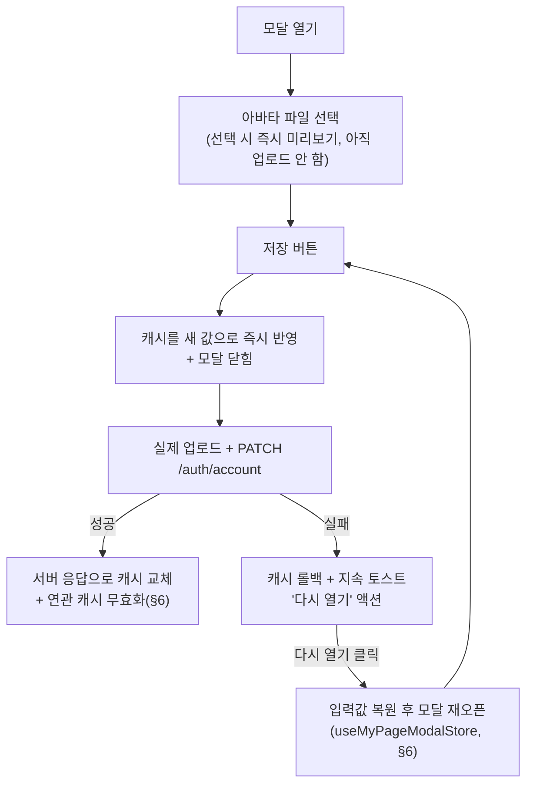

# 마이페이지 (프로필 수정) 기능

> **문서 성격**: 독립 기능 문서(서사형)
>
> **대상 독자**: 이 레포 FE를 처음 보거나 오랜만에 돌아온 개발자.
>
> **읽고 나면**: 저장 실패 시 재오픈 복원과 닉네임 중복확인이 어떻게 동작하는지
> 이해하고, 이 모달에 필드를 추가하거나 캐시 무효화 범위를 바꿀 수 있다.
>
> **마지막 검토**: 2026-09-04

네비게이션 바 아바타 드롭다운에서 **프로필 수정** 메뉴를 클릭하면 모달이 열립니다.
닉네임 변경 및 프로필 이미지(아바타) 교체를 지원합니다.

## 1. 쉬운 설명

일반적인 "저장" 버튼과 달리, 이 모달은 **저장 버튼을 누르는 순간 화면부터
먼저 바뀐다.** 서버 응답을 기다리지 않고 모달이 즉시 닫히고 새 닉네임·아바타가
바로 보인다(낙관적 업데이트). 만약 나중에 저장이 실패하면, 몇 초 뒤 화면
아래에 "실패했습니다 · 다시 열기" 토스트가 뜨고, 그걸 누르면 **방금 입력했던
값(이미지 포함) 그대로** 모달이 다시 열린다 — 사용자가 입력을 처음부터
다시 할 필요가 없다.



## 2. 전제 지식

React Hook Form·TanStack Query의 낙관적 업데이트(`onMutate`/`onError` 롤백)
기본 개념은 안다고 가정한다.

가정하지 않는 것:

- 이 레포 전반의 인증 상태 관리(로그인/로그아웃, `ProtectedRoute`) →
  `entities/user`, `shared/store/auth.store.ts`
- 처음 나오는 용어(`restoreValues`, `NicknameStatus` 등) → §11 용어 사전

## 3. 사용한 도구·기술

**기능 자체를 이루는 것**

- **React Hook Form + Zod** — 닉네임 필드 검증(`updateAccountSchema`)
- **TanStack Query** — 낙관적 업데이트 + 실패 롤백(`useUpdateAccountMutation`)
- **Zustand**(`useMyPageModalStore`) — 저장 실패 후 재오픈 시 입력값 복원
- **`useDebounce`** — 닉네임 중복확인 디바운스
- **Radix UI Avatar** — 아바타 이미지/이니셜 폴백

**구현·검증 과정에서 쓴 도구**: MSW(`src/mocks/handlers/auth.handlers.ts`),
Vitest — §8 참고.

## 4. 왜 만들었나

사용자가 닉네임·프로필 이미지를 바꿀 수 있는 진입점이 필요했다. 저장이 느리게
느껴지지 않도록 낙관적 업데이트를 택했고, 그 대가로 실패했을 때 입력을 잃지
않게 하는 복원 장치(§5·§6)가 함께 필요해졌다.

## 5. 구조

### API 엔드포인트

| 메서드  | 경로                   | 설명                                           |
| ------- | ---------------------- | ---------------------------------------------- |
| `PATCH` | `/auth/account`        | 닉네임·이미지 URL 업데이트                     |
| `POST`  | `/auth/account/avatar` | 이미지 파일 업로드 → Supabase Storage URL 반환 |

**PATCH /auth/account**

```json
// Request Body
{ "nickname": "newNick", "image": "https://..." }

// Response
{
  "status": 200,
  "data": { "id": "...", "email": "...", "nickname": "newNick", "image": "https://...", ... }
}
```

**POST /auth/account/avatar**(`multipart/form-data`)

```json
// field: "file" (이미지 파일)

// Response
{
  "status": 200,
  "data": { "imageUrl": "https://supabase.co/storage/v1/object/public/..." }
}
```

### 저장 흐름 — 낙관적 업데이트 + 실패 시 복원

§1 순서도의 각 단계가 실제로 어떻게 구현됐는지:

1. **파일 선택 즉시 검증**(`handleAvatarChange`) — 업로드 시점까지 기다리지
   않고 고르는 즉시 `getImageFileSizeError`로 용량을 검사한다. 통과하면
   `objectURL`로 미리보기만 만들고(`pendingFile` 상태), 실제 업로드는 아직
   하지 않는다.
2. **제출**(`onSubmit`) — 서버 응답을 기다리지 않고 `onSuccess?.()`로 모달을
   먼저 닫는다. `updateAccount({ nickname, image, file, previewUrl })`를
   호출한다.
3. **낙관적 반영**(`useUpdateAccountMutation`의 `onMutate`) — `authKeys.account()`
   캐시를 새 닉네임 + (파일을 골랐다면) blob 미리보기 URL로 즉시 덮어쓴다.
4. **성공**(`onSuccess`) — 서버가 돌려준 실제 값(실제 업로드 URL 포함)으로
   캐시를 교체하고, `handleAccountUpdateSuccess()`(§6)로 연관 캐시를 무효화한다.
5. **실패**(`onError`) — 캐시를 낙관적 반영 이전 값으로 롤백하고, **자동으로
   사라지지 않는**(`duration: Infinity`) 에러 토스트에 "다시 열기" 액션을
   붙인다. 클릭하면 시도했던 값(파일 포함)을 `useMyPageModalStore`에 저장하고
   히스토리 엔트리를 새로 push해 모달을 다시 연다 — 이 콜백은 토스트 라이브러리의
   DOM 클릭 핸들러 안에서 실행돼 React 훅을 쓸 수 없으므로, 모달을 열 때
   `NavigationService.navigate(...)`로 직접 라우팅한다.

### 닉네임 중복확인 — 디바운스 선제 검사

저장 후 409로 복구하는 대신, **타이핑을 멈춘 뒤(디바운스 500ms) 미리 막는다**
(GitHub·X·Discord·Bluesky 등이 쓰는 방식). blur 이벤트로 트리거하지 않는
이유는 "저장 버튼 클릭이 blur를 먼저 유발해 검사가 끝나기 전에 제출되는"
레이스가 있기 때문이다 — 디바운스는 매 키 입력마다 상태가 바뀌므로 저장
버튼이 렌더 시점에 이미 disabled로 그려져 이 레이스가 구조적으로 없다.

원래 자기 닉네임으로 되돌아온 경우, 형식 오류(Zod)가 이미 떠 있는 경우, 조회
자체가 실패한 경우(네트워크 오류 등 — 이때는 "확인됨"이라고 속이지 않고
`idle`로 두고 실제 중복이면 저장 시점에 BE가 409로 다시 막는다)는 각각 서버
조회를 건너뛴다. 상태 값은 §6 `NicknameStatus`.

### 그 밖의 구현 세부사항

**Zod 스키마 — `image: z.string().nullish()`**: BE Kotlin `String?` 타입은
JSON `null`로 직렬화된다. `z.string().optional()`은 `null`을 거부하므로
`updateAccountSchema`에서 `image` 필드에 `.nullish()`를 쓴다.

**`isDirty` 감지**: React Hook Form의 `formState.isDirty`는 registered
필드(nickname)만 감지한다. `image`는 폼에 등록되지 않으므로
`pendingFile !== null` 조건을 OR로 결합한다
(`isDirty: form.formState.isDirty || pendingFile !== null`).

**아바타 깜빡임 방지**: Radix UI `Avatar`는 이미지 로드 실패 시에만
`AvatarFallback`을 표시한다. 이미지가 있을 때도 `AvatarFallback`을 렌더링하면
로딩 중 → Fallback → 이미지 순으로 깜빡인다. 이미지가 없을 때만
`AvatarFallback`을 조건부 렌더링하면(`{!image && <AvatarFallback>...}`)
Fallback이 DOM에 없어 브라우저 캐시에서 즉시 로드되며 깜빡임이 없다.

### 로그아웃 처리

이 모달과 직접 관련은 없지만 같은 `entities/user/api/auth.queries.ts`에
있고 `AuthUtil`을 공유하므로 함께 적는다. `useLogoutMutation`은 서버 응답을
기다리지 않고 즉시 인증 상태를 지운다 — 현재 화면이 **보호된 경로**면
`AuthUtil.clearAll(ROUTES_PATHS.POST.ROOT)`(인증 초기화 + 캐시 리셋 + 공개
피드로 이동)를, **비로그인도 볼 수 있는 경로**면 `AuthUtil.clearAuth()` +
`AuthUtil.clearQueries()`만 호출하고 이동은 하지 않는다. FCM 토큰 해제는
백그라운드로 처리한다(`unregisterFcmToken().catch(...)`).

```typescript
// entities/user/api/auth.queries.ts (요지만 발췌)
const logout = () => {
  authApi.logout().catch((error) => console.error('[LOGOUT] Error logging out:', error));

  if (isProtectedPath(window.location.pathname)) {
    AuthUtil.clearAll(ROUTES_PATHS.POST.ROOT);
  } else {
    AuthUtil.clearAuth();
    AuthUtil.clearQueries();
  }

  unregisterFcmToken().catch((error) =>
    console.error('[LOGOUT] Error unregistering FCM token:', error)
  );
};
```

### Supabase Storage 버킷 구조

아바타 이미지는 `SupabaseStorageService.uploadFile(file)`(기본 버킷)을
사용한다. 댓글 이미지는 `uploadFile(file, "comments")` 형태로 버킷을
명시한다. (BE 코드 — `link-sphere_BE_NEW` 레포, 작성 당시 기준 기록)

```kotlin
// SupabaseStorageService.kt
fun uploadFile(file: MultipartFile): String = uploadFile(file, bucketName) // 기본 버킷 사용
fun uploadFile(file: MultipartFile, bucket: String): String { ... }        // 버킷 명시
```

## 6. 상태 모델

### `useMyPageModalStore`(`src/shared/store/mypage.store.ts`)

| 필드               | 타입                                                                                    | 역할                                                                         |
| ------------------ | --------------------------------------------------------------------------------------- | ---------------------------------------------------------------------------- |
| `restoreValues`    | `{ nickname: string; imagePreview: string \| null; pendingFile: File \| null } \| null` | 저장 실패 후 "다시 열기"로 재오픈할 때 복원할 입력값. 정상 open에서는 `null` |
| `setRestoreValues` | `(values) => void`                                                                      | §5 "저장 흐름"의 실패 콜백이 재오픈 직전에 호출                              |

모달은 닫힐 때 언마운트되므로 재오픈은 항상 새 마운트다 — `useUpdateProfile`의
`useState` 초기값들(`avatarPreview`, `pendingFile` 등)은 모두 이 `restoreValues`를
우선 참조하도록 돼 있다.

### `useUpdateProfile` 반환 계약

| 필드                                                              | 타입                           | 비고                                                                 |
| ----------------------------------------------------------------- | ------------------------------ | -------------------------------------------------------------------- |
| `form`                                                            | `UseFormReturn<UpdateAccount>` | react-hook-form 인스턴스                                             |
| `avatarPreview`                                                   | `string \| null`               | 현재 보여줄 아바타(선택한 파일의 objectURL 또는 계정 이미지)         |
| `handleAvatarChange`                                              | `(file: File) => void`         | 파일 선택 시 즉시 검증 + 미리보기                                    |
| `onSubmit`                                                        | `() => void`                   | 폼 제출 핸들러                                                       |
| `isPending`                                                       | `boolean`                      | mutation 진행 중                                                     |
| `isCheckingNickname` / `isNicknameAvailable` / `hasNicknameError` | `boolean`                      | `NicknameStatus`(아래) 파생값                                        |
| `hasDebounceSettled`                                              | `boolean`                      | 디바운스가 아직 안 끝났으면 `false` — 저장 버튼 비활성 조건에 쓰인다 |
| `isDirty`                                                         | `boolean`                      | `form.formState.isDirty \|\| pendingFile !== null`                   |
| `account`                                                         | `Account \| undefined`         | 현재 계정 정보                                                       |

`NicknameStatus`는 `'idle' | 'checking' | 'available' | 'duplicate'`
(`useUpdateProfile.ts` 로컬 타입).

### 프로필 변경 후 캐시 무효화(`handleAccountUpdateSuccess`, `entities/user/api/auth.keys.ts`)

```typescript
export const handleAccountUpdateSuccess = () => {
  postInvalidateQueries.all(); // 목록 + 상세의 author
  commentInvalidateQueries.all(); // 모든 게시글의 댓글 author
  folderInvalidateQueries.postsRoot(); // 폴더별 게시글 카드의 author
};
```

프로필(닉네임·이미지) 변경이 포스트·댓글·북마크 폴더의 게시글 카드에 표시되는
작성자 정보까지 함께 바꾸므로 셋 다 무효화한다(BE가 조회마다 `members`를
조인해 최신 값을 내려주므로 재조회만 하면 새 값이 온다). `account` 자체는
`onSuccess`에서 서버 응답으로 직접 캐시를 치환하므로 여기서 다시
invalidate하지 않는다 — 이미 쓴 값을 지우고 GET을 한 번 더 태우는 낭비를
피한다(같은 이유가 다른 cross-invalidation 지점에도 적용되는 이 레포의 관례).

## 7. 코드 지도와 자주 하는 수정

```
src/
├── widgets/
│   └── layout/
│       └── mypage/
│           └── ui/
│               └── MyPageModal.tsx          # Dialog 래퍼 (Radix UI)
├── features/
│   └── auth/
│       └── profile/
│           ├── ui/
│           │   └── UpdateProfileForm.tsx    # 닉네임 Input + 아바타 업로드 폼
│           └── hooks/
│               ├── useUpdateProfile.ts      # §5·§6 — 폼 상태·제출·이미지 미리보기·닉네임 중복확인
│               └── useUpdateProfile.test.tsx
├── entities/
│   └── user/
│       ├── api/
│       │   ├── auth.api.ts                  # updateAccount, uploadAvatar API 메서드
│       │   ├── auth.queries.ts              # useUpdateAccountMutation(§5), useLogoutMutation(§5)
│       │   └── auth.keys.ts                 # handleAccountUpdateSuccess (§6)
│       └── ui/
│           └── UserAvatar.tsx               # 공통 아바타 컴포넌트
└── shared/
    ├── store/
    │   └── mypage.store.ts                  # useMyPageModalStore (§6)
    ├── lib/
    │   └── image/resizeImage.ts             # getImageFileSizeError — 아바타 업로드 전 용량 검증
    ├── config/
    │   ├── api.ts                           # updateAccount, uploadAvatar 엔드포인트
    │   └── texts.ts                         # mypage, success/error 텍스트 상수
    └── types/
        └── auth.type.ts                     # updateAccountSchema, AvatarUploadResponse
```

### 자주 하는 수정

| 하고 싶은 것                       | 방법                                                                                                               |
| ---------------------------------- | ------------------------------------------------------------------------------------------------------------------ |
| 새 프로필 필드 추가(예: 자기소개)  | `auth.type.ts`의 `updateAccountSchema` + `useUpdateProfile`의 `form`/`onSubmit` + BE `UpdateAccountRequest` 동기화 |
| 닉네임 중복확인 디바운스 시간 조정 | `useUpdateProfile.ts`의 `useDebounce(watchedNickname, 500)`                                                        |
| 저장 실패 시 재오픈 동작 변경      | `auth.queries.ts`의 `useUpdateAccountMutation` `onError`                                                           |
| 캐시 무효화 범위 변경              | `auth.keys.ts`의 `handleAccountUpdateSuccess`                                                                      |
| 테스트 실행                        | `npx vitest run src/features/auth/profile/hooks/useUpdateProfile.test.tsx`                                         |

**MSW 목업(테스트 환경)**: `src/mocks/handlers/auth.handlers.ts`가
`PATCH /auth/account`·`POST /auth/account/avatar`를 가로채 고정 응답을
반환한다. 테스트 실행 시 실제 API를 호출하지 않는다.

## 8. 검증 결과

`useUpdateProfile.test.tsx` 12개 테스트 모두 통과(2026-09-04 재확인) — 닉네임
디바운스 검사, 형식 오류 시 조회 생략, 가용한 닉네임 처리, 디바운스 미정착
시 저장 버튼 비활성, 원래 값으로 되돌렸을 때 재조회 생략을 검증한다.

## 9. 시행착오

이 문서에 별도로 기록된 삽질 사례는 없다. 낙관적 업데이트 실패 시 복원
장치(§5·§6)는 시행착오라기보다 처음부터 설계에 포함된 요구사항이었다.

## 10. 남은 것

현재 알려진 미해결 이슈 없음.

## 11. 용어 사전

- **`restoreValues`** — `useMyPageModalStore`의 필드. 저장 실패 후 "다시
  열기"로 재오픈할 때 복원할 `{ nickname, imagePreview, pendingFile }`(§6)
- **`NicknameStatus`** — 닉네임 중복확인 상태(`'idle' | 'checking' |
'available' | 'duplicate'`, `useUpdateProfile.ts` 로컬 타입)
- **`pendingFile`** — 아직 업로드하지 않고 미리보기만 만든 선택된 파일
  (`useState<File | null>`, `useUpdateProfile.ts`)
- **`isDirty`** — React Hook Form의 `formState.isDirty`와 `pendingFile`
  존재 여부를 OR로 합친, 저장 버튼 활성화 조건(§5·§6)

## 12. 관련 문서

- [`UNSAVED-CHANGES-GUARD.md`](./UNSAVED-CHANGES-GUARD.md) — 이 모달의 폼
  자체는 전역 저장 가드 대상이 아니다(모달 닫힘 = 낙관적 제출이라 "저장 안
  한 채 이탈"이 발생하지 않는다)
