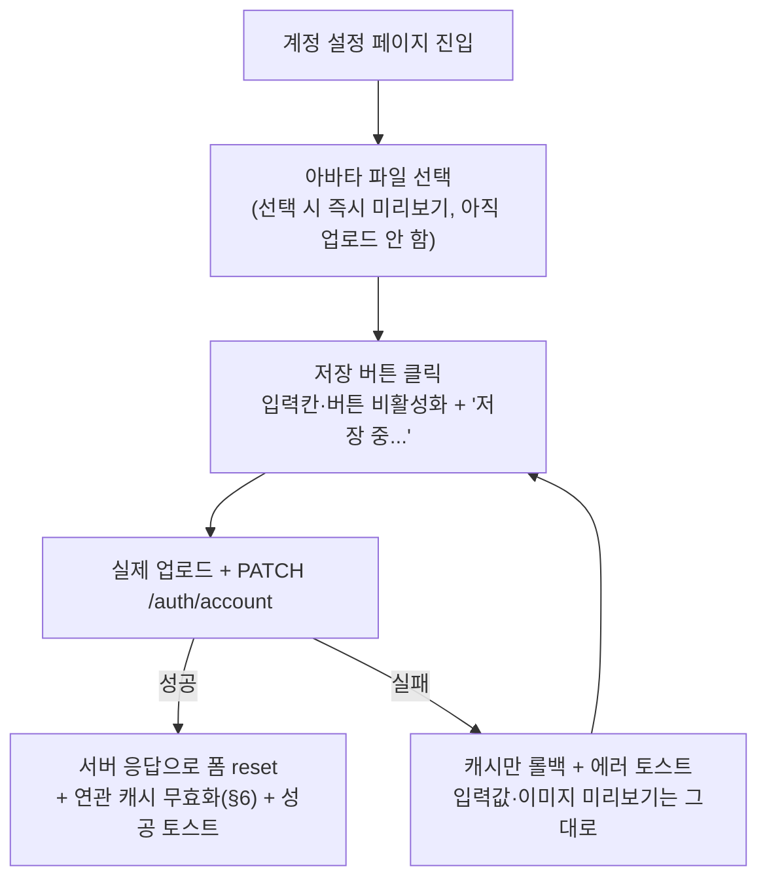

# 프로필 수정(계정 설정 화면 섹션) 기능

> **문서 성격**: 독립 기능 문서(서사형)
>
> **대상 독자**: 이 레포 FE를 처음 보거나 오랜만에 돌아온 개발자.
>
> **읽고 나면**: 저장 실패 시 입력값이 유지되는 방식과 닉네임 중복확인이 어떻게
> 동작하는지 이해하고, 이 폼에 필드를 추가하거나 캐시 무효화 범위를 바꿀 수 있다.
>
> **마지막 검토**: 2026-10-06

"계정 설정"(`/my/account`) 페이지 맨 위, 비밀번호 변경 섹션 바로 위에 있는
프로필 섹션입니다. 닉네임 변경 및 프로필 이미지(아바타) 교체를 지원합니다.
2026-09-29 전에는 Navbar 드롭다운의 "프로필 수정" 메뉴로 여는 별도 모달이었으나,
같은 페이지 섹션으로 통합됐다(배경은 `docs/DECISIONS.md` 2026-09-29 항목 참고).

## 1. 쉬운 설명

저장 버튼을 누르면 **서버 응답이 올 때까지 입력칸과 버튼이 비활성화되고
버튼 라벨이 "저장 중..."으로 바뀐다.** 화면을 떠나지 않으므로(모달이 아니라
페이지 섹션) 사용자가 결과를 놓칠 일이 없다. 성공하면 서버가 돌려준 값으로
폼이 정리되고 성공 토스트가 뜬다. 실패하면 캐시만 롤백되고, **방금 입력했던
닉네임과 골랐던 이미지는 화면에 그대로 남는다** — 처음부터 다시 입력할 필요
없이 바로 고쳐서 재시도할 수 있다.


```mermaid
flowchart TD
  Enter["계정 설정 페이지 진입"] --> Pick["아바타 파일 선택<br/>(선택 시 즉시 미리보기, 아직 업로드 안 함)"]
  Pick --> Submit["저장 버튼 클릭<br/>입력칸·버튼 비활성화 + '저장 중...'"]
  Submit --> Upload["실제 업로드 + PATCH /auth/account"]
  Upload -->|성공| Replace["서버 응답으로 폼 reset<br/>+ 연관 캐시 무효화(§6) + 성공 토스트"]
  Upload -->|실패| Rollback["캐시만 롤백 + 에러 토스트<br/>입력값·이미지 미리보기는 그대로"]
  Rollback --> Submit
```

## 2. 전제 지식

React Hook Form·TanStack Query의 낙관적 업데이트(`onMutate`/`onError` 롤백)
기본 개념은 안다고 가정한다.

가정하지 않는 것:

- 이 레포 전반의 인증 상태 관리(로그인/로그아웃, `ProtectedRoute`) →
  `entities/auth`, `shared/store/auth.store.ts`
- 처음 나오는 용어(`NicknameStatus`, `hydratedRef` 등) → §11 용어 사전

## 3. 사용한 도구·기술

**기능 자체를 이루는 것**

- **React Hook Form + Zod** — 닉네임 필드 검증(`updateAccountSchema`)
- **TanStack Query** — 낙관적 업데이트 + 실패 롤백(`useUpdateAccountMutation`)
- **`useDebounce`** — 닉네임 중복확인 디바운스
- **Radix UI Avatar** — 아바타 이미지/이니셜 폴백

**구현·검증 과정에서 쓴 도구**: MSW(`src/mocks/handlers/account.handlers.ts`),
Vitest — §8 참고.

## 4. 왜 만들었나

사용자가 닉네임·프로필 이미지를 바꿀 수 있는 진입점이 필요했다. 처음에는
Navbar 드롭다운에서 여는 모달이었는데, 계정 설정(`/my/account`) 페이지와
진입점이 둘로 나뉘어 있었고 모달의 비동기 열림이 클릭 가드를 사실상
무력화하는 문제도 있었다. 2026-09-29에 계정 설정 페이지의 한 섹션으로
합치면서, 모달 전제 위에 지어져 있던 "즉시 닫힘 + 실패 시 재오픈" 장치도
"응답을 기다리고, 실패해도 입력값을 그대로 유지"하는 더 단순한 방식으로
바꿨다(배경은 `docs/DECISIONS.md` 2026-09-29 항목 참고).

## 5. 구조

### API 엔드포인트

| 메서드  | 경로                 | 설명                                                                                                                                                               |
| ------- | -------------------- | ------------------------------------------------------------------------------------------------------------------------------------------------------------------ |
| `PATCH` | `/auth/account`      | 닉네임·이미지 URL 업데이트                                                                                                                                         |
| `POST`  | `/upload/signed-url` | 파일 확장자로 서명된 업로드 URL(`uploadUrl`/`token`/`publicUrl`) 발급 — 아바타 전용이 아니라 이미지 업로드 전반이 쓰는 범용 엔드포인트(`shared/api/upload.api.ts`) |

**PATCH /auth/account**

```json
// Request Body
{ "nickname": "newNick", "image": "https://..." }

// Response
{
  "status": 200,
  "data": { "id": "...", "email": "...", "nickname": "newNick", "image": "https://...", ... }
}
```

**아바타 저장은 두 단계** — BE에 파일을 직접 올리는 엔드포인트는 없다(`shared/lib/upload/uploadImageAndGetUrl.ts`):

```json
// 1) POST /upload/signed-url { "fileExtension": "png" }
// Response
{ "uploadUrl": "https://...", "token": "...", "publicUrl": "https://..." }

// 2) uploadUrl로 파일을 스토리지에 직접 PUT(BE를 거치지 않음)
// 3) 반환받은 publicUrl을 PATCH /auth/account의 image로 전송
```

### 저장 흐름 — 응답 대기 + 실패 시 입력값 유지

§1 순서도의 각 단계가 실제로 어떻게 구현됐는지:

1. **파일 선택 즉시 검증**(`handleAvatarChange`) — 업로드 시점까지 기다리지
   않고 고르는 즉시 `getImageFileSizeError`로 용량을 검사한다. 통과하면
   `objectURL`로 미리보기만 만들고(`pendingFile` 상태), 실제 업로드는 아직
   하지 않는다.
2. **제출**(`onSubmit`) — `updateAccount({ nickname, image, file, previewUrl },
{ onSuccess, onError })`를 호출한다. 페이지를 떠나지 않으므로 콜백을
   `mutate()` 호출부에 직접 넘겨도 안전하다(컴포넌트가 언마운트되지 않는 한
   `mutate(vars, { onSuccess })`는 정상 실행된다).
3. **낙관적 반영**(`useUpdateAccountMutation`의 `onMutate`) — `accountKeys.root`
   캐시를 새 닉네임 + (파일을 골랐다면) blob 미리보기 URL로 즉시 덮어쓴다.
   이 동안 `isPending`이 `true`라 입력칸·저장 버튼이 비활성화되고 버튼 라벨이
   "저장 중..."으로 바뀐다(Phase 1 버튼 컨벤션, `docs/FE-ARCHITECTURE.md` §10-A).
4. **성공**(`useUpdateAccount`의 `onSubmit`에 넘긴 `onSuccess`) — 서버가 돌려준
   실제 값(실제 업로드 URL 포함)으로 폼을 `reset`해 dirty를 해제하고
   `pendingFile`을 비운다. `useUpdateAccountMutation`의 `onSuccess`가 캐시를
   같은 값으로 교체하고 `handleAccountUpdateSuccess(queryClient)`(§6)로 연관
   캐시를 무효화하며, `meta.successMessage`로 전역 성공 토스트가 뜬다.
5. **실패**(`onSubmit`에 넘긴 `onError`) — 아무것도 하지 않는다. 캐시는
   `useUpdateAccountMutation`의 `onError`가 낙관적 반영 이전 값으로 롤백하고
   에러 토스트를 띄우지만(문구는 원인별이다 — 닉네임 중복, 사진 업로드 한도의 대기
   시간, 저장소 장애, 연결 끊김 등. 사진 업로드 단계 문구는 댓글 폼과 같은 것을 쓴다,
   [`COMMENT.md`](./COMMENT.md) §5 "실패 안내"), 폼의 닉네임 입력값·`pendingFile`·`avatarPreview`는
   전부 그대로 남는다 — 페이지를 벗어나지 않았으므로 값을 고쳐 바로 다시
   저장 버튼을 누르면 된다.

### 닉네임 중복확인 — 디바운스 선제 검사

저장 후 409로 복구하는 대신, **타이핑을 멈춘 뒤(디바운스 500ms) 미리 막는다**
(GitHub·X·Discord·Bluesky 등이 쓰는 방식). blur 이벤트로 트리거하지 않는
이유는 "저장 버튼 클릭이 blur를 먼저 유발해 검사가 끝나기 전에 제출되는"
레이스가 있기 때문이다 — 디바운스는 매 키 입력마다 상태가 바뀌므로 저장
버튼이 렌더 시점에 이미 disabled로 그려져 이 레이스가 구조적으로 없다.

원래 자기 닉네임으로 되돌아온 경우, 형식 오류(Zod)가 이미 떠 있는 경우, 조회
자체가 실패한 경우(네트워크 오류 등 — 이때는 "확인됨"이라고 속이지 않고
`idle`로 두고 실제 중복이면 저장 시점에 BE가 409로 다시 막는다)는 각각 서버
조회를 건너뛴다. 상태 값은 §6 `NicknameStatus`.

### 그 밖의 구현 세부사항

**Zod 스키마 — `image: z.string().nullish()`**: BE Kotlin `String?` 타입은
JSON `null`로 직렬화된다. `z.string().optional()`은 `null`을 거부하므로
`updateAccountSchema`에서 `image` 필드에 `.nullish()`를 쓴다.

**`isDirty` 감지**: React Hook Form의 `formState.isDirty`는 registered
필드(nickname)만 감지한다. `image`는 폼에 등록되지 않으므로
`pendingFile !== null` 조건을 OR로 결합한다
(`isDirty: form.formState.isDirty || pendingFile !== null`).

**아바타 깜빡임 방지(정정, 2026-09-29)**: 이 섹션의 아바타는 자체 마크업이 아니라
공통 `UserAvatar`(`entities/user/ui/UserAvatar.tsx`)를 그대로 쓴다
(`UpdateAccountForm.tsx`). 그 컴포넌트의 실제 fallback 조건은 `!image`뿐이 아니라
`(!image || hasError) && nicknameInitial`이다 — `hasError`는 `AvatarImage`의
`onLoadingStatusChange`가 `'error'`를 보고할 때만 켜지는 로컬 상태이고, `image`
prop이 바뀌면 렌더 중에 이전 값(`prevImage`)과 비교해 초기화된다(effect 아님). `image && !hasError`일 때만
`AvatarImage`를 렌더링하고, `showFallback`(`(!image || hasError) &&
nicknameInitial`)일 때만 `AvatarFallback`을 렌더링해 두 요소가 동시에 DOM에
있는 경우를 없애므로, 로딩 중 → Fallback → 이미지 순의 깜빡임이 생기지 않는다.

### 로그아웃 처리

이 기능과 직접 관련은 없지만 `entities/auth/api/auth.queries.ts`에
있고 `AuthUtil`을 공유하므로 함께 적는다. `useLogoutMutation`은 서버 응답을
기다리지 않고 즉시 인증 상태를 지운다 — 현재 화면이 **보호된 경로**면
`AuthUtil.clearAll(ROUTES_PATHS.POST.ROOT)`(인증 초기화 + 캐시 폐기(재요청
없음) + 공개 피드로 이동)를, **비로그인도 볼 수 있는 경로**면
`AuthUtil.clearAuth()` + `AuthUtil.clearQueries()`(캐시 리셋 + 배경 재요청)만
호출하고 이동은 하지 않는다. 두 경로의 캐시 처리 방식이 다른 이유는
`docs/AUTH.md` §8-E 참고. FCM 토큰 해제는 백그라운드로 처리한다
(`unregisterFcmToken().catch(...)`).

```typescript
// entities/auth/api/auth.queries.ts (요지만 발췌)
const logout = () => {
  authApi.logout().catch((error) => console.error('[LOGOUT] Error logging out:', error));

  if (isProtectedPath(window.location.pathname)) {
    AuthUtil.clearAll(ROUTES_PATHS.POST.ROOT);
  } else {
    AuthUtil.clearAuth();
    AuthUtil.clearQueries();
  }

  unregisterFcmToken().catch((error) =>
    console.error('[LOGOUT] Error unregistering FCM token:', error)
  );
};
```

### 같은 페이지의 다른 섹션들

`src/pages/myaccount/MyAccountPage.tsx`(`ROUTES_PATHS.MY_ACCOUNT = '/my/account'`,
"계정 설정")는 이 문서가 다루는 프로필 섹션을 포함해 네 구획을 세로로 쌓는다:
`EmailVerificationBanner`(이메일 미인증 시 안내 + 재발송 버튼), **프로필 섹션**(이
문서), `ChangePasswordForm`(`features/auth/password-change`), `DeleteAccountSection`
(`features/account/delete`) — 비밀번호 입력 후 탈퇴를 신청하는 폼이다. 탈퇴는
즉시 삭제가 아니라 **14일 유예**다: 신청 즉시 로그아웃되고 작성한 글·댓글은
"탈퇴한 사용자"로 표시되지만, 14일 안에 다시 로그인하면 탈퇴가 취소된다. 14일이
지나면 북마크·좋아요·조회 기록이 삭제되고 되돌릴 수 없다(문구는
`TEXTS.accountSettings.deleteSectionDescription`, `shared/config/texts.ts` — 이
유예 기간 값은 BE `AccountDeletionService.GRACE_PERIOD`와 반드시 같아야 하고
자동 동기화 장치가 없다고 그 파일 주석이 명시한다). 네 섹션은 각자 독립된 폼
(별도 `FormProvider`)이라 한 섹션에 입력 중이어도 다른 섹션 제출에 영향을 주지
않는다.

## 6. 상태 모델

### 폼 하이드레이션(`hydratedRef`)

페이지 섹션은 모달과 달리 언마운트되지 않으므로, `account` 데이터가 늦게
도착하거나(새로고침 직후) 다른 곳에서 다시 갱신되더라도 폼을 몇 번이고 덮어쓰면
안 된다. `useUpdateAccount.ts`의 `hydratedRef`(`useRef<boolean>`)가 "이미
한 번 하이드레이션했는지"를 기억한다 — 최초로 `account`가 도착했을 때만
`reset({ nickname, image })`을 호출하고, 그 뒤로는 사용자가 입력 중인 값을
그대로 둔다(`useUpdateAccount.test.tsx`의 "account가 뒤늦게 도착해도 하이드레이션은
1회만 일어난다" 케이스가 이 계약을 검증한다).

### `useUpdateAccount` 반환 계약

| 필드                                                              | 타입                           | 비고                                                                 |
| ----------------------------------------------------------------- | ------------------------------ | -------------------------------------------------------------------- |
| `form`                                                            | `UseFormReturn<UpdateAccount>` | react-hook-form 인스턴스                                             |
| `avatarPreview`                                                   | `string \| null`               | 현재 보여줄 아바타(선택한 파일의 objectURL 또는 계정 이미지)         |
| `handleAvatarChange`                                              | `(file: File) => void`         | 파일 선택 시 즉시 검증 + 미리보기                                    |
| `onSubmit`                                                        | `() => void`                   | 폼 제출 핸들러                                                       |
| `isPending`                                                       | `boolean`                      | mutation 진행 중                                                     |
| `isCheckingNickname` / `isNicknameAvailable` / `hasNicknameError` | `boolean`                      | `NicknameStatus`(아래) 파생값                                        |
| `hasDebounceSettled`                                              | `boolean`                      | 디바운스가 아직 안 끝났으면 `false` — 저장 버튼 비활성 조건에 쓰인다 |
| `isDirty`                                                         | `boolean`                      | `form.formState.isDirty \|\| pendingFile !== null`                   |
| `account`                                                         | `Account \| undefined`         | 현재 계정 정보                                                       |

`NicknameStatus`는 `'idle' | 'checking' | 'available' | 'duplicate'`
(`useUpdateAccount.ts` 로컬 타입).

### 프로필 변경 후 캐시 무효화(`handleAccountUpdateSuccess`, `entities/account/api/account.keys.ts`)

```typescript
export const handleAccountUpdateSuccess = (queryClient: QueryClient) => {
  postInvalidateQueries.all(queryClient); // 목록 + 상세의 author
  commentInvalidateQueries.all(queryClient); // 모든 게시글의 댓글 author
  bookmarkFolderInvalidateQueries.postsRoot(queryClient); // 폴더별 게시글 카드의 author
};
```

프로필(닉네임·이미지) 변경이 포스트·댓글·북마크 폴더의 게시글 카드에 표시되는
작성자 정보까지 함께 바꾸므로 셋 다 무효화한다(BE가 조회마다 `members`를
조인해 최신 값을 내려주므로 재조회만 하면 새 값이 온다). `account` 자체는
`onSuccess`에서 서버 응답으로 직접 캐시를 치환하므로 여기서 다시
invalidate하지 않는다 — 이미 쓴 값을 지우고 GET을 한 번 더 태우는 낭비를
피한다(같은 이유가 다른 cross-invalidation 지점에도 적용되는 이 레포의 관례).

## 7. 코드 지도와 자주 하는 수정

```
src/
├── pages/
│   └── myaccount/
│       └── MyAccountPage.tsx                # "계정 설정" 페이지 — 이 섹션을 포함한 네 구획을 배치
├── features/
│   └── account/
│       └── update/
│           ├── ui/
│           │   └── UpdateAccountForm.tsx    # 닉네임 Input + 아바타 업로드 폼
│           └── hooks/
│               ├── useUpdateAccount.ts      # §5·§6 — 폼 상태·제출·이미지 미리보기·닉네임 중복확인
│               └── useUpdateAccount.test.tsx
├── entities/
│   ├── account/
│   │   ├── api/
│   │   │   ├── account.api.ts               # updateAccount API 메서드(파일 업로드는 shared/lib/upload 경유)
│   │   │   ├── account.queries.ts           # useUpdateAccountMutation (§5)
│   │   │   └── account.keys.ts              # handleAccountUpdateSuccess (§6)
│   │   └── model/
│   │       ├── account.dto.ts               # Account(BE 스펙 생성 alias)
│   │       └── account.schema.ts            # updateAccountSchema
│   ├── auth/
│   │   └── api/
│   │       └── auth.queries.ts              # useLogoutMutation (§5)
│   └── user/
│       └── ui/
│           └── UserAvatar.tsx               # 공통 아바타 컴포넌트
└── shared/
    ├── lib/
    │   └── image/resizeImage.ts             # getImageFileSizeError — 아바타 업로드 전 용량 검증
    └── config/
        ├── api.ts                           # updateAccount 엔드포인트, upload.signedUrl(범용)
        └── texts.ts                         # mypage, success/error 텍스트 상수
```

### 자주 하는 수정

| 하고 싶은 것                       | 방법                                                                                                                                            |
| ---------------------------------- | ----------------------------------------------------------------------------------------------------------------------------------------------- |
| 새 프로필 필드 추가(예: 자기소개)  | `account.schema.ts`의 `updateAccountSchema` + `useUpdateAccount`의 `form`/`onSubmit` + BE `UpdateAccountRequest` 동기화                         |
| 닉네임 중복확인 디바운스 시간 조정 | `useUpdateAccount.ts`의 `useDebounce(watchedNickname, 500)`                                                                                     |
| 저장 실패 시 동작 변경             | `useUpdateAccount.ts`의 `onSubmit`에 넘기는 `onError`(폼 쪽) / `account.queries.ts`의 `useUpdateAccountMutation` `onError`(캐시 롤백·토스트 쪽) |
| 캐시 무효화 범위 변경              | `account.keys.ts`의 `handleAccountUpdateSuccess`                                                                                                |
| 테스트 실행                        | `npx vitest run src/features/account/update/hooks/useUpdateAccount.test.tsx`                                                                    |

**MSW 목업(테스트 환경)**: `src/mocks/handlers/account.handlers.ts`가
`GET`/`PATCH /auth/account`·`GET /auth/account/nickname-availability`를 가로채 고정
응답을 반환한다. 테스트 실행 시 실제 API를 호출하지 않는다.

## 8. 검증 결과

`useUpdateAccount.test.tsx` 15개 테스트 모두 통과(2026-09-29 재확인) — 위
12개(초기값 세팅, 이미지 선택/용량 검증, 닉네임 API 호출, 디바운스 검사, 형식
오류 시 조회 생략, 가용한 닉네임 처리, 디바운스 미정착 시 저장 버튼 비활성,
원래 값으로 되돌렸을 때 재조회 생략)에 더해 pending 중 입력값 유지, 성공 시
폼 reset, 409 롤백 후에도 닉네임·이미지 미리보기 유지, account 뒤늦은 도착
시 하이드레이션 1회 검증 4개가 새로 추가됐다. `e2e/account-update.spec.ts`
2개 테스트(저장 중 비활성화 + 409 롤백 후 값 유지, 롤백 후 재시도 성공)도 통과.

## 9. 시행착오

**e2e `getByLabel(..., { exact: true })`가 계속 실패했던 원인(2026-09-29)**:
닉네임 입력칸을 `page.getByLabel(TEXTS.labels.nickname, { exact: true })`로
찾으려 하면 매번 타임아웃이 났다. 라벨 텍스트 자체는 `TEXTS.labels.nickname`
("닉네임")과 정확히 같았지만, 라벨 옆의 필수 표시(`RequiredMark`, `aria-hidden`)가
접근성 트리 계산에 끼어들어 실제 계산된 접근성 이름이 정확히 "닉네임"과
일치하지 않았다 — `exact: true` 없이(부분 일치)는 바로 찾아졌다. 이 레포의
다른 폼 필드 e2e 셀렉터들도 전부 `exact` 없이 쓰고 있다는 걸 뒤늦게
확인했다 — 새 e2e 스펙에서 라벨 필드를 찾을 때는 `exact: true`를 기본으로
넣지 않는다.

## 10. 남은 것

- 다른 탭에서 프로필을 바꾼 뒤 이 탭으로 돌아왔을 때, 이미 하이드레이션된
  폼은 백그라운드 재조회로 `account`가 갱신돼도 자동으로 따라가지 않는다
  (§6 `hydratedRef`가 의도적으로 막는 동작 — 사용자가 입력 중인 값을 지우지
  않기 위한 트레이드오프). 편집 중이 아닐 때만 최신값을 반영하는 개선은
  아직 하지 않았다.

## 11. 용어 사전

- **`hydratedRef`** — 폼을 `account` 데이터로 최초 1회만 채웠는지 기억하는
  `useRef<boolean>`(§6, `useUpdateAccount.ts`)
- **`NicknameStatus`** — 닉네임 중복확인 상태(`'idle' | 'checking' |
'available' | 'duplicate'`, `useUpdateAccount.ts` 로컬 타입)
- **`pendingFile`** — 아직 업로드하지 않고 미리보기만 만든 선택된 파일
  (`useState<File | null>`, `useUpdateAccount.ts`)
- **`isDirty`** — React Hook Form의 `formState.isDirty`와 `pendingFile`
  존재 여부를 OR로 합친, 저장 버튼 활성화 조건(§5·§6)

## 12. 관련 문서

- [`UNSAVED-CHANGES-GUARD.md`](./UNSAVED-CHANGES-GUARD.md) — 이 프로필 폼은
  그 문서가 정의하는 가드 대상 목록(게시글 등록/수정, 댓글·답글 작성/수정,
  회원가입)에 처음부터 포함돼 있지 않다. 페이지 섹션이 된 지금도 그 정책은
  그대로다(정정, 2026-09-29 — 예전에는 "모달 닫힘 = 즉시 제출이라 이탈이
  발생하지 않는다"고 적혀 있었는데, 지금은 모달이 아니라 더 이상 성립하지
  않는 이유였다)
