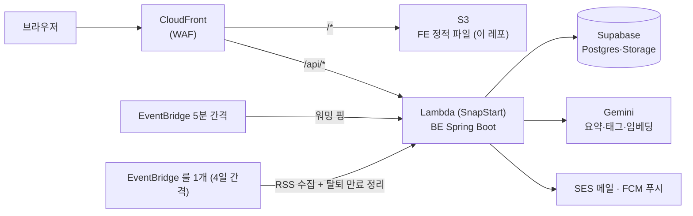
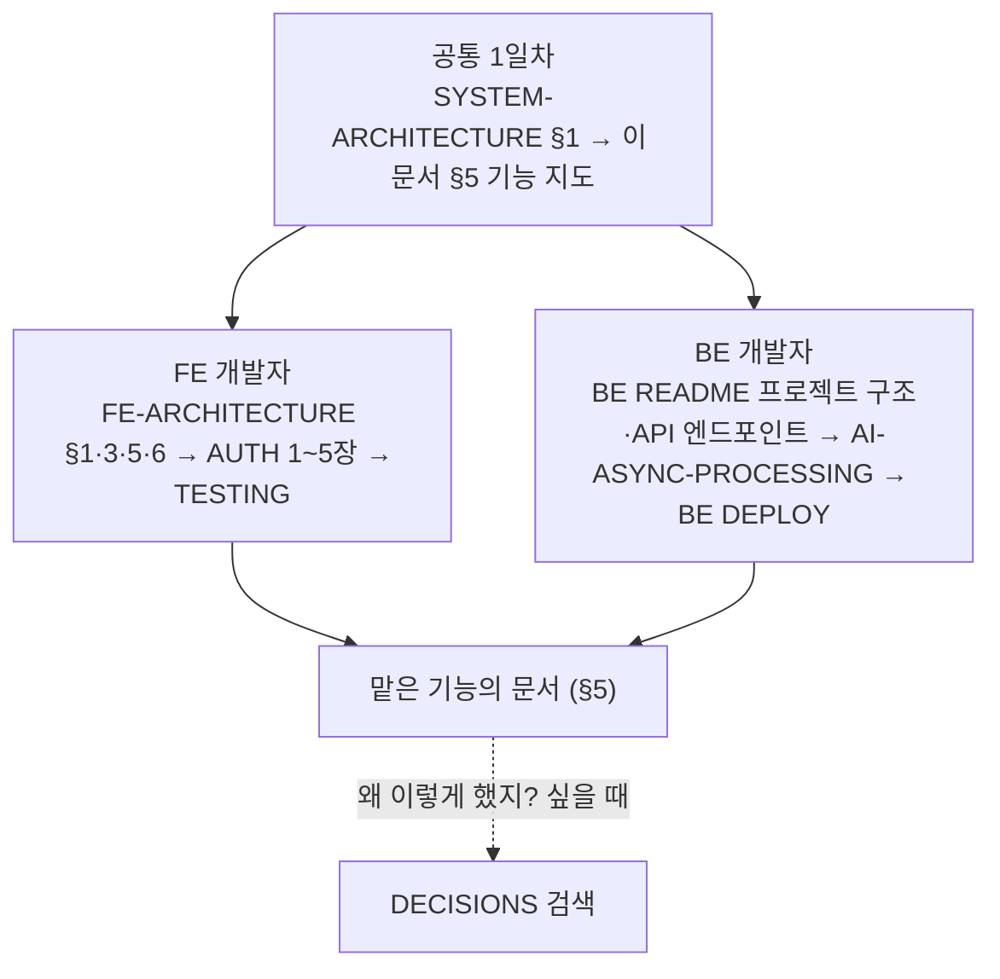

# Link Sphere 온보딩 — 처음 왔다면 여기서 시작

> **문서 성격**: 길잡이(온보딩) — 사실을 새로 담지 않고, FE·BE 두 레포에 흩어진 문서와 코드로
> 가는 길을 엮는다. 값·구조·명령의 정본은 각 링크 대상이다.
>
> **대상 독자**: 이 프로젝트(FE·BE)에 처음 합류했거나 오랜만에 돌아온 개발자.
>
> **읽고 나면**: 서비스 전체 그림을 한 장으로 설명할 수 있고, 어떤 기능을 고쳐야 할 때 어느
> 레포의 어느 문서·코드부터 보면 되는지 안다.
>
> **마지막 검토**: 2026-10-02

---

## 1. 이 서비스는 무엇인가

**Link Sphere는 링크를 공유하고 모아 두는 소셜 서비스다.** 사용자가 URL을 올리면 BE가
페이지를 크롤링하고 Gemini AI가 요약·태그를 붙인다. 다른 사용자는 그 글에 댓글·좋아요를 달고,
마음에 드는 글을 북마크 폴더로 정리한다. RSS 봇이 외부 피드에서 글을 자동으로 올리기도 한다.

- 배포 URL·테스트 계정·Storybook 주소: [FE README](../README.md) 맨 위
- 서비스 한 줄 소개와 AI·검색 방식: [BE README](https://github.com/BAECHAN/link-sphere_BE_NEW#readme) 맨 위

## 2. 전체 그림

- FE와 BE는 **같은 도메인(CloudFront)** 을 쓰고, 경로로 갈린다(`/api/*`만 BE).
- **RSS 수집과 탈퇴 만료 정리는 EventBridge 룰 하나를 공유한다** — 한쪽 주기를 바꾸면 다른 쪽도 바뀐다
  ([RSS-FEED-BOT](https://github.com/BAECHAN/link-sphere_BE_NEW/blob/main/docs/RSS-FEED-BOT.md), 룰 조작은 [BE DEPLOY](https://github.com/BAECHAN/link-sphere_BE_NEW/blob/main/docs/DEPLOY.md)). 이 인프라는 IaC가 없어 레포에 설정값이 없다.
- 인프라·배포 파이프라인 상세: [`SYSTEM-ARCHITECTURE.md`](./SYSTEM-ARCHITECTURE.md) §1(시스템), §2(배포), §3(FE), §4(BE)
- FE 내부 코드 구조(FSD 레이어): [`FE-ARCHITECTURE.md`](./FE-ARCHITECTURE.md) §1·§3
- FE 실제 import 구조를 그림으로 보기: `pnpm graph:archi`(슬라이스 단위), `pnpm graph "<경로>"`(특정 파일에 닿는 모든 파일)

## 3. 두 레포

| 레포                                                                          | 역할                           | 스택(상세는 README)                              | 정본 문서 목록                                                            |
| ----------------------------------------------------------------------------- | ------------------------------ | ------------------------------------------------ | ------------------------------------------------------------------------- |
| [link-sphere_FE_NEW](https://github.com/BAECHAN/link-sphere_FE_NEW) (이 레포) | 화면·상태·API 호출             | React · TypeScript · Vite · TanStack Query · FSD | [README `## 문서`](../README.md#문서)                                     |
| [link-sphere_BE_NEW](https://github.com/BAECHAN/link-sphere_BE_NEW)           | REST API · AI 분석 · 예약 작업 | Kotlin · Spring Boot · JPA · Lambda              | [BE README `## 문서`](https://github.com/BAECHAN/link-sphere_BE_NEW#문서) |

**프로젝트 전체에 걸친 문서는 FE 레포가 정본이다.** 이 문서, 시스템 아키텍처, BE·FE 버전 호환
매트릭스([`VERSION-COMPATIBILITY.md`](./VERSION-COMPATIBILITY.md)), 커밋 이력([`HISTORY.md`](./HISTORY.md))이 여기 있다.

**FE 응답 타입은 BE의 OpenAPI 스펙에서 생성된다.** BE DTO를 바꾸면 FE에 영향이 간다 —
[`OPENAPI-CODEGEN.md`](./OPENAPI-CODEGEN.md). 운영 스펙과 FE 스냅샷이 어긋나면 매일 도는 드리프트 체크가 FE 레포에
이슈를 연다.

## 4. 첫날 할 일

1. **BE를 먼저 띄운다**(포트 8080) — [BE README `## 시작하기`](https://github.com/BAECHAN/link-sphere_BE_NEW#시작하기)
   (JDK 17, `application-secret.yml` 작성)
2. **FE를 띄운다**(포트 31119) — [FE README `## 시작하기`](../README.md#시작하기)
   (Node 24, `.env`의 `VITE_API_BASE_URL`이 `/api` 요청을 프록시할 BE를 가리킨다. 로컬 BE라면
   `http://localhost:8080` — 프록시(`vite.config.ts`의 `server.proxy`)가 경로를 바꾸지 않으므로 뒤에 `/api`를
   붙이지 않는다)
3. BE 비밀값(Supabase·Gemini 등 `application-secret.yml`)과 FE `.env`는 레포에 없다 — 프로젝트 관리자에게 받는다.
4. 브라우저에서 테스트 계정으로 로그인해 아래 기능 지도의 화면을 한 번씩 눌러 본다.

## 5. 기능 지도

화면 경로는 FE 라우터([`src/app/routes/index.tsx`](../src/app/routes/index.tsx), 상수는
[`src/shared/config/route-paths.ts`](../src/shared/config/route-paths.ts)) 기준이다. BE API 목록은
[BE README `## API 엔드포인트`](https://github.com/BAECHAN/link-sphere_BE_NEW#api-엔드포인트)가 정본이다.

| 기능                                           | 화면 경로                        | FE 코드                                                                                     | BE 도메인                    | FE 문서                                                                                       | BE 문서                                                                                                             |
| ---------------------------------------------- | -------------------------------- | ------------------------------------------------------------------------------------------- | ---------------------------- | --------------------------------------------------------------------------------------------- | ------------------------------------------------------------------------------------------------------------------- |
| 로그인·회원가입·이메일 인증·비밀번호 찾기/변경 | `/auth/*`                        | `pages/auth/`, `features/auth/*`, `entities/auth/`, `widgets/layout/login-dialog/`          | `auth`, `member`             | [AUTH](./AUTH.md)                                                                             | —                                                                                                                   |
| 게시글 목록(홈 피드)                           | `/` → `/post`                    | `pages/post/index.tsx`, `widgets/post/post-list/`, `widgets/post/post-card/`                | `post`                       | [POST](./POST.md), 검색·필터는 [SEARCH](./SEARCH.md)                                          | —                                                                                                                   |
| 게시글 검색                                    | `/post?q=…`                      | `widgets/post/post-list/`, `widgets/layout/navbar/`                                         | `post`, `category`           | [SEARCH](./SEARCH.md)                                                                         | —                                                                                                                   |
| 게시글 상세                                    | `/post/:id`                      | `pages/post/PostDetailPage.tsx`                                                             | `post`                       | [POST](./POST.md), 돌아가기는 [POST-DETAIL-BACK-NAVIGATION](./POST-DETAIL-BACK-NAVIGATION.md) | —                                                                                                                   |
| 게시글 작성·수정·삭제                          | `/post/submit`, `/post/edit/:id` | `features/post/{create,update,delete}/`, `entities/post/`                                   | `post`, `category`, `upload` | [POST](./POST.md), 이탈 방지는 [UNSAVED-CHANGES-GUARD](./UNSAVED-CHANGES-GUARD.md)            | [AI-ASYNC-PROCESSING](https://github.com/BAECHAN/link-sphere_BE_NEW/blob/main/docs/AI-ASYNC-PROCESSING.md)(AI 분석) |
| 댓글·답글                                      | `/post/:id` 하단                 | `features/comment/*`, `widgets/comment/comment-list/`, `entities/comment/`                  | `comment`                    | [COMMENT](./COMMENT.md)                                                                       | —                                                                                                                   |
| 내 댓글                                        | `/my/comments`                   | `pages/mycomment/`, `widgets/comment/my-comment-list/`                                      | `comment`                    | [COMMENT](./COMMENT.md)                                                                       | —                                                                                                                   |
| 좋아요(게시글·댓글)                            | 카드·상세·댓글                   | `features/post/like/`, `features/comment/like/`, `entities/interaction/`                    | `interaction`                | [POST](./POST.md)(게시글), [COMMENT](./COMMENT.md)(댓글)                                      | —                                                                                                                   |
| 북마크·폴더                                    | `/bookmark`                      | `pages/bookmark/`, `features/bookmark/*`, `widgets/bookmark/*`, `entities/bookmark/folder/` | `interaction`                | [BOOKMARK](./BOOKMARK.md)(한 북마크가 여러 폴더에 속함 — 이동 = 추가+제거)                    | —                                                                                                                   |
| 프로필 수정                                    | `/my/account`                    | `pages/myaccount/`, `features/account/update/`                                              | `auth`, `upload`             | [MYPAGE](./MYPAGE.md)                                                                         | —                                                                                                                   |
| 회원 탈퇴(14일 유예)                           | `/my/account`                    | `features/account/delete/`                                                                  | `auth`, `member`             | —                                                                                             | [ACCOUNT-DELETION](https://github.com/BAECHAN/link-sphere_BE_NEW/blob/main/docs/ACCOUNT-DELETION.md)                |
| 댓글·답글 푸시 알림                            | (브라우저 알림)                  | `shared/lib/firebase/`, `shared/api/fcm.api.ts`                                             | FCM 토큰 API(`infra/fcm`)    | [FCM-PUSH-NOTIFICATION](./FCM-PUSH-NOTIFICATION.md)                                           | —                                                                                                                   |
| RSS 피드 자동 수집 봇                          | (화면 없음)                      | —                                                                                           | `feed`                       | —                                                                                             | [RSS-FEED-BOT](https://github.com/BAECHAN/link-sphere_BE_NEW/blob/main/docs/RSS-FEED-BOT.md)                        |
| 레이아웃(상단바·사이드바·하단 탭바)            | 전 화면                          | `widgets/layout/*`, `src/app/layouts/`                                                      | —                            | 없음(아래 요약), 반응형 규약은 `responsive-ux` skill                                          | —                                                                                                                   |
| 에러 페이지                                    | `/403`, `/500`, 그 외 404        | `pages/403/`, `pages/404/`, `pages/500/`                                                    | —                            | 없음(아래 요약)                                                                               | —                                                                                                                   |
| 배포 버전 확인·새 버전 자동 새로고침           | `/version`                       | `pages/version/`                                                                            | —                            | [BUILD-VERSION](./BUILD-VERSION.md), [NEW-VERSION-RELOAD](./NEW-VERSION-RELOAD.md)            | —                                                                                                                   |
| 실사용자 모니터링                              | (화면 없음)                      | —                                                                                           | —                            | [RUM](./RUM.md)                                                                               | —                                                                                                                   |

경로 표기는 `src/` 아래 기준이다(`features/auth/*` = `src/features/auth/` 아래 슬라이스 전부).

### 기능 문서가 따로 없는 화면 — 요약

동작 스펙이 얇아 독립 문서를 두지 않은 화면이다.

- **레이아웃** — 상단바는 공통이고, `md` 이상 화면은 사이드바, 그 미만은 하단 탭바로 이동한다. 진입: `widgets/layout/`, `src/app/layouts/`.
- **에러 페이지** — `/403`·`/500`·없는 경로(404)는 각 페이지 컴포넌트가 그린다. 렌더 중 터진 오류는
  `src/app/routes/RouteErrorBoundary.tsx`가 받아 공통 오류 화면을 보여 준다.

## 6. 읽는 순서

- FE: [`FE-ARCHITECTURE.md`](./FE-ARCHITECTURE.md) §1·§3·§5·§6 → [`AUTH.md`](./AUTH.md) 1~5장 →
  [`TESTING.md`](./TESTING.md)
- BE: [BE README](https://github.com/BAECHAN/link-sphere_BE_NEW#readme) → [AI-ASYNC-PROCESSING](https://github.com/BAECHAN/link-sphere_BE_NEW/blob/main/docs/AI-ASYNC-PROCESSING.md)
  → [BE DEPLOY](https://github.com/BAECHAN/link-sphere_BE_NEW/blob/main/docs/DEPLOY.md)
- 기능 문서는 1장 "쉬운 설명"(장 끝 순서도 포함)만 먼저 읽어도 흐름이 잡힌다. 코드 지도·시행착오는 그 기능을
  고칠 때 읽는다.
- [`DECISIONS.md`](./DECISIONS.md)는 처음부터 읽지 않는다 — 결정 기록 로그라 길다(append-only).

## 7. 공통 용어

여러 문서에 걸쳐 나오는 말만 모았다. 기능 고유 용어는 각 기능 문서 끝의 "용어 사전"을 본다.

| 용어            | 뜻                                                                                                                                    | 정본                                                                                          |
| --------------- | ------------------------------------------------------------------------------------------------------------------------------------- | --------------------------------------------------------------------------------------------- |
| FSD             | FE 폴더를 `app → pages → widgets → features → entities → shared` 레이어로 나누고 위에서 아래로만 import하는 구조                      | [FE-ARCHITECTURE](./FE-ARCHITECTURE.md) §1                                                    |
| 슬라이스        | 레이어 안의 기능 단위 폴더(예: `features/post/create/`)                                                                               | 같은 문서 §1·§3                                                                               |
| `@x`            | 한 엔티티가 다른 엔티티에 공개하는 교차 참조 파일(`entities/<공개하는-쪽>/@x/<쓰는-쪽>.ts`). 엔티티끼리는 이 파일로만 서로 import한다 | 같은 문서 §5                                                                                  |
| 3-Layer API     | entity마다 `*.api.ts`(HTTP) → `*.keys.ts`(쿼리 키·무효화) → `*.queries.ts`(React Query 훅) 세 파일로 나누는 패턴                      | 같은 문서 §5                                                                                  |
| 낙관적 업데이트 | 서버 응답 전에 화면을 먼저 바꾸고 실패하면 되돌리는 방식                                                                              | 같은 문서 §11                                                                                 |
| `TEXTS`         | 화면 문구를 모아 둔 상수(`src/shared/config/texts.ts`). 코드에 한글 문구를 직접 쓰지 않는다                                           | `texts-conventions` skill                                                                     |
| SSOT            | 한 사실의 정본을 한 곳에만 두고 나머지는 그걸 가리키는 원칙. 이 문서가 사실을 복제하지 않는 이유                                      | —                                                                                             |
| OAC             | CloudFront가 BE Lambda 요청에 서명을 붙여, CloudFront를 거치지 않은 직접 호출을 막는 장치                                             | [SYSTEM-ARCHITECTURE](./SYSTEM-ARCHITECTURE.md) §1, [AUTH](./AUTH.md)                         |
| SnapStart       | Lambda 콜드스타트를 줄이려고 초기화가 끝난 상태를 스냅샷해 두는 기능                                                                  | [BE PERFORMANCE](https://github.com/BAECHAN/link-sphere_BE_NEW/blob/main/docs/PERFORMANCE.md) |

## 8. 작업 규칙 요약

전체 규칙은 각 레포의 `.claude/CLAUDE.md`([FE](../.claude/CLAUDE.md),
[BE](https://github.com/BAECHAN/link-sphere_BE_NEW/blob/main/.claude/CLAUDE.md))가 정본이다. 처음 알아둘 것만:

- **작업은 워크트리에서** — 여러 세션이 한 체크아웃을 공유하지 않게 한다.
- **커밋 형식은 `.gitmessage`를 따른다** — `type(scope): 요약`.
- **PR은 squash 병합** — `main` 이력이 PR 하나당 한 줄이다.
- **feat·fix·perf 커밋은 같은 커밋에 `CHANGELOG.md` `[Unreleased]` 항목을 넣는다.**
- **동작을 바꾸면 그 동작을 서술한 문서도 함께 고친다** — 반대편 레포 문서 포함. 기능 문서를 추가·삭제하면
  이 문서 §5 기능 지도도 갱신한다.
- **새 엔티티·기능 추가**: [FE-ARCHITECTURE](./FE-ARCHITECTURE.md) §21·§22 체크리스트, Claude Code를 쓰면
  `/add-entity-api`·`/new-feature`·`/new-domain` 슬래시 커맨드가 같은 형태로 뼈대를 만든다.
- **FE 검증 순서**: `pnpm type-check` → `pnpm test` → `pnpm lint` → (문서 수정 시) `pnpm check:docs`.

## 9. 관련 문서

- [FE README `## 문서`](../README.md#문서) — FE 문서 전체 목록과 분류
- [BE README `## 문서`](https://github.com/BAECHAN/link-sphere_BE_NEW#문서) — BE 문서 전체 목록
- [`SYSTEM-ARCHITECTURE.md`](./SYSTEM-ARCHITECTURE.md) — 인프라·배포·FE/BE 구조 다이어그램
- [`FE-ARCHITECTURE.md`](./FE-ARCHITECTURE.md) — FE 구조와 재사용 패턴
