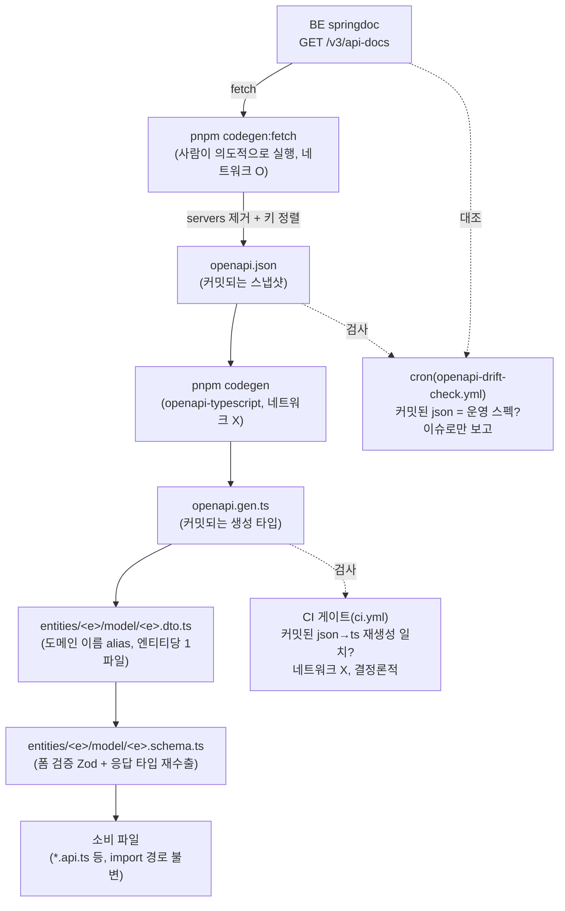

# BE OpenAPI 스펙 기반 FE 타입 생성

> 독립 기능 문서(서사형)다.
>
> 대상 독자: 이 레포 FE를 처음 보거나 오랜만에 돌아온 개발자, 새 엔티티의 응답 타입을
> 추가해야 하는 개발자.
>
> 읽고 나면: 응답 타입이 어디서 오는지, 새 엔티티를 추가할 때 무엇을 만들어야 하는지,
> BE 스펙이 바뀌면 무슨 일이 일어나는지, BE nullable 정보가 왜 가끔 유실되는지 알게 된다.
>
> 마지막 검토: 2026-09-21

## 1. 쉬운 설명

FE는 BE가 뭘 돌려주는지 두 가지 방법으로 알 수 있다 — 사람이 코드를 보고 손으로 타입을
옮겨적거나, BE가 스스로 "내 API는 이렇게 생겼다"고 말해주는 것(OpenAPI 스펙)을 그대로
받아쓰거나. 이 레포는 원래 전자였다. `entities/*/model/*.schema.ts`에 BE 응답과 똑같이
생긴 Zod 스키마를 손으로 만들어뒀다 — 마치 다른 사람이 부르는 걸 듣고 받아적은 메모 같은
것이다. 받아적는 사람이 졸다가 한 줄 놓치거나, 부르는 사람이 내용을 바꿨는데 못 들으면
메모가 틀린다.

이 기능은 그 받아쓰기를 없앤다. BE(springdoc)가 자기 API 스펙을 JSON으로 공개하면
([`GET /v3/api-docs`](#8-코드-지도와-자주-하는-수정)), FE가 그 JSON을 그대로 저장해두고
(`src/shared/api/generated/openapi.json`), 코드 생성기(`openapi-typescript`)로 TypeScript
타입을 뽑아낸다(`openapi.gen.ts`). 엔티티별 `*.dto.ts`는 거기에 이 레포가 쓰는 이름만
붙이는 얇은 표지판이다. 사람이 더 이상 "BE가 뭘 보내는지" 기억하거나 옮겨적을 필요가
없다 — 스펙이 바뀌면 생성된 타입도 자동으로 바뀌고, FE 코드가 그 타입을 쓰고 있었다면
컴파일 에러로 바로 드러난다.

Zod는 없어지지 않았다 — 역할이 좁아졌을 뿐이다. 응답을 "받아 적는" 용도에서, 사용자가
입력한 걸 "검증하는" 용도로만 남았다(생성 폼, 검색 필터 등). 이 레포는 애초에 서버 응답에
Zod `.parse()`를 걸어본 적이 없다 — 그러니 응답 쪽 Zod는 처음부터 실질적인 검증 없이
"타입을 적어두는 문서" 역할만 하고 있었던 셈이고, 이제 그 역할을 스펙 생성 타입이 대신한다.



## 2. 전제 지식

- **가정하는 지식**: 이 레포의 FSD 레이어 구조와 3-Layer API 패턴(`docs/FE-ARCHITECTURE.md`
  §1·§5), Zod 기본 사용법, OpenAPI 3.0 스펙의 기본 개념(`paths`/`components.schemas`/`$ref`).
- **가정하지 않는 지식**: `openapi-typescript`의 내부 동작, swagger-core/springdoc의 모델
  변환 파이프라인(§10 시행착오에서 필요한 만큼 설명), BE Kotlin 코드베이스(필요한 부분만
  파일:줄로 인용).
- 왜 모노레포가 아니라 이 방식을 택했는지는 별도 설계 결정이 아니라 이 기능 자체의 설계
  전제라 `DECISIONS.md`에 없다 — 도입 배경(§4)에서 바로 다룬다.

## 3. 사용한 도구·기술

- **기능 자체**:
  - [`openapi-typescript`](https://www.npmjs.com/package/openapi-typescript) 7.13.0 —
    OpenAPI 3.0 JSON을 TypeScript 타입 선언으로 변환(런타임 코드 0, 타입만)
  - BE `springdoc-openapi-starter-webmvc-api` 2.7.0 — Kotlin 컨트롤러/DTO에서 OpenAPI
    스펙을 생성해 `/v3/api-docs`로 공개(운영 포함)
  - BE `NullableAwareModelConverter`/`NullableAwareOpenApiCustomizer`(swagger-core
    `ModelConverter` + springdoc `OpenApiCustomizer`) — Kotlin nullable 타입을 스펙의
    `nullable: true`로 반영(§10)
- **구현·검증 과정에서 쓴 도구**: `jq`(스펙 구조 확인·대조), `curl`(운영 스펙·실제 API
  응답 직접 확인), 로컬 `./gradlew bootRun`(BE 컨버터 실측), Python(`json` 모듈로 스펙
  전후 구조적 diff 확인)

## 4. 왜 만들었나

FE는 BE 응답 타입을 `entities/*/model/*.schema.ts`에 손으로 옮겨적어 관리해왔다.
`bookmark-folder.schema.ts`의 `// 폴더 항목 — BE FolderResponse 와 매핑` 같은 주석이 그
수작업의 증거였다. 이 방식은 두 가지 문제를 낳았다:

1. **동기화가 사람 기억에 의존한다.** BE가 필드를 추가/제거/변경해도 FE 타입은 자동으로
   안 바뀐다 — 사람이 알아채고 손으로 고쳐야 한다. `docs/VERSION-COMPATIBILITY.md`가
   11행짜리 수동 호환 매트릭스로 자란 게 그 결과다. 그중 3건은 "동시 배포 필수"/"BE 먼저
   배포 필수"로 표시돼 있고, FE v0.4.0 행에는 *"FE가 7일 먼저 머지됨 — BE 배포 전까지는
   비로그인 열람이 실제로는 동작하지 않음"*이라는 실제 불일치 기록도 남아 있었다.
2. **BE에는 이미 다리의 절반이 있었다.** `springdoc`이 운영 포함으로 떠 있고 스펙 JSON도
   공개 중이었는데 FE가 소비하지 않고 있었다.

목표는 응답 타입의 정본을 "사람 기억"에서 "BE 스펙"으로 옮기는 것이다. 4번 항목이 이
기능의 성공 기준이었다: **BE가 필드를 바꾸면 FE 코드가 컴파일 에러로 즉시 드러나야
한다** — 이전에는 런타임까지 몰랐다.

> 모노레포 전환도 검토했지만 보류했다. Kotlin↔TS는 언어가 달라 레포를 합쳐도 타입이
> 공유되지 않고, 배포 파이프라인이 둘인 이상(S3 vs Lambda) 배포 순서 제약도 남기 때문이다.
> 이 기능은 모노레포 여부와 독립적으로 이득이 있다.

## 5. 구조

### 5-1. 스펙을 어떻게 가져오는가 — vendored spec

스펙을 매 빌드마다 네트워크로 가져오는 대신, FE 레포에 스냅샷(`openapi.json`)을
**커밋**한다. 후보로 검토한 대안:

| 안                      | BE 실행 | 오프라인 CI | 배포 시차 문제                | 판정                                                                               |
| ----------------------- | ------- | ----------- | ----------------------------- | ---------------------------------------------------------------------------------- |
| 로컬 `bootRun` + fetch  | 필요    | ✗           | 없음                          | BE가 원격 DB+Firebase 시크릿을 요구해 FE 개발자·CI가 단독으로 못 띄움              |
| 운영 URL에서 매번 fetch | 불필요  | ✗           | **있음**                      | PR CI가 외부 시스템 상태에 의존 — BE 배포 시점에 따라 무관한 FE PR이 오탐으로 실패 |
| **커밋된 스냅샷**       | 불필요  | **✓**       | 명시적(사람이 갱신 PR을 연다) | **채택**                                                                           |

이 결정 때문에 파이프라인이 두 단계로 나뉜다:

```bash
pnpm codegen:fetch   # 네트워크 O — 사람이 의도적으로 실행, openapi.json 갱신
pnpm codegen         # 네트워크 X — openapi.json → openapi.gen.ts, CI가 이 단계만 재현
```

`scripts/fetch-openapi.js`는 `--from=local|prod`를 받는다(기본 `prod`). `servers` 필드를
반드시 제거하고 키를 정렬한다 — springdoc이 요청받은 오리진을 그대로 `servers[0].url`에
채워 넣어서, 지우지 않으면 로컬/운영 fetch 결과가 매번 다른 바이트가 되어 드리프트
게이트가 출처 차이로 오탐한다(정규화 로직은 `scripts/lib/openapi-spec.js`로 분리해
`fetch-openapi.js`와 `check-openapi-drift.js`가 공유한다).

### 5-2. 도구 선택 — 타입만 생성한다

`openapi-typescript`(타입만, 런타임 0)를 골랐다. 대안이었던 `orval`(훅까지 생성)은 이
레포와 직접 충돌한다 — ESLint `custom-query-rules/no-direct-query-import`가
`@tanstack/react-query` import를 `*.queries.ts`/`hooks/`로 제한해 orval 생성 훅이 생성
즉시 lint 위반이 되고, `apiClient`가 담당하는 401 자동 refresh(`client.ts:164-197`)·NFC
정규화·WAF 403 판별 같은 로직을 custom mutator로 다시 감싸야 해서 이점이 사라진다.
`openapi-zod-client`도 검토했으나, 이 레포는 응답에 `.parse()`를 쓴 적이 없어(§9) 쓰지
않는 런타임 코드가 번들에 들어가고, 기존 Zod에 섞인 FE 전용 검증(댓글 바이트 상한 등)은
생성물이 재현 못 해 결국 Zod가 두 벌이 된다.

### 5-3. 생성물 배치 — `shared/api/generated/`, 배럴 없음

```
src/shared/api/
├── client.ts        (기존)
├── api.type.ts       (신규 · 수기 — Unwrap 헬퍼)
└── generated/
    ├── openapi.json  (커밋)
    └── openapi.gen.ts (커밋)
```

`generated/`에 `index.ts`를 두지 않는다 — `custom-barrel-rules/no-barrel-import`가
`/index`로 끝나는 import를 금지하므로 배럴을 만들면 아무도 import할 수 없다. 직접 경로
(`@/shared/api/generated/openapi.gen`)로만 쓴다.

### 5-4. 엔티티별 `.dto.ts` — 정본을 가리키는 얇은 표지판

```typescript
// entities/category/model/category.dto.ts (override 없는 가장 단순한 예)
import type { components } from '@/shared/api/generated/openapi.gen';

export type CategoryOption = components['schemas']['CategoryResponse'];
```

생성 파일을 직접 import하는 곳은 **엔티티당 이 파일 하나뿐**이다 — 스펙 스키마 이름이
바뀌어도 고칠 자리가 한 곳이라는 뜻이다. `*.schema.ts`는 기존 타입 이름을 그대로
재수출한다:

```typescript
// entities/category/model/category.schema.ts
export type { CategoryOption } from '@/entities/category/model/category.dto';
```

이 재수출 패턴 덕분에 **소비 파일(`*.api.ts` 등)은 import 경로를 한 줄도 안 바꿔도
된다** — 마이그레이션 6개 엔티티 전체에서 소비 파일 변경이 0건이었던 이유다(§9).

## 6. 상태 모델

이 기능은 새 스토어나 쿼리 키를 도입하지 않는다. 대신 "타입의 정본이 어디 있는가"가
엔티티마다 세 갈래로 나뉜다:

| 엔티티            | `.dto.ts` (응답 정본)                                                   | `.schema.ts`에 남은 것                                                                     |
| ----------------- | ----------------------------------------------------------------------- | ------------------------------------------------------------------------------------------ |
| `category`        | `CategoryOption`                                                        | 재수출만(2줄)                                                                              |
| `auth`            | `LoginResponse`                                                         | `loginSchema`/`createAccountSchema`(폼)                                                    |
| `bookmark-folder` | `BookmarkFolder`/`BookmarkFolderListResponse`/`BookmarkFoldersResponse` | `createBookmarkFolderSchema`/`reorderBookmarkFoldersSchema`/`bookmarkFolderSortEnum`(폼)   |
| `comment`         | `Comment`/`MyComment`/`MyCommentListResponse`                           | `commentContentFormSchema`(폼)                                                             |
| `account`         | `Account`                                                               | `updateAccountSchema`(폼), `nicknameValidationSchema`/`emailValidationSchema`(재사용 검증) |
| `post`            | `Post`/`PostListResponse`/`PostListRequest`/`CreatePostResponse`        | `createPostSchema`/`updatePostSchema`(폼)                                                  |

override가 있는 타입(원본 대신 `Omit<...> & {...}`로 재정의한 것)은 `src/shared/api/generated/openapi.gen.ts`를
직접 읽지 않고 아래 §8 표에서 파일:줄로 찾는다.

## 7. 운영 파라미터

| 값                         | 위치                                                                    | 비고                                                                                                               |
| -------------------------- | ----------------------------------------------------------------------- | ------------------------------------------------------------------------------------------------------------------ |
| 스펙 fetch 대상(로컬)      | `.env`의 `VITE_API_BASE_URL`                                            | 개발자 로컬 전용 Lambda Function URL                                                                               |
| 스펙 fetch 대상(cron)      | `scripts/check-openapi-drift.js`의 `PROD_SPEC_URL` 상수                 | 운영 CloudFront 공개 도메인(`README.md`에 이미 공개) — 실제 사용자가 거치는 경로를 그대로 확인, 별도 시크릿 불필요 |
| 드리프트 cron 주기         | `.github/workflows/openapi-drift-check.yml`의 `cron: '0 0 * * *'`       | 매일 1회(UTC 0시)                                                                                                  |
| openapi-typescript 버전    | `package.json`의 devDependencies, `save-exact=true`(`.npmrc:23`)로 고정 | 7.13.0                                                                                                             |
| 스펙 규모(2026-09-20 기준) | —                                                                       | `paths` 30개, `components.schemas` 54개, `nullable` 프로퍼티 24개                                                  |

## 8. 코드 지도와 자주 하는 수정

### 파이프라인 자체를 고치려면

| 하는 일                                 | 파일                                                                           |
| --------------------------------------- | ------------------------------------------------------------------------------ |
| 스펙 가져오는 방식 변경                 | `scripts/fetch-openapi.js`                                                     |
| 정규화 로직(servers 제거, 키 정렬)      | `scripts/lib/openapi-spec.js` — fetch/drift-check 스크립트가 공유              |
| 타입 생성 커맨드                        | `package.json`의 `codegen`/`codegen:fetch` 스크립트                            |
| PR 게이트(재생성 일치 확인)             | `.github/workflows/ci.yml`의 "생성 타입 최신성 확인" 스텝                      |
| 운영 대조 cron                          | `.github/workflows/openapi-drift-check.yml` + `scripts/check-openapi-drift.js` |
| ESLint가 생성 파일을 건너뛰게 하는 설정 | `eslint.config.js`의 전역 `ignores` 배열(`**/src/shared/api/generated/**`)     |

### 새 엔티티에 응답 타입을 추가하려면

`/add-schema <domain> <entity>` 슬래시 커맨드(`.claude/commands/add-schema.md`)를 쓴다.
직접 하려면:

1. BE 스펙에 이미 엔드포인트가 있는지 확인: `pnpm codegen:fetch && pnpm codegen`
2. `src/shared/api/generated/openapi.json`에서 스키마 이름 확인:
   `jq '.components.schemas | keys[]' src/shared/api/generated/openapi.json | grep -i <entity>`
3. `entities/<entity>/model/<entity>.dto.ts` 생성 — §5-4 패턴을 따른다
4. 사용자 입력 검증이 필요하면(생성/수정 폼 등) `entities/<entity>/model/<entity>.schema.ts`에
   Zod로 추가

### 기존 엔티티에서 BE 응답이 nullable인데 FE 타입에 `null`이 없다면(또는 반대)

**원시 타입 프로퍼티**(string/number/boolean)는 BE `NullableAwareModelConverter`가 이미
`nullable: true`를 붙인다 — 스펙을 다시 받아오면(`pnpm codegen:fetch && pnpm codegen`)
해결된다.

**`$ref`로 참조되는 중첩 객체 프로퍼티**(다른 스키마를 가리키는 필드)는 이 컨버터가
적용되지 않는다(§10). `.dto.ts`에서 직접 override한다 — 실제 사례 4건:

| 엔티티.필드                                | 방향                                 | 파일:줄                                                                               | 근거                                                                                                                                                                |
| ------------------------------------------ | ------------------------------------ | ------------------------------------------------------------------------------------- | ------------------------------------------------------------------------------------------------------------------------------------------------------------------- |
| `bookmark-folder.lastUsedAt`               | 넓힘(`string?` → `string \| null?`)  | `entities/bookmark/folder/model/bookmark-folder.dto.ts:13-15`                         | `$ref` 아님(원시 타입)이지만 Phase 4 시점엔 BE 컨버터가 아직 없어서 override. 지금은 BE가 이미 처리하므로 이 override는 안전한 중복(제거해도 무방하지만 유지 — §11) |
| `comment.linkMetadata`                     | 넓힘(`X?` → `X \| null?`)            | `entities/comment/model/comment.dto.ts:18-21`                                         | `$ref` 프로퍼티라 BE 컨버터가 적용 안 됨. `CommentDTO.kt`의 실제 타입은 `LinkMetadata? = null`                                                                      |
| `account.role`                             | 좁힘(`string` → `'USER' \| 'ADMIN'`) | `entities/account/model/account.dto.ts:18-21`                                         | BE가 enum class가 아니라 String으로 선언해(`AuthDTO.kt:37`) 스펙에 enum이 안 실림                                                                                   |
| `account.nickname`, `post.author.nickname` | 좁힘(`string \| null?` → `string`)   | `entities/account/model/account.dto.ts:18-21`, `entities/post/model/post.dto.ts:9-13` | 스펙은 nullable이지만 계정 생성 경로(`SignupRequest.nickname`)가 필수라 실제로는 항상 존재. 실측(§9)으로 확인                                                       |

override 방향을 정하는 기준: **실제 런타임 데이터가 더 넓으면(값이 있을 수도, null일
수도 있으면) 넓히고, 실제로 존재할 수 없는 상태면 좁힌다.** 좁히기 전에는 항상 실제
소비처를 확인한다 — `account.nickname`을 좁힌 이유는 넓혔을 때 type-check가 10곳 넘는
에러를 실제로 냈기 때문이다(무의미한 `?? ''` 폴백이 번지는 걸 막기 위함).

### 재귀 타입/목록 응답의 `content`·`items`에 override가 안 먹는다면

`Omit`은 최상위 키만 제외할 뿐 중첩 타입까지 다시 쓰지 않는다. `Comment.replies`나
`PostListResponse.content`처럼 배열 필드가 override 없는 원본 타입을 그대로 참조하고
있다면, 그 필드도 함께 override해야 한다 — `entities/comment/model/comment.dto.ts`,
`entities/post/model/post.dto.ts`의 `content` override가 실제 사례다.

## 9. 검증 결과

- **파이프라인**: `pnpm codegen:fetch` 2회 연속 실행 해시 일치(멱등성), `--from=local`과
  `--from=prod` 결과 동일 바이트, `pnpm build` 전후 `dist` 크기 동일(15M — 생성 타입은
  런타임 코드 0)
- **CI 드리프트 게이트**: 정상/실패 경로 둘 다 로컬에서 강제 재현해 확인(스펙에 필드를
  하나 추가하고 `pnpm codegen` 없이 push하면 게이트가 실패하는 것, 정상 상태에선 통과하는
  것 둘 다)
- **각 엔티티 마이그레이션 후 공통 검증**: `pnpm type-check`(strict + `noUncheckedIndexedAccess`
  포함) 에러 0건, `pnpm lint`/`pnpm format:check` 통과, `pnpm test` 전량 통과, 소비 파일
  import 경로 무변경
- **실제 API 응답 대조**(가능한 엔드포인트만 — 인증 필요 없는 것):
  - `GET /common/category-option`: 응답 키 `[id, name]` = 스펙 `CategoryResponse.properties`
    키 완전 일치
  - `GET /post?page=0&size=3`: 응답 키 14개 전부 스펙과 일치, `createdAt`이 문자열임을
    확인, `author.nickname`이 실제 데이터(봇 계정 포함)에서 항상 존재함을 확인
- **BE nullable 컨버터**(Phase 0.5, 로컬 `bootRun`): `nullable: true`가 24개 프로퍼티에
  정확히 붙음, 200 응답 content 타입(스키마 참조) 완전히 동일(`@ApiResponses` 관련 회귀
  없음), 요청 DTO `required` 배열 불변, `nullable` 필드를 제외하면 전후 스펙이 완전히
  동일(Python으로 재귀 비교, diff 0)

## 10. 시행착오

### BE nullable 컨버터가 처음엔 전혀 동작하지 않았다

`ModelConverter.resolve()`가 넘겨주는 `type.type`이 항상 원시 `java.lang.Class`일
거라고 가정하고 캐스팅했는데(`(type.type as? Class<*>)`), 실제로는 호출 경로에 따라
Jackson의 `JavaType`(`SimpleType` 등)으로 감싸져 오는 경우가 섞여 있었다 — 요청 바디처럼
컨트롤러 시그니처에서 직접 스캔되는 타입은 원시 `Class`로, `ApiResponse<T>`의 `T`처럼
제네릭 타입 인자로 다시 해석되는 타입은 `JavaType`으로 왔다. 진단 로깅을 추가해
`resolve()`가 어떤 타입으로 몇 번 불리는지 실제로 찍어보고서야 발견했다. `rawClassOf()`
헬퍼를 만들어 두 경우를 다 처리하도록 고쳤다.

캐스팅을 고친 뒤에도 여전히 `nullable`이 하나도 안 붙었다. 다시 로깅을 넣어 확인해보니,
이름이 있는 모델(`PostResponse` 등)이 여러 곳에서 참조되면 swagger-core는 **최초 1회만
프로퍼티가 채워진 완전한 Schema를 만들어 `components.schemas`에 등록**하고, 이후 참조
지점에는 `{$ref: "#/components/schemas/PostResponse"}`만 있는 **빈 Schema(`properties=null`)**
를 돌려준다는 걸 알게 됐다. `ModelConverter.resolve()`는 이 `$ref` 전용 Schema만 보게
되는 경우가 대부분이라, 거기서 아무리 `properties[name].nullable = true`를 해봐야 실제
등록된 완전한 Schema에는 반영이 안 됐다.

해결책은 두 확장점으로 역할을 나누는 것이었다 — `ModelConverter.resolve()`는 실제 Kotlin
Class를 볼 수 있는 시점이므로 "스키마 이름 → nullable 프로퍼티명 집합"만 계산해 정적
맵에 저장해두고, springdoc이 스펙 생성을 끝낸 뒤 호출하는 `OpenApiCustomizer.customise()`
(이때는 `openAPI.components.schemas`가 이름 기준으로 전부 채워져 있다)에서 그 맵을 실제
적용했다. `$ref` 참조 자체는 형제 키(`nullable` 포함)를 가질 수 없다는 OpenAPI 3.0 제약
때문에, `$ref`로 참조되는 중첩 객체 프로퍼티(`comment.linkMetadata` 등)에는 이 방법으로도
`nullable`이 안 붙는다 — 원시 타입 프로퍼티에만 통한다. 이 잔여 한계가 §8의 override
표에 있는 항목들의 존재 이유다.

### FE 타입이 이미 거짓말을 하고 있던 걸 발견했다

`bookmark-folder.util.ts`의 기존 주석이 이미 이렇게 밝히고 있었다: _"apiClient.get<BookmarkFolderListResponse>()는
캐싱만 할 뿐 bookmarkFolderSchema로 파싱하지 않는다 — 그래서 lastUsedAt은 (BookmarkFolder
타입상 Date로 보여도) 실제로는 BE가 보낸 원시 ISO 문자열 그대로 들어온다."_ 즉 기존
`BookmarkFolder.lastUsedAt: Date` 타입은 처음부터 틀린 타입이었다 — 아무도 실제로
`Date`로 파싱한 적이 없었다. 마찬가지로 `post.schema.ts`의 `categories: z.array(...).nullable()`도
BE `PostDTO.kt`를 확인하니 `val categories: List<CategoryResponse>`(non-null)였다 —
기존 FE 타입이 오히려 틀렸던 쪽이고, 스펙이 그걸 바로잡아줬다.

### `Comment`/`Post`의 재귀·목록 필드에서 override가 안 먹혔다

`Omit<Schemas['CommentResponse'], 'linkMetadata'> & { linkMetadata?: X | null }` 형태로
`Comment` 타입을 처음 만들었을 때 `pnpm type-check`가 `patchCommentRecursively`
(`comment.queries.ts`) 등에서 대량의 타입 에러를 냈다. 원인은 `Omit`이 **최상위 키만**
제외한다는 것 — `CommentResponse.replies: CommentResponse[]`는 override 안 된 원본을
그대로 참조하고 있어서, 재귀 지점마다 `linkMetadata` override가 끊겼다. `replies`도
함께 override해서 해결했다(`Comment[]`로). `post.dto.ts`의 `PostListResponse.content`도
같은 이유로 함께 override했다.

## 11. 남은 것

- `bookmark-folder.dto.ts`의 `lastUsedAt` override는 BE `NullableAwareModelConverter`
  도입(Phase 0.5) 이전에 만들어진 것이라, 지금은 BE가 이미 `nullable: true`를 정확히
  보내므로 **안전한 중복**이다(없애도 동작은 같음) — 제거하지 않고 남겨뒀다. 이후 유사
  케이스를 만들 때 "BE 컨버터가 먼저 처리 중인 필드인지" 확인하는 습관이 필요하다
- BE `NullableAwareModelConverter`를 `$ref` 프로퍼티까지 처리하도록 넓히는 건 이번 범위
  밖으로 남겨뒀다(가능한 방법: OpenAPI 3.0의 `{"allOf": [{"$ref": "..."}], "nullable": true}`
  래핑) — 처리하면 §8의 override 표에서 `comment.linkMetadata`(`$ref` 프로퍼티) 항목이
  불필요해진다. `bookmark-folder.lastUsedAt`(원시 타입)은 이 확장과 무관하게 이미
  BE 컨버터가 처리 중이라 지금도 안전한 중복이다(위 §11 첫 항목)
- `LocalDateTime`에 타임존이 없다(`"2026-09-20T17:47:15.905264"` 형태) — 이 기능 범위
  밖의 기존 이슈. `new Date(문자열)`을 쓰면 로컬 시간대로 잘못 파싱될 위험이 있는데,
  `eslint.config.js`의 `no-native-date` 규칙이 이미 `new Date()` 직접 사용을 막아 안전망
  역할을 한다

## 12. 용어 사전

- **vendored spec**: 외부(BE)에서 받아온 산출물(OpenAPI 스펙 JSON)을 그때그때 fetch하지
  않고 저장소에 스냅샷으로 커밋해두는 방식. 네트워크 의존 없이 재현 가능한 빌드를 위해 씀
- **Layer 0**: `docs/FE-ARCHITECTURE.md` §5의 3-Layer API(`*.api.ts`→`*.keys.ts`→`*.queries.ts`)
  앞에 새로 추가된 계층 — 응답 타입의 정본(`*.dto.ts`)을 가리키는 이름
- **override**: 생성 타입 중 일부 프로퍼티를 `Omit<...> & {...}`로 다시 선언해 실제
  런타임과 스펙의 표현 차이를 메우는 것. 항상 BE 소스 파일:줄과 실측 근거를 주석으로 남긴다
- **드리프트(drift)**: 커밋된 생성 타입/스펙 스냅샷이 실제 BE 상태와 어긋나는 것.
  1층(재생성 불일치)과 2층(운영 스펙 불일치)으로 나눠 감지한다(§5-1)
- **`$ref` 프로퍼티**: OpenAPI 스키마에서 다른 스키마를 참조하는 프로퍼티
  (`{"$ref": "#/components/schemas/X"}`). 형제 키를 가질 수 없다는 OpenAPI 3.0 제약 때문에
  BE nullable 컨버터의 한계가 여기서 생긴다(§10)

## 13. 관련 문서

- [`docs/FE-ARCHITECTURE.md`](./FE-ARCHITECTURE.md) §5(3-Layer API, Layer 0 포함), §9(Zod
  Schema 패턴), §18(네이밍 컨벤션)
- [`.claude/commands/add-schema.md`](../.claude/commands/add-schema.md) — 새 엔티티 응답
  타입/폼 검증 추가 절차
- [`docs/VERSION-COMPATIBILITY.md`](./VERSION-COMPATIBILITY.md) — 이 기능이 줄이려는
  문제(BE·FE 계약 어긋남)의 기존 수동 관리 방식
- BE 레포 `NullableAwareModelConverter.kt`(`global/config/`) — §10에서 다룬 컨버터의
  실제 구현
