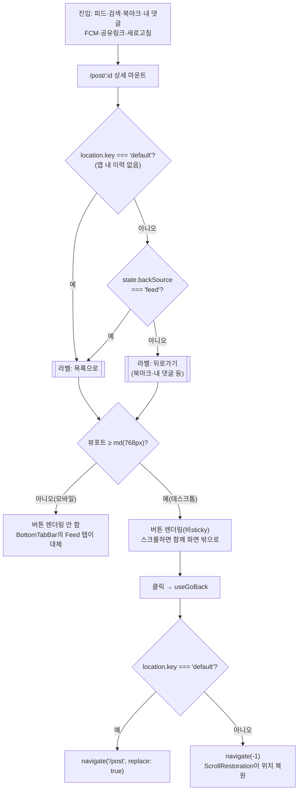

# 포스트 상세 돌아가기 내비게이션

> **문서 성격**: 독립 기능 문서(서사형)
>
> **대상 독자**: 이 레포 FE를 처음 보거나 오랜만에 돌아온 개발자.
>
> **읽고 나면**: 상세 페이지의 돌아가기 버튼이 모바일·데스크톱에서 왜 다르게 보이는지,
> 라벨("목록으로"/"뒤로가기")이 유입 경로에 따라 어떻게 정해지는지 알고, 새 유입 경로를
> 추가하거나 버튼의 노출·동작을 바꿀 수 있다.
>
> **마지막 검토**: 2026-09-19

게시글 상세(`/post/:id`)에서 돌아가는 수단은 화면 크기에 따라 아예 다릅니다 — 데스크톱은
버튼이 있고, 모바일은 버튼이 없는 대신 하단 탭바를 씁니다. 버튼이 있을 때도 라벨은
어디서 왔는지에 따라 "목록으로"·"뒤로가기" 둘 중 하나로 갈립니다.

이렇게 된 배경(왜 한 번 sticky로 고정했다가 모바일에서 아예 없앴는지, 실측치와 검토한
대안)은 [`docs/DECISIONS.md`](./DECISIONS.md)의 두 항목("포스트 상세 돌아가기 버튼:
sticky 고정 + 유입 경로별 라벨", "상세 돌아가기 버튼: 모바일 제거 + 데스크톱 sticky
해제")을 참고하세요. 이 문서는 **"지금 어떻게 동작하는가"**만 다룹니다.

## 1. 쉬운 설명

등산로의 "왔던 길로" 표지판을 생각하면 된다. 정상까지 길이 하나뿐인 구간(피드·검색에서
곧장 들어온 경우)에서는 표지판에 정확한 목적지("등산로 입구"="목록으로")를 적을 수
있다. 하지만 여러 갈래 길이 만나는 지점(북마크 폴더마다 다른 화면, "내 댓글"처럼 출처가
다양한 경우)에서는 어느 갈래인지 하나로 못 박을 수 없어 그냥 "왔던 방향"("뒤로가기")이라고만
적는다.

표지판을 세우는 자리도 산 크기에 따라 다르다. 데스크톱(큰 산)은 표지판을 등산로 시작
지점에 박아두고, 등산객이 위로 올라가면(스크롤하면) 표지판도 같이 시야에서 멀어진다
(sticky 아님). 모바일(작은 동네 뒷산)은 표지판을 따로 세우지 않는다 — 어차피 산
전체에 늘 켜져 있는 안내소(하단 탭바의 Feed)가 있어서, 거기로 가면 된다.

## 2. 전제 지식

- **가정하는 지식**: React Router v6의 `location.key`/`navigate(-1)`/`replace` 의미,
  Tailwind `md:` 반응형 분기 관례([`responsive-ux` skill](../.claude/skills/responsive-ux/SKILL.md)
  참고).
- **가정하지 않는 지식**: 왜 sticky를 도입했다가 걷어냈는지, velog·dev.to·네이버뉴스
  실측, Adobe XD 100px 가이드라인 같은 근거는 여기서 다시 설명하지 않는다 —
  [`docs/DECISIONS.md`](./DECISIONS.md)를 먼저 읽으면 이 문서의 "왜 이런 모양인가"가
  채워진다.

## 3. 사용한 도구·기술

- **기능 자체**: React Router v6(`useLocation`, `useNavigate`, history `key`), Tailwind
  `md:` 반응형 유틸리티, `useGoBack` 커스텀 훅, `BottomTabBar`(모바일 대체 수단).
- **구현·검증 과정에서 쓴 도구**: dev 서버 + Playwright(MCP)로 모바일 390px·데스크톱
  1440px 실측, Artifact로 배치 대안(자동 숨김/표시, 원형 오버레이, 헤더 통합) 비교,
  Playwright e2e(`chromium`/`mobile-chrome` 프로젝트).

## 4. 왜 만들었나 (문제)

"내가 쓴 댓글" 목록에서 카드를 클릭하면 `/post/:id#comment-:id`로 진입해 해당 댓글
위치로 스크롤된 채 화면이 시작된다. 이때 돌아가기 버튼이 페이지 최상단에만 있으면
화면 밖에 있는 상태로 시작했다(PR #100). sticky로 고정해 이 문제는 풀렸지만, 이번엔
Navbar와 버튼 바 두 줄이 스크롤 내내 함께 고정돼 모바일 화면의 상당 부분(124px)을
영구적으로 차지하는 새 문제가 생겼다(PR #103). 결국 "정확한 위치로 돌아가는 버튼을
항상 보여줄 것"과 "화면을 상시 어지럽히지 않을 것"이 모바일에서는 동시에 만족되지
않아, 모바일은 버튼을 포기하고 데스크톱만 유지하는 쪽을 택했다.

## 5. 구조

관여하는 파일과 책임:

| 파일                                                                                                            | 책임                                                                   |
| --------------------------------------------------------------------------------------------------------------- | ---------------------------------------------------------------------- |
| [`pages/post/PostDetailPage.tsx`](../src/pages/post/PostDetailPage.tsx)                                         | 버튼 노출 조건(`hidden md:inline-flex`), 라벨 계산(`resolveBackLabel`) |
| [`shared/hooks/useGoBack.ts`](../src/shared/hooks/useGoBack.ts)                                                 | 실제 이동 동작(`navigate(-1)` vs `replace`) — 라벨과 완전히 분리       |
| [`shared/config/texts.ts`](../src/shared/config/texts.ts)                                                       | 라벨 문자열 두 개(`post.detail.backToList`/`back`)                     |
| [`widgets/post/post-card/ui/PostCard.tsx`](../src/widgets/post/post-card/ui/PostCard.tsx)                       | `backSource` prop을 `<Link state>`로 실어 보내는 발신지                |
| [`widgets/layout/bottom-tab-bar/ui/BottomTabBar.tsx`](../src/widgets/layout/bottom-tab-bar/ui/BottomTabBar.tsx) | 모바일에서 버튼을 대신하는 상시 노출 수단(Feed 탭)                     |

라벨(무엇이라 부를지)과 동작(어디로 갈지)은 의도적으로 분리돼 있다 —
`resolveBackLabel`은 `location`만 읽고, `useGoBack`은 같은 `location.key` 조건을
독립적으로 다시 검사해 실제 이동을 결정한다. 둘을 하나로 합치지 않은 이유는 "이름을
약속할 수 있는가"(라벨)와 "실제로 이력이 있는가"(동작)가 우연히 같은 조건
(`location.key === 'default'`)을 공유할 뿐 별개의 질문이기 때문이다.

## 6. 상태 모델

새 전역 스토어나 스키마는 없다. 유일한 상태는 React Router의 history location이 실어
나르는 두 값뿐이다:

| 값                          | 타입                                | 누가 채우나                                                                | 누가 읽나                             |
| --------------------------- | ----------------------------------- | -------------------------------------------------------------------------- | ------------------------------------- |
| `location.key`              | `string` (react-router 내장)        | react-router — 세션 첫 진입은 `'default'`, 그 외는 매 이동마다 임의 문자열 | `resolveBackLabel`, `useGoBack` 둘 다 |
| `location.state.backSource` | `'feed' \| 'bookmark' \| undefined` | `PostCard`가 `<Link state={{ backSource }}>`로 실어 보냄                   | `resolveBackLabel`만                  |

`backSource`는 `PostList.tsx`(→`'feed'`)와 `BookmarkPostList.tsx`(→`'bookmark'`)만
채운다 — "내 댓글" 카드나 상세 자신의 제목 링크처럼 그 외 진입 경로는 `undefined`로
남고, `resolveBackLabel`이 이를 중립 라벨("뒤로가기")로 처리한다.

## 7. 운영 파라미터

하드코딩된 운영 파라미터는 없다. 유일한 분기점은 Tailwind의 기본 `md` 브레이크포인트
(768px)이며, 별도로 재정의하지 않고 그대로 쓴다
([`PostDetailPage.tsx:78`](../src/pages/post/PostDetailPage.tsx) `hidden md:inline-flex`).

## 8. 코드 지도와 자주 하는 수정

| 하고 싶은 것                         | 위치                                                                                                                                               | 방법                                                                                                                                            |
| ------------------------------------ | -------------------------------------------------------------------------------------------------------------------------------------------------- | ----------------------------------------------------------------------------------------------------------------------------------------------- |
| 새 유입 경로에 전용 라벨 추가        | [`PostCard.tsx:42`](../src/widgets/post/post-card/ui/PostCard.tsx#L42), [`PostDetailPage.tsx:20-46`](../src/pages/post/PostDetailPage.tsx#L20-L46) | `backSource` 유니온에 새 값 추가 → 해당 위젯에서 `<PostCard backSource="새값" />` 지정 → `resolveBackLabel`에 분기·`texts.ts`에 라벨 키 추가    |
| 돌아가기 동작(목적지) 자체를 바꾸기  | [`useGoBack.ts`](../src/shared/hooks/useGoBack.ts)                                                                                                 | 라벨 로직과 무관 — 이 훅만 수정하면 된다                                                                                                        |
| 모바일에서도 버튼을 다시 보이게 하기 | [`PostDetailPage.tsx:74-82`](../src/pages/post/PostDetailPage.tsx#L74-L82)                                                                         | `hidden md:inline-flex`를 제거하기 전에 §4의 트레이드오프(124px 상시 고정 vs standalone PWA 위치 복원)를 먼저 재검토 — `docs/DECISIONS.md` 참고 |
| e2e에서 이 버튼/Feed 탭을 다시 찾기  | [`e2e/post-detail-back.spec.ts`](../e2e/post-detail-back.spec.ts), [`e2e/post-detail-back.mobile.spec.ts`](../e2e/post-detail-back.mobile.spec.ts) | §10 "시행착오" 참고 — `role`만으로 찾으면 Sidebar의 숨은 사본과 strict mode 위반이 난다                                                         |

## 9. 검증 결과

- 실측(dev 서버, `getBoundingClientRect()`): 변경 전 모바일 124px·데스크톱 112px 상시
  고정 → 변경 후 모바일 0px(버튼 없음)·데스크톱은 스크롤 시 0px(비sticky).
- `pnpm type-check` / `pnpm lint` / `pnpm test`(380개) 통과.
- `pnpm test:e2e` 42개 전체 통과 — 기존 5개(`comment`/`post-visibility`/`like`×2/`comment-delete`)
  무수정 통과 + 이번에 추가한 2개(§10 참고).
- PR #103 CI(`e2e`, `check`) green, `main` 머지 후 `Frontend Deploy (S3 + CloudFront)`
  워크플로우 success 확인.

## 10. 시행착오

**e2e에서 "Feed" 링크를 role만으로 찾으면 strict mode 위반이 난다.** 모바일 뷰포트에서
`page.getByRole('link', { name: 'Feed' })`를 호출하면 2개가 잡힌다 — 처음엔 "데스크톱
`Sidebar`(`aside.hidden md:flex`)의 사본이 `display:none`이라 그렇겠지" 하고
`a:visible`로 걸러봤지만 여전히 2개였다. 실제로 `getComputedStyle`로 하나씩 찍어보니
range가 하나 더 있었다 — `Sidebar`가 **모바일 슬라이드 드로어용 사본**을 하나 더
갖고 있고, 닫힌 상태에서도 `transform`(`-translate-x-full`)으로 화면 밖으로 밀 뿐
`display`/`visibility`는 그대로라 Playwright의 `:visible` 판정을 통과했다. 결국
`BottomTabBar`의 루트 `<nav>`만 갖는 고유 클래스 조합(`fixed bottom-0`, 이 조합을 쓰는
컴포넌트는 레포 전체에서 이거 하나뿐 — `grep -rn "fixed bottom-0" src/`로 확인)으로
먼저 스코프를 좁힌 뒤 그 안에서 `getByRole`로 찾는 방식으로 고쳤다
([`e2e/post-detail-back.mobile.spec.ts`](../e2e/post-detail-back.mobile.spec.ts)).
같은 함정은 `Sidebar`나 `BottomTabBar`가 겹치는 다른 e2e를 작성할 때도 재현될 수
있다 — role/text만으로 유일성을 가정하지 말 것.

sticky를 걷어내는 과정 자체의 시행착오(0/12/16/24px 후보 비교, 원형 오버레이·자동
숨김/표시 대안 검토)는 이 기능의 "왜"에 속해 `docs/DECISIONS.md`에 이미 남겨뒀다 —
여기서 반복하지 않는다.

## 11. 남은 것

- **standalone PWA(홈 화면 추가) 모바일 사용자**는 정확한 위치 복귀 대신 `BottomTabBar`의
  Feed 탭(목록 최상단)으로만 돌아간다 — 의도적으로 받아들인 트레이드오프지만, 이
  사용자층 비중이 커지면 재검토 대상이다.
- `PostCard.tsx:93,269`가 `isDetail`일 때도 자기 자신(`/post/{id}`)을 링크해 상세에서
  제목을 눌러도 히스토리가 쌓이는 기존 버그는 이번 범위 밖으로 그대로 남아 있다(PR #100
  노트에서 이미 명시).
- `backSource`가 없는 유입 경로(북마크·내 댓글 등)는 전부 중립 라벨 "뒤로가기"로
  뭉뚱그려져 있다 — 특정 경로에 전용 라벨을 붙이고 싶으면 §8 레시피를 따른다.
- **2026-09-19 추가**: `PostList`·`BookmarkPostList`가 가상 스크롤로 바뀌면서, 여기 적힌
  "`navigate(-1)` / `<ScrollRestoration/>`이 위치 복원" 흐름 자체는 그대로지만 그 밑에
  보조 계층이 하나 생겼다 — 가상화된 목록은 문서 높이가 추정치라 `<ScrollRestoration/>`의
  `window.scrollTo`가 실제 위치에 못 미칠 수 있어, `shared/lib/virtual/virtual-snapshot.ts`가
  `location.key` 단위로 TanStack Virtual의 측정값 스냅샷을 sessionStorage에 저장·복원해
  첫 렌더부터 정확한 문서 높이를 만든다. `useGoBack`·`<ScrollRestoration/>` 자체는
  무변경. 근거는 [`docs/DECISIONS.md`](./DECISIONS.md)의 "2026-09-19" 항목,
  [`docs/plans/2026-09-19-virtualize-post-list.md`](./plans/2026-09-19-virtualize-post-list.md) 참고.

## 12. 용어 사전

- **`backSource`**: `PostCard`가 `<Link>`의 `state`로 실어 보내는 값(`'feed' | 'bookmark'`).
  상세 페이지가 "어느 화면에서 왔는지"를 알 수 있는 유일한 단서다.
- **`resolveBackLabel`**: `location`을 보고 버튼 라벨("목록으로"/"뒤로가기")을 고르는
  순수 함수. 동작(`useGoBack`)과는 독립적으로 판단한다.
- **`location.key === 'default'`**: react-router가 세션의 첫 진입 항목에만 부여하는
  값 — "앱 내 탐색 이력이 없다"(공유링크·FCM 알림·새로고침으로 바로 들어왔다)는 뜻.
- **standalone PWA**: `public/favicons/site.webmanifest`의 `"display": "standalone"` —
  홈 화면에 추가해 브라우저 chrome(주소창·뒤로가기 버튼) 없이 실행하는 모드.

## 13. 관련 문서

- [`docs/DECISIONS.md`](./DECISIONS.md) — 이 기능의 "왜"(두 차례 결정 배경, 실측치, 검토한 대안)
- [`CHANGELOG.md`](../CHANGELOG.md) — `[Unreleased] > Fixed`의 관련 항목
- [`.claude/skills/responsive-ux/SKILL.md`](../.claude/skills/responsive-ux/SKILL.md) — `md:` 분기·sticky/fixed 관례
- [`docs/UNSAVED-CHANGES-GUARD.md`](./UNSAVED-CHANGES-GUARD.md) — 같은 "독립 기능 문서" 형식을 먼저 정립한 문서(구조 참고용)
