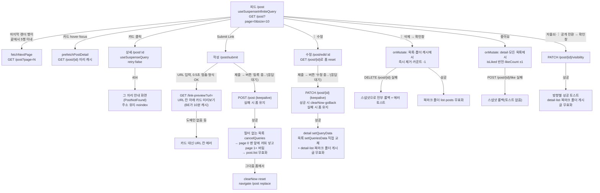

# 게시글 (피드·상세·작성·수정·삭제·공개 전환·좋아요) 기능

> **문서 성격**: 독립 기능 문서(서사형)
>
> **대상 독자**: 이 레포 FE를 처음 보거나 오랜만에 돌아온 개발자.
>
> **읽고 나면**: 게시글 하나가 등록돼 피드에 보이고, 고쳐지고, 지워지기까지 각 단계가 어느
> 파일에서 어떤 API를 부르고 어느 캐시를 어떻게 바꾸는지 안다. "등록 직후 새 글이 안 보인다",
> "좋아요가 목록에 반영 안 된다" 같은 증상을 받았을 때 어디부터 열어볼지 정할 수 있다.
>
> **마지막 검토**: 2026-10-05

이 앱의 중심 데이터다. 사용자가 링크(URL)를 등록하면 BE가 그 페이지를 크롤링해 제목·설명·
썸네일을 채우고, 그 뒤 비동기로 AI 요약·태그를 붙인다. FE는 그 결과를 피드(`/post`)에 카드로
보여주고, 상세(`/post/:id`)에서 댓글과 함께 보여준다.

이 문서가 다루지 않는 것(각 문서가 정본):

- 검색어·카테고리·범위 칩 필터 → [`SEARCH.md`](./SEARCH.md)
- 작성·수정 폼을 저장하지 않고 떠날 때의 확인창 → [`UNSAVED-CHANGES-GUARD.md`](./UNSAVED-CHANGES-GUARD.md)
- 상세의 "목록으로/뒤로" 버튼 동작·라벨 → [`POST-DETAIL-BACK-NAVIGATION.md`](./POST-DETAIL-BACK-NAVIGATION.md)
- 작성 폼의 북마크 폴더 선택 필드 → [`BOOKMARK.md`](./BOOKMARK.md) §5 "링크 등록 폼의 폴더 선택"
- 댓글·답글·댓글 좋아요 → [`COMMENT.md`](./COMMENT.md)

## 1. 쉬운 설명

게시판에 **포스트잇을 붙이는 일**과 비슷하다. 사용자가 링크를 적어 내밀면, 직원(BE)이 그
링크를 열어보고 제목·설명을 채워 넣는 몇 초 동안 사용자는 창구 앞에서 "등록 중..." 버튼을 보며
기다린다. 다 붙었다는 답이 오면 그때 피드로 돌아가고, FE는 그 포스트잇을 피드 맨 앞에 직접
끼워 넣는다. 실패하면 적은 내용을 그대로 손에 쥔 채 창구에 남는다(2026-10-03부터 — 그전엔
링크만 맡기고 곧바로 자리를 떴다). AI 요약은 직원이 나중에 따로 적어 넣는 메모라, FE는 그걸 기다리지 않는다 —
다음에 목록을 다시 가져올 때 메모가 붙어 있으면 보여줄 뿐이다.

수정도 같은 모양이다(제출 → "수정 중..."으로 응답 대기 → 성공하면 원래 화면으로 복귀 + 캐시 교체). 반대로 **삭제와
좋아요는 화면을 먼저 바꾸고**(낙관적 업데이트) 서버가 실패하면 되돌린다. 공개/비공개 전환만은
낙관적이지 않아 서버 응답 뒤 재조회로 반영된다.

## 2. 전제 지식

TanStack Query의 쿼리 키·`invalidateQueries`·`setQueryData`, 무한 쿼리(`useInfiniteQuery`)의
`pages`/`pageParams` 구조, React Hook Form + Zod는 안다고 가정한다.

가정하지 않는 것:

- 이 레포의 3계층 API 규칙(`*.api.ts` → `*.keys.ts` → `*.queries.ts`)과 크로스 엔티티 무효화 →
  [`FE-ARCHITECTURE.md`](./FE-ARCHITECTURE.md) §5
- 위젯 훅이 조회를 조합하는 방식 → 같은 문서 §8
- 확인창 + 삭제(`useAlert().openConfirm`) → 같은 문서 §10
- 낙관적 업데이트 순서(`onMutate` → `cancelQueries` → `setQueryData` → 롤백) → 같은 문서 §11
- 비로그인 사용자의 좋아요를 로그인 유도로 바꾸는 `useAuthGuard`, 미인증 이메일의 글쓰기
  차단 → [`AUTH.md`](./AUTH.md) 게이트 C·D(§1에선 "문지기"라 부른다)
- BE가 등록 뒤 AI 요약·태그를 비동기로 채우는 방식 →
  [BE `AI-ASYNC-PROCESSING.md`](https://github.com/BAECHAN/link-sphere_BE_NEW/blob/main/docs/AI-ASYNC-PROCESSING.md)
- 레포 전체 지도 → [`ONBOARDING.md`](./ONBOARDING.md)
- 처음 보는 용어(`fire-and-forget`, `listRoot`, stretched link 등) → §12 용어 사전

## 3. 사용한 도구·기술

**기능 자체를 이루는 것**

- **TanStack Query** — 무한 스크롤 목록(`useSuspenseInfiniteQuery`), 상세(`useSuspenseQuery`),
  hover 프리페치, 낙관적 업데이트(삭제·좋아요), 진행 상태 관찰(`useIsMutating`)
- **TanStack Virtual**(`useWindowGridVirtualizer`, `shared/hooks/`) — 피드 카드 그리드를 행
  단위로 가상화
- **React Hook Form + Zod** — 작성·수정 폼(`createPostSchema`·`updatePostSchema`)
- **Sonner 토스트**(`shared/lib/toast/toast.ts`) — 성공 토스트, 삭제·공개 전환 실패 토스트(등록·수정의
  진행은 버튼 라벨, 실패는 입력칸·`FormAlert` — §5 "작성" 7)
- **`fetch` keepalive** — 작성·수정 요청을 탭을 닫아도 끝까지 보내기
- **NProgress** — 목록 첫 페이지 조회 동안 상단 진행 막대

**구현·검증 과정에서 쓴 도구**: Vitest + MSW(단위), Playwright(`e2e/`, `page.route()` 모킹) — §9.

## 4. 왜 만들었나

링크 공유 서비스에서 "링크를 올리고, 남의 링크를 둘러보고, 반응한다"는 흐름 그 자체다. 이
문서가 따로 필요한 이유는 기능이 단순해 보여도 **캐시가 여러 화면에 흩어져 있어서**다. 같은
게시글이 피드 목록(필터별로 여러 캐시), 상세, 북마크 폴더별 목록에 동시에 들어 있고, 한
곳에서 바꾼 값이 다른 곳에 안 따라오는 버그가 반복됐다(§10). 각 조작이 어느 캐시를 어떻게
건드리는지 한 곳에 모아 두는 것이 목적이다.

## 5. 구조

### mutation별 캐시 전략 한눈에 보기

| 동작      | 화면을 먼저 바꾸나                 | 성공 시 캐시 처리                                           | 실패 시                   |
| --------- | ---------------------------------- | ----------------------------------------------------------- | ------------------------- |
| 작성      | 아니요(폼에서 응답 대기)           | 필터 없는 목록 page 0 맨 앞에 끼워 넣기 → 모든 목록 무효화  | 원인별 안내, 폼 유지      |
| 수정      | 아니요(폼에서 응답 대기)           | 상세 `setQueryData` + 목록 직접 교체(direct patch) → 무효화 | 원인별 안내, 폼 유지      |
| 삭제      | 예(목록·북마크 폴더 캐시에서 제거) | 북마크 폴더 목록·게시글 무효화                              | 스냅샷 롤백 + 에러 토스트 |
| 좋아요    | 예(상세·모든 목록 토글)            | 없음                                                        | 스냅샷 롤백, 토스트 없음  |
| 공개 전환 | 아니요                             | 방향별 토스트 → 상세·목록·북마크 폴더 게시글 무효화         | 전역 에러 토스트          |

각 행의 상세와 근거 줄은 아래 하위 절에 있다.

### API 엔드포인트

`src/entities/post/api/post.api.ts`와 `src/entities/interaction/api/interaction.api.ts` 기준
(`src/shared/config/api.ts`의 `API_ENDPOINTS.post`).

| 메서드   | 경로                    | FE 함수                | 비고                                                                   |
| -------- | ----------------------- | ---------------------- | ---------------------------------------------------------------------- |
| `GET`    | `/post`                 | `fetchPostList`        | `page`·`size` + 값이 있을 때만 `search`·`category`·`filter`·`nickname` |
| `GET`    | `/post/{id}`            | `fetchPostDetail`      | 비공개(남의 글)·삭제 글은 404                                          |
| `POST`   | `/post`                 | `createPost`           | `keepalive: true`, 응답은 `PostResponse` 그대로                        |
| `PATCH`  | `/post/{id}`            | `updatePost`           | `keepalive: true`                                                      |
| `GET`    | `/link-preview?url=`    | `fetchLinkPreview`     | 작성 중 미리보기. 로그인 전용이라 `/post` 밖에 있다. 회원당 시간 60회  |
| `PATCH`  | `/post/{id}/visibility` | `updatePostVisibility` | body `{ isPrivate }`                                                   |
| `DELETE` | `/post/{id}`            | `deletePost`           |                                                                        |
| `POST`   | `/post/{id}/like`       | `toggleLikePost`       | 토글. 응답 `{ isLiked }`는 FE가 쓰지 않는다(§11)                       |

응답 타입은 BE OpenAPI 스펙에서 생성된 `PostResponse`·`PostPageResponse`의 별칭이다
(`src/entities/post/model/post.dto.ts:8-13`). 생성 파이프라인은
[`OPENAPI-CODEGEN.md`](./OPENAPI-CODEGEN.md).

### 라우트

`src/app/routes/index.tsx`에서 피드·상세는 비로그인도 볼 수 있는 그룹(`:126-133`), 작성·수정은
`ProtectedLayout` 그룹(`:139-147`)에 있다. 각 페이지 컴포넌트는 얇다 — `pages/post/index.tsx`는
제목·"Submit Link" 버튼(`useProtectedNavigate`)·`PostListSearch`·`PostList`만 배치하고,
`PostSubmitPage`·`PostEditPage`는 각 feature 폼을 그대로 렌더한다.

### 피드 — 무한 스크롤 + 가상 그리드

- **조회**: `useSuspenseFetchPostListQuery`(`src/entities/post/api/post.queries.ts`)가
  `page` 0부터 `POST_PAGE_SIZE`(10)개씩 가져온다. 다음 페이지 번호는 응답의 `last`가 거짓이면
  `page + 1`.
- **중복 제거**: 같은 쿼리의 `select`가 모든 페이지를 평탄화하면서 이미 본 `id`를 걸러
  `posts`를 만든다. 오프셋 페이지네이션 중 새 글이 끼어들면 다음 페이지에 같은 글이 또 오기
  때문이다.
- **가상화**: `usePostList`(`src/widgets/post/post-list/hooks/usePostList.ts:120-129`)가
  컨테이너 실측 폭으로 열 수(최대 3, 최소 카드 폭 330px)를 정하고, 게시글을 열 수만큼 묶은
  **행** 단위로 가상화한다. `PostList.tsx:101-131`이 보이는 행만 `translateY`로 배치한다.
- **다음 페이지 트리거**: 마지막으로 렌더된 가상 행 번호가 `rows.length - 5` 이상이면
  `fetchNextPage()`(`usePostList.ts:138-151`). IntersectionObserver 센티넬은 가상화 도입 때
  이 방식으로 바뀌었다.
- **로딩·빈 상태**: `PostList.tsx:27-40`의 `AsyncBoundary`가 Suspense 동안
  `DelayedFallback`(500ms 지연) 안의 스켈레톤 6장(`PostCardSkeleton.tsx:64`)을 보여준다.
  0건이면 `EmptyState`(`PostList.tsx:58-64`). 당겨서 새로고침(`usePullToRefresh`)이
  `refetch`를 부른다.
- **봇 글 숨기기**: URL이 아니라 localStorage 설정(`useHideBotsStore`)을 `filter`에
  `excludeBots`로 합쳐 보낸다(`usePostList.ts:25-36`). 칩·검색 파라미터 자체는
  [`SEARCH.md`](./SEARCH.md).

### 카드(`PostCard`)

`src/widgets/post/post-card/ui/PostCard.tsx`는 피드·상세·북마크 화면이 함께 쓴다(`isDetail`로 분기).

- **카드 전체가 상세 링크**(목록만): 제목 `Link`의 `::after`를 카드 전체로 늘리고(`stretchedLinkClassName`),
  아바타·소유자 액션·AI 요약·썸네일·카테고리 배지(`:307`)·푸터 버튼은 `relative z-raised`로 그
  위에 올린다. 썸네일은 상세가 아니라 원문 새 탭이고, 카테고리 배지를 누르면 피드를 그
  카테고리로 거른다([`SEARCH.md`](./SEARCH.md)). 근거는 `docs/DECISIONS.md` 2026-09-30 "게시글
  카드: 제목 확대 대신 카드 전체를 상세 진입 영역으로" 항목.
- **제목**: 목록은 3줄 말줄임(`line-clamp-3`), 상세는 전문(제목 `h3`의 `isDetail` 분기). 근거는 `docs/DECISIONS.md`
  2026-08-04 항목.
- **프리페치**: 제목 링크의 `onMouseEnter`·`onFocus`가 `prefetchPostDetail`을 부른다
  (`usePostCard.ts`의 `handlePrefetchDetail`). 상세와 같은 키·`queryFn`이라 클릭 시 캐시가 바로 쓰인다.
- **소유자 액션**(`isOwner`일 때만): 비공개 글이면 자물쇠 버튼(누르면 공개 전환),
  그리고 ⋮(`HoverKebabMenu`) 안에 수정·공개/비공개 전환·삭제.
- **AI 결과 표시**: `aiSummary`가 있을 때만 접이식 "AI 요약" 블록. 설명이 없고
  `aiStatus === 'NONE'`(1차 크롤링이 본문을 못 얻음)이면 "이 링크의 정보를 가져오지 못했어요"
  한 줄(`TEXTS.post.card.metadataUnavailable`). **AI 처리 대기 중 표시나 폴링은 없다** — §11.
- **수정 중 오버레이**: 같은 글의 수정 mutation이 진행 중이면(`useIsMutating`, 500ms 지연 +
  최소 400ms 유지, `usePostCard.ts:46-49`) 내용을 흐리게 하고 "수정 중..." 오버레이로 클릭을
  막는다(`PostCard.tsx:86`, `:100-105`). 2026-10-03부터 수정 폼이 응답을 기다리므로 평소엔 보일
  일이 없고, 저장 중에 이탈 확인창에서 "나가기"를 골라 목록으로 먼저 돌아간 경우에만 뜬다.

### 상세

- `usePostDetail`(`src/pages/post/hooks/usePostDetail.ts:76-94`)이
  `useSuspenseFetchPostDetailQuery`로 조회한다. 이 쿼리는 `retry: false`다(`post.queries.ts`)
  — 404는 재시도해도 같고 안내 화면만 늦어진다.
- **404 처리**: `PostDetailPage.tsx:81-87`의 에러 폴백이 `ApiError.status === 404`면 주소를 그대로 둔 채
  그 자리에 안내 화면(`PostDetailPage.tsx:60-75`의 `PostNotFound`)을 그린다 — 아이콘·"삭제됐거나 볼 수 없는
  포스트예요"·"목록으로". BE가 삭제와 비공개를 같은 404로 응답하므로 문구도 둘을 함께 덮는다. "목록으로"는
  이동이라 버튼 모양의 링크(`Button asChild` + `Link`)로 `/post`에 간다. 화면이 떠 있는 동안 `useNoIndex`로
  `noindex` 메타를 단다(200으로 응답하는 에러 화면이 검색엔진에 색인되는 soft 404 방지). 2026-10-05 이전에는
  토스트 후 `/post`로 replace했는데, 사라지는 토스트에만 기대고 주소까지 잃게 해 바꿨다(계획:
  `docs/plans/2026-10-05-url-error-responses.md`). 그 밖의 에러는 화면 안 `ErrorState`.
- **열람 기록 반영**: 상세 조회가 BE `post_views`를 갱신하므로, 북마크의 "최근 열람순" 캐시를
  무효화한다(`usePostDetail.ts:86-91`).
- 상세 화면은 같은 `PostCard`(`isDetail`) 아래 `CommentList`를 붙인다.

### 작성

1. 폼(`src/features/post/create/hooks/useCreatePost.ts`의 `useForm`)은 `mode: 'onChange'`라 URL 형식
   오류가 타이핑 즉시 인풋 아래에 뜬다. 제출 버튼은 `isDirty && isValid && !isCreating`일 때만
   활성(`CreatePostForm.tsx`의 `canSubmit`)이고, 비활성 이유는 `TooltipWrapper`로 보여준다.
2. 스키마(`src/entities/post/model/post.schema.ts:9-27`): `url`은 `.url()` + http/https 스킴만
   허용하는 `refine`(BE `SafeUrlValidator`와 같은 제한). `title`은 선택(비우면 BE가 크롤링
   제목을 쓴다), `categoryIds`·`isPrivate`·`bookmark`·`folderIds`. **제목 길이 상한은 없다** — 카드는
   3줄 말줄임, 상세는 전문을 보여준다([`DECISIONS.md`](./DECISIONS.md) 2026-08-04).
3. 제출(`useCreatePost.ts`의 `onSubmit`):
   - 계정의 `emailVerified === false`면 서버로 보내지 않고 버튼 위 `FormAlert`에 인증 안내를 남긴다(7번과
     같은 자리, BE도 403
     `EMAIL_NOT_VERIFIED`로 막는 이중 방어 — [`AUTH.md`](./AUTH.md) 게이트 D).
   - `createPost(...)`(`mutateAsync`)의 **응답을 기다린다**. 그동안 버튼은 비활성 + "등록 중..."
     (`CreatePostForm.tsx`, FE-ARCHITECTURE §10-A "저장 중 라벨"). 성공하면 `clearNow()`로 이탈
     가드 해제 → 폼 리셋 → `/post`로 **replace** 이동. 실패하면 아무것도 하지 않아 입력·이탈
     가드가 그대로 남고, 실패 원인은 7번 방식으로 안내한다. BE가 크롤링을 동기로 하지만
     실측 중앙값 2.7초라 기다리게 한다(근거·이전 방식과의 비교는 [`DECISIONS.md`](./DECISIONS.md)
     2026-10-03). 탭을 닫아도 요청이 끝까지 가도록 `keepalive`(`post.api.ts`의 `createPost`).
4. 성공 시(`post.queries.ts`의 `useCreatePostMutation` `onSuccess`, entity 레벨이라 폼이 언마운트돼도 실행된다):
   - 필터 없는 목록 쿼리를 `cancelQueries` — 폼은 이 처리가 끝난 뒤에 이동하므로 평소엔 경쟁이 없지만,
     저장 중 "나가기"로 먼저 피드에 갔거나 배경 재조회가 돌던 중이면 등록 완료 전 상태의 목록 fetch가
     뒤늦게 응답해 끼워 넣은 값을 덮어쓸 수 있어 막는다.
   - `prependCreatedPostToFirstPage`로 page 0 맨 앞에 새 글을 넣고 **page 1 이후는
     버린다** — 서버 오프셋이 한 칸씩 밀려 옛 page 1과 겹치기 때문이다. 다음 페이지는 스크롤 시
     다시 받는다.
   - 필터가 걸린 목록에는 끼워 넣지 않는다(새 글이 그 조건에 맞는지 모른다).
   - 그다음 `handlePostCreateSuccess`(`post.keys.ts`)가 필터와 무관하게 **모든 목록**
     (`listRoot`)을 무효화한다 — 필터 없는 목록은 끼워 넣은 덕에 재조회 전에도 이미 새 글을
     보여주고, 필터 목록은 이 재조회로 갱신된다. 북마크를 같이 골랐으면 `handleBookmarkToggleSuccess`로 폴더
     카운트·폴더 게시글도 무효화.
   - 성공 토스트는 `meta.successMessage`로 전역 핸들러가 띄운다. 실패는 `manualErrorHandling`이라
     전역 토스트가 뜨지 않고 7번 방식으로 안내한다. 고른 폴더가 사라진 실패(`FOLDER_NOT_FOUND`)면
     폴더 목록을 무효화해 다시 고를 때 사라진 폴더가 안 보이게 한다.
5. **진행 표시**: 제출 버튼의 "등록 중..." 라벨이 맡는다. `src/app/ui/PostMutationLoadingToast.tsx`
   (하단 진행 토스트)는 2026-10-03부터 작성·수정을 관찰하지 않고 계정 수정만 남았다 — 폼이 화면에
   남아 있어 버튼 라벨과 겹치기 때문이다. 토스트 방식이 처음 생긴 근거는 `docs/DECISIONS.md`
   2026-08-13 항목.
6. 모바일에서는 제출 버튼이 하단 탭바 바로 위에 고정된 바로 뜨고, 토스트가 그 위로 오도록
   `--toast-offset-bottom`을 조정한다(`CreatePostForm.tsx`의 `reserveToastSpaceAboveBar`, 하단 바 `barRef`).
7. **실패 원인 안내**(2026-10-03): `PostUtil.resolveSubmitError`(`entities/post/utils/post.util.ts`)가
   실패를 둘로 나눈다. 서버 message(영어·내부 문구)는 노출하지 않고 code·status로만 판정한다.
   - 입력칸을 고치면 해결되는 것 → 그 칸 아래 에러(`form.setError(..., { type: 'server' })` + 포커스):
     도메인 없음(`URL_UNRESOLVABLE`), 내부망(`URL_NOT_ALLOWED`), 형식(`INVALID_URL`), 폴더 사라짐
     (`FOLDER_NOT_FOUND`, 폴더를 고른 등록의 `FORBIDDEN`).
   - 그 외 → 버튼 바로 위 `FormAlert`(`shared/ui/elements/FormAlert.tsx`, `role="alert"`): 요청 한도
     (429, `Retry-After`를 분으로 올림), 네트워크, 응답 지연(504 — 이미 저장됐을 수 있어 "피드에서
     확인하기" 링크), 이메일 미인증, WAF 차단, 그 외. 모바일에선 하단 고정 바 안 버튼 위에 붙는다.
   - 사용자가 아무 값이나 고치면 안내와 서버 칸 에러가 지워진다(`clearSubmitErrorsOnEdit`).
   - 대가: 저장 중 이탈 확인창에서 "나가기"를 골라 폼이 먼저 사라지면 실패가 안 보인다(드묾).
   - 표시 위치·박스 모양 결정 근거는 [`DECISIONS.md`](./DECISIONS.md) 2026-10-03 "실패 원인 노출" 항목.
8. **작성 중 링크 미리보기**(2026-10-03): URL 칸 바로 아래 `LinkPreviewCard`(`entities/post/ui/LinkPreviewCard.tsx`)가
   "이렇게 등록돼요"를 등록 전에 보여준다.
   - 조회는 `useLinkPreview`(`entities/post/hooks/useLinkPreview.ts`)가 한다. 입력이 0.5초 멈추고 스키마
     형식이 맞고 이메일 인증된 계정일 때만 묻는다. 등록과 같은 `UrlUtil.normalizeUrl`을 거친 URL로 물어야
     BE 캐시(10분)가 등록 때 재사용돼, 저장되는 글이 본 미리보기와 같아진다.
   - 카드 모습: 가져오는 중이면 스켈레톤, 받으면 썸네일·제목·설명(최대 2줄)·URL. 사용자가 제목을
     입력했으면 그 제목으로 보여준다(등록되는 제목과 맞춤).
   - 자리 고정(2026-10-04): 데스크톱은 등록 버튼이 폼 흐름 안에 있어 미리보기 높이가 바뀌면 버튼이
     밀린다. 그래서 모든 모습(안내 자리·가져오는 중·카드·실패)을 같은 높이(`h-24`, 96px —
     `LinkPreviewCard.tsx`의 `PREVIEW_HEIGHT_CLASSNAME`)로 맞추고, 등록 폼은 `reserveSpace`로 URL을
     넣기 전에도 같은 크기의 안내 자리를 깔아 둔다. [web.dev "Optimize CLS"](https://web.dev/articles/optimize-cls)는
     _"(플레이스홀더나 스켈레톤 UI 등으로) 뷰포트에 미리 충분한 자리를 확보해, 콘텐츠가 들어와도 페이지가
     갑자기 밀리지 않게 하라"_ (번역)고 권한다. 안내 자리 모양은 시안(점선 테두리 / 옅은 박스) 비교 후 옅은
     박스로 골랐다. 수정 폼은 URL을 바꿨을 때만 카드가 떠서 안내 자리를 두지 않는다 — 카드가 처음 뜰 때
     한 번은 밀린다. 1280×800에서 직접 측정(모킹 응답 Playwright 스펙): 등록 폼은 입력 전·가져오는 중·
     성공(설명 2줄)·실패 모두 버튼 y=725로 같았다. URL을 지우면 URL 칸 필드 에러 한 줄(28px)만큼은 여전히
     밀린다(공용 `FormField` 동작, 범위 밖).
   - 도메인 없음·내부망·형식 오류는 등록해도 똑같이 실패하므로 카드 대신 URL 칸 에러로 띄운다
     (`showPreviewUrlErrorOnField`, 7번과 같은 `PostUtil.resolveSubmitError` 문구). 그 외 실패(한도·서버
     오류)는 "미리보기를 불러오지 못했어요. 그래도 등록할 수 있어요"만 보여주고 등록은 막지 않는다.
   - 토스트는 띄우지 않는다(`useFetchLinkPreviewQuery`의 `manualErrorHandling`, `retry: false`).
   - 위치(URL 칸 바로 아래)·모양(가로형) 결정은 [`DECISIONS.md`](./DECISIONS.md) 2026-10-03 "응답 대기" 항목의 상태.

### 수정

- `useUpdatePost`(`src/features/post/update/hooks/useUpdatePost.ts`)는 비-Suspense
  `useFetchPostDetailQuery`로 원본을 받아 `form.reset`한다(`resetFormWithFetchedPost`). 로딩 중에는
  `UpdatePostForm`이 `SpinnerOverlay`를 그린다.
- **URL을 바꾸면 제목·카테고리를 비운다**(`clearDerivedFieldsOnUrlChange`) — 둘 다 옛 링크 기준이기 때문이다. 초기
  `reset` 직후의 오탐을 막으려 `form.getValues('url')`을 다시 읽어 비교한다.
- 안내 문구: URL을 바꾸면 "다시 가져와요" 안내, URL은 그대로인데 제목만 비우면 "제목을 다시
  가져오고, 못 가져오면 기존 제목 유지" 안내(`UpdatePostForm.tsx`의 `isUrlChanged`·`isTitleCleared`). 제목만
  비운 재수집이 다른 필드를 덮지 않는 BE 정책은 `docs/DECISIONS.md` 2026-09-08 "제목 비움
  재수집" 항목.
- 제출(`onSubmit`)은 작성과 같이 **응답을 기다린다**(버튼 "수정 중..."). 성공하면 `clearNow()` →
  `goBack()`(들어온 화면으로, 목록 스크롤 유지), 실패하면 고친 내용과 이탈 가드를 그대로 남긴다.
  `keepalive`도 같다(`post.api.ts`의 `updatePost`).
- 성공 시(`post.queries.ts`의 `useUpdatePostMutation` `onSuccess`): 서버가 돌려준 수정본으로 detail을 `setQueryData`, 모든
  목록 캐시에서 그 글을 `setQueriesData`로 **직접 교체**한 뒤, `handlePostUpdateSuccess`(detail +
  list 무효화)와 `handlePostContentUpdateSuccess`(북마크 폴더별 게시글 무효화)를 부른다. 직접
  교체가 먼저라 재조회 응답을 기다리지 않고 바로 새 제목이 보인다.
- **URL을 바꿨을 때만** 작성과 같은 미리보기 카드가 뜬다(`useUpdatePost.ts`의 `isUrlChanged`). URL이
  원래 값과 같으면 조회하지 않는다 — 다시 크롤링할 일이 없기 때문이다.

### 삭제

- 진입: 카드 ⋮ → "삭제" → `usePostDelete`(`src/features/post/delete/hooks/usePostDelete.ts:10-24`)가
  `openConfirm`(삭제 버튼 쪽 강조, `emphasis: 'confirm'`)을 띄우고 확인 시 `mutateAsync`를 기다린다.
- 낙관적 반영(`post.queries.ts`의 `useDeletePostMutation` `onMutate`): 피드 목록·북마크 폴더 목록·폴더별 게시글 쿼리를
  `cancelQueries`하고 스냅샷을 뜬 뒤,
  - 모든 피드 목록 캐시에서 그 글을 빼고 `totalElements`를 1 줄인다(`Math.max(0, …)`로 0 아래는 막는다).
  - 폴더별 게시글 캐시에서도 카드를 뺀다.
  - 그 글이 북마크돼 있었다면 소속 폴더의 `bookmarkCount`(소속이 없으면 `uncategorizedCount`)를
    1 줄인다. 북마크 여부는 detail → 피드 목록 → 폴더 게시글 캐시 순으로 찾는다(`findCachedPost`).
- 실패 시 세 스냅샷을 전부 복원하고 전역 핸들러가 "포스트 삭제에 실패했어요." 토스트.
- 성공 시 북마크 폴더 목록·게시글을 무효화하고, **그 글의 detail 캐시를 지운다**(`postRemoveQueries.detail`,
  `src/entities/post/api/post.keys.ts`). 상세에서 삭제하면 push로 피드에 가므로 히스토리에 지운 글의 상세가
  남는데, 캐시가 남아 있으면 뒤로가기 때 staleTime(3분) 안에서 삭제된 글이 재조회 없이 다시 그려졌다.
  지금은 다시 받아와 그 주소에서 "삭제됐거나 볼 수 없는 포스트예요" 안내를 띄운다(`e2e/post-delete.spec.ts`).
  **성공 토스트는 없다**(카드가 사라지는 것 자체가 피드백).
- 성공 시 `handlePostDeleteSuccess`로 북마크 폴더 목록·폴더 게시글만 재검증한다(피드 목록은 이미
  낙관적으로 반영됨).
- 상세에서 삭제하면 `navigate('/post')`로 이동한다 — **push**다(`usePostCard.ts:57`). §11.

### 공개/비공개 전환

- 진입 두 곳: 비공개 글의 자물쇠 버튼, ⋮ 메뉴의 "공개/비공개" 항목(둘 다 소유자만). 폼에서는
  작성·수정의 `isPrivate` 체크박스로도 바꿀 수 있다.
- `usePostCard.ts:63-99`가 확인창(방향별 버튼 문구)을 띄우고 확인 시
  `useUpdatePostVisibilityMutation`을 부른다.
- **낙관적이지 않다** — 성공 후 `handlePostUpdateSuccess`·`handlePostContentUpdateSuccess`로
  재조회해서 반영된다.
- 성공 토스트는 방향별("이 게시물을 나만 보기로 전환했어요."/"이 게시물을 전체 공개로 전환했어요.",
  `TEXTS.messages.success.postSetToPrivate`·`postSetToPublic`)이라
  `meta.successMessage`(정적 문자열)로 못 띄워, entity mutation의 `onSuccess`에서 직접
  `toast.success`한다(`post.queries.ts`의 `useUpdatePostVisibilityMutation` `onSuccess`). 위젯 쪽 `mutate(vars, { onSuccess })`에 두면
  가상 스크롤로 카드가 언마운트됐을 때 스킵되기 때문이다.

### 좋아요

- `LikePostButton`(`src/features/post/like/ui/LikePostButton.tsx:15-39`)은 feature 래퍼
  `useLikePost`(`src/features/post/like/hooks/useLikePost.ts`, mutation을 그대로 반환)를 거쳐
  mutation을 쓴다. `useAuthGuard`로 비로그인이면 로그인 모달을 띄운다.
  버튼은 `ToggleButton`이라 400ms 안의 재클릭을 무시한다([`FE-ARCHITECTURE.md`](./FE-ARCHITECTURE.md) §10-A).
  요청 중 `disabled`는 두지 않는다 — 낙관적 업데이트로 아이콘이 이미 바뀌어 있어, 요청 동안 버튼을
  흐리게(`disabled:opacity-50`) 하면 깜빡임만 생긴다(2026-10-02 제거, 댓글 좋아요도 같음).
- `useLikePostMutation`(`src/entities/interaction/api/interaction.queries.ts:28-78`):
  `onMutate`에서 detail과 **모든** 피드 목록 캐시의 그 글을 `toggleLikeOnPost`(`:12-26`, `isLiked`
  반전 + `likeCount` ±1)로 바꾸고, 실패하면 두 스냅샷을 복원한다.
- `meta.manualErrorHandling: true`이고 직접 띄우는 토스트도 없어 **실패해도 토스트 없이 롤백만
  된다**(`CHANGELOG.md` v0.1.1 "옵티미스틱 토글 실패 시 토스트 없이 롤백"). 성공 시 무효화도
  하지 않는다(`onSuccess: () => {}`).
- 북마크 토글(`useBookmarkPostMutation`)은 같은 파일에 있지만 [`BOOKMARK.md`](./BOOKMARK.md)가
  정본이다.

## 6. 상태 모델

### 쿼리 키(`src/entities/post/api/post.keys.ts`)

| 키                                      | 값                                  | 쓰는 곳                                    |
| --------------------------------------- | ----------------------------------- | ------------------------------------------ |
| `postKeys.root`                         | `['post']`                          | 전체 무효화(`postInvalidateQueries.all`)   |
| `postKeys.listRoot`                     | `['post', 'list']`                  | 모든 피드 목록에 한꺼번에 패치·취소·무효화 |
| `postKeys.list(filters)`                | `['post', 'list', { search, ... }]` | 필터 조합마다 별도 무한 쿼리 캐시          |
| `postKeys.detail(id)`                   | `['post', 'detail', id]`            | 상세·수정 폼·프리페치                      |
| `postKeys.linkPreview(url)`             | `['post', 'linkPreview', url]`      | 작성 중 미리보기(정규화된 URL마다)         |
| `postMutationKeys.create`               | `['post', 'create']`                | 작성 mutation 식별(관찰하는 곳 없음)       |
| `postMutationKeys.update(id)`           | `['post', 'update', id]`            | 카드 "수정 중" 오버레이                    |
| `postMutationKeys.delete`               | `['post', 'delete']`                |                                            |
| `postMutationKeys.updateVisibility(id)` | `['post', 'updateVisibility', id]`  |                                            |

무한 목록 캐시의 원본 shape은 `InfiniteData<PostPageResponse>`(`pages[].content`·`totalElements`·
`last`·`page`)이고, 컴포넌트는 `select`가 덧붙인 `posts`(중복 제거·평탄화)와 `totalElements`(page
0 값)를 쓴다(`useSuspenseFetchPostListQuery`의 `select`). 좋아요 롤백은 이 원본 shape을 통째로 복원한다.

### 다른 엔티티가 post 캐시를 무효화하는 지점

post는 `@x` 표기로 무효화 래퍼를 공개하고(`src/entities/post/@x/`), 다른 엔티티는 그 래퍼만 쓴다.

| 사건                                   | 무효화                      | 위치                                                             |
| -------------------------------------- | --------------------------- | ---------------------------------------------------------------- |
| 댓글 작성·삭제(`commentCount` 변동)    | detail + list               | `src/entities/comment/api/comment.keys.ts:26-49`                 |
| 프로필 수정(작성자 닉네임·이미지)      | `post` 전체                 | `src/entities/account/api/account.keys.ts:29`                    |
| 세션 복원 성공(비로그인으로 받은 목록) | list                        | `src/entities/auth/api/auth.keys.ts:10-12`                       |
| 북마크 폴더 삭제·소속 변경             | list(+ 소속 변경 시 detail) | `src/entities/bookmark/folder/api/bookmark-folder.keys.ts:53-95` |

반대 방향으로 post mutation이 부르는 북마크 쪽 핸들러(`handlePostDeleteSuccess`,
`handlePostContentUpdateSuccess`, `handleBookmarkToggleSuccess`)는
`src/entities/bookmark/folder/api/bookmark-folder.keys.ts:64-84`에 있다.

### 폼 값

`CreatePost`·`UpdatePost`는 `post.schema.ts`의 `z.infer` 타입이다. 작성 폼 기본값은
`useCreatePost.ts`의 `DEFAULT_VALUES`(`url`·`title` 빈 문자열, `categoryIds`·`folderIds` 빈 배열,
`isPrivate`·`bookmark` false).

## 7. 운영 파라미터

| 파라미터                                | 값                   | 실제 위치                                                         |
| --------------------------------------- | -------------------- | ----------------------------------------------------------------- |
| 목록 페이지 크기                        | 10                   | `src/entities/post/config/post.const.ts:1`                        |
| 다음 페이지 선행 로드 행 수             | 5행                  | `src/widgets/post/post-list/hooks/usePostList.ts:16`              |
| 행 높이 추정 기본값(열 수 매핑 없을 때) | 600px                | `src/widgets/post/post-list/hooks/usePostList.ts:17`              |
| 카드 최소 폭 / 최대 열 수               | 330px / 3            | `src/widgets/post/post-card/config/post-card-grid.const.ts:26-27` |
| 행 간격(md 이상 / 미만)                 | 16px / 12px          | `src/widgets/post/post-card/config/post-card-grid.const.ts:28-31` |
| 열 수별 행 높이 추정치(3·2·1열)         | 654 / 635 / 582px    | `src/widgets/post/post-card/config/post-card-grid.const.ts:32-36` |
| 스켈레톤 카드 수                        | 6                    | `src/widgets/post/post-list/ui/PostCardSkeleton.tsx:64`           |
| 조회 로딩 표시 지연                     | 500ms                | `src/shared/config/const.ts:11`                                   |
| mutation 진행 표시 지연 / 최소 노출     | 500ms / 400ms        | `src/shared/config/const.ts:18-21`                                |
| 쿼리 기본 staleTime / gcTime / retry    | 3분 / 5분 / 1회      | `src/shared/lib/react-query/config/queryClient.ts:70-73`          |
| 상세 조회 재시도                        | 없음(`retry: false`) | `src/entities/post/api/post.queries.ts:199`                       |
| 미리보기 조회 디바운스                  | 500ms                | `src/entities/post/hooks/useLinkPreview.ts:9`                     |
| 미리보기 staleTime / 재시도             | 10분 / 없음          | `src/entities/post/api/post.queries.ts:177-190`                   |
| 카테고리 옵션 staleTime                 | 24시간               | `src/entities/category/api/category.queries.ts:14`                |

행 높이 추정치와 최소 카드 폭은 직접 측정한 값이다 — 측정 방법은 `post-card-grid.const.ts`의 주석과
그 주석이 가리키는 `docs/plans/` 파일에 있다.

## 8. 코드 지도와 자주 하는 수정

| 단계                         | 파일                                                                                                                                                       |
| ---------------------------- | ---------------------------------------------------------------------------------------------------------------------------------------------------------- |
| 피드 페이지 배치             | `src/pages/post/index.tsx`                                                                                                                                 |
| 목록 조회·가상화·다음 페이지 | `src/widgets/post/post-list/hooks/usePostList.ts:103-166`, `src/widgets/post/post-list/ui/PostList.tsx`                                                    |
| 카드 UI / 카드 동작          | `src/widgets/post/post-card/ui/PostCard.tsx`, `src/widgets/post/post-card/hooks/usePostCard.ts`                                                            |
| 상세 / 404                   | `src/pages/post/PostDetailPage.tsx:60-95`                                                                                                                  |
| 작성 폼 / 제출               | `src/features/post/create/ui/CreatePostForm.tsx`, `src/features/post/create/hooks/useCreatePost.ts`의 `onSubmit`                                           |
| 수정 폼 / 제출               | `src/features/post/update/ui/UpdatePostForm.tsx`, `src/features/post/update/hooks/useUpdatePost.ts`의 `onSubmit`                                           |
| 삭제 확인창                  | `src/features/post/delete/hooks/usePostDelete.ts:10-24`                                                                                                    |
| 좋아요 버튼 / mutation       | `src/features/post/like/ui/LikePostButton.tsx`, `src/features/post/like/hooks/useLikePost.ts`, `src/entities/interaction/api/interaction.queries.ts:28-78` |
| 등록 성공 캐시 처리          | `src/entities/post/api/post.queries.ts`의 `useCreatePostMutation`                                                                                          |
| 삭제 낙관적 처리             | `src/entities/post/api/post.queries.ts`의 `useDeletePostMutation`                                                                                          |
| 수정 성공 캐시 처리          | `src/entities/post/api/post.queries.ts`의 `useUpdatePostMutation`                                                                                          |
| 공개 전환                    | `src/entities/post/api/post.queries.ts`의 `useUpdatePostVisibilityMutation`, `src/widgets/post/post-card/hooks/usePostCard.ts:63-99`                       |
| 제출 대기(응답 대기·라벨)    | `useCreatePost.ts` `onSubmit`, `useUpdatePost.ts` `onSubmit`                                                                                               |
| 작성 중 미리보기             | `src/entities/post/hooks/useLinkPreview.ts`, `src/entities/post/ui/LinkPreviewCard.tsx`, 폼 연결은 두 훅의 `showPreviewUrlErrorOnField`                    |
| 입력 검증                    | `src/entities/post/model/post.schema.ts:9-35`                                                                                                              |

### 자주 하는 수정

| 하고 싶은 것                      | 방법                                                                                                                                                                           |
| --------------------------------- | ------------------------------------------------------------------------------------------------------------------------------------------------------------------------------ |
| 한 번에 가져오는 게시글 수 변경   | `post.const.ts`의 `POST_PAGE_SIZE`. 북마크 폴더 목록도 `@x/bookmark.ts`로 같은 값을 쓰므로 함께 바뀐다                                                                         |
| 무한 스크롤을 더 일찍/늦게 시작   | `usePostList.ts:16`의 `PREFETCH_ROW_LOOKAHEAD`                                                                                                                                 |
| 카드 최소 폭·최대 열 수 변경      | `post-card-grid.const.ts`의 `POST_CARD_GRID`(피드·북마크 목록과 스켈레톤이 페이지를 거쳐 같은 값을 받는다). 푸터 줄바꿈 회귀는 `e2e/post-card-footer-layout.spec.ts`가 잡는다  |
| 폼 필드 추가                      | `post.schema.ts`의 `createPostSchema`/`updatePostSchema` + `useCreatePost`의 `DEFAULT_VALUES`·`useUpdatePost`의 `form.reset` + 폼 UI + BE 요청 DTO                             |
| 새 mutation 뒤에 post 캐시 갱신   | 자기 엔티티 `.keys.ts`에 `handle<Event>Success`를 만들고 그 안에서 `postInvalidateQueries.*`를 `@x/<엔티티>.ts` 경유로 호출(§6 표 참고)                                        |
| 카드에 소유자 전용 메뉴 항목 추가 | `PostCard.tsx`의 `HoverKebabMenu` 안 + 동작은 `usePostCard.ts`                                                                                                                 |
| 등록·수정 성공/실패 문구 변경     | `TEXTS.messages.success.postCreated`·`postUpdated`, 실패 원인별 문구는 `TEXTS.messages.error.postSubmit.*`(`src/shared/config/texts.ts`), 분류는 `PostUtil.resolveSubmitError` |
| 테스트 실행                       | `npx vitest run src/entities/post src/entities/interaction src/features/post src/widgets/post`                                                                                 |

## 9. 검증 결과

**단위 테스트** — 2026-10-02 위 명령으로 9개 파일 79개 테스트 통과(직접 실행).

- `src/entities/post/api/post.queries.test.ts`(12) — 수정 시 detail 교체·폴더 게시글 무효화,
  공개 전환 방향별 토스트·실패 시 미호출·**언마운트 후에도** 토스트, 등록 시 필터 없는 목록
  맨 앞 삽입·필터 목록 미변경, 삭제 시 폴더 카운트·미분류 카운트 감소·폴더 캐시 전용 글 처리·
  실패 롤백
- `src/entities/post/model/post.schema.test.ts`(18) — 필수·선택 필드, `file://` 등 스킴 거부
- `src/features/post/update/hooks/useUpdatePost.test.tsx`(2) — 초기 로드 시 제목·카테고리 유지,
  URL 변경 시 비움
- `src/widgets/post/post-list/hooks/usePostList.test.tsx`(5),
  `src/widgets/post/post-list/ui/PostListSearch.test.tsx`(3),
  `src/widgets/post/post-list/utils/search-parser.test.ts`(16) — 검색 동작은
  [`SEARCH.md`](./SEARCH.md)가 정본
- `src/widgets/post/post-card/config/post-card-grid.const.test.ts`(1)
- `src/features/post/create/ui/PostCreateBookmarkFolderField.test.tsx`(15) — [`BOOKMARK.md`](./BOOKMARK.md) §9
- `src/entities/interaction/api/interaction.queries.test.ts`(7) — **전부 북마크 토글 테스트다.
  좋아요 mutation 단위 테스트는 없고** e2e `like.spec.ts`만 덮는다.

**e2e**(`e2e/`, Playwright) — 이 기능을 덮는 스펙. 이번 검토에서 실행하지는 않았다.

- `post-create.spec.ts` — 제출 시 "등록 중..." 라벨로 응답 대기 → `/post` 이동·이탈 가드 미발동,
  실패 시 이동하지 않고 입력 유지
- `post-create.mobile.spec.ts` — 모바일 하단 등록 바, Enter 제출
- `post-update.spec.ts` — ⋮ → 수정 → 폼에서 "수정 중..." 대기 → 복귀 → 새 제목 반영, 직접
  교체가 재조회보다 먼저 보이는지
- `post-delete.spec.ts` — 상세에서 삭제 후 `/post` 복귀, 재조회 없이 목록에서 사라짐
- `post-visibility.spec.ts` — ⋮로 비공개 전환(재조회 반영·목록 전파), 자물쇠로 공개 복귀
- `like.spec.ts` — 상세 좋아요가 재조회 없이 목록에 반영, 실패 시 상세·목록 모두 원복
- `post-detail-not-found.spec.ts` — 삭제된 글 직접 진입 시 주소 유지 + 안내 화면 + "목록으로" 링크,
  카드 클릭 사이 삭제 시 안내 후 뒤로가기로 목록 복귀
- `post-card-click-area.spec.ts` — 카드 전체 클릭 영역과 내부 버튼 분리, 카테고리 배지
- `post-card-footer-layout.spec.ts`, `post-card-hover-menu.spec.ts`,
  `post-list-virtualization.spec.ts`, `post-list-scroll-restore.spec.ts`, `post-list.spec.ts`,
  `guest-guard.spec.ts`, `unsaved-changes.spec.ts`

## 10. 시행착오

**등록 직후 새 글이 피드에 안 보이던 문제(2026-08-13, `b9acb52`)**: 작성 화면은 응답을 기다리지
않고 피드로 이동하는데, 그 순간 피드가 목록 fetch를 시작해 버린다. 등록 성공 후
`invalidateQueries`만 했더니, 이미 떠 있던(등록 완료 전 상태의) fetch가 뒤늦게 응답해 갱신을
덮어썼다. 지금은 필터 없는 목록을 먼저 `cancelQueries`하고 캐시에 직접 끼워 넣는다(§5 작성 4).

**글을 지운 뒤 북마크 폴더 카운트가 옛 값으로 남던 문제(2026-08-13, `48fcfc4`)**: 삭제
mutation만 폴더 카운트를 낙관적으로 줄이지 않고 있었다(다른 북마크 변경 mutation은 이미 하던
일). 같은 패턴으로 폴더 카운트 감소·폴더 게시글 카드 제거·실패 롤백을 추가했다. 원인의 나머지
절반("최근 저장한 폴더" 스냅샷)은 [`BOOKMARK.md`](./BOOKMARK.md) §10.

**좋아요 실패 시 목록이 원복되지 않던 문제(2026-09-10, `9077f68` #68)**: `onMutate`는 detail과
목록을 둘 다 패치하는데 `onError`는 detail만 되돌렸다. 목록 스냅샷을 떠서 복원하도록 고쳤고,
같은 구멍이 북마크 토글에도 있어 이어서 고쳤다(`9d3c28d` #69). 회귀는 `e2e/like.spec.ts`의
실패 케이스가 잡는다.

**공개 전환 성공 토스트를 entity로 옮긴 이유(2026-09-21, `20da54e` #149)**: 성공해도 피드백이
없었고(공개로 바꾸면 자물쇠 아이콘이 사라질 뿐), 낙관적 업데이트도 없어 드롭다운이 닫힌 뒤
한참 뒤에야 반영됐다. 토스트를 위젯의 `mutate(vars, { onSuccess })`에 두면 가상 스크롤로 카드가
언마운트될 때 스킵돼, entity mutation의 `onSuccess`로 옮기고 "언마운트 후에도 뜬다"는 테스트를
붙였다.

**`file://` URL이 사유 없이 실패하던 문제(2026-09-26, `e96328f` #202)**: Zod `.url()`은 스킴을
보지 않아 `file://`도 통과했고, BE는 400으로 거절하지만 사용자에겐 일반 실패 토스트만 보였다.
http/https만 허용하는 `refine`을 추가해 제출 전에 인풋 아래에서 걸러낸다.

**수정 요청에만 keepalive가 빠져 있던 문제(2026-09-27, `3640eed` #215)**: 작성과 똑같이
fire-and-forget + 즉시 이동인데 수정만 `keepalive`가 없어, 저장 직후 탭을 닫으면 PATCH가 끊길
수 있었다.

**카드 여백을 눌러도 아무 일이 없던 문제(2026-09-30, `dd2b563` #256)**: hover 시 카드 전체가
떠올라 눌릴 것처럼 보였지만 제목과 댓글 버튼만 상세로 갔다. 카드를 통째로 `<a>`로 감싸는 대신
stretched link로 풀었다(근거·대안 비교는 `docs/DECISIONS.md` 2026-09-30 "게시글 카드: 제목 확대 대신 카드 전체를
상세 진입 영역으로").

**AI 대기 UI를 걷어낸 경위(2026-03-06, `cee7acc`)**: 한때 AI 처리 상태를 SSE로 받는 훅
(`usePostAIEvents`)이 있었으나 삭제됐다. 지금 FE는 AI 진행 상태를 실시간으로 받지 않는다(§11).
당시 결정 배경 문서는 찾지 못했다.

## 11. 남은 것

아래는 코드에서 확인한 현재 동작이고, 고치지 않은 채 기록만 한다.

- **AI 요약 대기 표시·폴링이 없다.** 등록 직후 카드에는 AI 요약이 없고, 다음 재조회(창 포커스,
  staleTime 3분 경과, 다른 무효화) 때 BE가 채워 둔 값이 있으면 그제야 보인다.
- **좋아요 실패가 무음이다.** 롤백만 되고 토스트가 없어 사용자는 실패를 "눌렀는데 안 눌렸다"로
  본다. 또 성공 응답의 `isLiked`를 쓰지 않고 무효화도 하지 않아, 다른 탭·기기에서 바뀐 값과
  어긋나면 다음 재조회 전까지 FE 추측값이 남는다.
- **상세에서 삭제 후 이동이 push다**(`usePostCard.ts:57`). 히스토리에 지운 글의 상세가 남아
  뒤로가기 때 그 주소의 404 안내 화면에 머문다. 정정: 처음엔 이것만 문제로 봤으나 실제로는
  detail 캐시가 남아 삭제된 글이 그대로 다시 그려졌다 — 2026-10-02 삭제 성공 시 캐시를 지우도록
  고쳤다(§5 "삭제").
- **낙관적 삭제가 그 글이 없는 목록의 `totalElements`까지 줄인다.** 모든 피드 목록 캐시에 일괄로
  1을 빼서, 다른 필터의 목록은 실제보다 1 작아진다(0 아래는 2026-10-02부터 `Math.max`로 막는다).
  지금 화면에서 피드 `totalElements`를 표시하지 않아 체감 영향은 없다.
- **`useUpdatePost`의 카테고리 캐스팅**(`useUpdatePost.ts`의 `resetFormWithFetchedPost`): 폼 기본값에 카테고리 id를 문자열로
  넣고 `as unknown as number[]`로 타입을 속인다(체크박스 그룹이 문자열 값을 쓰고, 제출 시
  `z.coerce.number()`가 숫자로 돌린다). 타입이 실제 값과 다르다.
- **미리보기에서 제목을 바로 고칠 수 없다.** LinkedIn처럼 카드 안에서 편집하지 않고, 기존 제목
  입력란에 쓰면 카드에 반영된다.
- **공개 전환이 낙관적이지 않다.** 확인 후 재조회가 끝날 때까지 카드 표시가 그대로라 토스트가
  먼저 뜨고 아이콘이 뒤에 바뀐다.

## 12. 용어 사전

- **fire-and-forget 제출** — `mutate()`를 부르고 결과를 기다리지 않은 채 다음 화면으로 이동하는
  방식. 작성·수정이 2026-10-02까지 이 방식이었다(지금은 응답 대기 — §5 "작성"). 결과 처리가
  전부 entity mutation 레벨(`useMutation({ onSuccess })`)에 있는 건 그 시절 구조가 남은 것이고,
  이탈 확인창에서 "나가기"로 폼이 먼저 언마운트되는 경우에도 결과가 반영되도록 그대로 둔다.
- **`listRoot`** — `['post', 'list']`. 필터 조합마다 다른 목록 캐시를 한 번에 가리키는 접두사 키(§6).
- **`prependCreatedPostToFirstPage`** — 새 글을 page 0 맨 앞에 넣고 page 1+을 버리는 함수
  (`post.queries.ts`).
- **`select`의 `posts`** — 무한 쿼리 페이지들을 평탄화하고 id 중복을 뺀 배열. 컴포넌트는 이것만
  쓴다.
- **행 가상화** — 카드를 열 수만큼 묶은 "행"을 가상화 단위로 삼는 방식. 보이는 행 근처만 DOM에
  남긴다(`useWindowGridVirtualizer`).
- **stretched link** — 제목 링크의 `::after`를 카드 전체로 늘려 카드 어디를 눌러도 링크가 되게
  하는 기법. 내부 버튼은 `relative z-raised`로 그 위에 올린다.
- **`isOwner`** — 현재 계정 id와 글 작성자 id가 같은지(`usePostCard.ts:35`). 소유자 액션 노출
  조건.
- **`aiStatus`** — BE가 내려주는 AI·크롤링 처리 상태. FE는 `'NONE'`(본문 수집 실패)만 분기에 쓴다.
- **`backSource`** — 카드가 상세로 갈 때 `location.state`에 싣는 유입 경로(`'feed'`/`'bookmark'`).
  상세 돌아가기 라벨에 쓰인다 — [`POST-DETAIL-BACK-NAVIGATION.md`](./POST-DETAIL-BACK-NAVIGATION.md).
- **`clearNow`** — `useUnsavedChanges(key, isDirty)`(`src/shared/hooks/useUnsavedChanges.ts`)가
  돌려주는 함수. 제출 직후 이탈 가드를 즉시 해제해, 이어지는 이동에 확인창이 뜨지 않게 한다.
- **`goBack` / `useGoBack(fallbackPath)`** — `src/shared/hooks/useGoBack.ts`. 앱 안 이력이 있으면
  `navigate(-1)`, 이력 없이 들어왔으면 `fallbackPath`로 replace한다.
- **`postsRoot`** — 북마크 폴더별 게시글 목록 캐시의 접두사 키(`bookmarkFolderKeys.postsRoot`,
  `src/entities/bookmark/folder/api/bookmark-folder.keys.ts:22`). 피드 목록(`listRoot`)과 별개
  캐시라 post 수정·삭제 때 따로 무효화한다.
- **`HoverKebabMenu`** — `src/shared/ui/elements/HoverKebabMenu.tsx`. 카드의 ⋮ 드롭다운 공통
  컴포넌트(소유자 메뉴).
- **`AsyncBoundary` / `DelayedFallback`** — `src/shared/ui/elements/`. `AsyncBoundary`는
  Suspense + 에러 경계를 묶은 래퍼, `DelayedFallback`은 로딩 표시를 500ms 뒤에만 보여주는 래퍼.
- **`useProtectedNavigate`** — `src/entities/auth/hooks/useProtectedNavigate.ts`. 로그인 상태면
  바로 이동하고, 아니면 로그인 모달을 띄운 뒤 성공 시 원래 목적지로 이동한다("Submit Link" 버튼).
- **`@x`** — 다른 엔티티에 공개하는 교차 참조 파일(`src/entities/post/@x/`). FSD 표기 —
  [`FE-ARCHITECTURE.md`](./FE-ARCHITECTURE.md) §5.

## 13. 관련 문서

- [`ONBOARDING.md`](./ONBOARDING.md) — FE·BE 전체 길잡이, 화면별 문서 표
- [`SEARCH.md`](./SEARCH.md) — 피드 검색어·카테고리·범위 칩 필터
- [`UNSAVED-CHANGES-GUARD.md`](./UNSAVED-CHANGES-GUARD.md) — 작성·수정 폼 이탈 확인
- [`POST-DETAIL-BACK-NAVIGATION.md`](./POST-DETAIL-BACK-NAVIGATION.md) — 상세 돌아가기 버튼
- [`BOOKMARK.md`](./BOOKMARK.md) — §5 작성 폼 폴더 선택 필드, 북마크 토글·폴더 캐시
- [`AUTH.md`](./AUTH.md) — `useAuthGuard`(비로그인 좋아요), 이메일 인증 게이트(작성)
- [`FE-ARCHITECTURE.md`](./FE-ARCHITECTURE.md) — §5 3계층 API, §8 위젯 훅, §10 삭제 확인창, §11 낙관적 업데이트
- [`DECISIONS.md`](./DECISIONS.md) — 2026-08-04 제목 3줄, 2026-08-13 진행 토스트, 2026-09-08 제목
  비움 재수집, 2026-09-30 "게시글 카드: 제목 확대 대신 카드 전체를 상세 진입 영역으로"
- [BE `AI-ASYNC-PROCESSING.md`](https://github.com/BAECHAN/link-sphere_BE_NEW/blob/main/docs/AI-ASYNC-PROCESSING.md) — 등록 뒤 AI 요약·태그 비동기 처리
