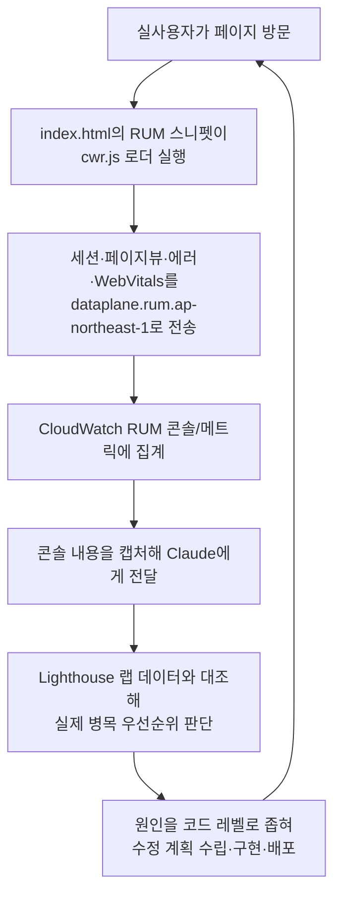

# RUM (실사용자 모니터링)

> **문서 성격**: 독립 기능 문서(서사형)
>
> **대상 독자**: 이 레포 FE를 처음 보거나 오랜만에 돌아온 개발자.
>
> **읽고 나면**: RUM이 어떻게 수집·전송되는지, 그 데이터를 실제 개선에 어떻게
> 쓰는지 알고, App Monitor 설정을 바꾸거나 재부트스트랩할 수 있다.
>
> **마지막 검토**: 2026-09-27

AWS CloudWatch RUM으로 실사용자(방문자)의 페이지 로딩 성능·에러를 자동 수집합니다.
Cognito 없이 리소스 기반 정책으로 익명 수집하며, FE 코드에는 `index.html`의
스니펫 하나만 존재합니다.

설계 배경(Cloudflare Web Analytics 대신 CloudWatch RUM을 택한 이유, 검토한 대안)은
[`docs/DECISIONS.md`](DECISIONS.md) 2026-09-26 "RUM" 항목을 참고하세요. 이 문서는
"지금 어떻게 동작하는가"만 다룹니다.

## 1. 쉬운 설명

Lighthouse(`docs/PERFORMANCE.md`)는 실험실에서 제품을 한 번 테스트하는 것과
같다 — 통제된 조건에서 딱 한 번 재본 값이다. RUM은 그 대신 **실제 매장에 나가
손님이 어떻게 쓰는지 관찰하는 것**이다 — 방문자가 어떤 기기·브라우저·네트워크로
접속하는지, 실제로 얼마나 기다렸는지를 매 방문마다 조용히 기록한다. 이 문서는
"기록만 하고 끝나는 것"이 아니라, 그 기록을 실제 개선으로 연결하는 루프까지
다룬다.



## 2. 전제 지식

이 문서는 **왜** Cloudflare Web Analytics 대신 CloudWatch RUM을 택했는지는
다루지 않는다 — `docs/DECISIONS.md` 2026-09-26 "RUM" 항목을 먼저 본다. AWS
IAM의 기본 개념(정책, 리소스 기반 정책)과 이 레포가 BE 배포에도 쓰는 AWS
계정 구조(`link-sphere-user`, `docs/DEPLOY.md`)를 안다고 가정한다.

## 3. 사용한 도구·기술

- **기능 자체**: [`aws-rum-web`](https://github.com/aws-observability/aws-rum-web)
  CDN 스니펫, AWS CloudWatch RUM(App Monitor + 리소스 기반 정책)
- **구현·검증 과정에서 쓴 도구**: AWS CLI(`aws rum`, `aws cloudwatch`, `aws iam`),
  Playwright(로컬 빌드에서 실제 네트워크 요청 확인)

## 4. 왜 만들었나

Lighthouse·PageSpeed Insights는 한 번 실행한 시점의 랩(실험실) 데이터라 실제
방문자 환경(기기·브라우저·네트워크)을 반영하지 못한다. 이 사이트는 CrUX(Chrome
UX Report — Google이 크롬 사용자로부터 수집하는 필드 데이터, "12. 용어 사전" 참고)
필드 데이터도 없어(트래픽이 적어 미수집), 필드 데이터를 얻을 별도 수단이 전혀
없었다는 게 문제였다. 문제의식과 검토한 대안 비교는 `docs/DECISIONS.md`를
참고한다.

## 5. 구조

Cognito identity pool 없이 **리소스 기반 정책**(`aws rum put-resource-policy`)만
붙여 비로그인 방문자의 이벤트까지 익명으로 받는다:

```json
{
  "Version": "2012-10-17",
  "Statement": [
    {
      "Effect": "Allow",
      "Principal": "*",
      "Action": "rum:PutRumEvents",
      "Resource": "arn:aws:rum:ap-northeast-1:185353921021:appmonitor/link-sphere-post"
    }
  ]
}
```

`index.html`의 `signing: false`(7. 운영 파라미터 참고)는 이 정책과 짝을 이루는
설정이다 — 서명 없는 요청도 이 리소스 정책이 허용하는 범위 안에서 받아들여진다.
왜 이 설정이 문서상 논란이 있었고 어떻게 검증했는지는 "10. 시행착오" 참고.

## 6. 상태 모델

해당 없음 — 이 기능은 FE에 별도 상태(Zustand 스토어, React Query 캐시, Zod
스키마)를 두지 않는다. `index.html`의 정적 스니펫이 브라우저에서 실행되며
끝난다.

## 7. 운영 파라미터

| 파라미터             | 값                                                                                                    | 위치            |
| -------------------- | ----------------------------------------------------------------------------------------------------- | --------------- |
| App Monitor 이름     | `link-sphere-post`(AWS CLI `--name` 인자 — `index.html`에는 이름이 아니라 ID만 있다)                  | AWS 측 설정     |
| App Monitor ID       | `81cbaae5-b6f2-48d9-9c05-f6f6f5f648cc`                                                                | `index.html:28` |
| 리전                 | `ap-northeast-1`                                                                                      | `index.html:30` |
| 로더 URL             | `https://client.rum.us-east-1.amazonaws.com/3.x/cwr.js`(항상 us-east-1 고정, App Monitor 리전과 무관) | `index.html:31` |
| dataplane 엔드포인트 | `https://dataplane.rum.ap-northeast-1.amazonaws.com`                                                  | `index.html:34` |
| `sessionSampleRate`  | `1`(전수 수집)                                                                                        | `index.html:33` |
| `telemetries`        | `['errors', 'performance']`                                                                           | `index.html:35` |
| `allowCookies`       | `true`                                                                                                | `index.html:36` |
| `signing`            | `false`(리소스 기반 정책과 짝)                                                                        | `index.html:38` |

## 8. 코드 지도와 자주 하는 수정

| 하고 싶은 일                 | 파일:줄         | 방법                                                                             |
| ---------------------------- | --------------- | -------------------------------------------------------------------------------- |
| 표본 비율 조정(비용 절감 등) | `index.html:33` | `sessionSampleRate` 값을 0~1 사이로 조정                                         |
| 새 이벤트 종류 추가          | `index.html:35` | `telemetries` 배열에 추가(`aws-rum-web` 지원 목록 확인 필요)                     |
| App Monitor 설정 변경        | AWS CLI         | `aws rum update-app-monitor --name link-sphere-post --region ap-northeast-1 ...` |
| 익명 수집 정책 변경          | AWS CLI         | `aws rum put-resource-policy` — 정책 JSON은 "5. 구조" 참고                       |

이 스니펫 외에는 RUM 전용 FE 코드가 없다 — `scripts/`에도 관련 스크립트가 없다.

## 9. 검증 결과

- **로컬**(`vite preview`, `localhost`): `cwr.js` 로더 로드 `200`, `dataplane` 전송은
  `400 domain localhost does not match` — App Monitor 등록 도메인이 프로덕션
  도메인이라 예상된 결과다. **인증 실패가 아니라 도메인 검증 단계까지 도달했다는
  것 자체가 `signing: false`가 유효하다는 증거다**(서명 검증에서 막혔다면 인증
  단계에서 걸렸을 것이다).
- **프로덕션**(`dbw3brui6htwk.cloudfront.net`): `dataplane` 전송 `200 OK`.
- **CloudWatch 메트릭**(`aws cloudwatch get-metric-statistics --namespace AWS/RUM`,
  2026-09-26 직접 측정, 30분 구간): `SessionCount` 합계 3, `PageViewCount` 합계 15,
  `WebVitalsLargestContentfulPaint` 평균 1504ms/1812ms — 전부 검증 접속으로 발생한
  테스트 트래픽이다.

## 10. 시행착오

**IAM 권한 3라운드.** `aws rum create-app-monitor`를 CLI로 직접 실행하며 순서대로
겪었다:

1. 기본 4개 액션(`rum:CreateAppMonitor`/`GetAppMonitor`/`ListAppMonitors`/
   `PutResourcePolicy`) 권한이 없어 `AccessDeniedException` → 인라인 정책 생성.
2. 인라인 정책의 **2048자 총 한도**를 넘어 콘솔에서 저장 실패 → 별도 관리형
   (managed) 정책으로 전환.
3. RUM이 계정당 1회 필요로 하는 `iam:CreateServiceLinkedRole`이 없어 재차
   `AccessDeniedException` → 같은 관리형 정책에 그 액션(리소스는
   `arn:aws:iam::185353921021:role/aws-service-role/rum.amazonaws.com/AWSServiceRoleForCloudWatchRUM`로
   스코프)을 추가.

세 라운드 모두 콘솔 클릭이 아니라 CLI로 진행했기 때문에 각 실패의 정확한 원인
(에러 메시지의 액션 이름)을 바로 특정할 수 있었다.

**`signing: false` 문서 간 불일치.** `aws-rum-web`의 일반 설정 가이드는
_"signing은 인증되지 않은 프록시를 쓸 때만 false로 설정해야 하며, CloudWatch
RUM에 직접 보낼 때는 반드시 true여야 한다"_(번역,
[출처](https://github.com/aws-observability/aws-rum-web/blob/main/docs/configuration.md))라고
경고하는데, CloudWatch RUM의 리소스 기반 정책 문서는 퍼블릭 정책을 쓰면
_"권한 부여 설정을 건너뛸 수 있다"_(번역)고 안내해 서로 엇갈렸다. 문서만으로는
어느 쪽이 이 구성(Cognito 없음 + 리소스 정책)에 맞는지 확정할 수 없어서, "9.
검증 결과"의 로컬/프로덕션 실측으로 직접 해소했다 — 리소스 정책 기반 구성에서는
`signing: false`가 맞는 설정이다.

**CLI로 원본 이벤트를 못 보는 제약.** 개별 이벤트 상세를 CLI로 보려고
`aws rum get-app-monitor-data`를 시도했으나 `rum:GetAppMonitorData` 권한이 없어
거부됐고, 이 IAM 사용자 자신의 정책 목록조차 조회 권한이 없어
(`iam:ListAttachedUserPolicies` 거부) 직접 권한을 추가하지도 못했다. 집계
메트릭(세션 수·페이지뷰 등)은 `aws cloudwatch get-metric-statistics`로 볼 수
있지만, 개별 이벤트(어떤 페이지·브라우저였는지 등)는 AWS 콘솔에서만 확인
가능하다.

## 11. 남은 것

- 지금 쌓인 데이터는 검증용 테스트 트래픽뿐이다 — 실사용자 트래픽이 유의미한
  기간 동안 쌓이기를 기다리는 중이다.
- CLI로 원본 이벤트를 보려면 `rum:GetAppMonitorData` 권한을 관리형 정책에
  추가해야 한다(필요해지면 추가).
- 비용은 정밀 비교하지 않았다(`docs/DECISIONS.md`에 이미 명시) — 트래픽이 늘어
  비용이 유의미해지면 `sessionSampleRate`를 낮추는 방향으로 대응한다.

## 12. 용어 사전

- **App Monitor**: CloudWatch RUM에서 웹앱 하나를 추적하는 단위. 이름과 별도로
  UUID 형태의 ID를 가진다.
- **리소스 기반 정책(resource-based policy)**: "누가 이 리소스에 접근할 수
  있는가"를 리소스 쪽에 붙이는 IAM 정책. Cognito 같은 자격 증명 발급 체계 없이도
  `Principal: "*"`로 익명 접근을 허용할 수 있다.
- **필드 데이터 / 랩 데이터**: 필드 데이터 = 실제 방문자 환경에서 수집된 데이터
  (RUM). 랩 데이터 = 통제된 환경에서 1회 실행한 데이터(Lighthouse).
- **CrUX(Chrome UX Report)**: Google이 실제 크롬 사용자로부터 익명 수집하는
  필드 데이터. 트래픽이 충분해야 수집되는데, 이 사이트는 트래픽이 적어 CrUX
  데이터가 없다(PageSpeed Insights에서도 "필드 데이터 없음"으로 표시된다).
- **dataplane**: RUM 클라이언트가 수집한 이벤트를 실제로 전송하는 AWS 엔드포인트
  (리전별로 다르다 — 로더 스크립트 자체는 항상 `us-east-1` 고정).

## 13. 관련 문서

- [`docs/DECISIONS.md`](DECISIONS.md) — Cloudflare 대신 CloudWatch RUM을 택한
  이유(2026-09-26 "RUM" 항목)
- [`docs/PERFORMANCE.md`](PERFORMANCE.md) — Lighthouse 랩 데이터 측정 절차
  (RUM과 상호 보완)
