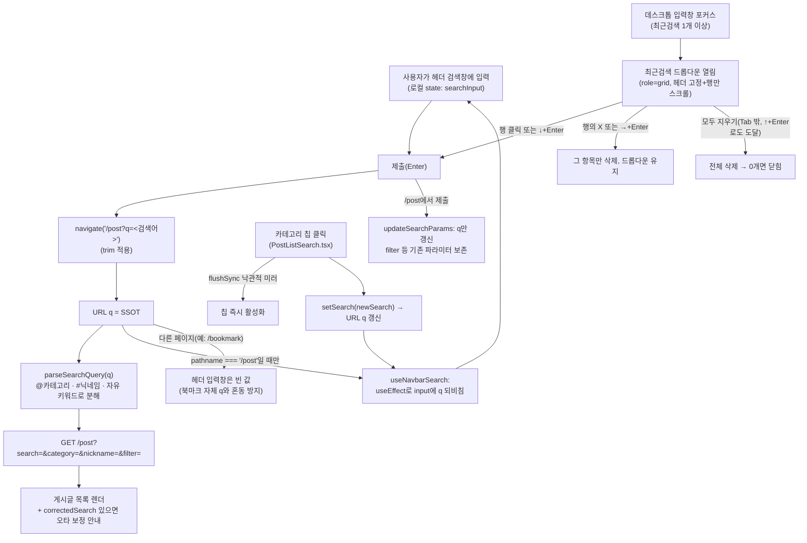
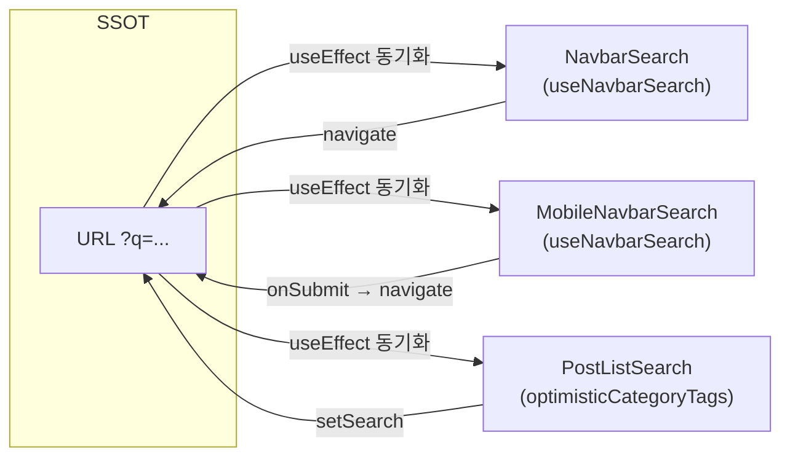

# 게시글 검색 기능

> **문서 성격**: 독립 기능 문서(서사형)
>
> **대상 독자**: 이 레포 FE를 처음 보거나 오랜만에 돌아온 개발자.
>
> **읽고 나면**: 게시글 검색어가 어디에 저장되고(SSOT), 헤더 검색창이 데스크톱·모바일에서
> 각각 어떻게 그 값과 동기화되는지, 최근검색어가 두 화면에 어떻게 공유되는지, `@카테고리`·
> `#닉네임` 태그가 어떻게 분해되는지 이해하고, 검색 관련 동작(유지·초기화·오타 보정)을
> 어느 파일에서 바꾸는지 안다.
>
> **마지막 검토**: 2026-09-21

## 1. 쉬운 설명

게시글 검색어는 브라우저 주소창의 `?q=` 파라미터 **하나**가 진짜 원본이고, 헤더의 검색
입력창은 그 원본을 보여주는 **거울**이다. 거울이 원본을 따라 움직이지, 거울을 직접 깨거나
칠해도 원본(주소)은 바뀌지 않는다 — 그래서 입력창의 X 버튼을 눌러도 검색 결과는 그대로다.
반대로 카테고리 칩을 클릭하거나 뒤로가기를 누르면 원본(주소)이 바뀌고, 거울(입력창)이 그
변화를 뒤따라 비춘다.

거울이 이 원본을 비추는 데는 조건이 하나 있다 — **"게시글 목록(`/post`)을 보고 있을 때만"**
비춘다. 북마크 페이지도 우연히 같은 이름(`q`)의 주소 파라미터를 쓰기 때문에, 거울이 아무
페이지에서나 켜져 있으면 엉뚱한 폴더 검색어를 게시글 검색어인 것처럼 잘못 비춘다.

## 2. 전제 지식

- **가정하지 않는 지식**: React Router의 `useSearchParams`, React Query의 캐시 무효화.
  `.claude/CLAUDE.md`의 "3-Layer API 패턴"과 "React Query 라이프사이클 주의" 절을 먼저 보면
  이 문서의 `post.queries.ts`·`post.keys.ts` 언급이 더 잘 읽힌다.
- **가정하는 지식**: FSD 레이어 구조(`entities`/`widgets`/`features`)와 URL이 상태 저장소로
  쓰일 수 있다는 개념.
- 검색창을 헤더로 통합한 배경은 [`docs/DECISIONS.md`](./DECISIONS.md)의 "2026-09-06 —
  검색창 헤더 통합 + 모바일 칩 높이 되돌림" 항목, 검색어 유지 결정의 배경은 같은 문서
  "2026-09-07 — 헤더 검색어 유지" 항목 참고.

## 3. 사용한 도구·기술

**기능 자체**

- React Router `useSearchParams`/`useLocation` — URL을 검색어 저장소로 사용
- Zod — 응답 스키마(`post.schema.ts`)의 `correctedSearch` 등 검증
- Zustand — 봇 글 숨기기(`hideBots.store.ts`)만 예외적으로 사용 (개인 설정이라 URL 대상 아님)

**구현·검증 과정에서 쓴 도구**

- Vitest + Testing Library — `NavbarSearch.test.tsx`, `MobileNavbarSearch.test.tsx`,
  `PostListSearch.test.tsx`
- 웹 리서치([Baymard #346](https://baymard.com/blog/persist-search-queries)) — 검색어 유지
  여부의 UX 근거 확보

## 4. 왜 만들었나

헤더 검색을 데스크톱·모바일에 붙인 뒤, 제출하면 입력창이 곧바로 비워지는 게 원래 동작이었다.
이 동작을 명시적으로 서술한 문서가 없었고("의도인지 버그인지" 판단 근거 부재), 실제로는
[Baymard 가이드라인 #346](https://baymard.com/blog/persist-search-queries) — 검색어를
비우는 사이트는 데스크톱 33%·모바일 42%뿐 — 이 다수 관행과 어긋나는 소수파 패턴이었다. 이 문서는 "검색어가 지금 어떻게 저장·표시되는가"를 한곳에 정리해, 다음에 이
영역을 만지는 사람이 코드를 처음부터 다시 추적하지 않게 한다.

## 5. 구조

핵심 설계 결정은 "URL `q`가 유일한 SSOT"라는 것이다. 헤더 검색창(데스크톱
[`NavbarSearch.tsx`](../src/widgets/layout/navbar/ui/NavbarSearch.tsx), 모바일
[`MobileNavbarSearch.tsx`](../src/widgets/layout/navbar/ui/MobileNavbarSearch.tsx))과 게시글
목록 필터 카드([`PostListSearch.tsx`](../src/widgets/post/post-list/ui/PostListSearch.tsx))는
둘 다 이 `q`를 각자 구독하는 **미러**일 뿐, 서로 상태를 공유하지 않는다. 두 미러가 값을
주고받으려면 반드시 URL을 거쳐야 한다.

**왜 헤더 입력창을 `PostListSearch`의 `flushSync` 낙관적 미러 경로에 끼워 넣지 않았나**:
두 컴포넌트의 공통 조상이 `RootLayout` 수준이라 상태를 공유하려면 새 스토어가 필요한데,
그건 "SSOT는 URL"이라는 결정을 되돌리는 것이다. 대신 헤더 입력창은 URL 변화를 한 틱 늦게
따라가는 것을 허용한다 — React Router의 `startTransition` 완료 후 반드시 수렴한다.

**왜 헤더 검색은 `/post`에서만 URL을 미러하나**: 북마크 페이지([`BookmarkSearch`](../src/widgets/bookmark/bookmark-search/ui/BookmarkSearch.tsx),
[`useBookmarkSearch.ts`](../src/widgets/bookmark/bookmark-search/hooks/useBookmarkSearch.ts))도
같은 이름의 `q` 파라미터를 쓴다. 헤더는 `Navbar.tsx`에서 전 페이지에 렌더되므로, 경로를
가리지 않으면 `/bookmark?q=...`에서 헤더 검색창에 북마크 검색어가 잘못 표시된다. 근거:
[`docs/DECISIONS.md`](./DECISIONS.md) "2026-09-07" 항목.

**URL 쓰기는 `useSearchParamsDraft`를 거친다 — 직접 `.set()`/`.delete()`하지 않는다.**
`setSearch`/`toggleFilter`(`usePostList.ts`)는 `useSearchParams()`가 돌려주는 공유
URLSearchParams 인스턴스를 그 자리에서 고치지 않는다. 대신
[`useSearchParamsDraft`](../src/shared/hooks/useSearchParamsDraft.ts)가 "커밋된 URL 또는
아직 반영 안 된 pending 값" 위에 사본을 만들어 그 사본만 고친다. `RouterProvider.tsx`의
`v7_startTransition: true` 때문에 필터 변경으로 목록 쿼리가 suspend하는 동안(정지 구간)
React가 보는 `location.search`는 API 응답이 올 때까지 안 바뀌는데, 그 구간 안에서 칩을
연속으로 클릭해도 각 클릭의 의도가 pending 위에 이어붙어 유실되지 않는다. 자세한 경위는
§10과 [`docs/DECISIONS.md`](./DECISIONS.md) "2026-09-14" 항목 참고. 데스크톱 헤더의
`submitQuery`(`NavbarSearch.tsx`)도 `/post`에 있을 때는 이 훅을 거친다 — 그래야 검색
제출이 게시글 범위 필터(`filter`) 등 기존 파라미터를 지우지 않는다.

**최근검색어 저장소는 `Navbar`에서 한 번만 구독한다.** [`useRecentSearches.ts`](../src/widgets/layout/navbar/hooks/useRecentSearches.ts)는
[`useAppLocalStorage.ts`](../src/shared/hooks/useAppLocalStorage.ts)를 쓰는데, 그 훅의
`storage` 이벤트 동기화는 **다른 탭 전용**이라 같은 탭에서 두 인스턴스를 따로 호출하면
서로 어긋난다. 그래서 `Navbar.tsx`가 `useRecentSearches()`를 한 번만 호출하고, 데스크톱
드롭다운(`NavbarSearch`→`RecentSearchDropdown`)과 모바일 패널(`RecentSearchPanel`)
모두에게 props로 내려준다 — 어느 쪽도 이 훅을 직접 호출하지 않는다.

## 6. 상태 모델

이 기능은 새 zustand 스토어나 React Query 키 계층을 도입하지 않는다 — 검색어 자체는 URL이,
데이터는 기존 `postKeys`(`post.keys.ts`)가 소유한다. 헤더 입력창의 로컬 state만 아래 훅이
소유한다.

| 상태                                               | 소유자                                                                                                 | 비고                                                                                                                                                                                                                   |
| -------------------------------------------------- | ------------------------------------------------------------------------------------------------------ | ---------------------------------------------------------------------------------------------------------------------------------------------------------------------------------------------------------------------- |
| 검색어 원본(`q`)                                   | URL `searchParams` (React Router)                                                                      | `@카테고리 #닉네임 키워드` 형태로 토큰이 섞여 들어간다                                                                                                                                                                 |
| 헤더 입력값                                        | [`useNavbarSearch.ts`](../src/widgets/layout/navbar/hooks/useNavbarSearch.ts)의 로컬 `useState`        | `pathname === '/post'`일 때만 `q`를 초기값·동기화 대상으로 삼는다                                                                                                                                                      |
| 필터 카드 낙관적 칩                                | [`PostListSearch.tsx`](../src/widgets/post/post-list/ui/PostListSearch.tsx)의 `optimisticCategoryTags` | `flushSync`로 URL 반영 전에 즉시 활성화 표시                                                                                                                                                                           |
| 커밋 전 URL 쓰기 의도(pending)                     | [`useSearchParamsDraft.ts`](../src/shared/hooks/useSearchParamsDraft.ts)의 모듈 스코프 `pendingIntent` | 정지 구간 동안 `location.key` 기준으로 연속 조작을 이어붙임. 커밋되면(`location.key` 변경) 자동 폐기                                                                                                                   |
| 봇 글 숨기기                                       | [`useHideBotsStore`](../src/shared/store/hideBots.store.ts) (zustand + localStorage)                   | 기기별 개인 설정이라 URL 대상 아님, "조건 N개" 카운트에서도 제외                                                                                                                                                       |
| 최근 검색어(모바일·데스크톱 공용)                  | [`useRecentSearches.ts`](../src/widgets/layout/navbar/hooks/useRecentSearches.ts) (localStorage)       | `Navbar`가 한 번만 구독해 양쪽에 props로 내려줌(바로 위 §5 문단 참고)                                                                                                                                                  |
| 모바일 검색 패널 열림                              | `location.state.mobileSearchOpen`(React Router)                                                        | 구독자 3곳 — `Navbar`(패널 렌더), [`MobileCommentBar`](../src/features/comment/create/ui/MobileCommentBar.tsx)(같은 z층 겹침 숨김), [`AppLayout`](../src/app/layouts/app-layout/AppLayout.tsx)(배경 `main` inert 차단) |
| 데스크톱 드롭다운 열림(`isOpen`)                   | [`NavbarSearch.tsx`](../src/widgets/layout/navbar/ui/NavbarSearch.tsx)의 로컬 `useState`               | **이벤트(포커스/입력/blur/키보드)에서만 갱신 — 입력값에서 파생하거나 effect로 동기화하지 않는다.** ESC 2단계 재오픈 함정은 §10 참고                                                                                    |
| 데스크톱 드롭다운 활성 셀(`activeRow`/`activeCol`) | 같은 파일의 로컬 `useState`                                                                            | `activeRow===recentSearches.length`는 "모두 지우기" 행. 실제 DOM 포커스는 항상 입력창에 머물고, 이 값은 `aria-activedescendant`로만 노출된다                                                                           |

## 7. 운영 파라미터

| 값                                         | 위치                                                                                                     |
| ------------------------------------------ | -------------------------------------------------------------------------------------------------------- |
| 최근 검색어 최대 개수(10)                  | [`useRecentSearches.ts:5`](../src/widgets/layout/navbar/hooks/useRecentSearches.ts#L5)                   |
| `/` 검색 단축키                            | [`NavbarSearch.tsx:48-51`](../src/widgets/layout/navbar/ui/NavbarSearch.tsx#L48-L51)                     |
| 데스크톱 드롭다운 행 목록 최대 높이(190px) | [`RecentSearchDropdown.tsx`](../src/widgets/layout/navbar/ui/RecentSearchDropdown.tsx)의 `max-h-[190px]` |

## 8. 코드 지도와 자주 하는 수정

| 하고 싶은 것                                              | 파일:줄                                                                                                                                                                                                    |
| --------------------------------------------------------- | ---------------------------------------------------------------------------------------------------------------------------------------------------------------------------------------------------------- |
| 헤더 입력값이 URL과 동기화되는 조건 바꾸기                | [`useNavbarSearch.ts:14`](../src/widgets/layout/navbar/hooks/useNavbarSearch.ts#L14) — `isPostListPage` 판정                                                                                               |
| 검색어 제출(경로·trim·filter 보존) 바꾸기 — 데스크톱      | [`NavbarSearch.tsx:53-80`](../src/widgets/layout/navbar/ui/NavbarSearch.tsx#L53-L80) — `submitQuery`                                                                                                       |
| 검색어 제출 바꾸기 — 모바일                               | [`Navbar.tsx:109-117`](../src/widgets/layout/navbar/ui/Navbar.tsx#L109-L117) — `handleSearchSubmit`(최근검색 기록 포함)                                                                                    |
| X 버튼 동작 바꾸기                                        | 데스크톱 [`NavbarSearch.tsx:266-276`](../src/widgets/layout/navbar/ui/NavbarSearch.tsx#L266-L276), 모바일 [`MobileNavbarSearch.tsx:19-25`](../src/widgets/layout/navbar/ui/MobileNavbarSearch.tsx#L19-L25) |
| 데스크톱 드롭다운 열림/닫힘 규칙(포커스·입력·blur) 바꾸기 | [`NavbarSearch.tsx:87-113`](../src/widgets/layout/navbar/ui/NavbarSearch.tsx#L87-L113) — `handleChange`/`handleFocus`/`handleBlur`                                                                         |
| 데스크톱 드롭다운 키보드(ESC 2단계·화살표·Enter) 바꾸기   | [`NavbarSearch.tsx:134-242`](../src/widgets/layout/navbar/ui/NavbarSearch.tsx#L134-L242) — `handleKeyDown`                                                                                                 |
| 드롭다운 목록 마크업(헤더 고정·행·삭제 버튼) 바꾸기       | [`RecentSearchDropdown.tsx`](../src/widgets/layout/navbar/ui/RecentSearchDropdown.tsx)                                                                                                                     |
| `@카테고리`/`#닉네임`/키워드 분해 규칙 바꾸기             | [`search-parser.ts`](../src/widgets/post/post-list/utils/search-parser.ts) — `parseSearchQuery`                                                                                                            |
| "조건 N개 적용 중" 카운트 로직                            | [`PostListSearch.tsx:76-87`](../src/widgets/post/post-list/ui/PostListSearch.tsx#L76-L87)                                                                                                                  |
| 초기화 버튼(필터+검색어 전체 리셋)                        | [`PostListSearch.tsx:89-96`](../src/widgets/post/post-list/ui/PostListSearch.tsx#L89-L96) — `handleClearSearch`                                                                                            |
| 오타 보정 문구                                            | `TEXTS.post.search.corrected`, 표시는 [`PostList.tsx:52-56`](../src/widgets/post/post-list/ui/PostList.tsx#L52-L56)                                                                                        |
| 모바일 검색 패널 열림 상태                                | [`Navbar.tsx:69-71`](../src/widgets/layout/navbar/ui/Navbar.tsx#L69-L71) — `location.state.mobileSearchOpen`                                                                                               |
| 검색 중 하단 댓글바 숨김 동작 바꾸기                      | [`MobileCommentBar.tsx`](../src/features/comment/create/ui/MobileCommentBar.tsx) — `useHistoryOverlay('mobileSearchOpen')` 구독부, 두 `return` 모두의 `cn(...)` 조건부 `hidden`                            |
| 검색 중 배경 클릭·포커스 차단 범위 바꾸기                 | [`AppLayout.tsx`](../src/app/layouts/app-layout/AppLayout.tsx) — `main` ref에 건 `inert` 동기화 `useLayoutEffect`                                                                                          |

## 9. 검증 결과

- `pnpm test` 459개 전체 통과(`NavbarSearch.test.tsx` 23케이스 — filter 보존 3, 최근검색 기록
  2, 드롭다운 열림/닫힘/ESC/화살표/클릭/삭제 14 포함, `Navbar.test.tsx`에 데스크톱 최근검색
  localStorage 배선 1케이스 추가), `pnpm check`(type-check + lint + format:check) 통과.
- 수동 확인: `/post?q=리액트` 새로고침·뒤로가기 시 헤더 입력값 복원, `/bookmark` 이동 시 헤더
  입력값이 비는 것, `@카테고리` 칩 클릭 시 입력값이 토큰으로 바뀌는 것, 모바일 패널에서 X를
  눌러도 패널이 닫히지 않는 것.
- Playwright로 데스크톱 최근검색 드롭다운 실측(2026-09-21): 제출 시 localStorage 기록,
  포커스 시 드롭다운 노출(입력값이 있어도 함께), ESC 1단계(닫기·값 보존)·2단계(입력만
  비움·URL q 유지·재오픈 안 함), 10개 항목에서 목록만 스크롤되고 헤더("모두 지우기")는
  고정됨(스크린샷으로 `headerTop` 불변 확인), ↓→행 활성화·→로 삭제 셀 이동·첫 행에서
  ↑로 "모두 지우기" 도달, 행 클릭 시 유실 없이 즉시 검색, X 클릭 시 그 항목만 삭제,
  `filter=isBookmarked` 켠 채 제출해도 `q`와 함께 유지, 모바일 뷰포트에서 기존 패널이
  그대로인 것.

## 10. 시행착오

**헤더 통합 시 로컬 미러 소실 → `optimisticCategoryTags` 도입.** 검색창이 필터 카드에서
헤더로 옮겨가기 전에는 카테고리 칩의 `@`토큰 병합 로직이 필터 카드 로컬 `searchInput`을
기준으로 즉시 반영됐다. 헤더로 옮기며 그 로컬 상태가 사라지자 URL만 기준으로 삼아야 했는데,
`setSearchParams`가 라우터 `startTransition`에 감싸여 있어 칩이 늦게 반응하는 것처럼
보이는 문제가 생겼다. 범위 필터 칩이 이미 쓰던 `flushSync` 낙관적 미러 패턴을 카테고리
칩에도 그대로 적용해 해소했다(`optimisticCategoryTags`, `PostListSearch.tsx`). 자세한 경위는
[`docs/DECISIONS.md`](./DECISIONS.md) "2026-09-06 — 검색창 헤더 통합" 참고.

**검색어 유지 도입 시 X 버튼 처리를 웹 리서치로 검증.** 검색어를 입력창에 유지하기로 하면서
"X를 누르면 검색 결과까지 지워야 하는가"가 쟁점이 됐다. 처음엔 URL까지 지우는 쪽이 일관돼
보였지만, 실제로는 [Google 결과 페이지의 Clear 버튼](https://9to5google.com/2019/11/12/google-search-clear-text-desktop/)과
네이티브 `<input type="search">` 모두 입력만 비운다는 게 확인되어 현행(입력만 비움)을
유지했다. 자세한 경위는 [`docs/DECISIONS.md`](./DECISIONS.md) "2026-09-07" 참고.

**필터 칩 클릭이 간헐적으로 URL·UI에 반영되지 않거나 되돌아가는 버그 → mutation 제거.**
`usePostList.ts`의 `toggleFilter`/`setSearch`가 `useSearchParams()`가 돌려주는 공유
URLSearchParams 인스턴스를 `.set()`/`.delete()`로 직접 수정(mutate)하고 있었다. 정지 구간
(위 §5 참고) 안에서 칩을 연속으로 클릭하면 이 공유 인스턴스를 통해 우연히 값이 누적됐지만,
같은 메커니즘 때문에 ① 초기화 직후 정지 구간에 다른 칩을 클릭하면 방금 지운 필터가
되살아나고 ② `BookmarkPage`(folder/sort)와 `useBookmarkSearch`(q)처럼 서로 다른
`useSearchParams()` 인스턴스가 각자 mutate하면 한쪽의 의도가 유실될 수 있었다. Playwright로
`history.pushState` 호출 스택을 계측해 재현·확정한 뒤, mutation을 제거하고 "커밋된 URL +
아직 반영 안 된 pending 의도"를 [`useSearchParamsDraft`](../src/shared/hooks/useSearchParamsDraft.ts)로
명시적으로 추적하는 구조로 바꿨다. pending을 모듈 스코프(훅 인스턴스별 `useRef`가 아니라)에
둔 이유는 URL이 라우터당 하나뿐인 공유 자원이라 pending 의도도 하나만 있으면 되고, 서로 다른
훅 인스턴스(BookmarkPage·useBookmarkSearch)가 그걸 공유해야 하기 때문이다 — 근거는
[`docs/DECISIONS.md`](./DECISIONS.md) "2026-09-14" 항목. 같은 필터를 정지 구간 안에서
재클릭하면 취소되는 동작은 고치지 않았다 — 토글 버튼의 정상 동작으로 간주했다(같은 항목 참고).

**포스트 상세 모바일에서 검색 패널 아래로 댓글 작성바가 그대로 비침 → z층 공유가 원인.**
`RecentSearchPanel`(`fixed top-16 bottom-0`)과 `MobileCommentBar` 접힘 상태가 둘 다
`z-panel`(40)이라, 검색을 열어도 댓글바가 DOM 순서(더 나중에 렌더)만으로 패널 위에 그대로
남아 있었다. 탭바(`z-nav`=50)가 검색 중에도 보이는 건 `Navbar.tsx:228`이 명시한 의도된
설계라 그대로 두고, 댓글바만 [`useHistoryOverlay('mobileSearchOpen')`](../src/shared/hooks/useHistoryOverlay.ts)로
같은 열림 상태를 구독해 `hidden`(`display:none`)을 붙였다. 언마운트하지 않은 이유는
이탈 가드([`useUnsavedChangesGuard.ts`](../src/shared/hooks/useUnsavedChangesGuard.ts))가
`pathname`이 같은 이동은 통과시켜, 검색 열기가 그 가드를 우회하기 때문이다 — 언마운트하면
작성 중이던 본문·첨부 이미지가 경고 없이 사라진다. 같은 김에 `RecentSearchPanel`에
스크림·포커스 트랩이 없어 Tab 키로 배경 게시글·댓글에 포커스가 새는 문제도 함께 발견해,
[`AppLayout.tsx`](../src/app/layouts/app-layout/AppLayout.tsx)의 `main`에 `inert`를 걸어
막았다(React 18.2라 JSX `inert` prop 대신 ref로 DOM 프로퍼티를 직접 설정 —
[facebook/react#24730](https://github.com/facebook/react/pull/24730)).

**태그 붙여쓰기(`@a@b`)가 조용히 0건이 됨 → 태그 경계 규칙 도입.** 사용자가 `@라이프스타일`과
`@데이터`를 띄어 쓰면 정상 동작하는데, 붙여 쓴 `@라이프스타일@데이터`는 결과가 0건이라고
보고했다. 원인은 `search-parser.ts`의 옛 정규식 `/@(\S+)/`·`/#(\S+)/`가 `\S`(공백이 아닌 모든
문자)를 태그 값으로 삼아, 다음 `@`/`#`에서 멈추지 않고 `라이프스타일@데이터` 전체를 하나의
카테고리 값으로 읽었기 때문이다 — 그런 카테고리는 DB에 없으니 BE(`PostRepositoryImpl.kt:110-145`)가
`200 OK` + 0건을 돌려줬다. BE는 에러를 내지 않으므로(검증 애노테이션 없음) 이건 순수 FE 파싱
문제였다.

고치기 전 "제출 시 자동으로 띄워주기"(사용자 입력을 정규화해 URL에 반영)를 검토했으나,
조사 결과 사용자가 친 검색어를 제품이 고쳐 쓰는 선례를 찾지 못해 채택하지 않았다. 자리 잡은
제품들은 공백을 **요구**하고 어기면 평문으로 폴백한다 — GitHub 코드 검색 문서:
_"All parts of a search ... must be separated from one another with spaces"_,
_"code search will try to guess what you mean. It often falls back on treating that
component of your query as the exact text to search for."_
([GitHub Docs](https://docs.github.com/en/search-github/github-code-search/understanding-github-code-search-syntax)).
Twitter의 공식 파서(`twitter-text`)도 붙여 쓰면 아예 추출하지 않는다 — 적합성 테스트에
`description: "DO NOT extract a hashtag without a preceding space"`, `expected: []`
([conformance/extract.yml](https://github.com/twitter/twitter-text/blob/master/conformance/extract.yml)).
문법을 가르치는 관례적 수단은 입력을 고쳐 쓰는 게 아니라 경고·자동완성이었다 — GitHub 이슈
필터 문서: _"As you type your filter, GitHub will show available qualifiers, suggest values,
and warn when there is a problem with your filter."_
([GitHub Docs](https://docs.github.com/en/issues/tracking-your-work-with-issues/using-issues/filtering-and-searching-issues-and-pull-requests)).

그래서 **입력은 그대로 두고 파서만 관대하게 고쳤다.** 태그를 "문자열 시작이나 공백 뒤에서만
시작하고, 다음 공백 또는 다음 `@`/`#`에서 끝난다"로 재정의해(`TAG_RUN`/`TAG_TOKEN`,
`search-parser.ts`) `@a@b`를 `['@a', '@b']`로 올바르게 분해했다. 같은 규칙으로 기존에
"알려진 동작(버그)"으로 테스트에 박제돼 있던 오탐 2건도 함께 풀렸다 — `hong@example.com`이
더 이상 `category: 'example.com'`으로 잘못 잡히지 않고, 단어 중간의 `a#b`도 더 이상 `nickname:
'b'`로 잡히지 않는다. 카테고리 칩 클릭 시 재조립하던 `PostListSearch.tsx`의 같은 정규식
사본도 새 유틸(`extractSearchTags`)로 교체해 규칙을 한 곳에서만 관리하게 했다.

조사 과정에서 BE `nickname` 필터의 별도 버그도 발견했다 — 아래 "남은 것" 참고.

**데스크톱 최근검색 드롭다운 도입 시 ESC 2단계가 스스로를 무효화하는 함정 →
파생 상태 대신 이벤트 엣지로 해소.** "포커스 시 열고, 입력을 시작하면 닫고, 다 지우면
다시 열린다"(`NavbarSearch.tsx`의 `isOpen`)와 "ESC 1단계는 닫기, 2단계는 입력
비우기"를 함께 구현하면서, `isOpen`을 `searchInput === '' && 포커스됨`처럼 입력값에서
**파생**시키거나 `useEffect([searchInput])`로 동기화하는 방식을 먼저 시도했다. 그러면
ESC 2단계가 `setSearchInput('')`으로 입력을 비우는 순간 "비었고 포커스됨" 조건이 다시
참이 되어 드롭다운이 그 자리에서 곧바로 재오픈됐다 — 2단계가 자기 자신을 무효화하는
루프였다. 원인은 파생/effect 갱신이 "무엇이 이 값을 바꿨는지" 구분하지 못하고 결과값만
보는 데 있었다. `isOpen`을 오직 이벤트 핸들러(포커스/`onChange`/blur/키보드)에서만
갱신하도록 바꾸자 문제가 구조적으로 사라졌다 — ESC의 `setSearchInput('')`은 `onChange`를
거치지 않으므로 "입력을 다 지우면 열린다" 규칙 자체가 발동하지 않는다. 같은 파생 상태
문제는 URL→input 미러(`useNavbarSearch`)가 `/post`→`/bookmark` 이동 시 입력을 `''`로
만드는 경우에도 재발할 뻔했다 — 이 규칙 덕분에 그 경우도 자동으로 함께 막힌다.

**항목 클릭이 blur로 유실되는 문제 → 드롭다운 루트의 `onMouseDown` 기본동작 차단.**
드롭다운 안의 검색어·삭제 버튼을 마우스로 클릭하면 브라우저 기본동작(`mousedown`이
포커스를 클릭 대상으로 옮김)이 먼저 실행돼 입력창이 blur되고, `handleBlur`가 드롭다운을
닫아버려 뒤따르는 `click` 이벤트가 이미 사라진 버튼에 도달하지 못하는 고전적인 문제가
있었다. 드롭다운 루트 `div`의 `onMouseDown`에서 `e.preventDefault()`를 호출해 포커스
이동 자체를 막자, `blur`가 아예 발생하지 않아 뒤따르는 `click`이 정상적으로 버튼에
도달했다(`RecentSearchDropdown.tsx`). 이 방식은 모든 셀 버튼에 `tabIndex={-1}`을 준
것과 짝을 이룬다 — 실제 DOM 포커스는 항상 입력창에 머물고, 화살표 키로만 가상 포커스
(`aria-activedescendant`)가 옮겨간다는 설계와 일관된다.

## 11. 남은 것

- **닉네임을 2개 이상 지정하면 결과가 0건이 된다.** FE는 `#철수 #영희`를
  `nickname=철수,영희`로 콤마 join해 보내는데(`search-parser.ts`), BE
  `PostRepositoryImpl.kt:153-168`은 이 값을 `split(",")` 하지 않고 `LIKE '%철수,영희%'`
  통째로 검색한다 — 닉네임에 콤마가 든 계정이 없으니 0건이 된다. 같은 파일의 `category`
  필터(`:110-145`)는 `split(",").map{trim()}.filter{isNotEmpty()}` 후 `OR`로 묶어 정상
  처리하므로, `nickname`도 그 형태를 따라가면 될 것으로 보인다. BE 레포에서 별도로 다룰 것
  — 2026-09-21 조사 시점 `nickname`엔 `trim()`도 없고, `getAllPosts`/`buildPredicates` 경로
  전체에 테스트가 없었다(`src/test`에서 참조 0건).
- 데스크톱 제출이 `replace` 없이 push해 history가 검색 횟수만큼 쌓인다 — 2026-09-07에
  의도적으로 유지하기로 한 것이다(뒤로가기 시 이전 검색어가 input에 복원되는 이점).
- 데스크톱 제출은 `URLSearchParams.toString()` 인코딩(공백→`+`)을 쓰고, 다른 페이지에서
  `/post`로 이동하는 분기는 여전히 `encodeURIComponent`(공백→`%20`)를 쓴다 — 디코딩
  결과는 같아 기능상 문제는 없지만 URL 문자열이 갈린다.
- `/` 단축키(포커스+전체선택)를 누르면 "포커스 시 드롭다운 열기" 규칙과 함께 동작해
  기존 검색어가 전체 선택됨과 동시에 최근검색 드롭다운도 뜬다 — 의도적으로 그대로 둔다.
- 데스크톱 드롭다운(`RecentSearchDropdown.tsx`)과 모바일 패널(`RecentSearchPanel.tsx`)의
  행 마크업(약 10줄)이 각자 따로 있다 — 공유되는 부분이 작고 나머지(고정 유무, 구분선,
  역할)가 서로 달라 공용 추출을 하지 않았다.
- `Navbar`가 `useHistoryOverlay`를 쓰지 않고 `location.state.mobileSearchOpen`을 인라인으로
  직접 push/pop한다 — `MobileCommentBar`·`AppLayout`은 같은 키를 `useHistoryOverlay`로
  구독하므로, 키 문자열이 두 코드 경로에 흩어진 상태다.
- `Navbar.openMobileSearch`에 `preventScrollReset`이 없다 — `useHistoryOverlay`를 쓰는
  다른 4개 오버레이(사이드바·로그인모달·마이페이지·이미지뷰어)와 달리 열 때 배경 스크롤이
  최상단으로 튈 수 있다.
- `/post` 목록에서 300px 이상 스크롤한 채 검색을 열면 `ScrollToTop` FAB(`z-nav`)이 같은
  이유(z층 공유)로 패널 위에 그대로 뜬다. `main` 밖이라 이번 `inert` 차단으로도 안 가려진다.
- `useIsMobile`의 판정 기준(`max-width:768px` + UA)이 Tailwind `md:`(`min-width:768px`)와
  경계가 어긋나, iPad 등에서 `MobileCommentBar`가 마운트되지만 `md:hidden`으로 숨겨져
  하단 댓글 입력 수단이 아예 사라진다.

## 12. 용어 사전

- **SSOT(Single Source of Truth)**: 이 문서에서는 URL의 `q` 쿼리 파라미터를 가리킨다. 다른
  상태(헤더 입력값, 낙관적 칩)는 전부 이를 구독하는 파생 상태다.
- **미러(mirror)**: URL `q`의 값을 그대로 반영하도록 `useEffect`로 동기화된 로컬 state.
- **낙관적 미러**: 서버/라우터 반영을 기다리지 않고 `flushSync`로 즉시 UI에 반영한 뒤 실제
  URL 변경이 뒤따라오게 하는 패턴.
- **`correctedSearch`**: 한/영 자판 오타 보정 시 BE가 응답에 함께 내려주는, 실제로 검색에
  쓰인 보정된 검색어. `post.schema.ts`.

## 13. 관련 문서

- [`docs/DECISIONS.md`](./DECISIONS.md) — "2026-09-06 검색창 헤더 통합", "2026-09-07 헤더
  검색어 유지" 항목
- [`docs/BOOKMARK.md`](./BOOKMARK.md) — 북마크 폴더 내 검색(`useBookmarkSearch.ts`), 이
  기능이 참고한 URL→input 역방향 동기화 선례
- [`docs/VERSION-COMPATIBILITY.md`](./VERSION-COMPATIBILITY.md) — `search` 파라미터·
  `correctedSearch` 필드의 BE 버전 호환 매트릭스
- [`docs/FE-ARCHITECTURE.md`](./FE-ARCHITECTURE.md) — FSD 레이어·네이밍 컨벤션
