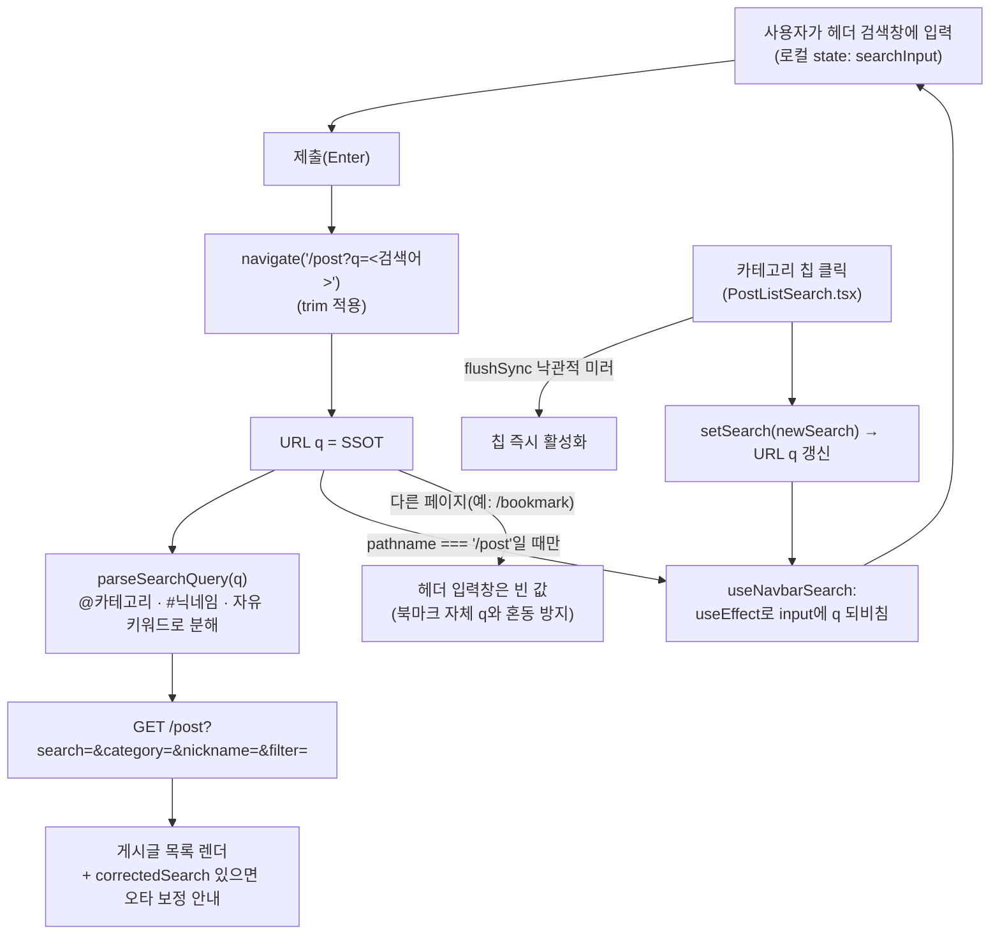
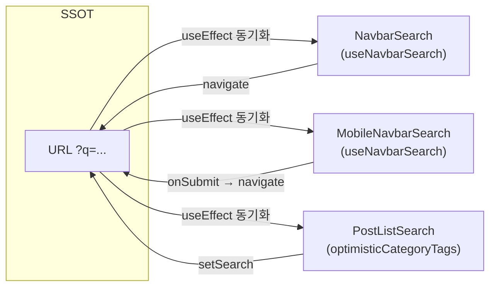

# 게시글 검색 기능

> **문서 성격**: 독립 기능 문서(서사형)
>
> **대상 독자**: 이 레포 FE를 처음 보거나 오랜만에 돌아온 개발자.
>
> **읽고 나면**: 게시글 검색어가 어디에 저장되고(SSOT), 헤더 검색창이 데스크톱·모바일에서
> 각각 어떻게 그 값과 동기화되는지, `@카테고리`·`#닉네임` 태그가 어떻게 분해되는지 이해하고,
> 검색 관련 동작(유지·초기화·오타 보정)을 어느 파일에서 바꾸는지 안다.
>
> **마지막 검토**: 2026-09-07

## 1. 쉬운 설명

게시글 검색어는 브라우저 주소창의 `?q=` 파라미터 **하나**가 진짜 원본이고, 헤더의 검색
입력창은 그 원본을 보여주는 **거울**이다. 거울이 원본을 따라 움직이지, 거울을 직접 깨거나
칠해도 원본(주소)은 바뀌지 않는다 — 그래서 입력창의 X 버튼을 눌러도 검색 결과는 그대로다.
반대로 카테고리 칩을 클릭하거나 뒤로가기를 누르면 원본(주소)이 바뀌고, 거울(입력창)이 그
변화를 뒤따라 비춘다.

거울이 이 원본을 비추는 데는 조건이 하나 있다 — **"게시글 목록(`/post`)을 보고 있을 때만"**
비춘다. 북마크 페이지도 우연히 같은 이름(`q`)의 주소 파라미터를 쓰기 때문에, 거울이 아무
페이지에서나 켜져 있으면 엉뚱한 폴더 검색어를 게시글 검색어인 것처럼 잘못 비춘다.

## 2. 전제 지식

- **가정하지 않는 지식**: React Router의 `useSearchParams`, React Query의 캐시 무효화.
  `.claude/CLAUDE.md`의 "3-Layer API 패턴"과 "React Query 라이프사이클 주의" 절을 먼저 보면
  이 문서의 `post.queries.ts`·`post.keys.ts` 언급이 더 잘 읽힌다.
- **가정하는 지식**: FSD 레이어 구조(`entities`/`widgets`/`features`)와 URL이 상태 저장소로
  쓰일 수 있다는 개념.
- 검색창을 헤더로 통합한 배경은 [`docs/DECISIONS.md`](./DECISIONS.md)의 "2026-09-06 —
  검색창 헤더 통합 + 모바일 칩 높이 되돌림" 항목, 검색어 유지 결정의 배경은 같은 문서
  "2026-09-07 — 헤더 검색어 유지" 항목 참고.

## 3. 사용한 도구·기술

**기능 자체**

- React Router `useSearchParams`/`useLocation` — URL을 검색어 저장소로 사용
- Zod — 응답 스키마(`post.schema.ts`)의 `correctedSearch` 등 검증
- Zustand — 봇 글 숨기기(`hideBots.store.ts`)만 예외적으로 사용 (개인 설정이라 URL 대상 아님)

**구현·검증 과정에서 쓴 도구**

- Vitest + Testing Library — `NavbarSearch.test.tsx`, `MobileNavbarSearch.test.tsx`,
  `PostListSearch.test.tsx`
- 웹 리서치([Baymard #346](https://baymard.com/blog/persist-search-queries)) — 검색어 유지
  여부의 UX 근거 확보

## 4. 왜 만들었나

헤더 검색을 데스크톱·모바일에 붙인 뒤, 제출하면 입력창이 곧바로 비워지는 게 원래 동작이었다.
이 동작을 명시적으로 서술한 문서가 없었고("의도인지 버그인지" 판단 근거 부재), 실제로는
[Baymard 가이드라인 #346](https://baymard.com/blog/persist-search-queries) — 검색어를
비우는 사이트는 데스크톱 33%·모바일 42%뿐 — 이 다수 관행과 어긋나는 소수파 패턴이었다. 이 문서는 "검색어가 지금 어떻게 저장·표시되는가"를 한곳에 정리해, 다음에 이
영역을 만지는 사람이 코드를 처음부터 다시 추적하지 않게 한다.

## 5. 구조

핵심 설계 결정은 "URL `q`가 유일한 SSOT"라는 것이다. 헤더 검색창(데스크톱
[`NavbarSearch.tsx`](../src/widgets/layout/navbar/ui/NavbarSearch.tsx), 모바일
[`MobileNavbarSearch.tsx`](../src/widgets/layout/navbar/ui/MobileNavbarSearch.tsx))과 게시글
목록 필터 카드([`PostListSearch.tsx`](../src/widgets/post/post-list/ui/PostListSearch.tsx))는
둘 다 이 `q`를 각자 구독하는 **미러**일 뿐, 서로 상태를 공유하지 않는다. 두 미러가 값을
주고받으려면 반드시 URL을 거쳐야 한다.

**왜 헤더 입력창을 `PostListSearch`의 `flushSync` 낙관적 미러 경로에 끼워 넣지 않았나**:
두 컴포넌트의 공통 조상이 `RootLayout` 수준이라 상태를 공유하려면 새 스토어가 필요한데,
그건 "SSOT는 URL"이라는 결정을 되돌리는 것이다. 대신 헤더 입력창은 URL 변화를 한 틱 늦게
따라가는 것을 허용한다 — React Router의 `startTransition` 완료 후 반드시 수렴한다.

**왜 헤더 검색은 `/post`에서만 URL을 미러하나**: 북마크 페이지([`BookmarkSearch`](../src/widgets/bookmark/bookmark-search/ui/BookmarkSearch.tsx),
[`useBookmarkSearch.ts`](../src/widgets/bookmark/bookmark-search/hooks/useBookmarkSearch.ts))도
같은 이름의 `q` 파라미터를 쓴다. 헤더는 `Navbar.tsx`에서 전 페이지에 렌더되므로, 경로를
가리지 않으면 `/bookmark?q=...`에서 헤더 검색창에 북마크 검색어가 잘못 표시된다. 근거:
[`docs/DECISIONS.md`](./DECISIONS.md) "2026-09-07" 항목.

## 6. 상태 모델

이 기능은 새 zustand 스토어나 React Query 키 계층을 도입하지 않는다 — 검색어 자체는 URL이,
데이터는 기존 `postKeys`(`post.keys.ts`)가 소유한다. 헤더 입력창의 로컬 state만 아래 훅이
소유한다.

| 상태                | 소유자                                                                                                 | 비고                                                              |
| ------------------- | ------------------------------------------------------------------------------------------------------ | ----------------------------------------------------------------- |
| 검색어 원본(`q`)    | URL `searchParams` (React Router)                                                                      | `@카테고리 #닉네임 키워드` 형태로 토큰이 섞여 들어간다            |
| 헤더 입력값         | [`useNavbarSearch.ts`](../src/widgets/layout/navbar/hooks/useNavbarSearch.ts)의 로컬 `useState`        | `pathname === '/post'`일 때만 `q`를 초기값·동기화 대상으로 삼는다 |
| 필터 카드 낙관적 칩 | [`PostListSearch.tsx`](../src/widgets/post/post-list/ui/PostListSearch.tsx)의 `optimisticCategoryTags` | `flushSync`로 URL 반영 전에 즉시 활성화 표시                      |
| 봇 글 숨기기        | [`useHideBotsStore`](../src/shared/store/hideBots.store.ts) (zustand + localStorage)                   | 기기별 개인 설정이라 URL 대상 아님, "조건 N개" 카운트에서도 제외  |
| 최근 검색어(모바일) | [`useRecentSearches.ts`](../src/widgets/layout/navbar/hooks/useRecentSearches.ts) (localStorage)       | 데스크톱 제출은 이 훅을 호출하지 않음(§11 "남은 것")              |

## 7. 운영 파라미터

| 값                        | 위치                                                                                   |
| ------------------------- | -------------------------------------------------------------------------------------- |
| 최근 검색어 최대 개수(10) | [`useRecentSearches.ts:5`](../src/widgets/layout/navbar/hooks/useRecentSearches.ts#L5) |
| `/` 검색 단축키           | [`NavbarSearch.tsx:17-20`](../src/widgets/layout/navbar/ui/NavbarSearch.tsx#L17-L20)   |

## 8. 코드 지도와 자주 하는 수정

| 하고 싶은 것                                  | 파일:줄                                                                                                                                                                                                |
| --------------------------------------------- | ------------------------------------------------------------------------------------------------------------------------------------------------------------------------------------------------------ |
| 헤더 입력값이 URL과 동기화되는 조건 바꾸기    | [`useNavbarSearch.ts:14`](../src/widgets/layout/navbar/hooks/useNavbarSearch.ts#L14) — `isPostListPage` 판정                                                                                           |
| 검색어 제출(경로·trim) 바꾸기 — 데스크톱      | [`NavbarSearch.tsx:22-27`](../src/widgets/layout/navbar/ui/NavbarSearch.tsx#L22-L27) — `handleSubmit`                                                                                                  |
| 검색어 제출 바꾸기 — 모바일                   | [`Navbar.tsx:105-113`](../src/widgets/layout/navbar/ui/Navbar.tsx#L105-L113) — `handleSearchSubmit`(최근검색 기록 포함)                                                                                |
| X 버튼 동작 바꾸기                            | 데스크톱 [`NavbarSearch.tsx:44-48`](../src/widgets/layout/navbar/ui/NavbarSearch.tsx#L44-L48), 모바일 [`MobileNavbarSearch.tsx:19-25`](../src/widgets/layout/navbar/ui/MobileNavbarSearch.tsx#L19-L25) |
| `@카테고리`/`#닉네임`/키워드 분해 규칙 바꾸기 | [`search-parser.ts`](../src/widgets/post/post-list/utils/search-parser.ts) — `parseSearchQuery`                                                                                                        |
| "조건 N개 적용 중" 카운트 로직                | [`PostListSearch.tsx:76-87`](../src/widgets/post/post-list/ui/PostListSearch.tsx#L76-L87)                                                                                                              |
| 초기화 버튼(필터+검색어 전체 리셋)            | [`PostListSearch.tsx:89-96`](../src/widgets/post/post-list/ui/PostListSearch.tsx#L89-L96) — `handleClearSearch`                                                                                        |
| 오타 보정 문구                                | `TEXTS.post.search.corrected`, 표시는 [`PostList.tsx:52-56`](../src/widgets/post/post-list/ui/PostList.tsx#L52-L56)                                                                                    |
| 모바일 검색 패널 열림 상태                    | [`Navbar.tsx:65-77`](../src/widgets/layout/navbar/ui/Navbar.tsx#L65-L77) — `location.state.mobileSearchOpen`                                                                                           |

## 9. 검증 결과

- `pnpm test` 224개 전체 통과(신규 `NavbarSearch.test.tsx` 6케이스, `MobileNavbarSearch.test.tsx`
  4케이스 포함), `pnpm check`(type-check + lint + format:check) 통과.
- 수동 확인: `/post?q=리액트` 새로고침·뒤로가기 시 헤더 입력값 복원, `/bookmark` 이동 시 헤더
  입력값이 비는 것, `@카테고리` 칩 클릭 시 입력값이 토큰으로 바뀌는 것, 모바일 패널에서 X를
  눌러도 패널이 닫히지 않는 것.

## 10. 시행착오

**헤더 통합 시 로컬 미러 소실 → `optimisticCategoryTags` 도입.** 검색창이 필터 카드에서
헤더로 옮겨가기 전에는 카테고리 칩의 `@`토큰 병합 로직이 필터 카드 로컬 `searchInput`을
기준으로 즉시 반영됐다. 헤더로 옮기며 그 로컬 상태가 사라지자 URL만 기준으로 삼아야 했는데,
`setSearchParams`가 라우터 `startTransition`에 감싸여 있어 칩이 늦게 반응하는 것처럼
보이는 문제가 생겼다. 범위 필터 칩이 이미 쓰던 `flushSync` 낙관적 미러 패턴을 카테고리
칩에도 그대로 적용해 해소했다(`optimisticCategoryTags`, `PostListSearch.tsx`). 자세한 경위는
[`docs/DECISIONS.md`](./DECISIONS.md) "2026-09-06 — 검색창 헤더 통합" 참고.

**검색어 유지 도입 시 X 버튼 처리를 웹 리서치로 검증.** 검색어를 입력창에 유지하기로 하면서
"X를 누르면 검색 결과까지 지워야 하는가"가 쟁점이 됐다. 처음엔 URL까지 지우는 쪽이 일관돼
보였지만, 실제로는 [Google 결과 페이지의 Clear 버튼](https://9to5google.com/2019/11/12/google-search-clear-text-desktop/)과
네이티브 `<input type="search">` 모두 입력만 비운다는 게 확인되어 현행(입력만 비움)을
유지했다. 자세한 경위는 [`docs/DECISIONS.md`](./DECISIONS.md) "2026-09-07" 참고.

## 11. 남은 것

- 데스크톱 헤더 검색 제출이 `addRecentSearch`를 호출하지 않아 최근 검색어를 기록하지
  않는다(모바일 전용 UI라 지금까지 안 보였다).
- 데스크톱 제출(`navigate('/post?q=X')`)이 기존 `filter`(북마크/내글/비공개 칩) 파라미터를
  버린다.
- 데스크톱 제출이 `replace` 없이 push해 history가 검색 횟수만큼 쌓인다.

## 12. 용어 사전

- **SSOT(Single Source of Truth)**: 이 문서에서는 URL의 `q` 쿼리 파라미터를 가리킨다. 다른
  상태(헤더 입력값, 낙관적 칩)는 전부 이를 구독하는 파생 상태다.
- **미러(mirror)**: URL `q`의 값을 그대로 반영하도록 `useEffect`로 동기화된 로컬 state.
- **낙관적 미러**: 서버/라우터 반영을 기다리지 않고 `flushSync`로 즉시 UI에 반영한 뒤 실제
  URL 변경이 뒤따라오게 하는 패턴.
- **`correctedSearch`**: 한/영 자판 오타 보정 시 BE가 응답에 함께 내려주는, 실제로 검색에
  쓰인 보정된 검색어. `post.schema.ts`.

## 13. 관련 문서

- [`docs/DECISIONS.md`](./DECISIONS.md) — "2026-09-06 검색창 헤더 통합", "2026-09-07 헤더
  검색어 유지" 항목
- [`docs/BOOKMARK.md`](./BOOKMARK.md) — 북마크 폴더 내 검색(`useBookmarkSearch.ts`), 이
  기능이 참고한 URL→input 역방향 동기화 선례
- [`docs/VERSION-COMPATIBILITY.md`](./VERSION-COMPATIBILITY.md) — `search` 파라미터·
  `correctedSearch` 필드의 BE 버전 호환 매트릭스
- [`docs/FE-ARCHITECTURE.md`](./FE-ARCHITECTURE.md) — FSD 레이어·네이밍 컨벤션
