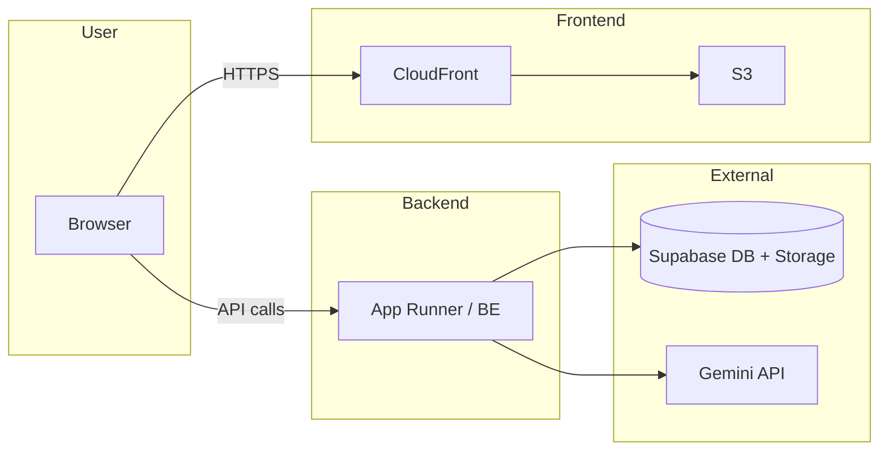
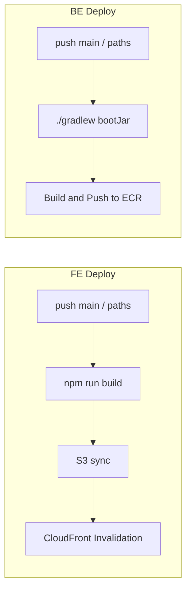
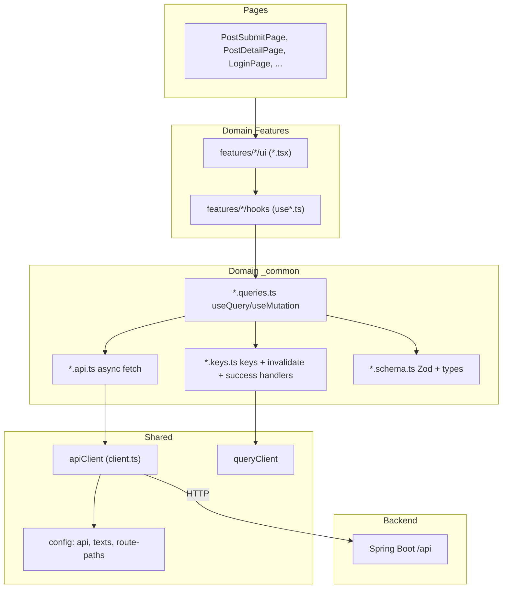
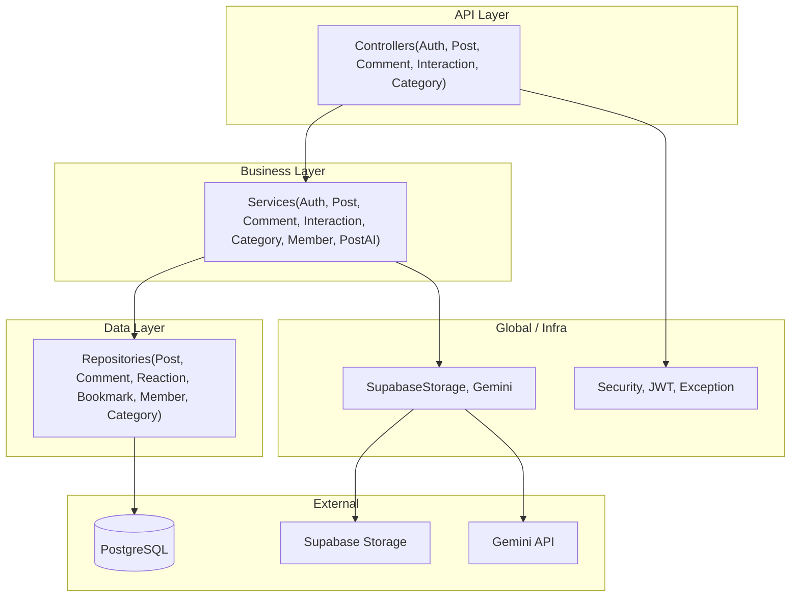

# Link-Sphere 시스템 아키텍처

프로젝트 전반의 시스템 구성, 배포 파이프라인, FE/BE 아키텍처를 Mermaid 다이어그램으로 정리한 문서입니다.
상세 패턴·컨벤션은 [FE-ARCHITECTURE.md](./FE-ARCHITECTURE.md)를 참고하세요.

---

## 1. 시스템 컨텍스트

사용자, 프론트엔드, 백엔드, 외부 서비스 간의 관계입니다.

### 환경별 동작

| 환경     | 프론트엔드                                                                | 백엔드 연동                                                             |
| -------- | ------------------------------------------------------------------------- | ----------------------------------------------------------------------- |
| **운영** | CloudFront → S3 정적 배포. 브라우저가 `VITE_API_BASE_URL`로 API 직접 호출 | BE는 context-path `/api`, 포트 51119. App Runner 등에서 ECR 이미지 실행 |
| **개발** | Vite dev server (포트 31119). `/api` 요청을 proxy로 BE로 전달             | BE 로컬 (포트 51119). Supabase(DB·Storage), Gemini API 연동             |

개발 시: Browser → Vite(31119) → proxy `/api` → BE(51119) → Supabase / Gemini.

---

## 2. 배포 파이프라인

CI/CD는 GitHub Actions로 FE·BE 각각 별도 워크플로우입니다.

### FE 배포 (Frontend Deploy)

| 항목        | 내용                                                                                                                                                                                               |
| ----------- | -------------------------------------------------------------------------------------------------------------------------------------------------------------------------------------------------- |
| **파일**    | `.github/workflows/deploy.yml` (FE 저장소)                                                                                                                                                         |
| **트리거**  | `push` to `main`, paths: `src/**`, `public/**`, `package.json`, `package-lock.json`, `pnpm-lock.yaml`, `vite.config.ts`, `tailwind.config.ts`, `postcss.config.js`, `index.html`, `tsconfig*.json` |
| **단계**    | Checkout → Set up Node 20 → `npm install` → `npm run build` (env: `VITE_API_BASE_URL`) → Configure AWS → `aws s3 sync dist/` → CloudFront invalidation                                             |
| **Secrets** | `VITE_API_BASE_URL`, `AWS_ACCESS_KEY_ID`, `AWS_SECRET_ACCESS_KEY`, `S3_BUCKET_NAME`, `CLOUDFRONT_DISTRIBUTION_ID`                                                                                  |
| **리전**    | ap-northeast-1                                                                                                                                                                                     |

### BE 배포 (Deploy to App Runner)

| 항목        | 내용                                                                                                    |
| ----------- | ------------------------------------------------------------------------------------------------------- |
| **파일**    | `.github/workflows/deploy.yml` (BE 저장소)                                                              |
| **트리거**  | `push` to `main`, paths: `src/**`, `build.gradle.kts`, `settings.gradle.kts`, `gradle/**`, `Dockerfile` |
| **단계**    | Checkout → Set up JDK 17 → `./gradlew bootJar` → Configure AWS → Login to ECR → Docker build & push     |
| **Secrets** | `AWS_ACCESS_KEY_ID`, `AWS_SECRET_ACCESS_KEY`                                                            |
| **ECR**     | 리포지토리 `link-sphere/link-sphere-be`, 리전 ap-northeast-1                                            |

---

## 3. FE 아키텍처

프론트엔드 레이어 구조와 API 호출 흐름입니다.

### 3-Layer API 패턴

| 레이어 | 파일           | 역할                                                       |
| ------ | -------------- | ---------------------------------------------------------- |
| 1      | `*.api.ts`     | 순수 async 함수만. React 의존 없음. `apiClient` 사용       |
| 2      | `*.keys.ts`    | 쿼리 키, invalidation 헬퍼, success 시 invalidation 핸들러 |
| 3      | `*.queries.ts` | `useQuery` / `useMutation` 래퍼. keys·api·schema 참조      |

Feature 훅은 `*.queries.ts`의 훅을 사용하고, UI는 Feature 훅만 호출합니다.

### FE 스택 요약

| 항목         | 기술                                          |
| ------------ | --------------------------------------------- |
| Framework    | React 18, TypeScript, Vite 6                  |
| Server State | TanStack Query 5                              |
| Client State | Zustand 5                                     |
| Form         | React Hook Form 7, Zod 3                      |
| UI           | Shadcn/ui (Radix), TailwindCSS 4, CVA         |
| 기타         | Sonner, Supabase client, dayjs, framer-motion |

---

## 4. BE 아키텍처

백엔드 도메인 구조와 외부 연동입니다.

### BE 도메인·패키지

| 도메인      | Controller            | Service                    | 비고                        |
| ----------- | --------------------- | -------------------------- | --------------------------- |
| auth        | AuthController        | AuthService                | JWT, 로그인/회원가입        |
| post        | PostController        | PostService, PostAIService | UrlMetadataExtractor, Jsoup |
| comment     | CommentController     | CommentService             |                             |
| interaction | InteractionController | InteractionService         | 좋아요, 북마크              |
| category    | CategoryController    | CategoryService            |                             |
| member      | —                     | MemberService              | Repository만 사용           |

### BE 스택·설정 요약

| 항목     | 기술                                         |
| -------- | -------------------------------------------- |
| Runtime  | Kotlin 2.1, Java 17, Spring Boot 3.5.8       |
| Web      | spring-boot-starter-web, Tomcat (war)        |
| Data     | JPA, Hibernate, PostgreSQL (Supabase pooler) |
| Security | Spring Security, OAuth2 Client, JWT (jjwt)   |
| API 문서 | SpringDoc OpenAPI 2.7.0                      |
| 기타     | Jsoup, Actuator (health), SSE                |

| 설정         | 값                                 |
| ------------ | ---------------------------------- |
| 서버 포트    | 51119                              |
| context-path | `/api` (Dockerfile)                |
| DDL          | none (마이그레이션 별도)           |
| CORS         | localhost:31119, CloudFront 도메인 |

---

## 관련 문서

- [FE-ARCHITECTURE.md](./FE-ARCHITECTURE.md) — FE 패턴, 3-Layer API, 네이밍, 체크리스트
- FE 배포: [.github/workflows/deploy.yml](../.github/workflows/deploy.yml)
- BE 배포: link-sphere_BE_NEW `.github/workflows/deploy.yml`
