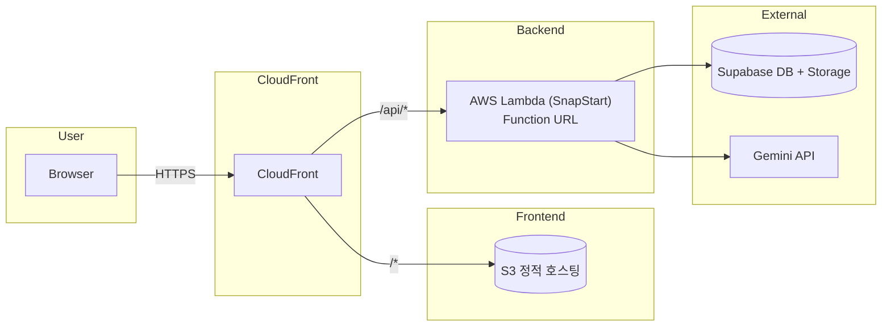
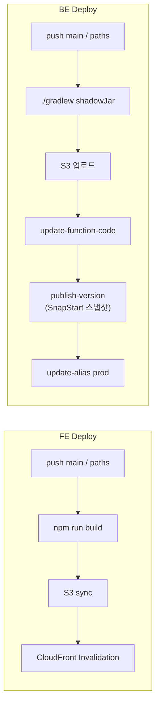
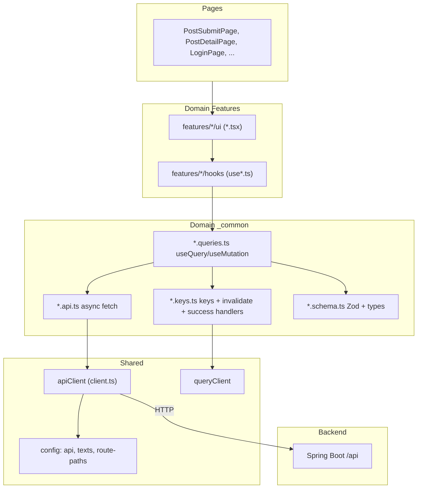
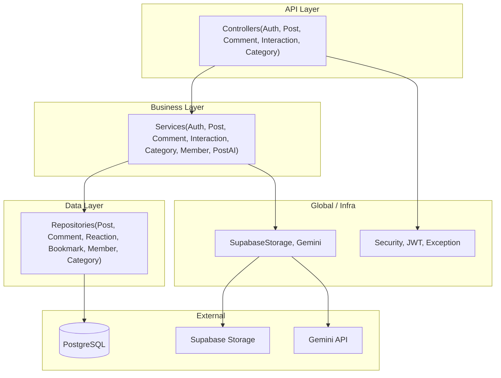

# Link-Sphere 시스템 아키텍처

프로젝트 전반의 시스템 구성, 배포 파이프라인, FE/BE 아키텍처를 Mermaid 다이어그램으로 정리한 문서입니다.
상세 패턴·컨벤션은 [FE-ARCHITECTURE.md](./FE-ARCHITECTURE.md)를 참고하세요.

---

## 1. 시스템 컨텍스트

사용자, 프론트엔드, 백엔드, 외부 서비스 간의 관계입니다.


```mermaid
flowchart LR
  subgraph user [User]
    Browser[Browser]
  end
  subgraph edge [CloudFront]
    CF[CloudFront]
  end
  subgraph fe [Frontend]
    S3[(S3 정적 호스팅)]
  end
  subgraph be [Backend]
    Lambda["AWS Lambda (SnapStart)<br/>Function URL"]
  end
  subgraph external [External]
    Supabase[(Supabase DB + Storage)]
    Gemini[Gemini API]
  end
  Browser -->|HTTPS| CF
  CF -->|"/*"| S3
  CF -->|"/api/*"| Lambda
  Lambda --> Supabase
  Lambda --> Gemini
```

FE·BE가 **같은 오리진(CloudFront)** 을 쓴다. 브라우저는 BE를 직접 호출하지 않고
CloudFront가 경로로 분기한다(`/api/*` → Lambda, 그 외 → S3). 그래서 운영에서 CORS 문제가 없다.

### `infra/` — AWS 인프라 직접 배포 코드

저장소 루트의 `infra/`는 Vite 빌드에 포함되지 않고 **AWS 리소스에 직접 배포되는 코드**를 모아두는
디렉토리다. `src/`(앱 코드)와 달리 브라우저에서 실행되지 않고, GitHub Actions `deploy.yml`도
이 디렉토리를 배포 대상으로 보지 않는다(트리거 경로에 없음) — 여기 있는 것들은 AWS CLI로
수동 배포·관리된다. 현재는 아래 CloudFront Function 하나만 있다.

```
infra/
└── cloudfront-functions/
    └── spa-fallback.js   # CloudFront Function 소스 (아래 참고)
```

#### SPA 라우팅 폴백 (CloudFront Function)

`/post/abc123`처럼 실제 S3 오브젝트가 아닌 클라이언트 라우트를 새로고침/직접 진입해도 되도록,
**기본(S3) 비헤이비어의 viewer-request에만** CloudFront Function(`link-sphere-spa-fallback`)을
연결해 확장자 없는 요청을 `/index.html`로 리라이트한다. 소스:
[`infra/cloudfront-functions/spa-fallback.js`](../infra/cloudfront-functions/spa-fallback.js).

과거에는 배포 레벨 `CustomErrorResponses`(403/404 → `/index.html`)로 이 역할을 했는데, 이 설정은
오리진 구분 없이 **배포 전체**에 걸려 `/api/*`(Lambda) 오리진에서 온 정상적인 403/404 응답까지
`/index.html`(200)로 가려버리는 버그가 있었다(2026-07-28 발견·수정). CloudFront Function은
비헤이비어 단위로 연결되므로 구조적으로 `/api/*`를 건드릴 수 없다 — **이 Function을 `/api/*`
비헤이비어에 연결하거나 `CustomErrorResponses`에 403/404 항목을 다시 추가하지 말 것.**
배포는 GitHub Actions가 아닌 AWS CLI로 수동 관리한다(코드 변경 트리거 경로가 아님).

### 환경별 동작

| 환경     | 프론트엔드                                                          | 백엔드 연동                                                                           |
| -------- | ------------------------------------------------------------------- | ------------------------------------------------------------------------------------- |
| **운영** | CloudFront → S3 정적 배포. `VITE_API_BASE_URL`은 `/api` (상대 경로) | CloudFront `/api/*` behavior → Lambda Function URL(`prod` alias). context-path `/api` |
| **개발** | Vite dev server (포트 31119). `/api` 요청을 proxy로 BE로 전달       | BE 로컬 (포트 **8080**). Supabase(DB·Storage), Gemini API 연동                        |

개발 시: Browser → Vite(31119) → proxy `/api` → BE(8080) → Supabase / Gemini.

---

## 2. 배포 파이프라인

CI/CD는 GitHub Actions로 FE·BE 각각 별도 워크플로우입니다.


```mermaid
flowchart LR
  subgraph fe_deploy [FE Deploy]
    FE_Trigger["push main / paths"]
    FE_Build["npm run build"]
    FE_S3["S3 sync"]
    FE_CF["CloudFront Invalidation"]
    FE_Trigger --> FE_Build --> FE_S3 --> FE_CF
  end
  subgraph be_deploy [BE Deploy]
    BE_Trigger["push main / paths"]
    BE_Jar["./gradlew shadowJar"]
    BE_S3["S3 업로드"]
    BE_Code["update-function-code"]
    BE_Ver["publish-version<br/>(SnapStart 스냅샷)"]
    BE_Alias["update-alias prod"]
    BE_Trigger --> BE_Jar --> BE_S3 --> BE_Code --> BE_Ver --> BE_Alias
  end
```

### FE 배포 (Frontend Deploy)

| 항목        | 내용                                                                                                                                                                                               |
| ----------- | -------------------------------------------------------------------------------------------------------------------------------------------------------------------------------------------------- |
| **파일**    | `.github/workflows/deploy.yml` (FE 저장소)                                                                                                                                                         |
| **트리거**  | `push` to `main`, paths: `src/**`, `public/**`, `package.json`, `package-lock.json`, `pnpm-lock.yaml`, `vite.config.ts`, `tailwind.config.ts`, `postcss.config.js`, `index.html`, `tsconfig*.json` |
| **단계**    | Checkout → Set up Node 24 → `npm install` → `pnpm check`(type-check·lint·format) → `npm run build` (env: `VITE_API_BASE_URL`) → Configure AWS → `aws s3 sync dist/` → CloudFront invalidation      |
| **Secrets** | `VITE_API_BASE_URL`, `AWS_ACCESS_KEY_ID`, `AWS_SECRET_ACCESS_KEY`, `S3_BUCKET_NAME`, `CLOUDFRONT_DISTRIBUTION_ID`                                                                                  |
| **리전**    | ap-northeast-1                                                                                                                                                                                     |

### BE 배포 (Deploy to AWS Lambda)

| 항목        | 내용                                                                                                                                                        |
| ----------- | ----------------------------------------------------------------------------------------------------------------------------------------------------------- |
| **파일**    | `.github/workflows/deploy.yml` (BE 저장소)                                                                                                                  |
| **트리거**  | `push` to `main`, paths: `src/**`, `build.gradle.kts`, `settings.gradle.kts`, `gradle/**`, `.github/workflows/deploy.yml`                                   |
| **단계**    | Checkout → JDK 17 → `./gradlew ktlintCheck test shadowJar` → S3 업로드 → `update-function-code` → `publish-version`(SnapStart 스냅샷) → `update-alias prod` |
| **Secrets** | `AWS_ACCESS_KEY_ID`, `AWS_SECRET_ACCESS_KEY`, `FIREBASE_SERVICE_ACCOUNT_JSON`                                                                               |
| **런타임**  | java17 / arm64 / 2048MB / SnapStart `PublishedVersions`, 리전 ap-northeast-1                                                                                |

> **App Runner·ECR 방식은 더 이상 쓰지 않는다.** 컨테이너 이미지 배포는 SnapStart를 쓸 수 없어
> Shadow JAR 직접 배포로 전환했다. 상세는 BE 저장소 `docs/DEPLOY.md` 참고.

---

## 3. FE 아키텍처

프론트엔드 레이어 구조와 API 호출 흐름입니다.


```mermaid
flowchart TB
  subgraph pages [Pages]
    PagesUI[PostSubmitPage, PostDetailPage, LoginPage, ...]
  end
  subgraph features [Domain Features]
    FeatureUI["features/*/ui (*.tsx)"]
    FeatureHooks["features/*/hooks (use*.ts)"]
    FeatureUI --> FeatureHooks
  end
  subgraph common [Domain _common]
    Queries["*.queries.ts useQuery/useMutation"]
    Keys["*.keys.ts keys + invalidate + success handlers"]
    Api["*.api.ts async fetch"]
    Schema["*.schema.ts Zod + types"]
    Queries --> Keys
    Queries --> Api
    Queries --> Schema
  end
  subgraph shared [Shared]
    ApiClient["apiClient (client.ts)"]
    QueryClient["queryClient"]
    Config["config: api, texts, route-paths"]
  end
  subgraph backend [Backend]
    BE["Spring Boot /api"]
  end
  pages --> FeatureUI
  FeatureHooks --> Queries
  Api --> ApiClient
  Keys --> QueryClient
  ApiClient --> Config
  ApiClient -->|HTTP| BE
```

### 3-Layer API 패턴

| 레이어 | 파일           | 역할                                                       |
| ------ | -------------- | ---------------------------------------------------------- |
| 1      | `*.api.ts`     | 순수 async 함수만. React 의존 없음. `apiClient` 사용       |
| 2      | `*.keys.ts`    | 쿼리 키, invalidation 헬퍼, success 시 invalidation 핸들러 |
| 3      | `*.queries.ts` | `useQuery` / `useMutation` 래퍼. keys·api·schema 참조      |

Feature 훅은 `*.queries.ts`의 훅을 사용하고, UI는 Feature 훅만 호출합니다.

### FE 스택 요약

| 항목         | 기술                                          |
| ------------ | --------------------------------------------- |
| Framework    | React 18, TypeScript, Vite 6                  |
| Server State | TanStack Query 5                              |
| Client State | Zustand 5                                     |
| Form         | React Hook Form 7, Zod 3                      |
| UI           | Shadcn/ui (Radix), TailwindCSS 4, CVA         |
| 기타         | Sonner, Supabase client, dayjs, framer-motion |

---

## 4. BE 아키텍처

백엔드 도메인 구조와 외부 연동입니다.


```mermaid
flowchart TB
  subgraph layer1 [API Layer]
    CTRL["Controllers(Auth, Post, Comment, Interaction, Category)"]
  end
  subgraph layer2 [Business Layer]
    SVC["Services(Auth, Post, Comment, Interaction, Category, Member, PostAI)"]
  end
  subgraph layer3 [Data Layer]
    REPO["Repositories(Post, Comment, Reaction, Bookmark, Member, Category)"]
  end
  subgraph infra [Global / Infra]
    SEC["Security, JWT, Exception"]
    EXT["SupabaseStorage, Gemini"]
  end
  subgraph external [External]
    DB[(PostgreSQL)]
    STORAGE[Supabase Storage]
    GEMINI[Gemini API]
  end
  CTRL --> SVC
  SVC --> REPO
  SVC --> EXT
  CTRL --> SEC
  REPO --> DB
  EXT --> STORAGE
  EXT --> GEMINI
```

### BE 도메인·패키지

| 도메인      | Controller            | Service                    | 비고                                                                                                                                |
| ----------- | --------------------- | -------------------------- | ----------------------------------------------------------------------------------------------------------------------------------- |
| auth        | AuthController        | AuthService                | JWT, 로그인/회원가입                                                                                                                |
| post        | PostController        | PostService, PostAIService | UrlMetadataExtractor, Jsoup                                                                                                         |
| comment     | CommentController     | CommentService             |                                                                                                                                     |
| interaction | InteractionController | InteractionService         | 좋아요, 북마크                                                                                                                      |
| category    | CategoryController    | CategoryService            |                                                                                                                                     |
| member      | —                     | MemberService              | Repository만 사용                                                                                                                   |
| feed        | —                     | FeedCrawlService           | 컨트롤러 없음 — EventBridge cron(4일 1회)가 직접 호출. RSS 피드를 봇 계정 명의로 게시글 등록, 상세는 BE 저장소 `docs/DEPLOY.md` 8장 |

### BE 스택·설정 요약

| 항목      | 기술                                                                                                                      |
| --------- | ------------------------------------------------------------------------------------------------------------------------- |
| Runtime   | Kotlin 2.1, Java 17, Spring Boot 3.5.8                                                                                    |
| 실행 형태 | AWS Lambda (Shadow JAR, SnapStart + CRaC). `LambdaHandler`가 MockMvc로 `DispatcherServlet` 직접 호출 — Tomcat 소켓 미사용 |
| Web       | spring-boot-starter-web (서블릿 스택)                                                                                     |
| Data      | JPA, Hibernate, PostgreSQL (Supabase pooler)                                                                              |
| Security  | Spring Security, OAuth2 Client, JWT (jjwt)                                                                                |
| API 문서  | SpringDoc OpenAPI 2.7.0                                                                                                   |
| 기타      | Jsoup, Actuator (health), SSE                                                                                             |

| 설정         | 값                                 |
| ------------ | ---------------------------------- |
| 서버 포트    | 8080 (`application.yml`)           |
| context-path | `/api` (`application.yml`)         |
| DDL          | none (마이그레이션 별도)           |
| CORS         | localhost:31119, CloudFront 도메인 |

---

## 관련 문서

- [FE-ARCHITECTURE.md](./FE-ARCHITECTURE.md) — FE 패턴, 3-Layer API, 네이밍, 체크리스트
- [CI-CHECK-GATE.md](./CI-CHECK-GATE.md) — 위 배포 파이프라인에 걸려 있는 PR·배포 검사 게이트
- FE 배포: [.github/workflows/deploy.yml](../.github/workflows/deploy.yml)
- BE 배포: link-sphere_BE_NEW `.github/workflows/deploy.yml`
