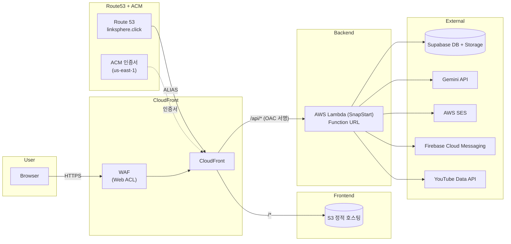
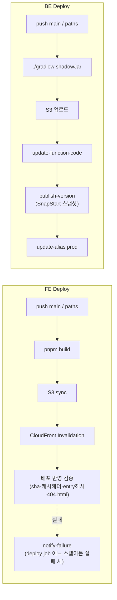
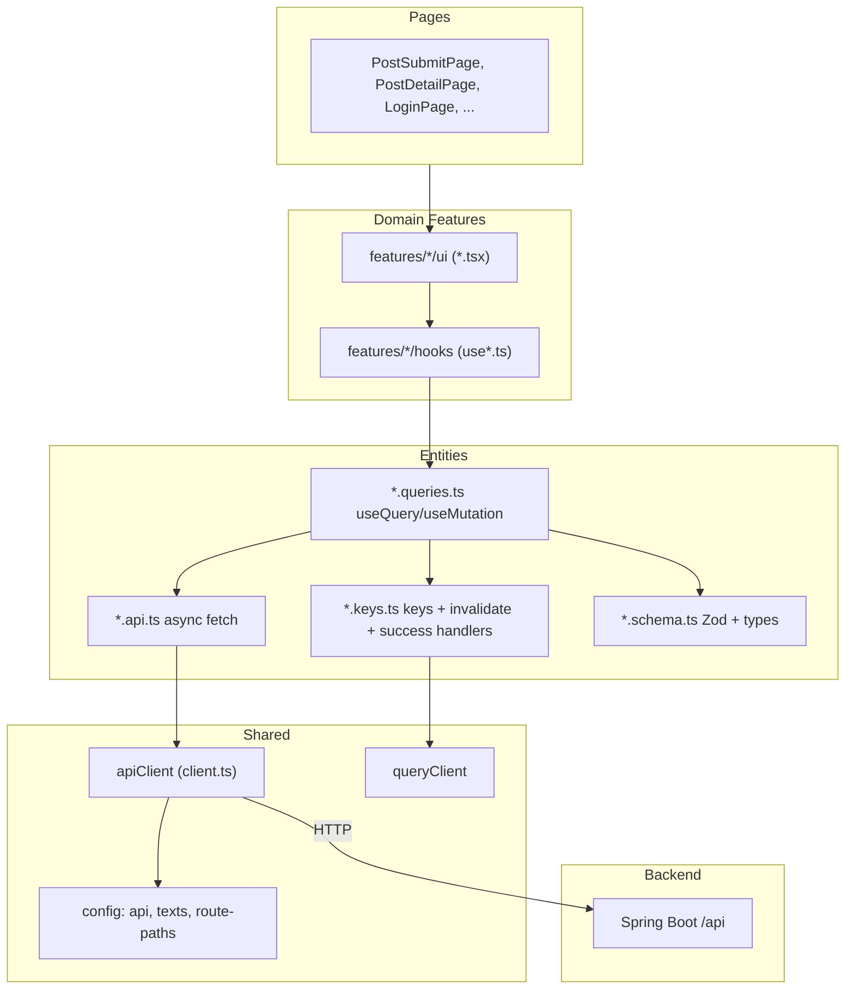
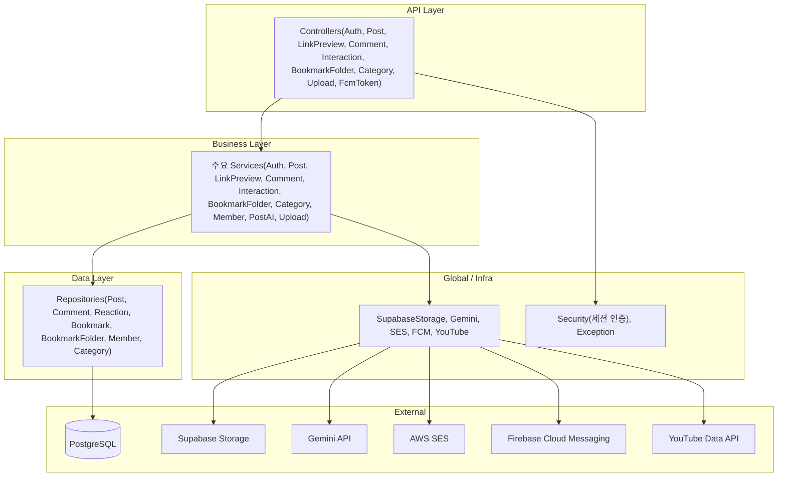

# Link-Sphere 시스템 아키텍처

프로젝트 전반의 시스템 구성, 배포 파이프라인, FE/BE 아키텍처를 Mermaid 다이어그램으로 정리한 문서입니다.
상세 패턴·컨벤션은 [FE-ARCHITECTURE.md](./FE-ARCHITECTURE.md)를 참고하세요.

---

## 1. 시스템 컨텍스트

사용자, 프론트엔드, 백엔드, 외부 서비스 간의 관계입니다.


```mermaid
flowchart LR
  subgraph user [User]
    Browser[Browser]
  end
  subgraph dns [Route53 + ACM]
    R53["Route 53<br/>linksphere.click"]
    ACMCert["ACM 인증서<br/>(us-east-1)"]
  end
  subgraph edge [CloudFront]
    WAF["WAF<br/>(Web ACL)"]
    CF[CloudFront]
  end
  subgraph fe [Frontend]
    S3[(S3 정적 호스팅)]
  end
  subgraph be [Backend]
    Lambda["AWS Lambda (SnapStart)<br/>Function URL"]
  end
  subgraph external [External]
    Supabase[(Supabase DB + Storage)]
    Gemini[Gemini API]
    SES[AWS SES]
    FCM[Firebase Cloud Messaging]
    YouTube[YouTube Data API]
  end
  R53 -->|ALIAS| CF
  ACMCert -.인증서.-> CF
  Browser -->|HTTPS| WAF
  WAF --> CF
  CF -->|"/*"| S3
  CF -->|"/api/* (OAC 서명)"| Lambda
  Lambda --> Supabase
  Lambda --> Gemini
  Lambda --> SES
  Lambda --> FCM
  Lambda --> YouTube
```

FE·BE가 **같은 오리진(CloudFront)** 을 쓴다. 브라우저는 BE를 직접 호출하지 않고
CloudFront가 경로로 분기한다(`/api/*` → Lambda, 그 외 → S3). **다만 같은 오리진이어도
CORS 문제가 완전히 없는 건 아니다** — BE가 `Origin` 헤더를 직접 검사해 허용 목록에
없는 도메인의 요청은 막는다(`app.cors.allowed-origins`). 커스텀 도메인(`linksphere.click`)
연결 직후 이 허용 목록에 새 도메인을 추가하는 걸 빠뜨려 로그인 자체가 막힌 실제 장애가
있었다 — 새 프론트엔드 도메인을 추가할 때마다 BE의 CORS 허용 목록도 함께 갱신해야
한다(`docs/DEPLOY.md`의 "커스텀 도메인" 절, BE `docs/DEPLOY.md`의 `APP_CORS_ALLOWED_ORIGINS`
절 참고).

CloudFront는 오리진 요청에 OAC(Origin Access Control)로 SigV4 서명을 더해(`SigningBehavior:
Always`) Lambda Function URL이 CloudFront를 거치지 않은 직접 요청을 거부하게 한다 — 이
서명이 오리진 요청의 `Authorization` 헤더를 덮어쓰므로, FE는 실제 인증 토큰을
`Authorization` 대신 `X-Access-Token` 커스텀 헤더로 보낸다(`docs/AUTH.md` 참고). WAF(Web
ACL)는 CloudFront 배포 전체(양쪽 비헤이비어 공통)에 붙어 요청을 필터링한다(수동 관리,
`docs/DEPLOY.md`의 "CloudFront WAF" 절 참고).

### `infra/` — AWS 인프라 직접 배포 코드

저장소 루트의 `infra/`는 Vite 빌드에 포함되지 않고 **AWS 리소스에 직접 배포되는 코드**를 모아두는
디렉토리다. `src/`(앱 코드)와 달리 브라우저에서 실행되지 않고, GitHub Actions `deploy.yml`도
이 디렉토리를 배포 대상으로 보지 않는다(트리거 경로에 없음) — 여기 있는 것들은 AWS CLI로
수동 배포·관리된다. 현재는 아래 CloudFront Function 두 개(`spa-fallback.js`·`spa-status.js`)만 있다.

같은 CloudFront 배포에 WAF(Web ACL)도 콘솔 전용으로 붙어 있는데, 이건 소스 코드 자체가
없어(설정값만 있음) 이 디렉토리에 담을 수 없다 — 룰 구성과 재적용 절차는
[`docs/DEPLOY.md`](./DEPLOY.md)의 "CloudFront WAF (수동 관리)" 절 참고.

```
infra/
└── cloudfront-functions/
    ├── spa-fallback.js   # viewer-request: 앱 라우트 → /index.html, 아닌 경로 → /404.html (아래 참고)
    └── spa-status.js     # viewer-response: /404.html 응답의 상태만 404로
```

#### SPA 라우팅 폴백 (CloudFront Function)

`/post/abc123`처럼 실제 S3 오브젝트가 아닌 클라이언트 라우트를 새로고침/직접 진입해도 되도록,
**기본(S3) 비헤이비어의 viewer-request에만** CloudFront Function(`link-sphere-spa-fallback`)을
연결해 확장자 없는 요청 중 앱 라우트는 `/index.html`로, 앱 라우트가 아닌 경로(`/oops`, `/.git/config` 등)는
`/404.html`(배포 때 올리는 index.html 사본)로 리라이트한다. 같은 비헤이비어의 viewer-response에 연결한
`link-sphere-spa-status`가 `/404.html` 응답의 상태만 404로 바꿔, 화면은 앱의 404 페이지 그대로 두고
HTTP 상태는 진짜 404가 된다(2026-10-05, SPA soft 404 해소). 소스:
[`infra/cloudfront-functions/spa-fallback.js`](../infra/cloudfront-functions/spa-fallback.js),
[`infra/cloudfront-functions/spa-status.js`](../infra/cloudfront-functions/spa-status.js). 경로별 응답 전체 표는
[`docs/DEPLOY.md`](./DEPLOY.md)의 "URL별 에러 응답" 절.

과거에는 배포 레벨 `CustomErrorResponses`(403/404 → `/index.html`)로 이 역할을 했는데, 이 설정은
오리진 구분 없이 **배포 전체**에 걸려 `/api/*`(Lambda) 오리진에서 온 정상적인 403/404 응답까지
`/index.html`(200)로 가려버리는 버그가 있었다(2026-07-28 발견·수정). CloudFront Function은
비헤이비어 단위로 연결되므로 구조적으로 `/api/*`를 건드릴 수 없다 — **이 Function을 `/api/*`
비헤이비어에 연결하거나 `CustomErrorResponses`에 403/404 항목을 다시 추가하지 말 것.**
배포는 GitHub Actions가 아닌 AWS CLI로 수동 관리한다(코드 변경 트리거 경로가 아님).

### 환경별 동작

| 환경     | 프론트엔드                                                          | 백엔드 연동                                                                                                                       |
| -------- | ------------------------------------------------------------------- | --------------------------------------------------------------------------------------------------------------------------------- |
| **운영** | CloudFront → S3 정적 배포. `VITE_API_BASE_URL`은 `/api` (상대 경로) | CloudFront `/api/*` behavior → Lambda Function URL(`prod` alias). context-path `/api`                                             |
| **개발** | Vite dev server (포트 31119). `/api` 요청을 proxy로 BE로 전달       | `.env`의 `VITE_API_BASE_URL`: BE 로컬(`http://localhost:8080/api`) 또는 운영 API(`https://linksphere.click/api`, CloudFront 경유) |

개발 시: Browser → Vite(31119) → proxy `/api` → BE(로컬 8080 또는 운영 CloudFront `/api`) → Supabase / Gemini.

---

## 2. 배포 파이프라인

CI/CD는 GitHub Actions로 FE·BE 각각 별도 워크플로우입니다.


```mermaid
flowchart LR
  subgraph fe_deploy [FE Deploy]
    FE_Trigger["push main / paths"]
    FE_Build["pnpm build"]
    FE_S3["S3 sync"]
    FE_CF["CloudFront Invalidation"]
    FE_Verify["배포 반영 검증<br/>(sha·캐시헤더·entry해시·404.html)"]
    FE_Notify["notify-failure<br/>(deploy job 어느 스텝이든 실패 시)"]
    FE_Trigger --> FE_Build --> FE_S3 --> FE_CF --> FE_Verify
    FE_Verify -.실패.-> FE_Notify
  end
  subgraph be_deploy [BE Deploy]
    BE_Trigger["push main / paths"]
    BE_Jar["./gradlew shadowJar"]
    BE_S3["S3 업로드"]
    BE_Code["update-function-code"]
    BE_Ver["publish-version<br/>(SnapStart 스냅샷)"]
    BE_Alias["update-alias prod"]
    BE_Trigger --> BE_Jar --> BE_S3 --> BE_Code --> BE_Ver --> BE_Alias
  end
```

### FE 배포 (Frontend Deploy)

| 항목            | 내용                                                                                                                                                                                                                                                                                                                                                                                                                                                                                                                             |
| --------------- | -------------------------------------------------------------------------------------------------------------------------------------------------------------------------------------------------------------------------------------------------------------------------------------------------------------------------------------------------------------------------------------------------------------------------------------------------------------------------------------------------------------------------------- |
| **파일**        | `.github/workflows/deploy.yml` (FE 저장소)                                                                                                                                                                                                                                                                                                                                                                                                                                                                                       |
| **트리거**      | `push` to `main`, paths: `src/**`, `public/**`, `package.json`, `pnpm-lock.yaml`, `vite.config.ts`, `postcss.config.js`, `index.html`, `tsconfig*.json`, `scripts/inject-csp.js`                                                                                                                                                                                                                                                                                                                                                 |
| **단계**        | Checkout → Set up pnpm → Set up Node(`.nvmrc`) → `pnpm install --frozen-lockfile` → `pnpm check`(type-check·lint·format) → `pnpm test` → `pnpm build`(env: Firebase 6종) → Configure AWS → S3 업로드(index.html·404.html(index.html 사본)·version.json·SW는 무캐시, assets·fonts는 장기 캐시, 나머지는 sync) → CloudFront invalidation → 배포 반영 검증(sha·캐시헤더·entry해시·404.html entry해시, [`BUILD-VERSION.md`](./BUILD-VERSION.md)) → 실패 시 `notify-failure`(deploy job 어느 스텝이든 실패하면 GitHub 이슈 자동 생성) |
| **concurrency** | `deploy-main` 그룹, `cancel-in-progress: false`(연속 push는 대기열 처리 — `aws s3 sync --delete` 도중 취소 시 버킷 파손 방지)                                                                                                                                                                                                                                                                                                                                                                                                    |
| **Secrets**     | `AWS_ACCESS_KEY_ID`, `AWS_SECRET_ACCESS_KEY`, `S3_BUCKET_NAME`, `CLOUDFRONT_DISTRIBUTION_ID`, `VITE_FIREBASE_API_KEY`, `VITE_FIREBASE_AUTH_DOMAIN`, `VITE_FIREBASE_PROJECT_ID`, `VITE_FIREBASE_MESSAGING_SENDER_ID`, `VITE_FIREBASE_APP_ID`, `VITE_FIREBASE_VAPID_KEY`                                                                                                                                                                                                                                                           |
| **리전**        | CLI/배포 워크플로우 리전은 ap-northeast-1. **S3 버킷 자체의 리전은 ap-northeast-2**다(`docs/DEPLOY.md` "커스텀 도메인" 절 — ACM 인증서만 CloudFront 요구사항으로 us-east-1 고정)                                                                                                                                                                                                                                                                                                                                                 |

### BE 배포 (Deploy to AWS Lambda)

| 항목        | 내용                                                                                                                                                        |
| ----------- | ----------------------------------------------------------------------------------------------------------------------------------------------------------- |
| **파일**    | `.github/workflows/deploy.yml` (BE 저장소)                                                                                                                  |
| **트리거**  | `push` to `main`, paths: `src/**`, `build.gradle.kts`, `settings.gradle.kts`, `gradle/**`, `.github/workflows/deploy.yml`                                   |
| **단계**    | Checkout → JDK 17 → `./gradlew ktlintCheck test shadowJar` → S3 업로드 → `update-function-code` → `publish-version`(SnapStart 스냅샷) → `update-alias prod` |
| **Secrets** | `AWS_ACCESS_KEY_ID`, `AWS_SECRET_ACCESS_KEY`, `FIREBASE_SERVICE_ACCOUNT_JSON`                                                                               |
| **런타임**  | java17 / arm64 / 2048MB / SnapStart `PublishedVersions`, 리전 ap-northeast-1                                                                                |

> **App Runner·ECR 방식은 더 이상 쓰지 않는다.** 컨테이너 이미지 배포는 SnapStart를 쓸 수 없어
> Shadow JAR 직접 배포로 전환했다. 상세는 BE 저장소 `docs/DEPLOY.md` 참고.

---

## 3. FE 아키텍처

프론트엔드 레이어 구조와 API 호출 흐름입니다.


```mermaid
flowchart TB
  subgraph pages [Pages]
    PagesUI[PostSubmitPage, PostDetailPage, LoginPage, ...]
  end
  subgraph features [Domain Features]
    FeatureUI["features/*/ui (*.tsx)"]
    FeatureHooks["features/*/hooks (use*.ts)"]
    FeatureUI --> FeatureHooks
  end
  subgraph common [Entities]
    Queries["*.queries.ts useQuery/useMutation"]
    Keys["*.keys.ts keys + invalidate + success handlers"]
    Api["*.api.ts async fetch"]
    Schema["*.schema.ts Zod + types"]
    Queries --> Keys
    Queries --> Api
    Queries --> Schema
  end
  subgraph shared [Shared]
    ApiClient["apiClient (client.ts)"]
    QueryClient["queryClient"]
    Config["config: api, texts, route-paths"]
  end
  subgraph backend [Backend]
    BE["Spring Boot /api"]
  end
  pages --> FeatureUI
  FeatureHooks --> Queries
  Api --> ApiClient
  Keys --> QueryClient
  ApiClient --> Config
  ApiClient -->|HTTP| BE
```

### 3-Layer API 패턴

| 레이어 | 파일           | 역할                                                       |
| ------ | -------------- | ---------------------------------------------------------- |
| 1      | `*.api.ts`     | 순수 async 함수만. React 의존 없음. `apiClient` 사용       |
| 2      | `*.keys.ts`    | 쿼리 키, invalidation 헬퍼, success 시 invalidation 핸들러 |
| 3      | `*.queries.ts` | `useQuery` / `useMutation` 래퍼. keys·api·schema 참조      |

Feature 훅은 `*.queries.ts`의 훅을 사용하고, UI는 Feature 훅만 호출합니다.

### FE 스택 요약

| 항목         | 기술                                                                                |
| ------------ | ----------------------------------------------------------------------------------- |
| Framework    | React 18, TypeScript, Vite 6                                                        |
| Server State | TanStack Query 5                                                                    |
| Client State | Zustand 5                                                                           |
| Form         | React Hook Form 7, Zod 3                                                            |
| UI           | Shadcn/ui (Radix), TailwindCSS 4, CVA                                               |
| 기타         | Sonner, Supabase client, dayjs, firebase(FCM), next-themes, @tanstack/react-virtual |

---

## 4. BE 아키텍처

백엔드 도메인 구조와 외부 연동입니다.


```mermaid
flowchart TB
  subgraph layer1 [API Layer]
    CTRL["Controllers(Auth, Post, LinkPreview, Comment, Interaction, BookmarkFolder, Category, Upload, FcmToken)"]
  end
  subgraph layer2 [Business Layer]
    SVC["주요 Services(Auth, Post, LinkPreview, Comment, Interaction, BookmarkFolder, Category, Member, PostAI, Upload)"]
  end
  subgraph layer3 [Data Layer]
    REPO["Repositories(Post, Comment, Reaction, Bookmark, BookmarkFolder, Member, Category)"]
  end
  subgraph infra [Global / Infra]
    SEC["Security(세션 인증), Exception"]
    EXT["SupabaseStorage, Gemini, SES, FCM, YouTube"]
  end
  subgraph external [External]
    DB[(PostgreSQL)]
    STORAGE[Supabase Storage]
    GEMINI[Gemini API]
    SES_EXT[AWS SES]
    FCM_EXT[Firebase Cloud Messaging]
    YOUTUBE_EXT[YouTube Data API]
  end
  CTRL --> SVC
  SVC --> REPO
  SVC --> EXT
  CTRL --> SEC
  REPO --> DB
  EXT --> STORAGE
  EXT --> GEMINI
  EXT --> SES_EXT
  EXT --> FCM_EXT
  EXT --> YOUTUBE_EXT
```

### BE 도메인·패키지

주요 항목만 담는다 — 서비스·컨트롤러 전체 목록은 BE 저장소 `src/main/kotlin/`이 정본이다.

| 도메인      | Controller               | Service                                 | 비고                                                                                                                                |
| ----------- | ------------------------ | --------------------------------------- | ----------------------------------------------------------------------------------------------------------------------------------- |
| auth        | AuthController           | AuthService                             | 서버 관리 세션(access/refresh), 로그인/회원가입 — JWT는 PR #42로 폐지                                                               |
| post        | PostController           | PostService, PostAiService              | UrlMetadataExtractor, Jsoup, YouTube Data API                                                                                       |
| post        | LinkPreviewController    | PostService, LinkPreviewService         | 등록 전 링크 미리보기(`GET /link-preview`, 로그인 전용). 결과를 10분 캐시해 등록 때 재사용                                          |
| comment     | CommentController        | CommentService                          |                                                                                                                                     |
| interaction | InteractionController    | InteractionService                      | 좋아요, 북마크                                                                                                                      |
| interaction | BookmarkFolderController | BookmarkFolderService                   | 북마크 폴더                                                                                                                         |
| category    | CategoryController       | CategoryService                         |                                                                                                                                     |
| member      | —                        | MemberService                           | Repository만 사용                                                                                                                   |
| upload      | UploadController         | UploadService                           | 이미지 업로드(Supabase Storage)                                                                                                     |
| infra/fcm   | FcmTokenController       | FcmTokenService, FcmNotificationService | FCM 토큰 등록/해제, 댓글·답글 알림 발송. `domain/`이 아니라 `infra/`에 위치                                                         |
| infra/mail  | —                        | MailService                             | AWS SES로 비밀번호 재설정·이메일 인증 메일 발송(BE `docs/DEPLOY.md` §9). 컨트롤러 없음, AuthController에서 호출                     |
| feed        | —                        | FeedCrawlService                        | 컨트롤러 없음 — EventBridge cron(4일 1회)가 직접 호출. RSS 피드를 봇 계정 명의로 게시글 등록, 상세는 BE 저장소 `docs/DEPLOY.md` 8장 |

### BE 스택·설정 요약

| 항목      | 기술                                                                                                                      |
| --------- | ------------------------------------------------------------------------------------------------------------------------- |
| Runtime   | Kotlin 2.1, Java 17, Spring Boot 3.5.8                                                                                    |
| 실행 형태 | AWS Lambda (Shadow JAR, SnapStart + CRaC). `LambdaHandler`가 MockMvc로 `DispatcherServlet` 직접 호출 — Tomcat 소켓 미사용 |
| Web       | spring-boot-starter-web (서블릿 스택)                                                                                     |
| Data      | JPA, Hibernate, PostgreSQL (Supabase pooler)                                                                              |
| Security  | Spring Security, OAuth2 Client, 서버 관리 세션(access/refresh), X-Access-Token 헤더 우선 — JWT(jjwt)는 PR #42로 폐지      |
| API 문서  | SpringDoc OpenAPI 2.7.0                                                                                                   |
| 기타      | Jsoup, Actuator (health)                                                                                                  |

| 설정         | 값                                                                                                                                                                                                                                                                                                      |
| ------------ | ------------------------------------------------------------------------------------------------------------------------------------------------------------------------------------------------------------------------------------------------------------------------------------------------------- |
| 서버 포트    | 8080 (`application.yml`)                                                                                                                                                                                                                                                                                |
| context-path | `/api` (`application.yml`)                                                                                                                                                                                                                                                                              |
| DDL          | none (마이그레이션 별도)                                                                                                                                                                                                                                                                                |
| CORS         | `app.cors.allowed-origins`(`application.yml`)로 관리. `localhost:*`(http·https), CloudFront 기본 도메인, 커스텀 도메인(`linksphere.click`, `www.linksphere.click`) — 새 프론트엔드 도메인을 추가할 때 이 목록 갱신을 빠뜨리면 로그인이 막힌다(BE `docs/DEPLOY.md`의 `APP_CORS_ALLOWED_ORIGINS` 절 참고) |

---

## 관련 문서

- [FE-ARCHITECTURE.md](./FE-ARCHITECTURE.md) — FE 패턴, 3-Layer API, 네이밍, 체크리스트
- [CI-CHECK-GATE.md](./CI-CHECK-GATE.md) — 위 배포 파이프라인에 걸려 있는 PR·배포 검사 게이트
- FE 배포: [.github/workflows/deploy.yml](../.github/workflows/deploy.yml)
- BE 배포: link-sphere_BE_NEW `.github/workflows/deploy.yml`
