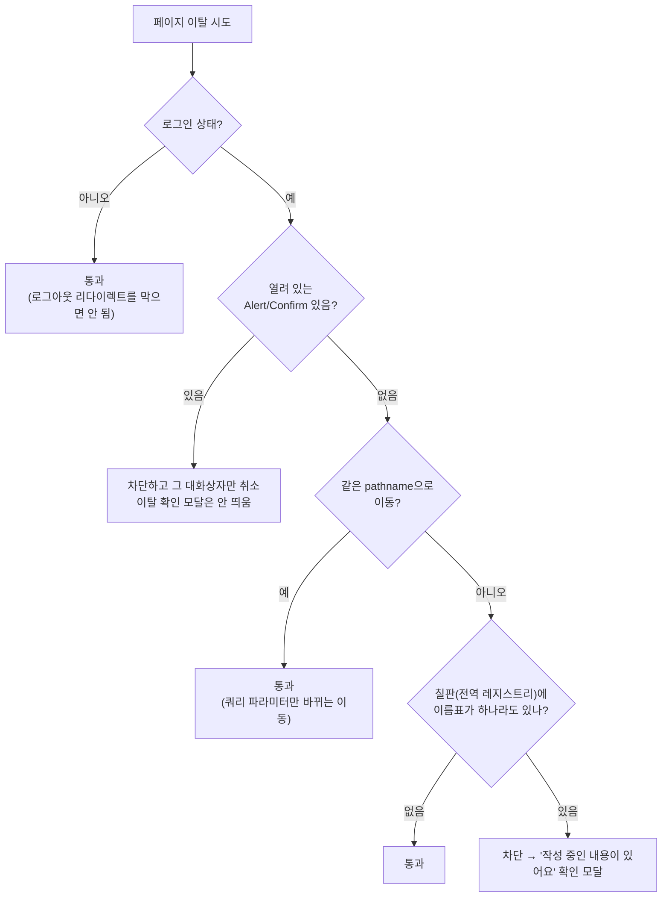

# 폼 이탈 방지 (Unsaved Changes Guard)

> **문서 성격**: 독립 기능 문서(서사형)
>
> **대상 독자**: 이 레포 FE를 처음 보거나 오랜만에 돌아온 개발자.
>
> **읽고 나면**: "dirty"·"전역 레지스트리"가 정확히 무엇을 가리키는지 알고, 새 폼에
> 이 가드를 붙이거나 이탈 판정 조건을 바꿀 수 있다.
>
> **마지막 검토**: 2026-09-04

게시글 등록/수정, 댓글·답글 작성, 댓글 수정 폼에서 저장하지 않은 입력이 있는 상태로
페이지를 벗어나려 하면 한 번 막습니다. 앱 내 이동은 확인 모달, 새로고침·탭 닫기는
브라우저 기본 경고로 처리됩니다.

설계 배경(react-router 단일 blocker 제약, 전역 레지스트리를 택한 이유)은
[DECISIONS.md](./DECISIONS.md)를 참고하세요. 이 문서는 "지금 어떻게 동작하는가"만
다룹니다.

## 1. 쉬운 설명

한 화면에 댓글 폼·답글 폼·수정 폼이 동시에 여러 개 열려 있을 수 있다. 이걸
하나씩 "저장 안 한 입력이 있나요?"라고 따로따로 물어보는 대신, **칠판에
이름표를 붙이는 방식**을 쓴다 — 입력 중인 폼은 각자 자기 이름표(**"dirty
키"**)를 칠판(**"전역 레지스트리"**, Zustand 스토어)에 붙이고, 입력을
지우거나 제출하면 이름표를 뗀다. 페이지를 나가려 할 때는 이 칠판을 한 번만
보면 된다 — **이름표가 하나라도 붙어 있으면** 어느 폼인지 몰라도 무조건
막는다.



## 2. 전제 지식

React Router의 `useBlocker`(단일 라우트 blocker만 등록 가능하다는 제약)와
Zustand 기본 개념은 안다고 가정한다.

가정하지 않는 것:

- **왜** 전역 레지스트리 방식을 택했는지(react-router가 blocker를 여러 개
  동시에 등록하지 못하는 제약과 그 대안 비교) → [DECISIONS.md](./DECISIONS.md).
  이 문서는 "지금 어떻게 동작하는가"만 다룬다
- 처음 나오는 용어(dirty 키, 전역 레지스트리 등) → §12 용어 사전

## 3. 사용한 도구·기술

**기능 자체를 이루는 것**

- **Zustand** — dirty 키를 전역으로 들고 있는 스토어(§6)
- **React Router `useBlocker`** — 앱 내 네비게이션을 가로채는 유일한 지점
- **`beforeunload` 이벤트** — 새로고침·탭 닫기용 브라우저 기본 경고
- **`shared/ui/elements/modal/alert`** — 확인 모달(Alert/Confirm) 공용 컴포넌트

## 4. 왜 만들었나

댓글·게시글 작성 중 실수로 뒤로가기나 다른 메뉴를 눌러 입력을 통째로 잃는
사고를 막기 위해 만들었다. 여러 폼이 동시에 열릴 수 있는 화면 구조상, 폼마다
따로 이탈을 감시하는 대신 하나의 판단 지점으로 모았다(§5).

## 5. 구조

### `shouldBlockNavigation` 판정 순서

§1 순서도가 실제로 `useUnsavedChangesGuard.ts`의 `shouldBlockNavigation`
함수 하나에 그대로 대응한다. 순서가 중요하다:

1. **로그인 상태가 아니면 통과.** 로그아웃·세션 만료 시 `ProtectedRoute`의
   강제 리다이렉트까지 막으면 폼에(또는 열린 대화상자에) 갇힌다.
2. **열려 있는 Alert/Confirm이 있으면 차단하되, 이탈 확인 모달은 띄우지
   않고 그 대화상자만 취소 처리한다.** Alert/Confirm은 브라우저 히스토리에
   묶여 있지 않아 뒤로가기가 그대로 페이지를 이동시켜버린다 — 북마크
   페이지처럼 쿼리 파라미터만 바뀌는 이동도 잡아야 해서 이 검사가
   pathname 비교보다 먼저 온다.
3. **같은 pathname으로의 이동이면 통과.** 쿼리 파라미터만 바뀌는 이동(예:
   북마크 페이지의 폴더 전환)까지 막으면 과도하다.
4. **여기까지 왔으면 dirty 키 존재 여부로 최종 판단.** 하나라도 있으면
   차단하고 "작성 중인 내용이 있어요" 확인 모달을 띄운다.

차단됐을 때의 두 갈래(대화상자 취소 vs. 이탈 확인 모달)는 `useEffect`
안에서 분기한다 — Alert/Confirm 때문에 막힌 경우엔 그 대화상자를
`cancelAlert`로 취소 처리하고 이동 자체는 없었던 일로 되돌리며(`blocker.reset()`),
아니면 이탈 확인 모달을 새로 연다.

### 폼별 dirty 판정 기준

| 폼             | 언제 "작성 중"으로 잡히나                                                                       | 코드 위치             |
| -------------- | ----------------------------------------------------------------------------------------------- | --------------------- |
| 게시글 등록    | URL·제목·관심분야·공개설정 중 하나라도 기본값에서 바뀌면                                        | `useCreatePost.ts`    |
| 게시글 수정    | 위와 동일(원래 게시글 값 대비)                                                                  | `useUpdatePost.ts`    |
| 댓글/답글 작성 | 텍스트를 한 글자라도 쓰거나, 텍스트 없이 스크린샷만 붙여넣어도 잡힘                             | `useCreateComment.ts` |
| 댓글 수정      | 수정 시작 시점 원본과 비교해 텍스트가 다르거나, 새 이미지를 붙였거나, 기존 이미지 개수가 바뀌면 | `useUpdateComment.ts` |

### 이탈 방법별 동작

| 이탈 방법                                         | 동작                                                                            |
| ------------------------------------------------- | ------------------------------------------------------------------------------- |
| 사이드바·탭바·뒤로가기 등 앱 내 이동              | 확인 모달: "작성 중인 내용이 있어요" / 취소="계속 작성" / 확인="나가기"         |
| 새로고침·탭 닫기·주소창 직접 이동                 | 브라우저 기본 이탈 경고(앱 모달 아님)                                           |
| 열려 있는 Alert/Confirm이 있는 상태에서 이동 시도 | 그 대화상자만 취소되고 이동은 없었던 일이 됨(§5의 2번) — 이탈 확인 모달은 안 뜸 |
| 같은 pathname 안에서의 이동(쿼리만 변경)          | 검사 없이 통과(§5의 3번)                                                        |
| 모달에서 "계속 작성" 클릭                         | 이동 취소, 폼 값 그대로 유지                                                    |
| 모달에서 "나가기" 클릭                            | 이동 진행                                                                       |

### 의도적으로 막지 않는 경우

| 상황                                               | 이유                                                                                |
| -------------------------------------------------- | ----------------------------------------------------------------------------------- |
| 등록/수정 정상 제출 성공 후 이동                   | 제출 직후 즉시 dirty 해제(`clearNow`, §6)하고 이동 → 모달 안 뜸                     |
| 로그아웃·세션 만료 상태                            | `ProtectedRoute`의 강제 리다이렉트를 막으면 폼에 갇히므로 아예 검사 안 함(§5의 1번) |
| 답글 폼 "취소", 댓글 수정 "취소" 같은 폼 내부 버튼 | 페이지 이동이 아니라 가드 대상이 아님 → 즉시 닫힘                                   |
| 아무것도 입력 안 한 상태                           | 애초에 dirty가 아니므로 모달 안 뜸                                                  |
| 같은 pathname 안에서의 이동                        | §5의 3번 — 북마크 페이지의 폴더 전환 등                                             |

### 동시에 여러 폼이 열려 있을 때

상세 페이지엔 댓글 폼 + 답글 폼 + 수정 폼이 동시에 여러 개 뜰 수 있다. **이 중
하나라도 작성 중이면 페이지 이탈이 막힌다.** (예: 최상단 댓글은 다 써놓고 다른
댓글의 답글 폼은 비워둔 채 나가려 해도 최상단 초안 때문에 모달이 뜬다 — 전역
레지스트리 방식이라 등록된 키가 전부 비어야 이동이 허용된다.)

## 6. 상태 모델

### `useUnsavedChangesStore`(`src/shared/store/unsavedChanges.store.ts`)

이 기능 전체가 이 스토어 하나다 — §1의 "칠판"이자 §5에서 반복 언급되는
"전역 레지스트리"의 실체.

| 필드/함수        | 타입                    | 역할                                                  |
| ---------------- | ----------------------- | ----------------------------------------------------- |
| `dirtyKeys`      | `Set<string>`           | 지금 "저장 안 한 입력이 있다"고 등록된 폼 키들의 집합 |
| `markDirty(key)` | `(key: string) => void` | 키를 집합에 추가                                      |
| `markClean(key)` | `(key: string) => void` | 키를 집합에서 제거                                    |

모듈 레벨 헬퍼(React 렌더를 구독하지 않는 시점 — 라우터 blocker 판정,
`beforeunload`에서 씀):

- `hasUnsavedChanges(): boolean` — `dirtyKeys.size > 0`
- `clearUnsavedChanges(key: string): void` — 특정 키를 즉시(동기) 해제.
  제출 직후 navigate처럼 effect 클린업을 기다릴 수 없을 때 쓴다

### `useUnsavedChanges(key, isDirty)`(`src/shared/hooks/useUnsavedChanges.ts`)

폼이 자기 dirty 상태를 레지스트리에 등록하는 훅. **"dirty 키"**란 이 훅의
첫 번째 인자로, 폼 인스턴스를 구분하는 문자열이다 — 실제 호출부 4곳의 값:

| 폼             | 키                                                     |
| -------------- | ------------------------------------------------------ |
| 게시글 등록    | `'post-create'`                                        |
| 게시글 수정    | `` `post-update:${postId}` ``                          |
| 댓글/답글 작성 | `` `comment-create:${postId}:${parentId ?? 'root'}` `` |
| 댓글 수정      | `` `comment-update:${comment.id}` ``                   |

```typescript
export function useUnsavedChanges(key: string, isDirty: boolean) {
  // isDirty가 true면 markDirty(key), false면 markClean(key)를 effect로 동기화하고,
  // 언마운트 시에는 항상 markClean(key)(작성 중이던 폼이 사라지면 이름표도 뗀다)
  // ...
  return { clearNow: () => clearUnsavedChanges(key) };
}
```

`clearNow`는 제출 성공 직후처럼 "지금 즉시" 해제해야 할 때 동기 호출한다
(§5 "의도적으로 막지 않는 경우").

## 7. 운영 파라미터

해당 없음 — 이 기능에는 주기·건수·타임아웃 같은 운영 파라미터가 없다.

## 8. 코드 지도와 자주 하는 수정

```
src/
├── shared/
│   ├── store/
│   │   └── unsavedChanges.store.ts       # §6 — dirty 키 레지스트리(Zustand)
│   └── hooks/
│       ├── useUnsavedChanges.ts          # §6 — 폼이 자기 dirty 상태를 등록하는 훅
│       └── useUnsavedChangesGuard.ts     # §5 — RootLayout에서 1회만 도는 전역 가드
├── app/routes/layouts/RootLayout.tsx     # 가드 마운트 지점(앱 전체 1곳)
├── shared/ui/elements/modal/alert/alert.store.ts  # §5의 Alert/Confirm 우선 차단 분기가
│                                                    # 참조하는 getOpenAlertId 출처
├── shared/config/texts.ts                # TEXTS.unsavedChanges.* — 확인 모달 문구
├── features/post/create/hooks/useCreatePost.ts
├── features/post/update/hooks/useUpdatePost.ts
├── features/comment/create/hooks/useCreateComment.ts
└── features/comment/update/hooks/useUpdateComment.ts
```

### 자주 하는 수정

| 하고 싶은 것               | 방법                                                                                                                                                           |
| -------------------------- | -------------------------------------------------------------------------------------------------------------------------------------------------------------- |
| 새 폼에 이 가드를 붙이려면 | 폼 훅 안에서 `const { clearNow } = useUnsavedChanges('폼을-구분할-고유-키', isDirty)` 호출 + 제출 성공 직후 `clearNow()` 호출(§6 표의 키 네이밍 패턴을 따른다) |
| 이탈 확인 모달 문구 변경   | `TEXTS.unsavedChanges.*`(`shared/config/texts.ts`)                                                                                                             |
| 특정 상황을 검사에서 제외  | `useUnsavedChangesGuard.ts`의 `shouldBlockNavigation`에 §5 순서대로 분기 추가(순서가 중요 — 로그인 상태 검사보다 먼저 오면 안 됨)                              |

## 9. 검증 결과

이 문서에 자체 검증 수치는 없다. 관련 동작은 각 폼 훅(`useCreatePost` 등)의
테스트와 `useUnsavedChangesGuard.ts` 자체 로직으로 커버된다 — 별도 통합
테스트 파일이 있는지는 확인하지 않았다.

## 10. 시행착오

이 문서에 별도로 기록된 삽질 사례는 없다. 여러 blocker를 동시에 못 쓰는
react-router 제약과 그로 인한 설계 트레이드오프는 시행착오가 아니라 처음부터
알려진 제약이었다 — [DECISIONS.md](./DECISIONS.md) 참고.

## 11. 남은 것

현재 알려진 미해결 이슈 없음.

## 12. 용어 사전

- **dirty(키)** — "저장하지 않은 입력이 있다"는 상태 그 자체, 또는 그
  상태를 표시하려고 폼이 레지스트리에 등록하는 문자열 키. 이 문서 전체에서
  가장 많이 쓰이지만 지금까지 정의되지 않았던 용어 — §6 표가 실제 키 값이다
- **전역 레지스트리** — `useUnsavedChangesStore`(§6)를 가리키는 표현. 폼마다
  따로 감시하지 않고 모든 폼의 dirty 여부를 한 곳에 모아두는 방식이라
  "전역"이라 부른다
- **`clearNow`** — `useUnsavedChanges`가 반환하는 함수. 특정 키를
  effect 클린업을 기다리지 않고 즉시 해제한다(§6)
- **`ProtectedRoute`** — 인증이 필요한 라우트를 감싸 비로그인 접근을
  리다이렉트하는 컴포넌트. §5의 "로그인 상태가 아니면 통과" 분기가 이
  리다이렉트를 막지 않기 위한 것이다
