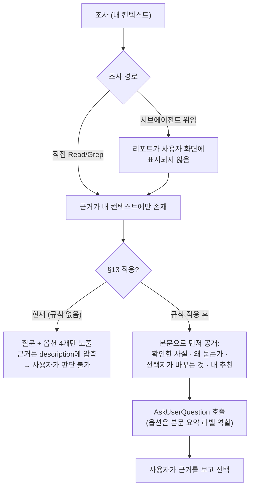

# 질문 전에 판단 재료를 먼저 주는 규칙 문서화 (CLAUDE.md §13 / BE §9)

## Context

사용자 지적: **"질문하기 전에 그 질문이 도출된 과정과 조사한 내용을 공유해야 판단할 수
있다. 선택지만 주면 답을 못한다."** 이 문제가 재발하지 않도록 문서화하는 것이 이번 작업이다.

실제로 일어나고 있는 일을 먼저 실측했다(측정 방법: `~/.claude/projects/-Users-baechan-project-link-sphere-link-sphere-FE-NEW/*.jsonl`
중 최근 8개 세션을 파싱, 스크립트는 이 세션 스크래치패드의 `scan.py`·`lens.py`):

| 측정 항목                                 | 결과                                                  |
| ----------------------------------------- | ----------------------------------------------------- |
| `AskUserQuestion` 호출 수 (최근 8개 세션) | 18건                                                  |
| 질문 직전 assistant 본문 설명 길이        | 중앙값 459자, **18건 중 7건이 300자 미만**, 1건은 0자 |
| 옵션 `description` 길이 (97개)            | 중앙값 120자, **29개(30%)가 150자 초과**, 최대 283자  |
| 옵션 `label` 길이                         | 최대 39자 (도구 스펙 권장은 1~5단어)                  |

해석: 근거가 본문이 아니라 **옵션 카드 안으로 들어가 있었다**. 예) `shared/` 152개 파일
재구조화를 물은 질문(09-09 05:04, 세션 `5d30326a`)은 본문 설명이 123자였고 "config 133·ui
109·lib 79 파일이 참조" 같은 조사 결과는 전부 옵션 `description` 안에 압축돼 있었다.

구조적 원인 두 가지:

1. `AskUserQuestion`은 애초에 판단 재료를 담는 자리가 아니다 — label 1~5단어, 옵션 최대 4개.
2. **서브에이전트(Explore/Plan) 리포트는 사용자 화면에 표시되지 않는다** — 하네스가 모델에게만
   준다. 조사를 위임할수록 사용자가 보는 근거는 0에 수렴한다. Plan 모드가 정확히 그 경로다.

기존 규칙과의 관계: §7("사용자가 체감하는 트레이드오프는 승인을 받는다")은 *묻지 않고
결정하지 마라*까지만 다루고, **어떻게 물어야 하는지는 비어 있다.** 이번 규칙이 그 빈칸이다.



## 사용자와 확정한 사항 (AskUserQuestion, 이번 세션)

| 질문         | 확정                                                                  |
| ------------ | --------------------------------------------------------------------- |
| 규칙 위치    | **§13 신설** (§7 안에 항목 추가 / Critical Rules 병기 안 함)          |
| BE 레포 반영 | **FE·BE 둘 다** (BE에는 §9로 신설)                                    |
| 안전망 훅    | **문서만, 훅은 만들지 않음** — matcher 지원이 문서 미확인 + 오탐 위험 |

훅을 만들지 않기로 한 근거(claude-code-guide 조사): `PreToolUse` payload에 `transcript_path`가
포함되고 exit 2가 도구를 차단하는 것은 공식 문서로 확인되지만, **`AskUserQuestion`이 훅
matcher로 걸리는지는 문서에 없다**(내장 도구 목록에 이름이 없음). 게다가 §12 훅과 달리
"150줄 이상 계획 파일" 같은 객관적 기준이 없어 글자수 휴리스틱은 정당한 짧은 질문("병합할까요?")을
오탐한다.

## 변경 대상

### 1. `/Users/baechan/project/link-sphere/link-sphere_FE_NEW/.claude/CLAUDE.md`

§12 본문 끝(266줄 "기준: ...") 다음, 268줄 `---` **앞**에 §13을 삽입한다. 형식은 §9·§12와
동일하게 〈제목 → 굵은 요지 한 줄 → 설명 문단 → bullet → "기준:" 문장〉을 따른다.

넣을 본문(초안 확정본):

```markdown
## 13. 질문하기 전에 판단 재료를 먼저 준다

**선택지만 내밀지 않는다. 그 질문이 나오게 된 조사 결과를 본문으로 먼저 공유한다.**

§7이 "묻지 않고 혼자 결정하지 마라"라면, 이 절은 "물을 때 무엇을 함께 줘야 하는가"다.
`AskUserQuestion`의 옵션 카드는 판단 재료를 담는 자리가 아니다 — label은 1~5단어이고
옵션은 최대 4개다. 근거를 카드에 우겨넣으면 사용자는 선택지를 고를 이유를 스스로
재구성할 수 없다(2026-09-09 직접 측정: 최근 8개 세션의 질문 18건 중 7건이 직전 본문
설명 300자 미만, 옵션 설명 97개 중 30%가 150자 초과·최대 283자 — 근거가 본문 대신
카드 안에 들어가 있었다. 측정 방법과 상세는 `docs/DECISIONS.md` 2026-09-09 항목).

조사를 서브에이전트(Explore·Plan 등)에 위임했을 때 특히 위험하다 — **그 리포트는
사용자 화면에 표시되지 않고 나에게만 온다.** 내가 옮겨적지 않으면 사용자가 보는
근거는 0이 된다. Plan 모드가 정확히 이 경로다.

질문을 던지기 전에 본문 텍스트로 아래를 먼저 낸다:

- **확인한 사실** — `파일:줄`, 실측 수치, 인용 출처를 그대로(§10을 적용한다). 조사해서
  새로 알게 된 것과 원래 알고 있던 것을 구분한다.
- **그래서 왜 묻는가** — 내가 혼자 정하지 못하는 지점이 정확히 무엇인지, 답이 갈리면
  무엇이 달라지는지.
- **각 선택지가 실제로 바꾸는 것** — 영향 범위와 되돌리기 비용까지.
- **내 추천과 그 이유** — 추천 없이 선택지만 나열하지 않는다.

그 뒤에 `AskUserQuestion`을 호출한다. 옵션의 `description`은 본문에서 이미 설명한 것을
가리키는 한 줄 요약이지, 근거를 처음 밝히는 자리가 아니다.

대화에 이미 재료가 다 나와 있는 단순 확인("PR을 병합할까요?")에는 적용하지 않는다 —
새로 조사한 사실 위에서 나온 질문에만 적용한다.

기준: 사용자가 옵션 카드를 열어보지 않고 본문만 읽고도 각 선택지를 고를 이유를 스스로
말할 수 있는가? 카드를 봐야만 근거를 알 수 있다면 순서가 뒤집힌 것이다.
```

### 2. `/Users/baechan/project/link-sphere/link-sphere_BE_NEW/.claude/CLAUDE.md`

BE는 §8까지 있으므로 §8 본문 끝 다음에 **§9**로 같은 규칙을 넣는다(BE는 §1~§7이 FE와 동일
문구를 공유하고 §8부터 갈라진다). FE 문구를 그대로 쓰되 아래만 조정:

- 절 번호 `## 9.`
- **`§10을 적용한다` 문구 삭제** — BE에는 §10(외부 인용 원본 남기기)이 없다.
- **`docs/DECISIONS.md` 링크 삭제** — BE 레포에는 이 파일이 없다(`ls docs/`로 확인함).
  대신 "측정은 2026-09-09 FE 세션에서 했고 상세는 FE 레포 `docs/DECISIONS.md`에 있다"로 적는다.

### 3. `/Users/baechan/project/link-sphere/link-sphere_FE_NEW/docs/DECISIONS.md`

9줄(`## 2026-09-09 — entities/user를...`) **앞**에 새 항목을 최신순으로 삽입한다. 기존 항목의
〈배경 / 검증한 사실 / 결정 / 상태〉 형식을 따른다. 담을 내용:

- **배경** — 사용자 지적 원문 요지, 그리고 §7이 "어떻게 묻는가"를 비워둔 채였다는 진단.
- **검증한 사실** — 위 실측 표(18건 / 300자 미만 7건 / description 30%가 150자 초과 / 최대
  283자)와 **측정 방법**(어느 경로의 JSONL을 어떻게 파싱했는지)을 남긴다. §10이 요구하는
  "직접 측정임을 밝히고 재현 절차를 남긴다"에 해당한다. 서브에이전트 리포트가 사용자에게
  표시되지 않는다는 사실도 여기 기록한다.
- **결정** — §13 신설, BE §9 동시 반영, 훅은 만들지 않음(matcher 미확인 + 오탐 위험).
- **상태** — 적용 완료. CLAUDE.md는 세션 시작 시 스냅샷되므로 이 커밋 이후 시작된 세션부터
  자동 적용된다(§12가 같은 성질을 이미 기록해 둠).

### 4. 세션 메모리 (레포 밖 보완재)

`~/.claude/projects/-Users-baechan-project-link-sphere-link-sphere-FE-NEW/memory/`에 `feedback`
타입 메모리 1건을 추가하고 `MEMORY.md`에 한 줄 등록한다. CLAUDE.md는 **세션 시작 시
스냅샷**되므로 이미 실행 중인 세션에는 §13이 적용되지 않는다(§12가 같은 문제를 기록해 둠).
메모리는 그 구멍을 메우는 보완재다 — 다만 §12 DECISIONS 기록이 지적한 대로 **메모리만으로는
안 되고 공용 문서(CLAUDE.md)가 정본**이며, 메모리 본문에서 그 절을 가리킨다.

### 손대지 않는 것

- `CHANGELOG.md` — 사용자 영향 없는 문서 변경은 기록하지 않는다(레포 규칙). 선례: #53 커밋은
  `.claude/CLAUDE.md` 단독으로 갔다.
- `.claude/settings.json`·`.claude/hooks/` — 훅을 만들지 않기로 확정했으므로 무변경.
- `README.md` 문서 목록 — 새 문서 파일을 만들지 않으므로 무변경.

## 작업 절차

1. `EnterWorktree`로 워크트리 생성 → `cp ../../../.env .` + `pnpm install`
   (시작 전 `git log origin/main..main`으로 미푸시 커밋 확인, `git worktree list`로 잔존 워크트리 정리)
2. FE `.claude/CLAUDE.md` §13 삽입 → verify: `pnpm check:docs` 통과
3. BE `.claude/CLAUDE.md` §9 삽입 (BE 레포는 별도 경로 — FE 워크트리 밖이므로 BE 레포에서 직접
   수정하고 별도 커밋/PR로 처리) → verify: BE 레포 문서 검사 스크립트가 있으면 실행
4. FE `docs/DECISIONS.md` 항목 추가 → verify: `pnpm format:check`
5. 계획 스냅샷을 `docs/plans/2026-09-09-ask-before-asking.md`로 복사해 같은 PR에 커밋(§11)
6. `git commit -- <경로...>`로 대상 파일만 지정해 커밋(`git add` 금지). 커밋 메시지는
   `.gitmessage` 형식 확인 후 `docs(claude): ...`
7. PR 생성 → fresh Explore subagent에게 계획 파일과 diff를 대조시켜 PR 본문에
   `## 계획 대비 구현` 섹션 작성(§11)

## 검증

| 대상                  | 방법                                                                                          |
| --------------------- | --------------------------------------------------------------------------------------------- |
| 문서 경로·줄 번호     | `pnpm check:docs` (CLAUDE.md가 가리키는 경로 검사)                                            |
| 마크다운 포맷         | `pnpm format:check` — `pnpm lint` 통과가 format 통과를 보장하지 않는다(레포 규칙)             |
| 규칙 자체의 동작 확인 | 이번 세션에서 이미 시연됨 — 이 계획에 이르기까지 조사 결과를 본문으로 먼저 공유한 뒤 질문했다 |
| 계획 대비 구현        | fresh Explore subagent가 계획 파일 vs diff 대조 → PR 본문에 항목별 정리(§11)                  |

타입체크·테스트는 소스 변경이 없어 해당 없음(문서만 수정).
