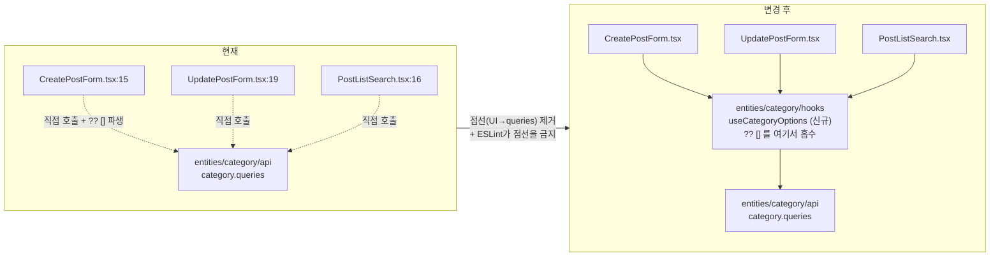

# UI에서 직접 부르던 카테고리 옵션 쿼리를 entity 공용 훅으로 모으기

## Context

`CreatePostForm.tsx:15`가 `useFetchCategoryOptionQuery()`를 UI 컴포넌트에서 직접 호출하고 있다는
지적에서 출발했다. 조사 결과 이건 개별 실수가 아니라 **같은 슬라이스 안의 불일치**였다 —
`features/post/create/` 안에서 북마크 폴더 필드는 조회를 훅(`usePostCreateBookmarkFolderField.ts:30`)이
소유하는데 카테고리만 UI가 소유한다. 둘 다 "옵션 목록 조회 + 빈 배열 fallback"으로 성격이 같다.

`docs/FE-ARCHITECTURE.md:414`(§6)는 *"feature hook = 모든 비즈니스 로직. UI 파일은 훅을 호출하고
JSX만 렌더링"*을 예외 없이 규정한다. §8:488의 완화 조항(_"query 1개 + trivial 파생이면 컴포넌트에서
직접 사용"_)은 주어가 "widget hook"이라 **widgets 한정**이다.

그런데 이 규칙을 강제하는 수단이 없다. `custom-query-rules/no-direct-query-import`는
`@tanstack/react-query` **직접 import만** 막아서, entity가 감싼 `*.queries` 훅 호출은 문서 규칙으로만
남아 있었고 그 사이 5건이 쌓였다. `dayjs` 규칙이 같은 이유로 5개월간 위반이 안 잡혀 ESLint로
승격된 선례가 있다.

**목표**: features 2건의 위반을 없애고, 같은 쿼리를 쓰는 세 호출부를 entity 공용 훅으로 모은 뒤,
features 범위를 ESLint로 잠가 같은 패턴이 다시 들어오지 못하게 한다.

### 확정된 결정 (사용자 승인)

| 항목 | 결정                                                                              |
| ---- | --------------------------------------------------------------------------------- |
| 범위 | ①CreatePostForm ②UpdatePostForm ③PostListSearch — CommentList(④)는 제외           |
| 배치 | `entities/category/hooks/useCategoryOptions.ts` 신설 (기존 feature 훅 흡수 안 함) |
| 린트 | features 한정 커스텀 룰 승격                                                      |

---

## 무엇을 바꾸나



---

## 작업 단계

### 0. 워크트리 준비

```bash
git log origin/main..main    # 미푸시 커밋 확인 (있으면 EnterWorktree 기준 재검토)
git worktree list            # 오래된 워크트리 정리 여부 확인
# EnterWorktree 후:
cp ../../../.env .
pnpm install
```

### 1. `src/entities/category/hooks/useCategoryOptions.ts` 신설

선례를 그대로 따른다: `src/entities/account/hooks/useAccount.ts:7` (쿼리를 감싼 entity 훅),
`src/entities/bookmark/folder/hooks/useBookmarkFolderSelect.ts` (두 슬라이스가 공유하는 entity 훅).

```ts
import { useFetchCategoryOptionQuery } from '@/entities/category/api/category.queries';

/**
 * 카테고리 옵션 목록 — 등록·수정 폼의 관심 분야 체크박스와 목록 검색 카드의 @카테고리 칩이
 * 같은 쿼리(categoryKeys.categoryOption)를 공유한다. 로딩·에러 중에는 빈 목록으로 떨어뜨려
 * 호출부마다 `?? []`를 반복하지 않게 한다.
 */
export function useCategoryOptions() {
  const { data } = useFetchCategoryOptionQuery();

  return {
    categoryOptionList: data ?? [],
  };
}
```

- 반환 타입은 `{ categoryOptionList: SelectOptionType[] }`
- **`isLoading`은 넣지 않는다** — 세 호출부 중 아무도 안 쓴다 (CLAUDE.md §2)
- **`enabled`·`select`·`staleTime`을 새로 손대지 않는다** — 감싸기만 한다 (아래 위험 B)

→ verify: `pnpm type-check`

### 2. 호출부 3곳 교체 (각 import 1줄 + 호출 1줄 + 사용부 1줄)

| 파일                                               | 줄           | 변경                                                                                                                 |
| -------------------------------------------------- | ------------ | -------------------------------------------------------------------------------------------------------------------- |
| `src/features/post/create/ui/CreatePostForm.tsx`   | 9 / 15 / 52  | import 교체 / `const { categoryOptionList } = useCategoryOptions();` / `options={categoryOptionList}` (`?? []` 제거) |
| `src/features/post/update/ui/UpdatePostForm.tsx`   | 7 / 19 / 61  | 동일                                                                                                                 |
| `src/widgets/post/post-list/ui/PostListSearch.tsx` | 1 / 16 / 105 | 동일 + `categories?.map` → `categoryOptionList.map` (`?.` 제거)                                                      |

→ verify: `pnpm type-check && pnpm test`

### 3. `eslint.config.js` — 커스텀 룰 추가

**`no-restricted-imports`로 구현하지 않는다.** `:1071-1093`(features)·`:1097-1116`(widgets)이 이미 그 rule
key로 FSD 레이어 경계를 강제하는데, flat config는 같은 key가 겹치면 배열 병합이 아니라 **통째로
덮어쓰기** 때문에 그 파일들의 레이어 규칙이 조용히 사라진다. 이 레포가 이미 두 번 당한 함정이고
`:820-834`에 주석으로 남아 있다.

**3-1.** `customQueryRulesPlugin.rules`(`:73` 부근)에 고유 key로 룰 추가:
`no-entity-query-import-outside-hooks` — `source.endsWith('.queries')`인 import를 보고, 타입 전용
import는 통과시킨다(`no-direct-query-import`와 동일 처리). 상대 경로 우회는
`custom-import/no-relative-import-except-styles`가 이미 막고 있어 `.endsWith`로 충분하다.
주석에 승격 경위(§6 근거 + 2026-09-09 조사에서 features 2건 확인)를 함께 남긴다.

**3-2.** `no-direct-query-import` 블록(`:857-881`) 바로 뒤에 적용 블록 추가:

```js
{
  files: ['src/features/**/*.{ts,tsx}'],
  ignores: ['src/features/**/hooks/**/*.{ts,tsx}', '**/*.test.{ts,tsx}'],
  plugins: { 'custom-query-rules': customQueryRulesPlugin },
  rules: { 'custom-query-rules/no-entity-query-import-outside-hooks': 'error' },
}
```

- `ui/`만이 아니라 hooks/ 외 전체를 막는다 — `utils/`·`config/`로 새는 걸 방지
- **widgets는 제외.** §8 예외는 "파생이 trivial한가"라는 사람 판단이라 ESLint가 평가할 수 없고,
  파일 단위 ignore로 흉내 내면 그 파일에 앞으로 들어올 모든 쿼리까지 영구 면제된다
- 2단계까지 끝내면 **예외 목록 0건으로 green**

→ verify: `pnpm lint` + 아래 스모크 2종

### 4. 문서 갱신

| 파일                                          | 변경                                                                                                                                                                                                                             |
| --------------------------------------------- | -------------------------------------------------------------------------------------------------------------------------------------------------------------------------------------------------------------------------------- |
| `docs/FE-ARCHITECTURE.md` §2 표(`:100-113`)   | 새 룰 행 추가 — 이 표가 "커밋을 막는 규칙" 정본                                                                                                                                                                                  |
| `docs/FE-ARCHITECTURE.md` §7(`:447`)          | UI가 호출해도 되는 훅 범위를 명시: 자기 feature 훅 + `entities/<entity>/hooks/` 공용 훅 + shared 훅. **이번 설계가 기댄 "UI가 훅을 부르는 건 OK, `*.queries` 직접 호출이 문제"라는 구분이 지금 문서에 없다** — 여기서 명문화한다 |
| `docs/FE-ARCHITECTURE.md` §8(`:488`)          | 예외 문장에 "**widgets 한정, ESLint 아님 — 리뷰로 지킴**" 명시 + 예외 예시(PostListSearch 칩 map) / 비예외 예시(CommentList 정렬·재귀 집계) 각 1줄                                                                               |
| `docs/FE-ARCHITECTURE.md` §3 트리(`:141-146`) | `entities/category/hooks/` 추가 (`pnpm check:docs`가 경로 존재를 검사)                                                                                                                                                           |
| `.claude/CLAUDE.md` Critical Rules            | `**Never** hooks/ 밖에서 entity `\*.queries` 직접 import` 1줄 — dayjs 항목(`:292`)과 같은 형식으로 승격 경위 포함                                                                                                                |
| `.claude/CLAUDE.md` 패턴 표 §8 행(`:472`)     | "query 1개 + trivial 파생…" 요약에 **(widgets 한정)** 추가                                                                                                                                                                       |
| `docs/DECISIONS.md`                           | append: 대안 비교(기존 훅 흡수 / `_shared` / `no-restricted-imports` / widgets 포함)와 각각이 진 이유                                                                                                                            |
| `CHANGELOG.md`                                | **갱신 안 함** — 사용자 체감 동작 변화 0                                                                                                                                                                                         |

→ verify: `pnpm check:docs && pnpm check`

---

## 하지 말 것 (회귀 위험)

**A. `useUpdatePost.ts:32`의 `as unknown as number[]`를 건드리지 않는다 — 최대 위험**
스키마는 `categoryIds: z.array(z.coerce.number())`(`post.schema.ts:64,76`)인데 실제 폼 값은 **문자열**이다.
`FormCheckboxGroup.tsx:20,32`가 `selectedValues.includes(option.value)`로 문자열 비교를 하고
`SelectOptionType.value`가 string(`category.api.ts:11`)이라, 이 미스매치가 있어야 수정 폼의 기존
카테고리가 미리 체크된다. "타입이 이상하다"며 캐스팅을 없애거나 옵션 value를 number로 바꾸면
**기존 선택이 조용히 풀린다.** 렌더 상태를 검증하는 테스트가 없으므로 수동 확인 필수.

**B. `useCategoryOptions`에서 쿼리 옵션을 손대지 않는다**
`PostListSearch.test.tsx:38-50`이 `server.use`로 categoryOption을 스텁한다. 쿼리 키·엔드포인트·
`staleTime`이 그대로면 통과하고, `enabled`/`select`를 새로 넣으면 깨진다.

**C. ESLint 블록 덮어쓰기 확인**
룰 추가 후 `CreatePostForm.tsx`에 `import ... from '@/widgets/post/post-list/ui/PostList'`를 임시로
넣어 **레이어 경계 에러가 여전히 나는지** 확인하고 원복한다.

**D. 손대지 않는 것들** (발견했으나 이번 범위 밖 — CLAUDE.md §3)

- `pages/post/index.tsx:9` — 반환값 미사용 워밍업. 같은 페이지 `PostListSearch`가 같은 키를 이미
  구독하고 `staleTime`이 1일이라 효과가 사실상 0인 중복 구독
- `category.queries.ts:19-27` `prefetchCategoryData` — **호출부가 없는 죽은 코드**
- `.claude/commands/code-review.md`의 _"React Query hooks only in `<entity>.queries.ts` — not in feature
  hooks, not in UI"_ — **사실과 다르다** (feature hook 13곳이 정상적으로 쿼리를 호출 중). 이번엔 안 고침
- `CommentList.tsx`(④) — §8 예외에 해당하지 않지만 별건 리팩터링이라 제외
- `CommentItem.tsx`(⑤) — §8 예외 해당, 그대로 둠. 참고로 여기를 `useAccount()`로 바꾸는 우회는
  금물 (`useAccount.ts:12-19`의 `persistLastAvatar` localStorage 부수효과가 댓글 수만큼 실행됨)

---

## 검증

```
pnpm type-check          # 1·2단계 후
pnpm test                # 2단계 후 (PostListSearch.test.tsx 포함)
pnpm lint                # 3단계 후 — 예외 0건 green
pnpm check:docs          # 4단계 후
pnpm check               # 최종 (format:check 포함 — lint 통과가 이걸 보장하지 않음)
```

**ESLint 스모크 2종** (3단계 직후)

1. `CreatePostForm.tsx`에 `.queries` import를 일부러 되돌려 새 룰이 잡는지 → 원복
2. 위 위험 C — `@/widgets/**` import로 레이어 규칙 생존 확인 → 원복

**수동 확인** (dev 서버 1개만 띄운다)

- 등록 폼: 관심 분야 체크박스가 기존과 동일하게 렌더되고 선택/해제된다
- **수정 폼: 기존 카테고리가 미리 체크된 상태로 뜬다** (위험 A — 여기가 핵심)
- 목록 검색 카드: @카테고리 칩 렌더 + 토글 + "조건 N개 적용 중" 카운트가 그대로

---

## 커밋·PR

- 단일 커밋 — 훅 신설 + 호출부 3곳 + 룰 + 문서가 "UI에서 entity 쿼리 직접 호출 제거 + 린트 승격"
  이라는 하나의 완결된 변경이다. `.gitmessage` 형식 준수, `git commit -- <경로...>`로 대상 지정
  (`git add` 금지)
- CLAUDE.md §11에 따라 이 계획 파일을 `docs/plans/2026-09-09-category-options-hook.md`로 같은 PR에
  커밋하고, fresh Explore subagent에게 계획 대비 diff 대조를 맡긴 뒤 PR 본문에
  `## 계획 대비 구현` 섹션을 남긴다
