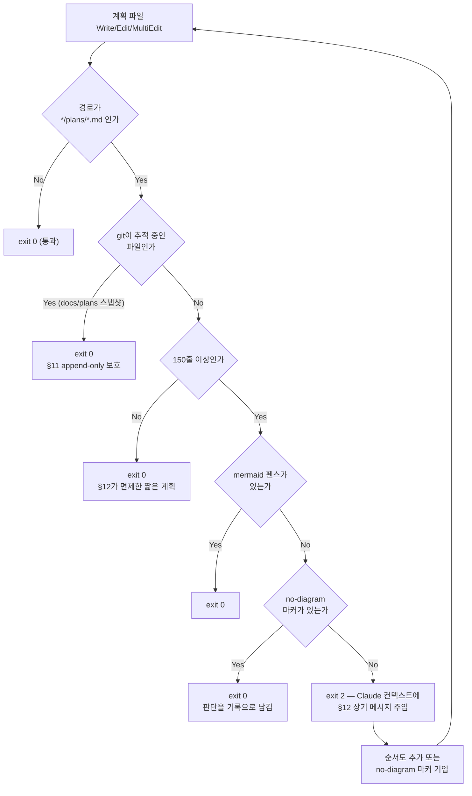

# 계획 파일에 순서도가 안 들어가던 원인 제거 — §12 범위 교정 + PostToolUse 훅

## Context

사용자 지적: "플랜으로 계획 세울 때 프로세스 있으면 순서도 넣으라는 얘기가 있었는데 잘 반영이 안 되는 것 같다. 어떤 이유로 그런지 확인해줘."

조사해보니 **규칙을 어긴 게 아니라, 규칙이 계획 파일에 도달하는 경로가 5군데에서 끊겨 있었다.** 그중 ③④⑤가 이번 수정 대상이다.

| #   | 원인                                                                                                                                      | 근거                                                                                                    | 이번에 고치나                                                     |
| --- | ----------------------------------------------------------------------------------------------------------------------------------------- | ------------------------------------------------------------------------------------------------------- | ----------------------------------------------------------------- |
| ①   | 규칙 §12가 **오늘 14:39에야 생겼다**(커밋 `c0faf5b`). `docs/plans/`의 계획 9개는 전부 그 이전(마지막 14:14)                               | `git log --diff-filter=A` 대조                                                                          | 시간 문제 — 대상 아님                                             |
| ②   | CLAUDE.md는 **세션 시작 시 1회 스냅샷**. 14:39 이전에 시작된 세션은 §12를 끝까지 모른다                                                   | `git show 8efbfcc:.claude/CLAUDE.md \| grep -c '^## 12\.'` → 0, HEAD → 1. **이 세션에서 실제로 재현됨** | 구조 한계 — 훅도 같은 한계를 가짐(아래 "훅이 해결하지 못하는 것") |
| ③   | **경로 불일치**. §12는 `docs/plans/*.md`를 지목하는데 plan mode가 실제로 쓰는 파일은 `~/.claude/plans/<slug>.md`                          | 이 세션의 계획 파일 경로                                                                                | ✅                                                                |
| ④   | plan mode 하네스 지침 Phase 4는 Context·파일 목록·검증 섹션만 요구하고 다이어그램 언급이 없으며 "concise enough to scan quickly"라고 한다 | 하네스 프롬프트                                                                                         | ✅                                                                |
| ⑤   | **기계적 강제가 0개**. `ci.yml`의 "docs/plans 불변성 확인"은 파일 수정만 막고 내용은 안 본다. FE `.claude/settings.json`에 hooks 없음     | `ci.yml:27-35`, `.claude/settings.json`                                                                 | ✅                                                                |

의도한 결과: 앞으로의 세션이 963줄짜리 CLAUDE.md에서 §12를 기억해내는 것에 의존하지 않고, 규칙이 필요한 그 순간에 그 파일 이름과 함께 상기된다.

## 전체 흐름



## 따르는 선례

- **훅 구조**: BE `link-sphere_BE_NEW/.claude/settings.json` — `PostToolUse` + matcher + stderr 메시지 + `exit 2`. 이미 178회 발동 기록이 있는 검증된 패턴이다. 단 BE는 인라인 커맨드라 커맨드 전문이 매번 컨텍스트에 실린다 → 이번엔 스크립트 파일로 분리한다.
- **문서 갱신**: `docs/CI-CHECK-GATE.md` — 검사 게이트를 서술하는 정본 독립 기능 문서.

## 결정 사항과 근거

**임계값 150줄** (`wc -l` 기준). 계획 파일 78개를 실측한 결과:

| 기준      | 발동    | 판단                                                                                                                                                                                                                                              |
| --------- | ------- | ------------------------------------------------------------------------------------------------------------------------------------------------------------------------------------------------------------------------------------------------- |
| 100줄     | 73%     | ✗ `docs/plans/2026-09-09-post-url-autocomplete-off.md`(117줄)가 걸린다. 실제 내용은 `autoComplete="off"` 속성 하나 추가로, §12가 명시적으로 면제한 *"단일 파일 한 줄 수정처럼 흐름이랄 게 없는 작업"*이다. 탈출구가 일상이 되면 규칙이 무력화된다 |
| **150줄** | **41%** | ✅ 중앙값(139줄) 바로 위. 위 오탐이 빠지고, 발동했을 때 "정말 필요하다"가 다수가 되는 지점                                                                                                                                                        |

분포: min=1, p25=109, 중앙값=139, p75=238, max=841 / mermaid 보유 4개. 헤딩 개수도 대안으로 측정했으나 이 레포의 계획 템플릿이 균일해 흐름 유무를 대리하지 못했다(위 117줄 파일도 헤딩 9개). `PLAN_DIAGRAM_MIN_LINES` 환경변수로 오버라이드 가능하게 두어 나중에 스크립트를 고치지 않고 조정할 수 있게 한다.

## 변경할 파일

### 1. `.claude/hooks/plan-diagram-reminder.sh` (신규)

핵심 설계 결정:

- **`set -e`를 쓰지 않는다.** `grep -q ... && exit 0`이 스크립트의 마지막 문장이면 `set -e` 아래에서 종료코드가 1이 되어(실측 확인) 훅이 `exit 1` = non-blocking error로 **조용히 무력화**된다. `set -uo pipefail`만 쓰고 모든 종료를 명시한다.
- **변수는 반드시 `${var}` 중괄호 형태.** 맥 기본 `/bin/bash` 3.2.57이 `"$lines줄"`에서 한글 바이트를 변수명으로 흡수한다 — `set -u`면 `unbound variable`로 exit 127 사망(실측 확인). 이 레포는 메시지가 전부 한글이라 첫 실행에서 터진다.
- **PostToolUse라 파일이 이미 디스크에 최신 상태**이므로 `tool_input.content`를 파싱하지 않고 파일을 직접 읽는다 → `Edit`(content 필드 없음)·`MultiEdit`도 같은 코드로 커버된다.
- **git 추적 파일은 스킵.** `docs/plans/`는 §11 append-only이고 `ci.yml`이 수정을 막는다. 스킵하지 않으면 훅이 커밋된 스냅샷 수정을 유도해 CI를 깨뜨린다.
- **jq 3중 방어**(미설치·빈 stdin·파싱 실패) — 훅이 작업을 막는 방향으로 실패하면 안 된다.
- **펜스 매칭은 관대하게**(` ``` `/`~~~`, 앞 들여쓰기 허용). 계획 파일당 Write+Edit는 중앙값 2회지만 **최대 42회** 기록이 있어, 매칭이 빡빡하면 경고가 반복된다.
- **탈출구 사용법을 stderr 메시지에 직접 넣는다.** 훅이 발동하는 세션은 §12를 못 읽고 있는 세션일 수 있다(그게 애초의 문제다).

````bash
#!/usr/bin/env bash
# .claude/hooks/plan-diagram-reminder.sh
#
# PostToolUse(Write|Edit|MultiEdit) 훅 — 계획 파일에 Mermaid 순서도가 빠졌는지 확인한다.
# 규칙 본문은 .claude/CLAUDE.md §12.
#
# set -e를 쓰지 않는 이유: 이 스크립트는 "grep이 실패하면 계속 진행"이 정상 흐름인데
# `grep -q ... && exit 0`이 마지막 문장이면 set -e 아래에서 종료코드가 1이 되어 훅이
# 조용히 무력화된다(실측 확인). 모든 종료는 명시한다.
set -uo pipefail

MIN_LINES="${PLAN_DIAGRAM_MIN_LINES:-150}"

# 훅은 절대 작업을 막는 방향으로 실패하면 안 된다 — 도구가 없으면 조용히 통과.
command -v jq >/dev/null 2>&1 || exit 0

payload=$(cat)
[ -n "${payload}" ] || exit 0

file_path=$(printf '%s' "${payload}" | jq -r '.tool_input.file_path // empty' 2>/dev/null) || exit 0
[ -n "${file_path}" ] || exit 0

# 경로 매칭은 [[ =~ ]]가 아니라 case로 — 공백·한글·글로브 문자에 안전하다.
case "${file_path}" in
  */plans/*.md) ;;
  *) exit 0 ;;
esac

case "${file_path}" in
  /*) ;;
  *) file_path="${CLAUDE_PROJECT_DIR:-$PWD}/${file_path}" ;;
esac

[ -f "${file_path}" ] || exit 0

# 이미 git에 추적 중인 계획 스냅샷(docs/plans/)은 건드리지 않는다.
# CLAUDE.md §11 append-only + ci.yml "docs/plans 불변성 확인"과 충돌하기 때문.
# ~/.claude/plans는 git 저장소가 아니라 이 명령이 실패 → 조건 거짓 → 계속 진행한다.
if git -C "$(dirname "${file_path}")" ls-files --error-unmatch -- "${file_path}" >/dev/null 2>&1; then
  exit 0
fi

lines=$(wc -l < "${file_path}" | tr -d '[:space:]')
case "${lines}" in '' | *[!0-9]*) exit 0 ;; esac
[ "${lines}" -ge "${MIN_LINES}" ] || exit 0

grep -qE '^[[:space:]]*(```|~~~)[[:space:]]*mermaid' "${file_path}" && exit 0
grep -qE '<!--[[:space:]]*no-diagram:' "${file_path}" && exit 0

# 주의: 맥 기본 bash 3.2는 "$lines줄"에서 한글을 변수명으로 먹는다(set -u면 사망).
# 한글이 뒤따르는 변수는 반드시 ${var} 형태로 쓴다.
cat >&2 <<EOF
[.claude/CLAUDE.md §12] 계획 파일에 Mermaid 순서도가 없습니다.
  ${file_path} (${lines}줄 / 기준 ${MIN_LINES}줄)
단계·분기·실패 지점이 여럿이면 산문만으로 끝내지 말고 Mermaid 순서도를 넣으세요.
정말 흐름이랄 게 없는 작업이면 파일 안에 아래 한 줄을 남기면 이 확인이 멈춥니다.
  <!-- no-diagram: (왜 다이어그램이 필요 없는지 한 줄) -->
EOF
exit 2
````

### 2. `.claude/settings.json` — hooks 블록 추가

현재 `enabledPlugins`만 있다. 아래를 병합한다.

```json
  "hooks": {
    "PostToolUse": [
      {
        "matcher": "Write|Edit|MultiEdit",
        "hooks": [
          {
            "type": "command",
            "command": "bash \"$CLAUDE_PROJECT_DIR/.claude/hooks/plan-diagram-reminder.sh\"",
            "timeout": 10,
            "statusMessage": "계획 파일 다이어그램 확인"
          }
        ]
      }
    ]
  }
```

- 앵커 없는 평문 alternation(`Write|Edit|MultiEdit`)을 쓴다 — 정규식 해석과 `split('|')` 해석 양쪽에서 동작한다.
- `bash <경로>` 형태로 호출한다 — 실행 권한 비트가 빠져도 죽지 않는다.
- **Prettier 포맷을 지켜야 한다.** `.claude/settings.json`은 `.prettierignore`에 없어서 `pnpm check`의 `format:check`에 걸린다.

### 3. `.claude/CLAUDE.md` §12 (227-245줄) 수정

**핵심 프레이밍 전환**: 지금 문구는 "계획 파일(경로)에는 Mermaid를 쓴다"처럼 **파일의 속성**을 요구하는 문장이라, "이건 저장 규칙이지 계획 작성 규칙은 아니다"로 읽히기 쉽다. Plan 모드의 Phase 4("Final Plan 작성")는 Claude Code 하네스에 내장된 고정 틀(Context 섹션·핵심 파일·검증 방법)이고 `.claude/` 설정으로는 그 틀 자체를 바꿀 수 없다 — 이 틀을 편집할 수 있는 유일한 지렛대는 CLAUDE.md뿐이다(Phase 4를 쓰는 세션이 CLAUDE.md를 읽고 하네스의 고정 틀 위에 규칙을 얹어 따르기 때문). 그래서 문구를 **"Plan 모드로 Final Plan을 작성하는 그 행위 자체"를 지목**하도록 바꾼다 — 파일 경로 언급은 부수적으로만 남긴다.

추가/수정할 내용:

- **"Plan 모드 Final Plan(Phase 4) 작성 시, 단계·분기·실패 지점이 여럿이면 Context·핵심 파일·검증 섹션과 나란히 전체 흐름 Mermaid 섹션을 넣는다"**를 §12 본문 맨 앞에 명시 — 행위 시점을 1차 대상으로 삼는다. 원인 ④(하네스 틀에 다이어그램 언급이 없어도 면제되지 않는다) 제거.
- 대상 파일 경로는 부차적으로 병기: plan mode가 실제로 쓰는 `~/.claude/plans/<slug>.md`와 커밋본 `docs/plans/*.md` 둘 다. 원인 ③ 제거.
- 훅 존재·임계값(150줄, `wc -l` 기준)·`<!-- no-diagram: 이유 -->` 탈출구 사용법.
- **한계를 정직하게 적는다**: 훅이 기계적으로 잡는 지점은 `~/.claude/plans/` 저장 시점뿐이다(사후 안전망). `docs/plans/`로의 스냅샷 복사는 Write가 아니라 `cp`로 이뤄지고(실측), git 추적 파일은 스킵하므로 훅이 막아주지 않는다. Phase 4 작성 시점에 넣는 것이 1차 수단이고, 훅은 그걸 놓쳤을 때의 2차 수단이다.

### 4. `docs/CI-CHECK-GATE.md` 갱신

CLAUDE.md:292의 Never 규칙("설정을 바꾼 뒤 그 동작을 서술하는 문서 갱신 누락") 대상이다. 이 문서는 "검사가 실제로 도는 지점"의 정본이고 §1에 그 지점들을 그린 Mermaid가 있다.

- `docs/CI-CHECK-GATE.md:27` "검사가 실제로 도는 지점은 4곳이다" → 5곳으로, §1 mermaid에 Claude Code 훅 노드 추가
- §12 용어 사전에 "Claude Code 훅" 항목 추가
- `> **마지막 검토**: 2026-09-07` → `2026-09-09`

## 하지 않는 것

- **`CHANGELOG.md` 미기록** — 사용자 향 동작 변화가 0이라 `chore`다(CLAUDE.md 808줄 기준).
- **`docs/DECISIONS.md` 미기록** — 훅은 settings.json 한 블록 삭제로 되돌아가므로 "되돌리기 어려운 결정"이 아니다. 근거는 이 계획 파일과 `CI-CHECK-GATE.md`에 남는다.
- **CI 검사 추가 안 함** — 사용자가 범위에서 제외했다.
- **BE 레포 안 건드림** — 사용자 결정. 아래 "보고할 것" 참고.

## 훅이 해결하지 못하는 것 (정직하게)

훅 설정도 CLAUDE.md와 **똑같이 세션 시작 시 스냅샷된다.** 즉 원인 ②(세션 스냅샷)는 훅으로도 해결되지 않는다 — 이 변경을 만드는 세션에서는 훅이 발동하지 않는다. 훅의 실제 가치는 "현재 세션에 규칙을 주입하는 것"이 아니라 **앞으로의 모든 세션에서 963줄짜리 CLAUDE.md의 §12를 모델이 기억해내는 것에 의존하지 않게 만드는 것**이다.

## 작업 순서

1. `git log origin/main..main`으로 미푸시 커밋 확인(현재 없음) → `EnterWorktree` → `cp ../../../.env . && pnpm install`
2. `.claude/hooks/plan-diagram-reminder.sh` 작성
3. **검증 A(단위) 통과 확인** — 실패하면 4번으로 넘어가지 않는다
4. `.claude/settings.json` hooks 병합
5. `.claude/CLAUDE.md` §12 수정
6. `docs/CI-CHECK-GATE.md` 갱신
7. 검증 B·C 실행 → 커밋(`chore(claude): 계획 파일 다이어그램 누락을 훅으로 확인`) → PR
8. §11에 따라 이 계획 파일을 `docs/plans/2026-09-09-plan-diagram-hook.md`로 같은 PR에 커밋하고, fresh subagent(Explore)로 계획 대비 구현 대조 → PR 본문 `## 계획 대비 구현` 섹션

## 검증

### A. 단위 — 스크립트에 stdin JSON 직접 주입 (워크트리 안에서 가능)

```bash
run() {
  printf '{"tool_name":"Write","tool_input":{"file_path":"%s"}}' "$1" \
    | bash .claude/hooks/plan-diagram-reminder.sh
  echo "  exit=$?  $(basename "$1")"
}
```

| 입력                                                          | 줄수 | mermaid | 기대 exit                                                             |
| ------------------------------------------------------------- | ---- | ------- | --------------------------------------------------------------------- |
| `~/.claude/plans/fsd-compressed-pinwheel.md`                  | 369  | 0       | **2** (stderr 출력 동반)                                              |
| `~/.claude/plans/tranquil-sleeping-teacup.md`                 | 233  | 1       | 0                                                                     |
| `~/.claude/plans/fancy-sniffing-gizmo.md`                     | 23   | 0       | 0                                                                     |
| `docs/plans/2026-09-08-plan-verification-process.md`          | 642  | 0       | **0** — git 추적 중. append-only 보호가 도는지 확인하는 유일한 케이스 |
| `docs/plans/2026-09-09-post-url-autocomplete-off.md`          | 117  | 0       | 0 (임계값 미달)                                                       |
| `src/main.tsx`                                                | –    | –       | 0 (경로 불일치)                                                       |
| 없는 파일 / 빈 stdin / `not json` / `file_path` 없는 페이로드 | –    | –       | 0                                                                     |
| `<!-- no-diagram: -->` 든 300줄 파일                          | 300  | 0       | 0                                                                     |
| 들여쓰기된 펜스, `~~~mermaid`                                 | ≥150 | 1       | 0                                                                     |

### B. 회귀 — 코퍼스 스윕

78개 파일 전체를 돌려 발동 건수가 **32건**(150줄 기준 실측값)과 일치하는지 확인한다.

### C. 정합성 (커밋 전)

```bash
node -e "JSON.parse(require('fs').readFileSync('.claude/settings.json','utf8'))"
npx prettier --check .claude/settings.json
pnpm check:docs
pnpm check
```

### D. 엔드투엔드 — 머지 후 **새 세션에서만**

훅 스냅샷 때문에 이 세션·워크트리 세션에서는 불가능하다.

1. 새 세션 시작(cwd = FE 레포 main)
2. `/hooks`로 `PostToolUse` 목록에 등록됐는지 확인 — `$CLAUDE_PROJECT_DIR` 전개 결과도 여기서 눈으로 확인된다(유일한 미검증 가정)
3. plan mode로 150줄 넘는 계획을 순서도 없이 작성 → 메시지가 뜨는지 확인
4. 순서도 추가 → 다음 Edit에서 안 뜨는지 확인 (**루프 없음 증명**)

## 보고할 것 (최종 응답에 반드시 포함)

- `docs/CI-CHECK-GATE.md`를 "검사 지점 4곳 → 5곳"으로 갱신했다는 사실 (CLAUDE.md:292 요구)
- **BE 레포는 이번 범위 밖이다.** `~/.claude/plans/`는 FE·BE 세션이 공유하는데 훅은 FE 프로젝트 설정이라 FE 세션에서만 돈다. 게다가 BE main에는 §12 자체가 없고(`grep -c` → 0) `worktree-be-diagram-rule`(`b14f2ce`)에만 있는 미머지 상태다. 즉 BE 세션이 쓰는 계획은 규칙도 강제도 없다.
