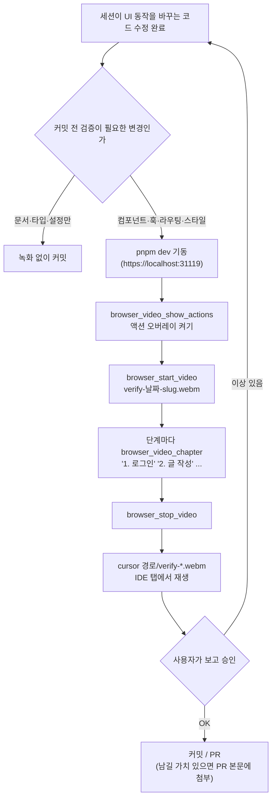

# 세션 검증 영상 — Playwright MCP devtools 활성화

## Context

지금 이 레포의 브라우저 검증은 **전부 휘발됩니다.** `docs/DECISIONS.md`의 9곳(662, 944,
1089, 1111, 1139, 1377, 1382, 1518, 1640줄)이 "Playwright로 실측했다 / 재현을 시도했다"는
기록인데, 그 검증이 코드로도 영상으로도 남은 건 하나도 없습니다. 사용자는 세션이
코드를 반영하기 **전에** 그 검증 화면을 직접 보고 싶어 합니다.

지금도 Playwright MCP는 headed(기본값)로 돌아 맥에 Chrome 창이 뜹니다. 하지만 사용자
피드백은 **"브라우저를 따로 띄우니 정신없다, IDE 안에서 제공해야 눈이 간다"**였습니다.
그래서 방향은 "별도 창을 띄워 실시간으로 보여주기"가 아니라 **"별도 창을 없애고(headless)
녹화본을 IDE 안에서 보여주기"**입니다.

이 작업은 e2e 자동화(`@playwright/test`)와 **완전히 독립적**입니다. 러너 설치도, 스펙
작성도, API 모킹 방식 결정도 필요 없습니다. 설정 파일 하나로 끝납니다. 사용자가 세 층
(세션 검증 영상 / CI 실패 영상 / 기능 데모 영상) 중 **이것만 먼저** 하기로 선택했습니다.

## 확인된 사실 (직접 실행해 검증함)

| 사실                                             | 확인 방법                                                                                                                                                                                          |
| ------------------------------------------------ | -------------------------------------------------------------------------------------------------------------------------------------------------------------------------------------------------- |
| MCP 영상 도구는 `--caps=devtools` 뒤에 잠겨 있음 | stdio JSON-RPC로 `tools/list` 직접 호출                                                                                                                                                            |
| `--caps=devtools`가 여는 도구                    | `browser_start_video`, `browser_stop_video`, `browser_video_chapter`, `browser_video_show_actions`/`hide_actions`, `browser_start_tracing`/`stop_tracing`, `browser_highlight`, `browser_annotate` |
| 현재 플러그인은 옵션 없이 실행                   | `~/.claude/plugins/marketplaces/claude-plugins-official/external_plugins/playwright/.mcp.json` = `npx @playwright/mcp@latest`                                                                      |
| `@playwright/mcp` 버전                           | 0.0.80                                                                                                                                                                                             |
| headed가 기본값                                  | `--help`: `--headless  run browser in headless mode, headed by default`                                                                                                                            |
| 사용 중인 에디터                                 | `code` CLI 없음, `/usr/local/bin/cursor` 있음 → Cursor                                                                                                                                             |
| Playwright 번들 ffmpeg 능력                      | encoders = `png`, `libvpx VP8` / muxers = `webm` 뿐 → **mp4 변환 불가**                                                                                                                            |

## 만들 것

### 1. `.mcp.json` (레포 루트, 신규)

```json
{
  "mcpServers": {
    "playwright": {
      "command": "npx",
      "args": [
        "@playwright/mcp@latest",
        "--caps=devtools",
        "--headless",
        "--ignore-https-errors",
        "--viewport-size=1280x800",
        "--output-dir=.claude/browser-artifacts"
      ]
    }
  }
}
```

각 옵션의 근거:

- `--caps=devtools` — 영상 도구를 여는 유일한 스위치
- `--headless` — 사용자가 지목한 "정신없는 별도 창"을 없앤다. **트레이드오프: 실시간
  관찰을 포기하고 녹화본으로 본다.** 되돌리려면 이 한 줄만 지우면 된다
- `--ignore-https-errors` — `pnpm dev`는 `vite --mode localhost`이고
  [vite.config.ts:24](../../project/link-sphere/link-sphere_FE_NEW/vite.config.ts)가
  mkcert로 HTTPS를 켠다. MCP 브라우저는 임시 프로필이라 로컬 CA를 신뢰하지 않으므로
  이 플래그가 없으면 인증서 오류로 접속이 막힌다
- `--viewport-size` — 녹화본 크기를 세션마다 흔들리지 않게 고정
- `--output-dir` — 워크스페이스 안에 둔다(MCP는 기본적으로 워크스페이스 밖 파일 접근을
  제한한다). `.claude/worktrees/`가 이미 같은 성격의 gitignore 대상이라 그 옆에 둔다

### 2. 플러그인 비활성화 — `.claude/settings.json`

`enabledPlugins`의 `"playwright@claude-plugins-official"`을 `false`로. 그대로 두면 서버가
둘(`mcp__plugin_playwright_playwright__*` + `mcp__playwright__*`)이 되어 브라우저가 두 개
뜨고 어느 쪽을 부르는지 헷갈린다.

**딸려오는 작업**: `.claude/settings.local.json:94-102`의 MCP 권한 9개가 옛 prefix라
죽는다. `mcp__playwright__*` 로 바꿔 넣지 않으면 매번 권한 프롬프트가 뜬다.
(`settings.local.json`은 git 미추적이라 커밋에는 안 들어간다.)

### 3. `.gitignore` — `.claude/browser-artifacts/` 추가

영상은 레포에 커밋하지 않는다. 기록으로 남길 가치가 있는 영상만 PR 본문에 첨부한다
(webm은 GitHub PR에 그대로 임베드된다, 무료 플랜 10MB 한도).

### 4. `.claude/skills/browser-verification/SKILL.md` (신규)

`.claude/CLAUDE.md`가 이미 984줄이고, 2026-09-09 길이 감사에서 `design-tokens`,
`texts-conventions`, `changelog-release`, `responsive-ux` 4개를 skill로 분리한 선례가
있다. 같은 형태를 따른다. `.claude/CLAUDE.md`에는 한 줄 포인터만 추가한다.

skill이 정할 내용:

- **언제 녹화하는가** — UI 동작이 바뀌는 변경(컴포넌트·훅·라우팅·스타일)을 커밋하기
  전. 문서·타입·설정만 바뀐 변경은 제외. 사용자가 "확인해줘"라고 하면 항상
- **호출 순서** — `browser_video_show_actions` → `browser_start_video` →
  단계마다 `browser_video_chapter` → `browser_stop_video`
- **파일명** — `verify-<YYYY-MM-DD>-<slug>.webm`
- **끝나고** — `cursor <경로>`로 IDE 탭에 열어 사용자에게 바로 보여준다
- **하지 않는 것** — 실패 시 영상만 남기고 넘어가지 않는다. 영상은 검증의 증거지
  검증 자체가 아니다

## 흐름



## 가장 큰 리스크: VP8 webm이 Cursor에서 재생 안 될 수 있다

Playwright는 **VP8 코덱 webm**으로만 녹화한다. 그런데 VS Code(=Cursor의 상류)에서
VP8-in-webm 미리보기가 실패한다는 이슈가 있고, **"not planned / upstream / electron"으로
닫혀 있다** ([microsoft/vscode#195758](https://github.com/microsoft/vscode/issues/195758)).
이슈는 2023년 것이라 그 뒤 Electron 업데이트로 해결됐을 수도 있는데, **확인할 방법은
직접 녹화해서 열어보는 것뿐**이다.

그래서 아래 검증 2단계를 **게이트**로 둔다. 여기서 막히면 두 갈래인데, 둘 다 사용자
승인이 필요하므로 그 자리에서 묻는다:

- (a) `brew install ffmpeg` 후 mp4(H.264) 변환 — 재생도 되고 GitHub 호환성도 가장 좋지만
  **시스템 의존성이 하나 늘어난다.** Playwright 번들 ffmpeg로는 불가능함을 이미 확인했다
  (VP8/webm 전용)
- (b) 영상을 포기하고 `browser_start_tracing` + 인라인 스크린샷으로 대체 — 의존성 0,
  대신 "영상"이라는 원래 요구는 못 채운다

## 검증

1. `.mcp.json` 적용 후 Claude Code 재시작 → 도구 목록에
   `mcp__playwright__browser_start_video`가 뜨는지. 동시에 옛
   `mcp__plugin_playwright_playwright__*`가 사라졌는지(서버 중복 제거 확인)
2. **게이트** — 아무 페이지나 5초 녹화 → `cursor .claude/browser-artifacts/<파일>.webm`
   → **IDE 탭에서 실제로 재생되는지.** 실패하면 위 (a)/(b)를 사용자에게 묻고 진행
3. 실제 흐름 하나(`/post` 피드 → 게시글 상세)를 챕터 2개로 녹화 → 챕터 카드와 액션
   오버레이가 영상에 보이는지
4. `pnpm check` — `.mcp.json`·`.gitignore`·skill 추가가 lint/format을 통과하는지
5. `pnpm check:docs` — `.claude/CLAUDE.md`에 추가한 포인터의 경로가 실제와 맞는지

## 범위 밖 (이번에 하지 않음)

- `@playwright/test` 설치, e2e 스펙 작성, CI 아티팩트 배선 — 사용자가 "①만 먼저" 선택
- Storybook `addon-vitest` 배선(스토리 38개가 0개 실행 중인 문제) — 별건
- e2e API 모킹 방식(`@msw/playwright` vs `page.route`) 결정 — e2e를 할 때 정한다
- `.claude/worktrees/`에 남은 유령 워크트리 정리(`git worktree prune`) — 무관한 발견
