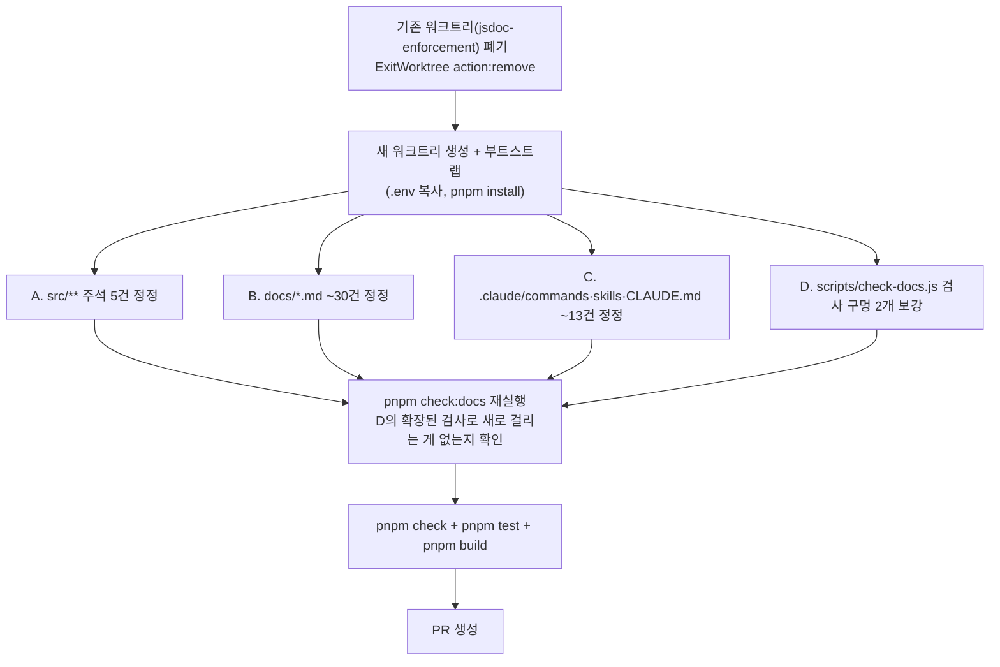

# 레포 전체 주석·문서 오류 정리 (SSOT 위반 정정)

## Context

원래 "훅·util·API JSDoc을 ESLint로 강제"하는 작업을 진행하던 중, 그 근거를 조사하는 과정에서 "**틀린 주석이 없는 것보다 해롭다**"는 연구 결과(Macke & Doyle 2024, Haroon 2025)와 이 레포 자체의 실제 방치 사례(JSDoc이 7.5개월간 존재한 적 없는 컴포넌트를 가리킨 사례 등)를 확인했다. 사용자가 이 지점에서 원래 작업 방향을 재고했다 — **제가 대량으로 새 JSDoc·새 문서를 쓰는 것 자체가 검증 안 된 콘텐츠를 늘리고 동기화 부담을 만들어 SSOT에 어긋난다**는 판단이다. JSDoc은 필요할 때 사용자가 직접 작업하며 채우기로 하고, 대신 **지금 이미 잘못 서술되어 있는 것들을 찾아 정리**하는 것으로 작업을 완전히 바꿨다.

레포 전체(`src/**` 주석, `docs/*.md`, `.claude/CLAUDE.md`, `.claude/commands/**`, `.claude/skills/**`)를 Explore 에이전트 3개로 다시 훑어 신뢰도별로 분류했다. "명백히 틀림/확실" 태그가 붙은 것만 이번 범위에 포함하고, "애매함/보통/낮음"은 제외했다.

## 되돌릴 것 (실행 1단계)

현재 워크트리(`.claude/worktrees/jsdoc-enforcement`)에는 폐기하기로 한 이전 작업이 미커밋 상태로 남아있다:

- `eslint.config.js`에 JSDoc 강제 룰 3블록, `package.json`/`pnpm-lock.yaml`에 `eslint-plugin-jsdoc` 의존성
- 훅 6·API 16·util 13 = 35개 함수에 새로 쓴 JSDoc
- `docs/FE-ARCHITECTURE.md` §2 표에 존재하지 않는 §24를 가리키는 행 1개

이 작업과 무관한 새 작업이므로, 이 워크트리를 `ExitWorktree`(`action: "remove"`)로 폐기하고 이번 작업 전용 새 워크트리를 만든다.

## 전체 흐름

## A. `src/**` 주석 정정 (5건) — 전부 rename/리팩터 잔재, 동작 변경 없음

| 파일:줄                                                                                                                               | 현재(틀림)                                          | 정정                                                                   |
| ------------------------------------------------------------------------------------------------------------------------------------- | --------------------------------------------------- | ---------------------------------------------------------------------- |
| `src/shared/utils/auth.util.ts:4`                                                                                                     | `client.ts:176,200`을 가리킴                        | 실제 `AuthUtil.clearAll()` 호출부인 `client.ts:183,207`로 정정         |
| `src/features/comment/create/hooks/useCreateComment.test.tsx:20` `src/features/comment/update/hooks/useUpdateComment.test.tsx:18` | `CommentQueries.test.tsx`(존재하지 않음, rename됨)  | `comment.queries.test.ts`로 정정                                       |
| `src/shared/ui/elements/MarkdownContent.tsx:66`                                                                                       | `auth.queries.ts`의 마이페이지 재오픈 로직을 가리킴 | 실제 위치 `src/entities/account/api/account.queries.ts:105-112`로 정정 |
| `src/widgets/bookmark/folder-tree/hooks/useFolderTree.test.ts:14`                                                                     | `useFolderListQuery`(존재하지 않는 개명 전 이름)    | 실제 이름 `useBookmarkFolderListQuery`로 정정                          |
| `src/shared/lib/toast/toast.ts:25`                                                                                                    | "ESLint `no-restricted-imports`로 강제"             | 실제 강제 수단인 `custom-import/no-sonner-toast-direct-import`로 정정  |

## B. `docs/*.md` 정정 (약 30건)

**가장 위험한 것부터**: [`docs/FE-ARCHITECTURE.md:133`](../../../project/link-sphere/link-sphere_FE_NEW/docs/FE-ARCHITECTURE.md)가 **실제로 렌더 중인 `AppShellLayout.tsx`를 "어디서도 import되지 않는 미사용 컴포넌트"로 서술**한다(`src/app/routes/layouts/AppShellLayout.tsx:2`가 실제 소비처). 이대로 두면 다음 세션이 이 문장을 근거로 삭제할 위험이 있다.

| 문서:줄                                          | 무엇이 틀렸나                                                                                                                           | 정정 방향                                                                                |
| ------------------------------------------------ | --------------------------------------------------------------------------------------------------------------------------------------- | ---------------------------------------------------------------------------------------- |
| `docs/FE-ARCHITECTURE.md:133`                    | `AppLayout`을 미사용 컴포넌트로 서술                                                                                                    | 실제 소비처(`AppShellLayout.tsx`) 명시하거나 서술 삭제                                   |
| `docs/FE-ARCHITECTURE.md:269`                    | `no-restricted-imports` 줄 범위가 실제 5블록 범위(1002-1127)와 다름                                                                     | §2 관례대로 줄번호 대신 규칙명으로 인용하도록 수정                                       |
| `docs/AUTH.md:151-152,:177`                      | 이미 정정된 `ProtectedRoute.tsx:24` 주석을 "아직 안 고쳐졌다"고 경고 — 자기 자신이 낡음                                                 | 현재 코드(24-27행)와 일치하는 스니펫으로 교체, 경고 문구 제거                            |
| `docs/AUTH.md:139,:247,:281,:300`                | 줄번호 드리프트(`auth.util.ts:20→29`, `client.ts:189→196`, `client.test.ts:226→225`, `client.ts:175,177→182,184`)                       | 실제 줄번호로 정정                                                                       |
| `docs/BOOKMARK.md:128,:164,:299,:301-302,:391`   | `BookmarkFolderSelectModal`/`useBookmarkFolderSelect` 위치를 `entities/bookmark/folder/{ui,hooks}/`로 서술                              | 실제 위치 `features/bookmark/select/{ui,hooks}/`로 정정                                  |
| `docs/BOOKMARK.md:198`                           | `handle*Success` 함수 "9개"                                                                                                             | 실제 8개로 정정                                                                          |
| `docs/BOOKMARK.md:320,:383`                      | `activeFolderKey` 선언을 65줄로 인용                                                                                                    | 실제 68줄로 정정                                                                         |
| `docs/MYPAGE.md:70-73,:88-98,:259,:276,:290-292` | 2026-08-03 제거된 `POST /auth/account/avatar` 엔드포인트를 현행 스펙으로 서술(`docs/VERSION-COMPATIBILITY.md:34`가 이미 제거를 기록 중) | 아바타 업로드는 `uploadImageAndGetUrl()` 경유임을 반영해 서술 정정                       |
| `docs/MYPAGE.md:222-229,:114`                    | `handleAccountUpdateSuccess` 코드 스니펫이 옛 시그니처(queryClient 싱글턴, `folderInvalidateQueries`)                                   | 실제 `account.keys.ts:22-26`(파라미터 주입, `bookmarkFolderInvalidateQueries`)로 교체    |
| `docs/MYPAGE.md:314,:316`                        | `useUpdateProfile.ts`(존재하지 않는 개명 전 이름)                                                                                       | `useUpdateAccount.ts`로 정정(같은 문서 :220은 이미 맞게 적혀 있어 내부 모순 해소)        |
| `docs/TESTING.md:886`                            | "이 레포엔 Playwright e2e 스위트가 없다" — 같은 문서 556-670줄(§13)이 있다고 서술해 자기모순                                            | 삭제 또는 §13과 일치하도록 정정                                                          |
| `docs/TESTING.md:888`                            | MCP 도구를 `mcp__plugin_playwright_playwright__*`로 지칭                                                                                | 실제 접두사 `mcp__playwright__*`로 정정                                                  |
| `docs/CI-CHECK-GATE.md:126,:139`                 | ignore 배열 위치를 `19-24`로 인용                                                                                                       | 실제 `185-193`으로 정정(또는 줄번호 인용 제거)                                           |
| `docs/CI-CHECK-GATE.md:128,:129,:130`            | `ci.yml`의 트리거/concurrency/Node 버전 줄번호가 실제(10-11/14-16/47)와 다름                                                            | 정정                                                                                     |
| `docs/CI-CHECK-GATE.md:127`                      | `.prettierignore:6-7`                                                                                                                   | 실제 `7-8`로 정정                                                                        |
| `docs/CI-CHECK-GATE.md:125,:143`                 | `package.json:122`(`--max-warnings 0`)                                                                                                  | 실제 `120`으로 정정                                                                      |
| `docs/SYSTEM-ARCHITECTURE.md:90,:111-113`        | 배포 트리거에 `package-lock.json` 언급, 단계에 `npm install`·테스트 스텝 누락, Secrets 5종만 서술                                       | 실제 `deploy.yml`(pnpm, `pnpm test` 포함, Firebase 시크릿 6종 추가)로 정정               |
| `docs/DEPLOY.md:138`                             | `entities/comment/config/const.ts`                                                                                                      | 실제 `entities/comment/config/comment.const.ts`로 정정                                   |
| `docs/FCM-PUSH-NOTIFICATION.md:262-274`          | `RootLayout.tsx` 스니펫이 `useAppVersionCheck`/`useNewVersionReload`·조기 반환 누락                                                     | 현재 코드로 교체                                                                         |
| `docs/FCM-PUSH-NOTIFICATION.md:75`               | 인증 상태 관리를 `entities/user`로 서술                                                                                                 | 실제 `entities/auth`로 정정                                                              |
| `README.md:129-130`                              | `upload`를 "api.ts만 있는 예외적 엔티티"로 서술                                                                                         | 실제로는 엔티티가 아니라 `shared/api/upload.api.ts`로 이동됨(`fca82dd`) — 서술 삭제/정정 |
| `README.md:71-85,:99`                            | 개발 명령어 표에 `test:e2e`/`check:docs` 누락, 기술 스택에 Playwright 누락                                                              | 추가                                                                                     |

## C. `.claude/commands/**`·`.claude/skills/**`·`CLAUDE.md` 정정 (약 13건)

가장 심각한 카테고리 — **슬래시 커맨드 템플릿이 지금 그대로 쓰면 lint/test를 통과 못 하는 코드를 생성**한다. 커맨드 템플릿이 2026-03~05월에 멈춰 있는데 그 뒤 ESLint 룰 10개·톤 규칙(합니다체→해요체)·`.keys.ts` 패턴(queryClient 파라미터 주입)이 전부 바뀌었다.

| 파일:줄                                                               | 무엇이 틀렸나                                                                                                | 정정 방향                                       |
| --------------------------------------------------------------------- | ------------------------------------------------------------------------------------------------------------ | ----------------------------------------------- |
| `.claude/commands/add-entity-api.md:50`, `new-domain.md:77`           | `.keys.ts` 템플릿이 `queryClient` 싱글턴 직접 import(2026-09-09 ESLint로 금지됨)                             | `post.keys.ts` 패턴(파라미터 주입)으로 교체     |
| `.claude/commands/new-domain.md:184-195`, `add-entity-api.md:154-165` | TEXTS 예시가 합니다체(`'~되었습니다.'`)                                                                      | 해요체(`texts.test.ts`가 가드)로 교체           |
| `.claude/commands/new-feature.md:125,:132`                            | 폼 템플릿에 하드코딩 한글(`custom-i18n/no-hardcoded-hangul`이 차단)                                          | `TEXTS.*` 참조로 교체                           |
| `.claude/commands/new-domain.md:170`                                  | `API_BASES` 템플릿이 `${API_BASE_URL}/...` 형태(실제로는 prefix 없는 상대 경로만 써야 함 — 이중 prefix 버그) | `post: '/post'` 형태로 교체                     |
| `.claude/commands/add-schema.md:27`                                   | `@/shared/api/common.schema`(존재하지 않음)                                                                  | 실제 `@/shared/types/common.type`으로 정정      |
| `.claude/commands/add-entity-api.md:16`                               | `_common/model/...`(FSD 마이그레이션 이전 잔재, 현재 `_common/` 자체가 없음)                                 | 제거                                            |
| `.claude/commands/new-feature.md:7`, `.claude/CLAUDE.md:776`          | 슬라이스 네이밍 예시 `create-post`/`sign-up`(CLAUDE.md 자신의 네이밍 표가 명시적으로 ❌로 규정한 형태)       | `create`/`signup`으로 정정                      |
| `.claude/commands/add-schema.md:32-34`                                | JSDoc 템플릿이 영문 (CLAUDE.md는 "JSDoc 한글" 명시)                                                          | 한국어로 정정                                   |
| `.claude/skills/changelog-release/SKILL.md:38`                        | 스코프 목록에 `infra` 누락(CHANGELOG.md가 이미 씀)                                                           | `infra` 추가                                    |
| `.claude/skills/changelog-release/SKILL.md:31`                        | 예시 경로 `BookmarkFolderPicker.tsx`(존재하지 않음)                                                          | 실제 `PostCreateBookmarkFolderField.tsx`로 정정 |
| `.claude/CLAUDE.md:349`                                               | ".npmrc engine-strict 2026-09-09 추가"                                                                       | 실제 커밋 날짜 2026-09-10으로 정정              |
| `.claude/CLAUDE.md:502-510`                                           | 검증 커맨드가 `npm run *`(레포는 pnpm 고정)                                                                  | `pnpm *`으로 정정                               |
| `.claude/CLAUDE.md`                                                   | `responsive-ux` 스킬만 전용 포인터 절이 없음(다른 4개 스킬은 있음)                                           | 다른 스킬과 같은 형식으로 포인터 절 추가        |

## D. `scripts/check-docs.js` 검사 구멍 보강

이번 감사에서 찾은 것의 상당수가 이 두 구멍 때문에 지금까지 자동 검사를 통과해왔다:

1. **`.claude/commands/**`·`.claude/skills/**`가 `TARGET_FILES`에 없음** — `README.md` + `.claude/CLAUDE.md` + `docs/*.md`만 검사 대상이다(`scripts/check-docs.js:17-24`). Node 20.1+/24가 지원하는 `fs.readdirSync(dir, { recursive: true })`로 `.claude/commands/`·`.claude/skills/`를 재귀 수집해 추가한다(이 레포는 Node 24 고정이라 옵션 지원 문제 없음).
2. **`PATH_TOKEN_RE`가 `src/`·`.github/`·`infra/` 접두사를 요구**(`scripts/check-docs.js:98`) — `entities/bookmark/folder/ui/...`처럼 `src/` 없이 FSD 레이어명으로 시작하는 경로 서술을 놓친다(BOOKMARK.md·DEPLOY.md·FCM 문서가 전부 이 형태). FSD 레이어 이름(`app|pages|widgets|features|entities|shared`)으로 시작하는 경로 토큰도 잡아서 `src/` 접두사를 붙여 존재를 검사하도록 확장한다 — 단, `src/...` 토큰과 중복 매칭되지 않도록(예: `src/entities/post/post.api.ts` 안의 `entities/post/post.api.ts` 부분 문자열이 별도로 다시 잡히지 않도록) 매칭 전 `src/`로 시작하는 토큰을 먼저 제거하고 나머지에서 찾는 방식으로 구현한다.

**검증**: 이번에 B에서 찾은 `BOOKMARK.md`의 `entities/bookmark/folder/ui/...`(수정 전 상태를 임시로 재현해서), `README.md`의 `upload` 관련 경로 등을 대상으로 확장된 검사가 실제로 걸러내는지 확인한다.

## 이번 범위에서 명시적으로 제외한 것

- **`src/shared/api/client.ts:57`의 리프레시 헤더 문제** — 주석과 실제 코드가 어긋나 있고 보안에 영향이 있지만, 이건 "잘못된 문서"가 아니라 **실제 동작을 어느 쪽으로 결정할지**의 문제(주석을 현재 동작에 맞출지, `authEndpoints`에 refresh를 추가해 코드를 주석에 맞출지)다. 별도 이슈/대화로 다룬다.
- **"애매함/확인 필요" 태그 items**: `usePostCard.ts`의 가드 서술, `error.util.ts`의 반례 참조, `accountApi.checkNicknameAvailability`의 호출부 특정, `code-review.md`의 disabled 체크리스트(뉘앙스 판단 필요), `texts-conventions/SKILL.md`의 생략표시 — 전부 판단이 더 필요해 제외.
- 워크트리에 남아있던 35개 JSDoc·ESLint jsdoc 강제 룰 — 전부 폐기(사용자가 직접 필요할 때 작성하기로 결정).

## 검증 방법

| 단계               | 명령                                                                        | 기대 결과                                                       |
| ------------------ | --------------------------------------------------------------------------- | --------------------------------------------------------------- |
| 경로/줄번호 재검증 | `pnpm check:docs`                                                           | 모든 정정 후 통과, D의 확장된 검사도 통과                       |
| 전체 게이트        | `pnpm check && pnpm test && pnpm build`                                     | 전부 통과, 테스트 결과 무변화(주석·문서만 수정, 동작 변경 없음) |
| D 보강 검증        | 수정 전 상태를 임시 재현해 `pnpm check:docs`가 실제로 잡는지 확인 후 되돌림 | 확장된 검사가 오탐 없이 실제 사례를 잡음                        |
