# e2e 흐름 확장 (2차) — 로그인·로그아웃·좋아요 캐시 전파·댓글 카운트

## Context

1차 e2e 작업(PR #66/#67, 이미 머지됨)은 "얇게 여는" 기반 구축이 목적이라 대표 흐름
2개(비로그인 목록/검색/상세, 로그인 상태 북마크 저장)만 만들고 `src/` 프로덕션 코드를
한 줄도 안 건드리는 걸 원칙으로 삼았다. 사용자가 녹화된 영상을 직접 보다가 실제 모킹
누락 버그(계정 조회 실패 토스트)를 발견해 PR #67로 고친 뒤, "다른 흐름도 세팅하자"는
요청으로 이 계획이 시작됐다.

이번엔 기존 두 흐름이 덮지 못하는 영역을 조사해 후보 4개를 찾았고, 전부
`docs/TESTING.md` "무엇에 새 e2e 흐름을 추가하는가" 기준(사전적: 라우팅 가드·인증
상태 리다이렉트/모달 분기·여러 페이지 mutation→invalidate 체인)에 들어맞는다. 조사
과정에서 실제 프로덕션 버그(좋아요 mutation의 불완전한 롤백)도 발견했다. 사용자가
AskUserQuestion으로 확정한 범위:

1. **흐름 4개 전부**: 로그인 폼 제출 / 로그아웃 / 좋아요 캐시 전파 / 댓글 작성→카운트 반영
2. **접근성 라벨 추가**: 좋아요·로그아웃에 필요한 aria-label을 이번에 같이 추가 (PR #66의
   "src/ 0줄" 원칙이 이번엔 의도적으로 깨진다 — 실제 a11y 개선이기도 하다)
3. **좋아요 롤백 버그**: 이번에 같이 수정

## 전체 흐름

```mermaid
flowchart TD
    subgraph F1["login.spec.ts — 로그인 폼 제출 (신규 파일, src/ 0줄)"]
        L1["/auth/login 진입, Email/Password 입력"] --> L2{"제출"}
        L2 -->|성공 mock| L3["POST /auth/login 200<br/>→ GuestGuard가 '/' → '/post'로 리다이렉트"]
        L3 --> L4["mockAccountQuery 등 등록 후<br/>목록 렌더 + accountMenu 버튼 노출 확인"]
        L2 -->|실패 mock| L5["POST /auth/login 401<br/>(code는 TOKEN_EXPIRED 등 특수값 아님)"]
        L5 --> L6["응답 body의 message가<br/>그대로 토스트로 뜨는지 확인, URL 안 바뀜"]
    end

    subgraph F2["logout.spec.ts — 로그아웃 (Navbar에 aria-label 1줄 추가)"]
        G1["has-session 시딩 + /post 진입(공개 페이지)"] --> G2["accountMenu 버튼 → Log out 클릭"]
        G2 --> G3["'로그아웃 중...' 700ms 대기"]
        G3 --> G4["Navbar가 'Log in' 버튼으로 복귀,<br/>URL은 /post 그대로(비보호 페이지라 이동 없음)"]
        G5["has-session 시딩 + /bookmark 진입(보호 페이지)"] --> G6["같은 로그아웃 클릭"]
        G6 --> G7["/post로 replace 리다이렉트 확인<br/>(isProtectedPath 분기)"]
    end

    subgraph F3["like.spec.ts — 좋아요 상세↔목록 캐시 전파 (LikePostButton aria-label + 버그 수정)"]
        K1["목록 → 상세 진입"] --> K2["좋아요 버튼 클릭 → POST /post/:id/like mock"]
        K2 --> K3["상세에서 카운트 즉시 증가(낙관적)"]
        K3 --> K4["뒤로가기로 목록 복귀"]
        K4 --> K5["목록에도 반영됨을 확인<br/>— GET /post가 다시 안 나갔음을 요청 카운트로 증명"]
        K3 --> K6{"실패 케이스: 500 mock"}
        K6 --> K7["상세 롤백(기존에도 됨) +<br/>목록도 롤백(이번에 고친 버그) 둘 다 확인"]
    end

    subgraph F4["comment.spec.ts — 댓글 작성 → 목록 카운트 반영 (src/ 0줄)"]
        C1["상세 진입, commentCount=0 mock"] --> C2["댓글 입력(getByPlaceholder) → 등록"]
        C2 --> C3["POST /post/:id/comment 201 mock<br/>→ 이후 GET /post*, GET /post/:id는 commentCount=1로 응답 전환(상태 플래그)"]
        C3 --> C4["상세: invalidate로 즉시 재조회 → 1 확인"]
        C4 --> C5["목록 복귀 → stale이라 재조회 → 1 확인<br/>(좋아요와 반대로 재조회가 필수임을 증명)"]
    end
```

## 후보별 설계

### ① `e2e/login.spec.ts` (신규, `src/` 0줄)

- 기존 인프라 불필요(auth.fixture 안 씀) — has-session 없이 순수 `@playwright/test`의
  기본 `page`로 시작.
- `e2e/mocks/auth.mock.ts`에 `mockLoginSuccess(page)`(`POST /auth/login` → 200
  `wrapResponse(mockLoginResponse)`), `mockLoginFailure(page, message)`(401, body에
  `message` + `code`는 `TOKEN_EXPIRED`/`NOT_LOGGED_IN`/`INVALID_TOKEN` **아닌** 값 —
  `client.ts:196-210`이 이 세 코드만 특수 처리하므로 그 외 값이어야 "토스트만 뜨고
  화면 유지" 경로를 탄다) 추가.
- `e2e/mocks/endpoints.ts`에 `auth.login: '/auth/login'` 추가.
- 성공 케이스는 착지 화면(`/post`)이 실제로 렌더되는 걸 증명해야 하므로
  `mockAccountQuery`(PR #67에서 만든 계정 모킹 — 로그인 성공 시 Navbar가
  `GET /auth/account`를 부르는 걸 또 놓치면 안 됨), `mockCategoryOptions`,
  `mockPostList` 전부 필요. 성공 단언은 URL이 `/post`가 됐다는 것과, ②에서 추가하는
  `accountMenu` aria-label 버튼이 보인다는 것(로그아웃 스펙과 셀렉터 공유).
- FCM 권한: Playwright chromium 기본값은 알림 권한을 프롬프트 없이 거부 처리하므로
  `requestAndRegisterFcmToken`(`shared/lib/firebase/fcm.ts:23-27`)이 조용히 조기
  return한다 — 별도 처리(`grantPermissions` 등) 불필요, 코드 주석으로만 명시.
- 셀렉터: `getByLabel('Email')`/`getByLabel('Password')`/`getByRole('button', {name: 'Sign In'})`
  전부 이미 접근 가능(`LoginForm.tsx`).

### ② `e2e/logout.spec.ts` (신규) + `Navbar.tsx` 1줄 + `texts.ts` 1줄

- **프로덕션 변경**: `src/widgets/layout/navbar/ui/Navbar.tsx:182`의 아바타 드롭다운
  트리거(`<Button variant="ghost" className="relative h-8 w-8 rounded-full ml-2">`)에
  `aria-label={TEXTS.ariaLabels.accountMenu}` 추가. `texts.ts`의 `ariaLabels`에
  `accountMenu: '계정 메뉴'` 신규 키 추가 — **기존 `ariaLabels.logout = '로그아웃'`
  키는 재사용하지 않는다**: 리포 전체에서 참조 0건(orphaned)이고, 트리거 이름으로
  쓰면 "누르면 바로 로그아웃된다"는 오해를 줄 수 있어 드롭다운 메뉴류의 기존 명명
  관례(`folderMenu: '폴더 메뉴'`)를 따른다. 기존 `logout` 키는 요청받지 않은 정리라
  손대지 않는다(CLAUDE.md §3).
- `auth.fixture.ts` + `mockAuthRefresh` + `mockAccountQuery` + `mockCategoryOptions` +
  `mockPostList` 재사용(bookmark.spec.ts와 동일 패턴).
- 두 케이스: `/post`(비보호)에서 로그아웃 → URL 그대로, 아바타가 'Log in' 버튼으로
  복귀. `/bookmark`(보호, `isProtectedPath`가 접두사로 판별,
  `route-paths.ts:28-35`)에서 로그아웃 → `/post`로 replace 이동 확인. 후자는
  `/bookmark` 진입 자체에 필요한 모킹(최소 `mockBookmarkFolderList`)을 추가로 등록해야
  한다 — 정확한 추가 모킹 목록은 구현 중 `/bookmark` 페이지가 실제로 부르는 쿼리를
  다시 확인해 채운다(이번 조사에서 북마크 페이지 자체의 전체 요청 목록까지는 안
  훑었음 — 이 부분만 구현 착수 시 짧은 재확인 필요).
- `handleLogout`이 700ms 지연 후 상태를 바꾸므로(`Navbar.tsx:52-57`) 클릭 후
  `'로그아웃 중...'`(`TEXTS.nav.loggingOut`) 노출을 기다렸다가 다음 단언으로 넘어간다.
- `POST /auth/logout`은 실패해도 흐름에 영향 없음(`auth.queries.ts:48-50`,
  await 없이 `.catch(console.error)`) — 200으로만 모킹.

### ③ `e2e/like.spec.ts` (신규) + `LikePostButton.tsx` + `interaction.queries.ts` 버그 수정 + `FE-ARCHITECTURE.md` §11 갱신

- **프로덕션 변경 1 (접근성)**: `src/features/post/like/ui/LikePostButton.tsx`에
  `aria-label` 추가. `BookmarkPostButton.tsx:45`의 상태 분기 명명 관례
  (`bookmarkChange`/`bookmarkSave`)를 그대로 따라 `texts.ts`의 `ariaLabels`에
  좋아요/좋아요 취소 두 키를 새로 추가한다(정확한 키 이름은 구현 시 `postLike`류
  네이밍으로 확정). 기존 `TEXTS.comment.item.like`는 댓글 좋아요 라벨 텍스트 용도라
  도메인이 달라 재사용하지 않는다(조사에서 확인함).
- **프로덕션 변경 2 (버그 수정)**: `src/entities/interaction/api/interaction.queries.ts`의
  `useLikePostMutation`이 `onMutate`(L41-71)에서 `postKeys.listRoot`를
  `setQueriesData`로 직접 패치하면서도 `onError`(L75-79)는 `previousPost`(상세)만
  롤백하고 목록 스냅샷을 안 남겨 롤백 못 한다 — 실측 확인함. **같은 파일의
  `useBookmarkPostMutation`이 이미 올바른 패턴을 갖고 있다**: `onMutate`에서
  `previousFolderPosts = queryClient.getQueriesData(...)`로 패치 전 스냅샷을 떠서
  `context`에 담고(L96-98, L223), `onError`에서 `context.previousFolderPosts.forEach(([key,data]) => setQueryData(key,data))`로
  복원한다(L233-235). `useLikePostMutation`에도 같은 모양으로 `postKeys.listRoot`
  스냅샷 캡처+복원을 추가한다.
- **문서 변경**: `docs/FE-ARCHITECTURE.md` §11(Optimistic Update 패턴)이 바로 이
  `interaction.queries.ts`(`useLikePostMutation`)를 "참조 구현"으로 명시하고 있는데
  (`FE-ARCHITECTURE.md:587`), 거기 실린 예시 코드 자체가 목록 롤백 없이 상세만
  롤백하는 형태로 박제돼 있다(`FE-ARCHITECTURE.md:599-604`,
  "목록까지 함께 업데이트" 블록엔 롤백 예시가 아예 없음, :609-620). 코드를 고치면서
  이 문서 예시도 목록 스냅샷+복원까지 포함하도록 갱신한다 — 안 고치면 다음 사람이
  이 문서를 보고 또 같은 반쪽짜리 패턴을 복사하게 된다.
- **범위 밖으로 남기는 것**: 같은 파일의 `useBookmarkPostMutation`도 사실 **같은
  종류의 구멍**이 있다(`postKeys.listRoot`는 패치만 하고 onError에서 안 돌려놓음,
  L136-170 패치 vs L227-236 복원 목록에 `postKeys.listRoot` 없음 — 이번 조사 중
  발견). 사용자가 승인한 범위는 "좋아요 mutation 롤백 버그"였고 북마크 쪽은 별개
  발견이라 이번엔 안 건드린다. `docs/DECISIONS.md`나 이슈로 남겨 추적할지는 이번
  PR 완료 후 별도로 여쭤본다.
- **스펙 설계**: 목록→상세 진입(기존 `post-list.spec.ts` 패턴 재사용) → 좋아요 클릭 →
  `page.on('request')`로 요청 횟수를 세어 상세→목록 복귀 시 **`GET /post`가 다시
  안 나갔는데도** 카운트가 반영돼 있음을 증명(클라이언트 캐시 패치라는 메커니즘
  자체를 검증하는 포인트). 실패 케이스는 별도 `test()`로 분리해 500 mock →
  상세·목록 둘 다 원상복구 확인(이번에 고친 버그의 회귀 테스트).
- `e2e/mocks/interaction.mock.ts`(신규): `mockLikePost(page)`(200),
  `mockLikePostFailure(page)`(500). `endpoints.ts`에
  `post.togglePostLike: (postId: string) => \`/post/${postId}/like\`` 추가.

### ④ `e2e/comment.spec.ts` (신규, `src/` 0줄)

- 입력창에 label/aria-label이 없지만(`CommentForm.tsx`, 확인함) placeholder는 있어
  `getByPlaceholder(TEXTS.comment.form.commentPlaceholder)`로 접근 가능 — 코드 수정
  불필요. 제출 버튼은 `getByRole('button', { name: '댓글 등록' })`(부분 일치라
  `⌘ + Enter` kbd 텍스트가 섞여도 매칭됨).
- 댓글 생성은 (좋아요와 반대로) **캐시 직접 패치가 아니라 invalidate 방식**이다
  (`comment.keys.ts:21-27`의 `handleCommentCreateSuccess`가 post 상세+목록을
  invalidate). 상세는 mount 중(active)이라 즉시 재조회되고, 목록은 unmount
  상태라 stale 마킹만 됐다가 복귀 시 재조회된다(`refetchOnMount:true` +
  `staleTime` 만료). **이 차이(좋아요=재조회 불필요 vs 댓글=재조회 필수) 자체가
  두 스펙을 나란히 두는 이유이자 문서화 가치다.**
- 구현상 이 스펙만 **상태를 갖는 mock**이 필요하다 — `POST /post/:id/comment`가
  성공한 뒤로는 같은 스펙 안에서 `GET /post*`·`GET /post/:id` 응답의
  `commentCount`가 0→1로 바뀌어야 "재조회가 실제로 새 값을 반영했다"를 증명할 수
  있다(고정값 mock이면 처음부터 1이 찍혀 있어도 테스트가 못 걸러낸다). 기존
  `e2e/mocks/*.mock.ts`는 전부 무상태 함수라, 이건 **스펙 파일 안에 로컬 클로저
  변수**로 처리한다(공용 헬퍼로 일반화하지 않음 — 이번 한 곳에서만 쓰이는 패턴을
  섣불리 추상화하지 않는다, CLAUDE.md §2).
- 비로그인 시 `useAuthGuard`가 등록 로직 자체를 감싸 로그인 모달만 뜨고 요청이
  안 나간다(`useCreateComment.ts:83-85`) — 이번 스펙은 로그인 상태(auth.fixture)로만
  진행하고, "비로그인 댓글 시도 → 로그인 모달"은 별도 흐름 후보로 남긴다(이번 범위
  밖, 필요하면 다음에 추가).

## 구현 순서 / 커밋 단위

흐름 4개가 서로 독립적이라 개별 커밋으로 나눈다(CLAUDE.md 커밋 단위 원칙 —
"논리적으로 완결된 기능·수정 단위"):

1. `test(shared): 로그인 폼 제출 e2e 추가` — src/ 무관
2. `test(shared): 로그아웃 e2e 추가` + `feat(shared): Navbar 계정 메뉴 트리거에 접근성 라벨 추가`
   (같은 커밋에 묶어도 됨 — 라벨이 이 스펙을 위해서만 추가되므로)
3. `fix(shared): 좋아요 mutation의 목록 캐시 롤백 누락 수정` (interaction.queries.ts +
   FE-ARCHITECTURE.md §11) → `test(shared): 좋아요 상세↔목록 캐시 전파 e2e 추가`
   (LikePostButton aria-label 포함) — 버그 수정과 그걸 검증하는 테스트라 순서상
   버그 수정이 먼저이거나 같은 커밋.
4. `test(shared): 댓글 작성→목록 카운트 반영 e2e 추가`

PR은 하나로 묶어도 되고(이전처럼 CI 1회로 전체 검증), 사용자가 원하면 흐름별로
나눠도 된다 — 구현 착수 시 확인.

## 문서 반영

- `docs/TESTING.md` §13 "대표 흐름" 표에 4개 행 추가.
- `docs/FE-ARCHITECTURE.md` §11 예시 코드에 목록 롤백 포함(위 ③ 참고).
- `CHANGELOG.md`: 좋아요 롤백 버그 수정은 **실제 사용자 영향이 있는 `Fixed` 항목**이라
  이번엔 기록한다(1차 PR과 달리 — 그땐 순수 테스트 인프라라 스킵했음). e2e 스펙
  자체와 aria-label 추가는 이전과 동일 기준으로 미기록.

## 검증 방법

1. 각 스펙: `pnpm exec playwright test e2e/<spec>.spec.ts` 개별 통과 확인
2. ③ 버그 수정: 수정 전 코드로 되돌려 실패 케이스가 실제로 실패하는지 먼저 확인한
   뒤(회귀 테스트가 진짜 버그를 잡는지 증명) 수정 코드로 재통과 확인 — PR #67에서
   쓴 것과 같은 절차
3. 전체 `pnpm exec playwright test` + `pnpm test`(기존 유닛) + `pnpm check` + `pnpm check:docs`.
   `src/entities/interaction/api/interaction.queries.test.ts`를 실측 확인한 결과
   `useLikePostMutation`에 대한 `describe` 블록 자체가 없다(유닛 테스트 0건) — 이번
   e2e가 이 mutation의 롤백 동작을 검증하는 최초의 테스트다. `useBookmarkPostMutation`
   쪽 기존 테스트("서버 에러 시 post.detail과 folder.list를 롤백한다", L146)는 이번
   변경 대상이 아니므로 그대로 통과해야 하며, 이름 자체가 `postKeys.listRoot`
   롤백을 검증 안 한다는 걸 보여줘 위 "범위 밖으로 남기는 것" 판단의 근거가 된다
4. CI에서 `check`·`e2e` 두 job 모두 green 확인(`gh run watch`)
