# Playwright e2e 도입 (1차) — 러너·모킹·CI 기반 만들기

## Context

2026-09-10, "Playwright로 e2e 시스템을 개선하고 싶다"는 요청에서 출발했다. 같은 요청의
"기능 추가 시 브라우저 확인 영상을 남기고 싶다" 쪽은 이미 PR #62(`browser-verification`
skill)로 별도 해결됐고, 남은 절반이 이 계획이다.

현재 이 레포에는 **e2e가 아예 없다**. 유닛/통합은 Vitest+jsdom+MSW로 54파일·333케이스가
탄탄하지만, "로그인 상태로 목록을 보고 상세로 들어간다" 같은 **여러 화면을 가로지르는 흐름이
실제 브라우저에서 깨지지 않는지 확인하는 자리**가 비어 있다. jsdom은 라우팅·세션 복원·
실제 네트워크 순서를 그대로 재현하지 못한다.

이 계획은 그 자리를 **얇게** 연다. 흐름을 많이 덮는 게 목적이 아니라, 앞으로 흐름을 추가할
수 있는 **러너·모킹·셀렉터·CI 기반**을 세우고 대표 흐름 2개로 그 기반이 실제로 도는지
증명하는 것이 목적이다. 이 레포는 이미 커버리지 목표를 두지 않고 "고위험 공백만 선별"하는
기준으로 테스트를 써왔고(`docs/TESTING.md:108-157`), e2e도 같은 기준을 따른다.

## 사용자가 확정한 결정

1. **시작 지점** — e2e 먼저 (Storybook `addon-vitest` 배선은 이번 범위 밖, 후속으로 남김)
2. **네트워크 모킹** — Playwright 내장 `page.route()` 직접 사용
   (`@msw/playwright`는 `0.6.7` pre-1.0이 2026-04-03 이후 5개월째 정체라 배제)

## 조사에서 드러난 제약 (설계를 좌우함)

| 사실                                                                                                                                              | 근거                                                                                                                                                                       | 설계에 미치는 영향                                                                                                                                                               |
| ------------------------------------------------------------------------------------------------------------------------------------------------- | -------------------------------------------------------------------------------------------------------------------------------------------------------------------------- | -------------------------------------------------------------------------------------------------------------------------------------------------------------------------------- |
| dev server는 `pnpm dev`(`--mode localhost`)에서 **mkcert HTTPS**                                                                                  | `vite.config.ts:24`, `package.json:11`                                                                                                                                     | e2e는 **`vite --mode test`**로 띄운다(기존 `.env.test` 재사용 — 새 env 파일 불필요, `mode==='localhost'` 가드라 mkcert 자동 스킵 → 순수 HTTP)                                    |
| `/api` 프록시 target이 **실제 AWS Lambda URL**(`.env`)                                                                                            | `vite.config.ts:13,148`                                                                                                                                                    | `page.route()`는 브라우저 네트워크 계층에서 요청을 가로채 Vite 프록시까지 도달하지 않는다 — 프록시 target이 뭐든 무관. 그래도 안전망으로 `**/api/**` 캐치올을 둔다               |
| dev/test에서 `API_BASE_URL`은 항상 `'/api'`(DEV 분기가 먼저)                                                                                      | `src/shared/config/api.ts:4-6`                                                                                                                                             | route glob은 `**/api/**` 하나로 충분                                                                                                                                             |
| 클라이언트는 axios가 아니라 **fetch 기반 커스텀 `ApiClient`**                                                                                     | `src/shared/api/client.ts:316`                                                                                                                                             | `page.route`는 fetch도 가로채므로 무관 — 문서에 axios라 적지 않도록만 주의                                                                                                       |
| 모든 응답이 `{ status, message, data, timestamp }` 래핑, 204는 빈 바디                                                                            | `client.ts:218-251`                                                                                                                                                        | fulfill 시 이 래핑을 그대로 씌운다                                                                                                                                               |
| Playwright route는 **나중에 등록한 핸들러가 먼저 실행**(LIFO)                                                                                     | [Playwright 공식 문서](https://playwright.dev/docs/api/class-route#route-fallback) — _"When several routes match... they run in the order opposite to their registration"_ | 캐치올(`**/api/**` → abort)을 **먼저** 등록하고, 테스트별 구체 모킹을 **나중에** 등록해 캐치올을 덮어쓴다. 안 덮인 요청은 abort로 시끄럽게 실패 — 실서버로 새는 것보다 훨씬 안전 |
| 라우터는 **BrowserRouter**(HashRouter 아님)                                                                                                       | `src/app/providers/RouterProvider.tsx:7`                                                                                                                                   | `baseURL` + 상대 경로 네비게이션이 그대로 작동                                                                                                                                   |
| 보호 라우트 미인증 접근 시 **`/auth/login`이 아니라 `/post`로 이동 + 로그인 모달**                                                                | `src/app/routes/ProtectedRoute.tsx:68-74`                                                                                                                                  | "로그인 페이지로 리다이렉트"를 가정한 e2e는 실패한다 — 모달 오픈을 기다려야 함                                                                                                   |
| 앱 부트스트랩이 `has-session` 플래그가 있을 때만 `POST /auth/refresh` 호출                                                                        | `useAppInitialization.ts:50-51`, `auth.store.ts:16-19`                                                                                                                     | 로그인 상태 재현 = `localStorage['linksphere:auth:has-session']='true'` 시딩 + `/auth/refresh` 모킹. 비로그인 플로우는 이 단계 자체가 없다(네트워크 0건)                         |
| accessToken은 **zustand 메모리 전용**, refreshToken은 httpOnly 쿠키                                                                               | `auth.store.ts:41-64`                                                                                                                                                      | `page.route()`로 전량 모킹하는 이번 설계에서는 실제 쿠키가 필요 없다 — refresh 응답만 모킹하면 로그인 상태가 완성된다                                                            |
| `src/mocks/fixtures/` 5개 파일은 **순수 데이터**(msw import 없음)                                                                                 | 조사 결과                                                                                                                                                                  | e2e에서 상대 경로로 그대로 import해 재사용                                                                                                                                       |
| `tsconfig.app.json` include가 `src`·`vite.config.ts`·`.storybook/**`뿐                                                                            | `tsconfig.app.json:44`                                                                                                                                                     | `e2e/`는 타입체크 대상 밖 → **`tsconfig.e2e.json` 신설 + 루트 `tsconfig.json`에 reference 추가**(이 레포가 이미 쓰는 솔루션 스타일 선례를 그대로 따름)                           |
| ESLint의 커스텀 레이어 규칙은 전부 `files: ['src/**/*...']`로 스코프됨. 최상위 `tseslint.configs.recommended`(`eslint.config.js:181`)만 전역 적용 | `eslint.config.js` 전수 확인(`files:` 25곳 전부 `src/**`)                                                                                                                  | **ESLint 설정 변경 불필요** — `e2e/**/*.ts`는 자동으로 recommended 규칙만 받고 FSD 규칙은 안 걸린다                                                                              |
| `.husky/pre-push`가 `pnpm test`를 실행                                                                                                            | `.husky/pre-push:3`                                                                                                                                                        | e2e는 `pnpm test`에 합치지 않고 **`pnpm test:e2e`로 분리** — push마다 브라우저가 뜨지 않게                                                                                       |
| `.gitignore`에 `test-results/`·`playwright-report/` 없음                                                                                          | `.gitignore` 전문 확인                                                                                                                                                     | 추가 필요                                                                                                                                                                        |
| `ci.yml`에 `upload-artifact` 사용 워크플로우 0개                                                                                                  | `.github/workflows/` 전수                                                                                                                                                  | 이번이 레포 최초의 아티팩트 업로드 배선(실패 시 리포트·트레이스)                                                                                                                 |

### 셀렉터 조사 결과와 "이번엔 프로덕션 코드를 안 건드린다" 결정

Explore 조사로 role+name 매핑을 전수 확인한 결과, 일부 요소(좋아요/댓글 수 버튼의
접근명이 숫자뿐, 게시글 카드 컨테이너에 testid 없음, 검색 인풋에 label 없음, 더보기(⋮)
메뉴·아바타 드롭다운에 접근명 없음)는 role+name만으로 못 잡는다. 하지만 이번에 고른
대표 흐름 2개(아래)는 **이미 접근 가능한 요소만으로 구성 가능**하다:

- 검색 인풋은 `aria-label`이 없지만 **`id`는 이미 있다**(`#header-search-input` 등,
  `NavbarSearch.tsx:33-40`) → CSS id 셀렉터로 충분, 코드 수정 불필요.
- 북마크 버튼은 `aria-label`이 이미 `'북마크 저장'`/`'북마크 폴더 변경'`으로 붙어 있다
  (`BookmarkPostButton.tsx:45`) → role+name으로 바로 잡힘.

**따라서 이번 PR은 `src/` 프로덕션 코드를 한 줄도 건드리지 않는다.** 좋아요 버튼 등
접근명이 부실한 지점은 실제로 발견했지만(§3 CLAUDE.md 기준으로는 무관한 기존 결함) 이번
두 흐름에 필요 없어 손대지 않는다 — "요청받지 않은 기능은 넣지 않는다"(CLAUDE.md §2)에
따라 a11y 보강은 이번 스코프에서 제외하고 "남은 것"에 기록한다. 다음 흐름을 추가할 때
그 흐름에 필요한 접근명만 최소로 보강한다.

### 범위 밖으로 두는 것 (근거 포함)

- **시각 회귀 스크린샷 비교(`toHaveScreenshot`)** — `docs/DECISIONS.md:1377-1419`(2026-09-06)가
  검토 후 "코드 반영 **전에** 정적 목업을 보여준다"는 다른 방향으로 이미 결정했다. 이번
  e2e에 사후 baseline 비교를 얹지 않는다.
- **Storybook `addon-vitest` 배선** — 사용자가 이번 범위에서 뺐다.
- **실제 BE 연동 e2e** — 게시글 등록이 URL 크롤링+Gemini 비동기라 비결정적, CI 상시 실행 불가.
- **Firefox/WebKit** — v1은 Chromium 하나만. CI 시간·로컬 바이너리(이미 캐시된
  `chromium-1234`) 활용 우선, 크로스브라우저는 필요해지면 추가.

## 설계

### 전체 흐름

```mermaid
flowchart TD
    subgraph CI["CI: PR (두 job 병렬)"]
        Check["check job (기존)<br/>type-check·lint·format·test·check:docs"]
        E2EJob["e2e job (신규)"]
        E2EJob --> Install["playwright install<br/>--with-deps chromium"]
        Install --> Serve["vite --mode test<br/>(webServer, HTTP)"]
        Serve --> Run["playwright test<br/>(chromium만)"]
        Run -->|실패| Upload["test-results/,<br/>playwright-report/<br/>아티팩트 업로드"]
    end

    subgraph Spec1["post-list.spec.ts — 비로그인 방문자"]
        S1a["beforeEach: page.route('**/api/**', abort)<br/>(캐치올, 먼저 등록 = 나중 실행)"]
        S1a --> S1b["mockCommonEndpoints / mockPostList /<br/>mockPostDetail 등록(나중 등록 = 먼저 실행)"]
        S1b --> S1c["page.goto('/post')<br/>has-session 없음 → refresh 호출 자체 없음"]
        S1c --> S1d["목록에 제목 노출 확인"]
        S1d --> S1e["#header-search-input 검색 →<br/>URL이 /post?q=... 확인"]
        S1e --> S1f["게시글 제목 링크 클릭 → /post/:id"]
        S1f --> S1g["상세 페이지 같은 제목 노출 확인"]
        S1x["안 덮인 요청 → 캐치올 abort →<br/>네트워크 에러로 즉시 실패"]
    end

    subgraph Spec2["bookmark.spec.ts — 로그인 상태"]
        S2a["authFixture: addInitScript로<br/>has-session='true' 시딩"]
        S2a --> S2b["mockAuthRefresh: POST /auth/refresh<br/>→ mockLoginResponse"]
        S2b --> S2c["mockPostList, mockBookmarkFolderList 등록"]
        S2c --> S2d["page.goto('/post')<br/>AppShellLayout 스피너 → refresh 성공 →<br/>accessToken 메모리(zustand) 세팅"]
        S2d --> S2e["북마크 버튼(aria-label) 클릭<br/>→ 폴더 선택 모달 오픈"]
        S2e --> S2f["mockBookmarkFolderToggle:<br/>POST /bookmark/:postId/folders/:id"]
        S2f --> S2g["폴더 행 클릭 → 모달 닫힘 확인"]
    end
```



### 디렉터리 구조 (신규)

`src/mocks/handlers/`의 도메인별 분리 구조(선례)를 그대로 따른다.

```
e2e/
  fixtures/
    auth.fixture.ts        # has-session 시딩 + refresh 모킹을 묶은 test.extend
  mocks/
    common.mock.ts         # GET /common/category-option
    post.mock.ts           # GET /post, GET /post/:id
    comment.mock.ts        # GET /post/:id/comment
    auth.mock.ts           # POST /auth/refresh
    bookmark-folder.mock.ts # GET /bookmark/folders, POST/DELETE .../folders/:id
    catch-all.ts           # **/api/** → abort (beforeEach에서 가장 먼저 등록)
  post-list.spec.ts        # 비로그인 방문자: 목록 조회 → 검색 → 상세 진입
  bookmark.spec.ts         # 로그인 상태: 목록 → 북마크 버튼 → 폴더 선택 → 저장
playwright.config.ts       # 루트
tsconfig.e2e.json          # 루트
```

각 `*.mock.ts`는 `src/mocks/fixtures/*.fixtures.ts`(순수 데이터, msw 미의존)를 상대
경로로 import해 응답 본문을 만든다 — 데이터 중복 없이 유닛 테스트와 같은 고정값을 쓴다.
`{status, message:'ok', data, timestamp}` 래핑은 `e2e/mocks/` 공용 헬퍼(`wrapResponse()`)로
한 번만 구현한다.

### 핵심 설정 파일

**`playwright.config.ts`** (신규, [Playwright 공식 예제](https://playwright.dev/docs/test-webserver) 형태를 따름):

- `testDir: './e2e'`, `projects: [{ name: 'chromium', use: devices['Desktop Chrome'] }]`
- `use.baseURL: 'http://localhost:31119'`
- `use.trace: 'on-first-retry'`, `use.video: 'on-first-retry'`, `use.screenshot: 'only-on-failure'`
  (Playwright 표준 패턴, [공식 문서](https://playwright.dev/docs/test-use-options))
- `webServer: { command: 'pnpm exec vite --mode test', url: baseURL, reuseExistingServer: !process.env.CI }`
- `reporter: [['html', { open: 'never' }], ['list']]`
- `retries: process.env.CI ? 2 : 0` (아래 "운영 방식과 유지보수" 참고 — `on-first-retry`
  설정들이 실제로 작동하려면 필요)

**`tsconfig.e2e.json`** (신규): `tsconfig.node.json`을 본떠 `include: ['e2e/**/*.ts', 'playwright.config.ts']`,
`paths: { '@/*': ['./src/*'] }`는 없이 상대 경로만 쓴다(플레이라이트 테스트 러너가
tsconfig paths를 항상 존중하지 않으므로 단순하게 상대 import로 통일). 루트
`tsconfig.json`의 `references`에 이 파일을 추가.

**`package.json`**:

- devDependencies: `@playwright/test` — 기존 `playwright`(`^1.57.0`, Storybook용,
  이번에 안 건드림)와 브라우저 바이너리 버전을 맞추기 위해 **`1.57.0`으로 정확히 고정**
- scripts: `"test:e2e": "playwright test"` 1개만 추가 (watch/ui 모드 스크립트는
  요청받지 않은 범위라 넣지 않음)

**`.gitignore`**: `test-results/`, `playwright-report/`, `blob-report/` 추가
(Playwright 기본 산출물 디렉터리).

**`.github/workflows/ci.yml`**: 기존 `check` job과 병렬로 `e2e` job 신설.
`actions/checkout` → pnpm/node 셋업(기존과 동일) → `pnpm install --frozen-lockfile` →
`pnpm exec playwright install --with-deps chromium` → `pnpm test:e2e` → 실패 시
`actions/upload-artifact`로 `playwright-report/`, `test-results/` 업로드(`if: failure()`).

### 운영 방식과 유지보수 (e2e의 전형적 문제에 대한 대응)

**최종 동작**: PR마다 `e2e` job이 `check` job과 병렬로 자동 실행된다(독립 job이라 서로
안 막음). 로컬은 `pnpm test:e2e` 한 번이면 헤드리스로 돌고, 끝나면
`playwright-report/index.html`로 실패 지점을 스텝별 스크린샷+트레이스로 확인한다. CI
실패 시엔 업로드된 `test-results/`·`playwright-report/`를 로컬에 받아 같은 리포트를
그대로 열어본다 — 재현 없이 원격 실패를 눈으로 확인 가능. 새 흐름은
`e2e/*.spec.ts` + 필요한 `e2e/mocks/*.mock.ts` 몇 개만 추가하면 된다(러너·모킹
헬퍼·CI는 이미 있어 추가 비용이 처음보다 훨씬 작다).

**e2e의 전형적 문제와 이 설계의 대응**:

| 전형적 문제                                              | 대응                                                                                                                                                     | 한계 — 못 없애는 부분                                                                                                         |
| -------------------------------------------------------- | -------------------------------------------------------------------------------------------------------------------------------------------------------- | ----------------------------------------------------------------------------------------------------------------------------- |
| Flakiness(간헐적 실패, 대개 실 BE 응답 지연이 원인)      | 전량 `page.route()` 모킹이라 BE 상태·응답시간에 아예 의존 안 함. Playwright auto-wait가 sleep 없이 요소 등장을 기다림                                    | CI 러너 리소스 경합·애니메이션 타이밍 등 브라우저 자체 비결정성은 남음 → CI 한정 `retries: 2`로 완화                          |
| 셀렉터가 UI 변경에 취약                                  | role+name/id 기반이라 CSS·레이아웃 리팩터엔 안 깨짐                                                                                                      | 문구(`TEXTS.*`)·컴포넌트 구조 변경엔 깨짐 — e2e의 본질적 트레이드오프, 어떤 설계로도 못 없앰                                  |
| Mock drift(BE 계약 변경에도 모킹이 그대로라 가짜 초록불) | e2e 목이 유닛과 **같은** `src/mocks/fixtures/*.ts`(Zod 스키마 파생 타입)를 재사용 → BE 변경으로 `*.schema.ts`가 바뀌면 fixture가 타입 에러로 즉시 드러남 | "타입은 맞는데 BE가 실제로 다른 값을 준다"는 의미론적 드리프트는 못 잡음 — 계약 테스트 영역, 이 레포엔 아직 없고 이번 범위 밖 |
| 유지보수 방치(1인 개발 레포의 실제 최대 위험)            | 아래 "무엇에 e2e를 추가하는가" 기준으로 범위를 의도적으로 좁게 유지                                                                                      | 기준 준수는 습관 문제라 도구로 강제 못 함 — 다만 유닛 테스트가 같은 "선별" 철학으로 이미 검증됨(`docs/TESTING.md:108-157`)    |

**`playwright.config.ts`에 `retries: process.env.CI ? 2 : 0` 추가** — 위 표의 flakiness
대응을 실제로 걸어야 `trace/video: 'on-first-retry'`가 의미를 가진다(재시도가 0이면
"첫 재시도 시"라는 조건 자체가 발동 안 함).

**무엇에 새 e2e 흐름을 추가하는가** (`docs/TESTING.md`에 명문화, 기존 유닛 테스트
기준을 그대로 확장):

- 사후적: 여러 화면/레이어를 가로지르는 흐름에서 실제 회귀가 발생했을 때, 그 흐름을
  재현하는 e2e를 추가한다.
- 사전적: 유닛/컴포넌트 테스트로는 검증 불가능한 영역만 — 라우팅 가드, 인증 상태에
  따른 리다이렉트/모달 분기, 여러 페이지를 가로지르는 mutation→invalidate→refetch 체인.
- 반대로 이미 유닛으로 잘 덮인 로직을 브라우저에서 한 번 더 확인하는 용도로는
  추가하지 않는다(이중 비용, 유지보수만 늘어남).

### 확인이 필요한 리스크 (구현 중 검증)

- **Firebase 초기화**: `ci.yml`의 기존 `pnpm test` 스텝은 `VITE_FIREBASE_*` 없이도
  통과하지만 그건 jsdom이라 실제 Firebase SDK 초기화 경로를 안 탈 수 있다. e2e는 진짜
  Chromium이라 앱 부트스트랩 중 Firebase 초기화가 시도되면 누락된 키로 콘솔 에러가 날 수
  있다 — 구현 착수 시 `pnpm exec vite --mode test`로 로컬에서 먼저 띄워 콘솔에러 유무를
  확인하고, 필요하면 CI env에 더미 Firebase 키를 추가한다.
- **웹 푸시 알림 권한 팝업**: 로그인 **mutation** 성공 시에만 `requestAndRegisterFcmToken()`이
  호출된다(`auth.queries.ts:29-31`). 이번 두 흐름은 로그인 폼을 직접 제출하지 않고
  `has-session`+refresh로 로그인 상태를 시딩하므로 이 경로를 안 타 권한 팝업 이슈 자체가
  없다 — 다만 후속 흐름에서 실제 로그인 폼 제출 테스트를 추가하면 `context.grantPermissions`
  또는 알림 권한 목킹이 필요해진다는 점을 기록해 둔다.

## 문서 반영

- **`docs/TESTING.md`**: 이미 "테스트 작성/실행하는 법"을 다루는 절차 문서라 새 파일을
  만들지 않고 목차에 "Playwright e2e" 절을 추가한다 — 스택(`@playwright/test` 소개),
  디렉터리 구조, 모킹 헬퍼 사용법, `pnpm test:e2e` 실행법, 대표 흐름 2개 설명, 그리고
  **"무엇에 새 e2e 흐름을 추가하는가"**(위 "운영 방식과 유지보수" 절의 사후적/사전적
  기준을 기존 "무엇에 테스트를 쓰는가" §108-157 바로 아래에 하위 절로 추가 — 유닛
  테스트와 같은 선별 철학임을 이어서 보여준다).
- **`README.md`**: `docs/TESTING.md` 한 줄 설명을 "Vitest·Testing Library·MSW로
  테스트 작성/실행하는 법"에서 e2e를 포함하도록 갱신.
- **`.claude/CLAUDE.md`** "테스트 환경" 표에 e2e 행 추가(`docs/FE-ARCHITECTURE.md` §19
  개발 커맨드 표에도 `pnpm test:e2e` 한 줄 추가) — 두 곳 다 이미 있는 표에 행만 보태는
  것이라 SSOT 중복 문제 없음.
- **`CHANGELOG.md`**: `[Unreleased] > Added`에 "Playwright e2e 테스트 기반 도입" 항목,
  `<details>` 블록에 배경·범위(대표 흐름 2개)·관련 파일 기록.

## 검증 방법

1. `pnpm exec playwright install chromium` (로컬, 이미 바이너리 캐시 있음 — 스킵될 수 있음)
2. `pnpm test:e2e` 로컬 실행 → 두 스펙 모두 통과, HTML 리포트(`playwright-report/index.html`)로
   실제 클릭 흐름 확인
3. 의도적으로 `e2e/mocks/post.mock.ts`의 route 패턴을 깨뜨려 봐서 **캐치올 abort가 실제로
   테스트를 실패시키는지**(모킹 누락이 조용히 통과하지 않는지) 확인 후 원복
4. `pnpm type-check` — `tsconfig.e2e.json`이 references에 물려 `e2e/**`가 함께 검사되는지 확인
5. `pnpm lint` — `e2e/**`가 recommended 규칙으로 걸리는지(FSD 규칙 오탐 없는지) 확인
6. `pnpm check:docs` — `docs/TESTING.md`·`README.md`·`.claude/CLAUDE.md`에 추가한
   파일:줄 참조가 실제와 일치하는지
7. CI에서 새 `e2e` job이 `check` job과 병렬로 green 확인(`gh run watch`), 아티팩트 업로드
   스텝은 일부러 한 번 실패시켜(예: 잘못된 셀렉터로 임시 커밋) 업로드가 실제로 동작하는지
   확인 후 되돌리거나, 리뷰 시점에 업로드 스텝 존재만 코드 리뷰로 확인(과한 시간 소요 시
   후자로 대체)
