# e2e 시나리오 카탈로그 수립 + 티어 1 흐름 4개 구현

## Context

지금까지 e2e는 두 라운드에 걸쳐 7개 스펙(12 케이스)을 만들었지만, **매 라운드마다
"다음에 뭘 만들까"를 즉흥적으로 조사하고 물어보는 방식**이었다. 사용자가 이 방식이
비효율적이라고 지적했다 — _"계속 진행해볼까 다른 항목들도 근데 테스트 시나리오를
먼저 수립해야될 것 같긴해 지금까진 안했으니까"_.

`docs/TESTING.md` §13에는 **완료된 흐름 표**(`:645-655`)와 **추가 기준**(`:657-668`)만
있고, "아직 안 만든 것과 그 판정"은 어디에도 없다. 그래서 다음 세션이 매번 처음부터
같은 조사를 반복하게 된다.

이번 작업의 산출물은 둘이다:

1. **앱 전체를 훑은 e2e 시나리오 카탈로그**를 `docs/TESTING.md` §13에 살아있는 표로
   추가 — 미착수 후보와 그 우선순위, 그리고 **원천적으로 불가능해서 제외한 것과 그 이유**까지.
2. 그 카탈로그의 **티어 1 네 개를 실제로 구현**.

카탈로그는 3개 Explore 에이전트가 병렬로 앱 전 영역(게시글/댓글 CRUD, 북마크 폴더/계정/
네비게이션, 인프라성 기능)을 훑어 만들었고, 각 항목은 "기존 유닛이 뭘 덮고 있나"까지
실측했다. 사용자가 AskUserQuestion으로 확정한 범위: **티어 1 네 개 전부** +
**카탈로그는 TESTING.md에 살아있는 표로 유지**(구현될 때마다 행을 옮김).

## 시나리오 카탈로그 (조사 결과 전문)

### 이미 덮은 흐름 — 7 spec / 12 case

`docs/TESTING.md:645-655`의 표가 정본. 비로그인 목록·검색·상세 / 북마크 저장 /
로그인 성공·실패 / 로그아웃 2분기 / 좋아요 캐시 전파 / 댓글 작성→카운트 / 비로그인 인증 가드.

### 티어 1 — 이번 라운드 구현 대상

| #   | 시나리오                                                                                                                                         | 기존 유닛 커버                                                                                                                                                            | e2e여야 하는 이유                                                                                                                                                                                                                                       |
| --- | ------------------------------------------------------------------------------------------------------------------------------------------------ | ------------------------------------------------------------------------------------------------------------------------------------------------------------------------- | ------------------------------------------------------------------------------------------------------------------------------------------------------------------------------------------------------------------------------------------------------- |
| 1   | **보호 네비게이션** — 사이드바 `Bookmark` 클릭 → 이동 차단 + 로그인 모달 → 로그인 → `/bookmark` 착지 → 뒤로가기 시 모달 재출현 없음              | 훅 3개, 전부 `MemoryRouter`+mock 위. `useProtectedNavigate.test.tsx:66`이 `onSuccess`를 **직접 호출**해 흉내                                                              | 8개 레이어를 가로지름(`nav-items`→`Sidebar`→`useProtectedNavigate`→zustand→히스토리 오버레이→`LoginModal`→로그인 뮤테이션→목적지 라우트). **회귀 이력이 코드 주석에 3개**: `Sidebar.tsx:25-28`, `LoginModal.tsx:28-35`, `useProtectedNavigate.ts:24-25` |
| 2   | **프로필 수정 실패 경로** — 저장 → 모달이 응답 전 닫힘 + Navbar 낙관 반영 → 409 → 롤백 → 무한 토스트 `'다시 열기'` → 모달 재오픈 + 값 복원       | 훅 14 + 캐시 6. **컴포넌트 테스트 0**                                                                                                                                     | `account.queries.ts:96-116` 주석이 명시 — 이 콜백은 _"React 트리 밖(토스트 라이브러리의 DOM 클릭 핸들러)에서 실행되어 훅을 쓸 수 없으므로"_ zustand + `NavigationService`로 모달을 되살린다. 유닛으로 구조적 재현 불가                                  |
| 3   | **게시글 삭제** — 상세 ⋮ → confirm → `/post` 리다이렉트 → 목록에서 카드 소멸                                                                     | 캐시 4개만. `usePostDelete` 테스트 파일 없음                                                                                                                              | `onSuccess`가 post 목록을 **invalidate하지 않는다**(`bookmark-folder.keys.ts:77` 주석) → 재조회 없이 낙관적 패치만으로 목록이 비어야 성립. 라우터+전역 모달+3중 캐시 동시 성립                                                                          |
| 4   | **저장하지 않은 변경 가드** — 댓글 입력 중 페이지 이탈 시도 → `'작성 중인 내용이 있어요'` 모달 → `'계속 작성'`/`'나가기'` 분기 + `goBack()`(POP) | **0건.** `useUnsavedChangesGuard.test.ts` 파일 자체가 없음. `docs/UNSAVED-CHANGES-GUARD.md:209-211`도 _"별도 통합 테스트 파일이 있는지는 확인하지 않았다"_ 라고 적혀 있음 | React Router `blocker` 기반이라 **실제 라우터 없이 재현 불가**. `useUnsavedChangesGuard.ts:57-62`의 "열린 Alert 우선" 분기도 브라우저에서만 검증 가능                                                                                                   |

### 티어 2 — 카탈로그에 남기고 이번엔 미구현

| #   | 시나리오                                                                                                                       | 판정 근거                                                                                                                                                                                                  |
| --- | ------------------------------------------------------------------------------------------------------------------------------ | ---------------------------------------------------------------------------------------------------------------------------------------------------------------------------------------------------------- |
| 5   | **댓글 삭제** — confirm → 게시글 상세·목록·댓글목록 3개 캐시 카운트 감소 (+답글 있으면 톰스톤)                                 | 유닛 0건, 낙관적 레이어 없이 순수 invalidate라 가치는 높으나 어서션이 기존 `comment.spec.ts`(작성→카운트)의 역방향이라 신규 가치가 절반쯤 겹침                                                             |
| 6   | **게시글 수정** — 제출 즉시 목록 복귀(응답 대기 안 함, `useUpdatePost.ts:68-73`) → "수정 중..." 오버레이 → direct patch 반영   | `useUpdatePost.test.tsx`가 `onSubmit`을 한 번도 호출 안 함. 다만 500ms 지연 게이트(`const.ts:22`) 때문에 타이밍 flaky 위험                                                                                 |
| 7   | **북마크 폴더 삭제** — ⋮ → confirm → 목록에서 사라짐 + URL이 `all`로 복귀                                                      | `/bookmark` 페이지 첫 e2e. `onBeforeDelete`가 DELETE 전에 URL을 옮기고 그 이동이 `location.key`를 바꿔 `Alert.tsx:54-61`이 알럿을 자동 취소하는 상호작용이 핵심. 훅 유닛 12개가 이미 두꺼움, UI 테스트만 0 |
| 8   | **공개/비공개 전환** — confirm → invalidate → **재조회로만** 반영(direct patch 없음)                                           | 유닛 0건이나 `comment.spec.ts`가 쓴 stateful mock 패턴의 반복이라 새로 배우는 게 적음                                                                                                                      |
| 9   | **검색 필터 cross-layer** — 칩 클릭 → URL 파라미터 → localStorage(`hideBots`) 합성 → 실제 API 파라미터(`usePostList.ts:76-89`) | 로그인 불필요, 가장 싼 스펙. 기존 유닛(파싱 11 + 카운트 표시 3)은 순수 함수와 표시만 덮음                                                                                                                  |

### 제외 판정 — 만들지 않는 이유까지 문서에 남긴다

| 영역                      | 판정                                                                                                                                                                                                           |
| ------------------------- | -------------------------------------------------------------------------------------------------------------------------------------------------------------------------------------------------------------- |
| **새 버전 감지 → 리로드** | **불가능 + 불필요.** `vite --mode test`가 `import.meta.env.DEV === true`를 유지하므로 `if (import.meta.env.DEV) { return; }` 가드에 걸려 e2e에서 코드 자체가 안 돈다. 게다가 유닛 11개로 이미 두껍게 덮여 있다 |
| **FCM 푸시 알림 클릭**    | **원천 불가.** 백그라운드 알림 클릭은 Service Worker `notificationclick`(OS 레벨) 트리거라 Playwright가 조작할 수 없다. e2e의 Firebase 설정은 구조적으로만 유효한 더미값                                       |
| **북마크 폴더 재정렬**    | **기능 미구현.** 뮤테이션·API·엔드포인트는 전부 있으나 호출하는 UI가 레포에 0건(`docs/plans/2026-09-09-bookmark-folder-entity-rename.md:58-59`도 동일 확인). dnd 라이브러리도 없음                             |
| **댓글 수정**             | 유닛 9개(훅 6 + 캐시 3)로 두껍고, 캐시 범위가 `commentKeys.list(postId)` 하나 = 한 화면 안에서 종결                                                                                                            |
| **댓글 좋아요**           | `onSuccess` 자체가 없어 **invalidate 0건** → 정의상 cross-page가 존재하지 않는다. 유닛이 정확하고 쌈                                                                                                           |
| **댓글 답글**             | 신규 cross-page 어서션이 기존 `comment.spec.ts`와 중복. 안 덮인 부분(들여쓰기, `depth<1`)은 전부 한 컴포넌트 트리 안 → 컴포넌트 테스트가 적합                                                                  |
| **폴더 생성/이름변경**    | 무효화가 `folder.list` 하나뿐이고 훅 유닛(생성 5, 이름변경 6)이 이미 덮음. 이름변경은 rename input에 접근 이름이 없어 프로덕션 수정까지 필요한데 그만한 가치가 없다                                            |

## 전체 흐름

```mermaid
flowchart TD
    subgraph S1["① protected-nav.spec.ts — 보호 네비게이션 (src/ 0줄)"]
        N1["비로그인으로 /post 진입"] --> N2["사이드바 link 'Bookmark' 클릭"]
        N2 --> N3["Sidebar가 e.preventDefault()<br/>→ useProtectedNavigate"]
        N3 --> N4["URL은 /post 그대로 +<br/>로그인 모달만 뜸"]
        N4 --> N5["모달 안 LoginForm 제출<br/>(login.spec.ts와 같은 셀렉터)"]
        N5 --> N6["onSuccess 콜백 발화<br/>→ /bookmark로 replace 이동"]
        N6 --> N7["뒤로가기 1회 → /post 복귀,<br/>모달 재출현 없음 (orphan 히스토리 방지 검증)"]
    end

    subgraph S2["② account-update.spec.ts — 프로필 수정 실패 (src/ 0줄 목표)"]
        A1["로그인 상태 + 계정 메뉴 → '프로필 수정'"] --> A2["닉네임 변경<br/>(500ms 디바운스 + 중복검사 응답 대기)"]
        A2 --> A3["'저장하기' 클릭"]
        A3 --> A4["모달이 응답 전에 닫힘 +<br/>Navbar가 낙관적으로 이미 바뀜"]
        A4 --> A5{"PATCH /auth/account"}
        A5 -->|409| A6["캐시 롤백 → Navbar 원복"]
        A6 --> A7["duration:Infinity 토스트<br/>+ '다시 열기' 액션 버튼"]
        A7 --> A8["클릭 → setRestoreValues +<br/>NavigationService.navigate(state.myPageOpen)"]
        A8 --> A9["모달 재오픈 + 입력했던 닉네임 복원"]
    end

    subgraph S3["③ post-delete.spec.ts — 게시글 삭제 (PostCard aria-label 1줄)"]
        D1["로그인(소유자) → 목록 → 상세 진입"] --> D2["⋮ 메뉴 → '삭제'"]
        D2 --> D3["confirm 모달 → '삭제' 확정"]
        D3 --> D4["onMutate가 목록·폴더 캐시에서<br/>낙관적 제거 + totalElements-1"]
        D4 --> D5["DELETE 성공 → isDetail이라 /post로 navigate"]
        D5 --> D6["목록에 카드 없음 —<br/>GET /post 재요청 0건임을 카운트로 증명"]
    end

    subgraph S4["④ unsaved-changes.spec.ts — 저장 안 한 변경 가드 (src/ 0줄)"]
        U1["로그인 → 목록 → 상세(라우터 이동)"] --> U2["댓글 입력창에 텍스트<br/>→ useUnsavedChanges dirty"]
        U2 --> U3{"pathname이 바뀌는 이동 시도"}
        U3 --> U4["blocker가 막고<br/>'작성 중인 내용이 있어요' 모달"]
        U4 -->|"'계속 작성'"| U5["reset() → 그 자리에 머무름"]
        U5 --> U6["다시 이동 시도"]
        U6 -->|"'나가기'"| U7["proceed() → 실제로 이동"]
        U3 -.->|"별도 케이스: page.goBack()"| U4
    end
```

## 공통 인프라 — 스펙 4개가 공유

### 이번에 처음 도입하는 패턴: `route.fallback()`으로 method 분기

기존 목은 전부 "경로 하나 = 목 하나"였다. 이번엔 **같은 경로에 GET과 쓰기 메서드가
동시에 걸리는 케이스가 둘** 생긴다 — `isApiPath`(`e2e/mocks/route-match.ts:10`)는
pathname만 보고 **method를 보지 않기 때문**이다.

| 충돌                                                              | 근거                                                                           |
| ----------------------------------------------------------------- | ------------------------------------------------------------------------------ |
| `GET /auth/account`(Navbar) vs `PATCH /auth/account`(프로필 저장) | `src/shared/config/api.ts:25-26`의 `account`/`updateAccount`가 **동일 문자열** |
| `GET /post/:id`(상세) vs `DELETE /post/:id`(삭제)                 | 정규식 `/^\/api\/post\/[^/]+$/`가 양쪽에 똑같이 매칭                           |

대응: 쓰기 목을 **읽기 목보다 나중에 등록**하고(LIFO상 먼저 실행), method가 다르면
`route.fallback()`으로 아래 핸들러에 넘긴다. `route.fallback()`은 `docs/TESTING.md:616`이
이미 링크로 인용 중인 API라 새 개념이 아니라 기존 LIFO 규약의 자연스러운 확장이다.

**이 순서를 뒤집으면 스펙이 조용히 무의미해진다** — GET이 409/204를 받아 화면이 안 뜨고,
실패 원인이 목 순서라는 게 드러나지 않는다. 목 함수 JSDoc에 이 제약을 못박는다.

### 신규 목 함수 3개 + 엔드포인트 1개

- `e2e/mocks/endpoints.ts` — `auth.nicknameAvailability: '/auth/account/nickname-availability'`.
  `isApiPath`가 정확 일치라 `/auth/account` 목과 서로 오염되지 않음(확인함).
- `e2e/mocks/account.mock.ts` — `mockNicknameAvailability(page, available=true)`,
  `mockAccountUpdateConflict(page)`.
- `e2e/mocks/post.mock.ts` — `mockDeletePost(page)` (204 no body).

**409 응답 body가 중요하다**: `ApiError.status`는 HTTP status가 아니라 **body의
`status` 필드**에서 온다(`src/shared/types/common.type.ts:106`), 그리고
`src/shared/api/client.ts:134`가 `typeof parsed.code === 'string'`일 때만
`ApiErrorResponse`로 인식한다. HTTP status만 409로 두면 `account.queries.ts:84`의
409 분기를 못 타 일반 실패 메시지가 뜬다.

## 스펙별 설계

### ① `e2e/protected-nav.spec.ts` — 프로덕션 0줄

**픽스처: 비로그인**(기본 `page`). `auth.fixture`를 쓰면 로그인 상태가 되어 가드 자체를
못 탄다.

- **test 1** — `Bookmark` 링크 클릭 → 로그인 모달 visible + URL은 `/post` 그대로 +
  **`/api/bookmark/folders` 요청 0건**(`page.on('request')` 카운터, `guest-guard.spec.ts:37-41`
  패턴). 마지막 항목이 "URL만 안 바뀐 게 아니라 라우트 자체가 안 바뀌었다"를 증명한다.
- **test 2** — 모달 안 로그인 폼 제출 → `/bookmark` 착지(`waitForResponse`로 폴더 게시글
  응답까지 확인) → `page.goBack()` → `/post` 복귀 + **게시글 링크가 role로 보임**.

**후자가 이 스펙의 핵심 기법**: radix Dialog는 `aria-hidden` 패키지의 `hideOthers()`를
써서 모달이 열리면 나머지 트리 전체에 `aria-hidden="true"`를 붙인다(dist 소스로 확인).
따라서 _"게시글 링크가 role 쿼리로 잡힌다"_ = _"모달이 안 떠 있다"_ 의 **양성 증거**다 —
`.not.toBeVisible()`의 false negative를 구조적으로 우회한다.

**셀렉터 위험**: `getByRole('link', {name: 'Bookmark'})`의 DOM 후보가 3개다(데스크톱
aside `hidden md:flex`, 모바일 드로어 `md:hidden`, BottomTabBar `md:hidden`). Desktop
Chrome에선 뒤 2개가 `display:none`이라 제외되지만, **이 가정을 테스트가 스스로 검증하도록**
클릭 전에 `await expect(link).toHaveCount(1)` 가드 단언을 넣는다.

### ② `e2e/account-update.spec.ts` — 프로덕션 0줄

**PATCH 목은 beforeEach가 아니라 각 test가 등록**한다(`like.spec.ts:25,62` 선례) —
test A는 "게이트 걸린 지연 409", test B는 "즉시 409"라 공유 목 하나로는 안 된다.

- **test A** — 저장 클릭 직후 `dialog` count 0(**응답 전에 닫힘**,
  `useUpdateAccount.ts:162`가 `updateAccount()` **앞에** `onSuccess?.()`) + 계정 메뉴 버튼
  텍스트가 `'새'`(낙관적) → 게이트 해제 → `'T'`로 롤백 + 중복 닉네임 토스트.
  아바타 관찰점은 `UserAvatar.tsx:40`의 이니셜(`mockAccount.image`가 undefined라 fallback
  고정 렌더).
- **test B** — 즉시 409 → `getByRole('button', {name: '다시 열기'})` 클릭 → 마이페이지
  모달 재오픈 + 닉네임 인풋이 `toHaveValue(NEW_NICKNAME)`.

**sonner 액션 버튼은 프로덕션 수정 없이 잡힌다**(`node_modules/sonner/dist/index.mjs:812-824`
직접 확인 — 진짜 `<button>`에 label이 children). 닫기 버튼은 접근명이 sonner 기본값
`'Close toast'`(`:442`)라 충돌 없음. `duration: Infinity`라 타이밍 압박도 없다.

**500ms 디바운스 대기는 `waitForTimeout`이 아니라 `waitForResponse`로**: 중복 검사 요청은
디바운스가 끝난 뒤에만 나가므로(`useUpdateAccount.ts:92,118-121`) 응답이 온 것 자체가
`hasDebounceSettled === true`의 증거다. 이어서 `expect(saveButton).toBeEnabled()`의
auto-retry가 나머지 갭을 흡수한다.

⚠️ **모킹을 빼먹어도 통과해버리는 함정**: 캐치올이 abort하면 중복 검사가 throw되고
`:122-131`의 catch가 **fail-open**으로 처리해 버튼이 그대로 활성화된다(토스트도 없음).
PR #67의 `mockAccountQuery` 누락 사고와 같은 종류 — `waitForResponse`를 반드시 걸어
모킹 누락을 실패로 만든다.

⚠️ `'확인 중...'`은 `useDelayedLoading(_, 300)`에 걸려 300ms 넘을 때만 뜬다 — 단언 금지.
⚠️ 모달 열림 중엔 Navbar가 `aria-hidden`이라 **아바타 단언은 반드시 `dialog` count 0 이후에**.
⚠️ `'프로필 수정'` 문자열이 `texts.ts`에 3곳(`buttons.profileEdit:55`, `ariaLabels:426`,
`mypage.title:111`) — `menuitem` role로 분리 필수.

### ③ `e2e/post-delete.spec.ts` — **프로덕션 2파일 2줄**

- `src/shared/config/texts.ts` — `ariaLabels.postMenu: '게시글 메뉴'` 추가("게시글 상호작용"
  블록, `postLike`/`postUnlike` 옆).
- `src/widgets/post/post-card/ui/PostCard.tsx:119` — `aria-label={TEXTS.ariaLabels.postMenu}`.

⋮ 트리거에 `aria-label`·`title`·`sr-only`가 전부 없어 접근명이 빈 문자열이다. 선례
`Navbar.tsx:185`(`accountMenu`), `FolderTree.tsx:248`(`folderMenu`)과 동일 패턴.
**기각한 대안**: `button:has(svg.lucide-more-vertical)` CSS 셀렉터 — lucide 생성 클래스명과
아이콘 선택에 테스트를 결합시켜 아이콘 교체 시 조용히 깨진다.

**test 1개** — 상세 ⋮ → `menuitem '삭제'` → confirm dialog의 `button '삭제'` →
`waitForResponse(DELETE)` → `/post` URL → **빈 상태 문구가 보임** + `GET /api/post` 요청
카운트 `toBe(1)`.

**"사라져야 한다"를 "나타나야 한다"로 뒤집는 게 핵심**: `mockPostListResponse.content`가
정확히 1개라 낙관적 제거 후 0개가 되고, `PostList.tsx:45-51`이 `TEXTS.messages.info.noPosts`를
렌더한다. `.not.toBeVisible()`의 실측된 false negative를 구조적으로 제거한다.

**strict mode**: `usePostCard.ts:45`의 `e.preventDefault()` 때문에 드롭다운이 자동으로
닫히지 않아(radix `composeEventHandlers`의 `checkForDefaultPrevented`에 걸림) confirm이
뜬 시점에 `menuitem '삭제'`가 아직 살아있다. role이 달라(`menuitem` vs `button`) 충돌하지
않지만, 추론에 의존하지 말고 **`getByRole('dialog').getByRole('button', ...)`로 스코프**한다.

⚠️ 요청 카운터는 `pathname === '/api/post'` **정확 일치**로. `startsWith`면 상세
`/api/post/post-uuid-1`까지 세어 `toBe(1)`이 깨진다.

### ④ `e2e/unsaved-changes.spec.ts` — 프로덕션 0줄

**로그인 필수**(`useUnsavedChangesGuard.ts:10-12`가 비인증이면 무조건 통과시킴),
**`mockComments(page, [])`** — 댓글이 있으면 `CommentItem`마다 별도 dirty 키가 등록돼
실패 원인이 흐려진다.

**arrange가 이 스펙의 전제**: `goto('/post')` → **카드 제목 링크 클릭**으로 상세 진입.
`goto('/post/:id')` 직입은 안 된다.

- **test 1 (PUSH)** — 사이드바 `Feed` 링크 클릭 → 가드 모달 → `'계속 작성'` → 머무름 +
  **입력값이 그대로**(URL 단언보다 강함 — 같은 폼 인스턴스가 언마운트 없이 살아있다는 증거).
- **test 2 (PUSH)** — 같은 상황에서 `'나가기'` → 실제로 `/post`로 이동.
- **test 3 (POP)** — `page.goBack()` → **모달 먼저 단언, URL 나중** → `'나가기'` → 이동.

**test 3의 단언 순서가 flaky의 핵심**: `@remix-run/router`는 POP에서 브라우저가 **먼저
움직이고** 라우터가 **뒤늦게 `history.go(delta * -1)`로 URL을 되돌린다**(`router.cjs.js:1958-1968`
확인). `goBack()` 직후 URL은 일시적으로 `/post`라 URL을 먼저 단언하면 진짜 레이스다.
모달은 block 판정과 같은 틱에 뜨므로 안전하다.

**`goto` 직입이 안 되는 이유**: 라우터가 `delta != null`일 때만 POP을 막고 delta는 history
state의 `idx`로 계산된다. 직입 후 `goBack()`이면 라이브러리가 _"This will fail silently in
production"_ 경고만 내고 그냥 이동한다(`router.cjs.js:1957`) — **테스트가 조용히 통과하는
최악의 실패 모드**다.

**`'목록으로'` 버튼은 PUSH 트리거로 쓸 수 없다**: `PostDetailPage.tsx:22`의 `useGoBack`이
`location.key !== 'default'`면 `navigate(-1)`, 즉 POP이라 test 3과 중복된다. 사이드바
`Feed`는 `requiresAuth`가 없어 순수 `<Link>`(PUSH)로 동작하고 pathname이 실제로 바뀌어
`shouldBlockNavigation`의 same-pathname early return을 피한다.

**test 2에서 데드락이 안 나는 이유**(설계 검증용): `Alert.tsx:40-44`가 `onConfirm()`을
먼저, `close(id)`를 나중에 부르므로 재이동 시점에 Alert가 아직 열려 있고,
`useUnsavedChangesGuard.ts:15-17`이 그걸 보고 재차단할 위험이 있었다. 그런데 라우터가
`blocker.state === 'proceeding'`이면 사용자 blocker를 아예 호출하지 않는다
(`router.cjs.js:3486-3489`) — 이 스펙이 지키는 미묘한 계약이다.

## 구현 순서 / 커밋 단위

| #   | 커밋                                                   | 파일                                                        |
| --- | ------------------------------------------------------ | ----------------------------------------------------------- |
| 1   | `test(auth): 보호 라우트 네비게이션 가드 e2e 추가`     | `e2e/protected-nav.spec.ts` (기존 목 100% 재사용)           |
| 2   | `test(account): 프로필 수정 실패·복원 e2e 추가`        | `endpoints.ts`, `account.mock.ts`, `account-update.spec.ts` |
| 3   | `feat(post): 게시글 카드 더보기 버튼에 접근 이름 추가` | `texts.ts`, `PostCard.tsx`                                  |
| 4   | `test(post): 게시글 삭제 e2e 추가` (**3에 의존**)      | `post.mock.ts`, `post-delete.spec.ts`                       |
| 5   | `test(shared): 저장하지 않은 변경 가드 e2e 추가`       | `unsaved-changes.spec.ts`                                   |
| 6   | `docs(shared): e2e 시나리오 카탈로그 추가`             | `docs/TESTING.md`                                           |

- **1을 맨 앞에** — 신규 목·프로덕션 변경이 0이라 인프라 회귀 위험이 가장 낮다. 여기서
  CI가 깨지면 원인이 명확하다.
- **3을 분리** — 유일한 프로덕션 변경이라 리뷰·되돌리기 단위를 테스트와 섞지 않는다.
- **2와 4를 분리** — 각각 "같은 경로 method 충돌"이라는 새 패턴을 하나씩 도입한다. 묶으면
  목 순서 사고가 났을 때 어느 쪽인지 이분하기 어렵다.

PR은 하나로 묶는다(이전 라운드와 동일 — CI 1회로 전체 검증).

## 문서 반영

- **`docs/TESTING.md` §13** — 두 가지를 추가한다:
  - 기존 "대표 흐름" 표(`:645-655`)에 신규 4행 추가.
  - 그 아래 **"아직 만들지 않은 흐름과 판정"** 절 신설 — 위 티어 2 표 + 제외 판정 표를
    그대로 옮긴다. 구현될 때마다 해당 행을 "대표 흐름" 표로 옮기는 게 유지 규약임을
    한 줄로 명시한다(안 그러면 이 표가 조용히 낡는다).
- **`CHANGELOG.md`** — 이번 라운드는 순수 테스트 추가 + aria-label 1줄이라 **미기록**.
  1차 PR과 같은 기준(실사용자 영향 있는 버그 수정만 기록)을 유지한다. 단 구현 중
  프로덕션 버그가 발견되면 그때 `Fixed`에 추가한다(지난 두 라운드 모두 실제로 발견됐다).
- **`src/shared/config/texts.ts`** — `ariaLabels.postMenu` 신규 키 1개.

## 검증 방법

1. 각 스펙 개별 통과: `pnpm exec playwright test e2e/<spec>.spec.ts`
2. **회귀 테스트가 진짜 잡는지 역검증** — 지난 두 라운드에서 표준 절차로 굳은 방법.
   각 스펙이 노리는 동작을 일부러 깨뜨려(모킹 제거, 프로덕션 코드 임시 되돌리기)
   테스트가 **실제로 실패하는지 확인한 뒤** 원복해 재통과시킨다. `.not.toBeVisible()`이
   토스트가 뜨기 전 순간을 찍어 false negative가 났던 실측 사례가 있어, 이 역검증
   없이는 스펙을 신뢰하지 않는다.
3. 전체: `pnpm exec playwright test` + `pnpm test`(유닛 회귀) + `pnpm check` + `pnpm check:docs`
4. CI에서 `check`·`e2e` 두 job 모두 green 확인(`gh run watch`)
5. §11에 따라 PR 전 fresh Explore 서브에이전트에게 `docs/plans/` 계획 파일과 실제
   diff를 대조시키고, 결과를 PR 본문 `## 계획 대비 구현` 섹션에 남긴다
