# e2e 시나리오 카탈로그 — 티어 2 흐름 5개 구현

## Context

티어 1(PR #75)에서 만든 `docs/TESTING.md` §13 카탈로그의 "아직 만들지 않은 흐름과 판정" 표에
후보 5개가 남아 있었다. 영상 확인까지 마친 뒤 사용자가 "2티어 진행해도될거같네"라고
승인해, 이번 라운드는 그 5개를 전부 구현한다:

1. 검색 필터 cross-layer (URL↔localStorage↔API 파라미터 합성)
2. 댓글 삭제 (hard delete + 답글 있을 때 soft delete/톰스톤)
3. 게시글 수정 (제출 즉시 복귀 + "수정 중..." 오버레이 + direct patch)
4. 북마크 폴더 삭제 (`/bookmark` 페이지 첫 e2e)
5. 공개/비공개 전환 (invalidate만, direct patch 없음)

조사는 2단계로 진행했다: 먼저 2개 Explore 에이전트가 5개 영역의 최신 코드를 파일:줄
단위로 재확인했고, 이어서 Plan 에이전트가 그 위에서 실제 스펙을 설계하며 코드를 한 번
더 재검증했다. 이 재검증 과정에서 최초 브리핑과 다른 **설계를 바꿔야 하는 발견 3건**이
나왔다(아래 "공통 설계 변경" 참고) — 이게 이번 계획의 핵심 골자다. 사용자가 이미
스코프를 승인했으므로 이번엔 AskUserQuestion 없이 바로 Final Plan으로 간다.

## 공통 설계 변경 (조사 브리핑 대비 이탈, 근거와 함께 확정)

### 발견 A — 게시글 수정도 stateful mock이 필수다

`useUpdatePostMutation.onSuccess`(`src/entities/post/api/post.queries.ts`)는 direct
patch **직후에 `postInvalidateQueries.list`까지 호출**한다. 그래서 목록 GET이 한 번 더
나가는데, 고정값 mock이면 옛 제목으로 되돌아와 "새 제목이 보였다 안 보였다" 하는
flaky가 생긴다. → 게시글 수정도 댓글 삭제·폴더 삭제·공개전환과 마찬가지로 스펙 로컬
stateful mock이 필요하다.

### 발견 B — `route.fallback()`이 5개 스펙 어디에도 필요 없다

발견 A 때문에 게시글 수정도 GET/PATCH를 스펙 로컬로 재정의해야 하는데, 그러면 같은
pathname의 GET/PATCH를 **핸들러 하나 안에서 method로 분기**하면 되고 티어1에서 쓴
"GET mock 다음에 PATCH mock 등록 + fallback" 2단 체인이 통째로 불필요해진다. 나머지
4개(댓글 삭제·폴더 삭제·공개전환·검색필터)는 애초에 pathname이 겹치는 대상이 없었다.
**결과: 5개 스펙 전부 `route.fallback()` 0회.**

### 발견 C — `e2e/mocks/`에 새 공용 함수가 하나도 필요 없다

댓글 삭제·게시글 수정·공개전환·폴더 삭제 4개가 전부 상태를 뒤집는 stateful mock을
요구하는데, 이 레포 규약(`comment.spec.ts` 선례, "무상태 함수만 공용화")상 그런 mock은
스펙 로컬 클로저로 둬야 하고 공용 헬퍼로 일반화할 수 없다. → **`e2e/mocks/*.mock.ts`
신규 파일·함수 0개, `endpoints.ts` 수정 0줄.** 검색 필터만 기존 공용 mock
(`installCatchAll`/`mockCategoryOptions`/`mockPostList`) 그대로 재사용한다.

## 전체 흐름

```mermaid
flowchart TD
    subgraph S1["① post-list-filters.spec.ts — 검색 필터 cross-layer (로그인 불필요, 4 test)"]
        F1["localStorage에 hideBots 시딩<br/>(addInitScript, goto 전에 필수)"] --> F2["URL(?filter=)과<br/>스토어(hideBots)를 각각 조합해 진입"]
        F2 --> F3["usePostList.ts:77-83이 합성<br/>excludeBots 제거 후 스토어값만 push"]
        F3 --> F4["GET /post 요청의<br/>searchParams.get('filter') 직접 검증"]
    end

    subgraph S2["④ post-update.spec.ts — 게시글 수정 (가장 위험, stateful mock 필수)"]
        U1["목록 ⋮ → 수정 → 폼 진입"] --> U2["제목 변경 → 제출"]
        U2 --> U3["응답 기다리지 않고<br/>즉시 목록(POP)으로 복귀"]
        U3 --> U4["카드에 aria-busy 오버레이<br/>'수정 중...' (500ms 게이트)"]
        U4 --> U5["PATCH 응답 → direct patch<br/>+ 뒤따르는 invalidate 재조회"]
        U5 --> U6["stateful mock이 새 제목을 돌려줘야<br/>재조회가 direct patch를 안 덮어씀"]
    end

    subgraph S3["⑤ post-visibility.spec.ts — 공개/비공개 전환 (direct patch 없음)"]
        V1["상세 진입 → ⋮ 또는 자물쇠 버튼"] --> V2["confirm(방향별 문구)"]
        V2 --> V3["PATCH /post/:id/visibility"]
        V3 --> V4["invalidate만 — 재조회로만<br/>화면 반영(direct patch 없음)"]
        V4 --> V5["목록으로 복귀해도 전파 확인"]
    end

    subgraph S4["② comment-delete.spec.ts — 댓글 삭제 (hard + soft 분기)"]
        C1["상세 → 댓글 '삭제' → confirm"] --> C2{"답글 있음?"}
        C2 -->|없음, hard delete| C3["댓글목록·상세·목록 3개 캐시<br/>commentCount 1→0"]
        C2 -->|있음, BE soft delete| C4["톰스톤 렌더 + 액션행 숨김<br/>+ countComments는 그대로(톰스톤도 셈)"]
    end

    subgraph S5["③ bookmark-folder-delete.spec.ts — 북마크 폴더 삭제 (/bookmark 첫 e2e)"]
        B1["폴더 클릭(선택 상태 필수)"] --> B2["⋮ 메뉴 → 삭제 → confirm"]
        B2 --> B3["onBeforeDelete가 DELETE 요청보다<br/>먼저 URL을 all로 이동(PUSH)"]
        B3 --> B4["DELETE in-flight 중에도<br/>URL이 이미 /bookmark임을 확인"]
        B4 --> B5["죽은 폴더 쿼리는 재조회 안 됨<br/>(언마운트, stale 마킹만)"]
    end
```

## flaky 위험 종합 (전부 대응 방안 확정)

| 위험                                                                                                                | 스펙                 | 대응                                                                                                                           |
| ------------------------------------------------------------------------------------------------------------------- | -------------------- | ------------------------------------------------------------------------------------------------------------------------------ |
| 3분 staleTime — 되돌아간 필터 조합엔 요청이 안 나감                                                                 | ①                    | 테스트를 4개로 쪼개 각각 "한 방향 전이 1회"만, 마지막 케이스는 첫 진입 URL에 이미 필터를 심어 목적지 키를 미방문 상태로 만듦   |
| 500ms 지연 게이트를 못 넘겨 오버레이 미노출                                                                         | ③(수정)              | PATCH mock 응답에 1500ms 지연                                                                                                  |
| `'수정 중...'`이 카드 오버레이+전역 토스트에 중복 렌더                                                              | ③                    | `page.locator('[aria-busy="true"]')`로 스코프(레포 전체에서 이 속성 사용처는 `PostCard.tsx:63` 유일 — grep 확인)               |
| 목록 재조회가 direct patch를 옛 값으로 덮어씀                                                                       | ③                    | 발견 A — stateful mock 필수                                                                                                    |
| URL이 `/bookmark`로 돌아오는 경로가 2개(`onBeforeDelete` vs 폴더-missing 리다이렉트)                                | ⑤(폴더삭제)          | DELETE 응답에 800ms 지연 + in-flight 상태에서 URL이 이미 바뀌었는지 단언(응답 오기 전이라 리다이렉트 경로는 원인이 될 수 없음) |
| FolderTree 드롭다운은 `modal`(기본 true) — PostCard(`modal={false}`)와 달라 모달 드롭다운→Dialog 전환 레이스 가능성 | ⑤                    | 삭제 클릭 후 `getByRole('menu')`가 사라진 걸 먼저 확인하고 나서 confirm dialog를 조작                                          |
| 목록 카드 title Link의 `onFocus` prefetch가 상세 진입 직후 Suspense 재발동 → 드롭다운 즉시 닫힘(티어1에서 실측)     | ④(공개전환), ③(수정) | `post-delete.spec.ts`의 `page.waitForLoadState('networkidle')`를 그대로 복사                                                   |
| 트리거 버튼과 confirm 확인 버튼이 같은 role+같은 텍스트('삭제')                                                     | ②④                   | `page.getByRole('dialog')`로 스코프                                                                                            |
| Alert 메시지가 `.`/`?` 뒤에서 개행으로 치환되어 렌더                                                                | ②⑤(폴더삭제)         | 메시지 원문 동일성 단언 지양, dialog 존재+버튼 텍스트로 대체                                                                   |

## 스펙별 설계

### ① `e2e/post-list-filters.spec.ts` — 검색 필터 cross-layer (로그인 불필요)

**mock**: `installCatchAll` → `mockCategoryOptions` → `mockPostList`(기존 3개 그대로, 신규 mock 없음).

**핵심 검증 대상**: `usePostList.ts:77-83` — URL `filter`에서 `excludeBots`는 무조건 제거 후,
`useHideBotsStore().hideBots`(localStorage `linksphere:preferences:hide-bots`)가 true면
다시 push. 이 로직 자체를 검증하는 유닛이 레포에 없다(`search-parser.test.ts`는 순수
파싱만, `PostListSearch.test.tsx`는 `PostList`를 렌더하지 않아 `usePostList` 자체가
안 돈다).

**localStorage 시딩**: `getInitialHideBots()`가 스토어 모듈 평가 시점에 1회만 읽으므로
`page.addInitScript`로 `goto` **전에** 심어야 한다(`auth.fixture.ts`의 has-session 시딩과
동일 패턴). `goto` 이후 `evaluate`로 넣으면 반영 안 됨.

**검증 방법**: `page.on('request')`로 잡은 `GET /post` 요청의
`new URL(req.url()).searchParams.get('filter')`를 직접 읽는다 — 기존 스펙은 pathname만
봤고 쿼리스트링을 읽는 건 이번이 처음이라 헬퍼 함수로 뽑아둔다.

**test 4개** (캐시 때문에 반드시 분리, 각각 "한 방향 전이 1회"):

1. 기본(필터 없음) → 범위 칩 클릭 → `filter=isBookmarked`, URL에도 반영
2. 봇 숨기기 스위치 ON → `filter=excludeBots`가 요청에만 실리고 **URL은 안 바뀜**
3. `/post?filter=excludeBots`로 진입해도 스토어가 OFF면 요청에서 **무시됨**(레거시 링크 대비)
4. `/post?filter=isBookmarked` 진입 + hideBots 시딩 ON → 요청 `filter=isBookmarked,excludeBots`(순서 고정) → 초기화 클릭 → `filter=excludeBots`만 남고 **URL은 파라미터 없음**(개인 설정은 초기화 대상 아님)

프로덕션 코드 수정 불필요(칩 그룹 `role="group" aria-label`, 스위치 `id`+`label` 이미 존재,
유닛이 `getByLabelText`로 이미 검증됨).

### ② `e2e/comment-delete.spec.ts` — 댓글 삭제

**mock**: `installCatchAll` → `mockAuthRefresh` → `mockAccountQuery` → `mockCategoryOptions`
(공용, beforeEach) + 스펙 로컬 stateful: `GET /post`, `GET /post/:id`, `GET /post/:id/comment`,
`DELETE /comment/:id`(정규식 `/^\/api\/comment\/[^/]+$/`, 기존 GET 댓글목록·좋아요·답글
엔드포인트와 세그먼트 수가 달라 안 겹침).

**test 2개**:

1. **hard delete** — 답글 없는 댓글 삭제 → 댓글목록 `[]`, 상세 `commentCount 1→0`, 목록도
   같은 값으로 재조회, `TEXTS.comment.list.empty`('첫 번째 댓글을 남겨보세요!') 양성 단언.
2. **soft delete(톰스톤)** — 답글 있는 댓글 삭제(답글 작성자는 `mockOtherAccount`로 달리해
   삭제 버튼 중복 방지) → BE가 `isDeleted:true`+본문을 `'삭제된 댓글입니다.'`로 치환,
   `commentCount`는 안 줄어듦(`countComments`가 톰스톤도 셈), 액션 행(좋아요/답글/수정/삭제)
   전체가 사라짐 — 유닛이 0건인 진짜 신규 영역.

confirm 모달은 title 없음 → dialog 접근명이 sr-only `'Alert'`. 트리거 버튼과 confirm
확인 버튼이 둘 다 `role="button"`+텍스트`'삭제'`라 반드시 `page.getByRole('dialog')`로
스코프. 프로덕션 코드 수정 불필요.

### ③ `e2e/post-update.spec.ts` — 게시글 수정

**mock**: `installCatchAll` → `mockAuthRefresh` → `mockAccountQuery` → `mockCategoryOptions`
(beforeEach) + 스펙 로컬 stateful: `GET /post`, `GET|PATCH /post/:id`(핸들러 하나에서
method 분기 — 발견 B로 fallback 체인 불필요, PATCH는 1500ms 지연 후 `updated=true`).

**test 1개** (필수) + **test 1개 선택**(direct patch를 재조회와 격리해서 증명 — 목록
GET의 "2번째 호출(무효화 재조회)만" 지연시켜 그 사이에 이미 새 제목이 보이는지 확인,
비용 대비 가치가 있어 넣지만 별도 커밋으로 둬서 첫 테스트가 먼저 안정화된 뒤 추가):

1. 목록 ⋮(`aria-label='게시글 메뉴'`, 티어1에서 추가된 키) → `menuitem '수정'` → `/post/edit/:id`
2. **준비 게이트**: `getByLabel('제목')`이 원본 제목을 갖고 있는지 먼저 확인(ProtectedRoute의
   스피너 한 틱 + 폼 reset이 fill을 덮어쓰는 레이스를 동시에 막음)
3. `getByLabel('제목')`만 변경(**URL 필드는 절대 건드리지 않음** — 건드리면
   `clearDerivedFieldsOnUrlChange`가 제목·카테고리를 비움) → `'수정하기'` 클릭
4. **응답 전** 단언: URL이 이미 `/post`로 복귀(POP, `useGoBack`) + `[aria-busy="true"]`에
   `'수정 중...'` 텍스트
5. PATCH 응답 대기 → 카드 제목이 새 제목으로 → 성공 토스트 `'포스트를 수정했어요.'` →
   이어지는 목록 재조회 body도 새 제목(발견 A 검증)

⚠️ post-delete처럼 "재조회 0건"은 주장할 수 없다 — direct patch 후에도 invalidate가
돌아 목록 GET이 한 번 더 나간다. 이 점을 스펙 주석과 카탈로그 문구에 명시한다.

프로덕션 코드 수정 불필요.

### ④ `e2e/post-visibility.spec.ts` — 공개/비공개 전환

**mock**: `installCatchAll` → `mockAuthRefresh` → `mockAccountQuery` → `mockCategoryOptions`
→ `mockComments(page, [])`(beforeEach) + 스펙 로컬 stateful: `GET /post`, `GET /post/:id`,
`PATCH /post/:id/visibility`(세그먼트 3개라 어떤 기존 mock과도 안 겹침, 요청 body를
기록해 방향까지 검증).

**test 2개**:

1. 상세에서 ⋮(`menuitem '나만 보기'`, `mockPost.isPrivate=false`라 첫 라벨) → confirm(title
   고정 `'공개 설정 변경'`) → PATCH body `{isPrivate:true}` 검증 → **재조회로만** 반영
   (direct patch 없음, 재확인 완료) → 자물쇠 버튼(`getByTitle('전체 공개로 전환')`) 양성
   단언 → ⋮ 재오픈 시 라벨이 `'전체 공개'`로 반전 → 목록 복귀해도 전파 확인
2. 자물쇠 버튼(두 번째 트리거, `isPrivate:true`로 시작)으로 되돌리기 → PATCH body
   `{isPrivate:false}`

상세 진입 직후 첫 상호작용이므로 티어1에서 실측한 prefetch/Suspense 레이스를 피하려면
`page.waitForLoadState('networkidle')`를 그대로 복사. ③(수정)과는 `mutationKey`가 달라
"수정 중..." 오버레이/토스트에 안 걸림(독립 확인 완료). 프로덕션 코드 수정 불필요
(자물쇠는 `title` 속성으로 이미 접근 가능 — `aria-label` 추가 유혹이 있지만 불필요).

### ⑤ `e2e/bookmark-folder-delete.spec.ts` — 북마크 폴더 삭제 (`/bookmark` 첫 e2e)

**mock**: `installCatchAll` → `mockAuthRefresh` → `mockAccountQuery` →
`mockBookmarkFolderPosts`(공용, beforeEach) + 스펙 로컬 stateful: `GET /bookmark/folders`,
`DELETE /bookmark/folders/:id`(800ms 지연 후 `deleted=true`, `reorder`와 정규식이 겹치니
method 가드는 유지).

**test 1개** (핵심) + **test 1개 선택**(전체를 보고 있을 때 삭제 — `selected=false` 분기,
대조군으로 가치는 있으나 우선순위 낮음, 여유 있으면 별도 커밋):

1. `/bookmark` 진입(데스크톱, `FolderTree`) → **먼저 폴더를 클릭해 선택 상태를 만듦**
   (`useFolderTree.ts:35-44`의 `onBeforeDelete`는 `selected`일 때만 동작 — 이 클릭 없이는
   검증 대상 분기를 안 타고도 테스트가 통과해버리는 함정)
2. `aria-label='폴더 메뉴'` → `menuitem '삭제'` → **드롭다운이 완전히 닫힌 것 확인**
   (`getByRole('menu')` count 0 — FolderTree의 DropdownMenu는 기본 `modal=true`라 PostCard와
   다름) → confirm dialog(title 있음: `'"개발" 폴더 삭제'`로 스코프 가능)
3. DELETE 요청이 나간 시점(`waitForRequest`, 응답은 아직 800ms 뒤) — **이 시점에 이미**
   URL이 `/bookmark`(폴더 파라미터 없음)로 바뀌어 있는지 확인 → 폴더-missing 리다이렉트가
   아니라 `onBeforeDelete`가 원인임을 증명
4. DELETE 응답 후 폴더 목록 재조회 → 폴더 행 소멸(`aria-label='폴더 메뉴'` count 0) +
   삭제된 폴더의 게시글 쿼리(`folder-uuid-1/posts`)는 **재조회 0건**(언마운트라 stale
   마킹만) — 살아있는 `all` 쪽만 재조회됨

프로덕션 코드 수정 불필요.

## 구현 순서 / 커밋 단위

5개 스펙이 서로 독립(다른 도메인, 공용 mock 신규 추가 없음)이라 개별 커밋 + PR 1개:

| #   | 커밋                                         | 비고                                                                                     |
| --- | -------------------------------------------- | ---------------------------------------------------------------------------------------- |
| 1   | `test(post): 검색 필터 cross-layer e2e 추가` | 완전 독립·비로그인·신규 mock 0개. `searchParams`를 읽는 첫 스펙이라 관용구를 여기서 확립 |
| 2   | `test(post): 게시글 수정 e2e 추가`           | 가장 위험한 타이밍 설계라 단독 커밋. 발견 A(stateful mock 필수 이유)를 메시지에 남김     |
| 3   | `test(post): 공개/비공개 전환 e2e 추가`      | ②와 같은 PostCard ⋮ 지점이지만 mutationKey가 달라 독립임을 메시지에 명시                 |
| 4   | `test(comment): 댓글 삭제 e2e 추가`          | 완전 독립 도메인(hard+soft 2 test)                                                       |
| 5   | `test(bookmark): 북마크 폴더 삭제 e2e 추가`  | `/bookmark` 첫 e2e + 유일한 modal 드롭다운 조합이라 가장 불확실 → 맨 뒤                  |

각 커밋이 `docs/TESTING.md` §13의 "대표 흐름" 표로 자기 행을 하나씩 옮긴다(별도 docs
커밋으로 몰지 않음 — 티어1과 동일한 유지 규약). ③(게시글 수정) 행은 카탈로그의
"direct patch 반영" 문구를 "제출 즉시 목록 복귀 + '수정 중...' 오버레이 + 재조회로
최종 반영"으로 정정해서 옮긴다(발견 A 때문에 direct patch 단독 증명은 선택 테스트를
넣지 않는 한 성립하지 않음). CHANGELOG는 손대지 않는다(순수 테스트 커밋, 기존 관행).

## 검증 방법

1. 각 스펙 개별 통과: `pnpm exec playwright test e2e/<spec>.spec.ts`
2. 회귀 테스트가 진짜 잡는지 역검증(표준 절차) — 특히 ②③④⑤의 stateful mock이
   실제로 "뒤집히기 전/후"를 구분해내는지, 상태를 고정값으로 되돌려서 테스트가 실패하는지
   확인 후 원복
3. 전체: `pnpm exec playwright test`(기존 20개 포함 전체) + `pnpm test`(유닛 회귀) +
   `pnpm check` + `pnpm check:docs`
4. CI에서 `check`·`e2e` 두 job 모두 green 확인(`gh run watch`)
5. §11에 따라 PR 전 fresh Explore 서브에이전트에게 계획 파일과 실제 diff를 대조시키고
   결과를 PR 본문 `## 계획 대비 구현` 섹션에 남긴다(`docs/plans/` 스냅샷도 같은 PR에 커밋)
