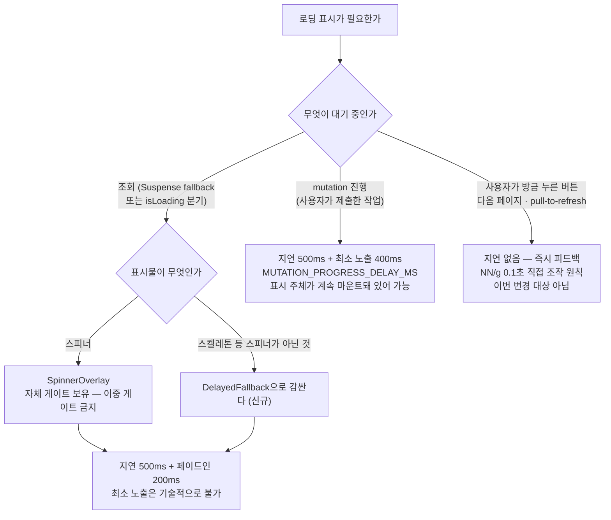

# 로딩 인디케이터 지연 게이트 일관 적용

## Context

빠르게 응답이 오는 화면에서 로딩 인디케이터가 잠깐 보였다 사라지는 깜빡임 제보.

전수 조사 결과 **새 장치를 만들 필요가 없다** — 이 레포엔 이미 `useDelayedLoading`
(`src/shared/hooks/useDelayedLoading.ts:11`)이 있고 조회 로딩의 절반(상세·댓글·lazy 청크·
세션 복원)은 500ms 지연 게이트로 보호되고 있다. 문제는 **나머지 절반(7곳)이 0ms로
즉시 뜬다**는 것이다. 즉 이 작업은 있는 장치를 안 쓰는 곳에 마저 거는 일관화 작업이다.

부수적으로 발견된 것: `LOADING_INDICATOR_DELAY_MS = 300`(`src/shared/config/const.ts:12`)이라는
이름과 달리 이 상수는 조회 로딩에 안 쓰이고 mutation에만 쓰인다. 실제 조회 로딩 값 500은
`SpinnerOverlay.tsx:15`에 근거 주석 없는 매직넘버로 박혀 있다.

**목표**: 500ms 안에 끝나는 조회에는 로딩 인디케이터를 아예 띄우지 않는다.

### 확정된 결정 (사용자 승인 완료)

| 결정                                     | 선택                                           |
| ---------------------------------------- | ---------------------------------------------- |
| 조회 로딩 지연 임계값                    | **500ms**로 확정 (현행 실질값 유지, 회귀 없음) |
| NProgress 상단바                         | **제거**                                       |
| `ProtectedRoute`의 `delay={0}`           | **제거하고 지연 적용**                         |
| 북마크 폴더/정렬 전환 `keepPreviousData` | **후속으로 분리** (이번 범위 제외)             |

### 근거

- [NN/g 응답시간 3한계](https://www.nngroup.com/articles/response-times-3-important-limits/) —
  0.1초=직접 조작감, **1.0초=사고 흐름이 끊기지 않는 한계**. 원문: _"0.1초 초과 1.0초 미만의
  지연에는 보통 특별한 피드백이 필요 없다"_. 500ms는 이 구간 안쪽이다.
- 스켈레톤 가이드라인 — 실제 로드가 400ms~3초일 때만 체감 성능에 도움, **200ms 미만
  로드에는 오히려 해로움**. 표시를 200~300ms 지연시키라는 권고가 표준.
  (출처: 검색으로 확인한 업계 가이드라인 종합. 개별 URL은 `docs/DECISIONS.md` 항목 작성 시 병기)
- 기존 결정과의 연속성: `docs/DECISIONS.md:1258-1311`(2026-08-13)이 이미 "500ms 지연 →
  400ms 최소 노출" 타이밍을 mutation 진행 표시에 확립해 뒀다.

### 기술적 제약 — 조회/mutation 비대칭 (반드시 문서화)

`useMinimumLoading`(최소 노출 보장)을 **Suspense fallback에는 걸 수 없다.** fallback의
수명은 Suspense 경계가 소유하고, React 18.3.1에는 exit lifecycle이 없어 fallback이 스스로
노출을 연장할 방법이 없다. 경계 바깥에서 suspend 여부를 관측할 수도 없다
(`useTransition().isPending`은 최초 마운트 suspend를 커버하지 않는다).

→ 대신 **CSS 페이드인 램프**(`animate-in fade-in duration-200`, 이미 있는 `tw-animate-css`)로
하드 엣지를 없앤다. "지연 500ms + 응답 501ms = 1ms 노출"이 opacity 0.005에서 사라져
눈에 안 보이고, 최소 노출과 달리 **총 대기 시간을 늘리지 않는다.**

이 비대칭은 취향이 아니라 **표시 주체의 소유권 차이**에서 나온다. 문서에 그 근거를 함께
남기지 않으면 나중에 누군가 또 `useMinimumLoading`을 fallback에 넣으려 시도한다.



---

## 구현

### 단계 1 — 기반: 상수 3단 분리 + `DelayedFallback` 신설

값을 통일하지 않고 **이름을 성격별로 나눈다.** 500이 두 개 남지만 각각 이름과 근거 주석이
달려 나중에 한쪽만 조정할 수 있다.

| 상수                                | 값             | 대상                                                                                    |
| ----------------------------------- | -------------- | --------------------------------------------------------------------------------------- |
| `LOADING_INDICATOR_DELAY_MS`        | 300 → **500**  | 조회 로딩 (`SpinnerOverlay`·`DelayedFallback` 기본값)                                   |
| `MUTATION_PROGRESS_DELAY_MS`        | **500 (신규)** | mutation 진행 표시 — `PostMutationLoadingToast`의 `BADGE_DELAY_MS` 승격, 근거 주석 이관 |
| `LOADING_INDICATOR_MIN_DURATION_MS` | 400 (유지)     | mutation 최소 노출 **전용**임을 주석으로 한정                                           |

- `src/shared/config/const.ts:11-14` — 위 표대로 재구성
- **`src/shared/ui/elements/DelayedFallback.tsx` (신규)** — props `{ children, delay?, className? }`.
  `useDelayedLoading(true, delay)` → 지연 전 `return null`, 이후
  `<div className={cn('animate-in fade-in duration-200', className)}>`.
  계약 한 줄: **"마운트돼 있는 동안 = 로딩 중"**. 선례: `SpinnerOverlay.tsx`가 같은 형태,
  `animate-in fade-in` 사용 선례는 `src/widgets/comment/comment-list/ui/CommentItem.tsx:45`
- **`src/shared/ui/elements/DelayedFallback.stories.tsx` (신규, 의무)** —
  `SpinnerOverlay.stories.tsx` 형식을 따른다. `Default`(delay=0) / `WithDelay`(delay=500,
  control) / `SkeletonChild`
- `src/shared/ui/elements/SpinnerOverlay.tsx:15,23` — `delay = 500` → `= LOADING_INDICATOR_DELAY_MS`
  (**값 동일**, 매직넘버만 제거), 루트 className에 페이드인 추가.
  `SpinnerOverlay.stories.tsx`도 같은 커밋에 갱신 (`.claude/CLAUDE.md` 스토리 의무)
- `src/app/ui/PostMutationLoadingToast.tsx:19-22,38` — 로컬 `BADGE_DELAY_MS` 삭제,
  `MUTATION_PROGRESS_DELAY_MS` import (근거 주석은 상수 정의 자리로 이관, 삭제하지 않는다)
- `src/widgets/post/post-card/hooks/usePostCard.ts:19,41` — `MUTATION_PROGRESS_DELAY_MS`로 교체.
  **의도된 300→500 변경**: 카드 오버레이가 전역 진행 토스트(500)와 같은 순간에 뜨게 된다
  (현재는 200ms 어긋남). 게시글 수정은 BE가 URL 크롤링을 동기 수행해 수 초 걸리므로 체감 차이 없음
- `src/shared/ui/elements/AsyncBoundary.tsx:12-15` — JSDoc `@default GlobalLoading`(존재하지 않는
  컴포넌트명) → `SpinnerOverlay`

**검증**: `pnpm type-check` → `pnpm test`(기존 전량 그린) → `pnpm storybook`으로 육안 확인 → `pnpm lint`

### 단계 2 — 지연 게이트 적용 (0ms였던 5곳)

`isLoading` 기반 4곳은 **훅이 아니라 UI에서** 감싼다. 훅 3개
(`useBookmarkPostList`·`useFolderSections`·`useBookmarkFolderSelect`)는 **전부 무변경** —
반환 시그니처가 안 바뀌므로 기존 훅 테스트에 회귀가 없고, 쿼리 훅을 한 줄도 안 건드리므로
FSD/ESLint 규칙 위반 여지도 없다.

> ⚠️ **`if (isLoading)` 조기 반환 가드를 반드시 그대로 유지한다.** 이걸 훅이 돌려주는 지연된
> 값으로 바꾸면 0~500ms 동안 가드를 통과해 바로 다음 줄의 빈 상태 분기
> (`BookmarkPostList.tsx:30` "저장한 북마크가 없어요")에 걸린다 — 스피너 깜빡임보다 나쁜 회귀다.

| 파일:줄                                                                 | 변경                                                                                                                                     |
| ----------------------------------------------------------------------- | ---------------------------------------------------------------------------------------------------------------------------------------- |
| `src/widgets/post/post-list/ui/PostList.tsx:16`                         | `loadingFallback={<DelayedFallback><PostListSkeleton /></DelayedFallback>}`. `PostCardSkeleton.tsx`는 순수 프레젠테이션으로 유지(무변경) |
| `src/widgets/bookmark/bookmark-post-list/ui/BookmarkPostList.tsx:22-28` | 컨테이너 div → `DelayedFallback`, className 이관                                                                                         |
| `src/widgets/bookmark/folder-tree/ui/FolderTree.tsx:86-89`              | 동일                                                                                                                                     |
| `src/widgets/bookmark/folder-tree/ui/MobileFolderList.tsx:77-80`        | 동일                                                                                                                                     |
| `src/entities/bookmark/folder/ui/BookmarkFolderSelectModal.tsx:96-99`   | 동일. `entities → shared` import는 허용                                                                                                  |
| `src/app/routes/index.tsx:41-43`                                        | 주석만 수정 — "delay=0으로 즉시 표시"는 **거짓**(실제 500ms)                                                                             |

**검증**: `pnpm test` (특히 `PostCardBookmarkFolderModal.test.tsx`,
`PostCreateBookmarkFolderField.test.tsx` — 둘 다 `waitFor` 기반이라 안 깨질 것으로 확인됨) →
아래 수동 QA → `pnpm lint`

### 단계 3 — 앱 셸 + 기존 테스트 갱신

- `src/app/routes/ProtectedRoute.tsx:61` — `delay={0}` 제거.
  `git log -S`로 확인 결과 근거 주석 없는 흔적이고, 같은 인증 복원 대기를
  `AppShellLayout.tsx:20`은 이미 기본 게이트로 처리 중이라 정책이 갈려 있었다
- `src/app/providers/RouterProvider.tsx:4,17` — raw `<Spinner>`(중앙정렬조차 없어 좌상단에 뜬다)
  → `<SpinnerOverlay className="h-screen" />`. 미사용이 된 `Spinner` import 제거
  (`lint --max-warnings 0`에 걸린다)
- `src/app/routes/ProtectedRoute.test.tsx:71-79` — **최우선 회귀 지점**. 계약 2개로 분리:
  1. 복원 전엔 children도 리다이렉트도 렌더하지 않는다 (동기 단언, 지연 값과 무관)
  2. 복원이 길어지면 지연 후 스피너를 띄운다 (fake timers + `act(() => vi.advanceTimersByTime(...))`)

  현재는 `waitFor` 기본 timeout 1000ms라 500ms도 통과하지만, CI 부하 시 플레이키해진다.
  ⚠️ 이 파일은 MSW를 쓰므로 **fake timers를 `beforeEach` 전역에 켜지 말 것** — refresh 요청이
  관여하는 케이스에서 요청이 영원히 pending된다. 해당 `it` 안에서만 켠다

**검증**: `pnpm test src/app/routes/ProtectedRoute.test.tsx` → `pnpm test -- --sequence.shuffle`
(`docs/TESTING.md` §7의 `isAuthResolved` 누수 함정 재확인)

### 단계 4 — NProgress 제거

`src/entities/post/api/post.api.ts:37-39,52-56`은 3-Layer API의 **Layer 1(순수 fetch)에 UI
타이밍 로직이 박혀 있는** 계약 위반이고, `refetchOnWindowFocus: true`(`queryClient.ts:159`)
때문에 **탭 복귀할 때마다 이미 보이는 목록 위로 상단바가 번쩍인다** — 제보된 증상의
가장 순도 높은 사례다. 역할도 중복이다(콜드 로드=스켈레톤, 당겨서 새로고침·다음 페이지=각자 인디케이터).

- `src/entities/post/api/post.api.ts:2,5,37-39,52-56` — import·`configure`·`start`/`finally` 제거
- `src/app/globals.css:3,283-291` — `@import 'nprogress/nprogress.css'`와 `#nprogress` 규칙 **전부**
  (`@import`만 지우고 커스텀 규칙을 남기면 죽은 CSS가 된다)
- `pnpm remove nprogress @types/nprogress` — lockfile 변경. 별 커밋으로 분리해도 됨

**검증**: `pnpm build` → 수동: 피드에서 탭 전환 후 복귀 시 상단바가 더 이상 번쩍이지 않는지

### 단계 5 — 타이밍 훅 테스트 (신규 3개)

`useDelayedLoading`이 이제 **모든 조회 로딩 UI의 단일 게이트**가 된다 — 여기가 잘못
동작하면 앱이 영구 백지가 되는데 현재 전용 테스트가 0개다.
`docs/plans/2026-09-08-selective-test-coverage.md`의 "단일 실패점" 기준에 해당.

- `src/shared/hooks/useDelayedLoading.test.ts` — 경계값(299/300ms) / 만료 전 취소
  (`clearTimeout` 검증) / 켜진 뒤 즉시 off / `delay=0`도 매크로태스크를 거친다는 사실 고정
  (`docs/TESTING.md:676-686`이 서술만 해둔 것을 테스트로) / 연속 토글
- `src/shared/hooks/useMinimumLoading.test.ts` — ⚠️ `useMinimumLoading.ts:52`가 `Date.now()`를
  쓰므로 fake timers에 **`Date`가 포함되도록 명시**할 것(선례: `useAppVersionCheck.test.ts:45`).
  안 그러면 `elapsedTime`이 실시간을 읽어 케이스가 조용히 무의미해진다
- `src/shared/ui/elements/DelayedFallback.test.tsx` — 지연 전 자식 미렌더 / **Suspense 안에서
  지연 만료 전에 자식이 resolve되면 fallback이 DOM에 한 번도 안 나타난다** (이번 작업의
  사용자 가치를 그대로 표현하는 테스트)

공통: `vi.useFakeTimers()` + `afterEach(() => vi.useRealTimers())`, 시간 진행은
`act(() => vi.advanceTimersByTime(n))`. **fake timers와 `waitFor`를 섞지 않는다.**

### 단계 6 — 문서

- `docs/FE-ARCHITECTURE.md` — §12(`:602`)와 §13(`:628`) 사이에 **"12-A. 로딩 UX 규약 — 지연
  게이트"** 삽입(번호 재배치는 `check:docs`가 검증하는 다른 문서의 줄 참조를 깨뜨릴 수 있으니
  삽입이 안전). 담을 것: 원칙 한 줄 / 3단 상수 표 + 근거 링크 / **조회·mutation 비대칭과
  "Suspense fallback은 자기 노출을 연장할 수 없다"는 기술적 사실** / 적용 방법 3가지
  (`SpinnerOverlay` 이중 게이트 금지, `isLoading` 조기 반환 가드 유지 포함) / 논외 목록
  (버튼 `isPending`·`isFetchingNextPage`·pull-to-refresh) / 후속 2건
- `docs/DECISIONS.md` — `:1258` 항목 위에 신규 항목(배경/검토/결정/상태 포맷 유지).
  2026-08-13 항목과 상호 참조. 기각 근거를 남길 것: 각 fallback에 훅 복제 / fallback 최소
  노출(불가) / NProgress에 지연 추가(Layer 1 계약) / `keepPreviousData`(후속).
  ⚠️ `:1305-1307`이 `PostMutationLoadingToast`를 `shared/ui/elements/`로 적어뒀는데 실제는
  `src/app/ui/` — 이번에 그 파일을 건드리므로 같이 정정
- `docs/TESTING.md:676-686` — §8 제목이 `SpinnerOverlay` 한정인데 이제 `DelayedFallback`·
  스켈레톤·북마크 스피너 전부에 해당. "지연 게이트가 걸린 로딩 UI는 렌더 직후엔 안 보인다"로
  일반화 + fake timers 사용법 추가
- `CHANGELOG.md` `[Unreleased] > Changed` — 스코프 `shared`, 기존 `<details>` 포맷

---

## 회귀 위험

| #   | 위험                                                                                        | 대응                                                             |
| --- | ------------------------------------------------------------------------------------------- | ---------------------------------------------------------------- |
| A   | `ProtectedRoute.test.tsx:71-79` — 500ms를 잡아먹고 CI 부하 시 플레이키                      | 단계 3에서 계약 2개로 분리                                       |
| B   | **빈 상태 플래시** — `isLoading` 가드를 지연된 값으로 바꾸면 "북마크가 없어요"가 0.5초 뜬다 | 조기 반환 가드 유지(단계 2). 코드 리뷰 체크리스트에 명시         |
| C   | `usePostCard` 카드 오버레이 300→500ms                                                       | 의도된 변경. 진행 토스트와 같은 순간에 뜨는지 확인               |
| D   | `SpinnerOverlay` 페이드인이 **9곳에 동시 반영**                                             | opacity만 바뀌므로 레이아웃 시프트 없어야 정상. 스토리 갱신 의무 |
| E   | NProgress 제거로 배경 재조회 신호 상실                                                      | 의도됨. 전역 `useIsFetching` 진행바를 후속 후보로 문서에 남김    |
| F   | `RouterProvider` 미사용 `Spinner` import                                                    | 같이 제거 (`--max-warnings 0`)                                   |
| G   | 폴더 선택 모달 첫 열기 시 다이얼로그 높이 점프 (`enabled: open`)                            | 튀면 `DelayedFallback`에 `min-h-[…]`                             |
| H   | `check:docs` 줄 번호 밀림 (`post.api.ts` 감소, `const.ts` 증가)                             | 최종 검증에 반드시 포함                                          |
| I   | StrictMode 이중 실행으로 dev에서 지연이 길어 보임                                           | 프로덕션 무영향. `pnpm build:dev` → `pnpm preview`로 재확인      |

**범위 밖으로 확인된 것**: 피드의 필터·검색·봇숨기기 전환은 `RouterProvider.tsx:20`
`v7_startTransition: true` + `PostListSearch.tsx:53-70`의 `flushSync`/`startTransition`으로
**이미 해결돼 있다**(스켈레톤으로 안 떨어진다). 코드 변경 없음, 수동 QA로 확인만 한다.
`prefetchCategoryData`(`category.queries.ts:22`)는 호출부 0건인 죽은 코드지만 무관하므로
보고만 하고 지우지 않는다.

---

## 검증

### 수동 QA (핵심 — 타이밍은 테스트로 못 잡는다)

DevTools Network를 **No throttling**과 **Fast 3G** 두 조건으로 각각:

- 피드 새로고침 → 캐시 있을 때 스켈레톤이 **안 뜨는지**
- 북마크 폴더 hover 후 클릭 → 기존 hover prefetch(`bookmark-folder.queries.ts:76`) 덕에
  스피너 **없이** 전환되는지 (지연 게이트와 prefetch가 맞물리는 지점)
- 북마크 폴더를 hover 없이 클릭 → 500ms 후 스피너가 **페이드인**되는지
- 북마크 정렬 변경 → 빈 상태 문구가 **뜨지 않는지** (위험 B)
- 폴더 선택 모달 첫 열기 → 다이얼로그 높이가 튀지 않는지 (위험 G)
- 피드 탭 전환 후 복귀 → 상단바가 번쩍이지 않는지 (단계 4)
- 로그아웃 상태로 `/bookmark` 직접 진입, 로그인 상태로 `/bookmark` 새로고침 (단계 3)
- 피드 필터 칩·검색·봇 숨기기 토글 → 목록이 스켈레톤으로 떨어지지 않는지 (범위 밖 확인)

### 자동 검증 (`.claude/CLAUDE.md` 순서 그대로)

```bash
pnpm type-check   # tsc -b --noEmit
pnpm test
pnpm lint
pnpm check:docs   # 문서가 인용한 파일:줄이 실존하는지 — 단계 4·6 때문에 필수
```

### 작업 환경

`.claude/CLAUDE.md`의 워크트리 규칙에 따라 `EnterWorktree`로 워크트리를 만들고
진입 직후 `cp ../../../.env . && pnpm install`. 시작 전 `git log origin/main..main`으로
미푸시 커밋 확인, `git worktree list`로 잔존 워크트리 정리.

PR 전 `.claude/CLAUDE.md` §11에 따라 이 계획을 `docs/plans/2026-09-10-loading-delay-gate.md`로
커밋하고, fresh Explore subagent에게 계획 대비 구현 대조를 맡겨 PR 본문에
`## 계획 대비 구현` 섹션으로 남긴다.
