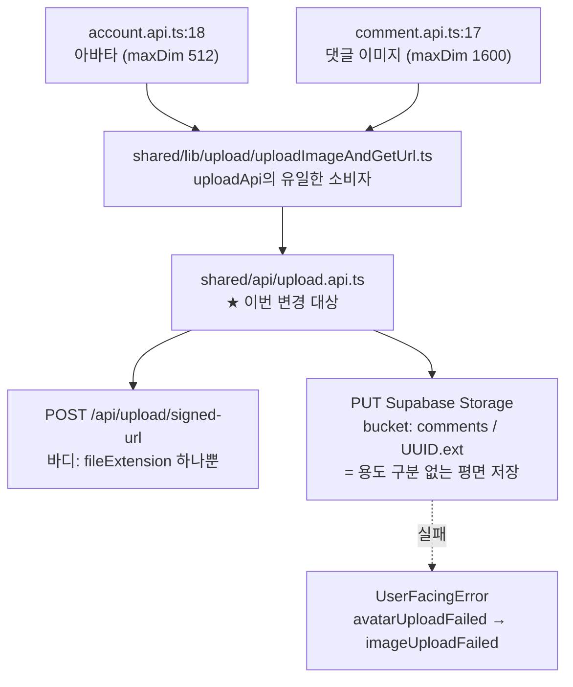

# upload.api.ts의 어긋난 신호 정리 (TEXTS 키 리네임 + JSDoc)

## Context

`src/shared/api/upload.api.ts`를 열었을 때 "이게 무슨 upload인지" 알 수 없다는 지적에서 출발했다.
조사 결과 **파일명은 문제가 아니었다**:

- BE 엔드포인트는 `POST /api/upload/signed-url` 하나뿐이고 요청 바디는 `fileExtension` 문자열
  하나다 (BE `UploadDTO.kt:3`, `UploadController.kt:14`). 용도를 넘길 필드가 존재하지 않는다.
- 저장도 버킷 루트에 `<UUID>.<ext>` 평면 구조라 prefix 개념이 없다
  (BE `SupabaseStorageService.kt:38-39`). 아바타와 댓글 이미지가 `comments` 버킷에 섞여 저장된다.
- v0.9.0에서 `POST /auth/account/avatar`를 제거하고 이 범용 엔드포인트로 통합한 결과다
  (BE `docs/VERSION-COMPATIBILITY.md:38`).

즉 파일명에 더 좁은 이름을 붙이면 오히려 거짓말이 된다. 파일명은 `API_ENDPOINTS.upload`
(`src/shared/config/api.ts:16`)를 미러링한 것이고 이 레포 `.api.ts` 9개가 전부 같은 규칙이다.

혼란의 실제 원인은 **파일 안에서 서로 어긋나는 신호 두 개**다:

1. 파일명은 범용(`upload`)인데 던지는 에러 키는 아바타 전용(`avatarUploadFailed`)이다.
   값(`'이미지 업로드에 실패했어요.'`)은 이미 범용이라 사용자 화면에는 문제가 없지만, 지금
   **댓글 이미지 업로드가 실패해도 이 키가 뜬다**. 키 이름이 코드를 읽는 사람에게만 거짓말한다.
2. "이게 범용"이라는 사실이 파일 어디에도 적혀 있지 않다. 소비자
   (`uploadImageAndGetUrl.ts`)의 주석에만 "아바타 512, 댓글 이미지 1600"이 나온다.

의도한 결과: 파일을 열자마자 범용임을 알 수 있고, 키 이름이 실제 사용 범위와 일치한다.
동작(사용자 노출 문자열, 네트워크 호출)은 전혀 바뀌지 않는다.



## 변경 내용

### 1. `src/shared/config/texts.ts`

`:349` `avatarUploadFailed` → `imageUploadFailed`. **값 문자열은 그대로 둔다**
(`'이미지 업로드에 실패했어요.'`) — 이미 범용 문구이고, 바꾸면 톤 가드 테스트 대상이 된다.

같은 리네임의 논리적 귀결로 **키 위치도 옮긴다**: 지금은 `// 인증 관련` 섹션(`:334` 아래)에
`accountUpdateFailed`·`nicknameDuplicate`와 붙어 있는데, 이는 "아바타=계정"이던 시절의 잔재다.
범용 키가 됐으므로 `// 유틸` 섹션(`:377`, `linkCopyFailed` 옆)으로 옮긴다 — 도메인 무관 공용
동작의 실패라는 성격이 같다. 키 하나뿐이라 새 섹션 주석은 만들지 않는다.

### 2. `src/shared/api/upload.api.ts`

`:29`의 참조를 `TEXTS.messages.error.imageUploadFailed`로 바꾸고, JSDoc을 추가한다.

주석 스타일은 같은 디렉토리 이웃인 `fcm.api.ts`(함수마다 한 줄 `/** */` 한글 명사구,
`@param`/`@returns` 미사용)와 `uploadImageAndGetUrl.ts`(멀티라인 JSDoc에 산문 평서체로 "왜"를
서술)를 따른다. 파일 최상단 주석은 이 레포에 선례가 없으므로 만들지 않고 `export const uploadApi`
바로 위에 붙인다.

담을 내용 (요지만 — 정확한 문장은 구현 시 확정):

- `uploadApi`객체 위: BE가 서명 URL 발급만 하는 **범용** 엔드포인트라는 것, 용도별 분기가
  BE·스토리지 어디에도 없어 아바타와 댓글 이미지가 같은 버킷에 섞인다는 것, 직접 부르지 말고
  `uploadImageAndGetUrl`을 쓰라는 것.
- `uploadFileDirectly` 위: **`apiClient`가 아니라 raw `fetch`를 쓰는 이유**. 대상이 우리 BE가
  아니라 Supabase Storage라 `apiClient`의 인증 헤더·인터셉터를 태우면 안 된다. 이걸 안 적어두면
  CLAUDE.md의 "API 레이어 건너뛰기 금지" 규칙과 충돌하는 것처럼 보여 다음 감사 때 또 걸린다
  (실제로 `shared/lib/firebase/fcm.ts`가 같은 이유로 2026-09-09 감사에 걸렸는데, 그건 우리 BE를
  부르던 진짜 위반이었고 이건 아니다 — 이 구분이 주석 없이는 안 보인다).

### 손대지 않는 것

- 파일명 `upload.api.ts` (Context 참조 — 지금이 맞다)
- 동작·시그니처·네트워크 호출 일체
- BE 레포. 조사 중 발견한 두 건(`application-secret.yml`에 Supabase service_role 키 평문 커밋,
  확장자 allowlist의 `svg` + 내용 미검증으로 인한 저장형 XSS 표면)은 **범위 밖이라 언급만 하고
  건드리지 않는다**. 별건으로 다룰지는 사용자 판단.

## 영향 범위 점검

전수 grep 결과 `avatarUploadFailed`는 레포 전체(`src/`·`docs/`·`.claude/`·테스트·스토리·스크립트)에
**정의 1곳 + 참조 1곳, 총 2건뿐**이다. 따라서:

- **회귀 위험 없음** — `TEXTS`는 `as const` 객체라 리네임 누락이 있으면 `tsc`가 즉시 잡는다.
  런타임까지 새어나갈 수 없는 종류의 변경이다.
- `src/shared/config/texts.test.ts`는 톤(해요체)만 검사하고, 키 이름을 하드코딩한 곳은
  `LOG_ONLY_KEYS`(`:23-27`) 3개뿐인데 이 키는 거기 없다 → **테스트 수정 불필요**.
- ESLint 커스텀 규칙 9개 중 TEXTS 키 네이밍을 강제하는 것은 없다 (`custom-i18n/no-hardcoded-hangul`은
  값만 검사하고 `texts.ts` 자체는 ignore 대상). → **린트 영향 없음**.
- CRUD 관점: 이 변경은 데이터 계약(스키마·DTO·API 형태)을 건드리지 않으므로 배포 순서 이슈 없다.
- `CHANGELOG.md` **갱신 대상 아님** — 사용자 노출 문자열과 동작이 동일한 내부 리팩터링이다
  (CLAUDE.md 기준: `feat`/`fix`/`perf`/"동작이 바뀌는" `refactor`만 대상).
- `pnpm check:docs` 불필요 — `README.md`·`docs/*.md`·`.claude/CLAUDE.md`를 수정하지 않는다.

## 작업 절차

1. `git log origin/main..main`으로 미푸시 커밋 확인 → `EnterWorktree`로 워크트리 생성
   (CLAUDE.md: 코드 수정은 워크트리 필수)
2. 워크트리 부트스트랩: `cp ../../../.env .` && `pnpm install`
3. `texts.ts` 리네임 + 위치 이동 → verify: `grep -rn avatarUploadFailed src/`가 0건
4. `upload.api.ts` 참조 수정 + JSDoc 추가 → verify: `pnpm type-check` 통과
5. 커밋 (`.gitmessage` 형식 확인 후, `git commit -- <경로>`로 대상 직접 지정 — `git add` 금지)

## 검증

CLAUDE.md "작업 후 검증" 순서를 그대로 따른다:

```bash
pnpm type-check   # 필수. TEXTS는 as const라 리네임 누락 시 여기서 잡힌다 = 강한 성공 기준
pnpm test         # texts.test.ts(톤 가드) + comment.api.test.ts(업로드 mock) 통과 확인
pnpm lint         # import 변경은 없지만 관례상 실행
grep -rn "avatarUploadFailed" src/ docs/ .claude/   # 0건이어야 함
```

추가로 실제 화면 확인이 필요하면 `pnpm dev` 후 댓글에 이미지를 첨부해 업로드를 실패시켜
(네트워크 오프라인 또는 DevTools에서 Supabase PUT 차단) 토스트 문구가 `'이미지 업로드에
실패했어요.'` 그대로인지 본다 — 다만 값 문자열을 안 바꿨으므로 이 확인은 선택이다.
