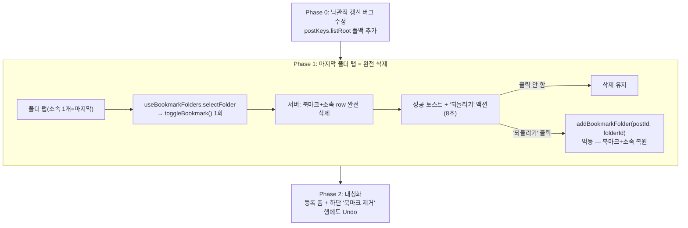

# 북마크 마지막 폴더 해제 시 완전 삭제 + 낙관적 갱신 버그 수정

## Context

사용자가 "폴더 1곳에만 속한 북마크를 그 폴더에서 빼면 미분류로 남는데, 이건 진짜
제거돼야 하는 것 아니냐"고 문제 제기했다. 조사 결과 "미분류로 남기는 것" 자체는
의도된 기존 설계였고(`docs/BOOKMARK.md:121-123`, "폴더에서 제거 ≠ 북마크 제거"),
완전 삭제 수단은 이미 모달 하단 "북마크 제거" 행으로 존재했다.

그런데 사용자가 실제로 그 "북마크 제거" 행을 눌러보니:

- 미분류 상태에서 누르면 **아무 반응이 없는 것처럼 보였고**
- 폴더 소속 상태에서 누르면 **완전 삭제가 아니라 미분류로 이동한 것처럼 보였다**

코드 추적 결과 이 두 증상은 전부 `useBookmarkPostMutation`
(`src/entities/interaction/api/interaction.queries.ts:97-236`)의 **낙관적 갱신
방향 계산 버그** 하나에서 나온다 — 메인 피드(`/post`)에서 조작하면 현재 북마크
상태를 잘못된 기본값(`false`)으로 계산해 서버는 정상 삭제했는데 화면만 안
바뀐 것처럼 보인다.

이 버그를 확인하는 과정에서 사용자는 "그렇다면 마지막 폴더를 뺄 때 미분류로
남기지 말고 그 자리에서 바로 완전 삭제하자"는 방향으로 결정했다(대화 중 "ㅇㅇ
빼는게 낫겟다"). 이 새 동작도 결국 같은 `useBookmarkPostMutation`을 호출하므로,
**버그 수정이 새 기능보다 먼저 들어가야** 새 기능도 메인 피드에서 정상 동작한다.

## 핵심 발견 (코드로 확정)

### 버그: `useBookmarkPostMutation`이 `postKeys.listRoot` 캐시를 조회만 하고 안 쓴다

`interaction.queries.ts:103-131`:

```ts
const previousPost = queryClient.getQueryData<Post>(postKeys.detail(postId));
const previousLists = queryClient.getQueriesData(...postKeys.listRoot...); // 조회만 함
...
const cachedFolderPost = previousPost ? undefined : previousFolderPosts.find(...);
const wasBookmarked =
  previousPost?.userInteractions.isBookmarked ??
  cachedFolderPost?.userInteractions.isBookmarked ??
  false;   // ← previousLists는 후보에 없음
const nextBookmarked = !wasBookmarked;
```

메인 피드에서 조작하면(상세 페이지·`/bookmark` 페이지를 거치지 않은 경우)
`previousPost`도 `cachedFolderPost`도 없어 `wasBookmarked`가 항상 `false`로
잘못 계산된다. 패치 코드(`:139`, `:168`)는 방향과 무관하게 항상
`bookmarkFolderIds: []`를 쓴다.

| 클릭 전 상태                               | 버그로 계산된 방향 | 낙관적 패치 결과    | 사용자가 본 것              |
| ------------------------------------------ | ------------------ | ------------------- | --------------------------- |
| 미분류 (`isBookmarked=true, folderIds=[]`) | 잘못 "추가"        | 원래와 동일         | 아무 반응 없음              |
| 폴더 소속 (`folderIds=[A]`)                | 잘못 "추가"        | `folderIds=[]`만 빔 | 미분류로 이동한 것처럼 보임 |

`onSuccess`가 부르는 `handleBookmarkToggleSuccess`
(`entities/bookmark/folder/api/bookmark-folder.keys.ts:70-73`)는 `folder.list`/
`folder.postsRoot`만 무효화하고 `postKeys.detail`/`postKeys.list`는 무효화하지
않으므로, 잘못된 화면이 staleTime(3분) 동안 그대로 남는다.

같은 종류의 구멍이 `bookmark-folder.queries.ts:205-230`의
`resolveCurrentBookmarkState`에도 있다(`postKeys.listRoot` 미조회). 이 함수는
`useAddBookmarkFolderMutation`/`useRemoveBookmarkFolderMutation`/
`useClearBookmarkFoldersMutation`의 낙관적 갱신에 쓰이므로, 이번에 추가하는
"Undo(되돌리기)" 액션도 같은 구멍을 밟는다.

### 기존 설계 확인 (변경 대상)

- `useBookmarkFolders.ts:37-43`의 `selectFolder`는 마지막 폴더든 아니든 동일하게
  `removeBookmarkFolder(folderId)`만 호출한다 — 마지막 폴더 특별 분기 없음.
- `usePostCardBookmarkFolderModal.ts:80-109`의 `handleSelectFolder`는
  `isLastFolder`를 이미 계산해두고(`:84`) 있지만 지금은 **토스트 문구만** 바꾼다.
- BE는 변경 불필요 — `POST /bookmark/{postId}/folders/{folderId}`
  (`addBookmarkFolder`)가 "북마크 보장 + 소속 보장"으로 멱등하게 동작하므로
  (`InteractionService.kt:81-96`, `ON CONFLICT DO NOTHING`), 삭제 후 되돌리기를
  정확히 원복할 수 있다.

## 구현 방향



**Phase 0 — 낙관적 갱신 버그 수정 (선행)**

- `bookmark-folder.queries.ts`의 `resolveCurrentBookmarkState`(`:205-230`)에
  `postKeys.listRoot` 폴백 추가 후 `export`.
- `interaction.queries.ts`의 `useBookmarkPostMutation`이 자체 계산 대신 이
  함수를 import해서 사용 (중복 로직 제거).
- 회귀 테스트: `postKeys.list()`만 캐시에 심고(detail·folder 캐시 없음) 토글
  → 방향이 올바르게 계산되는지 검증.

**Phase 1 — 마지막 폴더 탭 = 북마크 완전 삭제 + Undo**

- `useBookmarkFolders.ts:37-43` `selectFolder`: 소속이 이 폴더 1개뿐이면
  `removeBookmarkFolder` 대신 `toggleBookmark()` 호출. 되돌리기용
  `restoreFolder(folderId)`(= `addBookmarkFolder` 재노출) 추가.
- `usePostCardBookmarkFolderModal.ts:80-109`: `isLastFolder` 분기를 "삭제 성공
  토스트 + '되돌리기' action"으로 교체. 기존 `viewSavedOptions('uncategorized')`
  호출 제거(더 이상 갈 폴더가 없음).
- `shared/config/const.ts`: `UNDO_TOAST_DURATION_MS = 8000` 추가(기본 4초는
  판단·클릭에 짧음).
- `texts.ts`: `bookmarkAutoUncategorizedDescription`(`:325`, 유일 사용처 삭제로
  미사용) 제거. `bookmark.folder.undoAction`(`'되돌리기'`),
  `messages.error.bookmarkRestoreFailed`(`'되돌리지 못했어요.'`) 신설.
  `messages.success.bookmarkRemovedFromFolder(name)`(`:323`)은 그대로 재사용.
- `useBookmarkFolderSelect.ts:60-73`의 미분류 재탭 no-op 주석(`:61-64`) 근거
  갱신: "미분류는 지울 row가 없는 파생 상태라 되돌릴 대상(folderId)이 없다"로
  교체(현재 근거였던 "북마크 제거 행과 중복"은 이제 자기모순이 되므로).
- 모달 단위 pending 잠금: `useBookmarkFolderSelect.ts`가 특정 행뿐 아니라 전체
  행을 pending 중 비활성화하도록 보강(파괴적 조작이 생겼으므로 in-flight 중
  다른 행 탭으로 꼬이는 걸 방지).

**Phase 2 — 대칭화**

- `usePostCreateBookmarkFolderField.ts:42-50`: 등록 폼도 마지막 폴더 해제 시
  `applySelection(false, [])`(북마크 안 함)로 변경 — 폼 값만 바뀌는 지연
  선택이라 API 호출 없음, 손실 위험 없음.
- 하단 "북마크 제거" 행(`handleRemove`, `usePostCardBookmarkFolderModal.ts:111-118`):
  소속 0~1개일 때 동일하게 되돌리기 토스트 제공(소속 2개 이상 일괄 복원은
  범위 밖, 후속 과제로 명시).

## 영향받는 테스트

- `PostCardBookmarkFolderModal.test.tsx:112-130` — 현재 유일한 폴더 소속
  1개(=마지막 폴더) 상태를 기본값으로 쓰는 "제거 요청을 보낸다" 테스트가
  깨진다. 다중 소속(`[FOLDER_A, FOLDER_B]`)에서 폴더 제거 케이스와, 단일
  소속에서 토글 삭제되는 케이스로 분리.
- `bookmark-folder.queries.test.ts:226` — 엔티티 계약(`useRemoveBookmarkFolderMutation`)
  자체는 안 바뀐다(계속 소속 2개 이상일 때 쓰임). **변경 불필요.**
- `PostCreateBookmarkFolderField.test.tsx:116` — Phase 2 적용 시 기대값이
  "미분류로 남는다"에서 "북마크 안 함으로 돌아간다"로 바뀜.
- 신규: `interaction.queries.test.ts`에 `postKeys.list()`만 심은 상태의 토글
  회귀 테스트 추가(Phase 0).

## 문서 갱신

- `docs/BOOKMARK.md` §5(`:121-144`, 다중 폴더 소속 모델·행 동작 표) — "폴더에서
  제거 ≠ 북마크 제거" 규칙을 "마지막 폴더는 예외 — 완전 삭제 + 되돌리기"로 수정.
- `docs/DECISIONS.md` 신규 항목 — 이번 결정과 근거(NN/g undo 원칙, 버그 발견
  경위) 기록.
- `CHANGELOG.md` `[Unreleased]` — Fixed(낙관적 갱신 버그) + Changed(마지막 폴더
  동작 변경) 각각 항목 추가.
- BE `README.md`/`docs/` — 변경 불필요(BE 계약 무변경).

## 검증 방법

1. `pnpm type-check`, `pnpm lint`
2. `pnpm test` — 위 수정·신규 테스트 포함 전체 통과
3. 수동 시나리오(dev 서버):
   - 메인 피드에서 새 글 북마크 → 폴더 선택 → 그 폴더 탭으로 해제 → 카드가
     즉시 미북마크 상태로 바뀌고 "되돌리기" 토스트 노출 → 되돌리기 클릭 →
     원래 폴더로 복원되는지 확인
   - 상세 페이지 진입 후 "북마크 제거" 행으로 동일 시나리오 재확인(버그
     수정 전에는 이 경로만 정상이었으므로 회귀 없는지 확인)
