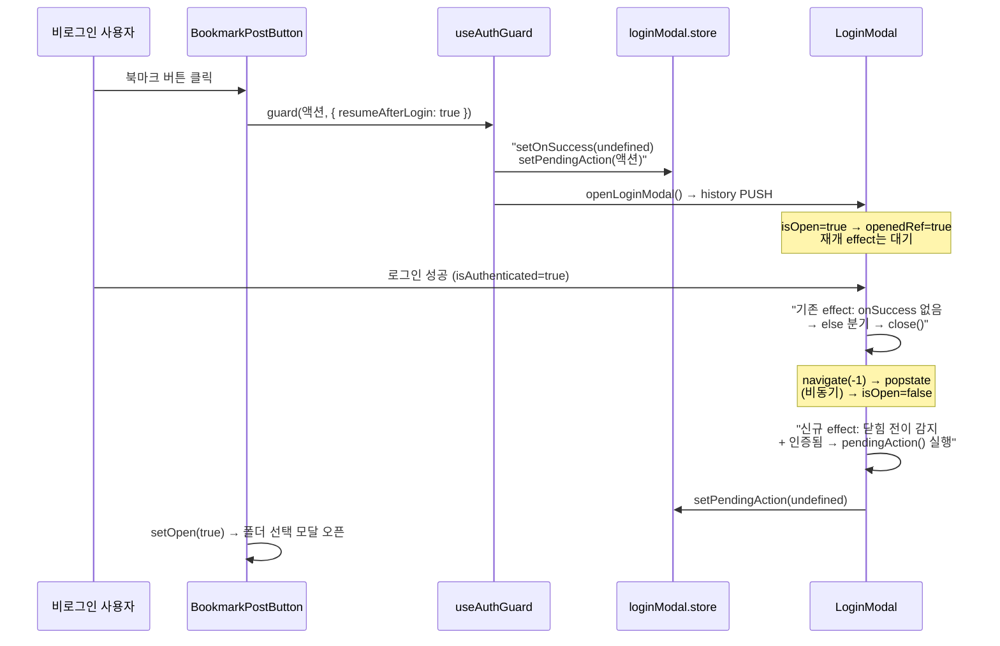

# 비로그인 북마크 → 로그인 후 자동 재개 + 공유 아이콘 fill 버그 수정

## Context

"첫 로그인 사용자를 위한 북마크 튜토리얼이 있으면 어떨까"라는 논의에서 출발했다. 조사 결과
이 앱에는 온보딩·투어·도움말이 전혀 없고(`onboarding|tutorial|guide|tour|firstVisit|hasSeen`
전역 grep 실질 히트 0건), 빈 상태도 CTA 없는 텍스트 한 줄뿐이라 첫 사용자가 북마크 사용법을
알 방법이 없다는 것이 확인됐다.

다만 해법으로 **튜토리얼/투어는 채택하지 않기로 했다.** NN/g가 모바일 튜토리얼을 실측한
[Mobile Tutorials: Wasted Effort or Efficiency Boost?](https://www.nngroup.com/articles/mobile-tutorials/)에서
과제 성공률은 튜토리얼을 본 그룹 91% / 건너뛴 그룹 94%로 차이가 없었고, 오히려
_"participants who read tutorials perceived tasks as more difficult"_ 였다. 같은 곳의
[Designing Empty States in Complex Applications](https://www.nngroup.com/articles/empty-state-interface-design/)는
_"In-context learning cues ... In most cases, this approach is generally more successful than
forced tutorials shown to the user at initial use."_ 라고 권고한다.

**사용자 결정(2026-09-11): 온보딩 UI(빈 상태 CTA·툴팁·폴더 0개 안내)는 이번 범위에서 보류하고,
발견된 버그 2건을 먼저 처리한다.** 온보딩 UI는 §9(시각적 변경은 미리보기 먼저) 대상이므로
별도 작업으로 남긴다.

이번 작업의 범위는 두 가지다:

1. **비로그인으로 북마크를 시도한 사용자가 로그인해도 아무 일이 일어나지 않는 문제.**
   지금은 `useAuthGuard`가 콜백을 의도적으로 버린다(`useAuthGuard.ts:10,23` 주석 — 설계였다).
   첫 북마크를 시도한 사람이 로그인 직후 빈손이 되는 지점이라 이번에 바꾼다.
2. **공유 아이콘이 북마크 상태로 채워지는 버그.** `PostCard.tsx:286-288`에서 `Share2`의
   `fill-current`가 `isBookmarked`에 묶여 있어, 북마크하면 공유 아이콘이 채워져 "공유됨"처럼
   보인다.

## 핵심 제약 — 왜 단순히 콜백을 넘기면 안 되는가

`loginModal.store`의 `onSuccess` 채널은 **콜백이 스스로 navigate한다는 것을 전제로** 설계돼
있다. `LoginModal.tsx:44-46`은 `onSuccess` 실행 후 `close()`를 **부르지 않는데**, 그 navigate가
이미 히스토리 엔트리를 벗어나기 때문이다(28-35행 주석). `setOpen(true)` 같은 비-navigate
콜백을 이 채널에 태우면 **로그인 모달이 안 닫힌 채 폴더 모달이 위에 겹친다.**

그래서 채널을 물리적으로 분리한다.

| 채널                   | 계약                                | 생산자                                                | LoginModal의 처리                             |
| ---------------------- | ----------------------------------- | ----------------------------------------------------- | --------------------------------------------- |
| `onSuccess` (기존)     | 스스로 navigate해 엔트리를 벗어난다 | `ProtectedRoute.tsx:55`, `useProtectedNavigate.ts:26` | `close()` 안 부름 (무변경)                    |
| `pendingAction` (신규) | navigate하지 않는 재개 액션         | `useAuthGuard` (opt-in)                               | 기존 else 분기가 `close()` → **닫힌 뒤** 실행 |

`pendingAction`을 쓰면 `onSuccess`가 `undefined`이므로 `LoginModal.tsx:47-50`의 **기존 else
분기가 그대로 `close()`를 부른다.** 즉 기존 effect는 한 줄도 고치지 않는다.

**실행 시점이 "성공 직후"가 아니라 "닫힌 뒤"인 이유**: `close()`는 `navigate(-1)`이고 popstate를
거쳐 비동기로 반영된다(`useHistoryOverlay.ts:39-46`). 같은 틱에 실행하면 로그인 모달이 아직
DOM에 있는 채로 폴더 모달이 겹쳐 뜬다 — `useHistoryOverlay.ts:8` 주석이 "오버레이를 겹쳐
쌓지 않는 것을 전제"라고 못박은 그 상황이다.

## 재개는 opt-in — 전면 허용하면 안 되는 이유

`useAuthGuard` 사용처 4곳을 전부 확인했다. 전면 허용은 원 주석의 우려(의도치 않은 쓰기)를
넘어 **구체적 버그**를 낳는다.

| 사용처                      | 액션            | 재개 | 근거                                                                                                                                |
| --------------------------- | --------------- | ---- | ----------------------------------------------------------------------------------------------------------------------------------- |
| `BookmarkPostButton.tsx:32` | `setOpen(true)` | ✅   | 서버 쓰기 없음. 폴더 모달에서 한 번 더 탭해야 저장됨                                                                                |
| `LikePostButton.tsx:17`     | `likePost()`    | ❌   | 즉시 쓰기 + **토글**이라, 로그인 후 refetch로 이미 `isLiked=true`면 재개가 **좋아요를 취소**한다                                    |
| `LikeCommentButton.tsx:24`  | 동일            | ❌   | 동일                                                                                                                                |
| `useCreateComment.ts:42`    | 댓글 POST       | ❌   | 쓰기인 데다 가드 내부 첫 줄이 `if (!account) { return; }`라 클릭 시점 클로저의 `account`가 `undefined` → 재개해도 **조용한 무반응** |

opt-in을 훅 옵션이 아니라 **호출부 인자**(`guard(action, { resumeAfterLogin: true })`)로 두어,
"이 action이 쓰기인가"를 action 바로 옆에서 판단할 수 있게 한다. 기존 3개 호출부는 선택
인자라 무변경이다.

## 구현 단계

### 1. `pendingAction` 채널 추가

`src/shared/store/loginModal.store.ts` (현재 12줄) — `pendingAction?: () => void` +
`setPendingAction`을 `setOnSuccess`와 동일한 형태로 추가. JSDoc에 **두 채널의 계약 차이**를
남긴다(위 표의 내용 — navigate형/비-navigate형, 섞으면 모달이 겹치는 이유).

→ 검증: `pnpm type-check`

### 2. `useAuthGuard`에 opt-in 옵션

`src/entities/auth/hooks/useAuthGuard.ts:17-28`

- `interface AuthGuardOptions { resumeAfterLogin?: boolean }`
- 시그니처: `(action: () => void, options?: AuthGuardOptions) => void`
- 비로그인 분기(24-25행)에 `setPendingAction(options?.resumeAfterLogin ? action : undefined);`
  추가. **3항의 `undefined` 쪽이 중요** — 취소된 북마크 가드의 잔재가 다음 좋아요 클릭으로
  되살아나는 걸 막는다(기존 `setLoginOnSuccess(undefined)`와 같은 방어).
- deps에 `setPendingAction` 추가.
- 파일 JSDoc 10행 "mutation 액션은 로그인 후 자동 실행하지 않는다"를 "기본은 재개하지 않고,
  `resumeAfterLogin`을 켠 액션만 재개한다. 서버에 쓰는 액션에는 켜지 않는다"로 교체하고 위
  표의 근거를 요약.

→ 검증: `pnpm type-check` + 5번 유닛 테스트

### 3. `LoginModal`에 "닫힘 이후 재개" effect (핵심)

`src/features/auth/login/ui/LoginModal.tsx`

- 23행 destructure에 `pendingAction, setPendingAction` 추가
- **36-52행(성공 effect)·54-60행(auth 페이지)·62-70행(onOpenChange)은 전부 무변경**
- 52행과 54행 사이에 새 effect 삽입. 골자:
  - `isOpen`이면 `openedRef.current = true` 후 return
  - 닫힘 전이에서 `!openedRef.current || !pendingAction`이면 return
  - `isAuthenticated`일 때만 `pendingAction()` 실행, 그 외(취소·뒤로가기)는 버림
  - 어느 쪽이든 `setPendingAction(undefined)`
- `openedRef` 래치가 필요한 이유를 주석으로: `useAuthGuard`가 `setPendingAction` 직후
  `openLoginModal()`을 부르는 찰나 아직 `isOpen=false`라, 래치 없이는 열어보기도 전에 액션을
  버린다(`handledSuccessRef`와 같은 이유).
- 이 effect 하나가 종료 경로 4가지(성공 / X·ESC·backdrop / 하드웨어 뒤로가기 / 회원가입 이동)를
  전부 "isOpen이 false가 된다"는 한 지점으로 수렴시킨다. Radix `onOpenChange`는 `open` prop이
  밖에서 false가 될 때 호출되지 않아 62-70행만으로는 뒤로가기를 못 잡는다.

### 4. 북마크 버튼 opt-in

`src/features/bookmark/toggle/ui/BookmarkPostButton.tsx:32` →
`guard(() => setOpen(true), { resumeAfterLogin: true });`. 16-20행 JSDoc에 재개 동작 한 줄 추가.

### 5. 공유 아이콘 fill 버그

`src/widgets/post/post-card/ui/PostCard.tsx:286-288` — 조건을 **제거**하고
`<Share2 className="h-3.5 w-3.5 md:h-4.5 md:w-4.5" />` 한 줄로. 템플릿 리터럴도 보간이 사라지므로
일반 문자열로.

근거: `src/entities/post/model/post.schema.ts:31-35`의 `userInteractions`는
`isLiked / isBookmarked / bookmarkFolderIds` 3개뿐이고 **공유 관련 플래그가 없다** — 즉 다른
플래그를 잘못 참조한 게 아니라 채워질 조건 자체가 존재하지 않는다. 바로 위 `Bookmark`
아이콘(`BookmarkPostButton.tsx:47`)의 `isBookmarked && 'fill-current'`는 정상이므로 건드리지 않는다.

### 6. 테스트

**`src/entities/auth/hooks/useAuthGuard.test.tsx`** (기존 63줄)

- `afterEach`(28-31행)에 `setPendingAction(undefined)` 추가 — **누락하면 테스트 간 오염된다**
- 케이스 2개 추가: `resumeAfterLogin`이면 `pendingAction`에 실린다 / 기본값이면 안 실리고
  남아 있던 것도 비워진다(54-62행 기존 테스트와 같은 형태)

**`src/features/auth/login/ui/LoginModal.test.tsx`** (신규) — 이 작업에서 가장 중요한 테스트.
`renderWithProviders`의 `initialEntries`에 엔트리 2개를 넘겨 `navigate(-1)`이 갈 곳을 만든다:
`[{ pathname: '/post' }, { pathname: '/post', state: { loginModalOpen: true } }]`

- **순서 보장(겹침 회귀 테스트)**: 로그인 dialog가 사라진 _뒤에야_ `pendingAction`이 1회 호출
- **취소 시 폐기**: ESC/닫기 → 호출 0회 + store 비워짐
- **채널 독립성**: `onSuccess`가 있으면 그 분기만 타고 `pendingAction`은 손대지 않는다

**`e2e/guest-guard.spec.ts`** (기존 80줄)

- 46-47행 주석 수정: "setOpen(true) 자체를 실행 안 하므로" → "클릭 시점엔 실행하지 않고
  `pendingAction`으로 보류한다". 기존 assertion은 그대로 통과한다
- 신규 테스트: 비로그인 북마크 클릭 → 로그인 성공 → 폴더 모달 자동 오픈.
  **`로그인 dialog가 사라짐`을 폴더 모달 확인 *전에* 단언**해 겹침 회귀를 잡는다.
  최종 `getByRole('dialog')`는 1개. mock 등록 순서는 `bookmark.spec.ts:14-16`의 LIFO 규칙을 따른다

### 7. 문서

- `docs/AUTH.md:218-240` §8-D — 227행 `// 로그인만 유도, 액션은 로그인 후 자동 실행 안 함`이
  이제 거짓이다. 두 채널과 opt-in 규칙, 위 표를 반영. **240행 사용처 목록이
  `LikeCommentButton.tsx`를 이미 누락하고 있으므로 같이 고친다**
- `docs/DECISIONS.md` — 2026-09-11 항목: ① 왜 `onSuccess`에 재개 액션을 태우지 않았는가
  ② 왜 전면 재개가 아니라 opt-in인가 ③ 온보딩 튜토리얼을 채택하지 않은 근거(NN/g 수치, 위
  Context의 링크 포함)
- `CHANGELOG.md` `[Unreleased]` — `changelog-release` skill을 먼저 읽고 형식을 맞춘다
- 이 계획을 `docs/plans/2026-09-11-<slug>.md`로 구현과 같은 PR에 커밋(§11)

## 검증

작업 전 `node -v`가 `v24`인지 확인(아니면 `nvm use`). 코드 수정은 `EnterWorktree`로 워크트리를
만들고 그 안에서 진행하며, 진입 직후 `cp ../../../.env .` + `pnpm install`.

순서대로:

1. `pnpm type-check`
2. `pnpm test` — 특히 신규 `LoginModal.test.tsx`의 순서 보장 케이스
3. `pnpm lint`
4. `pnpm test:e2e` — `guest-guard`, `bookmark`, `login`, `like`, `comment`, `protected-nav`
5. `pnpm check:docs` — 문서가 인용한 줄 번호 유효성
6. `browser-verification` skill로 실제 브라우저 확인 (a) 비로그인 북마크 → 로그인 → 폴더 모달이
   겹치지 않고 단독으로 열리는지 (b) 북마크해도 공유 아이콘이 안 채워지는지

**순서 보장 테스트가 의도대로 실패하는지 일부러 한 번 확인한다** — effect를 임시로 즉시 실행으로
바꿔 테스트가 fail하는 걸 본 뒤 되돌린다. 통과만 보면 래치가 죽어 있어도 모른다.

### 부록 — 브라우저 검증 중 발견해 추가한 것

6번 브라우저 검증을 Playwright MCP로 진행하던 중 사용자가 영상을 보고 "저장 후 북마크
아이콘이 안 바뀐다"고 지적했다. 조사 결과 앱 코드 문제가 아니라 **검증용 mock의 한계**였다 —
`handleBookmarkFolderChangeSuccess`(`bookmark-folder.keys.ts:96-101`)가 성공 시
`postInvalidateQueries.list()`도 호출해 `GET /post`를 재조회하는데, 검증에 쓴 mock은
이 재조회에 항상 고정된 `isBookmarked: false` 응답을 돌려주고 있었다. 그래서 낙관적
업데이트로 즉시 채워졌던 아이콘이 재조회 응답으로 도로 되돌아간 것처럼 보였다. TanStack
Query devtools로 캐시를 직접 열어 확인했고, mock을 상태를 실제로 기억하는 방식으로
바꾸자 정상 동작을 확인했다 — `useAddBookmarkFolderMutation`의 낙관적 패치 로직
(`bookmark-folder.queries.ts`)은 이번 PR에서 건드리지 않은 기존 코드다.

다만 기존 `e2e/bookmark.spec.ts`가 "모달이 닫히는가"만 확인하고 아이콘이 실제로 북마크
상태로 바뀌는지는 assert하지 않아, 정확히 이 시나리오(낙관적 업데이트가 무효화-재조회로
되돌아가는 회귀)를 못 잡는 공백이 있었다. 이번 기능과 직접 관련된 검증 공백이라 판단해
`e2e/bookmark.spec.ts`에 `setupStatefulBookmarkRoutes` 헬퍼(`post-visibility.spec.ts`의
`setupPostRoutes`와 같은 패턴 — invalidate 전용 mutation을 테스트하려면 GET 응답도
상태를 유지해야 한다는 기존 선례)를 추가하고, 저장 후 아이콘의 aria-label이
`북마크 폴더 변경`으로 바뀌는지 확인하는 assertion을 기존 테스트에 통합했다. 이 assertion이
실제로 회귀를 잡는지도 같은 방식(assertion을 무력화 → 실패 확인 → 원복)으로 검증했다.

## 회귀 위험

| 대상                                                       | 판정      | 근거                                                                                                                                                                                                                                                                        |
| ---------------------------------------------------------- | --------- | --------------------------------------------------------------------------------------------------------------------------------------------------------------------------------------------------------------------------------------------------------------------------- |
| `ProtectedRoute.test.tsx`, `useProtectedNavigate.test.tsx` | 통과      | `onSuccess` 채널 무변경                                                                                                                                                                                                                                                     |
| `e2e/guest-guard.spec.ts` 좋아요·댓글                      | 통과      | opt-in을 안 켜 동작 동일                                                                                                                                                                                                                                                    |
| `e2e/bookmark.spec.ts`, `login.spec.ts`                    | 통과      | 로그인 상태 경로는 `guard`가 즉시 실행                                                                                                                                                                                                                                      |
| `PostCard` 유닛                                            | 해당 없음 | `PostCard.test.tsx` 미존재                                                                                                                                                                                                                                                  |
| `BookmarkPostButton` 로컬 `open` state                     | 유지됨    | `post.keys.ts:15-16` 쿼리 키에 인증 상태가 없고, `useSuspenseInfiniteQuery`는 invalidate로 재-suspend하지 않아(`data`가 유지됨) `PostListSkeleton`으로 떨어지지 않는다. `AppShellLayout`의 스피너 게이트도 `isAuthResolved`에만 의존하는데 `setAuth`는 이를 건드리지 않는다 |

**잔존 리스크**: 로그인 후 refetch에서 그 post가 목록에서 사라지면 `key={post.id}`가 달라
언마운트된다. 실서버에서 본인 비공개 글이 끼어드는 경우가 이에 해당할 수 있어 **개발 서버에서
1회 수동 확인**한다. 언마운트되더라도 React 18은 죽은 컴포넌트의 `setState`를 조용히 무시하므로
크래시 없이 "모달이 안 열림"으로 degrade한다. 실제로 관측되면 그때만 `pendingBookmarkPostId`를
store에 두는 방식으로 전환한다 — 지금 넣으면 과설계다.

## 이번 범위에서 제외 (별도 작업)

- 온보딩 UI 일체: 북마크 빈 상태 CTA, 북마크 버튼 툴팁, 폴더 0개 안내 문구.
  §9에 따라 구현 전 미리보기를 먼저 만들어 승인받아야 한다
- `PostCard.tsx:289`의 공유 버튼 `sr-only` vs `BookmarkPostButton.tsx:45,48`의
  `aria-label`+`sr-only` 중복 — a11y 규칙 불일치. 별건
- 미사용 `FolderChips`(`FolderTree.tsx:110-152`) — 죽은 코드. §3에 따라 언급만 하고 지우지 않는다
