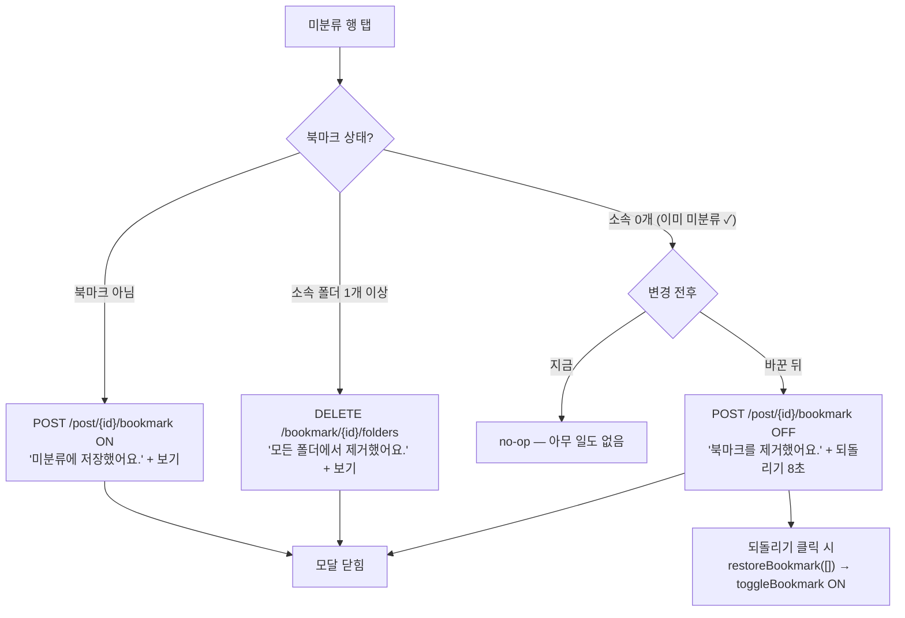
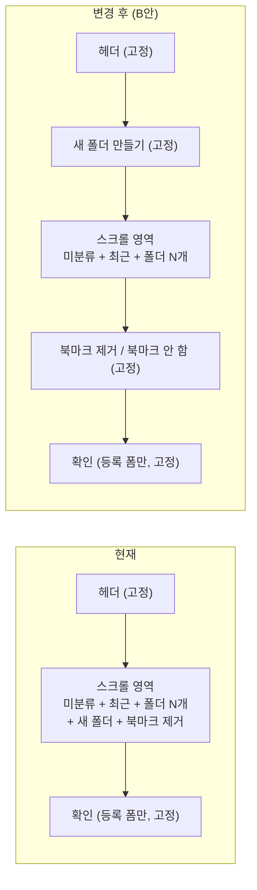

# 북마크 모달: 미분류 재탭 삭제 + 하단 액션 발견성 개선

## Context

카드의 북마크 버튼을 눌러 미분류로 저장한 뒤 모달을 다시 열어 **미분류 행을 탭해도
아무 일도 일어나지 않는다**(no-op). 다른 폴더 행은 모두 "다시 누르면 해제"인데 미분류만
예외라, 사용자가 "왜 반응이 없나" 하고 막힌다.

조사 결과 이 no-op을 정당화하던 근거가 **사실이 아니었다.**
[docs/DECISIONS.md](../DECISIONS.md)의 2026-09-11 결정 #4는 _"미분류는 되돌릴 대상(folderId)이
없어 Undo가 불가능한 파괴적 조작이 되므로 막는다"_ 고 적었지만, **같은 PR에서 만든**
`restoreBookmark([])`(`useBookmarkFolders.ts:67-71`)가 이미 그 Undo를 구현해두고 있고,
하단 `북마크 제거` 행이 미분류 상태에서 정확히 그 경로로 되돌리기를 제공 중이다
(`usePostCardBookmarkFolderModal.ts:139-142`). 즉 새 메커니즘이 필요한 게 아니라
**이미 있는 경로를 미분류 행에도 열어주는 일**이다.

두 번째로, 그 `북마크 제거` 행과 `새 폴더 만들기` 행이 **스크롤 컨테이너 안쪽 맨 끝**에
있어 폴더가 6개만 넘어도 화면 밖으로 밀린다. Material Design 다이얼로그 가이드라인은
_"Actions always remain in place when content scrolls."_
([Material Design, Dialogs](https://m1.material.io/components/dialogs.html))라고 규정하는데,
이 모달은 제목만 고정하고 액션은 고정하지 않아 절반만 따르고 있다.

두 문제는 연결돼 있다 — `북마크 제거`가 안 보여서 미분류 행을 눌렀을 가능성이 있다.
사용자 결정에 따라 **둘 다 한 작업으로** 처리하되 커밋은 분리한다.



## 결정 사항 (사용자 승인 완료)

- 등록 폼(`PostCreateBookmarkFolderField`)도 **대칭으로 함께 변경** — 미분류 재탭 시
  "북마크 안 함"으로 되돌린다. 2026-09-11 결정 #3의 대칭 원칙 유지.
- 삭제 토스트는 기존 `TEXTS.messages.success.bookmarkRemoved`("북마크를 제거했어요.")
  재사용 + 되돌리기 8초. **새 TEXTS 키 불필요.**
- 두 변경을 한 작업으로, 커밋은 둘로 분리.
- 레이아웃 3안(하단 고정 / 생성 위·삭제 아래 / 헤더 아이콘)을 Artifact 정적 미리보기로
  나란히 비교한 뒤 **안 B(생성은 헤더 바로 아래 고정, 삭제만 하단 고정)** 채택.

---

## Step 0 — 워크트리 준비

```bash
node -v                          # v24 아니면 nvm use
git log origin/main..main        # 미푸시 커밋 확인 (EnterWorktree fresh 기준)
git worktree list                # 오래된 워크트리 정리 여부 확인
```

`EnterWorktree` 후 즉시:

```bash
cp ../../../.env .
pnpm install
```

---

## Step 1 — 레이아웃 미리보기 (구현보다 먼저)

CLAUDE.md §9에 따라 **코드를 고치기 전에** 정적 미리보기를 만들어 승인받는다.

- Artifact 한 페이지에 3안을 **나란히** 배치 (parallel prototyping).
- 실제 Tailwind 클래스와 `src/app/globals.css` 색 토큰을 그대로 재사용 — 근사치 금지.
- 폴더 8개 + 최근 구획 노출 시나리오(= 실제로 잘리는 상태)로 렌더.
- 데스크탑(`max-w-sm`, `max-h-96`)과 모바일(`70vh` 바텀시트) 둘 다.

| 안  | 내용                                                                  | 트레이드오프                                                                     |
| --- | --------------------------------------------------------------------- | -------------------------------------------------------------------------------- |
| A   | `새 폴더 만들기` + destructive 행을 스크롤 밖 하단 고정               | Material 권고와 일치. 목록 약 82px 감소. 모바일에서 파괴 액션이 엄지 위치에 상주 |
| B   | `새 폴더 만들기`는 헤더 바로 아래, destructive만 하단 고정            | 생성 발견성 최상. 주 액션(폴더 선택)이 한 칸 밀림                                |
| C   | `새 폴더 만들기`를 헤더 우측 아이콘 버튼으로, destructive만 하단 고정 | 목록 공간 손실 최소. 라벨 없어 발견성↓, X 버튼 옆이라 오탭 위험                  |

**사용자가 고른 안으로만 Step 2를 진행한다.** → **B안 선택.**

---

## Step 2 — 레이아웃 구현

수정 파일: `src/features/bookmark/select/ui/BookmarkFolderSelectModal.tsx` **한 개**
(로직 변경 없음 — `useBookmarkFolderSelect`는 건드리지 않는다).

기존 스크롤 영역(`overflow-y-auto max-h-96`/`max-h-[70vh]`)이 `<ul>` 전체(미분류·최근
구획·내 폴더·새 폴더 만들기·destructive 행)를 통째로 감싸던 것을, 폴더 목록만 감싸도록
좁힌다. `새 폴더 만들기` 블록을 헤더와 스크롤 영역 사이로, destructive 블록을 스크롤
영역 뒤로 옮긴다. `isLoading` 분기는 세 블록 전체를 여전히 함께 가린다(기존 동작 유지 —
생성/삭제 UI가 데이터 로드와 무관하게 보이는 변화를 만들지 않는다).



스크롤 영역의 `max-h-96`/`max-h-[70vh]`는 그대로 유지한다(폴더 목록이 보여주는 행 수는
변화 없음) — 두 고정 블록만큼 모달 전체 높이가 늘어나는 쪽을 택했다. 헤더·확인 버튼이
이미 이 방식(스크롤 캡과 무관하게 추가)으로 동작하고 있어 기존 패턴과 일관된다. 경계선은
새로 늘리지 않고 기존 `border-b`/`border-t`를 겹치지 않게 재배치한다(헤더의 `border-b`가
새 폴더 만들기 위쪽 경계를 이미 그리므로 새 폴더 만들기 블록은 자신의 아래쪽에만
`border-b`를 둔다).

---

## Step 3 — 미분류 재탭 → 북마크 완전 삭제

### 3-1. `src/features/bookmark/select/hooks/useBookmarkFolderSelect.ts`

- 가드를 `if (isAnyPending) { return; }` 로 — `isUncategorizedSelected ||` 제거.
- no-op 근거 주석 삭제, JSDoc의 "미분류 재탭 no-op 규칙을 소유한다" 제거.
- `isUncategorizedSelected`는 **✓ 표시용으로 계속 필요** — 삭제 금지.

### 3-2. `src/features/bookmark/toggle/hooks/useBookmarkFolders.ts`

`selectUncategorized`의 조건 순서를 뒤집어 3번째 분기를 흡수한다:

```ts
if (isBookmarked && bookmarkFolderIds.length > 0) {
  await clearBookmarkFolders();
  return;
}

await toggleBookmark(); // 미북마크면 생성(ON), 이미 미분류면 완전 삭제(OFF)
```

방향은 `resolveCurrentBookmarkState`가 캐시에서 결정하므로 호출부가 ON/OFF를 분기할
필요가 없다.

### 3-3. `src/features/bookmark/toggle/hooks/usePostCardBookmarkFolderModal.ts`

`handleSelectUncategorized` 맨 위에서 이미 미분류면 **`handleRemove()`에 위임하고
return**한다. `handleRemove`가 `prevFolderIds.length <= 1` 분기로 되돌리기 토스트·에러
처리·모달 닫기를 이미 전부 갖고 있어 로직 중복이 없다.

### 3-4. `src/features/post/create/hooks/usePostCreateBookmarkFolderField.ts`

토글로 (API 호출 없음 → 되돌리기 불필요):

```ts
if (bookmark && folderIds.length === 0) {
  applySelection(false, []);
  return;
}

applySelection(true, []);
```

### 3-5. 주석·참조 정리

- `BookmarkFolderSelectModal.tsx` JSDoc의 no-op 규칙 서술 교체.
- `e2e/mocks/bookmark-folder.mock.ts`가 `useBookmarkFolders.ts` 줄 번호를 참조 중 —
  줄이 밀리므로 갱신.

---

## Step 4 — 테스트

### 수정 (안 고치면 red)

- `PostCardBookmarkFolderModal.test.tsx`의 "no-op" 테스트를 정반대로 교체. 삭제와
  되돌리기가 같은 엔드포인트(`POST /post/{id}/bookmark`)라 호출 횟수 1→2로 검증한다.
- `PostCreateBookmarkFolderField.test.tsx` → "미분류 재탭 시 `bookmark-value: 'false'`"로
  교체.

### 추가

| 파일                                   | 케이스                                                                                            |
| -------------------------------------- | ------------------------------------------------------------------------------------------------- |
| `PostCardBookmarkFolderModal.test.tsx` | 소속 1개 이상에서 미분류 탭은 **여전히 전체 해제**                                                |
| 〃                                     | 미북마크에서 미분류 탭은 **여전히 생성 ON** + 보기 액션                                           |
| 〃                                     | 삭제 실패 시 에러 토스트 + 모달 안 닫힘                                                           |
| `interaction.queries.test.ts`          | `bookmarkFolderKeys.posts('uncategorized')` 캐시를 심고 토글 OFF → 카드 제거 + `totalElements` -1 |

변경 불필요: `bookmark-folder.queries.test.ts`(엔티티 mutation 미변경), e2e 전체.

---

## Step 5 — 문서

`docs/BOOKMARK.md`(§1·§5·§8·§9·§10), `docs/DECISIONS.md`(새 항목 2건, append-only),
`CHANGELOG.md`(`[Unreleased]`에 새 항목), 이 계획 파일(`docs/plans/`).

---

## 검증

```bash
pnpm type-check
npx vitest run src/entities/bookmark/folder src/entities/interaction \
  src/features/bookmark src/features/post/create/ui/PostCreateBookmarkFolderField.test.tsx
pnpm test
pnpm lint
pnpm check:docs
```

브라우저 확인(`browser-verification` skill 절차, 커밋 전):

1. 폴더 8개 이상 계정으로 카드 북마크 버튼 → 모달에서 `새 폴더 만들기`·`북마크 제거`가
   **스크롤 없이 보이는지** (데스크탑·모바일 뷰포트 둘 다)
2. 미분류 ✓ 상태에서 미분류 탭 → 북마크 사라지고 "북마크를 제거했어요." + 되돌리기
3. 되돌리기 클릭 → 미분류로 복원
4. `/bookmark?folder=uncategorized`에서 같은 조작 — 카드가 목록에서 사라지고 사이드바
   미분류 카운트 -1, 되돌리기 후 카운트 +1(카드는 재조회 후 복귀)
5. 소속 폴더 2개 상태에서 미분류 탭 → **전체 해제**가 그대로 동작하는지(회귀)
6. 글 작성 화면에서 미분류 재탭 → 트리거 문구가 "북마크 안 함"으로 바뀌는지

## 알려진 기존 결함 (이번 범위 밖, 기록만)

- 되돌리기 토스트 버튼에 연타 방어가 없다 — 8초 안에 두 번 누르면 삭제→재생성→삭제.
  기존 `북마크 제거`·마지막 폴더 되돌리기에도 있는 구멍.
- `resolveCurrentBookmarkState`가 `post.detail`을 최우선으로 보므로, stale한 detail
  캐시가 남은 채 피드에서 조작하면 카운트가 어긋날 수 있다. 신규 결함은 아니다.
