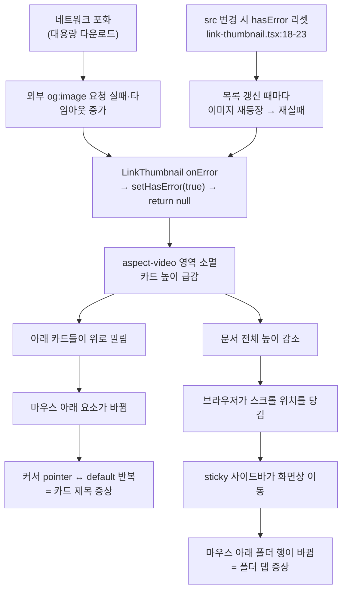

# 보관함/게시글 목록 커서 깜빡임 — 원인 재현 및 확정

## Context

**사용자 증상**: 보관함 폴더 탭과 게시글 카드 제목에 마우스를 올렸을 때 커서가
pointer ↔ default 를 반복해 깜빡였다. **대용량 다운로드가 돌던 중에만 발생했고,
다운로드가 끝나자 정상으로 돌아왔다.**

**첫 진단을 폐기한 이유**: 조사 초반에 `FolderItem`의 클릭 영역 구멍(래퍼 `<div>`의
`pl-3 pr-1 py-1 gap-2` 자리에서 커서가 `default`)을 원인으로 지목했으나, 두 가지가 맞지
않는다.

1. 그 구멍은 네트워크와 무관하게 **항상** 존재한다 → "지금은 정상"과 모순
2. 카드 제목([`PostCard.tsx:88`](../../project/link-sphere/link-sphere_FE_NEW/src/widgets/post/post-card/ui/PostCard.tsx))은
   `<Link className="hover:underline block">`이라 밑줄 영역과 포인터 영역이 일치한다 →
   **구멍이 없다**. "카드 제목도 같았다"를 설명하지 못한다

**그래서 이 계획은 고치는 계획이 아니라 원인을 확정하는 계획이다.** 추측으로 코드를
바꾸지 않는다. 재현에 성공한 뒤 수정안을 따로 승인받는다.

## 검증할 가설

|        | 가설                                  | 근거 위치                                   | 부하 의존성 설명                       | 두 화면 동시 설명                                   |
| ------ | ------------------------------------- | ------------------------------------------- | -------------------------------------- | --------------------------------------------------- |
| **H1** | 썸네일이 사라지며 목록이 점프         | `shared/ui/atoms/link-thumbnail.tsx:26-28`  | ✅ 외부 og:image 실패율이 부하 시 급증 | ✅ (아래)                                           |
| **H2** | hover prefetch 요청 누적              | `FolderTree.tsx:171,233`, `PostCard.tsx:91` | ✅ 포화 시 요청이 큐에 쌓임            | ✅ 두 곳 다 `onMouseEnter` 즉시 발사, 디바운스 없음 |
| **H3** | 클릭 영역 구멍 (첫 진단)              | `FolderTree.tsx:223-228`                    | ❌ 상시 존재                           | ❌ 폴더 행에만 해당                                 |
| **H4** | 시스템 부하로 브라우저 커서 갱신 지연 | 앱 밖                                       | ✅                                     | ✅ — 앱에서 고칠 것 없음                            |

### H1이 두 화면을 모두 설명하는 경로



## 재현 절차

코드를 수정하지 않는 **읽기 전용 조사**이므로 워크트리는 만들지 않는다
(`.claude/CLAUDE.md`의 워크트리 규칙은 "코드를 수정하는 작업"이 대상).

### 0. 준비

```bash
node -v          # v24 확인
pnpm dev         # 한 번에 한 곳에서만
```

Playwright MCP로 데스크톱 폭(≥768px, `useIsMobile` 기준)에서 게시글 목록과 `/bookmark`를
연다.

### 1. 대조군 측정 (정상 네트워크)

아래 계측 스크립트를 `browser_evaluate`로 주입해 60초간 수집한다.

- **레이아웃 시프트**: `PerformanceObserver`로 `layout-shift` 엔트리의 `value` 합과 발생 횟수
- **마우스 고정 지점의 요소 변화**: 카드 제목 중앙 좌표를 고정해 `document.elementFromPoint()`를
  100ms 간격 샘플링 → 요소가 바뀐 횟수와 그때의 `getComputedStyle(el).cursor`
- **썸네일 소멸 횟수**: `MutationObserver`로 `.aspect-video` 컨테이너 제거 이벤트 수

### 2. 실험군 측정 (부하 재현)

같은 계측을 유지한 채 아래를 건다.

- 외부 이미지 실패 유도: `**/*.{png,jpg,jpeg,webp,gif}` 중 **앱 도메인이 아닌 요청**만
  `abort()` (og:image는 외부 CDN이므로 여기 걸린다)
- 네트워크 지연: CDP `Network.emulateNetworkConditions`로 대역폭을 조이고 latency를 올려
  실제 다운로드 포화를 흉내
- CPU 지연: CDP `Emulation.setCPUThrottlingRate`로 메인 스레드 여유를 줄여 H4 기여도 확인

### 3. 판정 기준

| 관측                                                                                          | 결론                               |
| --------------------------------------------------------------------------------------------- | ---------------------------------- |
| 실험군에서 layout-shift 횟수와 요소 변화 횟수가 함께 급증하고, 썸네일 제거 시점과 시각이 일치 | **H1 확정**                        |
| 시프트는 없는데 prefetch 요청 큐가 쌓이는 동안만 커서 갱신이 밀림                             | **H2 확정**                        |
| 두 실험군 모두에서 변화가 없고 CPU 스로틀링에서만 재현                                        | **H4** — 앱 수정 대상 아님         |
| 대조군에서도 세로 스윕에 12px `default` 구간이 나옴                                           | **H3은 사실이나 별개 버그** (아래) |

### 4. H3(클릭 영역 구멍) 상시 측정

부하와 무관하게 사이드바를 좌표 스윕해 구멍의 실재를 수치로 남긴다.

```js
const aside = document.querySelector('aside');
const r = aside.getBoundingClientRect();
// 세로: 행 36px 중 pointer가 몇 px인지 / 가로: 폭 240px 중 몇 px인지
for (let y = r.top; y < r.bottom; y += 1) {
  const el = document.elementFromPoint(r.left + r.width / 2, y);
  /* getComputedStyle(el).cursor 기록 */
}
```

기대값(수정 전): 세로 주기 40px 중 pointer 28px·default 12px, 가로 240px 중 default 24px
(좌 12 + 버튼 사이 8 + 우 4).

## 산출물

1. 대조군/실험군 수치 표와 재현 영상(`browser_start_video`) — 어느 가설이 맞는지 증거
2. 확정된 원인에 대한 **수정안 제시 후 재승인**. 지금 코드는 건드리지 않는다
3. H1이 맞을 경우의 유력 수정 방향(미리 정하지 않고 근거를 붙여 제안):
   - 실패 시에도 `aspect-video` 자리를 유지하고 placeholder를 두어 시프트를 0으로
   - 이 경우 "빈 자리가 보인다"는 시각 변화가 생기므로 `.claude/CLAUDE.md` §9에 따라
     미리보기 승인 필요 — 현재 동작(영역을 감춤)은 의도된 설계라고 주석에 적혀 있다
4. H3은 원인과 무관하게 실재하는 별개 버그로 기록. 고칠지는 별도 판단
   (고칠 경우 폴더 이름 들여쓰기가 24px→12px로 바뀌는 시각 변화가 따라온다 —
   `has-[>svg]:px-3`의 특이도가 (0,1,1)이라 `pl-6` 같은 유틸로는 24px를 되돌릴 수 없음)

## 유의

- dev 서버는 한 번에 한 워크트리에서만 (`strictPort` 미설정이라 포트가 조용히 밀린다)
- 계측 스크립트는 `browser_evaluate`로 주입하는 일회성 코드다 — 레포에 파일로 남기지 않는다
- 실험 중 실제 BE(원격 Postgres)를 건드리는 쓰기 동작은 하지 않는다. 조회만 한다
