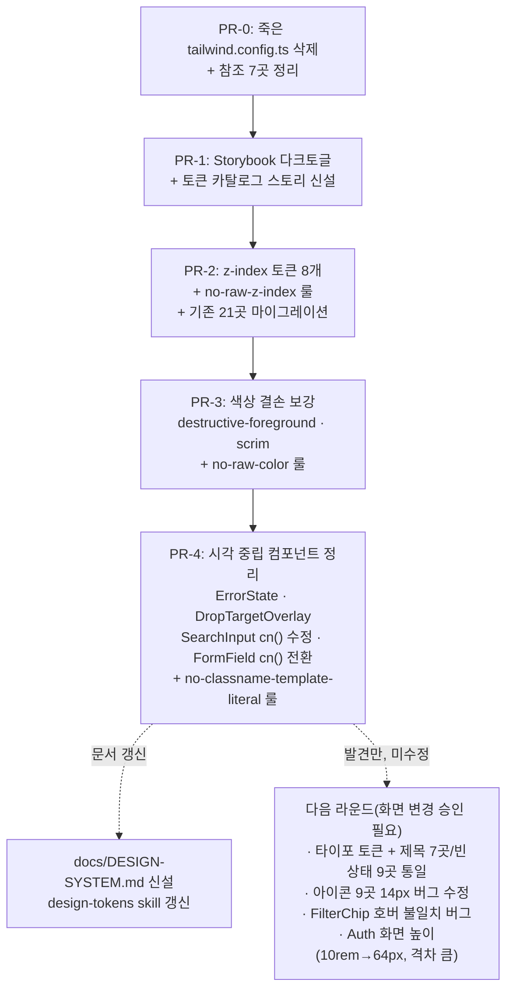

# Link-Sphere FE 디자인 시스템 기반 구축 (1단계: 화면 무변경 범위)

## Context

Tailwind className으로 스타일을 관리 중인데, 색상 축(`globals.css`의 `@theme` 39개 토큰)만
체계가 있고 spacing·타이포·z-index 축은 토큰이 전혀 없다. 그 결과를 실측했다(`rg` 실행 결과,
2026-09-13):

- 같은 파일 안에서 `<h1>`이 3가지 크기 (`BookmarkPage.tsx:128,148,180`)
- 빈 상태 화면의 수직 패딩이 4종(`py-8/10/12/16`), 같은 파일 안에서도 로딩/빈상태가 다름
  (`BookmarkPostList.tsx`)
- z-index가 8단계로 흩어져 있고 `Sidebar.tsx:122`와 `MobileCommentBar.tsx:54`가 값(55)이
  겹침 — DOM 순서로 우연히 승자가 정해지는 잠재 충돌
- **버그 발견**: `button.tsx:8`의 shadcn 규칙 `[&_svg:not([class*='size-'])]:size-4`가
  CSS 명시도로 개별 아이콘 크기 지정을 이긴다. `h-3.5 w-3.5`(14px 의도)로 적힌 9곳이 전부
  16px로 렌더링 중 — 코드와 화면이 다르다
- `tailwind.config.ts`가 죽은 파일이다: Tailwind v4는 `@config` 지시자 없이는 JS 설정을
  읽지 않는데(공식 문서: v4는 CSS-first가 기본이고 JS config는 `@config` 옵트인이 필요한
  레거시 지원 — [Medium, oumuamua](https://medium.com/@oumuamuaa/transitioning-from-tailwind-config-js-to-css-first-in-tailwind-css-v4-4afb3bfca4ee)),
  `globals.css`에 `@config`가 0건이라 6개월간(2026-03-14 이후) 아무 효과 없이 방치됐다.
  그런데 `components.json`이 아직 이 파일을 가리켜 shadcn CLI가 잘못된 기준으로 컴포넌트를
  생성하고, 이 config가 참조하는 `--destructive-foreground`가 `globals.css`엔 없어서
  `button.tsx:14`·`badge.tsx:14`가 `text-white` 하드코딩으로 우회하고 있다

레포에는 이미 "규칙을 코드로 강제"하는 선례가 있다 — `eslint.config.js`의 커스텀 룰 7개
(`custom-i18n/no-hardcoded-hangul` 등, 외부 플러그인 없이 파일 안에 직접 정의). 이번 작업은
같은 패턴을 스타일 축에도 적용한다.

**사용자 결정 사항(대화에서 확정)**:

1. `tailwind.config.ts` → 삭제 + 참조 7곳 정리
2. 이번 배치 범위 → **화면이 전혀 안 바뀌는 것까지만** (토큰 신설, ESLint 룰, 시각 중립
   컴포넌트 추출). 타이포 통일·아이콘 버그 수정·FilterChip 호버 버그 등 화면이 바뀌는
   항목은 이번엔 하지 않고 발견 사항으로만 기록한다
3. 재사용성 → 이번엔 구조만 이식 친화적으로 유지(레지스트리 등 인프라는 만들지 않음).
   레포에 `common-components-lib`(npm 패키지, 1커밋 후 방치)와 v3 기반 템플릿들이 이미
   있었지만 전부 이 레포와 단절돼 있었다 — 새 토큰/컴포넌트는 `shared/ui/` 안에만 두고
   (FSD 레이어 규칙이 이미 `shared`→`entities/features/widgets/pages/app` 참조를 막아
   구조적 이식성이 보장됨), `globals.css`에 범용 토큰과 link-sphere 고유값(`--category` 등)을
   섹션 주석으로 구분해 나중에 그대로 뽑아 쓸 수 있게 한다

## 전체 흐름



---

## PR-0: 죽은 `tailwind.config.ts` 정리

**왜**: 정답이 두 군데(`globals.css`의 살아있는 `@theme` vs 아무도 안 읽는 config)로 갈려
있으면 이후 모든 토큰 작업이 불안정하다. shadcn CLI도 이 죽은 파일을 기준으로 새 컴포넌트를
생성한다.

**변경**:

- `tailwind.config.ts` 삭제
- `tsconfig.node.json:25` — `include` 배열에서 `"tailwind.config.ts"` 제거
- `components.json` — `"tailwind": { "config": "tailwind.config.ts", ... }`에서
  `"config": ""`으로 (shadcn v4 공식 권장: v4는 이 필드를 비워둔다)
- `.github/workflows/deploy.yml:12` — path 트리거에서 `'tailwind.config.ts'` 줄 제거
- `.github/workflows/history.yml:11` — 동일
- `docs/DEPLOY.md:21`, `docs/SYSTEM-ARCHITECTURE.md:111`, `docs/CI-CHECK-GATE.md:252` —
  트리거 목록 서술에서 제거
- `docs/DECISIONS.md`에 이 정리 결정 기록 (되돌리기 어렵고 실제로 원인을 확인해 선택한
  결정 — Nygard ADR 기준에 부합)

**하지 않는 것**: `tailwindcss-animate`(`package.json:109`)는 이 죽은 config가 유일한
참조처였지만, CLAUDE.md §3("원래 있던 죽은 코드는 요청 없으면 지우지 않는다")에 따라 이번엔
건드리지 않는다. PR 설명에 "이제 완전히 고아 상태"라고만 남긴다.

**검증**: `pnpm build` 정상 → dist CSS가 이전과 동일(그 자체로 무효였던 파일이므로 diff
없음 확인). `pnpm check:docs`로 문서 경로 정합성 확인.

---

## PR-1: Storybook 다크모드 토글 + 토큰 카탈로그 스토리 신설

**왜**: `.storybook/preview.ts`에 다크모드 토글이 없어 `.dark` 토큰 세트(41개)를 Storybook
에서 확인할 수 없다. 이후 PR(z-index, 색상)에서 만들 토큰을 검증할 도구가 먼저 있어야 한다.

**변경**:

- `.storybook/preview.ts` → `preview.tsx`로 개명, `globalTypes.theme`(light/dark 툴바) +
  decorator로 `document.documentElement.classList`를 토글하는 방식 추가 (레포의 실제
  다크모드 구현 — `@custom-variant dark (&:is(.dark *))` + next-themes의 `<html>` 클래스
  토글 — 과 동일한 방식이라 새 의존성 불필요)
- 새 파일 `src/shared/ui/tokens/DesignTokens.stories.tsx` — 이번엔 `Colors`(39개 스와치)와
  `Radius`(4개) 섹션만. `ZIndex`·`Typography` 섹션은 각각 PR-2·이후 라운드에서 이 파일에
  추가(append)한다 — 새 파일을 매번 만들지 않고 한 곳에 모은다

**검증**: `pnpm storybook` 기동 → 다크 토글 클릭 시 스와치가 `.dark` 값으로 바뀌는지 확인.
`pnpm test`(Storybook test-runner 대상 없음, 스킵 확인).

---

## PR-2: z-index 토큰 8개 + ESLint 룰 + 기존 21곳 마이그레이션

**왜**: `z-10/20/40/50/55/60/70/80`이 8개 파일에 이름 없이 흩어져 있고, `Sidebar.tsx:122`
(드로어 백드롭)와 `MobileCommentBar.tsx:54`(확장 댓글 시트)가 값이 겹친다.

**변경**:

- `globals.css`에 기존 `@theme inline` 블록(7-52줄)은 그대로 두고, 그 아래 새 블록 추가:
  ```css
  @theme static {
    --z-index-raised: 10; /* 카드 내부 오버레이 */
    --z-index-hitbox: 20; /* 드롭 히트박스 */
    --z-index-panel: 40; /* 패널·바 */
    --z-index-nav: 50; /* Navbar/탭바/FAB */
    --z-index-scrim: 55; /* 전면 딤 — Sidebar·MobileCommentBar 겹침, 아래 참고 */
    --z-index-drawer: 60; /* 사이드바 패널 */
    --z-index-modal: 70; /* Dialog */
    --z-index-popover: 80; /* Dropdown/Select/Tooltip */
  }
  ```
  `static`을 쓰는 이유: v4는 미사용 테마 변수를 출력에서 제거하므로, Storybook 카탈로그가
  `getComputedStyle`로 값을 읽으려면 항상 출력돼야 한다
- 21곳의 `z-\d+` 리터럴을 위 토큰 클래스(`z-raised` 등)로 1:1 치환 — **값은 그대로**라
  화면 변경 없음
- `Sidebar.tsx:122`와 `MobileCommentBar.tsx:54`는 둘 다 `z-scrim`으로 치환해 **현재의
  잠재 충돌(어느 쪽이 위인지는 DOM 순서로 우연히 결정됨)을 그대로 보존**한다 — 값을
  갈라놓으면 그 자체로 화면(겹침 순서)이 바뀌므로 이번 범위 밖. `docs/DECISIONS.md`에
  "두 롤이 같은 층을 쓰고 있음, 의도적으로 다른 층으로 분리할지는 후속 결정" 기록
- `eslint.config.js`에 `custom-tailwind/no-raw-z-index` 룰 추가 (기존 `customQueryRulesPlugin`
  패턴과 동일하게 플러그인 객체를 파일 안에 직접 정의, 허용목록 없이 `src/**/*.{ts,tsx}`
  전체 대상, `Literal`/`TemplateLiteral` 방문자로 `z-\d+` 패턴 검사)
- `DesignTokens.stories.tsx`에 `ZIndex` 섹션 추가 — 8층을 쌓아 보여주고 각 층의 실제
  사용처 컴포넌트명을 라벨로 표시

**검증**: `pnpm lint` (새 룰이 마이그레이션 후 위반 0건인지) → `pnpm type-check` →
`pnpm build`로 실제 렌더링된 z-index 값이 치환 전과 동일한지 dist CSS 대조 → 기존
Sidebar/댓글바 동작을 브라우저에서 확인(`browser-verification` skill, 겹침 순서가
치환 전과 동일함을 녹화로 확인 — 값 자체는 안 바꿨으므로 회귀 없어야 함).

---

## PR-3: 색상 결손 보강 — `destructive-foreground` · `scrim`

**왜**: 죽은 config가 참조하던 `--destructive-foreground`가 `globals.css`에 없어
`button.tsx:14`·`badge.tsx:14`가 `text-white`를 하드코딩 중(CLAUDE.md 금지 패턴).
딤 오버레이도 `bg-black/*`·`text-white` 리터럴이 12곳(`dialog.tsx:22`, `Sidebar.tsx:122`,
`ImageViewer.tsx` 4곳, `UpdateAccountForm.tsx:66-67`, `ImageAttachmentField.tsx:81-82`).

**변경**:

- `:root`/`.dark`에 추가(두 테마에서 동일값 — 딤은 테마 무관, destructive-foreground도
  현재 라이트/다크 버튼 모두 흰 글자라 동일):
  ```css
  --destructive-foreground: oklch(1 0 0);
  --scrim: oklch(0 0 0);
  --scrim-foreground: oklch(1 0 0);
  ```
- 기존 `@theme inline` 블록에 3줄 추가: `--color-destructive-foreground`, `--color-scrim`,
  `--color-scrim-foreground`
- `text-white` → `text-destructive-foreground` (`button.tsx:14`, `badge.tsx:14`) — 값
  동일(흰색), 화면 변화 없음
- `bg-black/N` → `bg-scrim/N`, `text-white` → `text-scrim-foreground` — **각 호출부의
  투명도 수식자(`/40`, `/50`, `/60`, `/80`)는 그대로 유지**, 베이스 색 이름만 교체. 예:
  `dialog.tsx:22`의 `bg-black/80` → `bg-scrim/80` (렌더 결과 동일)
- `custom-tailwind/no-raw-color` 룰 추가 — `black`/`white`/명명 팔레트(`gray-500` 등)
  리터럴 검출, `atoms/**`(shadcn 원본 유지용)와 `**/*.stories.tsx` 제외
- `DesignTokens.stories.tsx`의 Colors 섹션에 2개 토�큰 추가

**검증**: `pnpm lint` → 브라우저에서 Dialog/Sidebar 드로어/ImageViewer 오버레이 스크린샷을
치환 전후로 비교(`browser-verification` skill) — 픽셀 단위 동일해야 함.

---

## PR-4: 시각 중립 컴포넌트 정리

**왜**: 완전히 동일한 클래스 문자열이 여러 곳에 복사돼 있고(추출해도 화면 불변), 일부는
`cn()`을 안 써서 확장이 막혀 있다.

**변경**:

- 새 `src/shared/ui/elements/ErrorState.tsx` — `PostList.tsx:23`와 `PostDetailPage.tsx:80`의
  완전 동일한 `text-center py-12 text-destructive` 블록을 흡수. `.stories.tsx` 필수 동반
- 새 `src/shared/ui/elements/DropTargetOverlay.tsx` — `CommentForm.tsx:103,111`과
  `CommentEditForm.tsx:72,80`의 완전 동일한 드래그오버 오버레이(149자)+히트박스 2세트를
  흡수. `.stories.tsx` 필수 동반
- `src/shared/ui/elements/SearchInput.tsx:13-14,33` — `inputVariant` 상수가 `cn()` 없이
  하드코딩돼 외부 `className`이 씹히는 버그를 수정(호출부 `NavbarSearch`/
  `MobileNavbarSearch`는 이번엔 안 건드림 — 통합은 후속 검토, 이번엔 SearchInput 자체의
  확장성 버그만 고침)
- `src/shared/ui/elements/form/_base/FormField.tsx` — 템플릿 문자열(`:33,42,46`) →
  `cn()`으로 전환. 현재 유일한 호출부(`FormCheckboxGroup.tsx` 등)가 `className`으로
  `flex-col`/`gap-2`와 충돌하는 값을 넘기지 않음을 확인함 → 화면 변화 없음. 유일하게
  스토리가 없는 shared/ui 컴포넌트이므로 `FormField.stories.tsx` 신설
- `src/widgets/post/post-card/ui/PostCard.tsx` — 보간이 없는 템플릿 리터럴 2곳
  (`` `truncate` ``, `` `gap-2 flex-wrap mb-2 mt-3 flex` ``)을 일반 문자열로 정리
- `custom-tailwind/no-classname-template-literal` 룰 추가 — `cn()`/`cva()` 밖에서 className
  에 백틱 템플릿 사용 시 차단(위 4곳이 이미 정리됐으므로 위반 0건에서 시작)

**검증**: `pnpm type-check` → `pnpm test` → `pnpm lint` → 브라우저에서 게시글 없음/댓글
드래그오버/검색창/폼 에러 메시지 화면을 치환 전후 스크린샷 비교.

---

## 문서 갱신 (각 PR과 같은 커밋에서, feat 커밋 규칙에 따라)

- `.claude/skills/design-tokens/SKILL.md` — z-index 8단계 표, `destructive-foreground`/
  `scrim` 항목 추가 (PR-2, PR-3에서 각각)
- 새 `docs/DESIGN-SYSTEM.md` — 독립 기능 문서 13절 순서 준수. "구조" 절에서 범용 토큰
  (z-index 스케일링, 컴포넌트 패턴)과 link-sphere 고유 토큰(`--category` 등)을 구분해
  명시 — 나중에 다른 프로젝트로 이식할 때 무엇을 그대로 가져갈 수 있는지 표시. `README.md`
  `## 문서` 섹션에 등록
- `docs/plans/2026-09-13-design-system-foundation.md` — 이 계획 파일을 PR-0과 같은 커밋에
  스냅샷으로 커밋(append-only)

## 계획 대비 구현 검증 (CLAUDE.md §11)

PR마다 fresh Explore subagent에게 이 계획 파일과 실제 diff를 대조시켜 PR 본문에
`## 계획 대비 구현` 섹션을 남긴다. 특히 다음을 반드시 확인: (1) z-index 값이 치환 전후
동일한지, (2) scrim 투명도 수식자가 호출부별로 그대로 보존됐는지, (3) 이번 배치에 타이포
토큰·아이콘 크기 수정·FilterChip 변경이 섞여 들어가지 않았는지(과잉 구현 방지).

## 이번에 하지 않는 것 (발견했지만 화면이 바뀌어 별도 승인 필요)

- 아이콘 9곳의 14px 의도 vs 16px 실제 렌더링 버그 (`button.tsx:8`의 CSS 명시도 문제)
- 타이포 토큰 신설 + 페이지 제목 7곳/빈 상태 9곳 통일
- `FilterChip.tsx`의 `activeClassName` 필수 prop 구조 — 호버 시 4개 중 3개가 색이 안
  바뀌는 버그 존재, cva `tone` variant로 리팩터 시 화면(호버 반응)이 바뀜
- `LoginPage.tsx:9`/`SignUpForm.tsx:41`의 `h-[calc(100vh-10rem)]` — `--navbar-height`
  fallback(64px)과 160px 차이가 커서 안전한 치환이 아님, 실측 후 재검토 필요
- `PostListSearch.tsx:99`의 raw div를 `Card` 컴포넌트로 교체 (고유값 `p-5 rounded-2xl`)
- `prettier-plugin-tailwindcss` 도입 (591개 className 전량 재정렬 → git blame 소실)
- shadcn 커스텀 레지스트리로 실제 추출 (다음 프로젝트 시작 시점에 별도 작업)

## Critical Files

- `src/app/globals.css` — 토큰 추가 지점
- `eslint.config.js` — 커스텀 룰 4개 추가 지점 (기존 `customQueryRulesPlugin` 패턴 참고)
- `.storybook/preview.ts`→`.tsx`, 새 `src/shared/ui/tokens/DesignTokens.stories.tsx`
- `tailwind.config.ts`(삭제), `components.json`, `tsconfig.node.json`
- `.claude/skills/design-tokens/SKILL.md`, 새 `docs/DESIGN-SYSTEM.md`

## 전체 검증 순서 (매 PR 공통)

1. `pnpm type-check`
2. `pnpm test`
3. `pnpm lint`
4. `pnpm check:docs`
5. `pnpm build` (dist CSS 비교로 화면 무변경 재확인)
6. `browser-verification` skill로 영향받는 화면 녹화 (PR-2·3·4 — 실제 시각 대조 필요한 것만)
