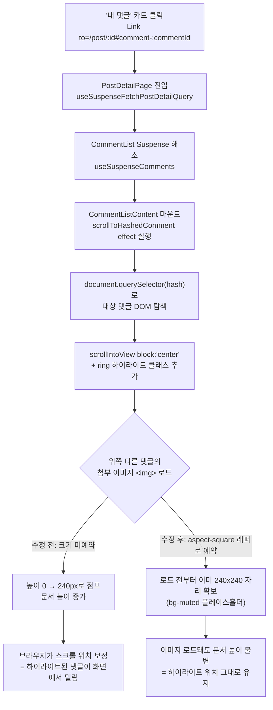

# 댓글 첨부 이미지 지연 로드로 인한 레이아웃 시프트 수정

## Context

"내 댓글" 카드(마이페이지)를 클릭해 원글의 특정 댓글로 이동하면, `CommentList.tsx`의
`scrollToHashedComment` effect가 `location.hash`(`#comment-<id>`)로 해당 댓글을
`scrollIntoView({ block: 'center' })`하고 링으로 하이라이트한다. 그런데 그 위쪽에 있는
"다른 댓글들"의 첨부 이미지가 스크롤 이후 뒤늦게 로드되면서 문서 높이가 늘어나고,
브라우저가 스크롤 위치를 보정하면서 방금 하이라이트한 댓글이 화면 중앙에서 밀려난다.

이 기능(PR [#90](https://github.com/BAECHAN/link-sphere_FE_NEW/pull/90))은 조사 시점 기준
이미 `main`(`63b6881`, 2026-09-14T05:10:08Z 머지)에 들어가 있다. 원인이 된
`MarkdownContent.tsx`의 이미지 크기 미예약은 이 기능과 무관하게 `main`에 이미 존재하던
독립 버그로, `docs/DECISIONS.md:1217-1221`(2026-09-06)에서 다른 시프트 증상을 조사하다
발견했지만 "실재하는 이슈지만 그때 증상의 원인은 아니라서 손대지 않음"으로 명시적으로
유예해 둔 항목이다. 이번이 그 유예된 이슈를 실제로 고치는 작업이다.

## 근본 원인

`src/shared/ui/elements/MarkdownContent.tsx:78-82`:

```tsx

```

`width`/`height`/`aspect-ratio` 예약이 없어 로드 전 높이가 0이고, 로드 완료 시
`max-h-60`(240px)까지 순간적으로 늘어난다. 댓글 하나당 이미지 최대 5장
(`MAX_COMMENT_IMAGES`, `entities/comment/config/comment.const.ts:1`)이 가능해 이미지가
많은 댓글이 위쪽에 있을수록 아래 전부가 크게 밀린다.

**직접 실측(2026-09-14, curl로 응답 바이트를 받아 PNG/JPEG 헤더에서 픽셀 크기 직접 파싱,
재현 명령은 아래 "검증" 절 참고):**

```
요청 width=800&height=800&resize=cover   -> 실제 800 x 800
요청 width=400&height=800&resize=cover   -> 실제 400 x 800
요청 width=1600&height=800&resize=cover  -> 실제 978 x 800
요청 width=800&height=200&resize=cover   -> 실제 800 x 200
```

이 네 응답을 역산하면 실측에 쓴 원본(`t.png`)의 실제 크기는 **약 978×800(비정사각)**이다
(처음엔 "원본이 800×800 정사각이라서"로 잘못 추정했으나, 셋째 줄의 978이라는 값 자체가
원본이 정사각이 아니라는 증거다 — 정정). 그런데도 `width=800&height=800&resize=cover`
요청은 정확히 800×800을 반환했다. 이는 원본 모양과 무관하게 성립하는 **cover 모드의
수학적 성질**이다: `getTransformedImageUrl`(`src/shared/lib/image/supabaseImage.ts:20-43`)이
호출부에서 `{ width: 800 }`만 넘기면 내부 기본값으로 `height = width`가 되어
[Supabase의 `resize: 'cover'`](https://supabase.com/docs/guides/storage/serving/image-transformations)
(_"resizes the image while keeping the aspect ratio to fill a given size and crops
projecting parts"_)가 적용되는데, **요청한 width와 height가 같고 원본의 두 변이 모두 그
값 이상이면, 원본 비율과 무관하게 결과는 항상 정확히 그 정사각형으로 잘려 나온다**
(cover는 두 변 중 남는 쪽을 크롭하기 때문). 이 성질은 오늘 이미 전송되는 네트워크
요청(`width:800`, `height`는 기본값으로 800, `resize`는 기본값으로 `'cover'`)에 그대로
해당하므로, **이번 수정은 어떤 데이터도 새로 요청하지 않고 이미 오늘 받고 있는 응답 앞에
CSS로 자리만 미리 잡아두는 것**이다.

예외(정사각이 보장되지 않는 경우) — 이 경우들은 원래 그대로 둔다:

- `blob:` URL(작성 중인 댓글의 낙관적 미리보기, 아직 서버 업로드 전) — `getTransformedImageUrl`이
  `OBJECT_PUBLIC_PATH`를 포함하지 않는 URL은 원본 그대로 반환(`supabaseImage.ts:27`)하므로
  변환을 타지 않는다. 단, 이번 버그가 말하는 "다른 댓글"은 전부 이미 저장이 끝난 댓글이라
  본문에 `blob:`이 남아있지 않다 — 실질적으로 이 버그의 해결 범위에는 영향 없음.
- 댓글 본문에 직접 붙여넣은 외부(Supabase 아닌) 이미지 링크 — 마찬가지로 변환 대상 아님.
- 업로드 시 리사이즈(`resizeImageFile`, `maxDimension=1600`, `resizeImage.ts:109`
  `Math.max(bitmap.width, bitmap.height) <= maxDimension`)는 **긴 변만** 제한하므로, 매우
  가늘고 긴 원본은 짧은 변이 800px 미만일 수 있다 — 이 경우 cover 요청도 정사각을 보장하지
  않는다(원본을 확대하지 않는 한도 안에서만 크롭하기 때문). 아래 설계는 이 경우도 잘림·확대
  없이 안전하게 처리한다(중앙 정렬 `object-contain`).

## 기존 선례

`src/shared/ui/atoms/link-thumbnail.tsx:41` — og:image처럼 크기를 미리 알 수 없는
이미지를 다루는 이 레포의 기존 해법:

```tsx
<div className="relative aspect-video w-full overflow-hidden bg-muted">
  {/* ...img 또는 실패 아이콘... */}
</div>
```

고정 비율 래퍼(`aspect-*`) + `bg-muted` 플레이스홀더로 로드 전/실패 시에도 자리를 유지한다.
같은 파일 12-19줄 주석에 "실패 시 영역을 없애면 레이아웃 시프트가 생긴다"를 2026-09-11
Playwright로 직접 재현 검증했다고 기록돼 있다. 이번 수정은 이 형태를 그대로 따른다 —
다만 여기서는 래퍼가 `<button>` 안에 들어가야 해서 `<div>`(block content) 대신
`<span className="flex ...">`을 쓴다(`<button>`의 콘텐츠 모델은 phrasing content라
`<div>`를 자식으로 두면 HTML이 무효가 된다).

## 변경 파일

### 1. `src/shared/lib/image/supabaseImage.ts`

정사각 보장 여부를 판별하는 함수를 export해 `getTransformedImageUrl` 내부에서도
재사용한다(조건을 한 곳에만 둔다 — svg 제외 등 기존 예외를 실수로 벗어나지 않도록):

```ts
/**
 * 이 URL이 Supabase 이미지 변환 엔드포인트를 타는지 판별한다. 변환을 타면 width와
 * height를 같은 값으로 요청했을 때(resize=cover) 응답이 항상 정확히 그 정사각으로
 * 잘려 오므로(원본이 그 값보다 작지만 않으면), 호출부가 로드 전에 정사각 자리를
 * 미리 예약할 수 있다. blob:(업로드 전 미리보기)·외부 이미지·svg는 원본을 그대로
 * 쓰므로 비율을 알 수 없다.
 */
export function isTransformableImageUrl(url: string | null | undefined): boolean {
  if (!url) {
    return false;
  }
  if (!url.includes(OBJECT_PUBLIC_PATH)) {
    return false;
  }
  return !/\.svg(\?.*)?$/i.test(url);
}
```

`getTransformedImageUrl`의 기존 가드 3줄(20-32행)을 이 함수 호출로 교체 — **출력은
1:1 동일**(빈 문자열/원본 그대로 반환하는 순서·조건 보존). 이 함수는 `UserAvatar.tsx:53`,
`useAppInitialization.ts:19`도 호출하므로 리팩터 후 두 호출부의 출력이 바뀌지 않는지
반드시 확인한다(시그니처 변경 없음, 내부 구현만 정리).

### 2. `src/shared/ui/elements/MarkdownContent.tsx`

`renderInlineLinks`의 이미지 렌더 분기(현재 59-84행)를 `isTransformableImageUrl` 결과에
따라 두 갈래로 나눈다:

```tsx
const src = getTransformedImageUrl(part, { width: 800 });
const hasReservedSquare = isTransformableImageUrl(part);

// <button>은 그대로, onClick/aria-label 등 기존 로직 무변경
{
  hasReservedSquare ? (
    <span className="my-2 flex aspect-square w-60 max-w-full items-center justify-center overflow-hidden rounded-md bg-muted">
      
    </span>
  ) : (
    
  );
}
```

설계 근거:

- `w-60`(15rem=240px) + `max-w-full` + `aspect-square` — 기존 `max-h-60`(240px 상한)과
  동일한 최대 크기. 컨테이너가 좁으면 오늘처럼 함께 줄어든다.
- `object-contain`(등록된 이미지가 이미 정사각이므로 `object-cover`와 시각적으로 동일하되,
  원본이 800px보다 작아 정사각이 보장 안 되는 예외 케이스에서도 잘리거나 확대되지 않고
  자리 안에 안전하게 들어간다 — 위 "긴 변만 제한" 케이스 대비).
- `bg-muted` — `LinkThumbnail`과 동일한 로드 전 플레이스홀더 배경.
- `imageUrls`(라이트박스에 넘기는 배열, 67행)는 계속 **원본 URL**을 담으므로 클릭해
  여는 라이트박스는 지금처럼 원본을 그대로 보여준다 — 이번 변경은 미리보기 박스에만
  영향, 클릭 동작·`onClick`·`aria-label`은 한 글자도 건드리지 않는다.
- 비변환 분기(`blob:`/외부/svg)는 오늘 마크업 그대로 — `getTransformedImageUrl`이 이
  경우 입력을 그대로 반환하므로 `src` 값도 오늘과 문자열까지 동일하다.

### 3. `src/shared/ui/elements/MarkdownContent.stories.tsx`

`shared/ui/elements` 컴포넌트를 시각적으로 바꾸므로 CLAUDE.md 규칙에 따라 같은 커밋에
스토리를 갱신한다. 조사 중 기존 `Image` 스토리(43-47행)가 `https://picsum.photos/seed/
link-sphere/400/300`처럼 확장자가 없는 URL을 써서 `IMAGE_EXT_PATTERN`에 매칭되지 않아
**실제로는 이미지가 아니라 파란 링크로 렌더되는** 기존 버그를 발견했다 — 이번 수정의
시각적 검증 수단 자체가 고장나 있어 같이 고친다(무관한 죽은 코드 방치가 아니라 이번
검증에 필요한 최소 수정):

- `Image` 스토리의 `content`를 `.jpg` 확장자가 붙은 URL로 수정해 실제로 비변환 분기가
  그려지게 한다(`ImageViewer.stories.tsx:90-92`가 이미 같은 picsum 호스트에 `.jpg`를
  붙여 쓰는 선례를 따름).
- `StorageAttachment` 스토리 추가 — content를 Supabase storage 공개 URL 형태
  (`https://<project>.supabase.co/storage/v1/object/public/comments/<name>.png`)로 주면
  `isTransformableImageUrl`이 true가 되어 예약된 정사각 자리(`bg-muted`)가 그려진다.
  Storybook에서는 그 호스트에 실제로 닿지 않으므로, 화면에 보이는 게 정확히 "로드
  전/실패 상태" = 이번 수정이 만드는 자리 예약 그 자체를 보여준다. JSDoc으로 이 스토리의
  목적을 짧게 남긴다.

### 4. `src/shared/ui/elements/MarkdownContent.test.tsx` (신규)

같은 문제를 이미 검증하고 있는 `src/shared/ui/atoms/link-thumbnail.test.tsx`의 방식을
따라, jsdom이 실제 레이아웃을 계산하지 못하므로 "자리 예약 여부"를 DOM 구조로 단정한다.
`src/test/utils.tsx`의 `renderWithProviders`를 사용한다. 최소 3케이스:

1. Supabase storage URL → `getTransformedImageUrl`이 만드는 변환 URL이 `src`에 쓰이고,
   그 ``의 부모가 `aspect-square` 클래스를 가진 래퍼인지
2. `blob:` URL → `src`가 원본 그대로, 래퍼 없이 `max-h-60` 클래스 유지
3. 확장자 있는 외부 https 이미지 URL → 2번과 동일하게 기존 렌더링 유지

## 브랜치 전략

`origin/main`(현재 로컬 main과 동일, `git log origin/main..main` 결과 없음)에서 새
워크트리를 만들어 작업한다. PR #90이 이미 머지돼 있어 이 워크트리에는 하이라이트
기능이 이미 포함돼 있으므로, 별도 브랜치에 따로 반영할 필요가 없다 — 실제 "카드 클릭 →
해시 이동 → 스크롤" 전체 시나리오를 이 브랜치 하나로 바로 검증할 수 있다.

현재 활성 워크트리(`fix-comment-avatar-alignment`, 잠금 상태)는 `UserAvatar.tsx`·
`CommentItem.tsx`만 2줄씩 건드리고 있어 이번 대상 파일(`MarkdownContent.tsx`,
`supabaseImage.ts`, 두 파일의 테스트/스토리)과 겹치지 않는다 — 충돌 없음.

## 검증

```bash
pnpm type-check
pnpm lint
pnpm test          # 신규 MarkdownContent.test.tsx 포함
pnpm storybook      # Image(비변환, 실제로 이미지가 뜨는지) / StorageAttachment(예약된
                     # 정사각 muted 박스) 육안 확인. ImageViewer.stories.tsx의 기존
                     # 두 스토리(비변환 URL 사용)가 변하지 않았는지도 함께 확인(음성 대조군)
```

정사각 보장 재확인(구현 시점에 실제 댓글 이미지가 있는 글로 재실행):

```bash
curl -s 'https://dbw3brui6htwk.cloudfront.net/api/post/<postId>/comment' \
  | grep -o 'https://[^"]*storage/v1/object/public[^"]*'
# object/public → render/image/public 치환 후
curl -s '<render-url>?width=800&height=800&resize=cover&quality=80' -o /tmp/a.img
file /tmp/a.img   # 기대: 800 x 800 (또는 원본이 800px보다 작으면 그보다 작은 정사각/비정사각)
```

브라우저 실측(이번 수정의 본 목적 — `browser-verification` skill, Playwright MCP):
첨부 이미지가 여러 개 달린 댓글이 있는 글에서 `/post/<id>#comment-<targetId>`로 직접
진입해, 하이라이트 링이 뷰포트 중앙에서 벗어나지 않는지 녹화로 확인. 가능하면 대상
댓글의 `getBoundingClientRect().top`을 이미지 로드 전/후로 찍어 차이가 0에 가까운지도
함께 확인(수정 전에는 위쪽 이미지 개수 × 최대 240px만큼 벌어짐).

## 영향 범위 / 회귀 체크리스트

- **라이트박스**: `imageUrls`(원본 URL 배열)와 `onClick` 로직 무변경 → 클릭 시 여는 이미지,
  이전/다음 인덱스 전부 동일.
- **낙관적 댓글 미리보기(`blob:`)**: 비변환 분기라 오늘과 마크업 동일. 자기 자신의
  미리보기에서는 여전히 시프트가 남지만(비율 불명), 이번 버그가 말하는 "다른 댓글"은
  전부 이미 저장된 https URL이라 목표 시나리오에는 영향 없음.
- **외부 이미지 링크**: 비변환 분기, 오늘과 동일.
- **`getTransformedImageUrl`의 다른 호출부**(`UserAvatar.tsx`, `useAppInitialization.ts`):
  내부 구현만 정리, 출력 불변 — 리팩터 직후 아바타가 깨지지 않는지 확인.
- **API/스키마/쿼리 키/캐시 무효화**: 전부 무변경, FE 렌더링 구조만 변경.
- **기존 테스트/e2e**: `MarkdownContent`/`max-h-60`/`attachment`를 전제하는 기존
  테스트·e2e 스펙 없음(grep 확인) — 깨질 기존 테스트 없음.
- **범위 밖(의도적으로 손대지 않음)**: `src/shared/ui/elements/ImageAttachmentField.tsx`
  (댓글 작성 폼의 이미지 미리보기)도 유사하게 크기 미예약이지만 별개 컴포넌트이고 이번
  요청("다른 댓글들의 이미지가 나중에 불러와져 밀림")의 범위 밖이라 건드리지 않는다.

## 전체 흐름


