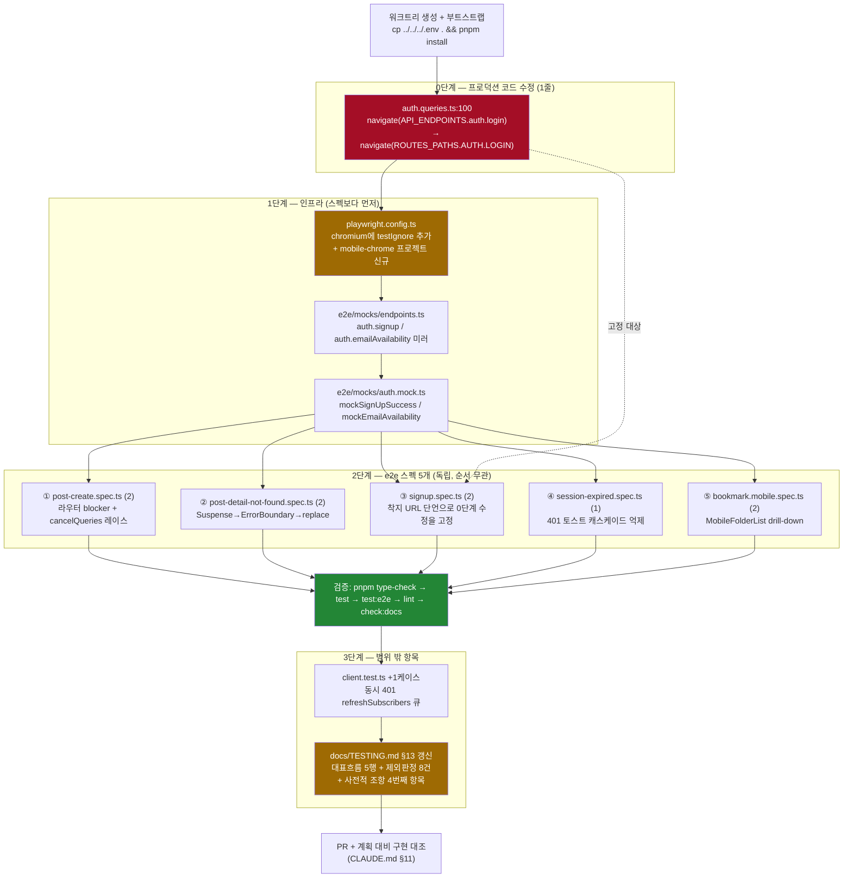

# e2e 시나리오 카탈로그 재수립 + 티어 3 흐름 구현

## Context

이 레포의 e2e는 현재 **16 spec / 32 케이스**다. 2026-09-10에 티어1(4개)·티어2(5개)를
연달아 구현하면서 `docs/TESTING.md` §13의 "아직 만들지 않은 흐름과 판정" 표를 전부
비웠고, `docs/TESTING.md:666-672`가 _"후보 표는 현재 비어 있다"_ 고 선언한 상태다.

사용자가 "e2e 시나리오들을 정리하고 목록을 나열해서 테스트 영역을 늘리자"고 요청했다.
그래서 앱 전 영역을 다시 훑어 **당시 전수 조사가 놓친 14개 후보**를 찾았다 — 제외 판정
7개에도 없고 대표 흐름 16개에도 없던 영역들이다. 각 후보를 `docs/TESTING.md:686-697`의
선별 원칙("유닛으로 검증 불가능한 영역만")에 걸어 실제 코드로 판정한 결과:
**채택 4 / 보류 2 / 제외 8**.

조사 중 **잠복 결함 1건**도 발견했다 — `auth.queries.ts:100`이 라우트 이동에 API
엔드포인트 상수를 쓰고 있는데, 지금은 두 값이 우연히 같아서 동작한다.

사용자가 `AskUserQuestion`으로 확정한 범위: **중간안(채택 4건 전부)** + **모바일 전용
프로젝트 분리** + **잠복 결함 코드 수정** + **동시 401 유닛 1건** + **TESTING.md
카탈로그 갱신**.

### ⚠️ 이 조합이 요구하는 문서 개정 (사용자에게 사전 고지한 사항)

규모는 "중간안"(모바일 미포함)인데 모바일 프로젝트 분리를 함께 선택했다. 프로젝트만
만들고 스펙이 0개면 무의미하므로 **모바일 스펙 1개(2케이스)를 최소한으로 추가**한다.

그런데 `docs/TESTING.md:694-695`의 사전적 조항은 **열거형 3개**다:

> "유닛/컴포넌트 테스트로는 검증 불가능한 영역만: 라우팅 가드, 인증 상태에 따른
> 리다이렉트/모달 분기, 여러 페이지를 가로지르는 mutation→invalidate→refetch 체인."

모바일 뷰포트 분기는 셋 중 **어디에도 해당하지 않는다**. 따라서 이 계획은 §13에
**4번째 항목을 추가하는 개정을 포함한다**. 개정 없이 구현하면 문서와 실제가 어긋난다.

---

## 전체 흐름



---

## 0단계 — 프로덕션 코드 수정 (1줄)

**`src/entities/auth/api/auth.queries.ts:99-101`**

```ts
// before
onSuccess: () => {
  navigate(API_ENDPOINTS.auth.login);
},
// after
onSuccess: () => {
  navigate(ROUTES_PATHS.AUTH.LOGIN);
},
```

**근거**: `API_ENDPOINTS.auth.login`(`api.ts:22`)과 `ROUTES_PATHS.AUTH.LOGIN`
(`route-paths.ts:14`)이 둘 다 `/auth/login`이라 **우연히** 동작한다. 우연이라는 증거는
같은 네임스페이스에 있다 — 회원가입은 이미 갈라져 있다(API `/auth/signup` vs 라우트
`/auth/sign-up`). `API_BASES.auth`(`api.ts:11`)가 바뀌면 즉시 깨지는데 타입도 유닛도
못 잡는다.

import 정리: `API_ENDPOINTS`가 이 파일의 다른 곳에서도 쓰이는지 확인하고, 안 쓰이면
import를 제거한다(CLAUDE.md §3 — 내 변경으로 생긴 고아만 제거).

**주의**: `route-paths.ts`는 `ROUTES_PATHS`를 named export한다. `entities` → `shared`
방향이라 FSD 레이어 규칙 위반이 아니다.

---

## 1단계 — 인프라

### 1-1. `playwright.config.ts` — projects 2개로

```ts
projects: [
  {
    name: 'chromium',
    use: { ...devices['Desktop Chrome'] },
    testIgnore: '**/*.mobile.spec.ts',
  },
  {
    name: 'mobile-chrome',
    use: { ...devices['Pixel 5'] },
    testMatch: '**/*.mobile.spec.ts',
  },
],
```

**`testIgnore`가 빠지면 안 되는 이유** — 기존 스펙 3개가 데스크톱 뷰포트를 **전제로
단언**하고 있어, 모바일에서 돌면 깨진다(전 스펙 2회 실행 방식을 기각한 근거):

| 스펙                                            | 줄    | 모바일에서 실패하는 이유                                                                                                                                          |
| ----------------------------------------------- | ----- | ----------------------------------------------------------------------------------------------------------------------------------------------------------------- |
| `e2e/protected-nav.spec.ts`                     | `:41` | `toHaveCount(1)`. 주석이 _"Desktop Chrome 뷰포트에서 뒤 둘은 display:none"_ 이라고 스스로 명시. 모바일에선 `BottomTabBar.tsx:11`(`md:hidden`)이 살아나 count 증가 |
| `e2e/unsaved-changes.spec.ts`                   | `:38` | `getByPlaceholder(commentPlaceholder)` — 모바일은 `CommentList.tsx:42`의 `!isMobile` 폼이 렌더 안 되고 `:78` `MobileCommentBar`만 뜸                              |
| `e2e/comment.spec.ts`, `comment-delete.spec.ts` | —     | 동일 원인                                                                                                                                                         |

`devices['Pixel 5']`를 쓰는 이유: viewport(393×851) + `hasTouch` + 모바일 UA를 한번에
준다. `useIsMobile.ts:3-14`는 `UA || max-width:768px`이라 뷰포트만으로도 충족되지만,
`usePostCard.ts:86`의 `navigator.share` 분기는 **UA만** 보므로 device 프리셋이 더 넓다.

이 파일에는 주석으로 **왜 project를 나눴는지**(전 스펙 2회 실행이 왜 불가능한지)를
위 표 요지로 남긴다 — 다음 세션이 같은 조사를 반복하지 않도록.

### 1-2. `e2e/mocks/endpoints.ts` — 엔드포인트 2개 미러

`auth` 블록에 추가 (`src/shared/config/api.ts:28-29`의 수동 미러):

```ts
signup: '/auth/signup',
emailAvailability: '/auth/email-availability',
```

`isApiPath`가 정확 일치라 기존 `/auth/account` 목과 오염되지 않는다.

### 1-3. `e2e/mocks/auth.mock.ts` — 공용 목 2개 추가

기존 `mockAuthRefresh`/`mockLoginSuccess`/`mockLoginFailure` 옆에 같은 형태로:

- `mockSignUpSuccess(page)` — POST `/auth/signup` → `wrapResponse(mockAccount)`
- `mockEmailAvailability(page, available = true)` — GET `/auth/email-availability`.
  `account.mock.ts:26-31`의 `mockNicknameAvailability`와 대칭이 되게 시그니처를 맞춘다.

**둘 다 무상태이므로 공용이 맞다**(레포 규약: stateful mock은 스펙 로컬 클로저).

---

## 2단계 — e2e 스펙 5개

모든 스펙의 `beforeEach`는 `installCatchAll(page)`를 **가장 먼저** 등록한다(LIFO).
셀렉터는 `@/shared/config/texts`의 `TEXTS`를 직접 import해 role/label 기반으로 쓴다.

### ① `e2e/post-create.spec.ts` — 최우선 (CRUD 중 유일한 빈칸)

`auth.fixture` 사용(`/post/submit`은 `ProtectedLayout` — `routes/index.tsx:112-118`).

**테스트 2개**

1. `'등록을 제출하면 응답을 기다리지 않고 /post로 이동하고, 저장하지 않은 변경 가드가 뜨지 않는다'`
2. `'등록 직후 시작된 목록 재조회가 취소돼, 뒤늦게 온 옛 응답이 새 글을 지우지 못한다'`

**목**: 공용(`mockAuthRefresh`·`mockAccountQuery`·`mockCategoryOptions`) + **스펙 로컬
stateful**. `GET /post`와 `POST /post`가 **같은 pathname**이므로 `route.request().method()`
분기 + `route.fallback()`이 필수다(`post.mock.ts:33-38`의 `mockDeletePost` 선례).

**핵심 어서션**

| #   | 단언                                                      | 무엇을 증명하나                                            |
| --- | --------------------------------------------------------- | ---------------------------------------------------------- |
| 1   | `POST /api/post` 요청 body가 정규화된 URL을 담는다        | `useCreatePost.ts:33`의 `UrlUtil.normalizeUrl`             |
| 1   | POST 응답 **도착 전에** `toHaveURL(/\/post$/)`            | `useCreatePost.ts:37` fire-and-forget                      |
| 1   | 미저장 변경 가드 dialog `toHaveCount(0)`                  | `clearNow()`(`:34`)가 React Router blocker를 실제로 풀었다 |
| 2   | 지연시킨 옛 목록 응답이 도착해도 새 글 카드가 안 사라진다 | `post.queries.ts:57-60`의 `cancelQueries`                  |

**flaky 대응**

| 위험                                                                    | 대응                                                     |
| ----------------------------------------------------------------------- | -------------------------------------------------------- |
| GET/POST 같은 pathname                                                  | LIFO + method 분기 + `fallback()`                        |
| `canSubmit = isDirty && isValid`(`CreatePostForm.tsx:21`)로 버튼 비활성 | 입력 후 `await expect(button).toBeEnabled()` 준비 게이트 |
| CardTitle과 제출 버튼이 같은 문자열(`texts.ts:128,141`)                 | `getByRole('button', { name })`로 스코프                 |
| `mockPostListResponse.last === true`(`post.fixtures.ts:49`)             | 케이스 2는 스펙 로컬로 `last:false` 2페이지 응답 구성    |

**프로덕션 수정: 불필요**

### ② `e2e/post-detail-not-found.spec.ts`

인증 불필요(`/post/:id`는 공개 — `routes/index.tsx:94-109`) → **`auth.fixture` 미사용**.

**테스트 2개**

1. `'삭제된 글을 직접 열면 안내 토스트 후 /post로 replace되고, 뒤로가기로 그 상세에 다시 들어가지지 않는다'`
2. `'목록에서 카드를 클릭한 사이 글이 사라져도 같은 경로로 목록에 돌아온다'`

**목**: `installCatchAll` + `mockCategoryOptions` + `mockPostList`(전부 공용) + 스펙
로컬 `GET /post/:id` → 404. **응답 body가 중요하다** — `ApiError.status`는 HTTP status가
아니라 body의 `status` 필드에서 오고(`common.type.ts:106`), `client.ts:134`가
`typeof parsed.code === 'string'`일 때만 `ApiErrorResponse`로 인식한다.

**핵심 어서션**

- `toHaveURL(/\/post$/)` + `TEXTS.post.detail.notFound`(`texts.ts:177`) 토스트 표시
- **`replace:true` 증명**: `page.goBack()` 후 URL이 `/post/:id`로 **돌아가지 않는다**
- **전역 토스트가 추가로 안 뜬다**: `TEXTS.messages.error.serverError`가 `toHaveCount(0)`
  → `queryClient.ts:140-142`가 404를 의도적으로 무시하고 화면에 위임하는 계약. 이게
  깨지면 토스트 2개가 뜨는데 유닛은 절대 못 잡는다

**flaky 대응**

| 위험                                                                                                               | 대응                                                                           |
| ------------------------------------------------------------------------------------------------------------------ | ------------------------------------------------------------------------------ |
| 케이스 2에서 카드 `onFocus` prefetch(`usePostCard.ts:121`)가 `retry:1`(`queryClient.ts:158`)을 타 요청 수 비결정적 | **요청 카운트를 단언하지 않는다**. 케이스 1은 `goto` 직입으로 결정적 경로 확보 |
| `toast id: 'post-detail-not-found'`(`PostDetailPage.tsx:70`) 중복 억제                                             | 토스트 **존재**만 단언, 개수 단언 금지                                         |
| 404 fallback이 `SpinnerOverlay` 렌더 후 리다이렉트                                                                 | URL 전이를 먼저 기다림                                                         |

**프로덕션 수정: 불필요**

### ③ `e2e/signup.spec.ts` — 0단계 수정을 고정한다

`auth.fixture` **미사용**(비로그인이어야 `GuestGuard` 통과).

**테스트 2개**

1. `'중복확인을 통과하고 가입하면 /auth/login으로 이동하고, 비로그인 상태라 로그인 폼이 그대로 뜬다'`
2. `'이미 가입된 이메일이면 디바운스 후 인라인 오류가 뜨고 가입 버튼이 잠긴다'`

**목**: `installCatchAll` + `mockEmailAvailability`(신규) + `mockNicknameAvailability`(기존
`account.mock.ts:26`) + `mockSignUpSuccess`(신규). `POST /auth/login`은 등록하지 않는다 —
케이스 1은 로그인 **폼이 뜨는 것**까지만 본다.

**핵심 어서션**

| 단언                                                       | 무엇을 증명하나                                                                   |
| ---------------------------------------------------------- | --------------------------------------------------------------------------------- |
| **`toHaveURL(/\/auth\/login$/)`**                          | 0단계 수정의 회귀 방지. 이 결합을 잡는 **유일한** 안전망                          |
| `GET /auth/email-availability` 요청의 `?email=` 쿼리스트링 | `auth.api.ts:44-47`. `post-list-filters.spec.ts`가 확립한 관용구                  |
| availability 요청 카운트 1회(연속 입력 후)                 | `useDebounce(value, 500)`(`useAvailabilityCheck.ts:23`)가 실제로 합쳐졌다         |
| 케이스 1에서 `getByRole('dialog')` `toHaveCount(0)`        | GuestGuard(`routes/index.tsx:61-74`)가 안 튕김 = 가입이 로그인 상태를 만들지 않음 |
| 케이스 2에서 Sign Up 버튼 `toBeDisabled()`                 | `useSignUp.ts:75-80` `isSubmitDisabled`                                           |

**flaky 대응**

| 위험                                                                      | 대응                                                            |
| ------------------------------------------------------------------------- | --------------------------------------------------------------- |
| 중복 이메일 시 `'Sign In'` 링크가 2곳에 렌더(`SignUpForm.tsx:83`, `:106`) | 카운트 단언 또는 `.first()`                                     |
| 500ms 디바운스 + 300ms 지연 게이트(`SignUpForm.tsx:24`)                   | 중간 상태(`'확인 중이에요...'`)를 단언하지 않고 **최종 상태**만 |
| `getByLabel('Email')` 부분 일치                                           | `{ exact: true }` (login.spec.ts 실측 교훈)                     |

**프로덕션 수정: 불필요** (0단계와 별개)

### ④ `e2e/session-expired.spec.ts` — 1케이스

`auth.fixture` 사용.

**테스트**: `'보호 페이지에서 세션이 만료되면 로그인 페이지로 밀려나고, 캐시 리셋이 만든 배경 401이 토스트를 연쇄로 띄우지 않는다'`

**목**: **전부 스펙 로컬 stateful**. 핵심이 "어느 시점부터 401"이라 무상태 공용 목으로는
불가능하다. `GET /auth/account`·`/bookmark/folders`·`/bookmark/folders/:key/posts`가
플래그에 따라 200↔401(`code: 'NOT_LOGGED_IN'`)을 돌려준다. 플래그 전환은 `page.evaluate`가
아니라 **route 핸들러 내 요청 카운트 기반**으로 해 타이밍을 결정적으로 만든다.

**핵심 어서션**

- `toHaveURL(/\/auth\/login$/)` — `client.ts:207` `AuthUtil.clearAll()` 기본값(`auth.util.ts:64`)
- **로그인 필요 토스트 1개 + 서버 오류 토스트 0개**(개수를 통으로 세지 않고 분리 단언)
  → `resetQueries`(`auth.util.ts:59`)가 만든 배경 401 N건을 `queryClient.ts:106-112`가
  억제한다. `client.test.ts`는 마운트된 쿼리 옵저버가 0개라 이 가드가 **구조적으로 실행
  불가** → 레포 전체에서 미검증인 유일한 경로
- `/auth/login`에서 GuestGuard가 안 튕긴다 = `clearAuth`가 실제로 먹었다

**flaky 대응**: 단언 전 `waitForLoadState('networkidle')`(`loggingOut` 플래그가
`resetQueries().finally`로 풀림 — `auth.util.ts:59-61`).

**⚠️ 새 관용구 주의**: `page.on('load')` 카운트로 하드 내비게이션 유무를 단언하는
방식은 이 레포에 전례가 없다. **1차로는 넣지 않는다** — URL·토스트 단언으로 충분하고,
필요하면 후속으로 검토한다.

**프로덕션 수정: 불필요**

### ⑤ `e2e/bookmark.mobile.spec.ts` — 모바일 첫 스펙

`auth.fixture` 사용. `mobile-chrome` 프로젝트에서만 실행된다.

**왜 이 흐름을 모바일 대표로 골랐나**: `BookmarkPage.tsx:125-166`의 모바일 분기는
**데스크톱에서 전혀 렌더되지 않는 화면**(`MobileFolderList` drill-down)이고, URL
파라미터(`?folder=`)와 얽혀 있다. `useMobileFolderList.test.ts` 8개가 훅 로직을 덮지만
drill-down 네비게이션(폴더 선택 → URL 변경 → 화면 전환 → 뒤로가기 복귀)은 실제 라우터가
필요하다. 다른 모바일 후보(`MobileCommentBar`, `BottomTabBar`)는 한 컴포넌트 안에서
종결되거나 기존 스펙과 어서션이 겹친다.

**테스트 2개**

1. `'모바일에서 /bookmark에 들어가면 폴더 목록이 먼저 뜨고, 폴더를 고르면 그 폴더의 글 목록으로 전환된다'`
2. `'폴더 목록으로 돌아가는 뒤로가기가 폴더 선택만 취소하고 페이지를 벗어나지 않는다'`

**목**: 공용 `mockAuthRefresh`·`mockAccountQuery`·`mockBookmarkFolderList`·
`mockBookmarkFolderPosts` 재사용. **신규 목 불필요**.

**핵심 어서션**

- `?folder` 없을 때 `MobileFolderList`가 뜨고 게시글 목록은 안 뜬다(데스크톱 `FolderTree`와
  구분되는 접근 이름으로 단언)
- 폴더 탭 → URL에 `?folder=<key>` 반영 + `GET /bookmark/folders/:key/posts` 요청 발생
- 뒤로가기 → URL에서 `folder` 사라지고 폴더 목록 복귀, **URL은 여전히 `/bookmark`**

**flaky 대응**

| 위험                                                                                                | 대응                                                                                              |
| --------------------------------------------------------------------------------------------------- | ------------------------------------------------------------------------------------------------- |
| `useIsMobile`이 lazy init + `useEffect` 재계산(`useIsMobile.ts:19-21`)이라 첫 렌더 후 한 번 더 갱신 | 폴더 목록이 보일 때까지 `expect(...).toBeVisible()`로 대기(고정 timeout 금지)                     |
| 모바일에서 `BottomTabBar` 링크가 같은 라벨을 렌더                                                   | 폴더 영역 컨테이너로 스코프                                                                       |
| 접근 이름이 없는 요소 발견 시                                                                       | **구현 중 발견되면 그 자리에서 보고하고 승인받는다** — 프로덕션 수정은 이 계획에 포함돼 있지 않다 |

**프로덕션 수정: 원칙적으로 불필요** (⚠️ `MobileFolderList.tsx` 전문을 읽지 않았으므로
접근 이름 부재 가능성이 남아 있다 — 발견 시 별도 보고)

---

## 3단계 — 범위 밖 항목 (사용자 승인함)

### 3-1. `src/shared/api/client.test.ts` — 유닛 1케이스 추가

`client.ts:186-195`의 **동시 401 → `refreshSubscribers` 큐**가 현재 유일한 완전 미커버
인증 경로다. e2e보다 유닛(MSW)이 훨씬 싸다:

```
Promise.all([apiClient.get(A), apiClient.get(B)]) 가 둘 다 401 TOKEN_EXPIRED
  → POST /auth/refresh 호출 횟수가 정확히 1인지 단언 (2가 되면 큐가 안 먹은 것)
  → 두 원요청이 모두 재시도되어 성공하는지 단언
```

기존 `client.test.ts:68`이 이미 요청 카운트(`commentCallCount).toBe(2)`) 관용구를 쓰고
있으므로 그 형태를 따른다.

### 3-2. `docs/TESTING.md` §13 갱신 — 3곳

| 위치                    | 갱신 내용                                                                                                                                                                                                                                              |
| ----------------------- | ------------------------------------------------------------------------------------------------------------------------------------------------------------------------------------------------------------------------------------------------------ |
| `:645-655` 대표 흐름 표 | 이번에 만든 5개 스펙 행 추가 (16 → 21 spec)                                                                                                                                                                                                            |
| `:666-672` 후보 표      | 이번 판정의 **보류 2건**을 후보로 기입 — 무한스크롤(보류 B), 모바일 나머지 분기(MobileCommentBar·BottomTabBar 등). §13 유지 규약이 명시적으로 요구하는 작업                                                                                            |
| `:676-684` 제외 판정 표 | 이번 제외 8건 추가 — 북마크 Undo(유닛 12개), 북마크 정렬/폴더검색, 이미지 업로드(유닛 22개), `usePostCard` 복사/공유, 최근 검색어, 다크모드/사이드바/이미지뷰어, 404·403·500 라우트, `AppErrorFallback` 청크 실패. 기존 7개와 같은 톤으로 **이유까지** |
| `:686-697` 사전적 조항  | **4번째 항목 추가** (위 Context의 ⚠️ 참고): _"브라우저 환경 전용 — jsdom이 구현하지 않는 API(IntersectionObserver, 실제 스크롤·터치)나 뷰포트/UA 분기로만 도달 가능한 코드 경로."_                                                                     |

추가로 **"스택 개요" 표의 브라우저 행**을 갱신한다 — 현재 _"Chromium만(v1 범위)"_ 인데
`mobile-chrome` 프로젝트가 생기므로 사실과 어긋난다. 모바일 스펙 파일명 규칙
(`*.mobile.spec.ts`)과 `testIgnore`/`testMatch` 계약도 여기 적는다.

### 3-3. `CHANGELOG.md`

`[Unreleased]`에 항목 추가 — 0단계가 동작이 바뀌는 `fix`에 해당한다(CLAUDE.md의
"릴리즈노트 관리"). 포맷은 `changelog-release` skill을 먼저 읽고 따른다.

---

## 최종 규모

|                     | 전  | 후                           |
| ------------------- | --- | ---------------------------- |
| e2e spec            | 16  | **21** (+5)                  |
| e2e 케이스          | 32  | **41** (+9: 2+2+2+1+2)       |
| Playwright 프로젝트 | 1   | 2 (chromium + mobile-chrome) |
| 유닛 케이스         | 356 | 357 (+1)                     |

**CI 영향**: 가장 최근 성공 run(`34746098851`, 2026-09-13) 실측 — `e2e` job 77초
(그중 `Run e2e tests` 41초), `check` job 79초. 두 job은 병렬이고 `check`가 더 길므로
e2e는 **critical path가 아니다**. 케이스당 약 1.0~1.3초(⚠️ 41초/32케이스에서 vite 부팅
~10초를 뺀 역산) 기준 +9케이스면 약 +12초 → 여전히 `check`와 비슷하거나 조금 넘는
수준이다.

---

## 검증

### 작업 환경

```bash
# 워크트리 필수 (CLAUDE.md Critical Rules)
git log origin/main..main   # 미푸시 커밋 확인 후 EnterWorktree
cp ../../../.env . && pnpm install
node -v                     # v24 확인
```

### 단계별 검증

| 단계       | 명령                                                                                | 통과 기준                                                                                                                                                        |
| ---------- | ----------------------------------------------------------------------------------- | ---------------------------------------------------------------------------------------------------------------------------------------------------------------- |
| 0단계 직후 | `pnpm type-check`                                                                   | `ROUTES_PATHS` import 에러 없음                                                                                                                                  |
| 1단계 직후 | `pnpm exec playwright test --list`                                                  | 기존 16 spec이 `chromium`에만, 모바일 스펙이 `mobile-chrome`에만 배정되는지 **목록으로** 확인 (`testIgnore`/`testMatch`가 실제로 먹는지가 이 단계의 핵심 리스크) |
| 스펙마다   | `pnpm exec playwright test e2e/<파일> --headed`                                     | 화면으로 흐름 확인 후 헤드리스 재실행                                                                                                                            |
| 2단계 완료 | `pnpm test:e2e`                                                                     | **21 spec / 41 케이스 전부 통과**. 기존 32개가 하나도 안 깨지는 게 가장 중요                                                                                     |
| 3-1 직후   | `pnpm test`                                                                         | 357 케이스 통과                                                                                                                                                  |
| 전체       | `pnpm type-check` → `pnpm test` → `pnpm test:e2e` → `pnpm lint` → `pnpm check:docs` | 순서대로 전부 green                                                                                                                                              |

### flaky 검증 (CI 재현)

`fullyParallel: true` + CI `retries: 2` 환경에서 타이밍 의존 스펙(①의 지연 응답, ③의
디바운스, ④의 상태 전환)이 불안정할 수 있다. **신규 스펙만 3회 연속 실행**해 재현성을
확인한다:

```bash
pnpm exec playwright test e2e/post-create.spec.ts e2e/post-detail-not-found.spec.ts \
  e2e/signup.spec.ts e2e/session-expired.spec.ts e2e/bookmark.mobile.spec.ts \
  --repeat-each=3
```

1회라도 실패하면 그 스펙의 flaky 대응 표를 다시 검토한다 — retry로 덮지 않는다.

### 눈으로 확인

모바일 스펙은 실제 화면이 바뀌는 것이므로 `--headed`로 확인하고, 필요하면
`browser-verification` skill 절차에 따라 녹화해 공유한다.

---

## 계획 대비 구현 대조 (CLAUDE.md §11)

PR 전에:

1. 이 계획을 `docs/plans/2026-09-14-e2e-tier3-scenarios.md`로 구현 코드와 같은 PR에 커밋
2. **fresh Explore subagent**에게 커밋된 계획 파일 + 실제 diff를 주고 대조시킨다 —
   특히 **계획에 없던 프로덕션 코드 수정이 섞였는지**(0단계 1줄 외에 `src/` 변경이
   있는지)를 중점적으로 본다
3. 결과를 PR 본문 `## 계획 대비 구현` 섹션에 항목별 "구현됨(파일:줄)/이탈(이유)/미구현"으로 기록

---

## 이 계획에서 의도적으로 **하지 않는** 것

- **최대안의 무한스크롤 스펙** — 중간안 선택에 따라 제외. §13 후보 표에 보류로 기입만 한다
- **모바일 나머지 분기**(MobileCommentBar, BottomTabBar, MobileNavbarSearch) — 프로젝트
  배선은 하되 스펙은 `bookmark.mobile` 1개만. 나머지는 후보 표로
- **제외 판정 8건** — 구현하지 않고 이유만 문서화
- **`page.on('load')` 하드 내비게이션 단언** — 전례 없는 관용구라 1차에서 제외
- **접근 이름 추가 등 프로덕션 UI 수정** — 0단계 1줄 외에 `src/` 변경 없음이 목표.
  필요해지면 그 자리에서 보고하고 승인받는다
