# 필터 칩 URL 상태 — mutation 제거 및 pending-intent 명시적 추적

## Context

`/post` 필터 칩 클릭 시 URL·UI가 간헐적으로 반응 없어 보이거나 되돌아가는 문제를
Playwright로 재현·원인 확정했다(이전 세션, 2026-09-14). 핵심 원인:

- `usePostList.ts`의 `toggleFilter`/`setSearch`가 `useSearchParams()`가 돌려주는
  **공유 URLSearchParams 인스턴스를 `.set()`/`.delete()`로 직접 수정(in-place mutate)**한다.
- `RouterProvider.tsx:21`의 `v7_startTransition: true` 때문에, 필터 변경으로 목록 쿼리가
  suspend하는 동안 React가 보는 `location.search`는 API 응답이 올 때까지 갱신되지 않는다.
- 그 "정지 구간" 안에서 사용자가 또 클릭하면, 아직 커밋 안 된 이전 mutation이 남아있는
  **같은 인스턴스**를 또 읽고 고친다.

Playwright 실측(`history.pushState` 계측 + 네트워크 지연 주입)으로 이 mutation이
**양날의 검**임을 확인했다:

| #   | 시나리오                                                                                                    | 지금(mutation 있음)                                               | 판정                                                     |
| --- | ----------------------------------------------------------------------------------------------------------- | ----------------------------------------------------------------- | -------------------------------------------------------- |
| A   | 정지 구간에 **다른** 필터 연속 클릭 (예: 북마크한→내가 작성한)                                              | 둘 다 누적됨(`filter=isBookmarked,isMyPosts`)                     | mutation 덕분 — **유지 필수**                            |
| B   | 정지 구간에 **다른 파라미터**(카테고리 `q` → 범위 `filter`) 연속 클릭                                       | 둘 다 살아남음(`?q=...&filter=isBookmarked`)                      | mutation 덕분 — **유지 필수**                            |
| C   | 정지 구간에 **같은** 필터 재클릭                                                                            | 완전히 취소됨(URL이 `/post`로 되돌아감)                           | 토글의 **정상 동작으로 간주, 이번 범위 밖**(사용자 확정) |
| D   | `clearSearch`(초기화) 직후 정지 구간에 다른 칩 클릭                                                         | 방금 지운 필터가 되살아남                                         | **버그 — 고친다**                                        |
| E   | `BookmarkPage`(folder/sort)와 `useBookmarkSearch`(q)가 **서로 다른 useSearchParams 인스턴스**를 각자 mutate | 구조적으로 유실 가능(북마크는 suspense가 없어 실사용 재현은 드묾) | **구조를 맞게 고친다**(사용자 확정)                      |

D/E를 고치려고 mutation을 단순 제거하면 A/B가 깨진다(정지 구간 두 번째 클릭이 옛
`location.search`에서 새로 시작해 앞 클릭을 덮어씀) — 실측으로 확인. 그래서 mutation이
우연히 담당하던 역할("커밋 전 최신 의도를 들고 있기")을 **명시적인 자리로 옮기는 재설계**가
필요하다(사용자 확정, Plan 서브에이전트 설계 검토·검증 완료).

**이번 범위 밖으로 명시**(사용자 확정):

- C(같은 칩 재클릭=취소) — 토글의 정상 동작. 업계 리서치([NN/g Visibility of System
  Status](https://www.nngroup.com/articles/visibility-system-status/), [DEV Community
  race-condition 글](https://dev.to/shubhradev/the-optimistic-ui-race-condition-that-only-showed-up-on-the-fifth-click-5a55))를
  검토했으나 "검색 파라미터 필터 칩"이라는 구체적 사례에 대한 근거는 아니었고, 실제로 이 앱도
  `v7_startTransition`이 Suspense fallback을 억제해 필터 변경 시 로딩 신호가 원래 없다 —
  로딩 피드백 추가도 범위에서 제외.
- `PostListSearch.tsx`의 낙관적 미러(`optimisticFilters` 등) 자체 — 읽기/표시 로직은 그대로 둔다.
- 헤더 검색 제출이 `filter`를 날리는 별개 버그(`NavbarSearch.tsx`) — 발견만 기록.

## 설계

```mermaid
flowchart TD
  subgraph "지금(mutation)"
    C1["클릭1"] --> M1["공유 인스턴스 직접 .set()"]
    M1 --> C2["클릭2(정지 구간 중)"]
    C2 --> M2["같은 인스턴스 또 직접 .set()"]
    M2 --> R1["A/B: 우연히 누적됨<br/>D: clearSearch 후에도 옛 mutation 잔존<br/>E: 다른 훅 인스턴스는 서로 못 봄"]
  end

  subgraph "이후(pending 명시적 추적)"
    D1["클릭1"] --> U1["updateSearchParams(updater)"]
    U1 --> P1["draft = new URLSearchParams(committed 또는 pending)<br/>updater(draft) 적용<br/>pendingIntent = {locationKey, draft} (모듈 스코프)"]
    P1 --> D2["클릭2(정지 구간 중)"]
    D2 --> U2["updateSearchParams(updater)"]
    U2 --> P2["base = pendingIntent (같은 locationKey)<br/>→ draft가 클릭1 위에 이어붙음"]
    P2 --> Commit["API 응답 도착 → location.key 변경<br/>→ effect가 pendingIntent 폐기"]
    Commit --> R2["A/B: 명시적으로 보장<br/>D: clearSearchParams가 pending을 빈 값으로 기록<br/>E: 모듈 스코프라 두 훅이 공유"]
  end
```



**새 공용 훅**: `src/shared/hooks/useSearchParamsDraft.ts`

- 위치 이유: 쓰기 호출부 3곳(`usePostList.ts`/`BookmarkPage.tsx`/`useBookmarkSearch.ts`)의
  공통 조상이 `shared`뿐이고, 로직이 미묘해(§ 아래) 복붙하면 반드시 어긋난다.
- pending은 **모듈 스코프 변수**로 둔다(선례: `src/shared/lib/router/navigation.ts`의
  `NavigationService` — 모듈 `let` + `setNavigate`로 1회 주입하는 것과 같은 "라우터는
  앱당 하나"라는 전제). BookmarkPage·useBookmarkSearch처럼 서로 다른 훅 인스턴스가 같은
  URL이라는 공유 자원에 대한 pending을 공유해야 하는데, `useRef`는 인스턴스마다 따로라
  이 요구를 못 채운다(E를 위해 필요, 사용자 확정).

```ts
// 의사코드 — 실제 구현 시 이 파일의 JSDoc에 아래 4가지 설계 근거를 남긴다
let pendingIntent: { locationKey: string; params: URLSearchParams } | null = null;
let lastSeenLocationKey: string | null = null;

export function resetPendingSearchParams() {
  pendingIntent = null;
  lastSeenLocationKey = null;
}

export function useSearchParamsDraft() {
  const [searchParams, setSearchParams] = useSearchParams();
  const { key: locationKey } = useLocation();

  // pending 정리는 반드시 effect에서 — 렌더 중엔 안 된다. 정지 구간 동안 React는
  // "새 location으로 렌더 → suspend → 버림"을 반복하는데, 렌더 중에 쓴 값은 그 렌더가
  // 버려져도 되돌아오지 않는다. effect는 커밋된 렌더에서만 돈다.
  useEffect(() => {
    if (lastSeenLocationKey === locationKey) return;
    lastSeenLocationKey = locationKey;
    pendingIntent = null;
  }, [locationKey]);

  const updateSearchParams = useCallback(
    (updater, navigateOptions) => {
      const isFresh = pendingIntent?.locationKey === locationKey;
      const draft = new URLSearchParams(isFresh ? pendingIntent!.params : searchParams);
      updater(draft);
      pendingIntent = { locationKey, params: draft };
      setSearchParams(draft, navigateOptions);
    },
    [locationKey, searchParams, setSearchParams]
  );

  const clearSearchParams = useCallback(
    (navigateOptions) => {
      const empty = new URLSearchParams();
      pendingIntent = { locationKey, params: empty };
      setSearchParams(empty, navigateOptions);
    },
    [locationKey, setSearchParams]
  );

  return { searchParams, updateSearchParams, clearSearchParams };
}
```

읽기(`searchParams`)에는 pending을 섞지 않는다 — `PostListSearch`의 `useEffect([currentFilter])`
3종, `usePostList`의 쿼리 키가 지금처럼 "커밋된 URL"만 기준으로 돌아야
`flushSync` 낙관적 미러와 이중 반영되지 않는다.

신선도 판정은 **`location.key`**로 한다(react-router의 `useLocation().key`, push/replace/pop마다
새로 생성됨 — `@remix-run/router`의 `createLocation`). `useSearchParams()` 인스턴스
identity로는 훅 호출부마다 별도 메모라 BookmarkPage/useBookmarkSearch 간 공유가 안 된다.
URL 문자열 비교로는 "A→B→A(뒤로가기)"에서 옛 pending이 되살아나는 구멍이 남는다.

## 변경 파일

| 파일                                                              | 변경                                                                                                                                                             |
| ----------------------------------------------------------------- | ---------------------------------------------------------------------------------------------------------------------------------------------------------------- |
| `src/shared/hooks/useSearchParamsDraft.ts` (신규)                 | 위 훅 + `resetPendingSearchParams` export                                                                                                                        |
| `src/widgets/post/post-list/hooks/usePostList.ts`                 | `usePostListParams`의 `setSearch`/`toggleFilter`/`clearSearch`만 교체. 읽기(18-21행)·`usePostList()`(71-118행) 무변경                                            |
| `src/pages/bookmark/BookmarkPage.tsx`                             | `setFolderKey`/`setSort`/`goToFolderList`/`redirectWhenFolderMissing`의 mutation을 `updateSearchParams` updater로. `navigateOptions`(replace 여부)는 그대로 보존 |
| `src/widgets/bookmark/bookmark-search/hooks/useBookmarkSearch.ts` | `applySearch`만 교체. `BookmarkSearch.tsx`는 무변경(시그니처 유지)                                                                                               |
| `src/test/setup.ts`                                               | `afterEach`에 `resetPendingSearchParams()` 1줄 추가(선례: 같은 블록의 `useAuthStore.getState().clearAuth()`)                                                     |
| `src/test/utils.tsx`                                              | `WrapperOptions`에 `future?: MemoryRouterProps['future']` 선택 필드 추가(기존 호출부 무영향) — 신규 테스트가 `v7_startTransition`을 재현하려면 필요              |

`PostListSearch.tsx`(낙관적 미러), `usePostList()`(데이터 페칭), `useNavbarSearch.ts`,
`FolderTree.tsx`의 `onSelect` 시그니처는 이번 변경 대상이 아니다.

## 검증

기존 `PostListSearch.test.tsx`는 `PostList`를 렌더하지 않아 suspend가 없고
(`renderWithProviders`의 `MemoryRouter`에 `future`도 없어) 이 버그 클래스를 구조적으로
못 잡는다 — 그래서 아래 신규 테스트가 실제 회귀 검증을 담당한다.

1. **`src/shared/hooks/useSearchParamsDraft.test.tsx`** (신규) — 메커니즘 단위. 수동
   resolve 가능한 suspender로 정지 구간을 결정적으로 만든다. 케이스: 정지 구간 내 연속
   update 누적, 커밋 후 update는 커밋 URL 기준, `clearSearchParams()` 직후 update(D),
   두 훅 인스턴스 간 pending 공유(E), 외부 navigate로 키 변경 시 pending 폐기.
2. **`src/widgets/post/post-list/hooks/usePostList.test.tsx`** (신규) — `PostListSearch` +
   진짜 suspend하는 소비자(`usePostList()` 호출하는 probe 컴포넌트)를 함께 렌더, MSW
   핸들러를 게이트(수동 release)로 교체. **구현 전에 먼저 작성해 D가 빨갛게 실패하는 것을
   확인**하고(`.claude/CLAUDE.md` §4), 구현 후 A/B/C/D 전부 통과시킨다. `future={{
v7_startTransition: true }}` 필수(`RouterProvider.tsx:21`과 동일 조건).
3. 기존 `PostListSearch.test.tsx`, `e2e/post-list-filters.spec.ts` — 무변경 통과 필수(URL
   문자열 형태가 바이트 동일해야 함 — `new URLSearchParams(...)`은 키 순서 보존).
4. 순서대로: `pnpm type-check` → `pnpm test`(신규 포함) → `pnpm lint` → `pnpm check:docs`.
5. 수동: `pnpm dev` 후 Playwright로 이전 세션이 재현한 S1(대조군)·S3(같은 칩 재클릭=취소,
   고정된 현재 동작 확인용)·초기화 직후 재클릭(D, 고쳐졌는지) 재실행.

## 문서 갱신

- `docs/SEARCH.md` — URL 갱신 경로를 `useSearchParamsDraft` 기준으로 갱신(§5 구조, §6
  상태 모델에 pending 행 추가), §10 시행착오에 이번 경위 추가.
- `docs/BOOKMARK.md` — folder/sort/q가 같은 pending 메커니즘을 공유한다는 점 반영.
- `docs/TESTING.md` — 신규 테스트 파일 인벤토리 추가.
- `docs/DECISIONS.md` — 모듈 스코프(B) vs 훅별 useRef(A) 중 B를 택한 근거 기록.

## 하지 않는 것

- C(같은 칩 재클릭=취소) 변경, 로딩 피드백 UI 추가 — 근거 부족 확인, 사용자 확정으로 제외.
- `PostListSearch.tsx`의 낙관적 미러를 초기화(clearSearch) 시 함께 비우는 것 — 과도기
  불일치가 남지만 사용자가 "안 건드림"으로 확정.
- 카테고리 칩 A→정지 구간 중 카테고리 칩 B 클릭 시 A가 사라지는 것(태그 병합이
  `updater` 밖에서 커밋된 `searchQuery` 기준으로 계산되기 때문, `PostListSearch.tsx:115-127`) —
  지금도 같은 동작이라 회귀 아님. 후속 과제로만 기록.
- `NavbarSearch.tsx`의 검색 제출 시 `filter` 유실 — 별개 버그, 발견 사실만 기록.
