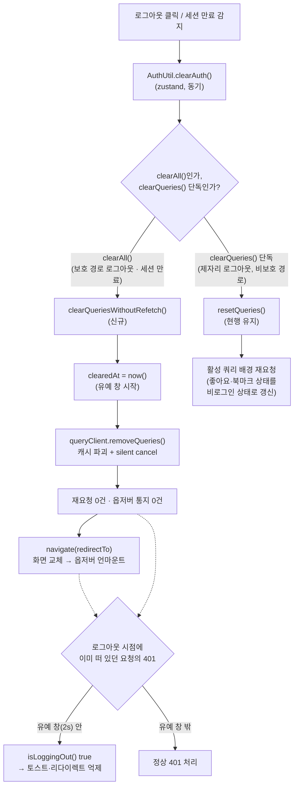

# 로그아웃 시 불필요한 배경 재요청 제거

## Context

이전에 고친 "재로그인 후 내 댓글 캐시 재사용" 버그([PR #94](https://github.com/BAECHAN/link-sphere_FE_NEW/pull/94))를
설명하는 과정에서, 사용자가 "애초에 로그아웃 시 `GET /comment/my` 같은 요청을 보내는 것
자체를 안 하면 안 되나?"라고 물었다. 조사 결과 이건 타당한 지적이었다 — 실제로 필요
없는 요청이었다.

`AuthUtil.clearQueries()`(`src/shared/utils/auth.util.ts:56-62`)가 `queryClient.resetQueries()`로
로그아웃 시 화면에 남은 **모든 활성 쿼리**를 토큰 없는 상태로 배경 재요청한다.
`AuthUtil.clearAll()`(`:64-68`)은 `clearAuth() → clearQueries() → navigate()` 순으로 실행되는데,
보호 경로 로그아웃(`/bookmark`, `/my/comments` 등)이나 세션 만료(`/auth/login`으로 강제 이동)처럼
**어차피 다른 화면으로 이동하는 경우**엔 그 화면의 쿼리를 재요청하는 게 100% 낭비다 —
401만 받고 버려진다. 반대로 **제자리 로그아웃**(비보호 경로, 네비게이션 없음)에서는 화면에
남은 인증 의존 데이터(좋아요·북마크 여부)를 로그아웃 상태로 다시 그리기 위해 재요청이
여전히 필요하다.

fresh Explore 서브에이전트가 `node_modules/@tanstack/query-core` 실제 소스까지 열어
확정한 핵심 사실:

- `resetQueries()`엔 재요청을 끄는 옵션이 없다(`invalidateQueries`의 `refetchType:'none'`에
  해당하는 게 없음, `query-core/src/queryClient.ts:258-276`).
- `Query.reset()` 자체는 재요청을 안 내지만, 이 앱의 목록·상세·댓글·내 댓글이 전부
  `useSuspenseQuery`/`useSuspenseInfiniteQuery`라 리렌더가 한 번이라도 끼면 React 레이어가
  다시 요청을 낸다(`useBaseQuery.ts:127-129`) — 완전히 막으려면 `removeQueries()`가 필요.
- 분기 기준은 `isProtectedPath`가 아니라 **"네비게이션이 뒤따르는가"**(`clearAll()` 호출
  여부)가 정확하다 — 세션 만료도 비보호 경로에서 `clearAll()`로 이동시키기 때문.
- `isLoggingOut` 플래그는 완전히 없앨 수 없다 — `client.test.ts`(Case 2~4)와
  `session-expired.spec.ts`가 실제로 이 플래그(토스트·중복 리다이렉트 억제)에 의존한다.
  타임스탬프 기반 유예 창으로 재구성해야 한다(레포 선례: `useSearchParamsDraft.ts`의
  `resetPendingSearchParams()`).

**의도한 결과**: 로그아웃/세션 만료로 화면이 바뀌는 경우엔 그 화면의 쿼리를 재요청하지
않는다. 제자리 로그아웃은 지금과 동일하게 동작한다.

## 전체 흐름

## 핵심 변경

### 1. `src/shared/utils/auth.util.ts`

- 모듈 스코프 상수 `LOGOUT_GRACE_MS = 2000` 추가 (근거: 현재 `resetQueries()` Promise가
  실제로 열어두던 창 ≈ RTT + 기본 재시도 지연 1000ms(`retryer.ts:48-49`) + RTT)
- `clearedAt` static 필드 추가 (재요청 없이 캐시를 버린 시각)
- `isLoggingOut()`을 `this.loggingOut || Date.now() - this.clearedAt < LOGOUT_GRACE_MS`로 확장
- 신규 private 메서드 `clearQueriesWithoutRefetch()`: `clearedAt` 갱신 + `queryClient.removeQueries()`
  (필터 없음 — 캐시 전체를 파괴, 재요청도 옵저버 통지도 없음. `cancelQueries()`는 별도로
  부를 필요 없음 — `removeQueries → destroy() → cancel({silent:true})`가 이미 포함)
- `clearAll()`이 `clearQueries()` 대신 `clearQueriesWithoutRefetch()`를 쓰도록 1줄 교체
- `clearQueries()`(제자리 로그아웃 경로) 자체는 **무수정** — 화면이 남으므로 재요청이
  여전히 필요
- 테스트 격리용 `static resetLogoutGuard()` 추가 (선례: `useSearchParamsDraft.ts`의
  `resetPendingSearchParams()` 패턴)

### 2. `src/test/setup.ts`

`afterEach`에 `AuthUtil.resetLogoutGuard()` 호출 추가 — 없으면 유예 창이 테스트 간
누수돼 `client.test.ts`의 Case 3·4(순차 실행, `vi.waitFor`가 `NavigationService.navigate`
호출을 기다림)가 실패한다.

### 3. `src/shared/utils/auth.util.test.ts` (현재 `isTokenExpired`만 있음, 6개 테스트 추가)

- `clearAll()`은 화면에 떠 있는 활성 쿼리를 다시 요청하지 않는다(`useQuery` 기준)
- `clearAll()`은 Suspense 쿼리도 다시 요청하지 않는다(`useSuspenseQuery` 기준 — 이게
  이번 변경의 핵심 실증)
- (대비군) `clearQueries()`는 제자리 로그아웃에서 활성 쿼리를 다시 요청한다 — 두 경로가
  의도적으로 다르다는 계약을 고정
- `clearAll()`은 인증을 비우고 지정 경로로 replace 이동한다
- `clearAll()` 직후 `isLoggingOut()`은 true, 유예 시간이 지나면 false(`vi.useFakeTimers()`)
- (선택) `clearQueries()`의 재요청이 끝나면 `isLoggingOut()`이 false로 돌아온다(기존 동작 고정)

MSW 대신 `vi.fn()` queryFn으로 호출 횟수를 직접 세는 방식(선례: `client.test.ts`의
`commentCallCount` 패턴) — 검증 대상이 "queryFn이 다시 불렸는가"라 더 직접적이다.
`queryClient`/`NavigationService` 모듈은 통째로 mock(선례: `client.test.ts:13-18`).

### 4. `e2e/logout.spec.ts`

보호 경로(`/bookmark`) 로그아웃 테스트에 "로그아웃 클릭 이후 북마크 API 요청 0건" 단언
추가(사용자 확인 완료) — 이 변경의 핵심 가치를 브라우저 레벨에서 계속 검증하는 유일한
자동화 수단.

### 5. 문서 갱신

- `docs/AUTH.md` §8-E — 현재 "로그아웃은 항상 `resetQueries()`로 배경 재요청한다"는
  단일 경로 전제로 쓰여 있다. "제자리 로그아웃(재요청 있음) vs 이동 수반 로그아웃(재요청
  없음)" 두 경로로 표를 나눠 갱신. `isLoggingOut()`이 덮는 두 종류의 401(배경 재요청 +
  로그아웃 시점에 이미 떠 있던 요청)도 명시.
- `docs/FE-ARCHITECTURE.md`, `docs/MYPAGE.md`의 관련 서술 갱신 (`clearQueries로 인한
배경 재요청 레이스` → `로그아웃 직후 구간`)
- `e2e/session-expired.spec.ts`의 "resetQueries()가 트리거하는 배경 재요청들의 401도
  같은 가드로 억제되어" 주석 — 단언 자체는 안 깨지지만 설명이 부정확해지므로 갱신
- `docs/DECISIONS.md`에 `resetQueries` vs `removeQueries` 대안 비교 근거 추가(CLAUDE.md §8)

### 6. CHANGELOG

`### Changed` 섹션에 `auth` 스코프로 추가 — 버그 수정이 아니라 낭비 제거이므로 Fixed가
아닌 Changed.

## 영향 범위 점검

- **CRUD**: Create/Update/Delete 무관(Read 전용 캐시 정리, `removeQueries()`는 QueryCache만
  건드리고 MutationCache는 무관).
- **회귀 가능 지점**: `client.test.ts`(유예 창 누수 → setup.ts 리셋으로 해결),
  `session-expired.spec.ts`(단언은 유지되지만 주석 갱신 필요), `logout.spec.ts`(코드
  경로 자체는 비보호 경로 무변경, 보호 경로만 캐시 처리 방식 변경 — 단언은 유지),
  `auth.queries.ts`의 로그인 시 에러 캐시 리셋(`:33-35`)은 제자리 로그아웃 경로에
  여전히 필요하므로 코드 유지.
- **범위 밖으로 명시 제외**: `useFetchAccountQuery`(Navbar 상시 마운트)가 `enabled`
  반영 타이밍 때문에 겪는 부수적 재요청 낭비 — 원인이 다르므로(React `useEffect` 커밋
  타이밍) 이번 변경으로 부수적으로 해소되는지만 관찰하고 별도 설계는 하지 않는다.

## 검증 방법

1. `EnterWorktree` (fresh) → `cp ../../../.env .` → `pnpm install`
2. `auth.util.ts`/`setup.ts` 변경 → `pnpm test src/shared/api/client.test.ts`로 Case 2→3→4
   그린 확인(유예 창 누수 없음)
3. `auth.util.test.ts` 테스트 6개 추가 → 변경을 잠시 되돌려 테스트 1·2가 실제로 실패하는지
   확인(가짜 통과 방지) → 되살려 전체 통과 확인
4. 문서 갱신 → `pnpm check:docs`
5. `logout.spec.ts` e2e 단언 추가 → `pnpm test:e2e` (logout, session-expired 우선 확인 후 전체)
6. CHANGELOG + `docs/plans/` 계획 파일 커밋 → `pnpm format:check`(details 블록 들여쓰기 함정)
7. 전체 게이트: `pnpm type-check && pnpm test && pnpm lint && pnpm format:check && pnpm check:docs && pnpm test:e2e`
8. 브라우저 실증(`browser-verification` skill로 녹화):
   - `/bookmark`에서 로그아웃 → `/post` 도착, 북마크·계정 재요청 0건 확인
   - `/my/comments`에서 로그아웃 → 재로그인 → 재진입 → 정상 표시(PR #94 회귀 없음)
   - `/post`(비보호)에서 로그아웃 → 기존과 동일하게 재요청 발생, 좋아요/북마크 표시가
     비로그인 상태로 갱신됨
   - 세션 만료 강제 재현 → `/auth/login` 이동, 토스트 0개
