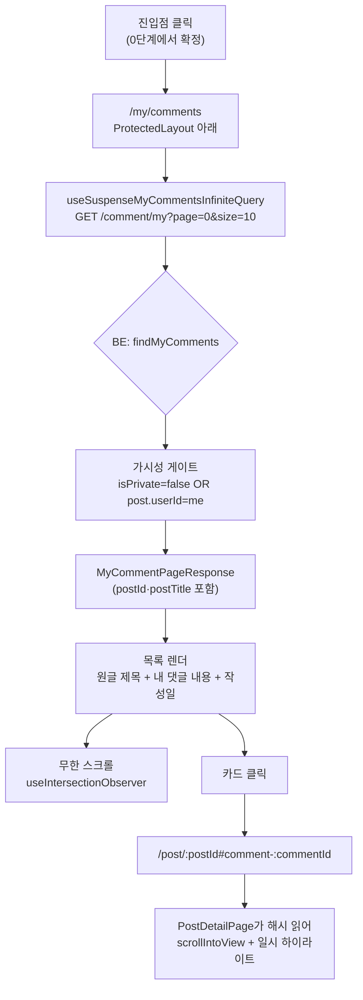

# 내 댓글 히스토리 화면 추가

## Context

사용자가 **자기가 단 댓글을 다시 찾을 방법이 앱에 전혀 없다.** 조사로 확인한 현황:

- 마이페이지는 [`MyPageModal.tsx`](../../project/link-sphere/link-sphere_FE_NEW/src/widgets/layout/mypage/ui/MyPageModal.tsx)의 프로필 수정 모달 하나뿐 — 전용 라우트조차 없다
- 댓글 조회는 `GET /post/{postId}/comment`(글 단위)만 존재. **BE `CommentRepository.kt`에 `userId` 기반 조회 메서드 자체가 없다**
- 댓글 응답 DTO(`CommentResponse`)에 `postId`·원글 제목이 없어 "어느 글에 단 댓글인지"를 표현할 수단이 없다

범위는 사용자와 합의해 **댓글 히스토리만**으로 한정한다. "내가 쓴 글"(이미 피드 필터 `isMyPosts`로 존재)과 "좋아요한 글"(BE API 자체가 없음)은 이번 범위에서 제외하고, 탭 UI도 만들지 않는다 — [NN/g "Tabs, Used Right"](https://www.nngroup.com/articles/tabs-used-right/)의 _"The fewer tabs, the better"_ 기준에서 지금 실제 그룹이 1개뿐이라 탭을 도입할 근거가 없다.

**의도한 결과**: 로그인 사용자가 자기 댓글을 최신순으로 훑고, 클릭하면 원글의 **그 댓글 위치로 바로** 이동한다.

## 결정된 사항

| 항목        | 결정                                                 | 근거                                                                                   |
| ----------- | ---------------------------------------------------- | -------------------------------------------------------------------------------------- |
| 범위        | 댓글만 (탭 없음)                                     | 사용자 선택                                                                            |
| 원글 이동   | 해당 댓글로 스크롤 + 하이라이트                      | 사용자 선택. 상단 이동만으론 "어디 달았지"가 안 풀림                                   |
| 진입점      | 아바타 드롭다운만 (A안), 하단 탭바 미변경            | 아티팩트 비교 후 사용자 선택                                                           |
| 댓글 카드   | 댓글 내용 우선, 원글은 클릭 가능한 배지로 하단 (2안) | 아티팩트 비교 후 사용자 선택                                                           |
| 톰스톤 댓글 | 목록에서 제외 (`isDeleted = false`)                  | 내용이 `"삭제된 댓글입니다."`로 덮여 있어 보여줄 게 없음 (`CommentService.kt:265-301`) |
| 정렬/페이징 | `createdAt DESC`, offset 방식 page/size              | 레포 전체가 offset (`PostPageResponse`)                                                |

## 전체 흐름



## 0단계 — 진입점 목업 아티팩트 (먼저 승인받기)

`.claude/CLAUDE.md` §9(시각적 변경은 반영 전에 먼저 보여준다)에 따라, 코드를 쓰기 전에 Artifact 한 장에 **나란히** 배치해 고르게 한다:

1. **진입점 A**: 아바타 드롭다운에만 "내 댓글" 항목 추가 — 전역 네비 무변경
2. **진입점 B**: A + [`nav-items.ts`](../../project/link-sphere/link-sphere_FE_NEW/src/shared/config/nav-items.ts)에도 추가 — 모바일 하단 탭 3개→4개
3. **댓글 카드 레이아웃 2안** — 원글 제목/내 댓글 내용/작성일의 위계 배치

실제 Tailwind 클래스와 `globals.css` 토큰을 그대로 재사용해 근사치가 아닌 실물로 만든다. 사용자가 고른 뒤에만 1단계 이후를 진행한다.

## 1단계 — BE: `GET /comment/my`

작업 전 BE 레포에서 `EnterWorktree` + 부트스트랩(`cp ../../../src/main/resources/application-secret.yml src/main/resources/` 등, BE `.claude/CLAUDE.md:247-252`).

| 파일                                  | 변경                                                                                                                                                                                                                                                                                                           |
| ------------------------------------- | -------------------------------------------------------------------------------------------------------------------------------------------------------------------------------------------------------------------------------------------------------------------------------------------------------------- |
| `domain/comment/CommentRepository.kt` | `@Query` JPQL + `Pageable` → `Page<TableComment>`. `join fetch c.post p`로 N+1 방지, `WHERE c.userId = :userId AND c.isDeleted = false AND (p.isPrivate = false OR p.userId = :userId)`, `ORDER BY c.createdAt DESC`. **`countQuery` 명시 필수**(JPQL+Pageable 조합은 레포 첫 사례, fetch join과 count가 충돌) |
| `domain/comment/CommentDTO.kt`        | `MyCommentResponse`(id, content, createdAt, postId, postTitle) + `MyCommentPageResponse` + `companion object fun from(page, responses)`. **기존 `CommentResponse`는 건드리지 않는다** — 그쪽에 필드를 더하면 `GET /post/{id}/comment` 응답 계약까지 바뀐다                                                     |
| `domain/comment/CommentService.kt`    | `getMyComments(userId, page, size)` — `PageRequest.of(page, size)`(레포 전체가 `Sort` 미사용, 정렬은 쿼리 쪽)                                                                                                                                                                                                  |
| `domain/comment/CommentController.kt` | `@GetMapping("/comment/my")`. **파일 로컬 스타일을 따른다** — `principal.toRequiredUserId()`(`:11`), `ApiResponse(200, "…")` 리터럴. BE CLAUDE.md의 `getUserId()`/`HttpStatus.*` 권장과 어긋나지만 이 파일이 이미 그 형태이고 "대상 파일 양식을 그대로 맞춘다"가 우선                                          |

**가시성 게이트가 이 단계의 핵심 리스크**다. 빠뜨리면 남의 글에 댓글 단 뒤 그 글이 비공개로 전환됐을 때 제목이 유출된다. 선례: `PostRepositoryImpl.kt:242-251`, `BookmarkRepositoryImpl.kt:160-163`.

경로 충돌 없음(`GET /comment/{id}`가 없음), `SecurityConfig.kt:40-61` permitAll에 `/comment/**`가 없어 **인증은 자동으로 필수** — 보안 설정 수정 불필요.

테스트: `CommentServiceTest.kt`에 Mockito 단위 테스트 3종(비공개 글 제외 / 톰스톤 제외 / Page→DTO 변환). 기존 비공개 가시성 테스트 3-케이스 세트(`:49`, `:63`, `:76`)가 그대로 본뜰 형태.

## 2단계 — FE 3-layer

| 파일                                       | 변경                                                                                                                                                                                       |
| ------------------------------------------ | ------------------------------------------------------------------------------------------------------------------------------------------------------------------------------------------ |
| `shared/config/api.ts`                     | `post` 그룹에 `myComments: \`${API_BASES.comment}/my\`` 추가. comment 전용 그룹 신설은 기존 키 3개 이동을 유발하므로 하지 않음                                                             |
| `e2e/mocks/endpoints.ts`                   | 위 미러 갱신 (러너가 `api.ts`를 직접 import 못 하는 구조)                                                                                                                                  |
| `entities/comment/model/comment.schema.ts` | `myCommentSchema` + `paginationResponseSchema(myCommentSchema)`. 기존 `commentBaseSchema`는 재귀 `replies` 때문에 그대로 못 쓴다                                                           |
| `entities/comment/config/comment.const.ts` | `COMMENT_PAGE_SIZE = 10`                                                                                                                                                                   |
| `entities/comment/api/comment.api.ts`      | `fetchMyComments(payload)`. NProgress는 붙이지 않음(`bookmark-folder.api.ts:44-60` 선례)                                                                                                   |
| `entities/comment/api/comment.keys.ts`     | `myRoot` + `my(filters)` 키 + `commentInvalidateQueries.my`. **기존 `handleCommentDeleteSuccess`/`handleCommentUpdateSuccess`에 my 무효화를 연결**해야 댓글 수정·삭제가 이 목록에 반영된다 |
| `entities/comment/api/comment.queries.ts`  | `useSuspenseMyCommentsInfiniteQuery` — 파일 내 형제 네이밍(`useSuspenseComments`) 따름. `select`에서 id 중복 제거                                                                          |

참조 구현: `post.queries.ts:102-174`(무한 쿼리 + select), `bookmark-folder.keys.ts:20-41`(prefix 키 + invalidate 래퍼).

## 3단계 — FE 화면

- `shared/config/route-paths.ts`: `MY_COMMENTS: '/my/comments'` + **`isProtectedPath()`에도 추가**(빠뜨리기 쉬움)
- `app/routes/index.tsx`: lazy + `withSuspense` → `ProtectedLayout` children (`:111-128` 형태)
- `pages/mycomment/MyCommentPage.tsx` — 폴더 복합어 붙여쓰기 규칙(`mypage` 선례)
- `widgets/comment/my-comment-list/{hooks,ui}` — `useIntersectionObserver({ rootMargin: '0px 0px 1200px 0px' })`
- **에러 처리는 `PostList.tsx:15-28`의 `AsyncBoundary` + `ErrorState` 구조를 따른다** — `BookmarkPostList`는 `isError` 분기가 없어 API 실패가 "빈 상태"로 위장되는 문제가 있으므로 그쪽은 베끼지 않는다
- 스켈레톤은 실제 목록과 클래스를 글자 단위로 맞춘다(`PostCardSkeleton.tsx:57` 주석)
- `shared/config/texts.ts`: `comment.myList.*` 신규 하위 네임스페이스(기존 `comment.list.empty`는 "글 상세의 빈 댓글"이라 의미가 다름). 해요체 + `texts.test.ts` 가드 통과
- `AppLayout`의 `main`이 이미 좌우 패딩을 주므로 페이지에서 `px-4`를 다시 주지 않는다

## 4단계 — 댓글 앵커 + 하이라이트

- `CommentItem.tsx`: 루트 `div`에 `id={\`comment-${comment.id}\`}` 한 줄 추가
- `PostDetailPage.tsx`: `useLocation().hash`를 읽어 댓글 로드 후 `scrollIntoView` + 일시 하이라이트(토큰 기반 배경색, `globals.css` — 하드코딩 색상 금지)
- 목록 카드 링크: `/post/{postId}#comment-{commentId}`

댓글이 페이지네이션 없이 트리 전체로 오므로(`CommentController.kt:16-20`) DOM에 이미 다 렌더돼 앵커 스크롤이 단순하다. 답글(depth 1)도 같은 트리에 있어 동일하게 동작한다.

## 검증

FE 워크트리에서:

```bash
pnpm type-check && pnpm test && pnpm lint && pnpm check:docs
```

BE 워크트리에서:

```bash
./gradlew ktlintCheck test
```

기능 검증 순서:

1. BE `./gradlew bootRun` + FE `pnpm dev` 로 붙여 실제 댓글 작성 → 목록에 뜨는지
2. **비공개 글 케이스 수동 확인** — 다른 계정 글에 댓글 → 그 글을 비공개 전환 → 내 목록에서 사라지는지(가시성 게이트 동작)
3. 답글 있는 댓글 삭제(톰스톤) → 목록에서 빠지는지
4. 카드 클릭 → 원글의 그 댓글로 스크롤·하이라이트되는지 (답글 depth 1도)
5. 무한 스크롤 — 11개 이상 댓글로 2페이지 로드 확인
6. `browser-verification` skill로 위 흐름 녹화해 사용자에게 제시

문서·기록:

- FE `CHANGELOG.md` `[Unreleased]`, BE `CHANGELOG.md` `[Unreleased]`(스코프 `comment`)
- BE `docs/VERSION-COMPATIBILITY.md`는 API 계약 추가이므로 릴리즈 시 갱신 대상인지 확인
- 이 계획 파일을 `docs/plans/2026-09-14-my-comments.md`로 구현 PR에 함께 커밋(§11)
- PR 본문에 `## 계획 대비 구현` 섹션 — fresh Explore subagent에게 계획 vs diff 대조를 맡긴 결과를 항목별로 기록

## 커밋·워크트리 주의

- FE·BE 각각 `EnterWorktree`로 격리, 진입 직후 부트스트랩(FE: `cp ../../../.env . && pnpm install`)
- `git add` 금지 — `git commit -- <경로...>`로 대상 직접 지정
- BE→FE 순서로 배포해야 FE가 404를 안 본다. 같은 시점에 머지하면 FE가 먼저 나갈 수 있으므로 **BE 배포 확인 후 FE 머지**
- `main` push 후 `gh run list --branch main --workflow "Frontend Deploy (S3 + CloudFront)"`로 실제 success 확인
