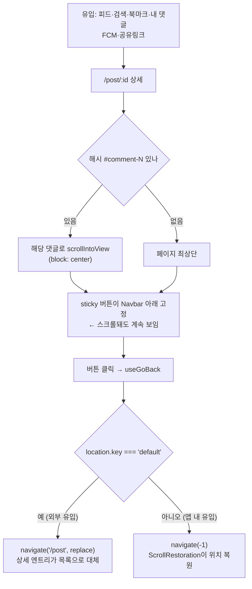

# 포스트 상세 돌아가기 버튼 — sticky 고정 + 라벨 정리

## Context

`origin/worktree-my-comments-fe`의 "내 댓글" 기능이 `/post/:id#comment-:id`로 상세에 진입하면서,
상세 페이지의 돌아가기 버튼이 가진 두 가지 문제가 드러났다.

**문제 1 — 진입 직후 버튼이 화면 밖에 있다.**
`CommentList.tsx`의 `scrollToHashedComment`가 해당 댓글로 `scrollIntoView({ block: 'center' })`를
실행하므로, 내 댓글 유입은 **이미 스크롤된 상태에서 화면이 시작**한다. 그런데
[PostDetailPage.tsx:37](../../src/pages/post/PostDetailPage.tsx)의
컨테이너는 sticky가 아니라 버튼이 페이지 최상단에 머문다.
여기에 `public/favicons/site.webmanifest`의 `"display": "standalone"`이 겹친다 — 홈 화면에
추가해 실행하면 브라우저 back 버튼 자체가 없다. 세 조건이 겹치면 **인앱 버튼도 브라우저
버튼도 화면에 없는 상태**가 된다.

**문제 2 — 라벨 "목록으로"가 유입 경로의 일부에서만 참이다.**
버튼은 `useGoBack`으로 이미 `navigate(-1)`이고, 라벨만 "목록으로"다. 유입 경로 7가지 중
피드·검색에서만 정확하고, 북마크·내 댓글에서는 어느 목록인지 모호하며, FCM·공유링크
유입에서는 가본 적 없는 `/post`를 "목록"이라 부른다.

**의도한 결과**: 어느 경로로 들어왔든 돌아갈 수단이 항상 화면에 있고, 버튼의 글자가
실제 동작과 어긋나지 않는다.

## 결정된 것과 결정할 것

| 항목                                                        | 상태                                                         |
| ----------------------------------------------------------- | ------------------------------------------------------------ |
| 동작(`navigate(-1)` + `key==='default'` 시 `/post` replace) | **그대로 유지** — 리서치가 지지, 변경 없음                   |
| 배치                                                        | **버튼만 sticky** (사용자 확정) — 헤더는 건드리지 않음       |
| 라벨(아이콘만 / 아이콘+텍스트)                              | **미정** — §9에 따라 미리보기 후 선택                        |
| 새 "목록으로" 버튼 추가                                     | **하지 않음** — 계층 이동은 기존 BottomTabBar·Sidebar가 담당 |

라벨을 미정으로 두는 이유: 원래 아이콘만이었다가 **터치 영역이 좁아** 텍스트를 넣어 넓힌
경위가 있다. 터치 타깃은 CSS로 따로 보장할 수 있으므로 라벨 선택을 강제하지 않지만,
어느 쪽이 나은지는 글로 설명하기보다 나란히 놓고 보는 편이 정확하다.

## 근거

- 동작 유지: Baymard가 목록 복원을 _"사용자가 기대하게 된 '웹 관례'"_ (번역, [출처](https://baymard.com/blog/return-same-place))로 집계.
  NN/g는 Wayfair 사례에서 사이트 back과 브라우저 back이 같은 목적지여야 한다고 본다([출처](https://www.nngroup.com/articles/user-control-and-freedom/)).
- 헤더 불변: velog·dev.to·네이버뉴스 3개 제품 390px 실측 — **셋 다 상세에서 헤더를 바꾸지 않고
  인앱 back도 없다**. 네이버뉴스는 목록 복귀를 상시 섹션 탭으로 제공한다.
- 새 버튼 없음: 위 실측에서 back+목록 두 버튼을 나란히 둔 사례를 찾지 못했다.
- sticky 신설: `responsive-ux` skill은 상세 같은 단일 컬럼에서 sticky보다 플로팅을 택해왔다고
  적는다 — 이번엔 그 관례에서 **의도적으로 벗어난다**. 상세의 플로팅 자리(`fixed bottom-6 right-6`)는
  `ScrollToCommentFormButton`이 이미 점유했고, 모바일 하단은 `BottomTabBar`+`MobileCommentBar`가
  채워 자리가 없다.
- standalone PWA 예외: Smashing Magazine이 브라우저 UI 없는 웹앱에 인앱 back을 권한다([출처](https://www.smashingmagazine.com/2017/11/designing-for-a-browserless-web/)).

상세 근거와 인용 원문은 구현 시 `docs/DECISIONS.md`에 남긴다.

## 흐름

## 작업 순서

작업 전 `git log origin/main..main`으로 미푸시 커밋을 확인하고 `EnterWorktree`로 워크트리를
만든 뒤 `cp ../../../.env .` + `pnpm install`.

### 1. 미리보기 아티팩트 → 라벨 선택 (구현 전)

실제 Tailwind 클래스와 `globals.css` 토큰을 그대로 써서 한 페이지에 나란히 배치:

- **A안** 아이콘만 — `size="icon"` + `h-11 w-11 md:h-9 md:w-9`(터치 44px 보장) + `aria-label`
- **B안** 아이콘 + "이전으로"
- **C안** 현행 아이콘 + "목록으로"

각 안을 sticky 적용 상태(모바일 390px / 데스크톱)로 보여준다. 사용자가 고른 뒤 2단계로.

### 2. sticky 적용 — `src/pages/post/PostDetailPage.tsx`

버튼을 감싸는 wrapper에 고정 스타일을 준다. Navbar가 `sticky top-0 z-nav`에 `h-16`이므로
그 바로 아래는 `top-16`, z는 한 단계 아래인 `z-panel`(`--z-index-panel: 40`).
Navbar와 같은 배경 처리(`bg-background/95 backdrop-blur`)를 써야 스크롤되는 본문이 비치지 않는다.

바깥 컨테이너의 `space-y-6`이 wrapper에도 걸리므로 간격이 어긋나지 않는지 확인한다.

### 3. 라벨 반영 — `src/shared/config/texts.ts`

A안 선택 시 텍스트가 사라지므로 `aria-label`로 옮긴다. **e2e 5개 파일이
`getByRole('button', { name: TEXTS.post.detail.backToList })`로 이 버튼을 찾으므로**
(`e2e/comment.spec.ts:89`, `post-visibility.spec.ts:90`, `like.spec.ts:50,74`,
`comment-delete.spec.ts:92`), aria-label에 같은 상수를 주면 e2e는 수정 없이 통과한다.
키 이름을 바꾸면 이 5개 파일도 함께 고쳐야 한다.

`ariaLabels` 네임스페이스에 이미 `backToFolderList: '폴더 목록으로'`(texts.ts:446)가 있어
같은 자리에 둔다.

### 4. 검증

1. `pnpm type-check`
2. `pnpm test`
3. `pnpm lint`
4. `pnpm test:e2e` — 위 5개 스펙이 버튼을 여전히 찾는지
5. `browser-verification` skill로 녹화 — 특히 **내 댓글 유입 재현**(해시로 스크롤된 상태에서
   버튼이 보이는지)과 **외부 유입 재현**(직접 URL 진입 후 버튼 클릭 시 `/post`로 replace되는지)
6. 375px에서 가로 스크롤 0, 터치 타깃 44px

### 5. 문서

- `CHANGELOG.md` `[Unreleased]`에 항목 추가
- `docs/DECISIONS.md`에 결정 기록 — Back vs Up 구분, 제품 3개 실측 결과, 채택되지 않은
  안(새 목록 버튼 추가, Navbar 통합, 브레드크럼)이 왜 졌는지 포함
- `pnpm check:docs`

## 범위 밖 (발견했지만 건드리지 않음)

- `PostCard.tsx:93`·`:269`가 `isDetail`일 때도 자기 자신(`/post/{id}`)을 링크해 상세에서
  제목을 누르면 히스토리가 쌓인다 — 별개 버그
- `src/app/routes/index.tsx:53-71`의 `state.from` dead read (아무도 쓰지 않음)
- 레포 루트에 남은 조사용 스크린샷(`velog-*.png`, `devto-detail.png`, `naver-news-detail.png`,
  기존 `final-scroll-gap-*.png`) 정리
